# Architecture Complète - Système de Notifications en Temps Réel

## Table des Matières
1. [Vue d'Ensemble](#vue-densemble)
2. [Architecture Globale](#architecture-globale)
3. [Modèle de Données](#modèle-de-données)
4. [Services Backend](#services-backend)
5. [API REST et WebSocket](#api-rest-et-websocket)
6. [Frontend - Store et Composants](#frontend---store-et-composants)
7. [Sécurité et Performance](#sécurité-et-performance)
8. [Stratégie de Test](#stratégie-de-test)
9. [Feuille de Route d'Implémentation](#feuille-de-route-dimplémentation)

---

## Vue d'Ensemble

### Contexte Actuel
Votre application Meeshy dispose déjà d'une base solide pour les notifications :
- **Modèle de données** : `Notification` et `NotificationPreference` dans Prisma
- **Service backend** : `NotificationService` avec Socket.IO et gestion anti-spam
- **Routes REST** : CRUD complet sur `/api/notifications`
- **Infrastructure Socket.IO** : `MeeshySocketIOManager` avec gestion des connexions

### Objectif de l'Architecture
Étendre et améliorer le système existant pour couvrir les **8 types de notifications** avec :
- Formatage contextuel intelligent (XXXX, YYYY, timestamps)
- Gestion des permissions granulaires
- Performance optimale (batch processing, pagination)
- UX riche (previews, actions rapides, grouping)

---

## Architecture Globale

### Diagramme de Composants (C4 - Niveau 2)


### Flux de Données pour les Notifications

```mermaid
sequenceDiagram
    participant User as User A
    participant Frontend as Frontend A
    participant Gateway as Gateway API
    participant Service as NotificationService
    participant DB as MongoDB
    participant SocketIO as Socket.IO
    participant UserB as User B Frontend

    User->>Frontend: Envoie message mentionnant @UserB
    Frontend->>Gateway: POST /api/messages
    Gateway->>Service: MessagingService.createMessage()
    Service->>DB: Crée Message
    Service->>Service: MentionService.extractMentions()
    Service->>Service: NotificationService.createMentionNotificationsBatch()

    par Sauvegarde DB et Émission Socket.IO
        Service->>DB: Créé notifications (batch)
        Service->>SocketIO: Émet événement "notification"
    end

    SocketIO->>UserB: Envoie notification via WebSocket
    UserB->>UserB: Affiche toast + met à jour badge

    Note over Service,DB: Notification persisted pour récupération ultérieure
    Note over SocketIO,UserB: Real-time si connecté, sinon polling au login
```



---

## Modèle de Données

### Schéma Prisma Existant (Améliorations Recommandées)

Le modèle `Notification` actuel est déjà robuste. Voici les améliorations à apporter :

```prisma
model Notification {
  id        String    @id @default(auto()) @map("_id") @db.ObjectId
  userId    String    @db.ObjectId

  // Types de notifications (ENUM recommandé pour validation stricte)
  type      NotificationType @default(NEW_MESSAGE)

  title     String
  content   String
  data      String?   // JSON stringifié pour données additionnelles
  priority  NotificationPriority @default(NORMAL)

  isRead    Boolean   @default(false)
  readAt    DateTime? // Timestamp de lecture (pour analytics)

  emailSent Boolean   @default(false)
  pushSent  Boolean   @default(false)
  expiresAt DateTime? // Auto-cleanup après X jours

  createdAt DateTime  @default(now())

  // Informations de l'expéditeur
  senderId       String?   @db.ObjectId
  senderUsername String?
  senderAvatar   String?

  // Aperçu du message (tronqué à 25 mots)
  messagePreview String?

  // Références pour navigation
  conversationId String?   @db.ObjectId
  messageId      String?   @db.ObjectId
  callSessionId  String?   @db.ObjectId
  friendRequestId String?  @db.ObjectId // NOUVEAU: pour invitations contact
  reactionId     String?   @db.ObjectId // NOUVEAU: pour réactions

  // Relations
  user      User         @relation(fields: [userId], references: [id], onDelete: Cascade)
  message   Message?     @relation("NotificationMessage", fields: [messageId], references: [id], onDelete: Cascade)
  reaction  Reaction?    @relation("NotificationReaction", fields: [reactionId], references: [id], onDelete: Cascade)

  // Index optimisés
  @@index([userId, isRead])
  @@index([userId, type])
  @@index([userId, createdAt])
  @@index([conversationId])
  @@index([messageId])
  @@index([expiresAt])
  @@map("notifications")
}

// NOUVEAU: Enum pour typage strict des notifications
enum NotificationType {
  NEW_MESSAGE              // Message de "XXXX"
  NEW_CONVERSATION_DIRECT  // Conversation avec "XXXX"
  NEW_CONVERSATION_GROUP   // Invitation de "XXXX" (groupe)
  MESSAGE_REPLY            // Réponse de "XXXX"
  MEMBER_JOINED            // "XXXX" a rejoint le groupe
  CONTACT_REQUEST          // "XXXX" veut se connecter
  CONTACT_ACCEPTED         // "XXXX" accepte la connexion
  USER_MENTIONED           // "XXXX" vous a cité
  MESSAGE_REACTION         // "XXXX" a réagi à votre message
  MISSED_CALL              // Appel manqué
  SYSTEM                   // Notification système
}

enum NotificationPriority {
  LOW      // Notification secondaire (membre rejoint)
  NORMAL   // Notification standard (message, mention)
  HIGH     // Notification importante (appel manqué, invitation)
  URGENT   // Notification critique (alerte sécurité)
}

model NotificationPreference {
  id                    String   @id @default(auto()) @map("_id") @db.ObjectId
  userId                String   @unique @db.ObjectId

  // Canaux de notification
  pushEnabled           Boolean  @default(true)
  emailEnabled          Boolean  @default(true)
  soundEnabled          Boolean  @default(true)

  // Préférences par type
  newMessageEnabled     Boolean  @default(true)
  replyEnabled          Boolean  @default(true) // NOUVEAU
  mentionEnabled        Boolean  @default(true) // NOUVEAU
  reactionEnabled       Boolean  @default(true) // NOUVEAU
  missedCallEnabled     Boolean  @default(true)
  systemEnabled         Boolean  @default(true)
  conversationEnabled   Boolean  @default(true)
  contactRequestEnabled Boolean  @default(true) // NOUVEAU
  memberJoinedEnabled   Boolean  @default(false) // NOUVEAU: off par défaut

  // Do Not Disturb
  dndEnabled            Boolean  @default(false)
  dndStartTime          String?  // Format: "22:00"
  dndEndTime            String?  // Format: "08:00"

  // NOUVEAU: Préférences par conversation (mute spécifique)
  mutedConversations    String[] @default([]) @db.ObjectId

  createdAt             DateTime @default(now())
  updatedAt             DateTime @updatedAt

  user                  User     @relation(fields: [userId], references: [id], onDelete: Cascade)

  @@map("notification_preferences")
}
```

### Structure des Payloads Socket.IO

```typescript
// Type d'événement Socket.IO pour notifications
interface NotificationEventData {
  id: string;
  userId: string;
  type: NotificationType;
  title: string;
  content: string;
  priority: NotificationPriority;
  isRead: boolean;
  createdAt: Date;

  // Métadonnées de l'expéditeur
  sender?: {
    id: string;
    username: string;
    avatar?: string;
  };

  // Aperçu du contenu
  messagePreview?: string;

  // Contexte de navigation
  context?: {
    conversationId?: string;
    conversationTitle?: string;
    conversationType?: 'direct' | 'group' | 'public' | 'global';
    messageId?: string;
    callSessionId?: string;
    friendRequestId?: string;
  };

  // Données enrichies pour l'UI
  metadata?: {
    attachments?: {
      count: number;
      firstType: 'image' | 'video' | 'audio' | 'document';
      firstFilename: string;
    };
    reactionEmoji?: string;
    memberCount?: number;
    action?: 'view_message' | 'join_conversation' | 'accept_contact' | 'open_call';
  };
}
```

---

## Services Backend

### NotificationService (Extension du service existant)

Votre `NotificationService` existant est déjà excellent. Voici les méthodes à ajouter :

```typescript
export class NotificationService {
  // ... méthodes existantes ...

  /**
   * NOUVEAU: Créer notification de réponse à un message
   */
  async createReplyNotification(data: {
    originalMessageAuthorId: string;
    replierId: string;
    replierUsername: string;
    replierAvatar?: string;
    replyContent: string;
    conversationId: string;
    conversationTitle?: string;
    originalMessageId: string;
    replyMessageId: string;
    attachments?: AttachmentPreview[];
  }): Promise<NotificationEventData | null> {
    // Ne pas notifier si l'auteur répond à son propre message
    if (data.originalMessageAuthorId === data.replierId) {
      return null;
    }

    const messagePreview = this.formatMessagePreview(
      data.replyContent,
      data.attachments
    );

    const title = `Réponse de ${data.replierUsername}`;
    const content = messagePreview;

    return this.createNotification({
      userId: data.originalMessageAuthorId,
      type: NotificationType.MESSAGE_REPLY,
      title,
      content,
      priority: 'normal',
      senderId: data.replierId,
      senderUsername: data.replierUsername,
      senderAvatar: data.replierAvatar,
      messagePreview,
      conversationId: data.conversationId,
      messageId: data.replyMessageId,
      data: {
        originalMessageId: data.originalMessageId,
        conversationTitle: data.conversationTitle,
        attachments: this.formatAttachmentInfo(data.attachments),
        action: 'view_message'
      }
    });
  }

  /**
   * NOUVEAU: Créer notification de membre qui rejoint un groupe
   * Envoyée uniquement aux admins/créateur
   */
  async createMemberJoinedNotification(data: {
    groupId: string;
    groupTitle: string;
    newMemberId: string;
    newMemberUsername: string;
    newMemberAvatar?: string;
    adminIds: string[]; // Liste des admins à notifier
  }): Promise<number> {
    if (adminIds.length === 0) return 0;

    const title = `Nouveau membre dans "${data.groupTitle}"`;
    const content = `${data.newMemberUsername} a rejoint le groupe`;

    // Créer en batch pour tous les admins
    const notificationsData = adminIds.map(adminId => ({
      userId: adminId,
      type: NotificationType.MEMBER_JOINED,
      title,
      content,
      priority: 'low',
      senderId: data.newMemberId,
      senderUsername: data.newMemberUsername,
      senderAvatar: data.newMemberAvatar,
      conversationId: data.groupId,
      data: JSON.stringify({
        groupTitle: data.groupTitle,
        action: 'view_conversation'
      }),
      isRead: false
    }));

    const result = await this.prisma.notification.createMany({
      data: notificationsData
    });

    // Émettre via Socket.IO
    const createdNotifications = await this.prisma.notification.findMany({
      where: {
        conversationId: data.groupId,
        type: NotificationType.MEMBER_JOINED,
        userId: { in: adminIds },
        senderId: data.newMemberId
      },
      orderBy: { createdAt: 'desc' },
      take: adminIds.length
    });

    for (const notification of createdNotifications) {
      this.emitNotification(notification.userId, this.formatNotificationEvent(notification));
    }

    return result.count;
  }

  /**
   * NOUVEAU: Créer notification de demande de contact
   */
  async createContactRequestNotification(data: {
    recipientId: string;
    requesterId: string;
    requesterUsername: string;
    requesterAvatar?: string;
    message?: string;
    friendRequestId: string;
  }): Promise<NotificationEventData | null> {
    const title = `${data.requesterUsername} veut se connecter`;
    const content = data.message || `${data.requesterUsername} vous a envoyé une invitation`;

    return this.createNotification({
      userId: data.recipientId,
      type: NotificationType.CONTACT_REQUEST,
      title,
      content,
      priority: 'high',
      senderId: data.requesterId,
      senderUsername: data.requesterUsername,
      senderAvatar: data.requesterAvatar,
      data: {
        friendRequestId: data.friendRequestId,
        message: data.message,
        action: 'accept_or_reject_contact'
      }
    });
  }

  /**
   * NOUVEAU: Créer notification d'acceptation de contact
   */
  async createContactAcceptedNotification(data: {
    requesterId: string; // L'utilisateur qui avait envoyé la demande
    accepterId: string;
    accepterUsername: string;
    accepterAvatar?: string;
    conversationId: string; // Conversation créée automatiquement
  }): Promise<NotificationEventData | null> {
    const title = `${data.accepterUsername} accepte la connexion`;
    const content = `${data.accepterUsername} a accepté votre invitation. Vous pouvez maintenant discuter ensemble.`;

    return this.createNotification({
      userId: data.requesterId,
      type: NotificationType.CONTACT_ACCEPTED,
      title,
      content,
      priority: 'normal',
      senderId: data.accepterId,
      senderUsername: data.accepterUsername,
      senderAvatar: data.accepterAvatar,
      conversationId: data.conversationId,
      data: {
        conversationId: data.conversationId,
        action: 'view_conversation'
      }
    });
  }

  /**
   * NOUVEAU: Créer notification de réaction à un message
   */
  async createReactionNotification(data: {
    messageAuthorId: string;
    reactorId: string;
    reactorUsername: string;
    reactorAvatar?: string;
    emoji: string;
    messageContent: string;
    conversationId: string;
    conversationTitle?: string;
    messageId: string;
    reactionId: string;
  }): Promise<NotificationEventData | null> {
    // Ne pas notifier si l'utilisateur réagit à son propre message
    if (data.messageAuthorId === data.reactorId) {
      return null;
    }

    const messagePreview = this.truncateMessage(data.messageContent, 15);
    const title = `${data.reactorUsername} a réagi à votre message`;
    const content = `${data.emoji} ${messagePreview}`;

    return this.createNotification({
      userId: data.messageAuthorId,
      type: NotificationType.MESSAGE_REACTION,
      title,
      content,
      priority: 'low',
      senderId: data.reactorId,
      senderUsername: data.reactorUsername,
      senderAvatar: data.reactorAvatar,
      messagePreview,
      conversationId: data.conversationId,
      messageId: data.messageId,
      data: {
        reactionId: data.reactionId,
        emoji: data.emoji,
        conversationTitle: data.conversationTitle,
        action: 'view_message'
      }
    });
  }

  /**
   * Helper: Formater l'aperçu d'un message avec attachments
   */
  private formatMessagePreview(
    content: string,
    attachments?: AttachmentPreview[]
  ): string {
    let preview = '';

    if (attachments && attachments.length > 0) {
      const attachment = attachments[0];
      const icon = this.getAttachmentIcon(attachment.mimeType);
      const count = attachments.length > 1 ? ` (+${attachments.length - 1})` : '';

      if (content.trim()) {
        preview = `${this.truncateMessage(content, 15)} ${icon}${count}`;
      } else {
        preview = `${icon}${count}`;
      }
    } else {
      preview = this.truncateMessage(content, 25);
    }

    return preview;
  }

  /**
   * Helper: Icône d'attachment selon le type MIME
   */
  private getAttachmentIcon(mimeType: string): string {
    const type = mimeType.split('/')[0];
    const icons = {
      image: '📷 Photo',
      video: '🎥 Vidéo',
      audio: '🎵 Audio',
      application: mimeType === 'application/pdf' ? '📄 PDF' : '📎 Document',
    };
    return icons[type as keyof typeof icons] || '📎 Fichier';
  }

  /**
   * Helper: Formater les infos d'attachments pour le payload
   */
  private formatAttachmentInfo(attachments?: AttachmentPreview[]) {
    if (!attachments || attachments.length === 0) return null;

    const first = attachments[0];
    return {
      count: attachments.length,
      firstType: first.mimeType.split('/')[0],
      firstFilename: first.originalName,
      firstMimeType: first.mimeType
    };
  }

  /**
   * Vérifier si une conversation est muted pour un utilisateur
   */
  private async isConversationMuted(
    userId: string,
    conversationId: string
  ): Promise<boolean> {
    const preferences = await this.prisma.notificationPreference.findUnique({
      where: { userId },
      select: { mutedConversations: true }
    });

    return preferences?.mutedConversations.includes(conversationId) || false;
  }

  /**
   * Mise à jour de shouldSendNotification pour vérifier le mute
   */
  private async shouldSendNotification(
    userId: string,
    type: NotificationType,
    conversationId?: string
  ): Promise<boolean> {
    // Vérifier mute de conversation spécifique
    if (conversationId && await this.isConversationMuted(userId, conversationId)) {
      return false;
    }

    // ... reste de la logique existante ...
  }
}

interface AttachmentPreview {
  id: string;
  originalName: string;
  mimeType: string;
  fileSize: number;
}
```

### Intégration avec les Services Existants

#### MessagingService

```typescript
export class MessagingService {
  // ... code existant ...

  async createMessage(data: MessageRequest): Promise<MessageResponse> {
    // ... création du message ...

    // NOTIFICATION 1: Message normal (si pas de replyTo)
    if (!data.replyToId) {
      await this.notifyConversationMembers(message, conversation);
    }

    // NOTIFICATION 2: Réponse à un message
    if (data.replyToId) {
      await this.notifyMessageReply(message, conversation);
    }

    // NOTIFICATION 3: Mentions
    if (validatedMentions.length > 0) {
      await this.notifyMentions(message, validatedMentions, conversation);
    }

    return message;
  }

  private async notifyMessageReply(
    message: Message,
    conversation: Conversation
  ): Promise<void> {
    const originalMessage = await this.prisma.message.findUnique({
      where: { id: message.replyToId! },
      include: { sender: true }
    });

    if (!originalMessage || !originalMessage.sender) return;

    await this.notificationService.createReplyNotification({
      originalMessageAuthorId: originalMessage.senderId!,
      replierId: message.senderId!,
      replierUsername: message.sender.username,
      replierAvatar: message.sender.avatar,
      replyContent: message.content,
      conversationId: conversation.id,
      conversationTitle: conversation.title,
      originalMessageId: originalMessage.id,
      replyMessageId: message.id,
      attachments: message.attachments
    });
  }

  private async notifyConversationMembers(
    message: Message,
    conversation: Conversation
  ): Promise<void> {
    const members = await this.prisma.conversationMember.findMany({
      where: {
        conversationId: conversation.id,
        userId: { not: message.senderId }, // Ne pas notifier l'expéditeur
        isActive: true
      },
      include: { user: true }
    });

    for (const member of members) {
      await this.notificationService.createMessageNotification({
        recipientId: member.userId,
        senderId: message.senderId!,
        senderUsername: message.sender.username,
        senderAvatar: message.sender.avatar,
        messageContent: message.content,
        conversationId: conversation.id,
        messageId: message.id,
        conversationIdentifier: conversation.identifier,
        conversationType: conversation.type,
        conversationTitle: conversation.title,
        attachments: message.attachments
      });
    }
  }
}
```

#### ReactionService

```typescript
export class ReactionService {
  constructor(
    private prisma: PrismaClient,
    private notificationService: NotificationService
  ) {}

  async addReaction(data: {
    messageId: string;
    userId: string;
    emoji: string;
  }): Promise<Reaction> {
    // Créer la réaction
    const reaction = await this.prisma.reaction.create({
      data: {
        messageId: data.messageId,
        userId: data.userId,
        emoji: data.emoji
      },
      include: {
        user: true,
        message: {
          include: {
            sender: true,
            conversation: true
          }
        }
      }
    });

    // NOTIFICATION: Réaction ajoutée
    if (reaction.message.sender) {
      await this.notificationService.createReactionNotification({
        messageAuthorId: reaction.message.senderId!,
        reactorId: data.userId,
        reactorUsername: reaction.user.username,
        reactorAvatar: reaction.user.avatar,
        emoji: data.emoji,
        messageContent: reaction.message.content,
        conversationId: reaction.message.conversationId,
        conversationTitle: reaction.message.conversation.title,
        messageId: data.messageId,
        reactionId: reaction.id
      });
    }

    return reaction;
  }
}
```

#### ConversationService (Nouveau)

```typescript
export class ConversationService {
  constructor(
    private prisma: PrismaClient,
    private notificationService: NotificationService
  ) {}

  /**
   * Ajouter un membre à une conversation de groupe
   */
  async addMemberToGroup(data: {
    conversationId: string;
    newMemberId: string;
    inviterId: string;
  }): Promise<ConversationMember> {
    const conversation = await this.prisma.conversation.findUnique({
      where: { id: data.conversationId },
      include: {
        members: {
          where: { role: { in: ['admin', 'creator'] } },
          include: { user: true }
        }
      }
    });

    if (!conversation) throw new Error('Conversation not found');

    // Créer le membre
    const member = await this.prisma.conversationMember.create({
      data: {
        conversationId: data.conversationId,
        userId: data.newMemberId,
        role: 'member'
      },
      include: { user: true }
    });

    // NOTIFICATION 1: Confirmation pour le nouveau membre
    await this.notificationService.createConversationJoinNotification({
      userId: data.newMemberId,
      conversationId: data.conversationId,
      conversationTitle: conversation.title,
      conversationType: conversation.type,
      isJoiner: true
    });

    // NOTIFICATION 2: Notification aux admins
    const adminIds = conversation.members.map(m => m.userId);
    await this.notificationService.createMemberJoinedNotification({
      groupId: data.conversationId,
      groupTitle: conversation.title || 'Groupe',
      newMemberId: data.newMemberId,
      newMemberUsername: member.user.username,
      newMemberAvatar: member.user.avatar,
      adminIds
    });

    return member;
  }
}
```

#### FriendRequestService (Nouveau)

```typescript
export class FriendRequestService {
  constructor(
    private prisma: PrismaClient,
    private notificationService: NotificationService
  ) {}

  /**
   * Envoyer une demande de contact
   */
  async sendFriendRequest(data: {
    senderId: string;
    receiverId: string;
    message?: string;
  }): Promise<FriendRequest> {
    const sender = await this.prisma.user.findUnique({
      where: { id: data.senderId }
    });

    if (!sender) throw new Error('Sender not found');

    const friendRequest = await this.prisma.friendRequest.create({
      data: {
        senderId: data.senderId,
        receiverId: data.receiverId,
        message: data.message,
        status: 'pending'
      }
    });

    // NOTIFICATION: Demande de contact
    await this.notificationService.createContactRequestNotification({
      recipientId: data.receiverId,
      requesterId: data.senderId,
      requesterUsername: sender.username,
      requesterAvatar: sender.avatar,
      message: data.message,
      friendRequestId: friendRequest.id
    });

    return friendRequest;
  }

  /**
   * Accepter une demande de contact
   */
  async acceptFriendRequest(data: {
    friendRequestId: string;
    accepterId: string;
  }): Promise<{ friendRequest: FriendRequest; conversation: Conversation }> {
    const friendRequest = await this.prisma.friendRequest.findUnique({
      where: { id: data.friendRequestId },
      include: { sender: true, receiver: true }
    });

    if (!friendRequest) throw new Error('Friend request not found');
    if (friendRequest.receiverId !== data.accepterId) {
      throw new Error('Unauthorized');
    }

    // Mettre à jour le statut
    await this.prisma.friendRequest.update({
      where: { id: data.friendRequestId },
      data: { status: 'accepted' }
    });

    // Créer une conversation directe
    const conversation = await this.createDirectConversation({
      userIds: [friendRequest.senderId, friendRequest.receiverId]
    });

    // NOTIFICATION: Acceptation de contact
    await this.notificationService.createContactAcceptedNotification({
      requesterId: friendRequest.senderId,
      accepterId: data.accepterId,
      accepterUsername: friendRequest.receiver.username,
      accepterAvatar: friendRequest.receiver.avatar,
      conversationId: conversation.id
    });

    return { friendRequest, conversation };
  }

  private async createDirectConversation(data: {
    userIds: string[];
  }): Promise<Conversation> {
    // ... logique de création de conversation directe ...
  }
}
```

---

## API REST et WebSocket

### Endpoints REST

Vos endpoints existants sont déjà complets. Voici les ajouts recommandés :

```typescript
// /gateway/src/routes/notifications.ts

export async function notificationRoutes(fastify: FastifyInstance) {
  // ... routes existantes ...

  /**
   * NOUVEAU: Marquer les notifications d'une conversation comme lues
   * POST /api/notifications/conversations/:conversationId/mark-read
   */
  fastify.post('/notifications/conversations/:conversationId/mark-read', {
    onRequest: [fastify.authenticate]
  }, async (request: FastifyRequest, reply: FastifyReply) => {
    const { conversationId } = request.params as { conversationId: string };
    const { userId } = request.user as any;

    const count = await fastify.notificationService.markConversationNotificationsAsRead(
      userId,
      conversationId
    );

    return reply.send({
      success: true,
      message: `${count} notifications marquées comme lues`,
      data: { count }
    });
  });

  /**
   * NOUVEAU: Muter/Unmuter une conversation
   * POST /api/notifications/conversations/:conversationId/mute
   */
  fastify.post('/notifications/conversations/:conversationId/mute', {
    onRequest: [fastify.authenticate]
  }, async (request: FastifyRequest, reply: FastifyReply) => {
    const { conversationId } = request.params as { conversationId: string };
    const { userId } = request.user as any;
    const { muted } = request.body as { muted: boolean };

    const preferences = await fastify.prisma.notificationPreference.findUnique({
      where: { userId }
    });

    let mutedConversations = preferences?.mutedConversations || [];

    if (muted) {
      if (!mutedConversations.includes(conversationId)) {
        mutedConversations.push(conversationId);
      }
    } else {
      mutedConversations = mutedConversations.filter(id => id !== conversationId);
    }

    await fastify.prisma.notificationPreference.upsert({
      where: { userId },
      create: {
        userId,
        mutedConversations
      },
      update: {
        mutedConversations
      }
    });

    return reply.send({
      success: true,
      message: muted ? 'Conversation muted' : 'Conversation unmuted',
      data: { conversationId, muted }
    });
  });

  /**
   * NOUVEAU: Grouper les notifications par type ou conversation
   * GET /api/notifications/grouped
   */
  fastify.get('/notifications/grouped', {
    onRequest: [fastify.authenticate]
  }, async (request: FastifyRequest, reply: FastifyReply) => {
    const { userId } = request.user as any;
    const { groupBy = 'conversation' } = request.query as any;

    const notifications = await fastify.prisma.notification.findMany({
      where: { userId, isRead: false },
      orderBy: { createdAt: 'desc' },
      take: 100
    });

    let grouped: Record<string, any[]>;

    if (groupBy === 'conversation') {
      grouped = notifications.reduce((acc, notif) => {
        const key = notif.conversationId || 'other';
        if (!acc[key]) acc[key] = [];
        acc[key].push(notif);
        return acc;
      }, {} as Record<string, any[]>);
    } else if (groupBy === 'type') {
      grouped = notifications.reduce((acc, notif) => {
        if (!acc[notif.type]) acc[notif.type] = [];
        acc[notif.type].push(notif);
        return acc;
      }, {} as Record<string, any[]>);
    } else {
      grouped = { all: notifications };
    }

    return reply.send({
      success: true,
      data: grouped
    });
  });

  /**
   * NOUVEAU: Récupérer une notification spécifique avec contexte enrichi
   * GET /api/notifications/:id/details
   */
  fastify.get('/notifications/:id/details', {
    onRequest: [fastify.authenticate]
  }, async (request: FastifyRequest, reply: FastifyReply) => {
    const { id } = request.params as { id: string };
    const { userId } = request.user as any;

    const notification = await fastify.prisma.notification.findFirst({
      where: { id, userId },
      include: {
        message: {
          include: {
            attachments: true,
            sender: {
              select: {
                id: true,
                username: true,
                avatar: true,
                displayName: true
              }
            },
            conversation: {
              select: {
                id: true,
                identifier: true,
                title: true,
                type: true
              }
            }
          }
        }
      }
    });

    if (!notification) {
      return reply.status(404).send({
        success: false,
        message: 'Notification not found'
      });
    }

    return reply.send({
      success: true,
      data: notification
    });
  });
}
```

### Événements Socket.IO

```typescript
// Types d'événements (shared/types/socketio-events.ts)

export const CLIENT_EVENTS = {
  // ... événements existants ...
  NOTIFICATION_READ: 'notification:read',
  NOTIFICATION_READ_ALL: 'notification:read_all',
  NOTIFICATION_DELETE: 'notification:delete',
} as const;

export const SERVER_EVENTS = {
  // ... événements existants ...
  NOTIFICATION: 'notification',
  NOTIFICATION_UPDATED: 'notification:updated',
  NOTIFICATION_DELETED: 'notification:deleted',
  NOTIFICATION_BADGE_UPDATE: 'notification:badge_update',
} as const;
```

```typescript
// Handler Socket.IO (dans MeeshySocketIOManager.ts)

private _setupNotificationEvents(socket: Socket): void {
  // Client demande à marquer une notification comme lue
  socket.on(CLIENT_EVENTS.NOTIFICATION_READ, async (data: { notificationId: string }) => {
    const userId = this.socketToUser.get(socket.id);
    if (!userId) return;

    const success = await this.notificationService.markAsRead(data.notificationId, userId);

    if (success) {
      const unreadCount = await this.notificationService.getUnreadCount(userId);

      // Émettre la mise à jour du badge à tous les sockets de l'utilisateur
      this.sendToUser(userId, SERVER_EVENTS.NOTIFICATION_BADGE_UPDATE, {
        unreadCount
      });
    }
  });

  // Client demande à marquer toutes les notifications comme lues
  socket.on(CLIENT_EVENTS.NOTIFICATION_READ_ALL, async () => {
    const userId = this.socketToUser.get(socket.id);
    if (!userId) return;

    await this.notificationService.markAllAsRead(userId);

    this.sendToUser(userId, SERVER_EVENTS.NOTIFICATION_BADGE_UPDATE, {
      unreadCount: 0
    });
  });

  // Client supprime une notification
  socket.on(CLIENT_EVENTS.NOTIFICATION_DELETE, async (data: { notificationId: string }) => {
    const userId = this.socketToUser.get(socket.id);
    if (!userId) return;

    const success = await this.notificationService.deleteNotification(data.notificationId, userId);

    if (success) {
      const unreadCount = await this.notificationService.getUnreadCount(userId);

      this.sendToUser(userId, SERVER_EVENTS.NOTIFICATION_DELETED, {
        notificationId: data.notificationId,
        unreadCount
      });
    }
  });
}
```

---

## Frontend - Store et Composants

### Zustand Store

```typescript
// /apps/web/stores/notification-store.ts

import { create } from 'zustand';
import { devtools, persist } from 'zustand/middleware';
import type { NotificationEventData } from '@/types/notification';

interface NotificationState {
  // État
  notifications: NotificationEventData[];
  unreadCount: number;
  isLoading: boolean;
  hasMore: boolean;
  page: number;

  // Actions - Chargement
  fetchNotifications: (page?: number, filters?: NotificationFilters) => Promise<void>;
  fetchUnreadCount: () => Promise<void>;
  refreshNotifications: () => Promise<void>;

  // Actions - Modification
  markAsRead: (notificationId: string) => Promise<void>;
  markAllAsRead: () => Promise<void>;
  deleteNotification: (notificationId: string) => Promise<void>;
  deleteAllRead: () => Promise<void>;

  // Actions - Real-time
  addNotification: (notification: NotificationEventData) => void;
  updateNotification: (notificationId: string, updates: Partial<NotificationEventData>) => void;
  updateUnreadCount: (count: number) => void;

  // Actions - Grouping
  getGroupedByConversation: () => Record<string, NotificationEventData[]>;
  getGroupedByType: () => Record<string, NotificationEventData[]>;

  // Reset
  reset: () => void;
}

export interface NotificationFilters {
  type?: NotificationType;
  unreadOnly?: boolean;
  conversationId?: string;
}

export const useNotificationStore = create<NotificationState>()(
  devtools(
    persist(
      (set, get) => ({
        // État initial
        notifications: [],
        unreadCount: 0,
        isLoading: false,
        hasMore: true,
        page: 1,

        // Chargement des notifications
        fetchNotifications: async (page = 1, filters) => {
          set({ isLoading: true });

          try {
            const params = new URLSearchParams({
              page: page.toString(),
              limit: '20',
              ...(filters?.unreadOnly && { unread: 'true' }),
              ...(filters?.type && { type: filters.type }),
              ...(filters?.conversationId && { conversationId: filters.conversationId })
            });

            const response = await fetch(`/api/notifications?${params}`, {
              credentials: 'include'
            });

            if (!response.ok) throw new Error('Failed to fetch notifications');

            const data = await response.json();

            set(state => ({
              notifications: page === 1
                ? data.data.notifications
                : [...state.notifications, ...data.data.notifications],
              unreadCount: data.data.unreadCount,
              hasMore: data.data.pagination.hasMore,
              page: data.data.pagination.page,
              isLoading: false
            }));
          } catch (error) {
            console.error('Error fetching notifications:', error);
            set({ isLoading: false });
          }
        },

        fetchUnreadCount: async () => {
          try {
            const response = await fetch('/api/notifications/stats', {
              credentials: 'include'
            });

            if (!response.ok) throw new Error('Failed to fetch unread count');

            const data = await response.json();
            set({ unreadCount: data.data.unread });
          } catch (error) {
            console.error('Error fetching unread count:', error);
          }
        },

        refreshNotifications: async () => {
          await get().fetchNotifications(1);
        },

        // Marquer comme lu
        markAsRead: async (notificationId: string) => {
          try {
            const response = await fetch(`/api/notifications/${notificationId}/read`, {
              method: 'PATCH',
              credentials: 'include'
            });

            if (!response.ok) throw new Error('Failed to mark as read');

            set(state => ({
              notifications: state.notifications.map(n =>
                n.id === notificationId ? { ...n, isRead: true } : n
              ),
              unreadCount: Math.max(0, state.unreadCount - 1)
            }));
          } catch (error) {
            console.error('Error marking notification as read:', error);
          }
        },

        markAllAsRead: async () => {
          try {
            const response = await fetch('/api/notifications/read-all', {
              method: 'PATCH',
              credentials: 'include'
            });

            if (!response.ok) throw new Error('Failed to mark all as read');

            set(state => ({
              notifications: state.notifications.map(n => ({ ...n, isRead: true })),
              unreadCount: 0
            }));
          } catch (error) {
            console.error('Error marking all as read:', error);
          }
        },

        deleteNotification: async (notificationId: string) => {
          try {
            const response = await fetch(`/api/notifications/${notificationId}`, {
              method: 'DELETE',
              credentials: 'include'
            });

            if (!response.ok) throw new Error('Failed to delete notification');

            set(state => {
              const notification = state.notifications.find(n => n.id === notificationId);
              const wasUnread = notification && !notification.isRead;

              return {
                notifications: state.notifications.filter(n => n.id !== notificationId),
                unreadCount: wasUnread ? Math.max(0, state.unreadCount - 1) : state.unreadCount
              };
            });
          } catch (error) {
            console.error('Error deleting notification:', error);
          }
        },

        deleteAllRead: async () => {
          try {
            const response = await fetch('/api/notifications/read', {
              method: 'DELETE',
              credentials: 'include'
            });

            if (!response.ok) throw new Error('Failed to delete read notifications');

            set(state => ({
              notifications: state.notifications.filter(n => !n.isRead)
            }));
          } catch (error) {
            console.error('Error deleting read notifications:', error);
          }
        },

        // Real-time updates
        addNotification: (notification: NotificationEventData) => {
          set(state => {
            // Éviter les doublons
            if (state.notifications.some(n => n.id === notification.id)) {
              return state;
            }

            return {
              notifications: [notification, ...state.notifications],
              unreadCount: state.unreadCount + 1
            };
          });
        },

        updateNotification: (notificationId: string, updates: Partial<NotificationEventData>) => {
          set(state => ({
            notifications: state.notifications.map(n =>
              n.id === notificationId ? { ...n, ...updates } : n
            )
          }));
        },

        updateUnreadCount: (count: number) => {
          set({ unreadCount: count });
        },

        // Grouping
        getGroupedByConversation: () => {
          const { notifications } = get();

          return notifications.reduce((acc, notif) => {
            const key = notif.context?.conversationId || 'other';
            if (!acc[key]) acc[key] = [];
            acc[key].push(notif);
            return acc;
          }, {} as Record<string, NotificationEventData[]>);
        },

        getGroupedByType: () => {
          const { notifications } = get();

          return notifications.reduce((acc, notif) => {
            if (!acc[notif.type]) acc[notif.type] = [];
            acc[notif.type].push(notif);
            return acc;
          }, {} as Record<string, NotificationEventData[]>);
        },

        // Reset
        reset: () => {
          set({
            notifications: [],
            unreadCount: 0,
            isLoading: false,
            hasMore: true,
            page: 1
          });
        }
      }),
      {
        name: 'notification-store',
        partialize: (state) => ({
          // Ne persister que le compteur pour éviter des notifications obsolètes
          unreadCount: state.unreadCount
        })
      }
    )
  )
);
```

### Hook Custom pour Real-Time

```typescript
// /apps/web/hooks/use-notifications.ts

import { useEffect, useCallback, useRef } from 'react';
import { useNotificationStore } from '@/stores/notification-store';
import { useWebSocket } from './use-websocket';
import { useAuthStore } from '@/stores/auth-store';
import { toast } from 'sonner';
import { SERVER_EVENTS } from '@/types/socketio-events';
import type { NotificationEventData } from '@/types/notification';

export function useNotifications() {
  const socket = useWebSocket();
  const { user } = useAuthStore();
  const {
    notifications,
    unreadCount,
    isLoading,
    hasMore,
    fetchNotifications,
    fetchUnreadCount,
    markAsRead,
    markAllAsRead,
    deleteNotification,
    addNotification,
    updateUnreadCount,
    refreshNotifications
  } = useNotificationStore();

  const isInitialized = useRef(false);

  // Charger les notifications au montage
  useEffect(() => {
    if (user && !isInitialized.current) {
      fetchNotifications();
      fetchUnreadCount();
      isInitialized.current = true;
    }
  }, [user, fetchNotifications, fetchUnreadCount]);

  // Écouter les événements Socket.IO
  useEffect(() => {
    if (!socket) return;

    // Nouvelle notification reçue
    const handleNotification = (notification: NotificationEventData) => {
      console.log('📢 [WS] Notification reçue:', notification);

      // Ajouter au store
      addNotification(notification);

      // Afficher un toast si l'utilisateur n'est pas sur la page de notifications
      if (!window.location.pathname.includes('/notifications')) {
        showNotificationToast(notification);
      }

      // Jouer un son (optionnel)
      playNotificationSound();
    };

    // Mise à jour du badge de compteur
    const handleBadgeUpdate = (data: { unreadCount: number }) => {
      console.log('📢 [WS] Badge update:', data.unreadCount);
      updateUnreadCount(data.unreadCount);
    };

    // Notification supprimée
    const handleNotificationDeleted = (data: { notificationId: string; unreadCount: number }) => {
      console.log('📢 [WS] Notification deleted:', data.notificationId);
      updateUnreadCount(data.unreadCount);
    };

    socket.on(SERVER_EVENTS.NOTIFICATION, handleNotification);
    socket.on(SERVER_EVENTS.NOTIFICATION_BADGE_UPDATE, handleBadgeUpdate);
    socket.on(SERVER_EVENTS.NOTIFICATION_DELETED, handleNotificationDeleted);

    return () => {
      socket.off(SERVER_EVENTS.NOTIFICATION, handleNotification);
      socket.off(SERVER_EVENTS.NOTIFICATION_BADGE_UPDATE, handleBadgeUpdate);
      socket.off(SERVER_EVENTS.NOTIFICATION_DELETED, handleNotificationDeleted);
    };
  }, [socket, addNotification, updateUnreadCount]);

  // Helper: Afficher un toast pour une notification
  const showNotificationToast = (notification: NotificationEventData) => {
    const options = {
      duration: 5000,
      action: notification.metadata?.action
        ? {
            label: 'Voir',
            onClick: () => handleNotificationClick(notification)
          }
        : undefined
    };

    // Icône selon le type
    const icon = getNotificationIcon(notification.type);

    toast(`${icon} ${notification.title}`, {
      description: notification.content,
      ...options
    });
  };

  // Helper: Jouer un son de notification
  const playNotificationSound = () => {
    // Vérifier les préférences utilisateur
    const soundEnabled = true; // À récupérer depuis NotificationPreference

    if (soundEnabled) {
      const audio = new Audio('/sounds/notification.mp3');
      audio.volume = 0.5;
      audio.play().catch(err => console.error('Could not play sound:', err));
    }
  };

  // Helper: Gérer le clic sur une notification
  const handleNotificationClick = useCallback((notification: NotificationEventData) => {
    // Marquer comme lue
    if (!notification.isRead) {
      markAsRead(notification.id);
    }

    // Navigation selon le contexte
    const { context, metadata } = notification;

    if (context?.conversationId) {
      // Naviguer vers la conversation
      window.location.href = `/chat/${context.conversationId}${
        context.messageId ? `?message=${context.messageId}` : ''
      }`;
    } else if (metadata?.action === 'accept_contact') {
      // Ouvrir le modal d'acceptation de contact
      window.location.href = `/contacts?friendRequest=${context?.friendRequestId}`;
    } else if (context?.callSessionId) {
      // Ouvrir l'historique des appels
      window.location.href = `/calls/${context.callSessionId}`;
    }
  }, [markAsRead]);

  // Charger plus de notifications (pagination infinie)
  const loadMore = useCallback(() => {
    if (!isLoading && hasMore) {
      fetchNotifications(useNotificationStore.getState().page + 1);
    }
  }, [isLoading, hasMore, fetchNotifications]);

  return {
    notifications,
    unreadCount,
    isLoading,
    hasMore,
    markAsRead,
    markAllAsRead,
    deleteNotification,
    refreshNotifications,
    loadMore,
    handleNotificationClick
  };
}

// Helper: Icône selon le type de notification
function getNotificationIcon(type: string): string {
  const icons: Record<string, string> = {
    NEW_MESSAGE: '💬',
    NEW_CONVERSATION_DIRECT: '👤',
    NEW_CONVERSATION_GROUP: '👥',
    MESSAGE_REPLY: '↩️',
    MEMBER_JOINED: '👋',
    CONTACT_REQUEST: '🤝',
    CONTACT_ACCEPTED: '✅',
    USER_MENTIONED: '@',
    MESSAGE_REACTION: '❤️',
    MISSED_CALL: '📞',
    SYSTEM: '🔔'
  };

  return icons[type] || '🔔';
}
```

### Composants UI

#### NotificationBell (Badge avec compteur)

```typescript
// /apps/web/components/notifications/NotificationBell.tsx

'use client';

import { Bell } from 'lucide-react';
import { useNotifications } from '@/hooks/use-notifications';
import { Button } from '@/components/ui/button';
import {
  Popover,
  PopoverContent,
  PopoverTrigger,
} from '@/components/ui/popover';
import { NotificationList } from './NotificationList';
import { cn } from '@/lib/utils';

export function NotificationBell() {
  const { unreadCount } = useNotifications();

  return (
    <Popover>
      <PopoverTrigger asChild>
        <Button
          variant="ghost"
          size="icon"
          className="relative"
          aria-label={`Notifications (${unreadCount} non lues)`}
        >
          <Bell className="h-5 w-5" />
          {unreadCount > 0 && (
            <span className={cn(
              "absolute -top-1 -right-1 flex h-5 w-5 items-center justify-center",
              "rounded-full bg-red-500 text-[10px] font-bold text-white",
              "ring-2 ring-background",
              unreadCount > 99 && "w-6"
            )}>
              {unreadCount > 99 ? '99+' : unreadCount}
            </span>
          )}
        </Button>
      </PopoverTrigger>

      <PopoverContent
        className="w-[400px] p-0"
        align="end"
        sideOffset={8}
      >
        <NotificationList compact />
      </PopoverContent>
    </Popover>
  );
}
```

#### NotificationList (Liste scrollable)

```typescript
// /apps/web/components/notifications/NotificationList.tsx

'use client';

import { useNotifications } from '@/hooks/use-notifications';
import { NotificationItem } from './NotificationItem';
import { Button } from '@/components/ui/button';
import { Loader2, CheckCheck, Trash2 } from 'lucide-react';
import { useEffect, useRef } from 'react';

interface NotificationListProps {
  compact?: boolean; // Mode compact pour le popover
}

export function NotificationList({ compact = false }: NotificationListProps) {
  const {
    notifications,
    unreadCount,
    isLoading,
    hasMore,
    markAllAsRead,
    deleteAllRead,
    loadMore
  } = useNotifications();

  const scrollRef = useRef<HTMLDivElement>(null);

  // Infinite scroll
  useEffect(() => {
    if (!scrollRef.current || compact) return;

    const handleScroll = () => {
      const { scrollTop, scrollHeight, clientHeight } = scrollRef.current!;

      if (scrollHeight - scrollTop <= clientHeight * 1.5) {
        loadMore();
      }
    };

    const ref = scrollRef.current;
    ref.addEventListener('scroll', handleScroll);

    return () => ref.removeEventListener('scroll', handleScroll);
  }, [loadMore, compact]);

  return (
    <div className="flex flex-col h-full">
      {/* Header */}
      <div className="flex items-center justify-between p-4 border-b">
        <h2 className="text-lg font-semibold">
          Notifications {unreadCount > 0 && `(${unreadCount})`}
        </h2>

        <div className="flex gap-2">
          {unreadCount > 0 && (
            <Button
              variant="ghost"
              size="sm"
              onClick={markAllAsRead}
              title="Tout marquer comme lu"
            >
              <CheckCheck className="h-4 w-4" />
            </Button>
          )}

          <Button
            variant="ghost"
            size="sm"
            onClick={deleteAllRead}
            title="Supprimer les notifications lues"
          >
            <Trash2 className="h-4 w-4" />
          </Button>
        </div>
      </div>

      {/* Liste */}
      <div
        ref={scrollRef}
        className={cn(
          "flex-1 overflow-y-auto",
          compact ? "max-h-[500px]" : "h-full"
        )}
      >
        {notifications.length === 0 && !isLoading ? (
          <div className="flex flex-col items-center justify-center h-full p-8 text-center">
            <Bell className="h-12 w-12 text-muted-foreground mb-4" />
            <p className="text-sm text-muted-foreground">
              Aucune notification
            </p>
          </div>
        ) : (
          <div className="divide-y">
            {notifications.map(notification => (
              <NotificationItem
                key={notification.id}
                notification={notification}
              />
            ))}
          </div>
        )}

        {/* Loading indicator */}
        {isLoading && (
          <div className="flex items-center justify-center p-4">
            <Loader2 className="h-6 w-6 animate-spin text-muted-foreground" />
          </div>
        )}

        {/* End of list */}
        {!hasMore && notifications.length > 0 && (
          <div className="p-4 text-center text-sm text-muted-foreground">
            Fin des notifications
          </div>
        )}
      </div>
    </div>
  );
}
```

#### NotificationItem (Item individuel)

```typescript
// /apps/web/components/notifications/NotificationItem.tsx

'use client';

import { Avatar, AvatarFallback, AvatarImage } from '@/components/ui/avatar';
import { Button } from '@/components/ui/button';
import { X } from 'lucide-react';
import { cn } from '@/lib/utils';
import { useNotifications } from '@/hooks/use-notifications';
import { formatDistanceToNow } from 'date-fns';
import { fr } from 'date-fns/locale';
import type { NotificationEventData } from '@/types/notification';

interface NotificationItemProps {
  notification: NotificationEventData;
}

export function NotificationItem({ notification }: NotificationItemProps) {
  const { handleNotificationClick, deleteNotification } = useNotifications();

  const handleClick = () => {
    handleNotificationClick(notification);
  };

  const handleDelete = (e: React.MouseEvent) => {
    e.stopPropagation();
    deleteNotification(notification.id);
  };

  // Formater le timestamp
  const timestamp = formatDistanceToNow(new Date(notification.createdAt), {
    addSuffix: true,
    locale: fr
  });

  // Ajouter le contexte de conversation si pertinent
  const contextLabel = notification.context?.conversationTitle
    ? ` dans ${notification.context.conversationTitle}`
    : '';

  return (
    <div
      className={cn(
        "flex items-start gap-3 p-4 hover:bg-accent cursor-pointer transition-colors",
        !notification.isRead && "bg-blue-50 dark:bg-blue-950/20"
      )}
      onClick={handleClick}
    >
      {/* Avatar de l'expéditeur */}
      <Avatar className="h-10 w-10 flex-shrink-0">
        <AvatarImage src={notification.sender?.avatar} />
        <AvatarFallback>
          {notification.sender?.username.charAt(0).toUpperCase() || '?'}
        </AvatarFallback>
      </Avatar>

      {/* Contenu */}
      <div className="flex-1 min-w-0">
        <div className="flex items-start justify-between gap-2">
          <p className="text-sm font-medium line-clamp-1">
            {notification.title}
          </p>

          {!notification.isRead && (
            <span className="h-2 w-2 rounded-full bg-blue-500 flex-shrink-0 mt-1" />
          )}
        </div>

        <p className="text-sm text-muted-foreground line-clamp-2 mt-1">
          {notification.content}
        </p>

        {/* Métadonnées: timestamp + contexte */}
        <div className="flex items-center gap-2 mt-2 text-xs text-muted-foreground">
          <span>{timestamp}</span>
          {contextLabel && (
            <>
              <span>•</span>
              <span className="line-clamp-1">{contextLabel}</span>
            </>
          )}
        </div>

        {/* Preview d'attachments si présent */}
        {notification.metadata?.attachments && (
          <div className="mt-2 text-xs text-muted-foreground">
            📎 {notification.metadata.attachments.count} fichier(s)
          </div>
        )}
      </div>

      {/* Bouton de suppression */}
      <Button
        variant="ghost"
        size="icon"
        className="h-8 w-8 flex-shrink-0 opacity-0 group-hover:opacity-100 transition-opacity"
        onClick={handleDelete}
      >
        <X className="h-4 w-4" />
      </Button>
    </div>
  );
}
```

---

## Sécurité et Performance

### Sécurité

#### 1. Permissions et Autorisation

```typescript
// Middleware de vérification des permissions pour notifications
export async function checkNotificationAccess(
  notificationId: string,
  userId: string,
  prisma: PrismaClient
): Promise<boolean> {
  const notification = await prisma.notification.findFirst({
    where: {
      id: notificationId,
      userId // Vérifier que la notification appartient bien à l'utilisateur
    }
  });

  return notification !== null;
}

// Appliquer dans les routes
fastify.patch('/notifications/:id/read', {
  onRequest: [fastify.authenticate]
}, async (request, reply) => {
  const { id } = request.params;
  const { userId } = request.user;

  const hasAccess = await checkNotificationAccess(id, userId, fastify.prisma);

  if (!hasAccess) {
    return reply.status(403).send({
      success: false,
      message: 'Accès refusé'
    });
  }

  // ... suite du traitement ...
});
```

#### 2. Rate Limiting

Vous avez déjà un rate limiter anti-spam pour les mentions (5 mentions/minute). Voici une extension globale :

```typescript
// /gateway/src/middleware/notification-rate-limit.ts

import { FastifyRequest, FastifyReply } from 'fastify';
import { RateLimiterMemory } from 'rate-limiter-flexible';

const notificationRateLimiter = new RateLimiterMemory({
  points: 100, // Nombre de requêtes autorisées
  duration: 60, // Par minute
  blockDuration: 60 * 5 // Blocage de 5 minutes si dépassement
});

export async function notificationRateLimitMiddleware(
  request: FastifyRequest,
  reply: FastifyReply
) {
  const userId = (request.user as any)?.userId;

  if (!userId) return; // Skip pour les requêtes non authentifiées

  try {
    await notificationRateLimiter.consume(userId);
  } catch (error) {
    reply.status(429).send({
      success: false,
      message: 'Trop de requêtes. Veuillez réessayer dans quelques minutes.'
    });
  }
}

// Appliquer sur les routes de notifications
fastify.register(notificationRoutes, {
  prefix: '/api',
  preHandler: [notificationRateLimitMiddleware]
});
```

#### 3. Validation des Données

```typescript
// Schémas Zod pour validation stricte
import { z } from 'zod';

export const NotificationTypeSchema = z.enum([
  'NEW_MESSAGE',
  'NEW_CONVERSATION_DIRECT',
  'NEW_CONVERSATION_GROUP',
  'MESSAGE_REPLY',
  'MEMBER_JOINED',
  'CONTACT_REQUEST',
  'CONTACT_ACCEPTED',
  'USER_MENTIONED',
  'MESSAGE_REACTION',
  'MISSED_CALL',
  'SYSTEM'
]);

export const NotificationPreferencesSchema = z.object({
  pushEnabled: z.boolean().optional(),
  emailEnabled: z.boolean().optional(),
  soundEnabled: z.boolean().optional(),
  newMessageEnabled: z.boolean().optional(),
  replyEnabled: z.boolean().optional(),
  mentionEnabled: z.boolean().optional(),
  reactionEnabled: z.boolean().optional(),
  missedCallEnabled: z.boolean().optional(),
  systemEnabled: z.boolean().optional(),
  conversationEnabled: z.boolean().optional(),
  contactRequestEnabled: z.boolean().optional(),
  memberJoinedEnabled: z.boolean().optional(),
  dndEnabled: z.boolean().optional(),
  dndStartTime: z.string().regex(/^([01]\d|2[0-3]):([0-5]\d)$/).optional(),
  dndEndTime: z.string().regex(/^([01]\d|2[0-3]):([0-5]\d)$/).optional(),
  mutedConversations: z.array(z.string()).optional()
});
```

#### 4. Sanitization du Contenu

```typescript
// Nettoyer le contenu des notifications pour éviter XSS
import DOMPurify from 'isomorphic-dompurify';

export function sanitizeNotificationContent(content: string): string {
  return DOMPurify.sanitize(content, {
    ALLOWED_TAGS: [], // Pas de HTML dans les notifications
    ALLOWED_ATTR: []
  });
}

// Appliquer dans NotificationService
async createNotification(data: CreateNotificationData): Promise<NotificationEventData | null> {
  // Sanitize user input
  const sanitizedData = {
    ...data,
    title: sanitizeNotificationContent(data.title),
    content: sanitizeNotificationContent(data.content),
    senderUsername: sanitizeNotificationContent(data.senderUsername || '')
  };

  // ... suite ...
}
```

### Performance

#### 1. Pagination et Limitation

```typescript
// Configuration des limites
export const NOTIFICATION_LIMITS = {
  DEFAULT_PAGE_SIZE: 20,
  MAX_PAGE_SIZE: 100,
  MAX_UNREAD_CACHE_SIZE: 500, // Limiter le cache des non lues
  CLEANUP_DAYS: 90 // Supprimer les notifications > 90 jours
};

// Appliquer dans les routes
fastify.get('/notifications', {
  onRequest: [fastify.authenticate]
}, async (request, reply) => {
  const { page = '1', limit = '20' } = request.query;

  const pageNum = parseInt(page, 10);
  const limitNum = Math.min(
    parseInt(limit, 10),
    NOTIFICATION_LIMITS.MAX_PAGE_SIZE
  );

  // ... suite ...
});
```

#### 2. Nettoyage Automatique des Notifications Anciennes

```typescript
// /gateway/src/jobs/cleanup-old-notifications.ts

import { PrismaClient } from '../../shared/prisma/client';
import { logger } from '../utils/logger';

export async function cleanupOldNotifications(prisma: PrismaClient) {
  const cutoffDate = new Date();
  cutoffDate.setDate(cutoffDate.getDate() - 90); // 90 jours

  try {
    const result = await prisma.notification.deleteMany({
      where: {
        createdAt: {
          lt: cutoffDate
        },
        isRead: true // Ne supprimer que les notifications lues
      }
    });

    logger.info(`🧹 Cleanup: ${result.count} notifications supprimées`);
    return result.count;
  } catch (error) {
    logger.error('Erreur cleanup notifications:', error);
    return 0;
  }
}

// Planifier avec cron (dans server.ts ou jobs/index.ts)
import cron from 'node-cron';

// Exécuter tous les jours à 3h du matin
cron.schedule('0 3 * * *', async () => {
  await cleanupOldNotifications(prisma);
});
```

#### 3. Batch Processing pour Mentions

Vous avez déjà implémenté `createMentionNotificationsBatch`, excellent ! Voici une optimisation supplémentaire :

```typescript
// Utiliser des transactions pour garantir l'atomicité
async createMentionNotificationsBatch(
  mentionedUserIds: string[],
  commonData: { /* ... */ },
  memberIds: string[]
): Promise<number> {
  // Utiliser une transaction Prisma pour garantir la cohérence
  return await this.prisma.$transaction(async (tx) => {
    // 1. Créer toutes les notifications
    const result = await tx.notification.createMany({
      data: notificationsData
    });

    // 2. Récupérer les notifications créées
    const createdNotifications = await tx.notification.findMany({
      where: {
        messageId: commonData.messageId,
        type: 'user_mentioned',
        userId: { in: usersToNotify }
      }
    });

    // 3. Émettre via Socket.IO (hors transaction)
    return result.count;
  });
}
```

#### 4. Indexation MongoDB Optimisée

```prisma
model Notification {
  // ... champs ...

  // Index composés pour requêtes fréquentes
  @@index([userId, isRead, createdAt(sort: Desc)]) // Liste paginée
  @@index([userId, type, isRead]) // Filtrage par type
  @@index([conversationId, userId]) // Notifications par conversation
  @@index([expiresAt], map: "expiresAt_ttl") // TTL index pour auto-cleanup
  @@index([senderId, userId, type]) // Anti-spam et analytics
}
```

#### 5. Caching avec Redis (optionnel mais recommandé)

```typescript
// /gateway/src/services/NotificationCacheService.ts

import Redis from 'ioredis';

export class NotificationCacheService {
  private redis: Redis;

  constructor(redisUrl: string) {
    this.redis = new Redis(redisUrl);
  }

  /**
   * Cache le compteur de notifications non lues
   */
  async cacheUnreadCount(userId: string, count: number): Promise<void> {
    await this.redis.setex(`unread:${userId}`, 60, count.toString());
  }

  /**
   * Récupérer le compteur depuis le cache
   */
  async getUnreadCount(userId: string): Promise<number | null> {
    const cached = await this.redis.get(`unread:${userId}`);
    return cached ? parseInt(cached, 10) : null;
  }

  /**
   * Invalider le cache lors de modifications
   */
  async invalidateUnreadCount(userId: string): Promise<void> {
    await this.redis.del(`unread:${userId}`);
  }
}

// Intégrer dans NotificationService
export class NotificationService {
  private cacheService: NotificationCacheService;

  async getUnreadCount(userId: string): Promise<number> {
    // Essayer le cache d'abord
    const cached = await this.cacheService.getUnreadCount(userId);
    if (cached !== null) return cached;

    // Sinon, requête DB
    const count = await this.prisma.notification.count({
      where: { userId, isRead: false }
    });

    // Mettre en cache
    await this.cacheService.cacheUnreadCount(userId, count);

    return count;
  }
}
```

---

## Stratégie de Test

### Tests Unitaires

```typescript
// /gateway/src/__tests__/NotificationService.test.ts

import { describe, it, expect, beforeEach, afterEach, vi } from 'vitest';
import { PrismaClient } from '../../shared/prisma/client';
import { NotificationService } from '../services/NotificationService';
import type { Server as SocketIOServer } from 'socket.io';

describe('NotificationService', () => {
  let prisma: PrismaClient;
  let notificationService: NotificationService;
  let mockSocketIO: SocketIOServer;

  beforeEach(async () => {
    prisma = new PrismaClient();
    notificationService = new NotificationService(prisma);

    // Mock Socket.IO
    mockSocketIO = {
      to: vi.fn().mockReturnThis(),
      emit: vi.fn()
    } as any;

    notificationService.setSocketIO(mockSocketIO, new Map());
  });

  afterEach(async () => {
    await prisma.$disconnect();
  });

  describe('createMessageNotification', () => {
    it('devrait créer une notification de message', async () => {
      const data = {
        recipientId: 'user123',
        senderId: 'user456',
        senderUsername: 'testuser',
        messageContent: 'Hello world',
        conversationId: 'conv789',
        messageId: 'msg999'
      };

      const notification = await notificationService.createMessageNotification(data);

      expect(notification).toBeDefined();
      expect(notification?.type).toBe('NEW_MESSAGE');
      expect(notification?.userId).toBe('user123');
      expect(notification?.title).toContain('testuser');
    });

    it('devrait tronquer un message long', async () => {
      const longMessage = 'Lorem ipsum '.repeat(50); // > 25 mots

      const data = {
        recipientId: 'user123',
        senderId: 'user456',
        senderUsername: 'testuser',
        messageContent: longMessage,
        conversationId: 'conv789',
        messageId: 'msg999'
      };

      const notification = await notificationService.createMessageNotification(data);

      expect(notification?.messagePreview).toMatch(/\.\.\.$/);
      expect(notification?.messagePreview.split(' ').length).toBeLessThanOrEqual(26);
    });

    it('devrait formater correctement les attachments', async () => {
      const data = {
        recipientId: 'user123',
        senderId: 'user456',
        senderUsername: 'testuser',
        messageContent: 'Check this',
        conversationId: 'conv789',
        messageId: 'msg999',
        attachments: [
          { id: 'att1', filename: 'image.jpg', mimeType: 'image/jpeg', fileSize: 1024 }
        ]
      };

      const notification = await notificationService.createMessageNotification(data);

      expect(notification?.content).toContain('📷 Photo');
    });
  });

  describe('createMentionNotificationsBatch', () => {
    it('devrait créer plusieurs notifications de mention en batch', async () => {
      const mentionedUserIds = ['user1', 'user2', 'user3'];
      const commonData = {
        senderId: 'sender123',
        senderUsername: 'sender',
        messageContent: '@user1 @user2 @user3 hello',
        conversationId: 'conv789',
        messageId: 'msg999'
      };
      const memberIds = ['user1', 'user2', 'user3', 'sender123'];

      const count = await notificationService.createMentionNotificationsBatch(
        mentionedUserIds,
        commonData,
        memberIds
      );

      expect(count).toBe(3);
    });

    it('ne devrait pas créer de notification si rate-limited', async () => {
      // Simuler 5 mentions en 1 minute
      for (let i = 0; i < 5; i++) {
        await notificationService.createMentionNotification({
          mentionedUserId: 'victim',
          senderId: 'spammer',
          senderUsername: 'Spammer',
          messageContent: 'Spam',
          conversationId: 'conv1',
          messageId: `msg${i}`,
          isMemberOfConversation: true
        });
      }

      // La 6ème devrait être bloquée
      const result = await notificationService.createMentionNotification({
        mentionedUserId: 'victim',
        senderId: 'spammer',
        senderUsername: 'Spammer',
        messageContent: 'Spam again',
        conversationId: 'conv1',
        messageId: 'msg6',
        isMemberOfConversation: true
      });

      expect(result).toBeNull();
    });
  });

  describe('shouldSendNotification', () => {
    it('devrait respecter Do Not Disturb', async () => {
      const userId = 'user123';

      // Créer des préférences DND actives
      await prisma.notificationPreference.create({
        data: {
          userId,
          dndEnabled: true,
          dndStartTime: '00:00',
          dndEndTime: '23:59'
        }
      });

      const shouldSend = await (notificationService as any).shouldSendNotification(
        userId,
        'NEW_MESSAGE'
      );

      expect(shouldSend).toBe(false);
    });

    it('devrait respecter les préférences par type', async () => {
      const userId = 'user123';

      await prisma.notificationPreference.create({
        data: {
          userId,
          newMessageEnabled: false
        }
      });

      const shouldSend = await (notificationService as any).shouldSendNotification(
        userId,
        'NEW_MESSAGE'
      );

      expect(shouldSend).toBe(false);
    });
  });
});
```

### Tests d'Intégration

```typescript
// /gateway/src/__tests__/integration/notification-flow.test.ts

import { describe, it, expect, beforeAll, afterAll } from 'vitest';
import { FastifyInstance } from 'fastify';
import { buildServer } from '../../server';
import { io as ioClient, Socket } from 'socket.io-client';

describe('Notification Flow Integration', () => {
  let server: FastifyInstance;
  let clientSocket: Socket;
  let authToken: string;

  beforeAll(async () => {
    server = await buildServer();
    await server.listen({ port: 3001 });

    // Authentifier un utilisateur de test
    const authResponse = await server.inject({
      method: 'POST',
      url: '/api/auth/login',
      payload: {
        email: 'test@example.com',
        password: 'password123'
      }
    });

    const authData = JSON.parse(authResponse.body);
    authToken = authData.token;

    // Connecter le client Socket.IO
    clientSocket = ioClient('http://localhost:3001', {
      auth: { token: authToken }
    });

    await new Promise(resolve => clientSocket.on('connect', resolve));
  });

  afterAll(async () => {
    clientSocket.disconnect();
    await server.close();
  });

  it('devrait recevoir une notification en temps réel', async () => {
    const notificationReceived = new Promise((resolve) => {
      clientSocket.once('notification', (data) => {
        resolve(data);
      });
    });

    // Déclencher un événement qui crée une notification
    // Par exemple, envoyer un message mentionnant l'utilisateur
    await server.inject({
      method: 'POST',
      url: '/api/messages',
      headers: {
        authorization: `Bearer ${authToken}`
      },
      payload: {
        conversationId: 'conv123',
        content: '@testuser Hello!',
        messageType: 'text'
      }
    });

    const notification = await notificationReceived;

    expect(notification).toBeDefined();
    expect((notification as any).type).toBe('USER_MENTIONED');
  });

  it('devrait marquer une notification comme lue et mettre à jour le badge', async () => {
    const badgeUpdateReceived = new Promise((resolve) => {
      clientSocket.once('notification:badge_update', (data) => {
        resolve(data);
      });
    });

    // Créer une notification de test
    const createResponse = await server.inject({
      method: 'POST',
      url: '/api/notifications/test',
      headers: {
        authorization: `Bearer ${authToken}`
      },
      payload: {
        type: 'SYSTEM',
        title: 'Test notification',
        content: 'This is a test'
      }
    });

    const { data: notification } = JSON.parse(createResponse.body);

    // Marquer comme lue
    await server.inject({
      method: 'PATCH',
      url: `/api/notifications/${notification.id}/read`,
      headers: {
        authorization: `Bearer ${authToken}`
      }
    });

    const badgeUpdate = await badgeUpdateReceived;

    expect((badgeUpdate as any).unreadCount).toBeGreaterThanOrEqual(0);
  });
});
```

### Tests End-to-End (Playwright)

```typescript
// /apps/web/__tests__/e2e/notifications.spec.ts

import { test, expect } from '@playwright/test';

test.describe('Notifications E2E', () => {
  test.beforeEach(async ({ page }) => {
    // Login
    await page.goto('/signin');
    await page.fill('[name="email"]', 'test@example.com');
    await page.fill('[name="password"]', 'password123');
    await page.click('button[type="submit"]');
    await page.waitForURL('/chat');
  });

  test('devrait afficher le badge de notifications', async ({ page }) => {
    const badge = page.locator('[aria-label*="Notifications"]');
    await expect(badge).toBeVisible();
  });

  test('devrait ouvrir le popover de notifications', async ({ page }) => {
    await page.click('[aria-label*="Notifications"]');

    const popover = page.locator('[role="dialog"]');
    await expect(popover).toBeVisible();

    await expect(page.locator('text=Notifications')).toBeVisible();
  });

  test('devrait marquer une notification comme lue au clic', async ({ page, context }) => {
    // Ouvrir le popover
    await page.click('[aria-label*="Notifications"]');

    // Compter les notifications non lues (avec badge bleu)
    const unreadBadges = page.locator('.bg-blue-500');
    const initialUnreadCount = await unreadBadges.count();

    if (initialUnreadCount > 0) {
      // Cliquer sur la première notification non lue
      await page.locator('[data-notification-item]').first().click();

      // Attendre la navigation ou l'action
      await page.waitForTimeout(500);

      // Réouvrir le popover
      await page.click('[aria-label*="Notifications"]');

      // Vérifier que le compteur a diminué
      const newUnreadCount = await unreadBadges.count();
      expect(newUnreadCount).toBe(initialUnreadCount - 1);
    }
  });

  test('devrait marquer toutes les notifications comme lues', async ({ page }) => {
    await page.click('[aria-label*="Notifications"]');

    // Cliquer sur "Tout marquer comme lu"
    await page.click('[title="Tout marquer comme lu"]');

    // Attendre la requête
    await page.waitForTimeout(500);

    // Vérifier qu'il n'y a plus de badges bleus
    const unreadBadges = page.locator('.bg-blue-500');
    await expect(unreadBadges).toHaveCount(0);
  });

  test('devrait recevoir une notification en temps réel', async ({ page, context }) => {
    // Ouvrir une deuxième page pour simuler un deuxième utilisateur
    const page2 = await context.newPage();
    await page2.goto('/signin');
    await page2.fill('[name="email"]', 'sender@example.com');
    await page2.fill('[name="password"]', 'password123');
    await page2.click('button[type="submit"]');
    await page2.waitForURL('/chat');

    // Sur page2, envoyer un message mentionnant l'utilisateur de page1
    await page2.goto('/chat/conv123');
    await page2.fill('[data-testid="message-input"]', '@testuser Hello!');
    await page2.click('[data-testid="send-button"]');

    // Sur page1, vérifier qu'une notification toast apparaît
    await expect(page.locator('[role="status"]')).toBeVisible({ timeout: 5000 });
    await expect(page.locator('text=vous a mentionné')).toBeVisible();

    // Vérifier que le badge est mis à jour
    const badge = page.locator('[aria-label*="Notifications"] span');
    await expect(badge).toBeVisible();
  });
});
```

---

## Feuille de Route d'Implémentation

### Phase 1: Mise à Jour du Modèle de Données (1-2 jours)

- [ ] **1.1** Ajouter les enums `NotificationType` et `NotificationPriority` dans Prisma
- [ ] **1.2** Ajouter les champs `readAt`, `friendRequestId`, `reactionId` au modèle `Notification`
- [ ] **1.3** Étendre `NotificationPreference` avec les nouvelles options (reply, mention, reaction, etc.)
- [ ] **1.4** Créer et exécuter les migrations Prisma
- [ ] **1.5** Mettre à jour les index MongoDB pour optimiser les requêtes

### Phase 2: Extension du Backend (3-4 jours)

- [ ] **2.1** Ajouter les nouvelles méthodes dans `NotificationService`:
  - [ ] `createReplyNotification`
  - [ ] `createMemberJoinedNotification`
  - [ ] `createContactRequestNotification`
  - [ ] `createContactAcceptedNotification`
  - [ ] `createReactionNotification`
- [ ] **2.2** Créer `ReactionService` avec intégration de notifications
- [ ] **2.3** Créer `ConversationService` avec notification de membre ajouté
- [ ] **2.4** Créer `FriendRequestService` avec notifications de contact
- [ ] **2.5** Intégrer les nouvelles notifications dans `MessagingService` (réponses)
- [ ] **2.6** Ajouter les routes REST:
  - [ ] `POST /api/notifications/conversations/:id/mark-read`
  - [ ] `POST /api/notifications/conversations/:id/mute`
  - [ ] `GET /api/notifications/grouped`
  - [ ] `GET /api/notifications/:id/details`
- [ ] **2.7** Ajouter les événements Socket.IO manquants

### Phase 3: Frontend - Store et Hooks (2-3 jours)

- [ ] **3.1** Créer le `useNotificationStore` avec Zustand
- [ ] **3.2** Créer le hook `useNotifications` avec gestion real-time
- [ ] **3.3** Intégrer Socket.IO pour recevoir les événements
- [ ] **3.4** Implémenter la pagination infinie
- [ ] **3.5** Ajouter le grouping par conversation/type

### Phase 4: Frontend - Composants UI (2-3 jours)

- [ ] **4.1** Créer `NotificationBell` avec badge animé
- [ ] **4.2** Créer `NotificationList` avec scroll infini
- [ ] **4.3** Créer `NotificationItem` avec formatage contextuel
- [ ] **4.4** Ajouter les toasts de notification avec Sonner
- [ ] **4.5** Implémenter la navigation contextuelle (click handlers)
- [ ] **4.6** Ajouter les sons de notification

### Phase 5: Sécurité et Performance (2 jours)

- [ ] **5.1** Implémenter le rate limiting global pour notifications
- [ ] **5.2** Ajouter la sanitization XSS pour le contenu
- [ ] **5.3** Créer le job de nettoyage automatique des notifications anciennes
- [ ] **5.4** Optimiser les index MongoDB
- [ ] **5.5** (Optionnel) Implémenter le caching Redis pour les compteurs

### Phase 6: Tests et QA (3-4 jours)

- [ ] **6.1** Écrire les tests unitaires pour `NotificationService`
- [ ] **6.2** Écrire les tests d'intégration pour le flow complet
- [ ] **6.3** Écrire les tests E2E avec Playwright
- [ ] **6.4** Tests de charge pour vérifier la performance
- [ ] **6.5** Tests de sécurité (rate limiting, permissions, XSS)

### Phase 7: Documentation et Déploiement (1-2 jours)

- [ ] **7.1** Documenter l'API REST et Socket.IO
- [ ] **7.2** Créer un guide utilisateur pour les préférences de notifications
- [ ] **7.3** Préparer le plan de migration (si nécessaire)
- [ ] **7.4** Déploiement progressif (canary deployment)
- [ ] **7.5** Monitoring et alertes

---

## Diagrammes Additionnels

### Diagramme de Séquence - Notification de Mention

```mermaid
sequenceDiagram
    participant UserA as User A (Sender)
    participant Frontend as Frontend
    participant Gateway as Gateway API
    participant MsgService as MessagingService
    participant MentionSvc as MentionService
    participant NotifSvc as NotificationService
    participant DB as MongoDB
    participant SocketIO as Socket.IO
    participant UserB as User B (Mentioned)

    UserA->>Frontend: Écrit "@UserB salut!"
    Frontend->>Gateway: POST /api/messages
    Gateway->>MsgService: createMessage()

    MsgService->>DB: Crée Message
    DB-->>MsgService: Message créé

    MsgService->>MentionSvc: extractMentions()
    MentionSvc-->>MsgService: ["UserB"]

    MsgService->>DB: Crée Mention records

    MsgService->>NotifSvc: createMentionNotificationsBatch()

    alt Rate Limit OK
        NotifSvc->>DB: createMany Notifications
        DB-->>NotifSvc: Notifications créées

        NotifSvc->>SocketIO: emit("notification", data)
        SocketIO->>UserB: Notification push

        UserB->>UserB: Affiche toast + badge
    else Rate Limit Dépassé
        NotifSvc-->>MsgService: Notification bloquée (anti-spam)
    end

    MsgService-->>Gateway: Message créé
    Gateway-->>Frontend: 201 Created
    Frontend-->>UserA: Message envoyé
```



### Diagramme de Séquence - Notification de Réaction

```mermaid
sequenceDiagram
    participant UserA as User A (Author)
    participant UserB as User B (Reactor)
    participant Frontend as Frontend B
    participant Gateway as Gateway API
    participant ReactionSvc as ReactionService
    participant NotifSvc as NotificationService
    participant DB as MongoDB
    participant SocketIO as Socket.IO

    UserB->>Frontend: Clique sur emoji ❤️
    Frontend->>Gateway: POST /api/reactions

    Gateway->>ReactionSvc: addReaction()

    ReactionSvc->>DB: Crée Reaction
    DB-->>ReactionSvc: Reaction créée

    ReactionSvc->>DB: Récupère Message + Author
    DB-->>ReactionSvc: Message data

    ReactionSvc->>NotifSvc: createReactionNotification()

    NotifSvc->>DB: Crée Notification
    DB-->>NotifSvc: Notification créée

    NotifSvc->>SocketIO: emit("notification", data)
    SocketIO->>UserA: Notification push

    UserA->>UserA: Affiche toast "❤️ UserB a réagi"

    ReactionSvc-->>Gateway: Reaction créée
    Gateway-->>Frontend: 201 Created
```



### Diagramme d'Architecture - Notification System Overview


---

## Recommandations Finales

### Architecture Decision Records (ADRs)

#### ADR-001: Utilisation de Batch Processing pour les Mentions

**Contexte**: Les messages peuvent mentionner plusieurs utilisateurs simultanément (ex: @user1 @user2 @user3).

**Décision**: Implémenter `createMentionNotificationsBatch` qui utilise `prisma.createMany` au lieu de créer N notifications individuellement.

**Justification**:
- **Performance**: Réduit les round-trips à la base de données de N à 2 (1 createMany + 1 findMany)
- **Atomicité**: Garantit que toutes les notifications sont créées ou aucune
- **Scalabilité**: Supporte des messages mentionnant 10+ utilisateurs sans dégradation

**Conséquences**:
- Complexité accrue dans la gestion des erreurs
- Nécessite une récupération post-création pour émettre via Socket.IO
- Économie de ~80% de temps d'exécution pour 5+ mentions

---

#### ADR-002: Rate Limiting Anti-Spam sur les Mentions

**Contexte**: Un utilisateur malveillant pourrait spammer un autre en le mentionnant massivement.

**Décision**: Limiter à 5 mentions par minute d'un sender vers un recipient spécifique.

**Justification**:
- **Sécurité**: Protège contre les abus et le harcèlement
- **UX**: Évite la pollution de la boîte de notifications
- **Performance**: Réduit la charge serveur lors d'attaques

**Conséquences**:
- Possibilité de faux positifs dans des conversations légitimes très actives
- Nécessite un cleanup régulier du cache de rate limiting
- Transparent pour les utilisateurs normaux

---

#### ADR-003: Formatage Contextuel des Notifications

**Contexte**: Les notifications doivent être claires et actionnables.

**Décision**: Format "XXXX verbe YYYY" avec contexte temporel et conversationnel.

**Justification**:
- **Clarté**: L'utilisateur comprend immédiatement qui, quoi, où
- **Localisation**: Facilite les traductions (structure fixe)
- **Navigation**: Le contexte permet de générer des liens directs

**Conséquences**:
- Cohérence stricte à maintenir dans tous les types de notifications
- Nécessite des helpers de formatage centralisés
- Facilite l'internationalisation future

---

#### ADR-004: Nettoyage Automatique des Notifications

**Contexte**: Les notifications accumulent dans la base de données au fil du temps.

**Décision**: Supprimer automatiquement les notifications lues de plus de 90 jours via un cron job quotidien.

**Justification**:
- **Performance**: Maintient les requêtes rapides en limitant la taille de la collection
- **Stockage**: Réduit les coûts MongoDB
- **UX**: Les notifications obsolètes ne polluent pas l'interface

**Conséquences**:
- Perte de l'historique complet (acceptable pour des notifications)
- Nécessite un monitoring pour éviter les suppressions accidentelles
- Peut être configuré par type de notification (garder les SYSTEM plus longtemps)

---

### Métriques et Monitoring

```typescript
// Métriques à tracker

export interface NotificationMetrics {
  // Volume
  totalNotifications: number;
  notificationsByType: Record<NotificationType, number>;

  // Performance
  avgCreationTime: number; // ms
  avgEmissionTime: number; // ms
  batchCreationTime: number; // ms pour batch

  // Engagement
  readRate: number; // % de notifications lues
  clickThroughRate: number; // % de notifications cliquées
  avgTimeToRead: number; // secondes

  // Santé du système
  failedNotifications: number;
  rateLimitedRequests: number;
  socketIODeliveryRate: number; // % de notifications livrées en temps réel

  // Par utilisateur
  mostActiveUsers: Array<{ userId: string; count: number }>;
  mostNotifiedUsers: Array<{ userId: string; count: number }>;
}
```

---

## Conclusion

Cette architecture fournit un système de notifications robuste, scalable et performant pour votre application Meeshy. Les points clés sont :

1. **Extensibilité**: Facile d'ajouter de nouveaux types de notifications
2. **Performance**: Batch processing, indexation, caching Redis optionnel
3. **Sécurité**: Rate limiting, permissions, sanitization
4. **UX riche**: Real-time, toasts, grouping, navigation contextuelle
5. **Maintenabilité**: Code modulaire, tests complets, monitoring

**Estimation totale**: 15-20 jours de développement pour une implémentation complète avec tests et documentation.

**Prochaines étapes recommandées**:
1. Valider cette architecture avec l'équipe
2. Prioriser les types de notifications (MVP vs Nice-to-have)
3. Démarrer par la Phase 1 (modèle de données)
4. Déployer progressivement chaque phase avec A/B testing
