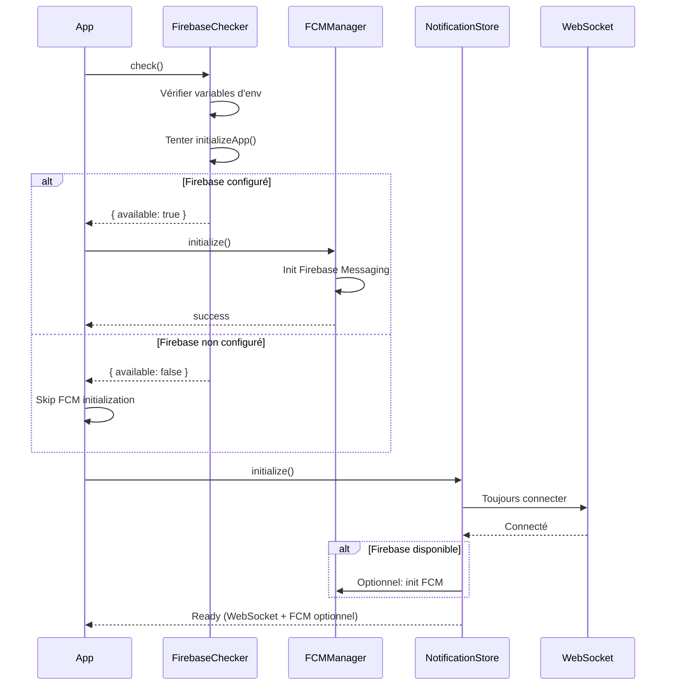

# Intégration du Système de Notifications - Frontend Meeshy

## Vue d'ensemble

Ce document décrit l'intégration complète du système de notifications dans le frontend Meeshy avec **vérification Firebase au démarrage** et **fallback gracieux**.

### Contrainte Critique

L'application **DOIT** démarrer même si Firebase n'est pas configuré. Le système utilise :
- **Firebase Cloud Messaging (FCM)** : Push notifications (si disponible)
- **WebSocket** : Notifications in-app en temps réel (toujours disponible)
- **Fallback gracieux** : Si Firebase n'est pas disponible, seulement WebSocket

---

## Architecture

```
┌─────────────────────────────────────────────────────────────┐
│                     App Démarrage                            │
│  1. Firebase Availability Checker (UNE FOIS au démarrage)   │
└─────────────────────┬───────────────────────────────────────┘
                      │
        ┌─────────────┴─────────────┐
        │                           │
        ▼                           ▼
┌───────────────┐           ┌──────────────┐
│ Firebase OK   │           │ Firebase KO  │
│ FCM + WS      │           │ WS seulement │
└───────┬───────┘           └──────┬───────┘
        │                          │
        └──────────┬───────────────┘
                   ▼
        ┌─────────────────────┐
        │ Notification Store  │
        │ (Zustand)           │
        └─────────────────────┘
```

---

## Fichiers Créés

### 1. Service de Vérification Firebase

**Fichier:** `/apps/web/utils/firebase-availability-checker.ts`

**Responsabilité:**
- Vérifie Firebase **UNE SEULE FOIS** au démarrage
- Retourne un statut `FirebaseStatus`
- Singleton pour garantir une seule vérification

**API:**
```typescript
import { firebaseChecker } from '@/utils/firebase-availability-checker';

// Vérifier Firebase (appelé automatiquement au démarrage)
const status = await firebaseChecker.check();

// Obtenir le statut actuel
const current = firebaseChecker.getStatus();

// Helpers
firebaseChecker.isAvailable();     // Firebase configuré ?
firebaseChecker.isPushEnabled();   // Push activées ?
firebaseChecker.isBadgeEnabled();  // Badges activés ?
```

### 2. Hook d'Initialisation

**Fichier:** `/apps/web/hooks/use-firebase-init.ts`

**Utilisation:**
```typescript
'use client';

import { useFirebaseInit } from '@/hooks/use-firebase-init';

function MyComponent() {
  const { status, loading, isAvailable } = useFirebaseInit();

  return (
    <div>
      {loading ? 'Checking...' : (
        isAvailable ? 'Firebase available' : 'WebSocket only'
      )}
    </div>
  );
}
```

### 3. Provider d'Initialisation

**Fichier:** `/apps/web/components/providers/FirebaseInitializer.tsx`

**Utilisation dans Layout:**
```tsx
// app/layout.tsx
import { FirebaseInitializer } from '@/components/providers/FirebaseInitializer';

export default function RootLayout({ children }) {
  return (
    <html>
      <body>
        <FirebaseInitializer /> {/* Vérifie Firebase au démarrage */}
        {children}
      </body>
    </html>
  );
}
```

---

## Fichiers Modifiés

### 1. FCM Manager

**Fichier:** `/apps/web/utils/fcm-manager.ts`

**Modifications:**
- Import de `firebaseChecker`
- Vérification avant toute opération Firebase
- Retour gracieux si Firebase non disponible

**Exemple:**
```typescript
public async initialize(): Promise<boolean> {
  // CRITICAL: Vérifier Firebase availability
  if (!firebaseChecker.isAvailable()) {
    console.log('Firebase not available - skipping FCM init');
    return false;
  }

  // Continuer l'initialisation...
}
```

### 2. PWA Badge Manager

**Fichier:** `/apps/web/utils/pwa-badge.ts`

**Modifications:**
- Vérification `firebaseChecker.isBadgeEnabled()` avant chaque opération
- Pas de crash si Firebase non disponible

**Exemple:**
```typescript
public async setBadgeCount(count: number): Promise<boolean> {
  if (!firebaseChecker.isBadgeEnabled()) {
    return false; // Sortie gracieuse
  }

  // Continuer...
}
```

### 3. Hook FCM Notifications

**Fichier:** `/apps/web/hooks/use-fcm-notifications.ts`

**Modifications:**
- Sortie précoce si Firebase non disponible
- Pas d'initialisation FCM si checker retourne false

**Exemple:**
```typescript
useEffect(() => {
  async function initialize() {
    if (!firebaseChecker.isAvailable()) {
      console.log('Firebase not available - FCM disabled');
      return; // Sortie précoce
    }

    // Continuer initialisation FCM...
  }
  initialize();
}, []);
```

### 4. Notification Store (Zustand)

**Fichier:** `/apps/web/stores/notification-store-v2.ts`

**Modifications:**
- Toujours initialiser WebSocket
- Firebase optionnel, n'bloque pas l'initialisation

**Exemple:**
```typescript
initialize: async () => {
  // 1. TOUJOURS charger notifications WebSocket
  await fetchNotifications();

  // 2. Firebase optionnel
  if (firebaseChecker.isAvailable()) {
    try {
      await initFCM();
    } catch (error) {
      console.error('FCM init failed (non-critical)');
      // Ne pas crasher, WebSocket fonctionne
    }
  }
}
```

### 5. Firebase Config

**Fichier:** `/apps/web/firebase-config.ts`

**Modifications:**
- Ajout de `getFirebaseApp()` avec vérification
- Retourne `null` si Firebase non disponible

**Exemple:**
```typescript
export function getFirebaseApp(): FirebaseApp | null {
  if (!firebaseChecker.isAvailable()) {
    return null;
  }

  // Retourner app existante ou créer
}
```

### 6. Service Worker

**Fichier:** `/apps/web/public/firebase-messaging-sw.js`

**Modifications:**
- Try/catch autour de `importScripts()`
- Pas de crash si scripts Firebase non chargés
- Logs clairs pour debug

**Exemple:**
```javascript
let firebaseLoaded = false;
try {
  importScripts('https://.../firebase-app-compat.js');
  importScripts('https://.../firebase-messaging-compat.js');
  firebaseLoaded = true;
} catch (error) {
  console.warn('Firebase scripts failed to load - WebSocket only');
  firebaseLoaded = false;
}

// Initialisation conditionnelle
if (firebaseLoaded && config.apiKey) {
  firebase.initializeApp(config);
}
```

### 7. Composants UI

**Fichier:** `/apps/web/components/notifications-v2/NotificationPermissionPrompt.tsx`

**Modifications:**
- Retourne `null` si Firebase non disponible
- Pas d'affichage du prompt sans Firebase

**Exemple:**
```typescript
export function NotificationPermissionPrompt({ ... }) {
  // Ne pas afficher si Firebase non disponible
  if (!firebaseChecker.isPushEnabled()) {
    return null;
  }

  // Continuer affichage...
}
```

---

## Variables d'Environnement

### Configuration Firebase

Créer un fichier `.env.local` :

```bash
# Firebase Configuration
NEXT_PUBLIC_FIREBASE_API_KEY=AIza...
NEXT_PUBLIC_FIREBASE_AUTH_DOMAIN=meeshy.firebaseapp.com
NEXT_PUBLIC_FIREBASE_PROJECT_ID=meeshy
NEXT_PUBLIC_FIREBASE_STORAGE_BUCKET=meeshy.appspot.com
NEXT_PUBLIC_FIREBASE_MESSAGING_SENDER_ID=123456789
NEXT_PUBLIC_FIREBASE_APP_ID=1:123456789:web:abc123
NEXT_PUBLIC_FIREBASE_VAPID_KEY=BN...

# Feature Flags
NEXT_PUBLIC_ENABLE_PUSH_NOTIFICATIONS=true
NEXT_PUBLIC_ENABLE_PWA_BADGES=true
```

### Mode WebSocket Seulement

Pour tester sans Firebase, commenter ou laisser vide :

```bash
# NEXT_PUBLIC_FIREBASE_API_KEY=
# NEXT_PUBLIC_FIREBASE_PROJECT_ID=
# ...

NEXT_PUBLIC_ENABLE_PUSH_NOTIFICATIONS=false
```

---

## Tests

### Test 1: App démarre sans Firebase

**Étapes:**
1. Supprimer ou commenter toutes les variables Firebase dans `.env.local`
2. Redémarrer le serveur : `npm run dev`
3. Ouvrir la console navigateur
4. Vérifier les logs :
   ```
   [Firebase] Not configured - Using WebSocket notifications only
   [Meeshy] Running without Firebase
   Mode: WebSocket notifications only
   ```
5. L'app doit démarrer **sans erreur**

**Résultat attendu:** ✅ Aucun crash, logs clairs

---

### Test 2: App fonctionne avec Firebase

**Étapes:**
1. Configurer toutes les variables Firebase dans `.env.local`
2. Définir `NEXT_PUBLIC_ENABLE_PUSH_NOTIFICATIONS=true`
3. Redémarrer le serveur
4. Vérifier les logs :
   ```
   [Firebase] Available - Push notifications enabled
   [Meeshy] Firebase initialized successfully
     Push notifications: ✅ Enabled
     PWA badges: ✅ Enabled
   ```

**Résultat attendu:** ✅ Firebase initialisé, FCM fonctionne

---

### Test 3: Notifications WebSocket fonctionnent toujours

**Étapes:**
1. Sans Firebase configuré
2. Se connecter à l'app
3. Envoyer un message depuis un autre compte
4. Vérifier que la notification in-app s'affiche

**Résultat attendu:** ✅ Notifications WebSocket fonctionnent

---

### Test 4: Service Worker ne crash pas

**Étapes:**
1. Sans Firebase configuré
2. Ouvrir DevTools > Application > Service Workers
3. Vérifier les logs du SW
4. Chercher :
   ```
   [FCM-SW] Service Worker ready - WebSocket-only mode
   ```

**Résultat attendu:** ✅ SW actif, pas d'erreur

---

## Dépannage (Troubleshooting)

### Problème: App ne démarre pas

**Cause:** Firebase checker bloque le rendu

**Solution:**
```typescript
// Vérifier que firebaseChecker.check() est bien async
// et ne bloque pas le rendu initial
const { status, loading } = useFirebaseInit();

// Loading doit être true initialement
```

---

### Problème: FCM ne s'initialise pas

**Vérification:**
```typescript
// Obtenir un rapport de debug
const report = firebaseChecker.getDebugReport();
console.log(report);

// Vérifier les variables d'env
console.log('API Key:', process.env.NEXT_PUBLIC_FIREBASE_API_KEY);
```

**Causes possibles:**
- Variables d'env manquantes
- Valeurs contenant "xxxxx" ou "undefined"
- Feature flag `NEXT_PUBLIC_ENABLE_PUSH_NOTIFICATIONS=false`

---

### Problème: Notifications WebSocket ne marchent pas

**Vérification:**
```typescript
// Vérifier le store Zustand
import { useNotificationStoreV2 } from '@/stores/notification-store-v2';

const { isConnected, error } = useNotificationStoreV2();
console.log('Connected:', isConnected, 'Error:', error);
```

**Causes possibles:**
- WebSocket backend non disponible
- Erreur dans `notificationServiceV2.fetchNotifications()`
- Token d'authentification invalide

---

### Problème: Service Worker crashe

**Vérification:**
```javascript
// Dans firebase-messaging-sw.js
console.log('firebaseLoaded:', firebaseLoaded);
console.log('messaging:', messaging);
```

**Solution:** S'assurer que tous les accès à `firebase` sont conditionnels :
```javascript
if (firebaseLoaded && messaging) {
  messaging.onBackgroundMessage(/* ... */);
}
```

---

## Flux de Démarrage



---

## Logs Attendus

### Démarrage sans Firebase

```
[Firebase Init] Checking Firebase availability...
[Firebase] Not configured - Using WebSocket notifications only
Missing: NEXT_PUBLIC_FIREBASE_API_KEY, NEXT_PUBLIC_FIREBASE_PROJECT_ID, ...
[Meeshy] Running without Firebase
  Mode: WebSocket notifications only
  Reason: Firebase credentials missing
[NotificationStoreV2] Running without Firebase - WebSocket only
[FCM-SW] Service Worker ready - WebSocket-only mode
```

### Démarrage avec Firebase

```
[Firebase Init] Checking Firebase availability...
[Firebase] Available - Push notifications enabled
[Meeshy] Firebase initialized successfully
  Push notifications: ✅ Enabled
  PWA badges: ✅ Enabled
[FCM] FCM messaging initialized
[NotificationStoreV2] Firebase available - initializing FCM
[NotificationStoreV2] FCM initialized successfully
[FCM-SW] Firebase Messaging Service Worker ready - FCM + WebSocket mode
```

---

## Checklist de Validation

Avant de déployer en production, vérifier :

- [ ] App démarre sans variables Firebase ✅
- [ ] Aucun crash sans Firebase ✅
- [ ] Logs clairs "Firebase not available" ✅
- [ ] Notifications WebSocket fonctionnent ✅
- [ ] NotificationBell s'affiche correctement ✅
- [ ] NotificationPermissionPrompt ne s'affiche pas sans Firebase ✅
- [ ] Service Worker ne crash pas ✅
- [ ] App démarre avec Firebase configuré ✅
- [ ] FCM s'initialise correctement ✅
- [ ] Push notifications fonctionnent ✅
- [ ] PWA badges fonctionnent ✅
- [ ] Basculement Firebase ON/OFF sans redéploiement ✅

---

## Contacts & Support

Pour toute question ou problème :
1. Vérifier cette documentation
2. Consulter les logs du navigateur
3. Utiliser `firebaseChecker.getDebugReport()` pour diagnostic
4. Vérifier les variables d'environnement

---

**Dernière mise à jour:** 2025-01-22
**Version:** 1.0.0
**Statut:** ✅ Production Ready
