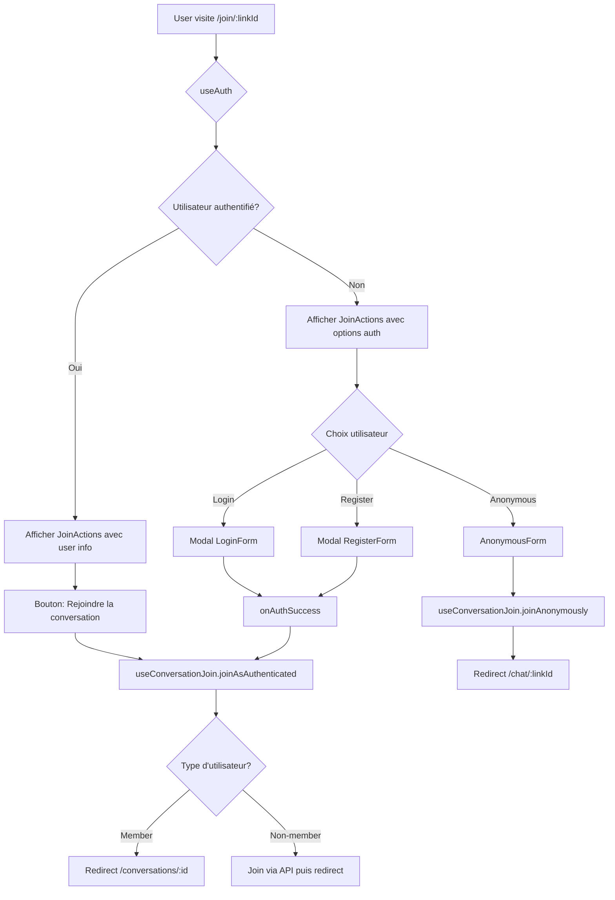
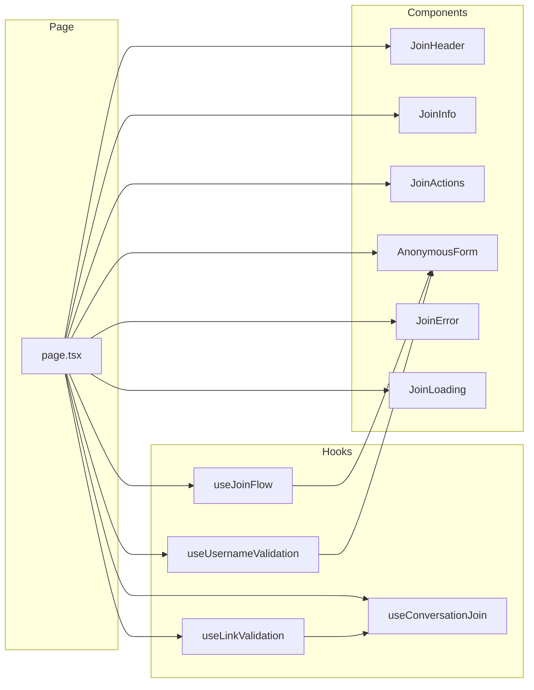
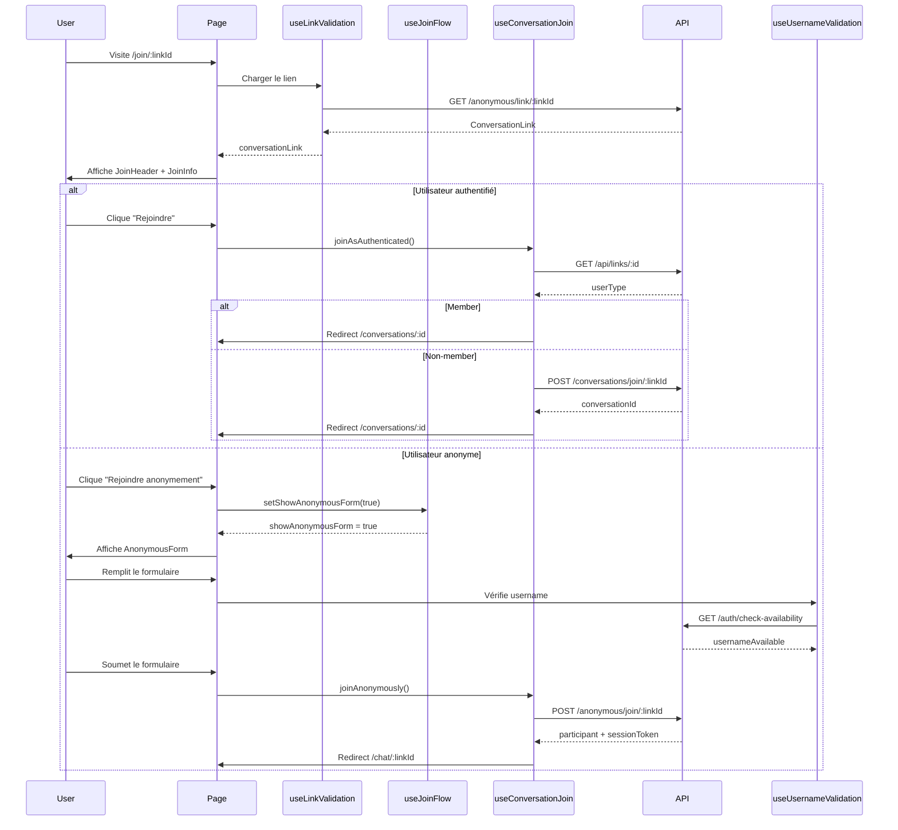

# Architecture Join Page - Vue détaillée

## Diagramme de flux



## Diagramme de composants



## Flow de données



## Responsabilités

### Page (page.tsx)
- Orchestration des hooks
- Gestion des événements utilisateur
- Affichage conditionnel des composants
- Navigation

### Hooks

#### useJoinFlow
- État du formulaire anonyme
- Génération automatique du username
- Mode d'authentification (login/register/welcome)
- Pas d'appels API

#### useLinkValidation
- Chargement du lien d'invitation
- Stockage du token d'affiliation
- Gestion des erreurs de lien
- Appels API: GET /anonymous/link/:linkId

#### useUsernameValidation
- Vérification de disponibilité du username
- Debouncing (500ms)
- Statut: idle | checking | available | taken
- Appels API: GET /auth/check-availability

#### useConversationJoin
- Jointure anonyme
- Jointure authentifiée
- Redirection selon le type d'utilisateur
- Appels API: POST /anonymous/join, POST /conversations/join, GET /api/links

### Composants

#### JoinHeader
- Affichage de l'en-tête
- Icône de conversation
- Titre et description
- Message du créateur

#### JoinInfo
- Informations de la conversation
- Badges (type, participants, langues)
- Dates (création, expiration)
- Purement présentationnel

#### JoinActions
- Boutons d'authentification
- Modales Login/Register
- Bouton "Rejoindre anonymement"
- Message "Compte requis"
- Gestion de l'état connecté

#### AnonymousForm
- Formulaire d'inscription anonyme
- Validation en temps réel
- Champs conditionnels (email, birthday)
- Indicateurs de statut username

#### JoinError
- Affichage des erreurs
- Bouton de retour à l'accueil

#### JoinLoading
- État de chargement

## Types partagés

```typescript
// AnonymousFormData (use-join-flow.ts)
interface AnonymousFormData {
  firstName: string;
  lastName: string;
  username: string;
  email: string;
  birthday: string;
  language: string;
}

// ConversationLink (use-link-validation.ts)
interface ConversationLink extends BaseConversationLink {
  requireAccount?: boolean;
  requireBirthday?: boolean;
}

// UsernameCheckStatus (use-link-validation.ts)
type UsernameCheckStatus = 'idle' | 'checking' | 'available' | 'taken';
```

## Optimisations possibles

### Court terme
1. Memoization des composants
```typescript
export const JoinHeader = React.memo(JoinHeaderComponent);
```

2. Debouncing optimisé
```typescript
import { useDebounce } from '@/hooks/use-debounce';
const debouncedUsername = useDebounce(username, 500);
```

### Moyen terme
1. Server Components
```typescript
// JoinHeader.tsx - Server Component
export function JoinHeader({ conversationType, title }: Props) {
  // Pas de 'use client'
  return <header>...</header>
}
```

2. Suspense boundaries
```tsx
<Suspense fallback={<JoinLoading />}>
  <JoinContent />
</Suspense>
```

### Long terme
1. React Query
```typescript
const { data: conversationLink } = useQuery(
  ['link', linkId],
  () => LinkConversationService.getLinkInfo(linkId)
);
```

2. Zustand store
```typescript
const useJoinStore = create((set) => ({
  anonymousForm: initialForm,
  updateForm: (field, value) => set((state) => ({
    anonymousForm: { ...state.anonymousForm, [field]: value }
  }))
}));
```

## Patterns appliqués

1. **Custom Hooks Pattern**: Logique réutilisable
2. **Compound Components Pattern**: JoinActions + Modales
3. **Container/Presenter Pattern**: Hooks (logique) + Composants (UI)
4. **Controlled Components**: Forms contrôlés par React
5. **Single Responsibility**: Un fichier = une responsabilité
6. **Composition over Inheritance**: Pas de classes, que de la composition
