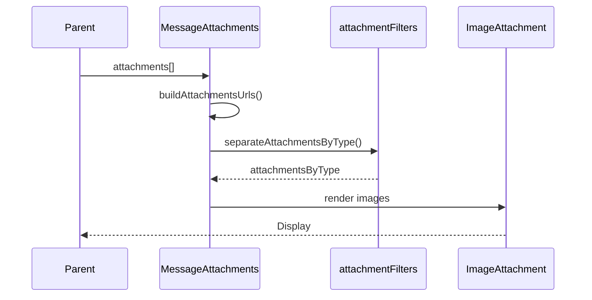
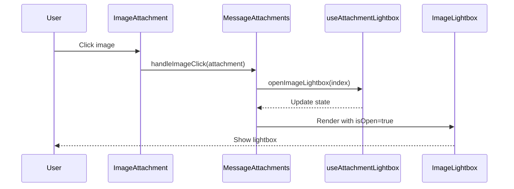
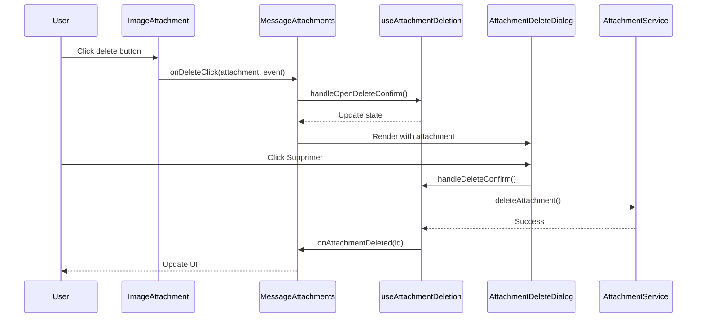

# Architecture des Composants Attachments

## Vue d'ensemble

```mermaid
graph TB
    MA[MessageAttachments<br/>250 lignes] --> |utilise| UL[useAttachmentLightbox]
    MA --> |utilise| UD[useAttachmentDeletion]
    MA --> |utilise| UR[useResponsiveDetection]
    MA --> |utilise| AF[attachmentFilters]

    MA --> |rend| IA[ImageAttachment]
    MA --> |rend| VA[VideoAttachment]
    MA --> |rend| AA[AudioAttachment]
    MA --> |rend| DA[DocumentAttachment]
    MA --> |rend| FA[FileAttachment]
    MA --> |rend| AGL[AttachmentGridLayout]
    MA --> |rend| ADD[AttachmentDeleteDialog]
    MA --> |rend| AL[AttachmentLightboxes]

    DA --> |dynamic import| PDF[PDFViewerWrapper]
    DA --> |dynamic import| PPTX[PPTXViewer]
    DA --> |dynamic import| MD[MarkdownViewer]
    DA --> |dynamic import| TXT[TextViewer]

    AL --> |dynamic import| IL[ImageLightbox]
    AL --> |dynamic import| VL[VideoLightbox]
    AL --> |dynamic import| PDFL[PDFLightboxSimple]
    AL --> |dynamic import| MDL[MarkdownLightbox]
    AL --> |dynamic import| TXTL[TextLightbox]
    AL --> |dynamic import| PPTXL[PPTXLightbox]

    style MA fill:#4CAF50,color:#fff
    style UL fill:#2196F3,color:#fff
    style UD fill:#2196F3,color:#fff
    style UR fill:#2196F3,color:#fff
    style AF fill:#FF9800,color:#fff
```



## Composants

### Composant Principal

#### MessageAttachments
**Responsabilité**: Orchestrer l'affichage des attachments

**Props**:
```typescript
{
  attachments: Attachment[];
  onImageClick?: (attachmentId: string) => void;
  currentUserId?: string;
  token?: string;
  onAttachmentDeleted?: (attachmentId: string) => void;
  isOwnMessage?: boolean;
}
```

**Logique**:
1. Construit les URLs complètes des attachments
2. Sépare les attachments par type
3. Délègue le rendu à des composants spécialisés
4. Gère l'expansion/réduction pour 10+ attachments

---

### Composants par Type

#### ImageAttachment
**Responsabilité**: Afficher une image avec optimisations

**Features**:
- Affichage adaptatif selon le nombre (1-2, 3-4, 5+)
- Thumbnail pour JPG/WebP, image originale pour PNG
- Badge avec extension et taille
- Bouton de suppression conditionnel

#### VideoAttachment
**Responsabilité**: Afficher une vidéo avec player

**Features**:
- Wrapper autour de VideoPlayer existant
- Ouverture du lightbox vidéo
- Bouton de suppression

#### AudioAttachment
**Responsabilité**: Afficher un fichier audio

**Features**:
- Wrapper autour de SimpleAudioPlayer
- Préserve tous les métadonnées

#### DocumentAttachment
**Responsabilité**: Afficher un document (PDF, PPTX, MD, TXT)

**Features**:
- Dynamic imports pour réduire le bundle
- Interface unifiée pour 4 types de documents
- Lightbox spécifique selon le type

#### FileAttachment
**Responsabilité**: Afficher un fichier générique

**Features**:
- Icône selon le type MIME
- Badge avec extension et taille
- Téléchargement au clic

---

### Composants UI

#### AttachmentGridLayout
**Responsabilité**: Gérer le layout responsive

**Logique**:
- 1-2 attachments: `flex flex-col`
- 3-4 attachments: `grid grid-cols-2`
- 5+ attachments: `flex flex-wrap`
- Alignement selon `isOwnMessage`

#### AttachmentDeleteDialog
**Responsabilité**: Confirmer la suppression

**Features**:
- Dialog modal avec nom du fichier
- État de chargement pendant la suppression
- Boutons Annuler/Supprimer

#### AttachmentLightboxes
**Responsabilité**: Grouper tous les lightbox

**Features**:
- Dynamic imports pour chaque lightbox
- Props drilling évité via composition
- Un seul point d'entrée pour tous les lightbox

---

### Hooks

#### useAttachmentLightbox
**Responsabilité**: Gérer l'état des lightbox

**État**:
```typescript
{
  imageLightbox: { isOpen, index, attachment },
  videoLightbox: { isOpen, index, attachment },
  pdfLightbox: { isOpen, index, attachment },
  markdownLightbox: { isOpen, index, attachment },
  textLightbox: { isOpen, index, attachment },
  pptxLightbox: { isOpen, index, attachment }
}
```

**Actions**:
- `open*Lightbox(index | attachment)`
- `close*Lightbox()`

#### useAttachmentDeletion
**Responsabilité**: Gérer la suppression d'attachments

**État**:
```typescript
{
  attachmentToDelete: Attachment | null,
  isDeleting: boolean
}
```

**Actions**:
- `handleOpenDeleteConfirm(attachment, event?)`
- `handleDeleteConfirm()`
- `handleDeleteCancel()`

#### useResponsiveDetection
**Responsabilité**: Détecter les écrans mobiles

**État**:
```typescript
{ isMobile: boolean }
```

**Paramètres**:
- `breakpoint?: number` (défaut: 768)

---

### Utilitaires

#### attachmentFilters
**Responsabilité**: Séparer les attachments par type

**Fonction principale**:
```typescript
separateAttachmentsByType(attachments: Attachment[]): AttachmentsByType
```

**Retour**:
```typescript
{
  images: Attachment[],
  videos: Attachment[],
  audios: Attachment[],
  pdfs: Attachment[],
  pptxs: Attachment[],
  markdowns: Attachment[],
  texts: Attachment[],
  others: Attachment[]
}
```

---

## Flux de données

### Affichage initial



### Ouverture de lightbox



### Suppression



---

## Performance

### Bundle Splitting

**Dynamic Imports**:
- PDFViewerWrapper
- PPTXViewer
- MarkdownViewer
- TextViewer
- ImageLightbox
- VideoLightbox
- PDFLightboxSimple
- MarkdownLightbox
- TextLightbox
- PPTXLightbox

**Impact**:
- Bundle initial réduit
- Chargement à la demande
- Meilleure performance initiale

### Optimisations

1. **Memoization**:
   - `useMemo` pour `attachmentsWithUrls`
   - `useMemo` pour `attachmentsByType`
   - `useCallback` pour tous les handlers

2. **React.memo**:
   - Tous les composants wrappés
   - Évite les re-renders inutiles

3. **Lazy Loading**:
   - Images avec `loading="lazy"`
   - Thumbnails pour réduire la taille initiale

---

## Tests

### Hooks

```typescript
// useAttachmentLightbox.test.ts
describe('useAttachmentLightbox', () => {
  it('should open image lightbox');
  it('should close image lightbox');
  it('should handle multiple lightbox states');
});

// useAttachmentDeletion.test.ts
describe('useAttachmentDeletion', () => {
  it('should open delete confirmation');
  it('should delete attachment');
  it('should cancel deletion');
  it('should handle errors');
});

// useResponsiveDetection.test.ts
describe('useResponsiveDetection', () => {
  it('should detect mobile');
  it('should detect desktop');
  it('should respond to window resize');
});
```

### Utilitaires

```typescript
// attachmentFilters.test.ts
describe('separateAttachmentsByType', () => {
  it('should separate images');
  it('should separate videos');
  it('should separate documents');
  it('should handle empty array');
  it('should handle mixed types');
});
```

### Composants

```typescript
// ImageAttachment.test.tsx
describe('ImageAttachment', () => {
  it('should render image');
  it('should show delete button when canDelete');
  it('should call onImageClick on click');
  it('should call onDeleteClick on delete');
});

// MessageAttachments.test.tsx
describe('MessageAttachments', () => {
  it('should render all attachment types');
  it('should expand when > 10 attachments');
  it('should open lightbox on image click');
  it('should delete attachment');
});
```

---

## Évolution future

### Nouvelles fonctionnalités faciles à ajouter

1. **Nouveau type d'attachment**:
   - Créer `NewTypeAttachment.tsx`
   - Ajouter le filtrage dans `attachmentFilters.ts`
   - Ajouter le render dans `MessageAttachments.tsx`

2. **Nouveau lightbox**:
   - Ajouter l'état dans `useAttachmentLightbox`
   - Ajouter le lightbox dans `AttachmentLightboxes`
   - Dynamic import automatique

3. **Nouvelle action (partage, édition, etc.)**:
   - Créer un nouveau hook `useAttachmentShare`
   - Ajouter le bouton dans les composants type-specific
   - Logique isolée et testable

### Points d'extension

- Système de plugins pour nouveaux types
- Configuration via contexte React
- Thème personnalisable
- Animations configurables
