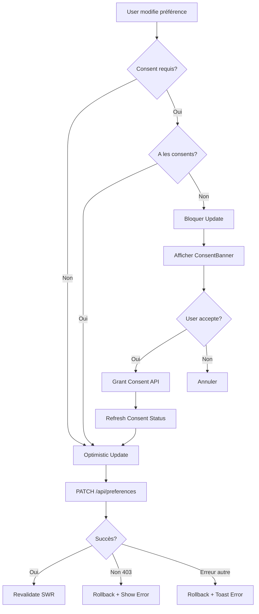

# Frontend Settings Architecture

Architecture complète du système de préférences utilisateur alignée avec le backend `/api/v1/me/preferences/*`.

## Table des matières

1. [Vue d'ensemble](#vue-densemble)
2. [Structure des dossiers](#structure-des-dossiers)
3. [Types TypeScript](#types-typescript)
4. [Hooks SWR](#hooks-swr)
5. [Composants UI](#composants-ui)
6. [Gestion GDPR](#gestion-gdpr)
7. [Internationalisation](#internationalisation)
8. [Performance](#performance)
9. [Accessibilité](#accessibilité)

---

## Vue d'ensemble

### Principes architecturaux

- **SRP (Single Responsibility Principle)**: Chaque module a une responsabilité unique et bien définie
- **Vercel React Best Practices**: SWR pour data fetching, memoization, code splitting
- **Web Design Guidelines**: Accessibilité WCAG 2.1 AA, UX cohérente
- **i18n obligatoire**: Toutes les chaînes de caractères doivent être traduites

### Catégories de préférences

| Catégorie | Endpoint | Champs | GDPR |
|-----------|----------|--------|------|
| Profile | `/me/profile` | ~8 | Non |
| Privacy | `/me/preferences/privacy` | 12 | Oui |
| Audio | `/me/preferences/audio` | 15 | Oui |
| Message | `/me/preferences/message` | 14 | Oui |
| Notification | `/me/preferences/notification` | 24 | Non |
| Video | `/me/preferences/video` | 18 | Oui |
| Document | `/me/preferences/document` | 14 | Oui |
| Application | `/me/preferences/application` | 18 | Oui |
| Beta Playground | - | Variable | Oui |

---

## Structure des dossiers

```
apps/web/components/settings/
├── ARCHITECTURE.md                          # Ce fichier
├── index.ts                                 # Barrel export
│
├── types/
│   ├── index.ts                            # Re-export depuis @meeshy/shared
│   ├── consent.types.ts                    # Types spécifiques consentements
│   └── ui.types.ts                         # Types composants UI
│
├── hooks/
│   ├── index.ts                            # Barrel export
│   ├── usePreferences.ts                   # Hook générique <T>
│   ├── usePrivacyPreferences.ts            # Hook spécialisé privacy
│   ├── useAudioPreferences.ts              # Hook spécialisé audio
│   ├── useMessagePreferences.ts            # Hook spécialisé message
│   ├── useNotificationPreferences.ts       # Hook spécialisé notification
│   ├── useVideoPreferences.ts              # Hook spécialisé video
│   ├── useDocumentPreferences.ts           # Hook spécialisé document
│   ├── useApplicationPreferences.ts        # Hook spécialisé application
│   ├── useConsentStatus.ts                 # Hook statut GDPR
│   └── useSettingsNavigation.ts            # Hook navigation tabs
│
├── api/
│   ├── index.ts                            # Barrel export
│   ├── preferences.client.ts               # Client API REST
│   ├── consent.client.ts                   # Client API consentements
│   └── error-handler.ts                    # Gestion erreurs 403 GDPR
│
├── components/
│   ├── index.ts                            # Barrel export principal
│   │
│   ├── SettingsLayout/
│   │   ├── index.ts
│   │   ├── SettingsLayout.tsx              # Layout principal + tabs
│   │   ├── SettingsSidebar.tsx             # Sidebar navigation
│   │   ├── SettingsHeader.tsx              # Header + breadcrumbs
│   │   └── SettingsFooter.tsx              # Footer actions
│   │
│   ├── panels/
│   │   ├── index.ts
│   │   ├── ProfilePanel.tsx                # Lazy loaded
│   │   ├── PrivacyPanel.tsx                # Lazy loaded
│   │   ├── AudioPanel.tsx                  # Lazy loaded
│   │   ├── MessagePanel.tsx                # Lazy loaded
│   │   ├── NotificationPanel.tsx           # Lazy loaded
│   │   ├── VideoPanel.tsx                  # Lazy loaded
│   │   ├── DocumentPanel.tsx               # Lazy loaded
│   │   ├── ApplicationPanel.tsx            # Lazy loaded
│   │   └── BetaPlaygroundPanel.tsx         # Lazy loaded
│   │
│   ├── fields/
│   │   ├── index.ts
│   │   ├── ToggleField.tsx                 # Switch + label + description
│   │   ├── SelectField.tsx                 # Select + label + description
│   │   ├── SliderField.tsx                 # Slider + label + value
│   │   ├── InputField.tsx                  # Input + label + validation
│   │   ├── RadioGroupField.tsx             # RadioGroup + label
│   │   ├── MultiSelectField.tsx            # Multi-select + chips
│   │   ├── TimePickerField.tsx             # Time picker pour DND
│   │   └── FieldWrapper.tsx                # Wrapper commun (a11y, i18n)
│   │
│   ├── consent/
│   │   ├── index.ts
│   │   ├── ConsentGate.tsx                 # HOC protection GDPR
│   │   ├── ConsentBanner.tsx               # Banner violation GDPR
│   │   ├── ConsentModal.tsx                # Modal demande consentement
│   │   └── ConsentStatusIndicator.tsx      # Indicator visuel statut
│   │
│   └── shared/
│       ├── index.ts
│       ├── SettingsCard.tsx                # Card wrapper sections
│       ├── SettingsSkeleton.tsx            # Skeleton loading state
│       ├── SettingsError.tsx               # Error state
│       ├── SettingsEmpty.tsx               # Empty state
│       └── SaveIndicator.tsx               # Indicator auto-save
│
├── utils/
│   ├── index.ts
│   ├── validation.ts                       # Helpers validation
│   ├── consent-checker.ts                  # Helpers vérification GDPR
│   └── optimistic-update.ts                # Helpers optimistic updates
│
└── locales/
    ├── en.json                             # Traductions EN
    ├── fr.json                             # Traductions FR
    └── index.ts                            # Export locales
```

---

## Types TypeScript

### `/types/index.ts`

```typescript
/**
 * Re-export des types depuis @meeshy/shared
 * Point d'entrée unique pour tous les types preferences
 */

export type {
  PrivacyPreference,
  AudioPreference,
  MessagePreference,
  NotificationPreference,
  VideoPreference,
  DocumentPreference,
  ApplicationPreference,
} from '@meeshy/shared/types/preferences';

export type {
  PrivacyPreferenceSchema,
  AudioPreferenceSchema,
  MessagePreferenceSchema,
  NotificationPreferenceSchema,
  VideoPreferenceSchema,
  DocumentPreferenceSchema,
  ApplicationPreferenceSchema,
  PRIVACY_PREFERENCE_DEFAULTS,
  AUDIO_PREFERENCE_DEFAULTS,
  MESSAGE_PREFERENCE_DEFAULTS,
  NOTIFICATION_PREFERENCE_DEFAULTS,
  VIDEO_PREFERENCE_DEFAULTS,
  DOCUMENT_PREFERENCE_DEFAULTS,
  APPLICATION_PREFERENCE_DEFAULTS,
} from '@meeshy/shared/types/preferences';

export * from './consent.types';
export * from './ui.types';
```

### `/types/consent.types.ts`

```typescript
/**
 * Types spécifiques à la gestion des consentements GDPR
 */

export interface ConsentStatus {
  hasDataProcessingConsent: boolean;
  hasVoiceDataConsent: boolean;
  hasVoiceProfileConsent: boolean;
  hasVoiceCloningConsent: boolean;
  hasThirdPartyServicesConsent: boolean;
  canTranscribeAudio: boolean;
  canTranslateText: boolean;
  canTranslateAudio: boolean;
  canGenerateTranslatedAudio: boolean;
  canUseVoiceCloning: boolean;
}

export interface ConsentViolation {
  field: string;
  message: string;
  requiredConsents: string[];
}

export interface ConsentError {
  success: false;
  error: 'CONSENT_REQUIRED';
  message: string;
  violations: ConsentViolation[];
}

export interface ConsentRequirement {
  field: string;
  requiredConsents: string[];
  userFacingMessage: string; // i18n key
}

export type ConsentCategory =
  | 'dataProcessing'
  | 'voiceData'
  | 'voiceProfile'
  | 'voiceCloning'
  | 'thirdPartyServices';

export interface ConsentGateProps {
  requiredConsents: ConsentCategory[];
  children: React.ReactNode;
  fallback?: React.ReactNode;
  onConsentGranted?: () => void;
}
```

### `/types/ui.types.ts`

```typescript
/**
 * Types pour les composants UI
 */

export type SettingsTab =
  | 'profile'
  | 'privacy'
  | 'audio'
  | 'message'
  | 'notification'
  | 'video'
  | 'document'
  | 'application'
  | 'beta';

export interface SettingsTabConfig {
  id: SettingsTab;
  label: string; // i18n key
  icon: React.ComponentType;
  requiresAuth: boolean;
  betaOnly?: boolean;
}

export interface FieldConfig<T = any> {
  name: keyof T;
  label: string; // i18n key
  description?: string; // i18n key
  type: 'toggle' | 'select' | 'slider' | 'input' | 'radio' | 'multiselect' | 'time';
  defaultValue: any;
  validation?: (value: any) => boolean | string;
  requiresConsent?: ConsentCategory[];
  disabled?: boolean;
  options?: Array<{ value: string; label: string }>; // Pour select/radio
  min?: number; // Pour slider
  max?: number; // Pour slider
  step?: number; // Pour slider
}

export interface PanelProps<T> {
  preferences: T;
  isLoading: boolean;
  error: Error | null;
  updatePreference: (field: keyof T, value: any) => Promise<void>;
  resetPreferences: () => Promise<void>;
}
```

---

## Hooks SWR

### Hook générique `/hooks/usePreferences.ts`

```typescript
/**
 * Hook générique pour gérer n'importe quelle catégorie de préférences
 * Avec SWR, optimistic updates, et gestion GDPR 403
 */

import useSWR, { mutate } from 'swr';
import { useCallback, useState } from 'react';
import type { ConsentError, ConsentViolation } from '../types';
import { preferencesClient } from '../api/preferences.client';
import { handleConsentError } from '../api/error-handler';

export interface UsePreferencesOptions<T> {
  category: string;
  endpoint: string;
  defaultValues: T;
  onConsentError?: (violations: ConsentViolation[]) => void;
}

export interface UsePreferencesReturn<T> {
  preferences: T;
  isLoading: boolean;
  isValidating: boolean;
  error: Error | null;
  consentViolations: ConsentViolation[] | null;
  updatePreference: (field: keyof T, value: any) => Promise<void>;
  updatePreferences: (updates: Partial<T>) => Promise<void>;
  resetPreferences: () => Promise<void>;
  refresh: () => Promise<void>;
}

export function usePreferences<T extends Record<string, any>>({
  category,
  endpoint,
  defaultValues,
  onConsentError,
}: UsePreferencesOptions<T>): UsePreferencesReturn<T> {
  const [consentViolations, setConsentViolations] = useState<ConsentViolation[] | null>(null);

  // SWR pour fetching avec revalidation
  const {
    data,
    error,
    isLoading,
    isValidating,
    mutate: mutateSWR,
  } = useSWR<{ success: true; data: T } | ConsentError>(
    endpoint,
    preferencesClient.get,
    {
      revalidateOnFocus: false,
      revalidateOnReconnect: true,
      dedupingInterval: 2000,
      errorRetryCount: 3,
      shouldRetryOnError: (err) => {
        // Ne pas retry sur 403 GDPR
        if (err?.response?.status === 403) return false;
        return true;
      },
    }
  );

  // Extraire les préférences ou utiliser defaults
  const preferences = data?.success ? data.data : defaultValues;

  /**
   * Update un seul champ avec optimistic update
   */
  const updatePreference = useCallback(
    async (field: keyof T, value: any) => {
      const updates = { [field]: value } as Partial<T>;

      // Optimistic update local
      const optimisticData = { success: true as const, data: { ...preferences, ...updates } };
      mutateSWR(optimisticData, false);

      try {
        // PATCH au serveur
        const result = await preferencesClient.patch<T>(endpoint, updates);

        if (!result.success) {
          throw new Error(result.error || 'Update failed');
        }

        // Revalider depuis le serveur
        await mutateSWR();
        setConsentViolations(null);
      } catch (err: any) {
        // Rollback optimistic update
        await mutateSWR();

        // Gérer erreur 403 GDPR
        if (err?.response?.status === 403) {
          const consentErr = err.response.data as ConsentError;
          setConsentViolations(consentErr.violations);
          onConsentError?.(consentErr.violations);
          handleConsentError(consentErr, category);
        } else {
          console.error(`[usePreferences] Failed to update ${String(field)}:`, err);
          throw err;
        }
      }
    },
    [preferences, endpoint, category, mutateSWR, onConsentError]
  );

  /**
   * Update multiple champs à la fois
   */
  const updatePreferences = useCallback(
    async (updates: Partial<T>) => {
      // Optimistic update local
      const optimisticData = { success: true as const, data: { ...preferences, ...updates } };
      mutateSWR(optimisticData, false);

      try {
        const result = await preferencesClient.patch<T>(endpoint, updates);

        if (!result.success) {
          throw new Error(result.error || 'Update failed');
        }

        await mutateSWR();
        setConsentViolations(null);
      } catch (err: any) {
        await mutateSWR();

        if (err?.response?.status === 403) {
          const consentErr = err.response.data as ConsentError;
          setConsentViolations(consentErr.violations);
          onConsentError?.(consentErr.violations);
          handleConsentError(consentErr, category);
        } else {
          console.error(`[usePreferences] Failed to update preferences:`, err);
          throw err;
        }
      }
    },
    [preferences, endpoint, category, mutateSWR, onConsentError]
  );

  /**
   * Reset toutes les préférences aux defaults
   */
  const resetPreferences = useCallback(async () => {
    try {
      await preferencesClient.delete(endpoint);
      await mutateSWR();
      setConsentViolations(null);
    } catch (err) {
      console.error(`[usePreferences] Failed to reset preferences:`, err);
      throw err;
    }
  }, [endpoint, mutateSWR]);

  /**
   * Refresh manuel depuis le serveur
   */
  const refresh = useCallback(async () => {
    await mutateSWR();
  }, [mutateSWR]);

  return {
    preferences,
    isLoading,
    isValidating,
    error: error || null,
    consentViolations,
    updatePreference,
    updatePreferences,
    resetPreferences,
    refresh,
  };
}
```

### Hook spécialisé exemple `/hooks/useAudioPreferences.ts`

```typescript
/**
 * Hook spécialisé pour les préférences audio
 * Wrapper autour de usePreferences avec types forts
 */

import { AudioPreference, AUDIO_PREFERENCE_DEFAULTS } from '../types';
import { usePreferences } from './usePreferences';

export function useAudioPreferences() {
  return usePreferences<AudioPreference>({
    category: 'audio',
    endpoint: '/api/v1/me/preferences/audio',
    defaultValues: AUDIO_PREFERENCE_DEFAULTS,
  });
}
```

### Hook consentements `/hooks/useConsentStatus.ts`

```typescript
/**
 * Hook pour récupérer le statut des consentements GDPR
 */

import useSWR from 'swr';
import type { ConsentStatus } from '../types';
import { consentClient } from '../api/consent.client';

export function useConsentStatus() {
  const { data, error, isLoading, mutate } = useSWR<{ success: true; data: ConsentStatus }>(
    '/api/v1/me/consents/status',
    consentClient.getStatus,
    {
      revalidateOnFocus: false,
      revalidateOnReconnect: true,
      dedupingInterval: 5000,
    }
  );

  return {
    consentStatus: data?.data || null,
    isLoading,
    error,
    refresh: mutate,
  };
}
```

---

## Composants UI

### Layout principal `/components/SettingsLayout/SettingsLayout.tsx`

```typescript
/**
 * Layout principal Settings avec tabs et lazy loading des panels
 */

'use client';

import React, { Suspense, lazy } from 'react';
import { Tabs, TabsContent, TabsList, TabsTrigger } from '@/components/ui/tabs';
import { SettingsSidebar } from './SettingsSidebar';
import { SettingsHeader } from './SettingsHeader';
import { SettingsSkeleton } from '../shared/SettingsSkeleton';
import { useSettingsNavigation } from '../../hooks/useSettingsNavigation';
import { useTranslation } from 'react-i18next';
import type { SettingsTab } from '../../types';

// Lazy load tous les panels pour code splitting
const ProfilePanel = lazy(() => import('../panels/ProfilePanel'));
const PrivacyPanel = lazy(() => import('../panels/PrivacyPanel'));
const AudioPanel = lazy(() => import('../panels/AudioPanel'));
const MessagePanel = lazy(() => import('../panels/MessagePanel'));
const NotificationPanel = lazy(() => import('../panels/NotificationPanel'));
const VideoPanel = lazy(() => import('../panels/VideoPanel'));
const DocumentPanel = lazy(() => import('../panels/DocumentPanel'));
const ApplicationPanel = lazy(() => import('../panels/ApplicationPanel'));
const BetaPlaygroundPanel = lazy(() => import('../panels/BetaPlaygroundPanel'));

export interface SettingsLayoutProps {
  initialTab?: SettingsTab;
}

export function SettingsLayout({ initialTab = 'profile' }: SettingsLayoutProps) {
  const { t } = useTranslation('settings');
  const { activeTab, setActiveTab, tabs } = useSettingsNavigation(initialTab);

  return (
    <div className="flex h-screen bg-background">
      {/* Sidebar navigation */}
      <SettingsSidebar
        tabs={tabs}
        activeTab={activeTab}
        onTabChange={setActiveTab}
      />

      {/* Main content */}
      <div className="flex-1 flex flex-col overflow-hidden">
        <SettingsHeader activeTab={activeTab} />

        <main className="flex-1 overflow-y-auto p-6">
          <Tabs value={activeTab} onValueChange={(value) => setActiveTab(value as SettingsTab)}>
            <TabsContent value="profile">
              <Suspense fallback={<SettingsSkeleton />}>
                <ProfilePanel />
              </Suspense>
            </TabsContent>

            <TabsContent value="privacy">
              <Suspense fallback={<SettingsSkeleton />}>
                <PrivacyPanel />
              </Suspense>
            </TabsContent>

            <TabsContent value="audio">
              <Suspense fallback={<SettingsSkeleton />}>
                <AudioPanel />
              </Suspense>
            </TabsContent>

            <TabsContent value="message">
              <Suspense fallback={<SettingsSkeleton />}>
                <MessagePanel />
              </Suspense>
            </TabsContent>

            <TabsContent value="notification">
              <Suspense fallback={<SettingsSkeleton />}>
                <NotificationPanel />
              </Suspense>
            </TabsContent>

            <TabsContent value="video">
              <Suspense fallback={<SettingsSkeleton />}>
                <VideoPanel />
              </Suspense>
            </TabsContent>

            <TabsContent value="document">
              <Suspense fallback={<SettingsSkeleton />}>
                <DocumentPanel />
              </Suspense>
            </TabsContent>

            <TabsContent value="application">
              <Suspense fallback={<SettingsSkeleton />}>
                <ApplicationPanel />
              </Suspense>
            </TabsContent>

            <TabsContent value="beta">
              <Suspense fallback={<SettingsSkeleton />}>
                <BetaPlaygroundPanel />
              </Suspense>
            </TabsContent>
          </Tabs>
        </main>
      </div>
    </div>
  );
}
```

### Panel exemple `/components/panels/AudioPanel.tsx`

```typescript
/**
 * Panel Audio avec sections logiques et consent gates
 */

'use client';

import React, { memo } from 'react';
import { useTranslation } from 'react-i18next';
import { useAudioPreferences } from '../../hooks/useAudioPreferences';
import { SettingsCard } from '../shared/SettingsCard';
import { ToggleField } from '../fields/ToggleField';
import { SelectField } from '../fields/SelectField';
import { SliderField } from '../fields/SliderField';
import { ConsentGate } from '../consent/ConsentGate';
import { SettingsSkeleton } from '../shared/SettingsSkeleton';
import { SettingsError } from '../shared/SettingsError';
import { SaveIndicator } from '../shared/SaveIndicator';

const AudioPanelComponent = () => {
  const { t } = useTranslation('settings');
  const {
    preferences,
    isLoading,
    isValidating,
    error,
    updatePreference,
    resetPreferences,
  } = useAudioPreferences();

  if (isLoading) {
    return <SettingsSkeleton sections={4} />;
  }

  if (error) {
    return <SettingsError error={error} onRetry={() => window.location.reload()} />;
  }

  return (
    <div className="space-y-6" role="region" aria-label={t('audio.title')}>
      <SaveIndicator isValidating={isValidating} />

      {/* Section: Transcription */}
      <SettingsCard
        title={t('audio.transcription.title')}
        description={t('audio.transcription.description')}
      >
        <ConsentGate requiredConsents={['voiceData']}>
          <ToggleField
            name="transcriptionEnabled"
            label={t('audio.transcription.enabled.label')}
            description={t('audio.transcription.enabled.description')}
            checked={preferences.transcriptionEnabled}
            onChange={(checked) => updatePreference('transcriptionEnabled', checked)}
          />

          {preferences.transcriptionEnabled && (
            <>
              <SelectField
                name="transcriptionSource"
                label={t('audio.transcription.source.label')}
                value={preferences.transcriptionSource}
                onChange={(value) => updatePreference('transcriptionSource', value)}
                options={[
                  { value: 'auto', label: t('audio.transcription.source.auto') },
                  { value: 'mobile', label: t('audio.transcription.source.mobile') },
                  { value: 'server', label: t('audio.transcription.source.server') },
                ]}
              />

              <ToggleField
                name="autoTranscribeIncoming"
                label={t('audio.transcription.autoIncoming.label')}
                description={t('audio.transcription.autoIncoming.description')}
                checked={preferences.autoTranscribeIncoming}
                onChange={(checked) => updatePreference('autoTranscribeIncoming', checked)}
              />
            </>
          )}
        </ConsentGate>
      </SettingsCard>

      {/* Section: Audio Translation */}
      <SettingsCard
        title={t('audio.translation.title')}
        description={t('audio.translation.description')}
      >
        <ConsentGate requiredConsents={['voiceData']}>
          <ToggleField
            name="audioTranslationEnabled"
            label={t('audio.translation.enabled.label')}
            description={t('audio.translation.enabled.description')}
            checked={preferences.audioTranslationEnabled}
            onChange={(checked) => updatePreference('audioTranslationEnabled', checked)}
          />

          {preferences.audioTranslationEnabled && (
            <SelectField
              name="translatedAudioFormat"
              label={t('audio.translation.format.label')}
              value={preferences.translatedAudioFormat}
              onChange={(value) => updatePreference('translatedAudioFormat', value)}
              options={[
                { value: 'mp3', label: 'MP3' },
                { value: 'wav', label: 'WAV' },
                { value: 'ogg', label: 'OGG' },
              ]}
            />
          )}
        </ConsentGate>
      </SettingsCard>

      {/* Section: Text-to-Speech */}
      <SettingsCard
        title={t('audio.tts.title')}
        description={t('audio.tts.description')}
      >
        <ConsentGate requiredConsents={['voiceData']}>
          <ToggleField
            name="ttsEnabled"
            label={t('audio.tts.enabled.label')}
            description={t('audio.tts.enabled.description')}
            checked={preferences.ttsEnabled}
            onChange={(checked) => updatePreference('ttsEnabled', checked)}
          />

          {preferences.ttsEnabled && (
            <>
              <SliderField
                name="ttsSpeed"
                label={t('audio.tts.speed.label')}
                value={preferences.ttsSpeed}
                min={0.5}
                max={2.0}
                step={0.1}
                onChange={(value) => updatePreference('ttsSpeed', value)}
              />

              <SliderField
                name="ttsPitch"
                label={t('audio.tts.pitch.label')}
                value={preferences.ttsPitch}
                min={0.5}
                max={2.0}
                step={0.1}
                onChange={(value) => updatePreference('ttsPitch', value)}
              />
            </>
          )}
        </ConsentGate>
      </SettingsCard>

      {/* Section: Voice Cloning */}
      <SettingsCard
        title={t('audio.voiceCloning.title')}
        description={t('audio.voiceCloning.description')}
        beta
      >
        <ConsentGate requiredConsents={['voiceData', 'voiceProfile', 'voiceCloning']}>
          <ToggleField
            name="voiceProfileEnabled"
            label={t('audio.voiceCloning.enabled.label')}
            description={t('audio.voiceCloning.enabled.description')}
            checked={preferences.voiceProfileEnabled}
            onChange={(checked) => updatePreference('voiceProfileEnabled', checked)}
          />

          {preferences.voiceProfileEnabled && (
            <SelectField
              name="voiceCloneQuality"
              label={t('audio.voiceCloning.quality.label')}
              value={preferences.voiceCloneQuality}
              onChange={(value) => updatePreference('voiceCloneQuality', value)}
              options={[
                { value: 'fast', label: t('audio.voiceCloning.quality.fast') },
                { value: 'balanced', label: t('audio.voiceCloning.quality.balanced') },
                { value: 'quality', label: t('audio.voiceCloning.quality.quality') },
              ]}
            />
          )}
        </ConsentGate>
      </SettingsCard>
    </div>
  );
};

export default memo(AudioPanelComponent);
```

### Field wrapper `/components/fields/ToggleField.tsx`

```typescript
/**
 * Toggle field avec a11y, i18n, et consent gate
 */

'use client';

import React, { memo } from 'react';
import { Switch } from '@/components/ui/switch';
import { Label } from '@/components/ui/label';
import { cn } from '@/lib/utils';

export interface ToggleFieldProps {
  name: string;
  label: string;
  description?: string;
  checked: boolean;
  onChange: (checked: boolean) => void;
  disabled?: boolean;
  className?: string;
}

const ToggleFieldComponent = ({
  name,
  label,
  description,
  checked,
  onChange,
  disabled = false,
  className,
}: ToggleFieldProps) => {
  const id = `toggle-${name}`;
  const descriptionId = description ? `${id}-description` : undefined;

  return (
    <div className={cn('flex items-center justify-between gap-4 py-3', className)}>
      <div className="flex-1">
        <Label
          htmlFor={id}
          className="text-sm font-medium leading-none peer-disabled:cursor-not-allowed peer-disabled:opacity-70"
        >
          {label}
        </Label>
        {description && (
          <p id={descriptionId} className="text-sm text-muted-foreground mt-1">
            {description}
          </p>
        )}
      </div>

      <Switch
        id={id}
        checked={checked}
        onCheckedChange={onChange}
        disabled={disabled}
        aria-describedby={descriptionId}
        aria-label={label}
      />
    </div>
  );
};

export const ToggleField = memo(ToggleFieldComponent);
```

### Consent Gate `/components/consent/ConsentGate.tsx`

```typescript
/**
 * HOC qui protège les composants nécessitant des consentements GDPR
 */

'use client';

import React, { memo } from 'react';
import { useConsentStatus } from '../../hooks/useConsentStatus';
import { ConsentBanner } from './ConsentBanner';
import type { ConsentGateProps } from '../../types';

const ConsentGateComponent = ({
  requiredConsents,
  children,
  fallback,
  onConsentGranted,
}: ConsentGateProps) => {
  const { consentStatus, isLoading } = useConsentStatus();

  if (isLoading) {
    return fallback || null;
  }

  if (!consentStatus) {
    return fallback || null;
  }

  // Vérifier si tous les consentements requis sont accordés
  const hasAllConsents = requiredConsents.every((consent) => {
    switch (consent) {
      case 'dataProcessing':
        return consentStatus.hasDataProcessingConsent;
      case 'voiceData':
        return consentStatus.hasVoiceDataConsent;
      case 'voiceProfile':
        return consentStatus.hasVoiceProfileConsent;
      case 'voiceCloning':
        return consentStatus.hasVoiceCloningConsent;
      case 'thirdPartyServices':
        return consentStatus.hasThirdPartyServicesConsent;
      default:
        return false;
    }
  });

  if (!hasAllConsents) {
    return (
      <ConsentBanner
        requiredConsents={requiredConsents}
        onConsentGranted={onConsentGranted}
      />
    );
  }

  return <>{children}</>;
};

export const ConsentGate = memo(ConsentGateComponent);
```

---

## Gestion GDPR

### Pattern de gestion des violations de consentement

```typescript
/**
 * /api/error-handler.ts
 * Gestion centralisée des erreurs 403 GDPR
 */

import type { ConsentError, ConsentViolation } from '../types';
import { toast } from 'sonner';

export function handleConsentError(error: ConsentError, category: string) {
  console.warn(`[ConsentError] ${category}:`, error.violations);

  // Afficher un toast pour chaque violation
  error.violations.forEach((violation) => {
    toast.error(`Consent Required: ${violation.field}`, {
      description: violation.message,
      action: {
        label: 'Grant Consent',
        onClick: () => {
          // Rediriger vers page consentements
          window.location.href = `/settings/consents?field=${violation.field}`;
        },
      },
    });
  });
}

/**
 * Vérifier si un champ nécessite des consentements avant update
 */
export function checkConsentRequirements(
  field: string,
  category: string
): string[] {
  const requirements: Record<string, Record<string, string[]>> = {
    audio: {
      transcriptionEnabled: ['voiceDataConsentAt', 'audioTranscriptionEnabledAt'],
      audioTranslationEnabled: ['audioTranscriptionEnabledAt', 'textTranslationEnabledAt'],
      ttsEnabled: ['audioTranslationEnabledAt', 'translatedAudioGenerationEnabledAt'],
      voiceProfileEnabled: ['voiceProfileConsentAt'],
      voiceCloneQuality: ['voiceCloningConsentAt', 'voiceCloningEnabledAt'],
    },
    message: {
      autoTranslateIncoming: ['textTranslationEnabledAt'],
      autoTranslateLanguages: ['textTranslationEnabledAt'],
    },
    privacy: {
      allowAnalytics: ['dataProcessingConsentAt'],
      shareUsageData: ['dataProcessingConsentAt'],
    },
    video: {
      virtualBackgroundEnabled: ['dataProcessingConsentAt', 'thirdPartyServicesConsentAt'],
    },
    document: {
      scanFilesForMalware: ['thirdPartyServicesConsentAt'],
    },
    application: {
      telemetryEnabled: ['dataProcessingConsentAt'],
      betaFeaturesEnabled: ['thirdPartyServicesConsentAt'],
    },
  };

  return requirements[category]?.[field] || [];
}
```

### Flux de gestion des consentements



---

## Internationalisation

### Structure des fichiers i18n

```json
// /locales/en.json
{
  "settings": {
    "title": "Settings",
    "audio": {
      "title": "Audio Settings",
      "transcription": {
        "title": "Transcription",
        "description": "Configure audio transcription settings",
        "enabled": {
          "label": "Enable Transcription",
          "description": "Automatically transcribe incoming audio messages"
        },
        "source": {
          "label": "Transcription Source",
          "auto": "Automatic",
          "mobile": "On-device (Mobile)",
          "server": "Server-side"
        }
      },
      "tts": {
        "title": "Text-to-Speech",
        "description": "Generate audio from translated text",
        "enabled": {
          "label": "Enable TTS",
          "description": "Convert translated messages to audio"
        },
        "speed": {
          "label": "Speech Speed"
        },
        "pitch": {
          "label": "Speech Pitch"
        }
      }
    },
    "consent": {
      "required": "Consent Required",
      "banner": {
        "title": "Additional Permissions Needed",
        "description": "To use this feature, you need to grant the following consents:",
        "grant": "Grant Consent",
        "cancel": "Cancel"
      },
      "types": {
        "dataProcessing": "Data Processing",
        "voiceData": "Voice Data Collection",
        "voiceProfile": "Voice Profile Creation",
        "voiceCloning": "Voice Cloning",
        "thirdPartyServices": "Third-Party Services"
      }
    }
  }
}
```

```json
// /locales/fr.json
{
  "settings": {
    "title": "Paramètres",
    "audio": {
      "title": "Paramètres Audio",
      "transcription": {
        "title": "Transcription",
        "description": "Configurer les paramètres de transcription audio",
        "enabled": {
          "label": "Activer la transcription",
          "description": "Transcrire automatiquement les messages audio entrants"
        },
        "source": {
          "label": "Source de transcription",
          "auto": "Automatique",
          "mobile": "Sur l'appareil (Mobile)",
          "server": "Côté serveur"
        }
      },
      "tts": {
        "title": "Synthèse vocale",
        "description": "Générer de l'audio à partir de texte traduit",
        "enabled": {
          "label": "Activer TTS",
          "description": "Convertir les messages traduits en audio"
        },
        "speed": {
          "label": "Vitesse de parole"
        },
        "pitch": {
          "label": "Hauteur de parole"
        }
      }
    },
    "consent": {
      "required": "Consentement requis",
      "banner": {
        "title": "Autorisations supplémentaires nécessaires",
        "description": "Pour utiliser cette fonctionnalité, vous devez accorder les consentements suivants :",
        "grant": "Accorder le consentement",
        "cancel": "Annuler"
      },
      "types": {
        "dataProcessing": "Traitement des données",
        "voiceData": "Collecte de données vocales",
        "voiceProfile": "Création de profil vocal",
        "voiceCloning": "Clonage vocal",
        "thirdPartyServices": "Services tiers"
      }
    }
  }
}
```

---

## Performance

### Stratégies d'optimisation

1. **Code Splitting**
   - Lazy loading de tous les panels via `React.lazy()`
   - Barrel exports optimisés (pas de re-export de tout)
   - Chunking par catégorie de préférences

2. **Memoization**
   ```typescript
   // Tous les composants field sont memoized
   export const ToggleField = memo(ToggleFieldComponent);

   // Panels memoized avec shallow compare
   export default memo(AudioPanelComponent);

   // Callbacks memoized dans hooks
   const updatePreference = useCallback(/* ... */, [dependencies]);
   ```

3. **SWR Optimizations**
   ```typescript
   {
     revalidateOnFocus: false,        // Éviter revalidation excessive
     revalidateOnReconnect: true,     // Revalider sur reconnexion
     dedupingInterval: 2000,          // Dedup requests < 2s
     errorRetryCount: 3,              // Retry limité
   }
   ```

4. **Optimistic Updates**
   - Update UI immédiatement
   - Rollback en cas d'erreur
   - Pas de loading spinner pour updates

5. **Bundle Size**
   ```typescript
   // Éviter d'importer tout SWR
   import useSWR from 'swr'; // ✅
   // Au lieu de
   import { useSWR } from 'swr'; // ❌ (pas applicable ici mais principe général)

   // Tree-shaking friendly exports
   export { ToggleField, SelectField }; // ✅
   // Au lieu de
   export * from './fields'; // ❌
   ```

---

## Accessibilité

### Standards WCAG 2.1 AA

1. **Keyboard Navigation**
   ```typescript
   // Tous les composants field supportent keyboard
   <Switch
     onKeyDown={(e) => {
       if (e.key === 'Enter' || e.key === ' ') {
         onChange(!checked);
       }
     }}
   />
   ```

2. **ARIA Labels**
   ```typescript
   <div role="region" aria-label={t('audio.title')}>
     <Switch
       aria-label={label}
       aria-describedby={descriptionId}
       aria-checked={checked}
     />
   </div>
   ```

3. **Focus Management**
   ```typescript
   // Focus trap dans modals
   <ConsentModal onClose={() => {
     // Return focus to trigger
     triggerRef.current?.focus();
   }} />
   ```

4. **Color Contrast**
   - Ratio 4.5:1 pour texte normal
   - Ratio 3:1 pour texte large
   - Indicateurs visuels + textuels

5. **Screen Readers**
   ```typescript
   // Announce changes
   <LiveRegion aria-live="polite">
     {isValidating && t('saving')}
     {saved && t('saved')}
   </LiveRegion>
   ```

---

## API Client

### `/api/preferences.client.ts`

```typescript
/**
 * Client REST pour /api/v1/me/preferences/*
 */

import axios, { AxiosError } from 'axios';

const API_BASE = process.env.NEXT_PUBLIC_API_URL || 'http://localhost:3001';

export const preferencesClient = {
  /**
   * GET /api/v1/me/preferences/{category}
   */
  async get<T>(endpoint: string) {
    try {
      const response = await axios.get(`${API_BASE}${endpoint}`, {
        withCredentials: true,
      });
      return response.data;
    } catch (error) {
      console.error(`[PreferencesClient] GET ${endpoint} failed:`, error);
      throw error;
    }
  },

  /**
   * PATCH /api/v1/me/preferences/{category}
   */
  async patch<T>(endpoint: string, data: Partial<T>) {
    try {
      const response = await axios.patch(`${API_BASE}${endpoint}`, data, {
        withCredentials: true,
        headers: {
          'Content-Type': 'application/json',
        },
      });
      return response.data;
    } catch (error) {
      console.error(`[PreferencesClient] PATCH ${endpoint} failed:`, error);
      throw error;
    }
  },

  /**
   * DELETE /api/v1/me/preferences/{category}
   */
  async delete(endpoint: string) {
    try {
      const response = await axios.delete(`${API_BASE}${endpoint}`, {
        withCredentials: true,
      });
      return response.data;
    } catch (error) {
      console.error(`[PreferencesClient] DELETE ${endpoint} failed:`, error);
      throw error;
    }
  },
};
```

---

## Exemples d'utilisation

### Utilisation dans une page Next.js

```typescript
// app/(authenticated)/settings/page.tsx

'use client';

import { SettingsLayout } from '@/components/settings';
import { Suspense } from 'react';
import { SettingsSkeleton } from '@/components/settings/shared/SettingsSkeleton';

export default function SettingsPage() {
  return (
    <Suspense fallback={<SettingsSkeleton sections={5} />}>
      <SettingsLayout initialTab="profile" />
    </Suspense>
  );
}
```

### Utilisation standalone d'un hook

```typescript
'use client';

import { useAudioPreferences } from '@/components/settings/hooks';

export function QuickAudioToggle() {
  const { preferences, updatePreference } = useAudioPreferences();

  return (
    <button
      onClick={() =>
        updatePreference('transcriptionEnabled', !preferences.transcriptionEnabled)
      }
    >
      {preferences.transcriptionEnabled ? 'Disable' : 'Enable'} Transcription
    </button>
  );
}
```

---

## Migration depuis ancien système

### Étapes de migration

1. **Installer dépendances**
   ```bash
   npm install swr react-i18next zod
   ```

2. **Copier structure de dossiers**
   ```bash
   cp -r settings/ apps/web/components/
   ```

3. **Configurer i18n**
   ```typescript
   // app/i18n.ts
   import i18n from 'i18next';
   import { initReactI18next } from 'react-i18next';
   import en from '@/components/settings/locales/en.json';
   import fr from '@/components/settings/locales/fr.json';

   i18n.use(initReactI18next).init({
     resources: { en, fr },
     lng: 'en',
     fallbackLng: 'en',
   });
   ```

4. **Wrapper SWR Provider**
   ```typescript
   // app/layout.tsx
   import { SWRConfig } from 'swr';

   export default function RootLayout({ children }) {
     return (
       <SWRConfig
         value={{
           fetcher: (url) => fetch(url).then((r) => r.json()),
           revalidateOnFocus: false,
         }}
       >
         {children}
       </SWRConfig>
     );
   }
   ```

5. **Remplacer ancien composant**
   ```diff
   - <OldSettingsModal user={user} />
   + <SettingsLayout initialTab="profile" />
   ```

---

## Tests

### Structure des tests

```typescript
// hooks/__tests__/usePreferences.test.ts
import { renderHook, waitFor } from '@testing-library/react';
import { usePreferences } from '../usePreferences';
import { SWRConfig } from 'swr';

describe('usePreferences', () => {
  it('should fetch preferences on mount', async () => {
    const { result } = renderHook(
      () =>
        usePreferences({
          category: 'audio',
          endpoint: '/api/v1/me/preferences/audio',
          defaultValues: {},
        }),
      {
        wrapper: ({ children }) => (
          <SWRConfig value={{ provider: () => new Map() }}>{children}</SWRConfig>
        ),
      }
    );

    await waitFor(() => expect(result.current.isLoading).toBe(false));
    expect(result.current.preferences).toBeDefined();
  });

  it('should handle 403 consent error', async () => {
    // Mock 403 response
    // Test consent violation handling
  });
});
```

---

## Checklist avant Production

- [ ] Tous les composants ont des props TypeScript typées
- [ ] Tous les textes utilisent i18n (pas de hardcoded strings)
- [ ] Tous les panels sont lazy loaded
- [ ] Tous les fields sont memoized
- [ ] SWR configuré avec revalidation appropriée
- [ ] Gestion erreur 403 GDPR testée
- [ ] Optimistic updates testées
- [ ] ARIA labels présents sur tous les contrôles
- [ ] Keyboard navigation testée
- [ ] Color contrast validé (4.5:1)
- [ ] Tests unitaires pour hooks critiques
- [ ] Tests E2E pour flows complets
- [ ] Bundle size < 100KB par panel
- [ ] Lighthouse score > 90
- [ ] Documentation à jour

---

## Support & Maintenance

### Points de contact

- **Architecture**: Voir ce document
- **Backend API**: `/services/gateway/src/routes/me/preferences/`
- **Types partagés**: `/packages/shared/types/preferences/`
- **Consentements**: `/services/gateway/src/services/ConsentValidationService.ts`

### Ajouter une nouvelle préférence

1. Ajouter le champ dans le schema Zod (`/packages/shared/types/preferences/{category}.ts`)
2. Mettre à jour les defaults
3. Si GDPR: Ajouter validation dans `ConsentValidationService`
4. Ajouter le field dans le panel correspondant
5. Ajouter traductions i18n (en.json, fr.json)
6. Tester avec optimistic update
7. Tester avec 403 consent error si applicable

---

**Version**: 1.0.0
**Dernière mise à jour**: 2026-01-18
**Auteur**: Claude Sonnet 4.5
