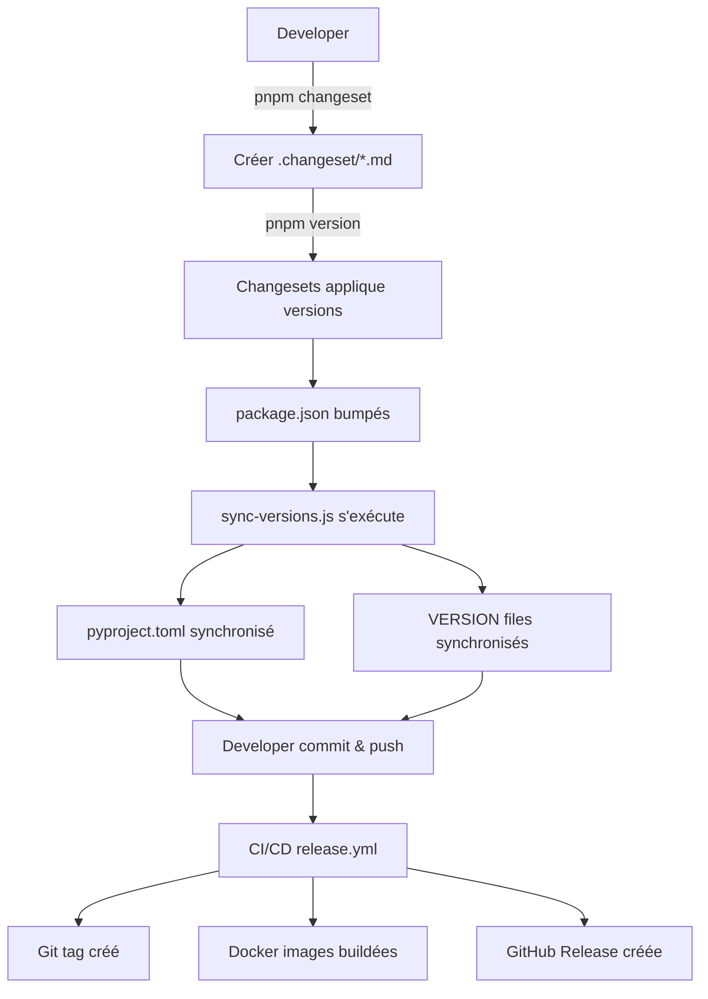

# 🤖 Automatisation du Versioning

Ce document explique comment le système de versioning automatisé fonctionne pour **tous** les services (TypeScript et Python).

---

## 🎯 Objectif

Automatiser complètement la gestion des versions pour :
- **Services TypeScript** (web, gateway) : `package.json → VERSION`
- **Services Python** (translator) : `package.json → pyproject.toml → VERSION`

---

## 🔄 Flux Automatisé Complet

### 1️⃣ Créer un changeset

```bash
# Créer un changeset pour n'importe quel service
pnpm changeset

# Ou ajouter manuellement un fichier .changeset/*.md
```

**Exemple de fichier changeset :**
```markdown
---
"@meeshy/web": minor
"@meeshy/gateway": patch
"@meeshy/translator": minor
---

Ajouter support des avatars AI
```

### 2️⃣ Appliquer les changesets

```bash
# Cette commande fait TOUT automatiquement :
pnpm version

# Équivalent à :
# 1. pnpm changeset version          # Bumpe les package.json
# 2. node scripts/sync-versions.js   # Synchronise → pyproject.toml → VERSION
```

**Ce qui se passe :**
```
Changesets applique les versions
  ↓
package.json : 1.0.0 → 1.1.0  (web, gateway, translator)
  ↓
sync-versions.js s'exécute automatiquement
  ↓
Pour translator :
  package.json (1.1.0) → pyproject.toml (1.1.0) → VERSION (1.1.0)

Pour web/gateway :
  package.json (1.1.0) → VERSION (1.1.0)
```

### 3️⃣ Commit et push

```bash
# Ajouter tous les fichiers modifiés
git add -A

# Commit
git commit -m "chore(release): version packages"

# Push
git push origin dev
```

### 4️⃣ CI/CD prend le relais

Le workflow `.github/workflows/release.yml` :
1. Détecte les changesets
2. Applique `pnpm version` (qui appelle sync-versions.js)
3. Crée les tags Git (v1.1.0)
4. Build les images Docker avec les bonnes versions
5. Crée la GitHub Release

---

## 📦 Mapping des Fichiers

### Services TypeScript (web, gateway)

```
apps/web/package.json
  ↓ sync-versions.js
apps/web/VERSION
  ↓ Dockerfile
Docker: isopen/meeshy-web:v1.0.41
```

### Service Python (translator)

```
services/translator/package.json  ← Source de vérité (Changesets)
  ↓ sync-versions.js
services/translator/pyproject.toml
  ↓ sync-versions.js
services/translator/VERSION
  ↓ Dockerfile
Docker: isopen/meeshy-translator:v1.0.0
```

---

## 🛠️ Script sync-versions.js

### Fonctionnement

Le script `scripts/sync-versions.js` :

1. **Lit** les versions depuis `package.json`
2. **Synchronise** vers `pyproject.toml` (si service Python)
3. **Synchronise** vers `VERSION` (pour tous les services)

### Configuration

```javascript
const VERSION_FILES = [
  {
    packagePath: 'apps/web/package.json',
    versionPath: 'apps/web/VERSION',
    name: 'web',
    type: 'package.json'
  },
  {
    packagePath: 'services/translator/package.json',
    versionPath: 'services/translator/VERSION',
    pyprojectPath: 'services/translator/pyproject.toml',
    name: 'translator',
    type: 'package.json',
    syncPyproject: true  // Synchroniser aussi vers pyproject.toml
  }
];
```

### Exécution manuelle

```bash
# Synchroniser manuellement si nécessaire
pnpm sync-versions

# Ou directement
node scripts/sync-versions.js
```

**Output :**
```
🔄 Synchronisation des versions package.json/pyproject.toml → VERSION files...

✓ OK web: 1.0.41 → 1.0.41
✓ OK gateway: 1.0.40 → 1.0.40
  📝 pyproject.toml: 1.0.0 → 1.0.1
✨ UPDATED translator: 1.0.0 → 1.0.1

============================================================
✅ Synchronisation terminée avec succès
============================================================
```

---

## 📝 Exemples Concrets

### Exemple 1 : Bump patch du translator

```bash
# 1. Créer changeset
pnpm changeset
# → Sélectionner @meeshy/translator
# → Type: patch
# → Message: "Fix TTS voice selection"

# 2. Appliquer
pnpm version

# Résultat automatique :
# ✅ services/translator/package.json : 1.0.0 → 1.0.1
# ✅ services/translator/pyproject.toml : 1.0.0 → 1.0.1
# ✅ services/translator/VERSION : 1.0.0 → 1.0.1
# ✅ services/translator/CHANGELOG.md créé

# 3. Commit
git add -A
git commit -m "chore(release): bump translator to 1.0.1"
git push origin dev
```

### Exemple 2 : Bump minor de plusieurs services

```bash
# 1. Créer changeset
cat > .changeset/new-feature.md <<EOF
---
"@meeshy/web": minor
"@meeshy/gateway": minor
"@meeshy/translator": minor
---

Ajouter support des webhooks temps réel
EOF

# 2. Appliquer
pnpm version

# Résultat automatique :
# ✅ apps/web/package.json : 1.0.41 → 1.1.0
# ✅ apps/web/VERSION : 1.0.41 → 1.1.0
# ✅ services/gateway/package.json : 1.0.40 → 1.1.0
# ✅ services/gateway/VERSION : 1.0.40 → 1.1.0
# ✅ services/translator/package.json : 1.0.0 → 1.1.0
# ✅ services/translator/pyproject.toml : 1.0.0 → 1.1.0
# ✅ services/translator/VERSION : 1.0.0 → 1.1.0

# 3. Commit et push
git add -A
git commit -m "chore(release): version packages to 1.1.0"
git push origin dev
```

---

## 🔍 Vérification

### Vérifier que les versions sont alignées

```bash
# Script rapide
echo "WEB:        $(cat apps/web/VERSION)"
echo "GATEWAY:    $(cat services/gateway/VERSION)"
echo "TRANSLATOR: $(cat services/translator/VERSION)"
echo ""
echo "Sources:"
echo "web package.json:        $(jq -r .version apps/web/package.json)"
echo "gateway package.json:    $(jq -r .version services/gateway/package.json)"
echo "translator package.json: $(jq -r .version services/translator/package.json)"
echo "translator pyproject.toml: $(grep '^version' services/translator/pyproject.toml | cut -d'"' -f2)"
```

### Vérifier que Makefile lit les bonnes versions

```bash
# Simuler le build sans l'exécuter
make -n build-all-docker | grep VERSION
```

**Output attendu :**
```
--build-arg VERSION="1.0.41" ...meeshy-web...
--build-arg VERSION="1.0.40" ...meeshy-gateway...
--build-arg VERSION="1.0.0" ...meeshy-translator...
```

---

## 🚨 Troubleshooting

### Problème : Les versions ne sont pas synchronisées

**Cause :** Le script sync-versions.js n'a pas été exécuté après changeset version

**Solution :**
```bash
# Re-synchroniser manuellement
pnpm sync-versions

# Vérifier que le script version dans package.json root contient :
# "version": "changeset version && node scripts/sync-versions.js"
```

### Problème : pyproject.toml n'est pas mis à jour

**Cause :** Le translator n'a pas de package.json ou syncPyproject n'est pas activé

**Solution :**
```bash
# Vérifier que package.json existe
ls -la services/translator/package.json

# Vérifier la config dans sync-versions.js
grep -A 5 "translator" scripts/sync-versions.js
```

### Problème : Make docker-build utilise les mauvaises versions

**Cause :** Les fichiers VERSION ne sont pas synchronisés

**Solution :**
```bash
# Re-synchroniser
pnpm sync-versions

# Vérifier les VERSION files
cat apps/web/VERSION
cat services/gateway/VERSION
cat services/translator/VERSION
```

---

## 📊 Workflow Complet



---

## ✅ Avantages de l'Automatisation

1. **Cohérence garantie** : Toutes les versions sont toujours alignées
2. **Zero erreur manuelle** : Plus besoin de mettre à jour manuellement pyproject.toml
3. **Process unifié** : Même workflow pour TypeScript et Python
4. **Traçabilité** : CHANGELOG automatique pour tous les services
5. **CI/CD intégré** : Le workflow release gère tout automatiquement

---

## 📚 Voir Aussi

- [VERSIONING.md](./VERSIONING.md) - Architecture du système de versioning
- [DOCKER-TAGGING.md](./DOCKER-TAGGING.md) - Stratégie de tagging Docker
- [CHANGESETS-USAGE.md](./CHANGESETS-USAGE.md) - Guide d'utilisation des Changesets
- [RELEASE-WORKFLOW.md](./RELEASE-WORKFLOW.md) - Workflow de release CI/CD
