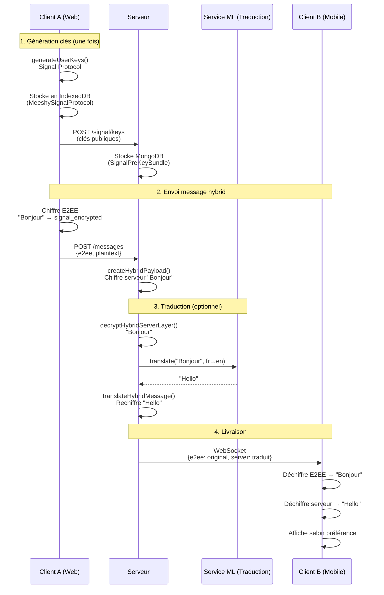

# Architecture E2EE Meeshy - Documentation complète

**Date de création** : 2026-01-28
**Version** : 1.0
**Status** : Analyse complète du système existant + Roadmap

---

## 📋 Table des matières

1. [Vue d'ensemble](#vue-densemble)
2. [Les 3 modes de chiffrement](#les-3-modes-de-chiffrement)
3. [Architecture technique](#architecture-technique)
4. [Flux complet : Envoi d'un message hybrid](#flux-complet--envoi-dun-message-hybrid)
5. [Génération des clés](#génération-des-clés)
6. [Stockage des clés](#stockage-des-clés)
7. [Problèmes identifiés](#problèmes-identifiés)
8. [Roadmap de développement](#roadmap-de-développement)
9. [Références techniques](#références-techniques)

---

## Vue d'ensemble

### Objectifs du système E2EE

Meeshy implémente un système de **chiffrement de bout en bout (E2EE)** avec support de la **traduction automatique**. Cette combinaison unique nécessite une architecture de **double chiffrement** :

1. **Couche E2EE** (Signal Protocol) : Sécurité maximale entre utilisateurs
2. **Couche serveur** (AES-256-GCM) : Permet la traduction côté serveur

### Technologies utilisées

| Composant | Technologie | Usage |
|-----------|-------------|-------|
| **E2EE (Web)** | `@signalapp/libsignal-client` | Chiffrement Signal Protocol |
| **E2EE (iOS)** | CryptoKit + Keychain | Chiffrement natif iOS |
| **Serveur** | Node.js `crypto` module | AES-256-GCM |
| **Stockage Web** | IndexedDB (2 databases) | Clés privées client |
| **Stockage iOS** | iOS Keychain | Clés privées sécurisées |
| **Stockage Serveur** | MongoDB | Clés publiques + clés serveur |

---

## Les 3 modes de chiffrement

### 1. Mode `e2ee` - Chiffrement de bout en bout pur

**Caractéristiques** :
- ✅ Sécurité maximale (protocole Signal)
- ✅ Clés privées jamais envoyées au serveur
- ❌ **PAS de traduction** (serveur ne peut pas déchiffrer)
- 🔒 Seuls l'expéditeur et le destinataire peuvent lire

**Use cases** :
- Conversations sensibles
- Messages confidentiels
- Conformité RGPD stricte

**Structure du message** :

```json
{
  "ciphertext": "U2lnbmFsUHJvdG9jb2xFbmNyeXB0ZWQ=",
  "metadata": {
    "mode": "e2ee",
    "protocol": "signal_v3",
    "messageType": 2,
    "registrationId": 12345
  }
}
```

### 2. Mode `server` - Chiffrement serveur uniquement

**Caractéristiques** :
- 🔓 Le serveur peut déchiffrer
- ✅ **Traduction supportée**
- 🔐 AES-256-GCM avec clé maître
- 🗄️ Clés stockées en MongoDB

**Use cases** :
- Conversations multilingues
- Support client nécessitant accès serveur
- Modération de contenu

**Structure du message** :

```json
{
  "ciphertext": "QWVzMjU2R2NtRW5jcnlwdGVk",
  "metadata": {
    "mode": "server",
    "protocol": "aes-256-gcm",
    "keyId": "conv-abc123-key",
    "iv": "cmFuZG9taXY=",
    "authTag": "YXV0aHRhZw=="
  }
}
```

### 3. Mode `hybrid` - Double chiffrement ⭐

**Caractéristiques** :
- 🔐 **Double couche de sécurité**
- ✅ Traduction supportée **ET** E2EE
- 🎯 Le meilleur des deux mondes
- 📦 Deux payloads en un seul message

**Use cases** :
- **RECOMMANDÉ** pour toutes les conversations
- Traduction internationale + sécurité
- Conformité + fonctionnalité

**Structure du message** :

```json
{
  "e2ee": {
    "ciphertext": "U2lnbmFs...Qg==",
    "type": 2,
    "senderRegistrationId": 12345,
    "recipientRegistrationId": 67890
  },
  "server": {
    "ciphertext": "QWVz...Rm9v",
    "iv": "cmFuZG9t...aXY=",
    "authTag": "YXV0aFRh...Zw==",
    "keyId": "conv-abc123-key"
  },
  "mode": "hybrid",
  "canTranslate": true,
  "timestamp": 1706380800000
}
```

**Flux de traduction hybrid** :

```
Message original : "Bonjour monde" (fr)

┌─────────────────────────────────────────────┐
│ CLIENT A (Français)                          │
└─────────────────────────────────────────────┘
   │
   ├─► Couche E2EE : "Bonjour monde" → "U2lnbmFs..."
   └─► Envoie aussi plaintext au serveur

┌─────────────────────────────────────────────┐
│ SERVEUR                                      │
└─────────────────────────────────────────────┘
   │
   ├─► Couche E2EE : Conserve inchangée
   ├─► Couche serveur : Chiffre "Bonjour monde"
   │
   ├─► Déchiffre couche serveur pour traduire
   ├─► Traduit : "Bonjour monde" → "Hello world"
   ├─► Rechiffre : "Hello world" avec couche serveur
   │
   └─► ⚠️ Couche E2EE reste "Bonjour monde" (inchangée)

┌─────────────────────────────────────────────┐
│ CLIENT B (Anglais)                           │
└─────────────────────────────────────────────┘
   │
   ├─► Déchiffre E2EE → "Bonjour monde" (original)
   ├─► Déchiffre serveur → "Hello world" (traduit)
   │
   └─► Affiche selon préférence :
       - Option 1 : "Hello world" (traduit)
       - Option 2 : "Bonjour monde" (original)
       - Option 3 : Toggle entre les deux
```

---

## Architecture technique

### Hiérarchie des services

```
┌─────────────────────────────────────────────────────────┐
│                    CLIENT (Web/Mobile)                   │
├─────────────────────────────────────────────────────────┤
│                                                           │
│  packages/shared/encryption/                             │
│  ├─ SharedEncryptionService                             │
│  ├─ encryption-utils.ts (ECDH, AES-256-GCM)            │
│  └─ signal/ (Signal Protocol types)                     │
│                                                           │
│  apps/web/lib/encryption/adapters/                      │
│  ├─ web-crypto-adapter.ts (Web Crypto API)             │
│  ├─ indexeddb-key-storage-adapter.ts                   │
│  └─ browser-signal-stores.ts (@signalapp/libsignal)    │
│                                                           │
│  apps/web/hooks/                                         │
│  └─ use-encryption.ts (React hook)                      │
│                                                           │
│  apps/ios/Meeshy/Services/                              │
│  └─ E2EEncryptionService.swift (CryptoKit + Keychain)  │
│                                                           │
└─────────────────────────────────────────────────────────┘
                           │
                           │ WebSocket/HTTP
                           ▼
┌─────────────────────────────────────────────────────────┐
│                     SERVEUR (Gateway)                    │
├─────────────────────────────────────────────────────────┤
│                                                           │
│  services/gateway/src/services/                          │
│  ├─ EncryptionService.ts                                │
│  │   ├─ generatePreKeyBundle()                          │
│  │   ├─ encryptHybridServerLayer()                      │
│  │   ├─ decryptHybridServerLayer()                      │
│  │   ├─ translateHybridMessage()                        │
│  │   └─ createHybridPayload()                           │
│  │                                                        │
│  ├─ MessageProcessor.ts                                 │
│  └─ MessageTranslationService.ts                        │
│                                                           │
│  services/gateway/src/routes/                            │
│  └─ signal-protocol.ts                                  │
│      ├─ POST /api/v1/signal/keys (générer clés)        │
│      ├─ GET /api/v1/signal/keys/:userId                │
│      └─ POST /api/v1/signal/session/establish          │
│                                                           │
└─────────────────────────────────────────────────────────┘
                           │
                           ▼
┌─────────────────────────────────────────────────────────┐
│                    BASE DE DONNÉES                       │
├─────────────────────────────────────────────────────────┤
│                                                           │
│  MongoDB Collections:                                    │
│  ├─ SignalPreKeyBundle (clés publiques Signal)          │
│  ├─ ServerEncryptionKey (clés serveur AES-256)         │
│  └─ Message (messages chiffrés)                         │
│                                                           │
└─────────────────────────────────────────────────────────┘
```

### Diagramme de séquence complet



---

## Flux complet : Envoi d'un message hybrid

### Phase 1 : Client A - Préparation

**Fichier** : `apps/web/hooks/use-encryption.ts`

```typescript
// 1. Utilisateur tape "Bonjour monde"
const prepareMessage = async (
  content: "Bonjour monde",
  conversationId: "conv-123",
  encryptionMode: "hybrid"
) => {
  // 2. Récupère les clés du destinataire
  const recipientKeys = await getRecipientPublicKeys(recipientUserId);

  // 3. Établit une session Signal si nécessaire
  if (!hasSession) {
    await establishSession(recipientKeys);
  }

  // 4. Chiffre avec Signal Protocol (E2EE)
  const signalMessage = await signalService.encryptMessage(
    recipientAddress,
    new TextEncoder().encode("Bonjour monde")
  );

  const e2eeData = {
    ciphertext: Buffer.from(signalMessage.content).toString('base64'),
    type: 2, // WhisperMessage
    senderRegistrationId: myRegistrationId,
    recipientRegistrationId: theirRegistrationId
  };

  // 5. Envoie au serveur
  return {
    content: "Bonjour monde",  // Plaintext pour serveur
    encryptionMode: "hybrid",
    e2eeData: e2eeData
  };
};
```

### Phase 2 : Serveur - Création payload hybrid

**Fichier** : `services/gateway/src/services/EncryptionService.ts`

```typescript
async createHybridPayload(
  e2eeData: {
    ciphertext: "U2lnbmFsRW5jcnlwdGVk",
    type: 2,
    senderRegistrationId: 12345,
    recipientRegistrationId: 67890
  },
  plaintext: "Bonjour monde",
  conversationId: "conv-123"
): Promise<HybridEncryptedPayload> {

  // 1. Récupère ou crée clé de conversation
  const keyId = await this.getOrCreateConversationKey(conversationId);
  // keyId = "conv-123-aes-key-uuid"

  // 2. Récupère la clé depuis MongoDB
  const key = await this.keyVault.getKey(keyId);
  // key = Buffer<32 bytes> (AES-256)

  // 3. Génère IV aléatoire (jamais réutiliser)
  const iv = crypto.randomBytes(12); // 96 bits

  // 4. Chiffre avec AES-256-GCM
  const cipher = crypto.createCipheriv('aes-256-gcm', key, iv);
  const ciphertext = Buffer.concat([
    cipher.update("Bonjour monde", 'utf8'),
    cipher.final()
  ]);
  const authTag = cipher.getAuthTag(); // 128 bits

  // 5. Retourne payload complet
  return {
    e2ee: e2eeData,  // ← Conservé tel quel
    server: {
      ciphertext: ciphertext.toString('base64'),
      iv: iv.toString('base64'),
      authTag: authTag.toString('base64'),
      keyId: keyId
    },
    mode: 'hybrid',
    canTranslate: true,
    timestamp: Date.now()
  };
}
```

### Phase 3 : Serveur - Traduction

**Fichier** : `services/gateway/src/services/message-translation/MessageTranslationService.ts`

```typescript
async translateMessage(message: Message) {
  const payload = message.encryptionMetadata as HybridEncryptedPayload;

  // 1. Vérifie que c'est traduisible
  if (payload.mode !== 'hybrid' || !payload.canTranslate) {
    throw new Error('Message not translatable');
  }

  // 2. Déchiffre la couche serveur
  const originalText = await encryptionService.decryptHybridServerLayer(
    payload.server
  );
  // originalText = "Bonjour monde"

  // 3. Détecte la langue source
  const sourceLang = await detectLanguage(originalText);
  // sourceLang = "fr"

  // 4. Traduit vers langue cible
  const targetLang = await getUserPreferredLanguage(recipientUserId);
  // targetLang = "en"

  const translatedText = await translatorService.translate(
    originalText,
    sourceLang,
    targetLang
  );
  // translatedText = "Hello world"

  // 5. Rechiffre avec la traduction
  const translatedPayload = await encryptionService.translateHybridMessage(
    payload,
    translatedText
  );

  // ⚠️ IMPORTANT : Couche E2EE reste "Bonjour monde"
  // Couche serveur devient "Hello world"

  return translatedPayload;
}
```

### Phase 4 : Client B - Réception

**Fichier** : `apps/web/hooks/use-encryption.ts`

```typescript
async processReceivedMessage(message: {
  encryptedContent: HybridEncryptedPayload
}) {
  const payload = message.encryptedContent;

  // 1. Déchiffre couche E2EE (message original)
  const e2eeDecrypted = await this.signalService.decryptMessage(
    senderAddress,
    {
      content: Buffer.from(payload.e2ee.ciphertext, 'base64'),
      type: payload.e2ee.type
    }
  );
  const originalText = new TextDecoder().decode(e2eeDecrypted);
  // originalText = "Bonjour monde"

  // 2. Déchiffre couche serveur (message traduit)
  let translatedText = null;

  if (payload.server && payload.canTranslate) {
    const conversationKey = await this.keyStorage.getConversationKey(
      conversationId
    );

    if (conversationKey) {
      const key = await this.keyStorage.getKey(conversationKey.keyId);
      const serverDecrypted = await this.cryptoAdapter.decrypt(
        {
          ciphertext: base64ToUint8Array(payload.server.ciphertext),
          iv: base64ToUint8Array(payload.server.iv),
          authTag: base64ToUint8Array(payload.server.authTag)
        },
        key
      );
      translatedText = uint8ArrayToString(serverDecrypted);
      // translatedText = "Hello world"
    }
  }

  // 3. Retourne selon préférence utilisateur
  const userPreference = await getUserDisplayPreference();

  return {
    original: originalText,        // "Bonjour monde"
    translated: translatedText,     // "Hello world"
    display: userPreference === 'translated'
      ? translatedText
      : originalText
  };
}
```

---

## Génération des clés

### Client Web - Signal Protocol (recommandé)

**Fichier** : `apps/web/lib/encryption/adapters/browser-signal-stores.ts`

```typescript
export async function createBrowserSignalStores(
  config: { userId: string }
): Promise<SignalProtocolStores> {

  // 1. Génère ID d'enregistrement aléatoire (1-16380)
  const registrationId = Math.floor(Math.random() * 16380) + 1;

  // 2. Crée les stores IndexedDB
  const identityStore = new BrowserIdentityKeyStore(
    config.userId,
    registrationId
  );
  const preKeyStore = new BrowserPreKeyStore();
  const signedPreKeyStore = new BrowserSignedPreKeyStore();
  const kyberPreKeyStore = new BrowserKyberPreKeyStore();
  const sessionStore = new BrowserSessionStore();

  // 3. Charge clés existantes ou génère nouvelles
  try {
    await identityStore.loadFromStorage();
    console.log('✅ Clés Signal chargées depuis IndexedDB');
  } catch {
    // 🔑 GÉNÉRATION NOUVELLE PAIRE DE CLÉS
    const identityKeyPair = IdentityKeyPair.generate();
    await identityStore.initialize(identityKeyPair);
    console.log('🔑 Nouvelles clés Signal générées');
  }

  return {
    identityStore,
    preKeyStore,
    signedPreKeyStore,
    kyberPreKeyStore,
    sessionStore
  };
}
```

**Stockage** :
- **Database** : `MeeshySignalProtocol` (IndexedDB)
- **Tables** :
  - `identity` : IdentityKeyPair + registrationId
  - `preKeys` : PreKeyRecord[]
  - `signedPreKeys` : SignedPreKeyRecord[]
  - `kyberPreKeys` : KyberPreKeyRecord[] (post-quantum)
  - `sessions` : SessionRecord[]
  - `trustedIdentities` : Map<address, PublicKey>

### Client Web - ECDH Fallback

**Fichier** : `packages/shared/encryption/encryption-utils.ts`

```typescript
export async function generateSignalKeyPair(
  adapter: CryptoAdapter // WebCryptoAdapter
): Promise<{ publicKey: string; privateKey: string }> {

  // 1. Génère paire ECDH P-256
  const keyPair = await adapter.generateECDHKeyPair();
  // Utilise Web Crypto API :
  // crypto.subtle.generateKey({
  //   name: 'ECDH',
  //   namedCurve: 'P-256'
  // }, true, ['deriveKey', 'deriveBits'])

  // 2. Exporte au format standard
  const publicKeyBytes = await adapter.exportPublicKey(keyPair.publicKey);
  // Format SPKI (SubjectPublicKeyInfo)

  const privateKeyBytes = await adapter.exportPrivateKey(keyPair.privateKey);
  // Format PKCS8

  // 3. Encode en base64
  return {
    publicKey: uint8ArrayToBase64(publicKeyBytes),
    privateKey: uint8ArrayToBase64(privateKeyBytes)
  };
}
```

**Stockage** :
- **Database** : `meeshy_encryption` (IndexedDB)
- **Table** : `user_keys`
  - `userId` : string
  - `publicKey` : string (base64)
  - `privateKey` : string (base64) ⚠️ **TODO: Chiffrer avec password**
  - `registrationId` : number
  - `createdAt` : number

### Client iOS - CryptoKit

**Fichier** : `apps/ios/Meeshy/Services/E2EEncryptionService.swift`

```swift
final class E2EEncryptionService {
    private let keychainService = KeychainService.shared
    private let keyPrefix = "e2e_key_"
    private let keySize = 32 // AES-256

    /// Génère une nouvelle clé de chiffrement
    func generateKey(for conversationId: String) async throws {
        // 1. Génère clé AES-256 aléatoire
        let symmetricKey = SymmetricKey(size: .bits256)

        // 2. Stocke dans iOS Keychain (sécurisé)
        let keyData = symmetricKey.withUnsafeBytes { Data($0) }
        try await keychainService.save(
            keyData,
            forKey: "\(keyPrefix)\(conversationId)",
            withAccess: .whenUnlockedThisDeviceOnly
        )

        // 3. Cache en mémoire
        keyCache[conversationId] = SymmetricKeyWrapper(key: symmetricKey)
    }

    /// Chiffre un message avec AES-256-GCM
    func encrypt(_ message: String, for conversationId: String) async throws -> EncryptedPayload {
        guard let key = try await getKey(for: conversationId) else {
            throw E2EEncryptionError.keyNotFound
        }

        // 1. Convertit en Data
        guard let messageData = message.data(using: .utf8) else {
            throw E2EEncryptionError.messageEncodingFailed
        }

        // 2. Génère nonce aléatoire
        let nonce = try AES.GCM.Nonce()

        // 3. Chiffre avec AES-GCM
        let sealedBox = try AES.GCM.seal(
            messageData,
            using: key.key,
            nonce: nonce
        )

        // 4. Extrait composants
        let ciphertext = sealedBox.ciphertext
        let tag = sealedBox.tag

        return EncryptedPayload(
            ciphertextData: ciphertext,
            ivData: nonce.withUnsafeBytes { Data($0) },
            authTagData: tag,
            mode: "e2ee"
        )
    }
}
```

**Stockage** :
- **iOS Keychain** : Stockage sécurisé natif
- **Access** : `whenUnlockedThisDeviceOnly`
- **Sync** : ❌ Pas de sync iCloud (par design de sécurité)

### Serveur - Signal Protocol

**Fichier** : `services/gateway/src/services/EncryptionService.ts`

```typescript
async generatePreKeyBundle(): Promise<PreKeyBundle> {
  // 1. Génère paire de clés d'identité
  const identityKeyPair = SignalLib.IdentityKeyPair.generate();
  const identityPublicKey = identityKeyPair.publicKey;

  // 2. Génère registration ID (1-16380)
  const registrationId = crypto.randomInt(1, 16380);
  const deviceId = 1; // ⚠️ HARDCODÉ - TODO: Multi-device

  // 3. Génère pre-key (usage unique)
  const preKeyId = crypto.randomInt(1, 16777215);
  const preKeyPrivate = SignalLib.PrivateKey.generate();
  const preKeyPublic = preKeyPrivate.getPublicKey();

  // 4. Génère signed pre-key (rotation périodique)
  const signedPreKeyId = crypto.randomInt(1, 16777215);
  const signedPreKeyPrivate = SignalLib.PrivateKey.generate();
  const signedPreKeyPublic = signedPreKeyPrivate.getPublicKey();

  // 5. Signe avec la clé d'identité
  const signedPreKeySignature = identityKeyPair.privateKey.sign(
    signedPreKeyPublic.serialize()
  );

  // 6. Génère clé post-quantique Kyber (optionnel)
  const kyberPreKeyId = crypto.randomInt(1, 16777215);
  const kyberPreKeyPrivate = SignalLib.PrivateKey.generate();
  const kyberPreKeyPublic = kyberPreKeyPrivate.getPublicKey();

  // 7. Stocke en MongoDB
  await prisma.signalPreKeyBundle.upsert({
    where: { userId },
    create: {
      userId,
      identityKey: Buffer.from(identityPublicKey.getPublicKeyBytes()).toString('base64'),
      registrationId,
      deviceId,
      preKeyId,
      preKeyPublic: Buffer.from(preKeyPublic.serialize()).toString('base64'),
      signedPreKeyId,
      signedPreKeyPublic: Buffer.from(signedPreKeyPublic.serialize()).toString('base64'),
      signedPreKeySignature: Buffer.from(signedPreKeySignature).toString('base64'),
      kyberPreKeyId,
      kyberPreKeyPublic: Buffer.from(kyberPreKeyPublic.serialize()).toString('base64'),
      createdAt: new Date(),
      lastRotatedAt: new Date()
    }
  });

  return {
    identityKey: new Uint8Array(identityPublicKey.getPublicKeyBytes()),
    registrationId,
    deviceId,
    preKeyId,
    preKeyPublic: new Uint8Array(preKeyPublic.serialize()),
    signedPreKeyId,
    signedPreKeyPublic: new Uint8Array(signedPreKeyPublic.serialize()),
    signedPreKeySignature: new Uint8Array(signedPreKeySignature),
    kyberPreKeyId,
    kyberPreKeyPublic: new Uint8Array(kyberPreKeyPublic.serialize()),
    kyberPreKeySignature: null
  };
}
```

**Stockage** :
- **MongoDB Collection** : `SignalPreKeyBundle`
- **Contenu** : Clés publiques uniquement (pas de clés privées)
- **Index** : `userId` (unique)

---

## Stockage des clés

### Récapitulatif par plateforme

| Plateforme | Clés privées | Clés publiques | Synchronisation |
|------------|--------------|----------------|-----------------|
| **Web (Chrome)** | IndexedDB `MeeshySignalProtocol` | IndexedDB + Serveur | ❌ Aucune |
| **iOS App** | Keychain iOS | Keychain + Serveur | ❌ Aucune |
| **Serveur** | ❌ N'a pas les clés privées E2EE | MongoDB `SignalPreKeyBundle` | N/A |
| **Serveur (mode hybrid)** | MongoDB `ServerEncryptionKey` | MongoDB | Partagé avec clients |

### Base de données MongoDB

#### Collection : `SignalPreKeyBundle`

```typescript
{
  _id: ObjectId("..."),
  userId: "user-abc123",
  identityKey: "Base64EncodedPublicKey...",
  registrationId: 12345,
  deviceId: 1,  // ⚠️ Toujours 1 actuellement
  preKeyId: 67890,
  preKeyPublic: "Base64EncodedPreKeyPublic...",
  signedPreKeyId: 11111,
  signedPreKeyPublic: "Base64EncodedSignedPreKey...",
  signedPreKeySignature: "Base64EncodedSignature...",
  kyberPreKeyId: 22222,
  kyberPreKeyPublic: "Base64EncodedKyberKey...",
  kyberPreKeySignature: null,
  createdAt: ISODate("2026-01-28T10:00:00Z"),
  lastRotatedAt: ISODate("2026-01-28T10:00:00Z")
}
```

#### Collection : `ServerEncryptionKey`

```typescript
{
  _id: ObjectId("..."),
  id: "conv-abc123-aes-key-uuid",
  encryptedKey: "Base64EncodedEncryptedKey...",
  iv: "Base64IV...",
  authTag: "Base64AuthTag...",
  algorithm: "aes-256-gcm",
  purpose: "conversation",
  conversationId: "conv-abc123",
  createdAt: ISODate("2026-01-28T10:00:00Z"),
  lastAccessedAt: ISODate("2026-01-28T12:00:00Z")
}
```

### IndexedDB (Web)

#### Database 1 : `MeeshySignalProtocol`

**Object Stores** :
- `identity` : IdentityKeyPair sérialisé
- `preKeys` : Map<preKeyId, PreKeyRecord>
- `signedPreKeys` : Map<signedPreKeyId, SignedPreKeyRecord>
- `kyberPreKeys` : Map<kyberPreKeyId, KyberPreKeyRecord>
- `sessions` : Map<address, SessionRecord>
- `trustedIdentities` : Map<address, PublicKey>

**Exemple de données** :

```javascript
// identity store
{
  key: "user-abc123",
  value: {
    identityKeyPair: Uint8Array[...],  // Sérialisé
    registrationId: 12345
  }
}

// sessions store
{
  key: "user-xyz789:1",  // "userId:deviceId"
  value: Uint8Array[...]  // SessionRecord sérialisé
}
```

#### Database 2 : `meeshy_encryption`

**Object Stores** :
- `encryption_keys` : Clés AES pour conversations
- `conversation_keys` : Mapping conversationId → keyId
- `user_keys` : Clés ECDH (fallback)

**Exemple de données** :

```javascript
// user_keys store
{
  userId: "user-abc123",
  publicKey: "Base64PublicKey...",
  privateKey: "Base64PrivateKey...",  // ⚠️ TODO: Chiffrer
  registrationId: 12345,
  identityKey: "Base64IdentityKey...",
  preKeyBundleVersion: 1,
  createdAt: 1706380800000
}

// conversation_keys store
{
  conversationId: "conv-abc123",
  keyId: "key-uuid-xyz",
  mode: "hybrid",
  createdAt: 1706380800000
}
```

### iOS Keychain

**Structure** :

```swift
// Clé stockée avec attributs de sécurité
let query: [String: Any] = [
    kSecClass as String: kSecClassGenericPassword,
    kSecAttrAccount as String: "e2e_key_conv-abc123",
    kSecAttrService as String: "me.meeshy.encryption",
    kSecAttrAccessible as String: kSecAttrAccessibleWhenUnlockedThisDeviceOnly,
    kSecValueData as String: keyData  // 32 bytes AES-256
]
```

**Attributs de sécurité** :
- `kSecAttrAccessibleWhenUnlockedThisDeviceOnly` : Clé accessible uniquement quand device déverrouillé
- **Pas de sync iCloud** : Par design (sécurité E2EE)
- **Protection hardware** : Utilise Secure Enclave si disponible

---

## Problèmes identifiés

### 1. ❌ Génération de clés CLIENT : Pas automatique

**Problème** :

L'utilisateur doit **manuellement** générer ses clés E2EE en allant dans :
1. Paramètres
2. Sécurité
3. Cliquer sur "Générer les clés"

**Impact** :
- ⚠️ La plupart des utilisateurs n'activeront jamais E2EE
- ⚠️ Pas de prompt au premier login
- ⚠️ Pas de détection "Vous n'avez pas de clés"

**Fichier concerné** : `apps/web/components/settings/encryption-settings.tsx`

```typescript
// Actuellement : Bouton manuel
<Button onClick={generateKeys} disabled={generatingKeys}>
  {t('encryption.actions.generateKeys')}
</Button>
```

**Solution recommandée** :

```typescript
// apps/web/hooks/use-auth.ts
useEffect(() => {
  async function autoInitEncryption() {
    if (user && !user.signalRegistrationId) {
      // Affiche modal de onboarding E2EE
      const shouldGenerate = await showEncryptionOnboardingDialog({
        title: "Sécuriser vos conversations ?",
        message: "Activez le chiffrement de bout en bout pour protéger votre vie privée.",
        benefits: [
          "🔒 Vos messages ne peuvent être lus que par vous et votre destinataire",
          "🌍 Conservez la traduction automatique (mode hybrid)",
          "✅ Conformité RGPD et protection maximale"
        ]
      });

      if (shouldGenerate) {
        await generateClientKeys();
        await uploadPublicKeysToServer();
        toast.success("Chiffrement activé ! Vos conversations sont maintenant sécurisées.");
      }
    }
  }

  autoInitEncryption();
}, [user]);
```

### 2. ❌ Multi-device : Pas supporté

**Problème** :

Le `deviceId` est **hardcodé à 1** dans le code serveur :

```typescript
// services/gateway/src/services/EncryptionService.ts:793
const deviceId = 1;  // ⚠️ TOUJOURS 1
```

**Impact** :

| Scénario | Résultat | Explication |
|----------|----------|-------------|
| Web → Mobile | ❌ **Perte de messages** | Clés Web en IndexedDB, clés iOS en Keychain → Incompatibles |
| Clear cache | ❌ **Perte de TOUTES les clés** | IndexedDB effacé = Tous les messages E2EE illisibles |
| Multiple browsers | ❌ **Clés différentes** | Chrome ≠ Firefox ≠ Safari |
| Backup iOS | ⚠️ **Partiel** | Keychain backup mais pas de sync multi-device |

**Exemple concret** :

```
Jour 1 : Alice sur Chrome (Web)
├─ Génère clés : identityKey_chrome, regId_12345
├─ Bob lui envoie : "Message secret 1"
└─ Alice lit sans problème

Jour 2 : Alice ouvre l'app iOS
├─ Génère clés : identityKey_ios, regId_67890
├─ Bob lui envoie : "Message secret 2"
└─ Alice lit sans problème sur iOS

Jour 3 : Alice retourne sur Chrome
├─ Essaie de lire "Message secret 2"
└─ ❌ ERREUR : Clé de déchiffrement introuvable
    ↳ Message chiffré avec identityKey_ios
    ↳ Chrome a seulement identityKey_chrome

Jour 4 : Alice vide le cache Chrome
├─ IndexedDB effacé
└─ ❌ PERTE TOTALE : "Message secret 1" illisible à jamais
```

**Solution recommandée** :

Implémenter le système **Linked Devices** comme Signal :

```typescript
// Nouvelle table
model UserDevice {
  id              String   @id @default(cuid())
  userId          String
  deviceId        Int      // 1, 2, 3...
  deviceName      String   // "Chrome Windows", "iPhone 13"
  deviceType      String   // "web", "ios", "android"
  registrationId  Int
  identityKey     String   // Clé publique
  isPrimary       Boolean  @default(false)
  lastSeenAt      DateTime
  createdAt       DateTime @default(now())

  @@unique([userId, deviceId])
  @@index([userId])
}

// Génération deviceId dynamique
async function getNextDeviceId(userId: string): Promise<number> {
  const devices = await prisma.userDevice.findMany({
    where: { userId },
    orderBy: { deviceId: 'desc' },
    take: 1
  });

  return devices.length > 0 ? devices[0].deviceId + 1 : 1;
}

// Envoi à tous les devices
async function sendToAllDevices(userId: string, message: EncryptedPayload) {
  const devices = await prisma.userDevice.findMany({
    where: {
      userId,
      lastSeenAt: { gte: new Date(Date.now() - 30 * 24 * 60 * 60 * 1000) }  // Actif dans les 30 derniers jours
    }
  });

  for (const device of devices) {
    const deviceMessage = await encryptForDevice(message, device);
    await deliverToDevice(userId, device.deviceId, deviceMessage);
  }
}
```

### 3. ❌ Synchronisation des clés : Inexistante

**Problème** :

Aucun mécanisme de backup ou sync des clés privées entre devices.

**Solutions possibles** :

#### Option A : Backup chiffré serveur

```typescript
async function backupKeysToServer(password: string) {
  // 1. Exporte toutes les clés privées
  const privateKeys = {
    identityKey: await exportIdentityKey(),
    preKeys: await exportAllPreKeys(),
    sessions: await exportAllSessions()
  };

  // 2. Dérive clé de chiffrement depuis password
  const salt = crypto.randomBytes(32);
  const iterations = 100000;  // PBKDF2
  const encryptionKey = await crypto.subtle.deriveKey(
    {
      name: 'PBKDF2',
      salt: salt,
      iterations: iterations,
      hash: 'SHA-256'
    },
    await crypto.subtle.importKey(
      'raw',
      new TextEncoder().encode(password),
      'PBKDF2',
      false,
      ['deriveBits', 'deriveKey']
    ),
    { name: 'AES-GCM', length: 256 },
    true,
    ['encrypt', 'decrypt']
  );

  // 3. Chiffre les clés
  const iv = crypto.randomBytes(12);
  const encrypted = await crypto.subtle.encrypt(
    { name: 'AES-GCM', iv: iv },
    encryptionKey,
    new TextEncoder().encode(JSON.stringify(privateKeys))
  );

  // 4. Stocke sur serveur
  await apiService.post('/users/me/key-backup', {
    encryptedKeys: Buffer.from(encrypted).toString('base64'),
    salt: Buffer.from(salt).toString('base64'),
    iv: Buffer.from(iv).toString('base64'),
    iterations: iterations,
    algorithm: 'AES-256-GCM',
    derivation: 'PBKDF2-SHA256'
  });
}

async function restoreKeysFromBackup(password: string) {
  const backup = await apiService.get('/users/me/key-backup');

  // Dérive la même clé
  const encryptionKey = await deriveKeyFromPassword(
    password,
    Buffer.from(backup.salt, 'base64'),
    backup.iterations
  );

  // Déchiffre
  const decrypted = await crypto.subtle.decrypt(
    {
      name: 'AES-GCM',
      iv: Buffer.from(backup.iv, 'base64')
    },
    encryptionKey,
    Buffer.from(backup.encryptedKeys, 'base64')
  );

  const privateKeys = JSON.parse(new TextDecoder().decode(decrypted));

  // Importe dans IndexedDB
  await importAllKeys(privateKeys);
}
```

**Avantages** :
- ✅ Fonctionne entre tous les devices
- ✅ Backup centralisé
- ✅ Sécurisé (chiffré avec password utilisateur)

**Inconvénients** :
- ⚠️ Nécessite un password fort (8+ caractères)
- ⚠️ Si password oublié → Perte des clés
- ⚠️ Le serveur stocke les clés (même chiffrées)

#### Option B : QR Code entre devices

```typescript
async function generateLinkQRCode() {
  // 1. Exporte clés privées
  const privateKeys = await exportAllPrivateKeys();

  // 2. Génère clé éphémère
  const ephemeralKey = crypto.randomBytes(32);
  const linkToken = crypto.randomBytes(16).toString('hex');

  // 3. Chiffre avec clé éphémère
  const encrypted = await encryptWithKey(privateKeys, ephemeralKey);

  // 4. Upload temporairement (5 minutes)
  await apiService.post('/link-device', {
    linkToken,
    encryptedKeys: encrypted,
    expiresAt: Date.now() + 5 * 60 * 1000
  });

  // 5. Génère QR avec : linkToken + ephemeralKey
  const qrData = JSON.stringify({
    token: linkToken,
    key: Buffer.from(ephemeralKey).toString('base64')
  });

  return generateQRCode(qrData);
}

async function scanLinkQRCode(qrData: string) {
  const { token, key } = JSON.parse(qrData);

  // 1. Télécharge clés chiffrées
  const { encryptedKeys } = await apiService.get(`/link-device/${token}`);

  // 2. Déchiffre avec clé du QR
  const privateKeys = await decryptWithKey(
    encryptedKeys,
    Buffer.from(key, 'base64')
  );

  // 3. Importe dans device actuel
  await importAllKeys(privateKeys);
}
```

**Avantages** :
- ✅ Sécurité maximale (clé éphémère)
- ✅ Pas de password à retenir
- ✅ Expiration automatique (5 min)

**Inconvénients** :
- ⚠️ Nécessite accès physique aux 2 devices
- ⚠️ Pas de backup permanent

#### Option C : Linked Devices (comme Signal Desktop)

```typescript
// Device principal (mobile) génère et stocke clés
// Devices secondaires (web) demandent accès

async function linkSecondaryDevice() {
  // 1. Device secondaire génère linkToken
  const linkToken = crypto.randomBytes(32).toString('base64');

  // 2. Affiche QR avec linkToken
  const qrCode = generateQRCode(linkToken);

  // 3. Device principal scan QR
  // 4. Device principal envoie clés via WebSocket chiffré
  const socket = io('/link-device', {
    auth: { primaryToken: myToken }
  });

  socket.on('link-request', async ({ linkToken, publicKey }) => {
    // Chiffre clés avec publicKey du secondaire
    const encrypted = await encryptWithPublicKey(myPrivateKeys, publicKey);

    socket.emit('link-response', {
      linkToken,
      encryptedKeys: encrypted
    });
  });

  // 5. Device secondaire reçoit et importe
  socket.on('link-response', async ({ encryptedKeys }) => {
    const keys = await decryptWithPrivateKey(encryptedKeys, myPrivateKey);
    await importAllKeys(keys);
  });
}
```

**Avantages** :
- ✅ Pas de stockage serveur des clés
- ✅ Device principal garde contrôle
- ✅ Peut révoquer devices secondaires

**Inconvénients** :
- ⚠️ Nécessite device principal en ligne
- ⚠️ Complexité implémentation

### 4. ❌ Safety Numbers : Absents

**Problème** :

Aucun système de vérification des clés d'identité.

**Impact** :
- ⚠️ Pas de détection si clé change (MITM possible)
- ⚠️ Pas de "Safety Number" comme WhatsApp/Signal
- ⚠️ Utilisateurs ne peuvent pas vérifier qu'ils parlent à la bonne personne

**Solution recommandée** :

```typescript
interface SafetyNumber {
  userId: string;
  contactUserId: string;
  number: string;  // "12345 67890 12345 67890 12345 67890"
  fingerprint: string;  // QR code scannable
  verifiedAt: Date | null;
  lastCheckedAt: Date;
}

function generateSafetyNumber(
  myIdentityKey: Uint8Array,
  theirIdentityKey: Uint8Array,
  myUserId: string,
  theirUserId: string
): string {
  // 1. Ordre canonique (alphabétique)
  const [user1, key1, user2, key2] = myUserId < theirUserId
    ? [myUserId, myIdentityKey, theirUserId, theirIdentityKey]
    : [theirUserId, theirIdentityKey, myUserId, myIdentityKey];

  // 2. Combine : version + userId1 + key1 + userId2 + key2
  const combined = Buffer.concat([
    Buffer.from([0x00]),  // Version 0
    Buffer.from(user1, 'utf8'),
    Buffer.from(key1),
    Buffer.from(user2, 'utf8'),
    Buffer.from(key2)
  ]);

  // 3. Hash SHA-512
  const hash = crypto.createHash('sha512').update(combined).digest();

  // 4. Prend 30 bytes → 60 chiffres décimaux
  const iterations = 5200;  // Signal spec
  let number = '';

  for (let i = 0; i < 60; i += 5) {
    const chunk = hash.readUInt32BE(i * 2) % 100000;
    number += chunk.toString().padStart(5, '0');

    if ((i + 5) % 30 === 0 && i < 55) {
      number += ' ';
    }
  }

  // Format : "12345 67890 12345 67890 12345 67890"
  return number.match(/.{1,5}/g)!.join(' ');
}

async function checkIdentityKeyChanged(contactUserId: string) {
  // 1. Récupère clé actuelle du serveur
  const { identityKey: currentKey } = await apiService.get(
    `/signal/keys/${contactUserId}`
  );

  // 2. Récupère clé stockée localement
  const storedKey = await identityStore.getIdentity(
    createProtocolAddress(contactUserId, 1)
  );

  // 3. Compare
  if (storedKey && !arraysEqual(currentKey, storedKey.serialize())) {
    // ⚠️ CLÉ CHANGÉE !
    await showAlert({
      title: "⚠️ Clé de sécurité changée",
      message: `La clé de sécurité de ${contactUserId} a changé. Cela peut arriver si :\n\n` +
               `• Ils ont réinstallé l'application\n` +
               `• Ils ont changé de téléphone\n` +
               `• Quelqu'un essaie d'intercepter vos messages (rare)\n\n` +
               `Vérifiez le Safety Number pour être sûr.`,
      actions: [
        { label: "Vérifier maintenant", action: () => showSafetyNumber() },
        { label: "Ignorer", action: () => acceptNewKey() }
      ]
    });

    return false;
  }

  return true;
}
```

**UI recommandée** :

```tsx
// Écran de vérification
<div className="safety-number-screen">
  <h2>Safety Number</h2>
  <p>Vérifiez ce numéro avec {contactName} en personne ou par appel vocal.</p>

  <div className="number-display">
    <span className="number-group">12345</span>
    <span className="number-group">67890</span>
    <span className="number-group">12345</span>
    <span className="number-group">67890</span>
    <span className="number-group">12345</span>
    <span className="number-group">67890</span>
  </div>

  <QRCode value={fingerprint} />

  <div className="actions">
    <button onClick={scanQRCode}>
      📷 Scanner leur QR code
    </button>
    <button onClick={markAsVerified}>
      ✅ Marquer comme vérifié
    </button>
  </div>

  {isVerified && (
    <div className="verified-badge">
      ✅ Vérifié le {verifiedDate}
    </div>
  )}
</div>
```

### 5. ❌ Rotation des clés : Manuelle

**Problème** :

Pas de rotation automatique des pre-keys et signed pre-keys.

**Impact** :
- ⚠️ Clés jamais renouvelées
- ⚠️ Si une clé est compromise, elle reste active
- ⚠️ Pas de Perfect Forward Secrecy optimal

**Solution recommandée** :

```typescript
// Rotation automatique
async function rotatePreKeys() {
  const lastRotation = await getLastKeyRotation(userId);
  const daysSinceRotation = (Date.now() - lastRotation.getTime()) / (24 * 60 * 60 * 1000);

  // Rotate signed pre-key every 7 days
  if (daysSinceRotation >= 7) {
    await generateAndUploadSignedPreKey();
  }

  // Rotate one-time pre-keys when low (< 10 remaining)
  const remainingPreKeys = await countUnusedPreKeys(userId);
  if (remainingPreKeys < 10) {
    await generateAndUploadPreKeys(90);  // Generate 90 new pre-keys
  }
}

// Vérification au démarrage
useEffect(() => {
  if (isAuthenticated) {
    rotatePreKeys().catch(console.error);
  }
}, [isAuthenticated]);
```

### 6. ⚠️ Gestion des sessions : Simpliste

**Problème** :

Pas de détection de "out-of-order messages" ou "skipped message keys".

**Impact** :
- ⚠️ Si messages arrivent dans le désordre → Erreur de déchiffrement
- ⚠️ Pas de buffer pour messages manquants

**Solution recommandée** :

```typescript
// Buffer pour messages désordonnés
class MessageBuffer {
  private buffer: Map<number, EncryptedMessage> = new Map();
  private nextExpectedSequence: number = 1;

  async processMessage(message: EncryptedMessage): Promise<string | null> {
    if (message.sequence === this.nextExpectedSequence) {
      // Message dans l'ordre, déchiffrer
      const decrypted = await decryptMessage(message);
      this.nextExpectedSequence++;

      // Traiter les messages en buffer
      await this.processBufferedMessages();

      return decrypted;
    } else if (message.sequence > this.nextExpectedSequence) {
      // Message futur, buffer
      this.buffer.set(message.sequence, message);
      return null;  // Attendre les messages manquants
    } else {
      // Message ancien, ignorer (déjà traité)
      return null;
    }
  }

  private async processBufferedMessages() {
    while (this.buffer.has(this.nextExpectedSequence)) {
      const message = this.buffer.get(this.nextExpectedSequence)!;
      await decryptMessage(message);
      this.buffer.delete(this.nextExpectedSequence);
      this.nextExpectedSequence++;
    }
  }
}
```

---

## Roadmap de développement

### Phase 1 : Auto-génération des clés (Priorité HAUTE)

**Objectif** : Activer E2EE pour tous les utilisateurs automatiquement

**Tâches** :

1. **Onboarding E2EE au premier login**
   - Créer modal `EncryptionOnboardingDialog.tsx`
   - Afficher avantages E2EE
   - Proposer activation (opt-in)

2. **Détection absence de clés**
   ```typescript
   // apps/web/hooks/use-auth.ts
   useEffect(() => {
     if (user && !user.signalRegistrationId) {
       showEncryptionOnboarding();
     }
   }, [user]);
   ```

3. **Génération automatique après acceptation**
   ```typescript
   async function activateE2EE() {
     await generateClientKeys();
     await uploadPublicKeysToServer();
     await updateUserPreference({ e2eeEnabled: true });
   }
   ```

4. **Settings persistants**
   ```prisma
   model UserPreferences {
     // ...
     e2eeEnabled Boolean @default(false)
     e2eeActivatedAt DateTime?
     e2eeOnboardingShown Boolean @default(false)
   }
   ```

**Estimation** : 3-5 jours

### Phase 2 : Multi-device basique (Priorité HAUTE)

**Objectif** : Permettre plusieurs devices par utilisateur

**Tâches** :

1. **Nouvelle table UserDevice**
   ```prisma
   model UserDevice {
     id              String   @id @default(cuid())
     userId          String
     deviceId        Int
     deviceName      String
     deviceType      String
     registrationId  Int
     identityKey     String
     isPrimary       Boolean  @default(false)
     lastSeenAt      DateTime
     createdAt       DateTime @default(now())

     user User @relation(fields: [userId], references: [id], onDelete: Cascade)

     @@unique([userId, deviceId])
     @@index([userId])
     @@index([lastSeenAt])
   }
   ```

2. **Génération deviceId dynamique**
   ```typescript
   async function registerDevice(userId: string, deviceInfo: DeviceInfo) {
     const nextDeviceId = await getNextDeviceId(userId);

     return await prisma.userDevice.create({
       data: {
         userId,
         deviceId: nextDeviceId,
         deviceName: deviceInfo.name,
         deviceType: deviceInfo.type,
         registrationId: deviceInfo.registrationId,
         identityKey: deviceInfo.identityKey,
         isPrimary: nextDeviceId === 1,
         lastSeenAt: new Date()
       }
     });
   }
   ```

3. **Envoi multi-device**
   ```typescript
   async function sendMessage(message: Message, recipientUserId: string) {
     const devices = await getActiveDevices(recipientUserId);

     for (const device of devices) {
       const deviceMessage = await encryptForDevice(message, device);
       await queueDelivery(recipientUserId, device.deviceId, deviceMessage);
     }
   }
   ```

4. **API endpoints**
   - `GET /api/v1/users/me/devices` : Liste devices
   - `POST /api/v1/users/me/devices` : Enregistrer nouveau device
   - `DELETE /api/v1/users/me/devices/:deviceId` : Supprimer device

**Estimation** : 5-7 jours

### Phase 3 : Backup & Recovery (Priorité MOYENNE)

**Objectif** : Ne jamais perdre les clés

**Option choisie** : Backup chiffré sur serveur + QR code

**Tâches** :

1. **Backup automatique**
   ```typescript
   async function createEncryptedBackup(password: string) {
     const keys = await exportAllKeys();
     const encrypted = await encryptWithPassword(keys, password);

     await apiService.post('/users/me/key-backup', {
       encrypted,
       metadata: {
         deviceType: getDeviceType(),
         timestamp: Date.now()
       }
     });
   }
   ```

2. **Recovery flow**
   ```typescript
   async function restoreFromBackup() {
     const backups = await apiService.get('/users/me/key-backups');

     if (backups.length === 0) {
       throw new Error('No backup found');
     }

     const password = await promptPassword();
     const keys = await decryptBackup(backups[0], password);
     await importKeys(keys);
   }
   ```

3. **UI Settings**
   - Section "Backup & Recovery"
   - Bouton "Créer un backup"
   - Bouton "Restaurer depuis backup"
   - Liste des backups existants

4. **API endpoints**
   - `POST /api/v1/users/me/key-backup` : Créer backup
   - `GET /api/v1/users/me/key-backups` : Liste backups
   - `POST /api/v1/users/me/key-backup/restore` : Restaurer

**Estimation** : 5-7 jours

### Phase 4 : Safety Numbers (Priorité MOYENNE)

**Objectif** : Vérification sécurité entre utilisateurs

**Tâches** :

1. **Génération Safety Number**
   ```typescript
   function generateSafetyNumber(
     myKey: Uint8Array,
     theirKey: Uint8Array
   ): string {
     // Implémentation selon spec Signal
   }
   ```

2. **Détection changement de clé**
   ```typescript
   async function checkKeyChange(userId: string) {
     const current = await getServerKey(userId);
     const stored = await getStoredKey(userId);

     if (!arraysEqual(current, stored)) {
       await showKeyChangeAlert(userId);
     }
   }
   ```

3. **UI Vérification**
   - Écran Safety Number
   - QR code scannable
   - Bouton "Marquer comme vérifié"
   - Badge "Vérifié" sur conversations

4. **Persistence**
   ```prisma
   model VerifiedIdentity {
     id              String   @id @default(cuid())
     userId          String
     contactUserId   String
     safetyNumber    String
     verifiedAt      DateTime

     @@unique([userId, contactUserId])
   }
   ```

**Estimation** : 4-5 jours

### Phase 5 : Rotation automatique (Priorité BASSE)

**Objectif** : Renouveler clés régulièrement

**Tâches** :

1. **Cron job rotation**
   ```typescript
   // Tous les jours à 3h du matin
   cron.schedule('0 3 * * *', async () => {
     await rotateExpiredKeys();
   });
   ```

2. **Rotation signed pre-key (7 jours)**
3. **Génération pre-keys (quand < 10 restants)**
4. **Archivage anciennes clés (90 jours)**

**Estimation** : 2-3 jours

### Phase 6 : Amélioration UX (Priorité BASSE)

**Tâches** :

1. **Indicateurs visuels**
   - 🔒 Badge "E2EE" sur conversations
   - ✅ Badge "Vérifié" si safety number vérifié
   - 🌍 Badge "Traduit" si traduction active

2. **Tooltips explicatifs**
   - Hover sur 🔒 : "Cette conversation est chiffrée de bout en bout"
   - Hover sur ✅ : "Identité vérifiée le 28/01/2026"

3. **Onboarding progressif**
   - Étape 1 : Activation E2EE
   - Étape 2 : Backup clés
   - Étape 3 : Vérification safety number

**Estimation** : 3-4 jours

---

## Références techniques

### Documentation

- [Signal Protocol Specifications](https://signal.org/docs/)
- [libsignal-client Documentation](https://github.com/signalapp/libsignal)
- [Web Crypto API](https://developer.mozilla.org/en-US/docs/Web/API/Web_Crypto_API)
- [IndexedDB API](https://developer.mozilla.org/en-US/docs/Web/API/IndexedDB_API)
- [iOS CryptoKit](https://developer.apple.com/documentation/cryptokit)
- [AES-GCM RFC 5116](https://tools.ietf.org/html/rfc5116)

### Fichiers clés

#### Web (Client)

- `packages/shared/encryption/encryption-service.ts` : Service partagé
- `packages/shared/encryption/encryption-utils.ts` : Utilitaires crypto
- `apps/web/lib/encryption/adapters/web-crypto-adapter.ts` : Web Crypto API
- `apps/web/lib/encryption/adapters/indexeddb-key-storage-adapter.ts` : Stockage IndexedDB
- `apps/web/lib/encryption/adapters/browser-signal-stores.ts` : Signal Protocol stores
- `apps/web/hooks/use-encryption.ts` : React hook E2EE
- `apps/web/components/settings/encryption-settings.tsx` : UI settings

#### iOS (Client)

- `apps/ios/Meeshy/Services/E2EEncryptionService.swift` : Service E2EE iOS
- `apps/ios/Meeshy/Services/KeychainService.swift` : Stockage Keychain

#### Serveur (Gateway)

- `services/gateway/src/services/EncryptionService.ts` : Service serveur
- `services/gateway/src/routes/signal-protocol.ts` : Routes API Signal
- `services/gateway/src/services/messaging/MessageProcessor.ts` : Traitement messages
- `services/gateway/src/services/message-translation/MessageTranslationService.ts` : Traduction
- `services/gateway/src/__tests__/unit/services/HybridEncryption.test.ts` : Tests hybrid

### Base de données

```prisma
// Clés publiques Signal Protocol
model SignalPreKeyBundle {
  id                      String   @id @default(cuid())
  userId                  String   @unique
  identityKey             String
  registrationId          Int
  deviceId                Int      @default(1)
  preKeyId                Int?
  preKeyPublic            String?
  signedPreKeyId          Int
  signedPreKeyPublic      String
  signedPreKeySignature   String
  kyberPreKeyId           Int?
  kyberPreKeyPublic       String?
  kyberPreKeySignature    String?
  createdAt               DateTime @default(now())
  lastRotatedAt           DateTime @default(now())

  user User @relation(fields: [userId], references: [id], onDelete: Cascade)

  @@index([userId])
}

// Clés serveur (mode hybrid)
model ServerEncryptionKey {
  id              String   @id
  encryptedKey    String
  iv              String
  authTag         String
  algorithm       String
  purpose         String
  conversationId  String?
  createdAt       DateTime @default(now())
  lastAccessedAt  DateTime?

  @@index([purpose])
  @@index([conversationId])
}

// TODO: À ajouter pour multi-device
model UserDevice {
  id              String   @id @default(cuid())
  userId          String
  deviceId        Int
  deviceName      String
  deviceType      String
  registrationId  Int
  identityKey     String
  isPrimary       Boolean  @default(false)
  lastSeenAt      DateTime
  createdAt       DateTime @default(now())

  user User @relation(fields: [userId], references: [id], onDelete: Cascade)

  @@unique([userId, deviceId])
  @@index([userId])
  @@index([lastSeenAt])
}

// TODO: À ajouter pour safety numbers
model VerifiedIdentity {
  id              String   @id @default(cuid())
  userId          String
  contactUserId   String
  safetyNumber    String
  verifiedAt      DateTime
  createdAt       DateTime @default(now())

  user    User @relation("VerifiedFrom", fields: [userId], references: [id], onDelete: Cascade)
  contact User @relation("VerifiedTo", fields: [contactUserId], references: [id], onDelete: Cascade)

  @@unique([userId, contactUserId])
  @@index([userId])
  @@index([contactUserId])
}
```

### Diagrammes

#### Architecture globale

```
┌───────────────────────────────────────────────────────┐
│                  Utilisateurs                          │
│  ┌──────────┐  ┌──────────┐  ┌──────────┐           │
│  │ Chrome   │  │ Safari   │  │ iPhone   │           │
│  │ (E2EE)   │  │ (E2EE)   │  │ (E2EE)   │           │
│  └────┬─────┘  └────┬─────┘  └────┬─────┘           │
└───────┼─────────────┼─────────────┼──────────────────┘
        │             │             │
        │   IndexedDB │ IndexedDB   │ Keychain
        │   (clés    │ (clés       │ (clés
        │   privées)  │  privées)   │  privées)
        │             │             │
        └─────────────┴─────────────┘
                      │
                 WebSocket/HTTPS
                      │
        ┌─────────────▼──────────────┐
        │      Serveur Gateway        │
        │  ┌──────────────────────┐  │
        │  │ EncryptionService    │  │
        │  │ - Mode hybrid        │  │
        │  │ - Traduction         │  │
        │  │ - Signal Protocol    │  │
        │  └──────────────────────┘  │
        │                             │
        │  MongoDB                    │
        │  ┌──────────────────────┐  │
        │  │ SignalPreKeyBundle   │  │
        │  │ (clés publiques)     │  │
        │  └──────────────────────┘  │
        │  ┌──────────────────────┐  │
        │  │ ServerEncryptionKey  │  │
        │  │ (clés serveur)       │  │
        │  └──────────────────────┘  │
        └─────────────────────────────┘
```

---

## Conclusion

Le système E2EE de Meeshy est **fonctionnel** mais **incomplet** :

### ✅ Points forts

1. **Architecture solide** : Signal Protocol + AES-256-GCM
2. **Mode hybrid innovant** : E2EE + traduction
3. **Multi-plateforme** : Web + iOS
4. **Stockage sécurisé** : IndexedDB + Keychain

### ❌ Points à améliorer

1. **Pas d'auto-génération** des clés
2. **Pas de multi-device** (deviceId hardcodé)
3. **Pas de backup** des clés
4. **Pas de safety numbers**
5. **Pas de rotation** automatique

### 🎯 Priorités

1. **Phase 1** : Auto-génération (adoption utilisateurs)
2. **Phase 2** : Multi-device (continuité web ↔️ mobile)
3. **Phase 3** : Backup (ne jamais perdre clés)

**Estimation totale** : 6-8 semaines de développement

---

**Document maintenu par** : Claude Code
**Dernière mise à jour** : 2026-01-28
**Version** : 1.0
