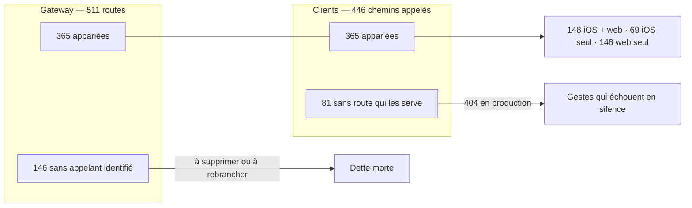
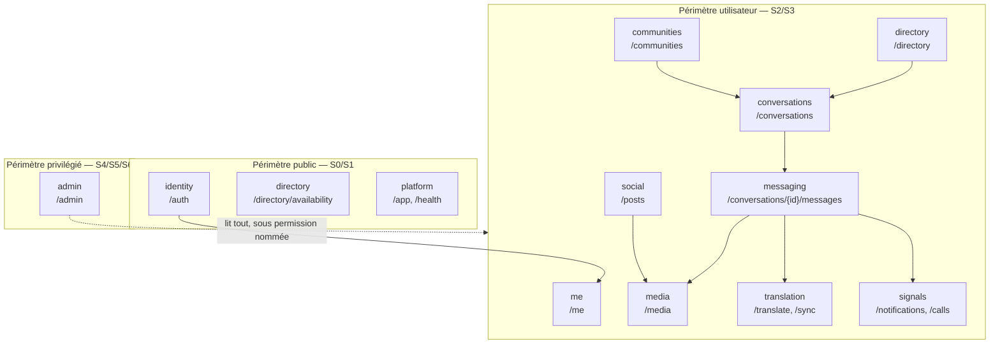
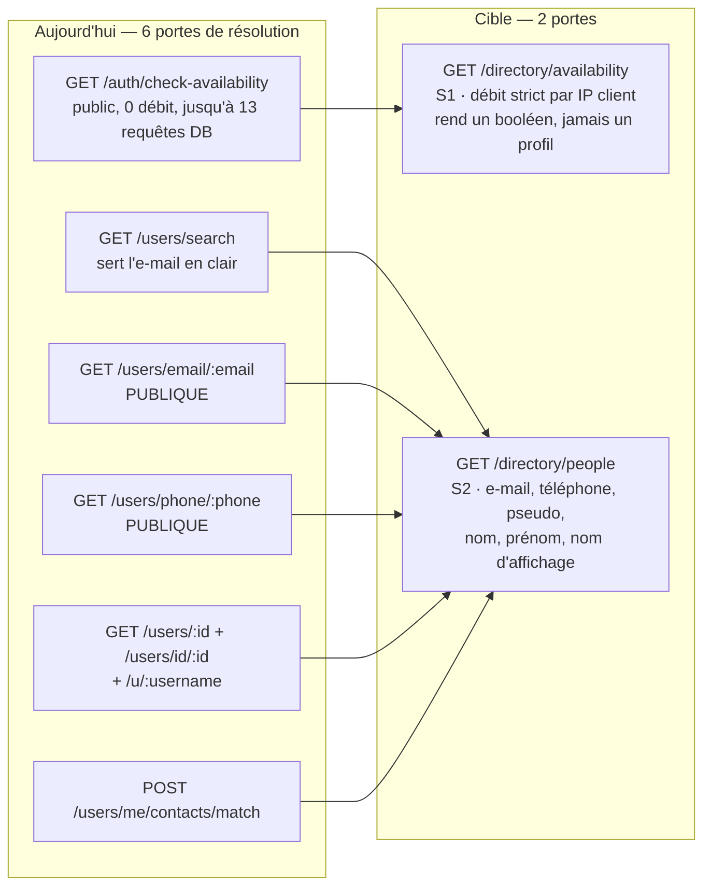

# Surface API Meeshy — cartographie, fusion, simplification

> **Compte rendu d'audit daté du 2026-08-28.** Ce document décrit la surface
> telle qu'elle est et la surface telle qu'elle devrait être. Il n'est pas un
> tableau de bord : **l'état de chaque chantier vit dans ses issues GitHub**
> (projet « Meeshy — pilotage », org `isopen-io`). En cas d'écart entre une
> ligne d'ici et une issue, l'issue a raison.

---

## 1. Ce qu'on a mesuré

L'audit couvre les quatre surfaces qui se parlent : le gateway Fastify, le SDK
et l'application iOS, le frontend web Next.js, et les événements Socket.IO —
parce qu'une route ne se juge pas sans savoir **qui l'appelle**.

| Surface | Inventorié |
|---|---|
| Endpoints REST du gateway | **524** (511 couples méthode + chemin uniques) |
| Fichiers de routes | 146, montés par `services/gateway/src/route-registration.ts` |
| Appels réseau iOS (SDK + app + extensions) | **396** |
| Appels réseau web | **474** |
| Événements Socket.IO | **179** |

Méthode, en quatre passes :

1. **Inventaire** — lecture intégrale des 146 fichiers de routes et de tous les
   appelants, par 26 lecteurs travaillant en parallèle.
2. **Vérification adversariale** — les 26 constats les plus graves soumis chacun
   à un vérificateur dont la consigne était de les **réfuter**. Résultat :
   aucun réfuté, 8 confirmés tels quels, 18 nuancés.
3. **Conception** — la surface cible par module, avec l'obligation d'ouvrir les
   deux handlers avant de proposer une fusion.
4. **Relecture factuelle** — chaque section relue ligne à ligne contre le code.
   **923 affirmations vérifiées, 155 corrigées** (17 %), 4 diagrammes réparés.
   Les erreurs typiques trouvées : une description Swagger prise pour le
   comportement réel du handler, une route déclarée « appelée par personne » qui
   l'était, une référence `fichier:ligne` fausse.

Les fragments d'inventaire bruts sont conservés hors dépôt ; les faits retenus
ici citent tous un `fichier:ligne`.

### Le croisement gateway × clients

En rapprochant les 511 couples du gateway des 446 couples appelés par les
clients :

**Ce croisement est automatique et comporte des faux positifs** (un chemin
paramétré côté client face à sept chemins littéraux côté serveur ; `/health`
monté à la racine ; de la navigation Next.js prise pour un appel). Les chiffres
donnent l'ordre de grandeur ; chaque suppression devra être confirmée route par
route. Les cas cités nommément dans ce document, eux, ont été vérifiés un par un.

---

## 2. Le verdict

**542 routes réparties sur douze modules deviennent 313.** Soit **229 routes de
moins, −42 %**, sans retirer une seule capacité au produit.

> La somme par module (542) dépasse le total gateway (524) parce que quelques
> routes appartiennent à deux modules — les demandes d'amitié relèvent à la fois
> de `directory` et de `signals`. Le taux de réduction, lui, est mesuré module
> par module.

| Module | Aujourd'hui | Cible | Ce que la fusion règle |
|---|---:|---:|---|
| [`identity`](identity.md) | 48 | 27 | Les limiteurs d'authentification retrouvent un effet |
| [`directory`](directory.md) | 27 | 14 | **Le cas nommé par le porteur** — deux portes au lieu de six |
| [`me`](me.md) | 61 | 25 | Un seul `/me` au lieu de quatre préfixes |
| [`conversations`](conversations.md) | 48 | 26 | Une seule loi d'admission par lien |
| [`messaging`](messaging.md) | 37 | 19 | Une collection de messages, deux portes d'accusés au lieu de dix |
| [`social`](social.md) | 53 | 30 | Douze listes de posts deviennent une route paramétrée |
| [`communities`](communities.md) | 23 | 16 | Quatre listes fondues, cinq verbes d'appartenance unifiés |
| [`media`](media.md) | 54 | 26 | Le magasin d'octets redevient gardé |
| [`translation`](translation.md) | 10 | 9 | Le moteur delta `/sync` enfin utilisé |
| [`signals`](signals.md) | 38 | 20 | Le prédicat rendu au client plutôt qu'au chemin |
| [`admin`](admin.md) | 108 | 76 | **Une seule loi d'autorisation** au lieu de quatre matrices |
| [`platform`](platform.md) | 35 | 25 | Le raccourcisseur d'URL ouvert se referme |
| **Total** | **542** | **313** | **−42 %** |

---

## 3. La carte sémantique

Aujourd'hui, un chemin ne dit pas à quel module il appartient : les demandes
d'amitié vivent sous `/users/friend-requests` **et** sous `/friend-requests`,
les préférences sous `/me/preferences`, `/user-preferences`,
`/conversation-preferences` et `/community-preferences`. La cible donne à
chaque module un préfixe, et à chaque préfixe un propriétaire.

---

## 4. Les sept niveaux de sécurité

L'audit a demandé de « mieux décrire le niveau de sécurité » des routes. Le
vocabulaire suivant est employé dans **toutes** les sections, et chaque route
cible en porte un.

| Niveau | Nom | Qui passe | Ce qui le garde |
|---|---|---|---|
| **S0** | public ouvert | n'importe qui | rien — réservé à ce qui est déjà public par nature |
| **S1** | public à débit strict | n'importe qui, **compté** | limiteur par IP client réelle ; réponse minimale, jamais un profil |
| **S2** | authentifié | tout compte connecté | JWT ou jeton de session |
| **S3** | propriétaire / participant | celui à qui la ressource appartient | appartenance vérifiée **dans la requête**, pas après |
| **S4** | modération | `canModerateContent` | permission nommée de la matrice centrale |
| **S5** | administration | `canAccessAdmin` + permission nommée | permission nommée de la matrice centrale |
| **S6** | souverain | BIGBOSS seul | rôles, journaux d'audit, destruction |

**S1 est le niveau que le produit n'a pas aujourd'hui.** Toute route publique
est soit ouverte sans compteur, soit « limitée » par un compteur inerte (§ 5).
C'est précisément le niveau que réclame la vérification de pseudo à
l'inscription.

---

## 5. Ce qui est cassé aujourd'hui

Vingt-six constats ont été soumis à un vérificateur chargé de les réfuter :
**aucun n'a été réfuté**, huit ont été confirmés tels quels, dix-huit ont été
nuancés (portée surestimée, atténuation trouvée ailleurs). Le détail, preuves
et correctifs, est dans [`securite.md`](securite.md). Les sept plus graves :

### 5.1 Les limiteurs d'authentification n'ont aucun effet en production
`utils/rate-limiter.ts:223` ouvre par `if (isLocalIp(request.ip)) return;`, et
`isLocalIp` (`:31-38`) couvre `172.16–31.x` et `10.x` — c'est-à-dire l'adresse
que Traefik présente au gateway sur le réseau Docker, puisqu'aucun
`trustProxy` n'est posé (`server.ts:196` et `:215`). Les **17 limiteurs nommés**
de `utils/rate-limiter.ts`, posés **22 fois** dans les routes — login 5/15 min,
inscription 3/5 min, réinitialisation 3/30 min et 3/jour, transfert de téléphone
— **retournent avant de compter quoi que ce soit**. Le seul plafond restant est le seau global
`global:${request.ip}` : **un seul seau de 300 req/min pour la plateforme
entière**, en `skipOnError: true` (donc ouvert si Redis faiblit).

*Nuance retenue* : les limiteurs passant par `@fastify/rate-limit` avec une clé
par `userId` (posts, sons, protocole Signal, appels) **restent effectifs**. Et
le code SMS reste borné par des compteurs en base
(`PhonePasswordResetService.ts:332` et `:455`). Le défaut est structurant, pas
universel. En revanche `POST /auth/login/2fa` (`routes/auth/login.ts:195`) n'a
**aucun** `preHandler`, et aucun compteur de tentatives n'existe : là, il n'y a
pas de filet du tout.

### 5.2 Le parcours de réinitialisation par SMS est cassé de bout en bout
Quatre schémas de réponse décrivent la mauvaise enveloppe : `fast-json-stringify`
supprime ce qui n'y est pas déclaré. `phone/lookup` perd son `tokenId`,
`phone/verify-code` perd son `resetToken`. **Un code SMS est consommé pour
remettre un jeton qui n'atteint jamais l'appelant.** Même famille :
`reset-password/verify-token` sert littéralement `{}`, et `forgot-password`
sert `{"success":true}` sans son message.

### 5.3 Un membre d'une communauté peut changer les rôles d'une autre
`PATCH /communities/:id/members/:memberId/role` écrit
`communityMember.update({ where: { id: memberId } })` **sans borner la ligne à
la communauté `:id`**. L'appartenance de l'appelant est vérifiée sur la
communauté A, l'écriture porte sur un membre de la communauté B.

### 5.4 Le lien d'urgence « ce n'était pas moi » est en 404
`routes/auth/revoke-all-sessions.ts:17` déclare `/auth/revoke-all-sessions` sur
une instance déjà préfixée `/api/v1/auth` — le chemin réel est donc
`/api/v1/auth/**auth**/revoke-all-sessions` — pendant que
`NotificationService.ts:4931` envoie l'URL sans le doublement. Or c'est le
**seul** site du dépôt qui appelle `disconnectRevokedSessions` : la seule
révocation qui coupe réellement les sockets est celle dont l'URL est fausse.
Corollaire : `DELETE /auth/sessions`, `DELETE /auth/sessions/:id` et
`POST /auth/logout` passent la session à `isValid:false` **sans déconnecter
personne** — l'appareil « révoqué » continue de recevoir le temps réel.

### 5.5 La recherche d'utilisateurs moissonne les adresses e-mail
`GET /users/search` met `email` **à la fois** dans la clause `OR` du `where` et
dans le `select` servi (`routes/users/preferences.ts:614` et `:643`). Tout
compte authentifié peut chercher `contains: "gmail.com"` et récupérer en clair
les adresses correspondantes, cent par page, sans aucun débit.

### 5.6 Le contenu de n'importe quelle conversation est lisible par un modérateur
`GET /admin/conversations/:id/messages` sert le contenu intégral de n'importe
quelle conversation — y compris une conversation directe entre deux tiers — au
rôle MODERATOR, sans qu'un signalement ne la désigne.

### 5.7 Deux écrans du même produit vérifient un pseudo par deux URL, dont une en 404
`apps/web/components/settings/ProfileSettings.tsx:184` appelle
`/auth/check-username` — **route qui n'existe nulle part** — quand
`user-settings.tsx:560` appelle correctement `/auth/check-availability`. Même
motif sur `GET /users/profile/:id` (`apps/web/app/u/[id]/layout.tsx:33`), qui
casse la génération de métadonnées SSR de **toute page profil publique**.

---

## 6. Bande passante — un levier acquis, quatre manquants

L'objectif posé est de « diminuer la bande passante » et d'« empêcher le
frontend de récupérer plusieurs fois les mêmes données ». Un des mécanismes est
déjà en place et bien fait ; les autres manquent. Détail chiffré dans
[`bande-passante.md`](bande-passante.md).

| Levier | État mesuré | Verdict |
|---|---|---|
| **Cache conditionnel** (ETag / `If-None-Match` → 304) | **acquis** : `server.ts:326` pose `conditionalGetOnSend` en hook **global**, appliqué à tout `GET` JSON qui répond 200 sans ETag déjà posé (`utils/etag.ts:124`) | ✅ à conserver |
| **Sparse fieldsets** (`?fields=`) | **zéro site** sur 524 endpoints — le client subit toujours le `select` du serveur | ❌ à construire |
| **Expansion contrôlée** (`?expand=`) | **zéro site** — les relations lourdes partent d'office | ❌ à construire |
| **Curseur** | sur les **86 `GET` qui rendent une liste** : 7 en curseur, 43 en `offset` (qui repaie un `count()`), 9 avec un `limit` seul, **27 sans aucune borne** | ❌ à généraliser |
| **Moteur delta** | `GET /sync` existe, est le meilleur du dépôt, et **personne ne l'appelle** ; iOS refait sa synchronisation à la main en ~100 requêtes au démarrage à froid | ❌ à adopter |

Deux nuances qui comptent :

- **Le 304 économise le corps, pas le travail.** L'ETag est calculé sur la
  charge déjà produite : les requêtes Prisma et la sérialisation ont eu lieu.
  Le cache conditionnel réduit la bande passante ; seuls `?fields=`, `?expand=`
  et le delta réduisent le *coût serveur*.
- **Le vrai gisement est en amont** : **86 charges lourdes** et **356 risques de
  sur-fetch** relevés côté gateway (relations chargées sans `take`, `findUnique`
  sans `select`, agrégations calculées en mémoire), et **723 redondances**
  relevées côté clients — même donnée demandée deux fois par le même écran,
  trois émetteurs distincts pour un même `POST`.

Le point le plus coûteux reste le dernier du tableau : le dépôt **possède déjà**
le moteur de synchronisation delta et ne s'en sert pas. Détail dans
[`translation.md`](translation.md).

---

## 7. Le cas nommé — trouver un utilisateur

Le porteur estime qu'il faut deux routes : une publique à débit strict pour
vérifier un pseudo à l'inscription, une authentifiée plus permissive pour
joindre quelqu'un par e-mail, téléphone, pseudo, nom d'affichage, nom, prénom.

**Il y en a aujourd'hui vingt-sept**, dont six pour la seule résolution d'une
personne. La cible retenue est exactement celle demandée :

Les deux règles qui font la différence : **S1 ne rend jamais un profil**, seulement
la disponibilité ; **S2 ne sert jamais l'adresse e-mail ni le téléphone en
clair** — on peut chercher *par* un identifiant qu'on connaît déjà, jamais le
récupérer. Détail complet, schémas, seuils, clés de limiteur et index Mongo dans
[`directory.md`](directory.md).

---

## 8. Comment les clients appellent — l'écart à `APIClient`

Le standard iOS est `packages/MeeshySDK/Sources/MeeshySDK/Networking/APIClient.swift`.
L'audit a relevé chaque appel qui s'en écarte et jugé la justification.

| Écart | Justifié ? |
|---|---|
| `TusUploadManager` — téléversement reprenable | **oui** : protocole propre, reprise après coupure, hors du cycle requête/réponse |
| Téléchargement binaire de média (`DiskCacheStore`) | **oui** : flux vers disque, pas de décodage JSON |
| Extensions hors-processus (`MeeshyNotificationExtension`, `MeeshyShareExtension`) | **oui** : processus distinct, sans accès au singleton d'authentification de l'app |
| Appels réseau écrits dans des vues et des ViewModels de `apps/ios/Meeshy` | **non** — c'est la dette à résorber ; le détail est dans les sections de module |

Le contrat de `APIClient` (en-têtes `Authorization`, `X-Session-Token`,
`X-Device-Locale`, version applicative, décodage, reprise) est décrit dans
[`identity.md`](identity.md) § contrat client.

---

## 9. Plan de simplification

L'ordre suit une règle : **on répare ce qui est cassé avant de fusionner ce qui
est redondant** — fusionner une route défaillante propage le défaut.

| Lot | Contenu | Pourquoi d'abord |
|---|---|---|
| **L0 — rendre leur effet aux gardes** | `trustProxy` + suppression de l'exemption `isLocalIp` ; limiteur et compteur sur `login/2fa` ; les quatre schémas de réponse du reset SMS ; le chemin de `revoke-all-sessions` ; `disconnectRevokedSessions` sur les trois autres révocations ; le `where` de `members/:memberId/role` | Ce sont des défauts actifs, indépendants de toute fusion |
| **L1 — une seule loi d'autorisation** | Les treize gardes locales de `routes/admin/` remplacées par la matrice centrale ; les quatre matrices de permissions fondues en une ; `POST /admin/reports` déplacée hors du préfixe admin | Toute fusion de route admin est fausse tant que la loi est multiple |
| **L2 — les fusions sans rupture client** | Routes orphelines confirmées, jumelles exactes, verbes doublés, stub `GET /users/me/test` | Aucun client à modifier |
| **L3 — les fusions à transition** | `directory`, `me`, `conversations`, `social` — alias temporaires + en-tête de dépréciation | Demande une version cliente |
| **L4 — la bande passante** | `?fields=`, `?expand=`, ETag généralisé, curseur partout, adoption de `/sync` par iOS | Prend appui sur une surface déjà stabilisée |

**Aucune ligne de ce plan n'existe tant qu'elle n'est pas une issue** dans le
projet « Meeshy — pilotage », avec un milestone nommé par son résultat.

---

## 10. Index

| Document | Contenu |
|---|---|
| [`securite.md`](securite.md) | Les 26 verdicts vérifiés, la matrice rôle × permission × route, le désordre des gardes admin |
| [`identity.md`](identity.md) | Connexion, sessions, second facteur, mot de passe, téléphone |
| [`directory.md`](directory.md) | Trouver une personne — recherche, contacts, profils, amitié, blocage |
| [`me.md`](me.md) | Profil de l'appelant, préférences, consentements, export, suppression |
| [`conversations.md`](conversations.md) | Conversations, participants, liens de partage, anonymes |
| [`messaging.md`](messaging.md) | Messages, lecture, réactions, mentions, fils |
| [`social.md`](social.md) | Posts, commentaires, stories, statuts, sons |
| [`communities.md`](communities.md) | Communautés, membres, préférences |
| [`media.md`](media.md) | Pièces jointes, téléversement TUS, voix, transcription |
| [`translation.md`](translation.md) | Traduction, jobs, moteur de synchronisation delta |
| [`signals.md`](signals.md) | Notifications, push, appels, présence |
| [`admin.md`](admin.md) | Toute la surface d'administration et son modèle de sécurité |
| [`platform.md`](platform.md) | Santé, version cliente, maintenance, affiliation, liens tracés |

---

## 11. Limites de cet audit

Ce qu'il faut savoir avant de s'appuyer sur un chiffre :

- **Le croisement gateway × clients est automatique.** Ses 146 « orphelines » et
  81 « fantômes » comportent des faux positifs identifiés (chemins paramétrés,
  `/health` hors préfixe, navigation Next.js). Les cas nommés dans ce document
  ont été vérifiés individuellement ; les autres doivent l'être avant toute
  suppression.
- **Android n'a pas été inventorié.** Le client Kotlin consomme la même API ;
  toute fusion doit compter ses appels avant de retirer une route. Le dépôt a
  déjà connu ce défaut (cf. `CLAUDE.md`, cycle 118).
- **Les sections ont été relues, pas exécutées.** Aucune assertion de ce
  document n'a été prouvée par un appel HTTP réel contre un environnement
  déployé. Les défauts de sérialisation (§ 5.2) ont été mesurés au
  `fast-json-stringify` réel ; les autres reposent sur la lecture du code.
- **Une capacité manquante n'est pas dans le périmètre.** L'audit dit ce qui est
  redondant, mal gardé ou trop lourd. Il ne dit pas ce que le produit devrait
  savoir faire en plus.
