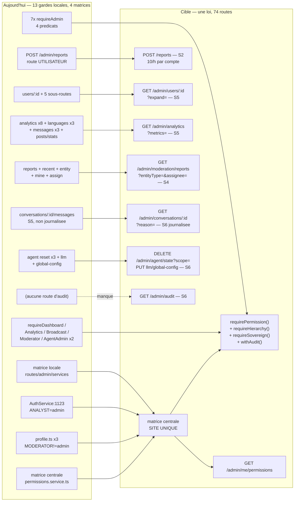

# Administration (`admin`)

## Ce que la surface est aujourd'hui

**108 routes déclarées** sous `/api/v1/admin` (49 « personnes », 59 « contenu et système »), réparties en 16 fichiers de `services/gateway/src/routes/admin/`. Sur ces 108 : **106 sont joignables** (les deux de `roles.ts` ne sont montées par personne — `route-registration.ts:40` a désactivé l'agrégat `adminRoutes`), et **100 répondent réellement** (les 6 de `agent-topics.ts` rendent 403 à tout le monde, BIGBOSS compris — voir plus bas). **iOS n'appelle qu'une seule de ces routes** : `POST /admin/reports`, le signalement de contenu, qui n'est pas une route d'administration. Tout le reste est consommé par le web, et **31 routes ne sont appelées par personne**.

Le modèle de sécurité tient en une phrase : il n'y en a pas un, il y en a **quatre**, et **treize gardes locales** écrites à la main les contredisent chacune un peu.

| Route | Niveau réel | Auth (garde) | Débit | Poids | Consommée par | Verdict |
|---|---|---|---|---|---|---|
| `GET /admin/dashboard` | S5 + ANALYST | `requireDashboardPermission` (dashboard.ts:11) — liste en dur | global 300/min/IP | léger | web | fusionner → `GET /admin/overview` |
| `POST /admin/dashboard/invalidate-cache` | S5 | idem + 2ᵉ filtre `['BIGBOSS','ADMIN']` en corps | global | léger | PERSONNE | garder → `POST /admin/overview/refresh` |
| `GET /admin/users` | S5 `canViewUsers` | `requireUserViewAccess` (matrice centrale) | global | moyen | web | garder (curseur + `fields`) |
| `GET /admin/users/:id` | S5 `canViewUsers` | `requireUserViewAccess` | global | moyen | web | garder (+ `expand`) |
| `POST /admin/users` | S5 `canUpdateUsers` | `requireUserModifyAccess` + hiérarchie | global | léger | web | garder |
| `PATCH /admin/users/:id` | S5 `canUpdateUsers` | + `canModifyUser` | global | léger | web (×3 sections) | fusionner → `PATCH /admin/users/:id` |
| `PATCH /admin/users/:id/role` | S5 `canUpdateUserRoles` | + `canChangeRole` (triple condition) | global | léger | web | fusionner → `PATCH /admin/users/:id` (champ `role`) |
| `PATCH /admin/users/:id/status` | S5 `canUpdateUsers` | + `canModifyUser` | global | léger | web | fusionner → `PATCH /admin/users/:id` (champ `isActive`) |
| `POST /admin/users/:id/reset-password` | S5 | + `canModifyUser` (jamais `canResetPasswords`) | global | léger | web | garder → `POST …/password-reset` |
| `DELETE /admin/users/:id` | S5 `canDeleteUsers` | + `canModifyUser` | global | léger | web | garder |
| `POST /admin/users/:id/unlock` | **S5 sans hiérarchie** | `requireUserModifyAccess` SEUL | global | léger | web | fusionner → `PATCH …/security` |
| `POST /admin/users/:id/enable-2fa` | **S5 sans hiérarchie** | `requireUserModifyAccess` SEUL | global | léger | web | fusionner → `PATCH …/security` |
| `POST /admin/users/:id/disable-2fa` | **S5 sans hiérarchie** | `requireUserModifyAccess` SEUL | global | léger | web | fusionner → `PATCH …/security` |
| `POST /admin/users/:id/verify-email` | S5 | + `canModifyUser` | global | léger | PERSONNE | fusionner → `PATCH …/verifications` |
| `POST /admin/users/:id/verify-phone` | S5 | + `canModifyUser` | global | léger | PERSONNE | fusionner → `PATCH …/verifications` |
| `POST /admin/users/:id/verify-age` | S5 | + `canModifyUser` | global | léger | PERSONNE | fusionner → `PATCH …/verifications` |
| `POST /admin/users/:id/voice-consent` | S5 | + `canModifyUser` | global | léger | PERSONNE | **S6 + motif obligatoire** (décision produit) |
| `GET /admin/users/:id/activity` | S5 `canViewUsers` | `requireUserViewAccess` | global | moyen | web | garder — **retirer les jetons** |
| `GET /admin/users/:id/conversations` | S5 `canViewUsers` | idem | global | moyen | web | garder |
| `GET /admin/users/:id/media` | S5 `canViewUsers` | idem | global | **lourd** | web | garder — **filtre de protection** |
| `GET /admin/users/:id/reports` | S5 `canViewUsers` (AUDIT) | idem | global | léger | web | garder — aligner le seuil sur la modération |
| `GET /admin/users/:id/reported-messages` | S5 `canViewUsers` | idem | global | **lourd** | web | garder — borner les 2 requêtes amont |
| `GET /admin/conversations/:id/participants` | S5 `canViewUsers` | idem + garde de présence en corps | global | moyen | web | fusionner → `GET /admin/conversations/:id?expand=` |
| `GET /admin/conversations/:id/messages` | **S5 → doit être S6** | `requireUserViewAccess` | global | **lourd** | web | **restreindre + journaliser** |
| `POST /admin/reports` | **S2 sous préfixe admin** | `fastify.authenticate` seul | global | léger | **iOS + web** | **déplacer → `POST /reports`** |
| `GET /admin/reports` | S4 | `requireModeratorPermission` (reports.ts:31) | global | moyen | PERSONNE | fusionner → `GET /admin/moderation/reports` |
| `GET /admin/reports/stats` | S4 | idem | global | léger | PERSONNE | garder |
| `GET /admin/reports/recent` | S4 | idem | global | léger | PERSONNE | fusionner → `?limit=&sort=` |
| `GET /admin/reports/:id` | S4 | idem | global | léger | PERSONNE | garder |
| `PATCH /admin/reports/:id` | S4 | idem — aucun contrôle d'assignation | global | léger | PERSONNE | garder + audit |
| `DELETE /admin/reports/:id` | **S4 destructif** | idem — suppression DURE | global | léger | PERSONNE | **S6 + soft-delete** |
| `GET /admin/reports/entity/:type/:id` | S4 | idem | global | **lourd** (non borné) | PERSONNE | fusionner → `?entityType=&entityId=` |
| `POST /admin/reports/:id/assign` | S4 | idem | global | léger | PERSONNE | fusionner → `PATCH …/:id` (`assigneeId`) |
| `GET /admin/reports/moderator/mine` | S4 | idem | global | moyen | PERSONNE | fusionner → `?assignee=me` |
| `GET /admin/invitations` | S5 | `requireAdmin` (invitations.ts:10) | global | moyen | PERSONNE | garder — `communityId` casse la requête |
| `GET /admin/invitations/stats` | S5 | idem | global | léger | PERSONNE | fusionner (avec la timeline) |
| `GET /admin/invitations/:id` | S5 | idem | global | léger | PERSONNE | garder — masquer les e-mails |
| `PATCH /admin/invitations/:id` | S5 | idem | global | léger | PERSONNE | garder — effet incomplet |
| `GET /admin/invitations/timeline/daily` | S5 | idem | global | léger | PERSONNE | fusionner → `…/stats?series=daily` |
| `GET /admin/analytics/*` (8 routes) | S5 + ANALYST | `requireAnalyticsPermission` (analytics.ts:19) | global | léger | web (7 sur 8) | fusionner → `GET /admin/analytics?metrics=` |
| `GET /admin/languages/*` (3 routes) | S5 + ANALYST | `requireAdmin` (languages.ts:92) | global | léger | PERSONNE | fusionner → `GET /admin/analytics?metrics=` |
| `GET /admin/messages/stats` `…/trends` `…/engagement` | S5 (MODERATOR/AUDIT) | `requireAdmin` (messages.ts:9) | global | moyen | PERSONNE | fusionner → `GET /admin/analytics?metrics=` |
| `GET /admin/ranking` | S5 + ANALYST | `requireAdmin` (system-rankings.ts:11) | global | moyen | web | garder — **relever à `canViewUsers`** |
| `GET /admin/analytics/calls` | S5 + ANALYST | `requireAnalyticsPermission` | global | moyen | PERSONNE | garder |
| `GET /admin/messages` | S4 `canModerateContent` | `requireAdmin` (content.ts:125, matrice LOCALE) | global | **lourd** | web | garder → `/admin/moderation/messages` |
| `GET /admin/communities` | S4 `canManageCommunities` | idem | global | léger | web | garder → `/admin/moderation/communities` |
| `GET /admin/translations` | **S6 de fait** | idem + `canManageTranslations` (matrice LOCALE ⇒ BIGBOSS seul) | global | **lourd** | web | garder — **corriger la matrice** |
| `GET /admin/share-links` | S4 `canManageConversations` | idem | global | moyen | web | garder — **`linkId` est un secret** |
| `GET /admin/anonymous-users` | S5 (MODERATOR/AUDIT) | `requireAdmin` (anonymous-users.ts:12) | global | **lourd** | web | garder — **retirer `sessionTokenHash`** |
| `GET /admin/broadcasts` | S5 | `requireBroadcastPermission` (broadcasts.ts:19) | global | **lourd** | web | garder — poser un `select` |
| `POST` / `GET :id` / `PUT :id` / `DELETE :id` `/admin/broadcasts` | S5 | idem | global | léger→moyen | web | garder |
| `POST /admin/broadcasts/:id/preview` | S5 | idem | global | **lourd** (doublons) | web | garder |
| `POST /admin/broadcasts/:id/send` | S5 | idem — **pas de verrou** | global | léger | web | fusionner → `?channels=email,inapp` |
| `POST /admin/broadcasts/:id/send-inapp` | S5 | idem — **rejeu autorisé** | global | léger | web | fusionner → `?channels=` |
| `GET /admin/posts/stats` | S5 | `requireAdmin` (posts.ts:78, matrice LOCALE) | global | léger | PERSONNE | fusionner → `GET /admin/analytics?metrics=` |
| `GET /admin/posts` | S4 `canModerateContent` | idem | global | **lourd** | web | garder → `/admin/moderation/posts` |
| `GET /admin/posts/:id` | S4 | idem | global | **lourd** | PERSONNE | garder — 50 lecteurs nominatifs |
| `DELETE /admin/posts/:id` | S4 | idem — **journalisée** | global | léger | PERSONNE | garder (**route modèle**) |
| `GET/PUT/DELETE /admin/agent/*` (29 routes) | S5 `['BIGBOSS','ADMIN']` | `requireAgentAdmin` (agent.ts:23) | global | léger→lourd | web | garder, sauf resets → S6 |
| `DELETE /admin/agent/reset` | **S5 destruction totale** | idem | global | léger | web | **S6 + confirmation + audit** |
| `PUT /admin/agent/llm` | **S5 exfiltration possible** | idem | global | léger | web | **S6 + liste blanche d'hôtes** |
| `/admin/agent/topics` (6 routes) | **AUCUN — 403 pour tous** | `requireAgentAdmin` (agent-topics.ts:24) lit `request.user.role`, jamais posé | global | léger | web (en 403) | **corriger la garde** |
| `PATCH` (non montée) `/users/:id/role` `…/status` | — | code mort | — | — | PERSONNE | **supprimer** |

Aucune route de `routes/admin/` ne déclare de limite de débit : `grep -c rateLimit routes/admin/` rend **0**. Le seul rempart est le limiteur global — 300 req/min, clé `global:${request.ip}`, `skipOnError: true` (fail-open si Redis tombe), `middleware/rate-limiter.ts:61-75`.

---

## Ce qui ne va pas

### 1. Sécurité — quatre sources de vérité pour une seule question

Le dépôt contient **quatre** définitions concurrentes des permissions d'administration, et **treize gardes locales** qui n'en consultent aucune.

| # | Source | Fichier | Servie à | Écart mesuré |
|---|---|---|---|---|
| 1 | matrice **centrale** (17 permissions × 6 rôles) | `services/admin/permissions.service.ts:41` | `admin-user-auth.middleware.ts` (users.ts seul), `user-sanitization.service.ts`, gardes de présence | *fait autorité* |
| 2 | matrice **locale** (9 permissions × 6 rôles) | `routes/admin/services/PermissionsService.ts:27` | `content.ts`, `posts.ts`, `roles.ts` (mort) | `ADMIN.canManageTranslations = false` contre `true` au central (`permissions.service.ts:77`, commentaire « ADMIN can now manage translations ») |
| 3 | copie **manuscrite servie au client à la connexion** | `services/AuthService.ts:1124-1193` → `routes/auth/login.ts:178`, `register.ts:190`, `magic-link.ts:69,237` | web + iOS | **`ANALYST.canAccessAdmin = true`** (`AuthService.ts:1186`) — les deux matrices disent `false` |
| 4 | copie **manuscrite servie après édition de profil** | `routes/users/profile.ts:269-279`, `:377`, `:468` | web + iOS | `canAccessAdmin = isAdmin` seulement ⇒ un MODERATOR **perd** son accès admin déclaré en modifiant son profil |

Conséquence directement observable : un ANALYST se connecte, reçoit `canAccessAdmin: true`, le web lui peint la console, et le serveur lui refuse la moitié des routes. Un MODERATOR édite son avatar et la console disparaît de son écran sans qu'aucun rôle n'ait changé.

Le middleware qui devrait être la loi — `middleware/admin-permissions.middleware.ts`, huit gardes nommées bâties sur la matrice centrale — est importé par **exactement un fichier du gateway, et ce n'est pas une route d'admin** : `routes/tracking-links/tracking.ts:12`. **Zéro route de `routes/admin/` ne l'utilise.**

### 2. Sécurité — sept `requireAdmin` homonymes, quatre prédicats

| Fichier:ligne | Prédicat écrit | Rôles réellement admis |
|---|---|---|
| `admin/languages.ts:92` | liste en dur | BIGBOSS, ADMIN, AUDIT, **ANALYST** |
| `admin/system-rankings.ts:11` | liste en dur | BIGBOSS, ADMIN, AUDIT, **ANALYST** |
| `admin/anonymous-users.ts:12` | liste en dur | BIGBOSS, ADMIN, **MODERATOR**, AUDIT |
| `admin/messages.ts:9` | liste en dur | BIGBOSS, ADMIN, **MODERATOR**, AUDIT |
| `admin/invitations.ts:10` | liste en dur | BIGBOSS, ADMIN |
| `admin/posts.ts:78` | `canAccessAdmin` (matrice **locale**) | BIGBOSS, ADMIN, MODERATOR, AUDIT |
| `admin/content.ts:125` | `canAccessAdmin` (matrice **locale**) | BIGBOSS, ADMIN, MODERATOR, AUDIT |

Six autres gardes locales portent d'autres noms pour le même office : `requireDashboardPermission` (dashboard.ts:11), `requireAnalyticsPermission` (analytics.ts:19 — **homonyme d'un export du middleware central** : le central lit `canViewAnalytics` dans la matrice, le local rejoue la même liste en dur — mêmes rôles admis aujourd'hui, et rien ne les tient ensemble demain), `requireBroadcastPermission` (broadcasts.ts:19), `requireModeratorPermission` (reports.ts:31), `requireAgentAdmin` (agent.ts:23 **et** agent-topics.ts:24, deux copies divergentes). **Treize gardes locales au total.**

### 3. Les routes dont la garde CONTREDIT la matrice centrale

| Route(s) | Garde | Ce que dit la matrice centrale | Nature de la contradiction |
|---|---|---|---|
| `GET /admin/languages/stats` `…/timeline` `…/translation-accuracy` | ANALYST admis (languages.ts:92) | `ANALYST.canAccessAdmin = false` | **accès accordé** à un rôle sans accès admin |
| `GET /admin/ranking` | ANALYST admis (system-rankings.ts:11) | `ANALYST.canAccessAdmin = false` **et** `canViewUsers = false` | **le plus grave** : palmarès **nominatif** (username, displayName, avatar — jusqu'à 100 comptes par requête, `?limit=` plafonné à 100) de qui écrit le plus, qui a le plus de contacts, qui appelle le plus, servi à un rôle qui n'a pas le droit de lister les utilisateurs |
| `GET /admin/dashboard` | ANALYST admis, **MODERATOR exclu** (dashboard.ts:11) | ANALYST `false`, MODERATOR `canAccessAdmin = true` | contradiction **dans les deux sens** sur la même route |
| `GET /admin/analytics/*` (8) | ANALYST admis (analytics.ts:19) | `canAccessAdmin = false`, `canViewAnalytics = true` | la garde tranche une question que la matrice pose en deux champs |
| `GET /admin/translations` | `canManageTranslations` **locale** ⇒ BIGBOSS seul | central : ADMIN `true` | **accès refusé** à un rôle qui l'a — deux matrices, deux réponses |
| `GET /admin/anonymous-users` | MODERATOR + AUDIT admis (anonymous-users.ts:12) | `canViewSensitiveData = false` pour les deux | la réponse porte `sessionTokenHash` (anonymous-users.ts:75) — **le hash du jeton de session comparé par `middleware/auth.ts:396`** — plus la relation `anonymousSession` entière sans `select` |
| `GET /admin/users/:id/activity` | AUDIT/MODERATOR (canViewUsers) | `canViewSensitiveData = false` | sert `trackingLink.token`, `affiliateToken.token`, `conversationShareLink.linkId` et `identifier` — des **secrets d'accès**, à des rôles pour qui e-mail et téléphone sont masqués |
| `GET /admin/share-links` | MODERATOR (`canManageConversations`) | — | sert `linkId` (content.ts:679), le secret qui permet de **rejoindre** la conversation |
| `GET /admin/users/:id/reports` | AUDIT suffit | `GET /admin/reports` exige MODERATOR | **deux seuils sur la même table** |
| `POST /admin/users/:id/unlock` `…/enable-2fa` `…/disable-2fa` | `requireUserModifyAccess` **seul** (users.ts:601, :644, :688) | `canModifyUser(admin, cible)` appliqué par **les dix autres** mutations du fichier (:239, :301, :376, :448, :516, :570, :753, :817, :881, :950) | **escalade de privilège** : un ADMIN peut retirer la 2FA d'un BIGBOSS, puis déverrouiller son compte |
| `GET /admin/conversations/:id/messages` | `canViewUsers` ⇒ MODERATOR + AUDIT | — | contenu **intégral** de n'importe quelle conversation privée, `where = { conversationId }` nu, `deletedAt` sélectionné et **jamais filtré**, aucun gate `isViewOnce` / `expiresAt` / `encryptionMode`, **aucune ligne d'audit** |
| `GET /admin/users/:id/media` | `canViewUsers` | garde `mediaMayTravel` du cycle 125 | le `select` ne lit **ni `isViewOnce`, ni `isBlurred`, ni `effectFlags`** et sert `fileUrl` + `thumbnailUrl` : un média **à vue unique** envoyé en privé est servi entier |
| `/admin/agent/topics` (6 routes) | `user.role` (agent-topics.ts:25) | `createUnifiedAuthMiddleware` pose `userId`, `username`, `isAnonymous` — **jamais `role`** (`middleware/auth.ts:527-534`) | **garde morte** : `['BIGBOSS','ADMIN'].includes('')` ⇒ 403 pour tout le monde. Échec **fermé** (pas de faille) mais fonctionnalité morte en production, et le test la croit verte parce que son faux `authenticate` **fabrique** le champ absent |
| `DELETE /admin/agent/reset` | ADMIN | — | efface **toutes** les configs, rôles, résumés, profils et clés Redis `agent:*` de la plateforme, sans corps de requête, sans confirmation, sans audit |
| `PUT /admin/agent/llm` | ADMIN | — | `baseUrl` libre : redirige **tout le trafic LLM** — donc le contenu des conversations envoyé en contexte — vers un hôte arbitraire |
| `DELETE /admin/reports/:id` | MODERATOR | — | `prisma.report.delete` — un modérateur efface la trace d'un signalement **le visant** |

### 4. `POST /admin/reports` — une route utilisateur sous un préfixe d'administration

`routes/admin/reports.ts:52` porte `onRequest: [fastify.authenticate]` et **aucune garde de rôle** : c'est le signalement de contenu par un utilisateur ordinaire. C'est la **seule** route de `routes/admin/` dans ce cas, et **la seule route d'admin qu'iOS appelle** (`ReportService.swift:28,38,48,58,68` — message, utilisateur, post, story, conversation ; côté web `report.service.ts:19→119`, six méthodes).

Trois défauts en découlent :
- **L'adresse ment sur le privilège.** Un client mobile envoie une écriture ordinaire vers `/admin/`. Toute règle d'infrastructure posée sur le préfixe (IP allow-list, WAF, journalisation renforcée, en-tête d'audit) casserait le signalement sur les trois plateformes. C'est un piège armé.
- **Aucune limite de débit propre.** Un compte peut créer 300 signalements/minute, comptés **par IP** et non par compte. Rien ne vérifie que `reportedEntityId` existe, ni que le signalant a accès à l'entité : on signale des ObjectId arbitraires.
- **`reporterName` vient du corps** (`reports.ts:65` : `body.reporterName || authContext.anonymousUser?.username`) alors que `reporterId` est bien forcé à l'identité serveur. Un inscrit signe son signalement d'un nom qu'il choisit. `body.reporterId` est un champ mort — inatteignable, mais présent dans le schéma, donc trompeur pour la prochaine main.

**La bonne adresse est `POST /api/v1/reports`, niveau S2**, et le préfixe `/admin` redevient ce qu'il annonce : ce qui exige `canAccessAdmin`.

### 5. Sécurité — l'audit existe en écriture et n'existe pas en lecture

`adminAuditLog` est écrit par `users.ts` (15 sites), `broadcasts.ts` (4) et `postRemovalEffects.ts:72` (le `DELETE /admin/posts/:id`). **C'est tout côté `routes/admin/`** — le seul autre producteur du dépôt, `logAdminAction` (`middleware/admin-permissions.middleware.ts:194`), ne sert que `routes/tracking-links/`. Les 29 routes d'agent, les 10 de signalements, les 4 de contenu, la lecture intégrale de conversations privées : zéro trace.

Et **aucune route ne SERT le journal**. `UserAuditService.getAuditLogsForUser` (`user-audit.service.ts:72`) et son jumeau (`:100`) ne sont appelés depuis nulle part. La permission `canViewAuditLogs` — réservée à BIGBOSS et AUDIT, le seul champ où ADMIN est volontairement exclu — **ouvre une porte qui n'a pas été construite**. Le rôle AUDIT n'a, aujourd'hui, aucune console d'audit.

Quatre permissions déclarées ne sont lues par **aucune** route : `canResetPasswords`, `canViewUserDetails`, `canCreateUsers`, `canUpdateUserRoles` (hors usage interne de `canChangeRole`). La matrice annonce une finesse que le code n'applique pas — `POST /admin/users/:id/reset-password` se garde sur `canUpdateUsers`, pas sur `canResetPasswords`.

### 6. Bande passante

Le gateway a **déjà** le levier ETag : `server.ts:326` pose `conditionalGetOnSend` en hook global (`utils/etag.ts`), donc tout GET d'admin bénéficie du 304. **Sauf `GET /admin/dashboard`**, qui pose `Cache-Control: private, max-age=600` et sort ainsi du hook — la route la plus appelée de la console s'est exclue du seul mécanisme déjà en place.

Restent les deux leviers absents partout (`?fields=`, `?expand=` : **zéro site**) et la pagination :

- **`GET /admin/translations` (content.ts:405) : la pagination est un décor.** `message.findMany` (ligne 487) n'a ni `skip` ni `take` : la route rapatrie **tous** les messages traduits de la période — contenu original + JSON `translations` complet —, aplatit, filtre en mémoire, puis `slice(offset, offset+limit)` pour rendre 20 lignes. `period` est optionnel : sans lui, c'est l'histoire entière de la plateforme, à chaque appel.
- **`GET /admin/users/:id/reported-messages`** : deux `findMany` **non bornés** en amont de la page (toutes les participations du compte, puis **tous les identifiants de messages jamais écrits**) avant de rendre 20 lignes.
- **`GET /admin/agent/configs`** : trois `findMany` non bornés pour construire l'univers, avant pagination.
- **`GET /admin/reports/entity/:type/:id`** : aucun `take`. Une entité victime d'un raid rend l'intégralité de ses signalements.
- **`GET /admin/users/:id/media`** : fusion de deux sources par `take: offset+limit` sur chacune ; à l'offset plafond (100 000, `MAX_PAGINATION_OFFSET`) la route demande 200 040 lignes pour en rendre 20.
- **Sur-projection systématique** : `GET /admin/broadcasts` sans `select` transporte `translatedBodies`/`translatedSubjects` (N copies du corps de l'e-mail) sur chaque ligne d'un tableau qui affiche nom / statut / date. `GET /admin/posts` charge `transcription` et `translations` de chaque média pour afficher une vignette. `GET /admin/posts/:id` et `GET /admin/agent/scan-logs/:id` utilisent `include` sans `select` : **toute colonne future part automatiquement**.
- **Sept appels pour un écran** : l'ouverture d'une fiche utilisateur déclenche `page.tsx:83`, `UserMediaSection:62`, `UserPostsSection:83`, `UserReportsSection:93`, `UserReportedMessagesSection:56`, `UserActivitySection:322`, `UserConversationsSection:378`. Sept allers-retours, sept ETags, aucun partage.
- **Sept appels pour un autre écran** : `monitoring.service.ts:7→88` appelle sept routes d'analytics pour peindre un seul tableau de bord.
- Toute la pagination d'admin est en **offset** (qui repaie un `count()` complet) ; aucune route d'admin n'a de curseur ni de `updatedSince`.

### 7. Contrat

- `GET /admin/reports` : `query.sortBy` est repris **brut** et posé en clé d'`orderBy` Prisma. Champ inconnu ⇒ 500 ; champ existant non prévu (`moderatorNotes`, `reporterId`) ⇒ tri offert sans décision produit.
- `GET /admin/invitations` : le schéma **valide** `communityId` (mongoId) que le modèle `FriendRequest` ne possède pas ⇒ paramètre officiellement accepté, structurellement invalide, 500 à l'usage.
- `GET /admin/dashboard` : `topLanguages` est un **littéral codé en dur** `[{fr,0},{en,0}]` ; `usersByRole` et `messagesByType` sont des objets vides jamais remplis ; `totalInvitations` compte en réalité `prisma.communityMember`. Quatre champs toujours servis, toujours faux.
- `PATCH /admin/invitations/:id` : forcer `status:'accepted'` écrit bien l'amitié (c'est `FriendRequest.status = 'accepted'` qui la porte, cf. `PresenceVisibilityService`), mais **sans aucun des effets** que produit la vraie acceptation (`routes/friends.ts`) : pas de `respondedAt`, pas de conversation directe créée, aucun événement, aucun cache d'amis invalidé, aucune notification.
- `POST /admin/broadcasts/:id/send` et `/send-inapp` : transition `READY → SENDING` non atomique (`findUnique` puis `update`) ⇒ deux appels concurrents lancent deux jobs et envoient l'e-mail en double. Pour `/send-inapp`, la garde `['READY','SENT'].includes(status)` **autorise explicitement le rejeu**.
- `POST /admin/agent/topics` accepte 10 expressions régulières arbitraires, validées par un simple `new RegExp()` qui ne lève pas, exécutées ensuite **synchrones dans la boucle d'événements** par `POST /admin/agent/topics/:id/test` sur 5 000 caractères fournis par l'appelant. Un motif à retour arrière catastrophique figerait le gateway entier — latent aujourd'hui, la garde de ces six routes rendant 403 à tout le monde ; le risque devient réel le jour où elle est réparée.
- `DELETE|PATCH /admin/agent/delivery-queue/:id` : `id` déclaré `{type:'string'}` **sans pattern ObjectId** (schémas `agent.ts:1803` et `:1839`) : seuls paramètres de chemin du fichier à échapper à `objectIdParam`. L'interpolation vers le service agent interne passe par `encodeURIComponent` (`AgentHttpClient.ts:57,63`), donc pas d'injection de chemin — il reste qu'un identifiant malformé traverse jusqu'au service agent au lieu d'être refusé en 400.
- `routes/admin/system.ts` est un fichier **vide** (0 ligne) ; `routes/admin/roles.ts` (299 lignes, gardes complètes, schémas corrigés) n'est monté par personne et sert de **patron** que quelqu'un recopiera.

---

## La surface cible

### La loi d'autorisation, une seule

```ts
// services/gateway/src/middleware/authorize.ts — SITE UNIQUE
requirePermission('canViewUsers')            // S5 : matrice centrale, un nom de permission
requireHierarchy()                           // toute écriture sur un utilisateur : canManageUser(acteur, cible)
requireSovereign()                           // S6 : BIGBOSS seul
withAudit('ACTION', { reason: 'required' })  // toute écriture, et toute LECTURE de contenu privé
```

Une seule matrice : `services/admin/permissions.service.ts`. Les treize gardes locales, la matrice de `routes/admin/services/`, la copie de `AuthService.getUserPermissions` et les trois copies de `routes/users/profile.ts` **disparaissent** ; les clients lisent leurs permissions par **une** route, `GET /admin/me/permissions`, qui est la projection de la matrice. Une garde de source interdit le retour d'une liste de rôles en dur sous `routes/`.

| Route cible | Remplace | Niveau | Débit (seuil + clé) | Paramètres | Gain |
|---|---|---|---|---|---|
| `POST /reports` | `POST /admin/reports` | **S2** | **10/h `user:<id>` + 30/h `ip:<ip>` + 3/h `target:<entityId>`** | corps `{reportedType, reportedEntityId, reportType, reason}` | l'adresse cesse de mentir ; `reporterName` supprimé du corps ; existence de la cible vérifiée |
| `GET /admin/me/permissions` | 4 copies manuscrites (`AuthService:1123`, `profile.ts:269/377/468`) | S2 | global | — | **une** vérité servie au client ; ANALYST cesse de voir une console qu'il n'a pas |
| `GET /admin/overview` | `GET /admin/dashboard` | S5 `canAccessAdmin` | global | `?fields=` | MODERATOR y entre enfin ; ETag rétabli (fin du `max-age=600`) ; 4 champs mensongers retirés |
| `POST /admin/overview/refresh` | `POST …/invalidate-cache` | S5 `canManageSystem` | 6/h `user:<id>` | — | inchangé, nommé juste |
| `GET /admin/users` | idem | S5 `canViewUsers` | global | `?cursor= &updatedSince= &fields= &q= &role= &status=` | curseur : plus de `count()` ; rafraîchissement incrémental |
| `GET /admin/users/:id` | + `/activity` `/conversations` `/media` `/reports` `/reported-messages` (1ʳᵉ page) | S5 `canViewUsers` | global | `?expand=activity,conversations,media,reports,reportedMessages&fields=` | **7 appels → 1** à l'ouverture de la fiche |
| `GET /admin/users/:id/{activity,conversations,media,reports,reported-messages}` | idem (pages suivantes) | S5 `canViewUsers` | global | `?cursor= &limit=` | jetons retirés d'`activity` ; **filtre de protection** sur `media` ; requêtes amont bornées |
| `POST /admin/users` | idem | S5 `canCreateUsers` + hiérarchie | 30/h `user:<id>` | — | lit enfin `canCreateUsers` |
| `PATCH /admin/users/:id` | `PATCH /:id` + `/:id/role` + `/:id/status` | S5 **permission par CHAMP** + hiérarchie | 60/h `user:<id>` | corps partiel | trois lois deviennent une **carte champ → permission** ; `role` garde `canChangeRole` (triple condition), `isActive` garde la coupure de sockets |
| `PATCH /admin/users/:id/security` | `/unlock` + `/enable-2fa` + `/disable-2fa` | S5 `canUpdateUsers` + **hiérarchie** | 30/h `user:<id>` | `{locked?, twoFactor?}` | **ferme l'escalade** : plus aucun champ n'est écrit sans sa loi |
| `PATCH /admin/users/:id/verifications` | `/verify-email` + `/verify-phone` + `/verify-age` | S5 + hiérarchie | 30/h `user:<id>` | `{email?, phone?, age?, reason}` | 3 → 1, motif obligatoire |
| `PATCH /admin/users/:id/consents` | `/voice-consent` | **S6** + hiérarchie | 10/h `user:<id>` | `{voiceProfile?, …, reason}` | un consentement posé par un tiers exige le rang souverain **et** une justification écrite |
| `POST /admin/users/:id/password-reset` | `/reset-password` | S5 **`canResetPasswords`** + hiérarchie | 10/h `user:<id>` | — | la permission déclarée est enfin celle qui garde |
| `DELETE /admin/users/:id` | idem | S5 `canDeleteUsers` + hiérarchie | 10/h `user:<id>` | `?reason=` | inchangé |
| `GET /admin/conversations/:id` | `/participants` + `/messages` (1ʳᵉ page) | **S6** `canReadPrivateContent` | 20/h `user:<id>` | `?expand=participants,messages&reason=` | **la lecture d'une conversation privée devient souveraine, motivée et journalisée** ; contenu protégé (vue unique, éphémère, chiffré, supprimé) filtré |
| `GET /admin/conversations/:id/{participants,messages}` | idem (pages suivantes) | **S6** | 60/h `user:<id>` | `?cursor= &reason=` | idem |
| `GET /admin/moderation/reports` | `GET /admin/reports` + `/recent` + `/entity/:type/:id` + `/moderator/mine` | S4 `canModerateContent` | global | `?status= &entityType= &entityId= &assignee=me &cursor= &sort=` (liste blanche) | **4 → 1** ; fin de l'injection de clé d'`orderBy` ; `entity` enfin borné |
| `GET /admin/moderation/reports/stats` | idem | S4 | global | `?period=` | — |
| `GET /admin/moderation/reports/:id` | idem | S4 | global | `?fields=` | `id` validé (plus de 500) |
| `PATCH /admin/moderation/reports/:id` | `PATCH /:id` + `POST /:id/assign` | S4 + **contrôle d'assignation** | 60/h `user:<id>` | `{status?, moderatorNotes?, assigneeId?}` | on ne reprend plus le dossier d'un autre en silence ; **journalisé** |
| `DELETE /admin/moderation/reports/:id` | idem | **S6** | 10/h `user:<id>` | `?reason=` | soft-delete ; un modérateur ne peut plus effacer un signalement le visant |
| `GET /admin/moderation/messages` | `GET /admin/messages` | S4 `canModerateContent` | global | `?cursor= &fields= &expand=attachments` | pièces jointes seulement si demandées ; **lecture journalisée** |
| `GET /admin/moderation/posts` | `GET /admin/posts` | S4 | global | `?cursor= &fields= &expand=media` | `transcription`/`translations` ne partent plus par défaut |
| `GET /admin/moderation/posts/:id` | idem | S4 | global | `?expand=comments,views,repost` | `views` (50 lecteurs nominatifs) derrière `expand` + audit |
| `DELETE /admin/moderation/posts/:id` | idem | S4 | 30/h `user:<id>` | `?reason=` | **route modèle, inchangée** |
| `GET /admin/moderation/communities` | `GET /admin/communities` | S4 `canManageCommunities` | global | `?cursor= &fields=` | — |
| `GET /admin/moderation/share-links` | `GET /admin/share-links` | S4 `canManageConversations` | global | `?cursor= &fields=` | **`linkId` remplacé par un `linkRef` opaque** |
| `POST /admin/moderation/share-links/:id/reveal` | (nouveau) | **S6** | 5/h `user:<id>` | `{reason}` | révéler un secret d'accès devient un **geste**, tracé, jamais un champ de liste |
| `GET /admin/translations` | idem | S5 `canManageTranslations` (**matrice centrale ⇒ ADMIN passe**) | global | `?cursor= &period= (requis) &fields=` | **`take`/`skip` en base** : fin du rapatriement du corpus entier |
| `GET /admin/analytics` | 8 `analytics/*` + 3 `languages/*` + 3 `messages/*` + `posts/stats` | S5 `canViewAnalytics` | global | `?metrics=kpis,hourly,messageTypes,… &period= &limit=` | **15 → 1** ; sept appels du tableau de bord deviennent un seul, sous un seul ETag |
| `GET /admin/analytics/ranking` | `GET /admin/ranking` | S5 `canViewAnalytics` **ET `canViewUsers`** | global | `?entityType= &criterion= &period= &limit=` | **non fusionnée — la donnée est nominative** : ANALYST en sort |
| `GET /admin/analytics/calls` | idem | S5 `canViewAnalytics` | global | `?days=` (schéma) | borne déplacée dans le schéma |
| `GET /admin/anonymous-users` | idem | S5 `canViewUsers` | global | `?cursor= &fields=` | **`sessionTokenHash` retiré** ; `anonymousSession` projeté |
| `GET /admin/invitations` | idem | S5 `canAccessAdmin` | global | `?cursor= &senderId= &status=` | `communityId` retiré du schéma |
| `GET /admin/invitations/stats` | `/stats` + `/timeline/daily` | S5 | global | `?series=daily &period=` | 2 → 1 |
| `GET /admin/invitations/:id` | idem | S5 `canViewSensitiveData` | global | `?fields=` | e-mails passés par `UserSanitizationService` |
| `PATCH /admin/invitations/:id` | idem | S5 + audit | 30/h `user:<id>` | — | l'effet devient complet (amitié + événement + notification) |
| `GET /admin/broadcasts` | idem | S5 `canManageNotifications` | global | `?cursor= &status= &fields=` | `select` posé : les corps traduits ne voyagent plus en liste |
| `POST` / `GET :id` / `PATCH :id` / `DELETE :id` `/admin/broadcasts` | `PUT` → `PATCH` | S5 | 30/h `user:<id>` | — | — |
| `POST /admin/broadcasts/:id/preview` | idem | S5 | 30/h `user:<id>` | `?locale=` | traductions rendues **une** fois |
| `POST /admin/broadcasts/:id/send` | `/send` + `/send-inapp` | S5 + `Idempotency-Key` | 10/h `user:<id>` | `?channels=email,inapp` | **transition atomique** : fin du double envoi et du rejeu |
| `GET /admin/audit` | **(nouveau)** | **S6** `canViewAuditLogs` | global | `?cursor= &actor= &entity= &action= &since=` | la permission réservée à BIGBOSS/AUDIT ouvre enfin une porte ; **le rôle AUDIT existe** |
| `GET /admin/agent/configs/:id` | + `/roles` `/summary` `/live` `/schedule` | S5 `canManageAgent` | global | `?expand=roles,summary,live,schedule` | **5 → 1** ; bornes posées sur `roles` |
| `POST` / `DELETE /admin/agent/configs/:id/scan` | `/trigger` + `/stop` | S5 + audit | 6/h `conversation:<id>` | — | l'agent ne peut plus être relancé en boucle |
| `POST /admin/agent/roles/:conversationId/:userId` | `/assign` + `/unlock` | S5 + **appartenance vérifiée** + audit | 30/h `user:<id>` | `{archetype?, locked?}` | on ne met plus un tiers sous pilotage sans qu'il soit dans la conversation |
| `DELETE /admin/agent/state` | 3 routes `/reset*` | `scope=conversation\|user` : S5 + audit — **`scope=all` : S6 + confirmation** | 5/h `user:<id>` | `?scope= &id= &confirm=` | la destruction totale cesse d'être à un `curl` d'un ADMIN |
| `PUT /admin/agent/llm` | idem | **S6** + audit | 5/h `user:<id>` | — | **liste blanche d'hôtes sur `baseUrl`** : plus d'exfiltration du contexte de conversation |
| `PUT /admin/agent/global-config` | idem | **S6** + audit | 5/h `user:<id>` | — | le `systemPrompt` qui parle au nom des utilisateurs exige le rang souverain |
| `/admin/agent/topics` (6) | idem | S5 `canManageAgent` (**garde réparée**) | `POST/PATCH` 30/h ; `/test` **10/min `user:<id>`** | — | 403 universel corrigé ; regex compilées avec **délai maximal** hors boucle d'événements |
| autres routes `/admin/agent/*` (11) | idem | S5 `canManageAgent` | global | `?cursor= &fields=` | `id` de la file d'attente validé ; `include` remplacé par `select` |
| — | `PATCH /users/:id/role`, `PATCH /users/:id/status` (`roles.ts`), `routes/admin/system.ts` | — | — | — | **supprimés** (code mort, patron dangereux) |

**Total : 108 routes → 74** (somme de la colonne « Route cible » ci-dessus).

### Schémas des routes non triviales

**`GET /admin/users/:id?expand=media,reports`** — la fiche en un appel :

```jsonc
{ "success": true,
  "data": {
    "user": { "id": "…", "username": "…", "email": "m***@example.com" },   // masqué selon canViewSensitiveData
    "presence": null,                                                        // absent si !canViewPresence — jamais fabriqué
    "expanded": {
      "media":   { "items": [ /* fileUrl ABSENT si isViewOnce|isBlurred */ ], "nextCursor": "…", "hasMore": true },
      "reports": { "items": [ … ], "nextCursor": null, "hasMore": false }
    } } }
```

**`GET /admin/analytics?metrics=kpis,hourly,languages&period=30d`** — chaque métrique garde sa forme sous sa clé :

```jsonc
{ "success": true,
  "data": { "period": "30d",
    "metrics": { "kpis": { … }, "hourly": [ … ], "languages": [ … ] },
    "unavailable": { "ranking": "requires canViewUsers" } } }   // jamais un 403 global : on dit ce qui manque et pourquoi
```

**`GET /admin/conversations/:id?expand=messages&reason=…`** — S6, motivée, journalisée :

```jsonc
// 400 si `reason` absent. 403 si !canReadPrivateContent. Un adminAuditLog est écrit AVANT la réponse.
{ "success": true,
  "data": { "conversation": { … },
    "expanded": { "messages": { "items": [
      { "id": "…", "content": "…", "senderId": "…" },
      { "id": "…", "content": null, "withheld": "view-once" },
      { "id": "…", "content": null, "withheld": "deleted" }
    ], "nextCursor": "…" } } } }
```

**`PATCH /admin/users/:id`** — permission résolue **par champ** :

```ts
const FIELD_LAW = {
  firstName:  { permission: 'canUpdateUsers',     hierarchy: true },
  email:      { permission: 'canUpdateUsers',     hierarchy: true },
  isActive:   { permission: 'canUpdateUsers',     hierarchy: true, effect: revokeSessions },
  role:       { permission: 'canUpdateUserRoles', hierarchy: 'both' }   // ancien ET nouveau rôle
} as const;
// Un champ absent de la carte est REFUSÉ (fail-closed). Un champ ne peut pas être écrit sans sa loi :
// c'est structurellement ce qui manquait à unlock / enable-2fa / disable-2fa.
```

---

## Diagramme



---

## Migration

### Ce qui casse

**iOS** — une seule route concernée : `POST /admin/reports` → `POST /reports` (`packages/MeeshySDK/Sources/MeeshySDK/Services/ReportService.swift:28,38,48,58,68`). Cinq appels, un chemin à changer. Aucune autre route d'admin n'est appelée par iOS : **le reste de la refonte est invisible pour l'app mobile**. Attention toutefois à la nouvelle limite de débit (10/h par compte) : le SDK doit rendre un message clair sur 429 plutôt qu'un échec muet, et l'`OutboxDispatcher` ne doit pas réessayer en boucle.

**Android** — même changement, vérifié : `apps/android/core/network/.../api/ReportApi.kt:17` déclare `@POST("admin/reports")`. Un chemin à changer, et le même soin sur le 429.

**Web** — trois familles de changements :
1. `report.service.ts:19→119` : six méthodes, un chemin.
2. `admin.service.ts` + `monitoring.service.ts` : les fusions d'analytics (7 appels → 1) et de signalements. `monitoring.service.ts:7-88` devient une seule fonction.
3. `components/admin/user-detail/*` : sept sections qui chargent chacune leur page deviennent un `?expand=` au premier rendu, les sections gardant leur `cursor` pour « charger plus ».
4. **Régression volontaire à assumer** : `GET /admin/conversations/:id/messages` passe en S6 avec motif obligatoire. Le modal de `UserConversationsSection.tsx:250` doit demander une raison à l'opérateur, et un MODERATOR n'y aura plus accès. C'est le point à faire valider par le porteur avant le lot.

### Ordre des étapes

1. **La loi d'abord, sans changer un seul chemin.** `middleware/authorize.ts` ; les treize gardes locales le délèguent ; suppression de `routes/admin/services/PermissionsService.ts`, de `AuthService.getUserPermissions` et des trois copies de `profile.ts` au profit de `GET /admin/me/permissions`. Aucune route ne bouge, aucun client ne casse — **et les quatre matrices deviennent une**. Une garde de source interdit la réapparition d'une liste de rôles en dur sous `routes/`.
2. **Les trous, immédiatement, dans le même lot** : hiérarchie sur `unlock`/`enable-2fa`/`disable-2fa` ; `sessionTokenHash` retiré ; jetons retirés d'`activity` ; filtre de protection sur `media` ; garde d'`agent-topics` réparée (et son test corrigé — il fabrique aujourd'hui le champ que le vrai middleware ne pose pas) ; liste blanche d'hôtes sur `PUT /agent/llm`. Ces six correctifs ne changent aucun contrat.
3. **`POST /reports` monté**, `POST /admin/reports` conservé en **alias** avec `Deprecation: true` et `Sunset: <date>`. Retrait après une version d'App Store **et** une version d'Android publiées — donc pas avant que les deux stores aient basculé, mesuré par les logs d'appel sur l'alias.
4. **L'audit** : `GET /admin/audit` (S6) et `withAudit()` posé sur toute écriture d'admin et sur toute lecture de contenu privé. À faire avant l'étape 5 : on ne restreint pas une lecture qu'on ne sait pas encore observer.
5. **Les fusions de lecture** (`?expand=`, `?metrics=`, `?fields=`, curseurs). Les anciens chemins restent montés en **double montage** vers le même handler pendant deux versions du web ; l'en-tête `Deprecation` permet de mesurer qui appelle encore quoi.
6. **Les relèvements de niveau** (conversations privées en S6 motivé, `DELETE` de signalement en S6 soft, resets d'agent en S6, révélation de `linkId` en geste tracé). En dernier, parce que ce sont les seuls changements qui **retirent** une capacité à un opérateur : ils exigent une décision produit écrite et un préavis aux équipes de modération.
7. **Suppressions** : `routes/admin/roles.ts` et `routes/admin/system.ts`.

### Ce qui doit rester en alias

- `POST /admin/reports` → `POST /reports` : jusqu'à extinction mesurée du trafic iOS et Android (deux versions de store).
- Les 15 routes d'analytics, les 4 de signalements et les 5 sous-routes de fiche utilisateur : deux versions du web, avec `Deprecation` + `Sunset`.
- `PUT /admin/broadcasts/:id` : monté avec `PATCH` sur **une seule** déclaration (`method: ['PUT','PATCH']`) — c'est déjà la bonne forme, aucun alias séparé.
- **Aucun alias pour les relèvements de niveau.** Un alias qui préserve l'ancien niveau de sécurité préserve la faille : `GET /admin/conversations/:id/messages`, `DELETE /admin/reports/:id` et `DELETE /admin/agent/reset` changent de garde **le jour du déploiement**, sans période de tolérance.
