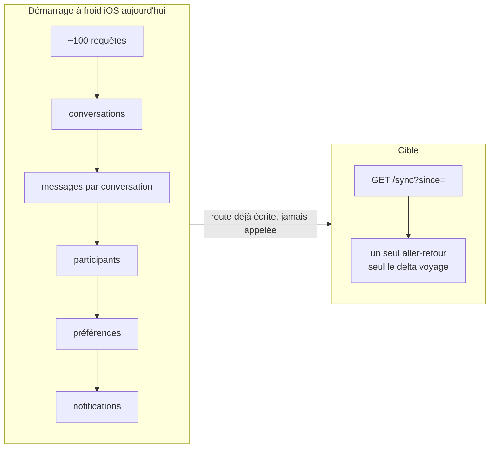

# Bande passante — ce qui part de trop, et ce qui part deux fois

> Annexe de [`README.md`](README.md). Compte rendu daté du **2026-08-28**.
> Objectif posé : *« les API doivent permettre de DIMINUER la bande passante
> entre les frontend et backend, permettre au frontend de ne pas récupérer des
> données plusieurs fois inutilement »*.

---

## 1. Les cinq leviers

| Levier | Ce qu'il économise | État mesuré |
|---|---|---|
| **Cache conditionnel** ETag → 304 | le corps de la réponse | ✅ **acquis** — hook global `conditionalGetOnSend` (`server.ts:326`, `utils/etag.ts:124`) sur tout `GET` JSON 200 |
| **Sparse fieldsets** `?fields=` | les champs non lus | ❌ **zéro site** sur 524 endpoints |
| **Expansion contrôlée** `?expand=` | les relations non demandées | ❌ **zéro site** |
| **Curseur** | le `count()` et les pages relues | ⚠️ 7 des 86 `GET`-liste |
| **Delta** `updatedSince` | tout ce qui n'a pas changé | ⚠️ `GET /sync` existe, **aucun appelant** |

Une nuance structurante : **le 304 économise la bande passante, pas le travail
serveur.** L'ETag est calculé sur la charge déjà produite — les requêtes Prisma
et la sérialisation ont eu lieu. Un `GET /users/me/stats/achievements` qui répond
304 a quand même payé ses neuf agrégations. Seuls `?fields=`, `?expand=` et le
delta réduisent le coût en amont.

---

## 2. Ce qui part de trop — 86 charges lourdes, 356 risques de sur-fetch

Trois motifs reviennent, tous mesurés dans les handlers :

1. **Relation chargée sans `take`.** `GET /links/:identifier` charge
   `participants` sans borne : une conversation à 5 000 participants les ramène
   tous pour afficher un lien. Même motif sur
   `GET /anonymous/link/:identifier` et `GET /communities/:id/conversations`
   (aucune pagination, aucun `take`).
2. **`findUnique` sans `select`.** La ligne entière est chargée pour en lire
   deux champs — `GET /attachments/:attachmentId`,
   `GET /links/:identifier/messages`,
   `POST /attachments/:attachmentId/translate` (qui la recharge une seconde
   fois).
3. **Agrégation calculée en mémoire.** `GET /users/me/stats/timeline` ramène
   **une ligne par message des 90 derniers jours** pour en faire une courbe ;
   `GET /tracking-links/:token/stats` agrège tous les clics en mémoire ;
   `GET /admin/messages/stats` fait un `findMany` sur toute la fenêtre.

Un quatrième, plus discret : **`additionalProperties: true`**. Quand le schéma
de réponse ne déclare aucun champ (`GET /affiliate/stats`,
`GET /tracking-links/:token/clicks`), tout ce que le service ajoute part sur le
fil — y compris ce que personne n'a voulu exposer.

### Les charges les plus lourdes

| Route | Ce qui part de trop |
|---|---|
| `GET /api/v1/links/:identifier` | la relation `participants` est chargée SANS take : une conversation a 5 000 participants les ramene tous (avec leur ligne User) a chaque appel, alors que seuls les … |
| `GET /api/v1/links/:identifier/messages` | conversationShareLink.findUnique SANS select : toute la ligne du lien est chargée pour n en lire que id/conversationId/allowViewHistory. `sender.isOnline` est … |
| `GET /api/v1/tracking-links/:token/stats` | agrégation calculee en mémoire par TrackingLinkService.getTrackingLinkStats sur TOUS les clics de la période ; aucune borne haute de plage de dates ni de volume. … |
| `GET /api/v1/tracking-links/:token/clicks` | `clicks: { type: 'array', items: { type: 'object', additionalProperties: true } }` : les lignes trackingLinkClick sont servies BRUTES, donc avec ipAddress, … |
| `GET /api/v1/tracking-links/admin/all` | la route est morte a la sérialisation (voir ci-dessus) ; en amont, findMany include creator{id,username,displayName,avatar} sur toutes les lignes |
| `GET /api/v1/tracking-links/admin/:token/clicks` | meme défaut de sérialisation ; si le schema etait corrige, les lignes de clic partiraient BRUTES (PII de visiteur) comme sur la route user-scoped |
| `GET /api/v1/affiliate/stats` | `additionalProperties: true` signifie qu AUCUN champ n est declare : tout ce que le service ajoutera partira sur le fil sans revue — y compris, potentiellement, l … |
| `GET /api/v1/anonymous/link/:identifier` | `participant.findMany({ where: { conversationId, isActive: true } })` SANS take : tous les participants du fil sont ramenes (avec leurs trois colonnes de langue) … |
| `GET /api/v1/communities/:id/conversations` | AUCUNE PAGINATION et aucun `take`: toutes les conversations de la communaute sortent d'un coup, chacune avec la LISTE COMPLETE de ses participants et leur profil. … |
| `POST /api/v1/attachments/upload` | Aucun en sortie. En ENTRÉE : chaque part est intégralement bufferisée en mémoire (part.toBuffer()) AVANT toute validation de taille — les limites @fastify/multipart … |
| `GET /api/v1/attachments/:attachmentId` | attachmentService.getAttachment fait un findUnique SANS `select` : toute la ligne MessageAttachment est chargée (transcription, translations, encryptionIv, … |
| `GET /api/v1/attachments/file/*` | Aucun accès base de données du tout (c'est précisément le problème de sécurité) ; un seul stat() puis un stream. Ne renvoie que ce qui est demandé. |
| `GET /api/v1/conversations/:conversationId/attachments` | `transcription` (texte + segments mot-à-mot) et `translations` (toutes langues) sont servis SYSTÉMATIQUEMENT pour jusqu'à 100 pièces — une galerie de vignettes … |
| `POST /api/v1/attachments/:attachmentId/translate` | Le service recharge la ligne MessageAttachment ENTIÈRE (findUnique sans select) alors que la route vient déjà d'en lire le mimeType : deux allers-retours pour la … |
| `POST /api/v1/uploads` | aucun (protocole d'écriture) |
| `GET /api/v1/sync` | Sur-fetch STRUCTUREL et ASSUME, documente en tete de fichier : le `select` rend un message RENDABLE (traductions par langue, metadata, résumé de reactions, pieces … |
| `GET /api/v1/me/export` | HEAVY et à plusieurs titres : (1) `types` par défaut = LES TROIS familles — un client qui n'en veut qu'une paie tout ; (2) la liste de participants imbriquée n'a … |
| `GET /api/v1/users/me/dashboard-stats` | MISMATCH DE Sérialisation ACTIF (forme 1) : le handler envoie `members` sur chaque conversation et sur chaque communaute, le schema declare `participants` -> les … |
| `GET /api/v1/users/:userId/stats` | 9 agrégations paralleles dont un `$runCommandRaw` de comptage Mongo et un `groupBy` sur TOUS les messages de la cible, sans borne temporelle. Les 6 `achievements` … |
| `POST /api/v1/users/me/contacts/match` | Corps de requête potentiellement très volumineux (2000 fiches vCard) ; rien n'est persiste. `matchedUserSchema` sert isOnline/lastActiveAt, correctement gates. |
| `POST /api/v1/users/me/contacts/sync` | aucun cote réponse ; le coût est en Écriture (upsert par contact, jusqu'a 2000 par appel). |
| `GET /api/v1/users/me/stats` | 9 agrégations dont un `groupBy` sur TOUS les messages de l'utilisateur sans borne temporelle, a chaque appel, sans cache. |
| `GET /api/v1/users/me/stats/timeline` | Agrégation EN Mémoire : `findMany` ramene UNE LIGNE PAR MESSAGE des 90 derniers jours (select { createdAt } seul, mais AUCUN `take`) puis compte en JavaScript. Pour … |
| `GET /api/v1/users/me/stats/achievements` | SUR-FETCH STRUCTUREL : appelle `computeUserStats` ENTIER (les 9 requêtes paralleles, dont 3 `post.count` et le `groupBy` non borne) pour n'en garder QUE … |
| `GET /api/v1/calls/:callId/transcript` | transcription.findMany SANS take ni curseur : le journal ENTIER d un appel, chaque segment avec TOUTES ses traductions, en une seule réponse. Un appel long en 7 … |
| `GET /api/v1/admin/users/:userId/media` | La fusion prend `take: offset+limit` de CHAQUE source puis tranche en mémoire : à offset=100000 (plafond de validatePagination) la route demande 100100 lignes à … |
| `GET /api/v1/admin/users/:userId/reported-messages` | DEUX requêtes NON BORNÉES en amont de la page : prisma.participant.findMany({where:{userId,type:'user'}}) sans take (une participation par conversation du compte), … |
| `GET /api/v1/admin/conversations/:conversationId/messages` | `content` (texte intégral) + `sender.user` imbriqué + `_count.attachments` sur CHAQUE ligne, jusqu'à 100 par page. Aucune projection de traduction (le Prisme n'est … |
| `GET /api/v1/admin/reports/entity/:type/:id` | findMany SANS take et SANS pagination : une entité massivement signalée (raid) rend l'intégralité de ses signalements en une réponse. Liste non bornée par … |
| `GET /api/v1/admin/messages` | `attachments: { select: attachmentMediaSelect }` charge d'office une quinzaine de champs par piece jointe (fileUrl, thumbnailUrl, thumbHash, imageVariants, … |
| `GET /api/v1/admin/translations` | Très GRAVE : `message.findMany` (ligne 487) n'a NI `skip` NI `take`. La route rapatrie TOUS les messages traduits de la période (contenu original + le JSON … |
| `GET /api/v1/admin/anonymous-users` | `anonymousSession: true` sans select imbrique = toutes les colonnes de la session (profil JSON compris) sur chaque ligne. `sessionTokenHash` n'est demande par aucun … |
| `GET /api/v1/admin/broadcasts` | Aucun `select` : chaque ligne de liste transporte `translatedBodies` / `translatedSubjects`, c'est-a-dire N copies du corps complet de l'e-mail (une par langue … |
| `POST /api/v1/admin/broadcasts/:id/preview` | La réponse renvoie les traductions DEUX FOIS : dans `translations` et dans `broadcast.translatedSubjects/translatedBodies` (l'objet complet est rendu sans select). … |
| `GET /api/v1/admin/posts` | `media: { select: mediaSelect }` charge d'office les 19 champs du media — dont les DEUX champs Prisme lourds `transcription` et `translations` (JSON de sous-titres … |
| `GET /api/v1/admin/posts/:postId` | `include` sans `select` a la racine = toute colonne ajoutée au modèle Post part automatiquement (dont visibilityUserIds, les champs de moderation, les champs … |
| `GET /api/v1/admin/agent/configs` | AVANT toute pagination, la route fait TROIS findMany NON BORNES pour construire l'univers des conversations concernees : … |
| `GET /api/v1/admin/agent/configs/:conversationId/roles` | Aucun `select` et aucun `take` : le nombre de roles n'est borne par rien, et chaque role transporte tous ses tableaux de profil (catchphrases, relationshipMap, … |
| `GET /api/v1/admin/agent/scan-logs/:logId` | Le champ par champ de la LISTE (13 colonnes choisies) est abandonne ici au profit de « tout » : la vue de detail est le point de fuite de toute colonne future du … |
| `GET /api/v1/conversations/:id/messages` | 1) `currentUserConsumption` (une requête attachmentStatusEntry.findMany par page) et `currentUserReactions` (une requête reaction.findMany par page) sont calcules … |
| `GET /api/v1/conversations/:id/pinned-messages` | `attachments: true` charge la relation Entière sans select (transcription, translations, variantes d'image, champs de chiffrement) la ou les autres routes passent … |
| `GET /api/v1/conversations/:id/reactions` | AUCUNE BORNE: `reaction.findMany` sur TOUTE la conversation, sans take ni pagination, avec une jointure participant sur chaque ligne. Sur un fil actif c'est un … |
| `GET /api/v1/conversations/:id/status` | Charge les statusEntries de 50 messages avec le participant joint sur CHAQUE entree ; le `user` de chaque participant est etale entier dans `entries[].user` (schema … |
| `GET /api/v1/messages/:messageId` | `attachments: attachmentFullSelect` (transcription complete, translations audio, variantes) meme quand l'appelant ne veut que le texte. La ligne d'appartenance de … |
| `POST /api/v1/voice/translate` | La branche audioBase64 renvoie DEUX fois la meme chose : `result` (voiceTranslationResultSchema complet) ET les projections `transcription`/`translatedAudios` … |
*(La surface `attachments` est montée deux fois — `/api/v1/…` et `/api/…`
legacy — donc chacune de ses charges lourdes existe en double exemplaire. Les
jumelles legacy sont omises du tableau.)*

---

## 3. Ce qui part deux fois — 723 redondances côté clients

Ce sont les redondances relevées en lisant les appelants, pas en devinant. Trois
familles :

- **Le même écran demande deux fois la même donnée.** Le fil de posts en cache
  contient déjà les posts que `GET /posts/hashtag/:tag` va retélécharger quand
  l'utilisateur tape un hashtag depuis ce fil ; les reels servis en premier
  viennent du même cache que le fil.
- **Plusieurs émetteurs pour un même geste.** Trois symboles distincts postent
  sur `POST /posts`, trois autres sur `POST /posts/:id/comments` — dans le
  *même fichier* —, trois sur `POST /posts/:id/like` dont un **sans corps**
  (le gateway retombe alors sur « cœur » par défaut). `StoryService`,
  `StatusService` et `PostService` dupliquent chacun `delete`, `like`, `repost`
  et `comment` sur les mêmes routes, avec des corps différents.
- **Une réponse dont on lit une fraction.** Relevé sur une majorité des appels
  de liste : la charge porte trente champs, l'appelant en lit trois.

| Client | Appel | Redondance |
|---|---|---|
| iOS | `/posts/feed` | DOUBLON MORT : FeedViewModel.fetchFeedFromNetwork (apps/ios/.../FeedViewModel.swift:222) ecrit lui-meme `api.paginatedRequest(endpoint: "/posts/feed")` en contournant … |
| iOS | `/posts/hashtag/\(tag)` | Les posts rendus sont déjà tous presents dans le cache 'main-feed' quand le hashtag a ete tape depuis le fil ; rien n'est reutilise. |
| iOS | `/posts/feed/reels?limit=&cursor=&seed=` | Le seed vient du MEME cache que le fil : les reels affiches en premier ont donc déjà ete telecharges par /posts/feed. L'appel /posts/feed/reels re-descend les memes objets … |
| iOS | `/posts` | Trois symboles distincts du meme service postent sur /posts : create (ici), createCanvasPost (:805) et StatusService.create (StatusService.swift:47). Trois constructeurs de … |
| iOS | `/posts/\(postId)` | DOUBLON EXACT avec StoryService.delete (StoryService.swift:91) et StatusService.delete (StatusService.swift:52) — MEME route DELETE /posts/:id, trois symboles. |
| iOS | `/posts/\(postId)/like` | TROIS emetteurs sur /posts/:id/like : ici SANS corps (le gateway defaute alors sur coeur), StoryService.react (:100) AVEC {emoji}, StatusService.react (:58) AVEC {emoji}. Le … |
| iOS | `/posts/\(postId)/comments` | DOUBLON avec StoryService.comment (StoryService.swift:105) — meme route, corps plus pauvre (contenu seul). |
| iOS | `/posts/\(postId)/comments` | Meme route que la branche précédente ; le service la double parce que APIClient.post n'accepte pas de headers. |
| iOS | `/posts/\(postId)/comments` | TROISIEME site du meme POST /posts/:id/comments dans le MEME fichier, avec un CreateCommentRequest construit une troisieme fois. |
| iOS | `/posts/\(postId)/repost` | DOUBLON avec StoryService.repost (StoryService.swift:111), meme route, corps vide. Le commentaire de MyStoriesView dit que ce chemin echouait STRUCTURELLEMENT sur les stories … |
| iOS | `/posts/\(postId)/repost` | Deux branches internes qui construisent le MEME RepostRequest, plus la surcharge :633, plus StoryService.repost : quatre sites pour une route. |
| iOS | `/posts/\(postId)/share` | DOUBLON MORT de share(postId:platform:generateLink:) (:694) — meme route, sans corps. |
| iOS | `/posts/bookmarks` | TRIPLE : les deux `hydrateBookmarkSeeding` sont un COPIER-COLLER l'un de l'autre (FeedView:200-228 == RootViewComponents:222-250), et l'ecran Signets refait sa propre … |
| iOS | `/posts/\(postId)` | DOUBLON EXACT avec StoryService.fetchPost (StoryService.swift:143) : meme GET /posts/:id, mais StoryService y ajoute son cache mémoire BoundedFIFOMap. Deux caches … |
| iOS | `/posts/\(postId)/comments` | SIX sites d'appel, TROIS mappings APIPostComment -> FeedComment recopies (PostDetailViewModel:234, FeedCommentsSheet.mapFetchedComments:1105, StoryViewerView.storyComment). … |
| iOS | `/posts/\(postId)/translate` | Miroir manuel de requestCommentTranslation (:609) — meme forme, meme absence d'usage de la réponse |
| iOS | `/posts` | SECOND constructeur de corps pour POST /posts (CreateStoryRequest) a cote de CreatePostRequest (:493) — deux formes de charge pour une route. |
| iOS | `/posts/\(postId)/view` | TRIPLE EMETTEUR de POST /posts/:id/view : (1) ce symbole, (2) StoryService.markViewed (StoryService.swift:87, MORT), (3) OutboxDispatcher.dispatchMarkStoryViewed … |
| iOS | `/posts/user/\(userId)` | Les deux surfaces peuvent s'ouvrir sur le meme utilisateur ; la seconde ne profite jamais du cache que la première a rempli. |
| iOS | `/posts/\(postId)/comments/\(commentId)/replies` | AMPLIFICATION : preloadReplyPreviews declenche JUSQU'A 5 appels supplementaires a l'ouverture d'un post (un par fil ayant des réponses), et StoryViewerView fait la meme chose … |
| iOS | `/posts/impressions/batch` | Chevauche viewPost (:886) et recordImpression (:942) : trois routes disent 'ce post a ete vu', avec trois semantiques (vue unique / lot d'impressions / impression unitaire) … |
| iOS | `/posts/\(postId)/impression` | SUR L'ECRAN DETAIL : recordImpression part immediatement après viewPost sur le meme postId (PostDetailView:872 puis :873). Deux POST, deux round-trips, un seul geste … |
| iOS | `/posts/engagement/batch` | QUATRIEME route de telemetrie de lecture, après view / impression / impressions-batch. |
| iOS | `/posts/feed/stories?limit=&cursor=&updatedSince=` | DOUBLON RECONNU ET RUSTINE : le commentaire de ConversationListViewModel:2321-2326 documente que les DEUX chemins tapaient /posts/feed/stories au demarrage a froid (limit=50 … |
| iOS | `/posts/\(storyId)/view` | TRIPLE : ce symbole, PostService.viewPost (:886) et OutboxDispatcher:275 emettent tous POST /posts/:id/view. Deux sont vivants, un est mort, aucun ne délégué aux autres. |
| iOS | `/posts/\(storyId)` | DOUBLON EXACT de PostService.delete (:498) et StatusService.delete (StatusService.swift:52) — meme route. |
| iOS | `/posts/\(storyId)/like` | TRIPLE avec PostService.like (:502, SANS emoji) et StatusService.react (StatusService.swift:58, avec emoji en JSONSerialization). |
| iOS | `/posts/\(storyId)/comments` | DOUBLON MORT de PostService.addComment (:543), avec un corps strictement plus pauvre (ni parentId, ni effets, ni pieces jointes, ni cmid). |
| iOS | `/posts/\(storyId)/repost` | DOUBLON MORT de PostService.repost, et surtout chemin STRUCTURELLEMENT casse pour les stories (404 sur story expiree, 403 sur story FRIENDS) — remplace par /republish (:127). |
| iOS | `/posts/stories/mine?limit=&cursor=` | RECOUVREMENT avec list() : le tray sert déjà les stories de l'auteur sur 7 jours ; listMine re-descend cette meme fenetre en plus de l'archive. La fusion cote client … |
| iOS | `/posts/\(id)` | DOUBLON de PostService.getPost (:733) : meme GET /posts/:id, DEUX caches independants (BoundedFIFOMap mémoire ici, CacheCoordinator.feed la-bas) qui ne se voient pas. Un post … |
| iOS | `/posts/feed/statuses (mode .friends) \| …` | DEUX consommateurs pour deux usages differents de la MEME page. StoryViewModel ne veut que le mood (emoji + message) de chaque auteur pour l'interstitiel : il tire 50 statuts … |
| iOS | `/posts` | TROISIEME constructeur de corps pour POST /posts (après PostService.create:493 et createCanvasPost:805). Il rebâtit un CreatePostRequest en dur avec type:"STATUS" au lieu … |
| iOS | `/posts/\(statusId)` | DOUBLON EXACT de PostService.delete (:498) et StoryService.delete (:91). |
| iOS | `/posts/\(statusId)/like` | TRIPLE avec PostService.like (:502) et StoryService.react (StoryService.swift:100) — trois symboles, trois formes de corps (aucun / LikeRequest / [String:String] … |
| iOS | `/sounds/mine?limit=&cursor=` | SUR-FETCH CARACTERISE : `query` n'est JAMAIS envoye au serveur pour cet onglet (le filtrage est local, Self.filterLocally). Chaque pause de frappe relance donc un GET … |
| iOS | `/stories/audio?limit=&q=` | Ici la recherche est SERVEUR (`q`), donc le rejeu par frappe est justifie — contrairement a mySounds. Deux onglets voisins, deux semantiques opposees pour le meme champ de … |
| iOS | `/sounds/\(soundId)/posts?limit=&cursor=` | Le curseur pagine les USAGES et non les publications : plusieurs pages peuvent ne rien rendre de neuf. Le modèle compense par un compteur `emptyStreak` (arret après N pages … |
| iOS | `/admin/reports` | CINQ methodes pour UNE route : seul `reportedType` change entre reportMessage/reportUser/reportPost/reportStory/reportConversation. Le fichier est cinq fois le meme corps. |
| iOS | `/admin/reports` | idem — 4e des cinq jumelles |
---

## 4. La cible

### 4.1 Deux paramètres, une convention

Toute ressource composite accepte deux paramètres, et **rien ne part qui ne
soit demandé** :

```
GET /directory/people/{handle}?fields=id,displayName,avatar
GET /conversations/{id}?expand=participants(limit:20),lastMessage
```

- `fields` — liste blanche de champs scalaires. Absent ⇒ un **profil par
  défaut volontairement maigre**, pas la ligne entière. C'est l'inversion qui
  compte : aujourd'hui le défaut est « tout », demain le défaut est « le
  nécessaire ».
- `expand` — liste blanche de relations, chacune bornée. Une relation non
  citée n'est pas chargée. Cela supprime d'un coup les trois motifs du § 2 :
  pas de relation sans `take`, pas de `findUnique` sans `select` (le `select`
  se déduit de `fields`), et les agrégations coûteuses deviennent des
  expansions explicites (`?expand=stats`) que l'appelant paie sciemment.

### 4.2 Curseur partout, `offset` nulle part

Les 43 `GET`-liste en `offset` repaient un `count()` complet à chaque page et
sautent des lignes quand la collection bouge. Les 27 sans aucune borne sont des
bombes à retardement proportionnelles à l'ancienneté du compte. Une seule forme :

```
GET /…?cursor=<opaque>&limit=<n≤100>   →   { data, nextCursor }
```

### 4.3 Le delta, chemin nominal du rafraîchissement

`GET /sync` sait déjà rendre « ce qui a changé depuis ». iOS l'ignore et
reconstruit son état par une centaine de requêtes au démarrage à froid. Le
brancher est le geste au meilleur rapport gain/effort de tout cet audit — il ne
demande **aucune route nouvelle**.



### 4.4 Ordre d'exécution

| Étape | Geste | Gain | Coût client |
|---|---|---|---|
| 1 | Borner les 27 listes sans pagination | supprime les charges non bornées | nul |
| 2 | `select` et `take` sur les 86 charges lourdes | réduit le coût **serveur** | nul |
| 3 | Adoption de `GET /sync` par iOS | ~100 requêtes → 1 au démarrage | version iOS |
| 4 | `?fields=` et `?expand=` sur les ressources composites | inverse le défaut « tout part » | version cliente |
| 5 | Curseur sur les 43 listes en `offset` | supprime les `count()` | version cliente |

Les étapes 1 et 2 ne demandent **aucune modification cliente** : ce sont des
corrections serveur pures, à faire en premier.
