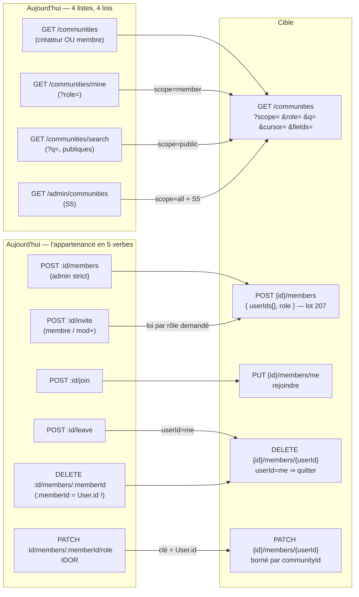

## Communautés — communautés, membres, préférences

### Ce que la surface est aujourd'hui

Vingt-trois routes servent **une seule entité** (`Community`) et ses deux satellites (`CommunityMember`, `UserCommunityPreferences`). Quatre d'entre elles listent la même table avec quatre lois différentes (`GET /communities`, `GET /communities/mine`, `GET /communities/search`, `GET /admin/communities`) ; deux écrivent la même ligne `CommunityMember` par deux verbes (`POST .../members`, `POST .../invite`) ; deux gestes réflexifs (`join`, `leave`) sont écrits comme des actions RPC alors qu'ils décrivent la même sous-ressource « ma ligne de membre ». Aucune route ne porte d'ETag, aucune n'accepte `?fields=` ni `?expand=`, aucune n'est paginée par curseur — les sept listes sont en `offset` (qui repaie un `count()`) ou sans pagination du tout. Côté clients, le croisement est moins tranché qu'il n'y paraît : **les quatorze hooks de `use-communities-query.ts` sont bien montés par des écrans réels** (`app/(connected)/communities/page.tsx`, `app/(connected)/communities/[id]/page.tsx`, `components/groups/groups-layout.tsx` — rendu par les routes `/groups` et `/groups/[identifier]` —, `components/groups/CommunityMembersPanel.tsx` via `GroupDetails`, `components/conversations/CommunityCarousel.tsx`, `components/conversations/create-conversation-modal.tsx`) ; quatre hooks seulement restent sans hôte (`useAddMemberMutation`, `useCommunityPreferencesListQuery`, `useDeleteCommunityPreferencesMutation`, `useReorderCommunitiesMutation`), auxquels s'ajoute `CommunitySettingsPanel` (mise à jour et suppression de communauté), exporté mais rendu par aucun écran. Le code mort du module est ailleurs : `components/groups/groups-layout-responsive.tsx` n'est importé nulle part — et il est le seul consommateur de `API_ENDPOINTS.GROUP` (`lib/config.ts:217-228`) —, et `services/groups.service.ts` est un jumeau mort (tests seuls) qui vise `PATCH /communities/:id`, `PATCH /communities/:id/members/:memberId`, `POST /communities/:id/invite-link` et `POST /communities/join-by-invite` — **quatre chemins qu'aucune route ne sert**.

| Route | Niveau | Auth | Débit | Poids | Consommée par | Verdict |
|---|---|---|---|---|---|---|
| `GET /communities/check-identifier/:identifier` | S2 | `authenticate` seul, `authContext` jamais lu | global 300/min/IP | light | web (`groups-layout.tsx:92`, via `useCheckIdentifierQuery`) — iOS déclare `checkIdentifier` sans appelant | à fusionner vers `GET /communities/identifier-availability` |
| `GET /communities` | S2 borné par le `where` | `authenticate` + re-vérif | global | medium (DB : lourd) | iOS (2 écrans) + web (`useCommunitiesQuery` : 4 écrans) | à fusionner vers `GET /communities` (`scope=`) |
| `GET /communities/:id` | S2/S3 (403 seulement si privée) | `authenticate` + `hasAccess` | global | medium | iOS (`CommunityDetailViewModel`) + web (`useCommunityQuery` : `groups-layout.tsx:70`, `communities/[id]/page.tsx:24`) | à garder — `ref` corrigé |
| `POST /communities` | S2 | `authenticate` | **aucun quota de création** | light | iOS + web | à garder + quota |
| `GET /communities/:id/conversations` | S3 | `hasAccess` + `participants.some` | global | **heavy** | iOS (`CommunityDetailViewModel.load`) + web (`useCommunityConversationsQuery` : `groups-layout.tsx:76`, `communities/[id]/page.tsx:25`) | à garder + curseur |
| `POST /communities/:id/conversations/:conversationId` | S3 côté communauté, **rien côté conversation** | `isCreator ‖ isAdmin` | global | medium | iOS (`AddChannelSheet`) — web : PERSONNE | à fusionner vers `PUT .../conversations/{cid}` + garde conversation |
| `GET /communities/:id/members` | S2/S3 | `hasAccess` | global | medium | iOS (`CommunityMembersViewModel`) + web (`useCommunityMembersQuery` : `CommunityMembersPanel`, `communities/[id]/page.tsx:26`) | à garder + curseur |
| `POST /communities/:id/members` | S3 admin strict | `role === admin` | **aucun** | light | iOS (fan-out N appels) — web : PERSONNE | à fusionner vers `POST .../members` (lot) |
| `PATCH /communities/:id/members/:memberId/role` | S3 admin (**IDOR**) | `role === admin` | global | light | iOS + web (`CommunityMembersPanel`, monté par `GroupDetails`) | à fusionner vers `PATCH .../members/{userId}` |
| `DELETE /communities/:id/members/:memberId` | S3 admin | `role === admin` | global | light | iOS + web (`CommunityMembersPanel`, monté par `GroupDetails`) | à fusionner vers `DELETE .../members/{userId}` |
| `GET /communities/mine` | S2 réflexif | `where: { userId }` | global | light | **iOS seul** (`CommunityLinkService`, `WidgetPreviewView`) | à fusionner vers `GET /communities?scope=member&role=` |
| `POST /communities/:id/join` | S2 → S3 | publique seulement | **aucun** | light | iOS + web (`SearchPageContent.tsx:327` + `useJoinCommunityMutation`, 2 pages) | à fusionner vers `PUT .../members/me` |
| `POST /communities/:id/leave` | S3 réflexif | non-créateur | global | light | iOS (2 hôtes) + web | à fusionner vers `DELETE .../members/me` |
| `POST /communities/:id/invite` | S3 membre (mod+ si privée) | membre | **aucun** | light | **iOS seul** (`CommunityInviteView`) | à fusionner vers `POST .../members` (lot) |
| `PUT /communities/:id` | S3 **créateur seul** | `createdBy === userId` | global | light | iOS + web (`CommunitySettingsPanel`, non monté) | à garder — méthode `['PUT','PATCH']` |
| `DELETE /communities/:id` | S3 créateur seul | `createdBy === userId` | global | light | iOS + web (`CommunitySettingsPanel`, non monté) | à garder — devient soft-delete |
| `GET /communities/search` | S2 (publiques) | `authenticate` seul, `authContext` jamais lu | **aucun** (scan complet) | medium | **web seul** (`SearchPageContent.tsx:145` + `useCommunitySearchQuery`, `communities/page.tsx:29`) — iOS déclare `search()` sans appelant | à fusionner vers `GET /communities?scope=public` |
| `GET /admin/communities` | S5 `canAccessAdmin` | garde locale (matrice) | global | medium | web admin (`app/admin/communities/page.tsx`) | à fusionner vers `GET /communities?scope=all` |
| `GET /user-preferences/communities/:communityId` | S3 réflexif | clé composite | global | light | web (`CommunityPreferencesMenu`, monté par `GroupDetails` et `communities/[id]/page.tsx:168`) — iOS : PERSONNE | à supprimer → `expand=preferences` |
| `GET /user-preferences/communities` | S3 réflexif | `where: { userId }` | global | light | web (hook non monté) — iOS : PERSONNE | à supprimer → `expand=preferences` |
| `PUT /user-preferences/communities/:communityId` | S3 réflexif, **sans filtre d'appartenance** | clé composite | global | light | web (`CommunityPreferencesMenu`) — iOS : PERSONNE | à fusionner vers `PATCH /me/community-preferences` |
| `DELETE /user-preferences/communities/:communityId` | S3 réflexif | clé composite | global | light | web (hook non monté) — iOS : PERSONNE | à fusionner vers `PATCH /me/community-preferences` (`reset`) |
| `POST /user-preferences/communities/reorder` | S3 + **filtre d'appartenance** | `communityMember … isActive` | **aucune borne de taille** | light | web (hook non monté) — iOS : PERSONNE | à fusionner vers `PATCH /me/community-preferences` |

Chemins **fantômes** déclarés côté web et servis par personne (`services/groups.service.ts`, lui-même sans appelant de production) : `PATCH /communities/:id` (seul `PUT` existe, `settings.ts:24`), `PATCH /communities/:id/members/:memberId` (seul `.../role` existe), `POST /communities/:id/invite-link`, `POST /communities/join-by-invite`.

### Ce qui ne va pas

**Sécurité — trois défauts durs.**

1. **IDOR confirmé sur le changement de rôle.** `services/gateway/src/routes/communities/members.ts:453-454` : `prisma.communityMember.update({ where: { id: memberId } })`. Le `:id` de la communauté sert uniquement à autoriser (`members.ts:447-449`, `role === admin`), jamais à borner l'écriture. Être admin d'**une** communauté quelconque suffit à promouvoir ou rétrograder n'importe quelle ligne `CommunityMember` de **n'importe quelle** communauté, y compris privée.
2. **Rattachement de conversation sans garde côté conversation.** `communities/core.ts:694-701` charge `conversation.participants { select: { userId, role } }` et **ne l'utilise jamais** ; `core.ts:710` écrit `data: { communityId: id }` sans condition. Un admin de sa propre communauté peut donc déplacer n'importe quelle conversation du système (y compris déjà rattachée ailleurs) et reçoit en retour la composition de ses participants. La description OpenAPI promet pourtant « admin/creator of **BOTH** ». La variable chargée simule un contrôle absent.
3. **Deux entités sous un même nom de paramètre.** `PATCH .../members/:memberId/role` attend un `CommunityMember.id` (`members.ts:454`) ; `DELETE .../members/:memberId` attend un `User.id` (`members.ts:565-568`, `where: { communityId, userId: memberId }`). Un client qui réutilise l'identifiant rendu par la liste supprime… rien, et reçoit un `200 Member removed successfully` (`deleteMany` à `count: 0` n'est jamais testé — `members.ts:565-572`), alors que `POST /leave` vérifie, lui, l'effet de son écriture (`membership.ts:296-301`, `deleted.count === 0 → 404`).

Trois écarts de moindre gravité mais structurels : `check-identifier` (`core.ts:77`) est un **oracle d'existence sur les communautés privées** (`findUnique` sans filtre `isPrivate`/`deletedAt`) sans débit dédié ; `GET /communities/search` (`search.ts:113`) n'a pour seule barrière que `isPrivate: false` dans le `where`, aucun contrôle in-handler ne rougirait si la ligne disparaissait ; `PUT /user-preferences/communities/:communityId` (`community-preferences.ts:311`) accepte n'importe quel ObjectId, quand son voisin `reorder` (`community-preferences.ts:~500`) applique le filtre d'appartenance et **documente en commentaire que l'upsert l'exige** — la règle est appliquée à une moitié du fichier.

**Loi d'autorisation — quatre définitions d'« admin » dans un même répertoire.** `POST .../conversations/:cid` accepte `isCreator ‖ isAdmin` (`core.ts:685-687`) ; `POST .../members` exige `role === admin` strict et ignore `createdBy` pourtant sélectionné (`members.ts:283-297`) ; `POST .../invite` exige membre, puis mod+ si privée (`membership.ts:398-407`) ; `PUT/DELETE /communities/:id` exigent le créateur seul (`settings.ts`). Conséquence produit : un admin de communauté peut expulser des membres mais pas renommer la communauté, et un créateur sans ligne `CommunityMember` ne peut plus rien administrer. Aucun transfert de propriété n'existe alors que le message d'erreur de `/leave` en promet un.

**Contrat — trois promesses non tenues.** (a) `GET /communities/:id` annonce l'accès « par ID **ou identifier** » : le repli `findFirst({ identifier: id })` (`core.ts:327-328`) est **inatteignable**, parce que `findFirst({ where: { id: 'mshy_paris' } })` lève `Malformed ObjectID` avant lui, exception avalée par le `catch` → **500**. Le web tape exactement ce chemin : la route `/groups/[identifier]` passe l'identifiant de l'URL — préfixe `mshy_` COMPRIS — à `useCommunityQuery` (`groups-layout.tsx:70-72`), qui appelle `/communities/mshy_…` et récolte le 500. Sur ce chemin vivant, un repli fonctionnel trouverait bien la ligne ; c'est le jumeau mort `groups-layout-responsive.tsx:309` qui retirait le préfixe avant d'appeler. (b) `check-identifier` teste l'identifiant **brut** — aucune normalisation serveur — alors que `POST /communities` écrit `generateIdentifier()`, qui préfixe `mshy_` (`communities/types.ts:42-59`) : rien ne garantit que la vérification porte sur la clé écrite. Le seul appelant vivant (`groups-layout.tsx:89-92`) préfixe lui-même avant d'appeler, si bien que la normalisation est aujourd'hui à la charge du client. (c) `DELETE /communities/:id` promet une cascade que Prisma/MongoDB n'applique pas, et fait un **hard delete** alors que `Community.isActive`/`deletedAt` existent (`schema.prisma:1560-1562`) ; idem pour `CommunityMember.isActive`/`leftAt` (`schema.prisma:1584-1586`), **jamais écrits** par aucune route alors que `search.ts:153` (et le `reorder` des préférences, `community-preferences.ts:512`) filtre dessus.

**Bande passante — le poste le plus cher est invisible côté réseau.** `GET /communities` et `GET /communities/:id` font `include: { members: { include: { user: … } } }` **sans `take`** (`core.ts:187-213`, `core.ts:294-320`) : tous les membres et leurs profils sont chargés pour chaque communauté de la page, puis `flattenCommunityCounts` **supprime entièrement `members`**. Aucun octet ne sort ; tout le coût base est payé. Sur `GET /communities/:id`, l'`include` complet est même **répété deux fois** pour le repli mort. `GET /communities/:id/conversations` n'a **ni pagination ni `take`** et sort toutes les conversations avec la liste complète de leurs participants — la charge la plus lourde du module, pour un écran iOS qui n'affiche que `title / identifier / type`. Et sur `GET /communities/:id/members`, la garde relit `members: { select: { userId } }` non borné avant de paginer : sur une grosse communauté, **le contrôle coûte plus cher que la page rendue**.

**Clients — les allers-retours que la surface impose.** Créer une communauté avec dix membres présélectionnés = 1 `POST /communities` + **10 `POST .../members` en série** (`CommunityCreateView.swift:538`), chacun en `_ = try? await` : quatre refus serveur sont invisibles pour l'utilisateur. Rejoindre = 3 requêtes (`join` puis `load()` qui refait détail + conversations) alors que la réponse du `join` porte déjà le membre. Changer un rôle = 2 allers-retours (`updateRole` puis `refresh()` qui retélécharge 30 membres) alors que la réponse porte la ligne à jour. Ouvrir un détail depuis une liste retélécharge intégralement l'objet que la liste vient de servir — sans cache (`CommunityDetailViewModel` n'utilise pas `CacheCoordinator.shared.communities`). Et `create/join/leave/delete` **n'invalident jamais** le store `communities` : après avoir quitté une communauté, elle reste affichée jusqu'à 5 minutes.

### La surface cible

| Route cible | Remplace | Niveau | Débit (seuil + clé) | Paramètres | Gain |
|---|---|---|---|---|---|
| `GET /communities` | `GET /communities`, `GET /communities/mine`, `GET /communities/search`, `GET /admin/communities` | S2 ; **S5** (`canAccessAdmin`) si `scope=all` | `scope=public` : 30/min · `community:search:account:{userId}` ; sinon global | `scope=member\|owned\|mine\|public\|all`, `q`, `role`, `state`, `cursor`, `limit`, `updatedSince`, `fields`, `expand` | 4 listes → 1 ; curseur au lieu de 4 `count()` ; `fields` supprime l'`include members` mort |
| `GET /communities/{ref}` | `GET /communities/:id` | S2 si publique · **S3** si privée | global | `ref` = ObjectId **ou** identifiant lisible ; `fields`, `expand=members,conversations,preferences` ; `If-None-Match` | corrige le 500 sur identifiant ; `expand` supprime 2 appels d'ouverture d'écran |
| `GET /communities/identifier-availability` | `GET /communities/check-identifier/:identifier` | S2 | **20/min · `community:identifier-check:account:{userId}`** + 60/min · `…:ip:{ip}` | `identifier` (normalisé par `generateIdentifier` avant test) | ferme l'oracle sur les communautés privées ; teste enfin la clé réellement écrite |
| `POST /communities` | idem | S2 | **5/h et 20/j · `community:create:account:{userId}`** | corps `CreateCommunity` | ferme la création en boucle ; `409` réel sur collision (P2002 traduit) |
| `PATCH \| PUT /communities/{id}` | `PUT /communities/:id`, fantôme `PATCH /communities/:id` | **S3** — champs ouverts aux `admin`, champs souverains au créateur | global | corps partiel ; `identifier`/`isPrivate` réservés au créateur | une seule route pour deux méthodes ; débloque l'administration courante sans donner la propriété |
| `POST /communities/{id}/ownership` | *(nouveau — comblement)* | S3 créateur seul | 3/j · `community:ownership:community:{id}` | `{ userId }` | transfert que `/leave` promet déjà dans son message d'erreur |
| `DELETE /communities/{id}` | idem (**devient soft**) | S3 créateur seul | global | `?purge=true` réservé S6 | écrit `deletedAt`/`isActive` + cascade explicite des dépendants |
| `GET /communities/{id}/members` | idem | S2 si publique · S3 si privée | global | `cursor`, `limit`, `role`, `state=active\|left`, `updatedSince`, `fields`, `If-None-Match` | curseur + `updatedSince` ; garde bornée (plus de relecture non bornée) |
| `POST /communities/{id}/members` | `POST .../members`, `POST .../invite` | S3 — loi unique **par rôle demandé** | 10/min · `community:member-add:account:{userId}:community:{id}` ; `maxItems: 50` | `{ userIds[], role? }` | 10 appels → 1 ; l'échec par identifiant est **nommé**, plus compté |
| `PATCH /communities/{id}/members/{userId}` | `PATCH .../members/:memberId/role`, fantôme `PATCH .../members/:memberId` | S3 admin | global | `{ role }` | **ferme l'IDOR** (écriture bornée par `communityId`) ; une entité par nom de paramètre |
| `DELETE /communities/{id}/members/{userId}` | `DELETE .../members/:memberId`, `POST .../leave` | S3 admin ; **S3 réflexif** si `userId = me` | global | `userId` = `me` ou un `User.id` | même règle produit des deux côtés (créateur protégé, dernier admin protégé) ; `404` réel sur no-op |
| `PUT /communities/{id}/members/me` | `POST .../join` | S2 → S3 (publique seulement) | 20/h · `community:join:account:{userId}` | — | symétrique du `DELETE` ; idempotent ; rend le membre créé (plus de rechargement) |
| `GET /communities/{id}/conversations` | idem | S3 participant | global | `cursor`, `limit`, `fields`, `If-None-Match` | borne la charge la plus lourde du module |
| `PUT /communities/{id}/conversations/{cid}` | `POST .../conversations/:cid` | **S3 sur les DEUX côtés** (admin communauté **et** admin/participant conversation) | 30/min · `community:attach:community:{id}` | — | ferme le détournement de conversation ; idempotent |
| `DELETE /communities/{id}/conversations/{cid}` | *(nouveau — comblement)* | idem | global | — | on pouvait rattacher, jamais détacher |
| `PATCH /me/community-preferences` | `PUT`, `DELETE`, `POST .../reorder`, `GET` ×2 (préférences lues par `expand`) | S3 réflexif **+ filtre d'appartenance sur tout le lot** | 60/min · `prefs:communities:account:{userId}` ; `maxItems: 200` | `{ items[] }` | 5 routes → 1 ; le filtre d'appartenance du `reorder` devient la loi de **toutes** les écritures ; `customName` assaini |

**16 routes cibles pour 23 aujourd'hui**, aucune capacité perdue et deux gestes manquants ajoutés (transfert de propriété, détachement de conversation).

#### `GET /communities` — la liste unique

```http
GET /api/v1/communities?scope=member&role=admin,moderator&updatedSince=2026-08-27T10:00:00Z
                       &fields=id,name,identifier,avatar,memberCount&expand=preferences
                       &cursor=eyJjIjoiNjZmLi4uIn0&limit=30
If-None-Match: "c3-8f21a…"
```

| `scope` | Sélection | Niveau |
|---|---|---|
| `member` | mes adhésions (`CommunityMember.isActive`) — remplace `GET /communities/mine` | S2 |
| `owned` | `createdBy = moi` | S2 |
| `mine` *(défaut)* | union des deux — comportement actuel de `GET /communities` | S2 |
| `public` | `isPrivate = false`, `q` élargi à `description` et aux noms de membres — remplace `/communities/search` | S2, débit strict |
| `all` | tout, privées comprises — remplace `GET /admin/communities` | **S5** |

```jsonc
{ "success": true,
  "data": [ { "id": "…", "name": "…", "identifier": "mshy_paris", "avatar": null,
              "memberCount": 128, "viewerRole": "admin", "updatedAt": "…",
              "preferences": { "isPinned": true, "isMuted": false, "orderInCategory": 3 } } ],
  "pagination": { "nextCursor": "eyJjIjoi…", "hasMore": true } }
```

`viewerRole` est le champ qui **rend l'`include members` inutile** côté détail **et** côté liste. Aujourd'hui iOS cherche sa propre ligne dans `apiCommunity.members` pour en déduire `isMember`/`isAdmin` (`CommunityDetailView.swift:547-553`) — mais `communitySchema` ne déclare pas `members` (`packages/shared/types/api-schemas.ts:2427`) et `flattenCommunityCounts` le retire : le tableau arrive TOUJOURS `nil`. La base paie l'`include`, le réseau ne transporte rien, et le client retombe sur `createdBy` seul — un membre non créateur est vu comme non-membre sur l'écran de détail. Servi par le serveur, `viewerRole` ferme la dépense ET le défaut d'affichage. `expand=preferences` retire les deux routes `GET /user-preferences/communities*`.

#### `POST /communities/{id}/members` — le lot qui remplace le fan-out

```jsonc
// requête
{ "userIds": ["66f…a1", "66f…b2", "66f…c3"], "role": "member" }
```

Loi d'autorisation **unique**, par rôle demandé — elle préserve exactement la différence entre les deux routes fusionnées :

| rôle demandé | qui peut | correspond à |
|---|---|---|
| `member` sur communauté publique | tout membre | `POST .../invite` |
| `member` sur communauté privée | `admin` ou `moderator` | `POST .../invite` |
| `moderator` / `admin` | `admin` **ou créateur** | `POST .../members` |

```jsonc
// réponse 207 — chaque identifiant a son verdict
{ "success": true,
  "data": { "added":    [ { "userId": "66f…a1", "role": "member", "joinedAt": "…" } ],
            "existing": [ "66f…b2" ],
            "rejected": [ { "userId": "66f…c3", "reason": "USER_NOT_FOUND" } ] } }
```

L'appartenance est filtrée **dans** la requête (`user.findMany({ where: { id: { in: userIds } } })` + un seul `createMany`), jamais après. Ce corps supprime le défaut client le plus visible du module : dix `try?` silencieux devenus un verdict par personne.

#### `PATCH /me/community-preferences` — une seule écriture

```jsonc
{ "items": [ { "communityId": "66f…a1", "isPinned": true, "orderInCategory": 0 },
             { "communityId": "66f…b2", "notificationLevel": "mentions" },
             { "communityId": "66f…c3", "reset": true } ] }
```

Le filtre d'appartenance de l'actuel `reorder` (`community-preferences.ts:~500`) devient la loi du lot entier : les `communityId` sans adhésion active sont **rejetés et nommés**, jamais silencieusement écrits. `maxItems: 200` borne l'amplification (aujourd'hui un tableau de 10 000 entrées déclenche 10 000 upserts concurrents). `customName` passe par `SecuritySanitizer`, comme le nom de communauté côté `settings.ts`. La réponse rend les préférences écrites ; l'événement `USER_PREFERENCES_UPDATED` reste émis par élément.

#### Débit — préalable non négociable

Tous les seuils par IP ci-dessus sont **fictifs tant que `trustProxy` n'est pas posé** : derrière Traefik, `request.ip` vaut l'IP Docker `172.x` pour tout le monde et le limiteur global (`server.ts:507`, clé `global:${request.ip}`, `skipOnError: true`) est un seau quasi commun, fail-open. Les clés retenues ici sont donc **par compte** partout où c'est possible, et l'IP ne sert que de second seau.

### Diagramme



### Migration

**Ce qui casse.**

*iOS* — sept méthodes de `CommunityService.swift` changent d'adresse : `list` (garde son chemin, gagne `scope`), `search` et `checkIdentifier` (**surfaces mortes, aucun appelant** : à recâbler plutôt qu'à migrer — la recherche publique de communautés est aujourd'hui inatteignable depuis l'app), `addMember`/`invite` (fusionnent en un appel de lot — supprime le fan-out de `CommunityCreateViewModel`), `join`/`leave` (deviennent `PUT`/`DELETE` sur `members/me`), `updateMemberRole` (le paramètre devient un `User.id` — **le seul changement d'argument silencieux du lot, à traiter en premier**), `removeMember` (inchangé dans sa forme). `CommunityLinkService.listCommunityLinks` (`/communities/mine?role=admin,moderator`) devient `GET /communities?scope=member&role=admin,moderator&fields=…` — et l'occasion de sortir la query string du chemin, écart de forme relevé au fragment.

*Web* — l'exposition réelle est **large**, contrairement à ce qu'un survol des services suggère : les hooks de `use-communities-query.ts` (liste, détail, recherche, conversations, membres, `check-identifier`, création, adhésion, départ, retrait de membre, changement de rôle) sont montés par `/groups`, `/groups/[identifier]`, `/communities`, `/communities/[id]` et le panneau membres, auxquels s'ajoutent les appels directs de `SearchPageContent.tsx` (recherche, adhésion) et la page `/admin/communities` (via `adminService.getCommunities`). Ne sont PAS montés : `useAddMemberMutation`, `CommunitySettingsPanel` (mise à jour / suppression) et trois des cinq hooks de préférences. La migration est donc une vraie rupture d'usage côté web, pas une réécriture de code mort. Trois corrections sont dues au passage et indépendantes de la fusion : `groups-layout.tsx:70-72` passe au détail l'identifiant préfixé `mshy_` (d'où le 500), `components/groups/groups-layout-responsive.tsx` n'est importé par personne — avec lui `API_ENDPOINTS.GROUP` (`lib/config.ts:217-228`) n'a plus aucun consommateur —, et `services/groups.service.ts` vise quatre chemins inexistants.

*Android* — aucun appel de communauté relevé dans le matériau ; à confirmer avant de retirer un alias, en application de la règle « quand cette liste dit jumelles, compter les clients avant de la croire ».

**Ordre des étapes.**

1. **Correctifs sans changement d'adresse** (livrables seuls, aucun client à toucher) : borner l'`update` du rôle par `communityId` (ferme l'IDOR) ; poser la garde côté conversation sur le rattachement ; retirer l'`include members` mort des deux routes de lecture ; brancher le repli par identifiant sur un test de forme ObjectId (fin des 500) ; normaliser `check-identifier` par `generateIdentifier` ; poser le filtre d'appartenance sur `PUT /user-preferences/communities/:communityId` ; borner `updates` du `reorder`. **Rien de ce lot n'attend la fusion.**
2. **Ajouts rétrocompatibles** : `?scope=`, `?role=`, `?cursor=`, `?fields=`, `?expand=`, `updatedSince`, ETag sur `GET /communities` et `GET /communities/{ref}` ; champ `viewerRole` ; corps de lot accepté par `POST .../members` (l'ancien corps `{ userId, role }` reste valide) ; `PATCH` monté en plus de `PUT` sur `/communities/:id` (méthode `['PUT','PATCH']`, une seule route) ; nouvelles routes `PUT|DELETE /communities/{id}/members/me`, `PATCH /me/community-preferences`, `PUT|DELETE /communities/{id}/conversations/{cid}`, `POST /communities/{id}/ownership`.
3. **Bascule des clients**, dans cet ordre : iOS (le fan-out de création et `updateMemberRole` d'abord, ce sont les deux gains les plus visibles), puis le web (les hooks montés migrent en place ; le recâblage ne concerne que `useAddMemberMutation`, `CommunitySettingsPanel` et les trois hooks de préférences sans hôte).
4. **Dépréciation** : en-tête `Deprecation` + `Sunset` sur les anciens chemins pendant deux versions d'app, télémétrie par route pour prouver le zéro appel avant retrait.

**Ce qui doit rester en alias** (double montage, handler unique délégant à la cible) : `GET /communities/mine` → `scope=member` ; `GET /communities/search` → `scope=public` ; `GET /admin/communities` → `scope=all` ; `POST .../join` et `POST .../leave` → `members/me` ; `POST .../invite` → `POST .../members` ; les quatre routes `user-preferences/communities*` → `PATCH /me/community-preferences` et `expand=preferences`.

**Ce qui ne peut PAS être un simple alias** : `PATCH .../members/:memberId/role` change d'**entité de clé** (`CommunityMember.id` → `User.id`). Un alias qui accepterait les deux formes rouvrirait l'IDOR le temps de la transition. La transition se fait donc par **nouvelle route** (`PATCH .../members/{userId}`), l'ancienne restant en place **bornée par `communityId`** (correctif de l'étape 1) jusqu'au retrait — jamais élargie.
