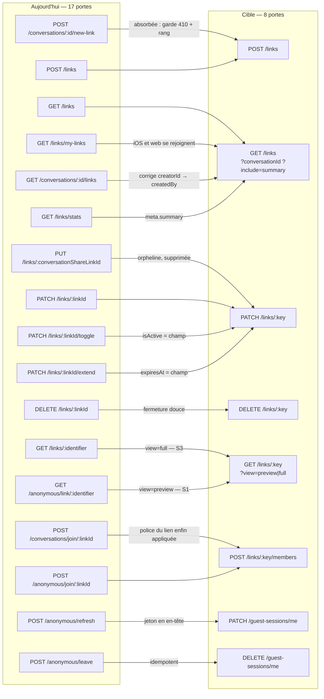

## Conversations, participants, liens de partage, invités sans compte

### Ce que la surface est aujourd'hui

Quarante-huit entrées HTTP servent un seul objet métier : une conversation, ses membres, les liens
par lesquels on y entre et les sessions des visiteurs sans compte. Elles vivent dans trois plugins
qui ne se connaissent pas — `routes/conversations/**`, `routes/links/**`, `routes/anonymous.ts` —
plus les cinq entrées de préférences par conversation, qui vivent à part dans
`routes/conversation-preferences.ts` ; et cette séparation d'implémentation a produit **des jumelles qui divergent sur ce qui compte** :
deux portes créent un lien de partage avec des gardes différentes, deux portes ajoutent un membre
avec des rangs et des permissions par défaut différents, deux portes font entrer par un lien avec
des polices d'admission différentes, deux portes listent les liens de l'appelant avec des formes de
réponse incompatibles — et le client web utilise l'une pendant qu'iOS utilise l'autre.

Aucune route de la tranche ne déclare de limiteur de débit : les quarante-huit partagent
`registerGlobalRateLimiter` (`middleware/rate-limiter.ts:61`), 300 requêtes/minute sur la clé
`global:${request.ip}`. Fastify tournant sans `trustProxy` derrière Traefik, `request.ip` vaut l'IP
du conteneur proxy : **c'est un seau unique pour toute la plateforme**, et il est `skipOnError: true`
(fail-open si Redis tombe). Une porte d'écriture non authentifiée comme `POST /anonymous/join/:linkId`
n'a donc, en pratique, aucun frein propre.

| Route | Niveau | Auth | Débit | Poids | Consommée par | Verdict |
|---|---|---|---|---|---|---|
| `GET /conversations/check-identifier/:identifier` | S2 (oracle) | JWT | global | light | web | à fusionner vers `GET /identifiers/availability` |
| `GET /conversations` | S3 | JWT ou session | global | **heavy** | iOS + web | à garder (curseur seul, `fields`/`expand`) |
| `GET /conversations/search` | S2 (fuit en S1) | JWT | global | **heavy** | iOS + web | à fusionner vers `GET /conversations?scope=discoverable` |
| `GET /conversations/:id` | S3 | JWT ou session | global | **heavy** | iOS + web | à garder |
| `POST /conversations` | S2 | JWT | global | medium | iOS + web | à garder — doit rendre la ressource complète |
| `PUT /conversations/:id` | S3 (MODERATOR, ADMIN par champ) | JWT | global | **heavy** | iOS + web | à garder (paire déclarée) |
| `PATCH /conversations/:id` | idem | JWT | global | **heavy** | PERSONNE (verbe non appelé) | à garder — même handler, forme correcte |
| `DELETE /conversations/:id` | S3 ADMIN, **S5 de fait** | JWT | global | light | iOS + web | à garder + journal d'audit |
| `GET /conversations/:id/analysis` | S3 | JWT | global | **heavy** | iOS | à fusionner vers `/insights` + rang |
| `GET /conversations/:id/stats` | S3 | JWT | global | medium | iOS | à fusionner vers `/insights` |
| `GET /conversations/:id/threads/:messageId` | S3 | JWT | global | **heavy** | **PERSONNE** | orpheline → module `messages` |
| `POST /conversations/:id/new-link` | S3 (aucun rang) | JWT | global | light | web | à fusionner vers `POST /links` |
| `GET /conversations/:conversationId/links` | S3 | JWT | global | medium | web | à fusionner vers `GET /links?conversationId=` (**500 aujourd'hui hors modérateur**) |
| `POST /conversations/join/:linkId` | S2 | JWT | global | light | iOS + web | à fusionner vers `POST /links/:key/members` |
| `POST /conversations/:id/invite` | S3 ADMIN | JWT | global | medium | web | à fusionner vers `POST /conversations/:key/participants` |
| `GET /conversations/:id/participants` | S3 | JWT ou session | global | medium | iOS + web | à garder (route la mieux gardée de la tranche) |
| `GET /conversations/:id/participants/:participantId/profile` | S3 (+ MODERATOR par cercle) | JWT ou session | global | light | iOS + web | à garder — renommer en ressource |
| `PATCH /conversations/:id/participants/:participantId/rights` | S3 MODERATOR, ADMIN sur `historyVisibleFrom` | JWT | global | light | iOS + web | à fusionner vers `PATCH …/participants/:key` |
| `POST /conversations/:id/participants` | S3 MODERATOR | JWT | global | light | iOS + web | à garder — absorbe `invite`, accepte un lot |
| `DELETE /conversations/:id/participants/:userId` | S3 MODERATOR | JWT | global | light | iOS + web | à garder + comparaison de rang avec la cible |
| `PATCH /conversations/:id/participants/:userId/role` | S3 ADMIN | JWT | global | light | iOS + web | à fusionner vers `PATCH …/participants/:key` |
| `PATCH /conversations/:id/participants/:userId/ban` | S3 (rang > cible) | JWT | global | light | iOS | à fusionner vers `PATCH …/participants/:key` |
| `PATCH /conversations/:id/participants/:userId/unban` | S3 ADMIN | JWT | global | light | iOS — **aucun appelant de production** | à fusionner + ouvrir une surface |
| `POST /conversations/:id/leave` | S3 (soi) | JWT | global | light | iOS | à fusionner vers `DELETE /conversations/:key/me?mode=leave` |
| `DELETE /conversations/:id/delete-for-me` | S3 (soi) | JWT | global | light | iOS | à fusionner vers `DELETE /conversations/:key/me?mode=hide` |
| `GET /user-preferences/conversations/:conversationId` | S3 (soi) | JWT | global | light | iOS + web | à garder — renommer `/me/preferences/…` |
| `GET /user-preferences/conversations` | S3 (soi) | JWT | global | medium | iOS + web | à garder — passer au curseur |
| `PUT /user-preferences/conversations/:conversationId` | S3 (soi) | JWT | global | light | iOS + web | à garder — doit rendre `version` |
| `DELETE /user-preferences/conversations/:conversationId` | S3 (soi) | JWT | global | light | web | à garder |
| `POST /user-preferences/reorder` | S3 (soi) | JWT | global | light | iOS + web | à garder — renommer `…/conversations/reorder` |
| `GET /links` | S3 | JWT | global | light | **iOS seul** | à garder — absorbe les trois autres listes |
| `GET /links/my-links` | S3 | JWT | global | medium | **web seul** | à fusionner vers `GET /links` |
| `GET /links/stats` | S3 | JWT | global | light | iOS | à fusionner vers `GET /links?include=summary` |
| `GET /links/check-identifier/:identifier` | S2 (oracle) | JWT | global | light | web | à fusionner vers `GET /identifiers/availability` |
| `POST /links` | S3 (aucun rang) | JWT | global | light | iOS + web | à garder + exiger un rang |
| `GET /links/:identifier` | **S1 de fait** | optionnelle | global | **heavy** | web | à fusionner vers `GET /links/:key?view=` |
| `GET /anonymous/link/:identifier` | **S0** | aucune | global | **heavy** | iOS + web | à fusionner vers `GET /links/:key?view=preview` |
| `GET /links/:identifier/messages` | S3 | optionnelle | global | **heavy** | web | sort du module → `GET /conversations/:key/messages` |
| `POST /links/:identifier/messages` | S1 (jeton de session) | `X-Session-Token` | global | medium | web | sort du module → `POST /conversations/:key/messages` |
| `POST /links/:identifier/messages/auth` | S2 | JWT | global | medium | **PERSONNE** | à supprimer |
| `PUT /links/:conversationShareLinkId` | S3 ADMIN ou créateur | JWT | global | medium | **PERSONNE** | à supprimer (alias de `PATCH`) |
| `PATCH /links/:linkId` | S3 MODERATOR ou créateur | JWT | global | medium | iOS + web | à garder |
| `PATCH /links/:linkId/toggle` | idem | JWT | global | light | web | à fusionner vers `PATCH /links/:key` |
| `PATCH /links/:linkId/extend` | idem | JWT | global | light | web | à fusionner vers `PATCH /links/:key` |
| `DELETE /links/:linkId` | idem | JWT | global | light | iOS + web | à garder — fermeture douce, pas `delete` |
| `POST /anonymous/join/:linkId` | **S0** | aucune | global (seau plateforme) | medium | iOS + web | à fusionner vers `POST /links/:key/members` |
| `POST /anonymous/refresh` | S1 (jeton **dans le corps**) | corps | global | light | web | à fusionner vers `PATCH /guest-sessions/me` |
| `POST /anonymous/leave` | S1 (jeton **dans le corps**) | corps | global | light | iOS + web | à fusionner vers `DELETE /guest-sessions/me` |

Deux appels du web ne correspondent à **aucune route** : `GET /links/:linkId/info` et
`GET /links/:linkId/stats` (`apps/web/lib/share-utils.ts:142` et `:168`) — 404 en production, sur le
chemin de partage d'un lien.

---

### Ce qui ne va pas

#### Doublons — le même geste écrit deux fois, avec deux règles

1. **Créer un lien de partage : deux portes, la moins gardée étant celle du web.**
   `POST /conversations/:id/new-link` (`conversations/sharing.ts:91`) et `POST /links`
   (`links/creation.ts:39`) écrivent le même `conversationShareLink.create`, avec les mêmes valeurs
   par défaut (`allowViewHistory ?? true`, `allowAnonymousMessages ?? true`). Trois différences,
   toutes en défaveur de la porte `new-link` : elle **n'a pas la garde 410 du fil terminé**
   (`creation.ts:164`, `isConversationClosed`) et fabrique donc des liens vivants vers des
   conversations closes ; elle exige BIGBOSS sur une conversation globale là où `/links` accepte
   BIGBOSS **ou** ADMIN ; et elle ignore `requireAccount` / `requireBirthday`. Le web crée par
   `new-link` (`apps/web/services/conversations/links.service.ts:53`) **et** par `/links`
   (`links.service.ts:95`) — les deux, depuis le même produit.

2. **Ajouter un membre : deux portes, deux rangs, deux tables de permissions.**
   `POST /conversations/:id/invite` (`sharing.ts:681`, rang **ADMIN**) et
   `POST /conversations/:id/participants` (`participants.ts:1071`, rang **MODERATOR**) partagent le
   même résolveur d'admission (`resolveConversationEntry`) et produisent la même ligne
   `Participant` de rôle `member`. Mais les permissions écrites diffèrent : `sharing.ts:830`
   pose `canSendVideos: false, canSendAudios: false`, `participants.ts` pose les deux à `true`.
   **Le même utilisateur, ajouté au même groupe, reçoit des droits différents selon la porte
   employée** — et un modérateur peut ajouter directement quelqu'un que la porte « inviter » lui
   refuserait.

3. **Lister les liens de l'appelant : deux portes, un client chacune.**
   `GET /links` (`links/user.ts:30`) et `GET /links/my-links` (`links/admin.ts:29`) exécutent la
   requête identique (`conversationShareLink.findMany({ where: { createdBy }, orderBy: createdAt desc })`)
   avec deux projections incompatibles et deux jeux de bornes (50/100 contre 20/50). **iOS appelle la
   première, le web la seconde.** Le bloc `stats` de `my-links` est de surcroît fabriqué :
   `memberCount` vaut toujours `0`, `anonymousCount` recopie `currentUses`, `spokenLanguages` recopie
   `allowedLanguages` — une contrainte du lien présentée comme une mesure d'usage (`admin.ts:180`).

4. **Modifier un lien : cinq portes, deux seuils.** `PUT /links/:conversationShareLinkId`
   (`management.ts:122`) exige **ADMIN**, `PATCH /links/:linkId` (`management.ts:250`) exige
   **MODERATOR**, et `/toggle` (`admin.ts:298`), `/extend` (`admin.ts:439`), `DELETE`
   (`admin.ts:571`) exigent MODERATOR pour poser deux champs que le `PATCH` générique pose déjà.
   Le seuil effectif d'une règle est celui de sa porte la plus permissive : le `PUT` est donc une
   ADMIN décorative. Le même bloc « charger le lien + rendre le verdict » est recopié **cinq fois**.

5. **La liste et la recherche de conversations sont deux implémentations de la même ligne.**
   `core.ts:355` et `search.ts:67` recopient à l'identique la résolution du Prisme, la troncature
   d'aperçu, le plancher d'historique, `presentMemberCount` et le gate de présence — un commentaire
   in situ dit « même code, volontairement ». Elles ont déjà divergé (point 8 ci-dessous).

6. **Quitter et masquer partagent ~70 % de leur corps** (`leave.ts:21`, `delete-for-me.ts:20`) :
   même résolution du participant, même instant unique, même transaction, même
   `announceConversationClosed`, même `endConversationMembership`. Les deux fichiers se citent
   mutuellement au lieu de partager une unité.

#### Sécurité

7. **Deux portes d'entrée, une seule police appliquée.** `POST /anonymous/join/:linkId`
   (`anonymous.ts:272-318`) contrôle `expiresAt`, `maxUses`, `maxConcurrentUsers`,
   `allowedCountries`, `allowedIpRanges`, `requireAccount`. `POST /conversations/join/:linkId`
   (`sharing.ts:417`) ne contrôle **que** `isActive`, `expiresAt`, la clôture du fil (410) et le
   bannissement. **Un lien « à usage unique » est donc réutilisable indéfiniment par un utilisateur
   inscrit**, et `currentUses` est incrémenté (`sharing.ts:575`) sans jamais être comparé à
   `maxUses`. Huit réglages écrits par le formulaire de création n'existent pas sur ce chemin :
   `maxUses`, `maxConcurrentUsers`, `allowedCountries`, `allowedLanguages`, `allowedIpRanges`,
   `requireAccount`, `requireEmail`, `requireBirthday`.

8. **Une recherche sert le dernier message d'un salon public à un non-membre.** `search.ts:67` laisse
   délibérément passer les salons `public`/`global` ; la contre-mesure vide `participants: []` mais
   `lastMessage` part quand même — contenu tronqué à 300 caractères, identité de l'expéditeur, pièces
   jointes, carte de traductions. L'étape 1 fait de plus un `user.findMany` en `contains` sur
   `firstName`/`lastName`/`username`/`displayName` de **toute la base** : un oracle de recherche de
   personnes déguisé en recherche de conversations, sans filtre de blocage.

9. **`GET /conversations/:id/analysis` sert le profilage psychométrique de tous les membres à
   n'importe quel membre** (`core.ts:2136`) : jusqu'à 27 traits notés par participant,
   `personaSummary`, `sentimentScore`, la `relationshipMap` inférée entre membres et 90 jours
   d'instantanés. Aucun gate de rang, aucun opt-out lu, trois requêtes Prisma **sans `select`**, et
   aucun schéma de réponse 200 déclaré — donc aucune sérialisation défensive. `GET …/stats`
   (`stats.ts:106`) est de la même famille en plus léger : profil d'activité nominatif de chaque
   membre servi à la salle entière.

10. **`GET /anonymous/link/:identifier` est S0 et nominative** (`anonymous.ts:731`) : qui devine un
    identifiant obtient le titre, la description, **l'identité complète du créateur** et la
    population du fil, sans authentification et **même quand le lien exige un compte**
    (`requireAccount` n'est pas consulté à ce stade). Sa voisine `GET /links/:identifier`
    (`retrieval.ts:31`) sert en plus l'historique dès que `allowViewHistory` est vrai, tandis que
    `GET /links/:identifier/messages` (`messages-retrieval.ts:32`) refuse la même population en 403 :
    **trois contrats d'accès différents pour la même donnée.**

11. **Le chemin de l'URL ment sur l'autorisation.** `POST /links/:identifier/messages`
    (`links/messages.ts:174`) vérifie l'existence du lien du chemin puis l'**ignore totalement** :
    tout repose sur le lien du porteur du jeton. Un invité du lien A qui poste sur le lien B écrit
    dans sa propre conversation, avec un 201. Et `POST /links/:identifier/messages/auth`
    (`messages.ts:506`) fabrique, pour le fil global `meeshy`, un participant **synthétique**
    `{ id: userId }` : le message est écrit avec un `User.id` dans une colonne qui attend un
    `Participant.id`, et la garde d'appartenance est court-circuitée.

12. **Les restrictions géographiques et IP sont décoratives** (`anonymous.ts:288` et `:310`).
    `extractCountryFromIP` devine le pays à partir du premier octet et rend `FR` par défaut ;
    `allowedIpRanges` est évalué sur `request.ip`, c'est-à-dire l'IP du conteneur Traefik —
    la restriction autorise ou refuse tout le monde ensemble.

13. **Trois gardes manquent une comparaison de rang avec la cible.** `DELETE …/participants/:userId`
    (`participants.ts:1396`) laisse un modérateur retirer un ADMIN ou le créateur ;
    `PATCH …/role` (`participants.ts:1627`) laisse un ADMIN rétrograder un autre ADMIN. Seul `/ban`
    (`ban.ts:28`) compare les niveaux. Et l'asymétrie ban/unban est réelle : un modérateur peut poser
    un bannissement qu'il ne pourra pas lever (unban exige ADMIN).

14. **Le jeton de session anonyme circule dans le corps** (`anonymous.ts:502` et `:652`) et non dans
    l'en-tête `X-Session-Token` employé partout ailleurs : il finit dans les journaux de corps et les
    rejeux. `POST /anonymous/leave` ne filtre pas `isActive` : appelée deux fois, elle décrémente
    deux fois `currentConcurrentUsers`, qui peut passer sous zéro. L'unique lecteur de ce compteur
    étant le test `currentConcurrentUsers >= maxConcurrentUsers` de `POST /anonymous/join/:linkId`
    (`anonymous.ts:280`), l'effet n'est pas de bloquer le lien mais de **desserrer indéfiniment son
    plafond de places simultanées**.

15. **`DELETE /links/:linkId` supprime physiquement** (`admin.ts:484`) et laisse orphelins les
    `Participant` anonymes dont `anonymousSession.shareLinkId` pointait dessus : leurs sessions
    tombent en 401 sans avis ni nettoyage.

16. **Trois oracles d'énumération** — `conversations/core.ts:298`, `links/validation.ts:18`,
    `communities/core.ts:30` — testent l'existence d'un identifiant de tiers sans filtre de
    propriétaire, sans borne de longueur, sans trace, sous le seul seau plateforme de 300/min.

#### Bande passante

17. **Aucun `?fields=`, aucun `?expand=` sur les 48 routes.** Les écarts côté client vont dans le
    même sens — à confirmer pour les comptes exacts : `ForwardPickerViewModel` n'exploite qu'une
    poignée des **31** champs d'`APIConversation` (`id`, titre, `type`, `avatar`, `participants`,
    `isMember`), et les fiches de profil comme la recherche en lisent aussi peu. Le sélecteur de transfert
    repagine `/conversations` pour son propre compte alors que la liste tient déjà la même première
    page en mémoire.

18. **`GET /conversations` enchaîne une dizaine d'allers-retours base séquentiels par page**
    (à confirmer pour le compte exact : six requêtes Prisma dans le handler lui-même, le reste dans
    les services qu'il appelle), charge les `translations` et `metadata` du dernier message **pour
    les jeter après dérivation**, et — **quand `AGENT_HOST` est configuré** — déclenche un appel HTTP
    sortant vers l'agent sur le chemin chaud de l'écran de liste (`core.ts:936`, `agentClient` reste
    `undefined` sinon). `?includeCount` non demandé déclenche quand même le `count()` quand
    `offset === 0`.

19. **`PUT/PATCH /conversations/:id` charge TOUS les participants, actifs et inactifs, sans `take`,
    chacun avec son `user` imbriqué — pour renommer un titre** (`core.ts:1749`, `conversationInclude`
    déclaré `core.ts:1873`). La route DÉTAIL voisine plafonne à 100 ; celle-ci n'a aucun plafond, et
    le paie même quand le corps est VIDE : la branche « rien à écrire » (`core.ts:1934`) refait la
    lecture complète pour zéro écriture.

20. **`POST /conversations` ne rend pas la ressource.** `CreateConversationResponse` ne porte pas la
    forme `APIConversation`, donc les trois sites iOS de création enchaînent un `getById` : deux
    allers-retours pour une création, et le client ne PEUT pas faire autrement. `getById` est le
    symbole le plus appelé de la tranche — **douze sites de production (onze dans l'app iOS, un dans
    `ConversationSyncEngine`), aucun cache-first**.

21. **`fullSync` retélécharge l'intégralité des conversations** (`ConversationSyncEngine.swift:350`) :
    jusqu'à ~100 requêtes sur un compte à 10 000 conversations, déclenché après chaque delta
    incomplet et une fois par 24 h. La valeur marginale est proche de zéro puisque tout est déjà en
    cache — c'est le poste réseau le plus lourd du produit.

22. **`GET /anonymous/link/:identifier` fait un `participant.findMany` sans `take`** sur toute la
    conversation, uniquement pour compter les langues distinctes — sur une page d'invitation
    **publique et lourde**. Aucune route de `links/**` ni de `anonymous.ts` ne pose d'en-tête de
    cache elle-même ; le hook global `conditionalGetOnSend` (`server.ts:326`, `utils/etag.ts`) leur
    ajoute bien un `ETag` et un `Cache-Control: private, no-cache`, si bien que ce qui manque à cette
    page publique n'est pas l'ETag mais un cache **partagé** (`max-age`).

23. **Le web invite N utilisateurs par N appels** (`apps/web/components/conversations/invite-user-modal.tsx:104`,
    `Promise.all` d'un `POST …/invite` par personne) : le lot n'existe pas.

24. **Curseur absent** sur `GET /links`, `GET /links/my-links`, `GET /links/:id/messages`,
    `GET /user-preferences/conversations`, `GET /conversations/:conversationId/links` (aucune borne
    du tout) et `GET /communities/:id/conversations` (aucune borne non plus).

#### Contrat

25. **`GET /conversations/:conversationId/links` est cassée dans les deux moitiés**
    (`sharing.ts:377`). Le filtre non-modérateur est `creatorId: userId` ; la colonne s'appelle
    `createdBy` (`packages/shared/prisma/schema.prisma:549`, `creator` n'étant que le nom de la
    relation `:576`). Prisma lève, le catch-all rend **500 : un membre non-modérateur ne peut jamais
    lister ses propres liens**. Pour un modérateur, le champ racine `isModerator` — pour lequel la
    route renonce explicitement à `sendSuccess()` — n'est pas déclaré au schéma 200 et
    `fast-json-stringify` le **supprime du fil**. Les deux défauts se masquent l'un l'autre.

26. **Cinq routes n'ont aucun schéma de réponse 200** : `/ban`, `/unban`, `/leave`,
    `/delete-for-me` et `/analysis` — la charge n'est gouvernée par rien.
    `GET …/threads/:messageId` déclare `data: { additionalProperties: true }` et laisse donc partir
    `sender.user.role` (rôle **plateforme**) et `systemLanguage` de chaque expéditeur du fil.

27. **Trois troncatures silencieuses** : `GET /conversations/:id` plafonne les participants à 100
    sans le dire ; `search.ts` tronque à 50 conversations et 100 utilisateurs sans le dire ;
    `threads.ts` calcule `totalCount` **après** le `slice` à 200 — un fil plus long est
    indistinguable d'un fil complet.

28. **Deux natures pour un même segment d'URL** : `PATCH …/participants/:participantId/rights` attend
    un `Participant.id`, `PATCH …/participants/:userId/role` attend un `User.id`. Seul le nom du
    paramètre porte la différence, et `/role` est de ce fait **incapable d'atteindre un visiteur sans
    compte** que `/ban` et `DELETE` résolvent, eux, sous les deux colonnes.

29. **`DELETE /user-preferences/conversations/:id` est un RESET, pas un `delete`** — décision juste
    (préserver `version`), mais le verbe ment. Et la dérive de chemin est documentée dans le fichier
    lui-même : l'en-tête de `conversation-preferences.ts:10` annonce
    `POST /user-preferences/conversations/reorder`, la route réelle est `/user-preferences/reorder`,
    alors que la jumelle communauté est bien `/user-preferences/communities/reorder`.

30. **`delete-for-me` ferme la conversation pour tout le monde** dans deux branches (DM vide,
    créateur sans successeur) alors que le geste est présenté au client comme « masquer pour moi ».

---

### La surface cible

Un module, `messaging`, et quatre sous-modules : `messaging.conversations`,
`messaging.conversations.participants`, `messaging.invites` (les liens de partage) et
`messaging.guests` (les sessions sans compte). Les préférences par conversation rejoignent l'espace
`me`, où vit déjà leur jumelle communauté.

| Route cible | Remplace | Niveau | Débit (seuil + clé) | Paramètres | Gain |
|---|---|---|---|---|---|
| `GET /conversations` | `GET /conversations`, `GET /conversations/search` | S3 | 120/min · `account:{userId}` | `scope=mine\|discoverable`, `q`, `type`, `withUserId`, `cursor`, `updatedSince`, `limit`, `fields`, `expand` | une seule ligne de liste, un seul Prisme, un seul gate de présence ; `offset` retiré (plus de `count()` repayé) |
| `POST /conversations` | inchangé | S2 | 20/min · `account` | corps `type`,`title`,`participantIds`,`communityId`,`identifier` | **rend la ressource complète** → supprime les 3 `create`+`getById` iOS et les 4 web |
| `GET /conversations/:key` | `GET /conversations/:id`, `GET /conversation/:identifier` | S3 | 300/min · `account` | `key` = ObjectId **ou** identifiant lisible ; `fields`, `expand=participants,preferences,insights` | une résolution d'identifiant unique ; ETag déjà en place ; participants seulement si demandés |
| `PATCH /conversations/:key` (`PUT` alias déclaré) | `PUT`+`PATCH /conversations/:id` | S3 MODERATOR ; ADMIN sur la police | 60/min · `account` | corps partiel | `include` participants **borné et conditionné à `expand`** |
| `DELETE /conversations/:key` | inchangé | S3 ADMIN ; **S5** hors appartenance | 10/min · `account` | — | le chemin plateforme écrit une entrée d'audit |
| `DELETE /conversations/:key/me` | `POST …/leave`, `DELETE …/delete-for-me` | S3 (soi) | 30/min · `account` | `mode=leave\|hide` | une unité `endMembershipAndMaybeClose` ; le mode dit ce qui est masqué et ce qui est quitté |
| `GET /conversations/:key/insights` | `/analysis`, `/stats` | S3 ; `profiles` en **S4** | 20/min · `account` | `include=summary,stats,profiles,history`, `since`, `limit`, `fields` | un appel au lieu de deux simultanés ; `select` explicites ; historique borné ; `max-age=60` |
| `GET /conversations/:key/participants` | inchangé | S3 | 120/min · `account` | `onlineOnly`, `role`, `search`, `cursor`, `limit`, `fields`, `updatedSince` | garde conservée telle quelle ; `fields` coupe les 16 champs `user` imbriqués |
| `POST /conversations/:key/participants` | `POST …/participants`, `POST …/invite` | S3 MODERATOR | 30/min · `account` | corps `userIds[]` (≤ 50) | **un appel au lieu de N** ; UN rang, UNE table de permissions par défaut |
| `GET /conversations/:key/participants/:participantKey` | `…/:participantId/profile` | S3 ; coordonnées en **S4** | 120/min · `account` | `participantKey` = `User.id` **ou** `Participant.id` ; `fields` | la ressource est le participant, pas « son profil » ; une seule résolution de clé |
| `PATCH /conversations/:key/participants/:participantKey` | `…/rights`, `…/role`, `…/ban`, `…/unban` | **gate par CHAMP** (table ci-dessous) | 60/min · `account` | corps `{role?, rights?, historyVisibleFrom?, bannedAt?}` | 4 routes → 1 ressource ; le mécanisme de gate par champ existe déjà sur `/rights` |
| `DELETE /conversations/:key/participants/:participantKey` | inchangé | S3 MODERATOR **et rang > cible** | 30/min · `account` | — | ferme le trou « un modérateur retire un ADMIN » |
| `GET /links` | `GET /links`, `/links/my-links`, `/links/stats`, `GET /conversations/:id/links` | S3 | 120/min · `account` | `conversationId`, `mine`, `cursor`, `limit`, `fields`, `expand=conversation,creator`, `include=summary` | 4 → 1 ; corrige `creatorId`→`createdBy` ; les agrégats reviennent dans `meta` sans second appel |
| `POST /links` | `POST /links`, `POST /conversations/:id/new-link` | S3 **MODERATOR** | 10/min · `account` | corps `conversationId` \| `newConversation`, police complète | UNE garde : 410 sur fil clos, refus des `direct`, BIGBOSS sur `global`, **et un rang pour ouvrir l'historique aux anonymes** |
| `GET /links/:key` | `GET /links/:identifier`, `GET /anonymous/link/:identifier` | `view=preview` **S1** · `view=full` **S3** | preview 30/min · `ip` **et** 120/h · `link` ; full 120/min · `account` | `key` = `linkId` \| identifiant \| id ; `view`, `fields` | 2 → 1 ; le contrat public devient EXPLICITE ; `requireAccount` respecté dès l'aperçu ; cache PARTAGÉ (`max-age`) posé |
| `PATCH /links/:key` | `PUT /links/:id`, `PATCH /links/:linkId`, `/toggle`, `/extend` | S3 créateur **ou** MODERATOR | 60/min · `account` | corps partiel, `null` explicite = effacer | 4 → 1 ; UN seuil ; `loadShareLinkForManagement` unique (5 copies supprimées) |
| `DELETE /links/:key` | inchangé | S3 créateur **ou** MODERATOR | 10/min · `account` | — | **fermeture douce** (`isActive:false`, `closedAt`) : plus de session invitée orpheline |
| `POST /links/:key/members` | `POST /conversations/join/:linkId`, `POST /anonymous/join/:linkId` | S1 (invité) · S2 (inscrit) | 5/min · `ip` **et** 20/h · `link` **et** 10/min · `account` | corps optionnel `{nickname,email,birthday,language}` | **UNE fonction d'admission** : la police du lien s'applique enfin aux deux identités ; l'identité vient de la créance, jamais du chemin |
| `PATCH /guest-sessions/me` | `POST /anonymous/refresh` | S1 (jeton) | 60/min · `session` | en-tête `X-Session-Token` | le jeton quitte le corps ; garde `isConversationClosed` ajoutée |
| `DELETE /guest-sessions/me` | `POST /anonymous/leave` | S1 (jeton) | 20/min · `session` | en-tête `X-Session-Token` | **idempotent** : le compteur de places concurrentes ne peut plus passer sous zéro |
| `GET /identifiers/availability` | `GET /conversations/check-identifier/:id`, `GET /links/check-identifier/:id`, `GET /communities/check-identifier/:id` | **S1** | 10/min **et** 60/h · `account` ; 30/min · `ip` | `scope=conversation\|link\|community`, `value` | 3 → 1 ; **teste la clé RÉELLEMENT écrite** (le préfixe `mshy_`), borne la longueur, journalise les rafales |
| `GET /me/preferences/conversations` | `GET /user-preferences/conversations` | S3 (soi) | 120/min · `account` | `cursor`, `limit`, `updatedSince`, `fields` | curseur ; la catégorie servie une fois, pas N fois |
| `GET /me/preferences/conversations/:conversationId` | idem `/user-preferences/…` | S3 (soi) | 300/min · `account` | `fields` | — |
| `PUT /me/preferences/conversations/:conversationId` | idem | S3 (soi) | 60/min · `account` | corps partiel | **rend `version`** → supprime le `GET` que iOS fait juste après chaque `PUT` |
| `DELETE /me/preferences/conversations/:conversationId` | idem | S3 (soi) | 30/min · `account` | — | reste un reset en place (la sémantique est documentée dans la réponse) |
| `POST /me/preferences/conversations/reorder` | `POST /user-preferences/reorder` | S3 (soi) | 30/min · `account` | corps `updates[]` (≤ 200) | symétrique de la jumelle communauté ; rend le nombre de lignes ÉCRITES |

**26 routes cibles pour 48 entrées actuelles.** Trois routes sortent du module vers `messages` :
`GET /links/:identifier/messages` et `POST /links/:identifier/messages` deviennent
`GET|POST /conversations/:key/messages` (l'identité vient de `Authorization` ou de
`X-Session-Token`), et `GET /conversations/:id/threads/:messageId` devient
`GET /conversations/:key/messages/:messageId/thread`. Deux routes disparaissent sans remplacement :
`POST /links/:identifier/messages/auth` et `PUT /links/:conversationShareLinkId`, que personne
n'appelle.

#### Gate par champ de `PATCH /conversations/:key/participants/:participantKey`

Le mécanisme existe déjà : `participants.ts:789` garde `historyVisibleFrom` séparément du reste de
son corps. La cible l'étend, elle ne l'invente pas.

| Champ du corps | Rang exigé | Effet de bord conservé |
|---|---|---|
| `rights.*` (8 booléens) | MODERATOR | diffusion à DEUX audiences, charge réduite en salle (#3898/#4009) |
| `historyVisibleFrom` (date ≤ maintenant, `null` = retirer) | **ADMIN** | jamais diffusé en salle |
| `role` | ADMIN **et** rang > rang de la cible **et** cible ≠ créateur | diffusion salle seule, sans présence |
| `bannedAt: <date>` | rang **strictement** supérieur à la cible | ferme le lien d'ENTRÉE, `endConversationMembership` |
| `bannedAt: null` | rang **strictement** supérieur à la cible (identique à la pose) | re-`join` des sockets si l'appartenance est restaurée |

Un corps qui mêle deux champs de rangs différents est refusé en bloc (`400 MIXED_AUTHORITY`) : une
mutation ne se juge jamais sur son champ le moins gardé.

**Décision du 2026-08-29 (#4176)** : lever un bannissement s'autorise comme le poser. L'asymétrie
précédente (poser = rang supérieur, lever = ADMIN) rendait irréversible, pour un modérateur, un geste
qu'il avait le droit de faire. La règle retenue n'élargit rien — toute cible qu'il peut débannir, il
peut la re-bannir dans la seconde — et elle protège : un ADMIN ne libère plus un ADMIN banni par le
créateur. Un plancher MODERATOR est de plus opposé aux deux sens, sans quoi un simple membre
atteignait une ligne au rang illisible (niveau 0).

#### `POST /links/:key/members` — requête et réponse

```
POST /links/mshy_equipe-produit/members
Authorization: Bearer <jwt>            // membre inscrit
   — ou aucune créance —               // visiteur sans compte
Content-Type: application/json

{ "nickname": "Ana", "email": "…", "birthday": "1990-04-02", "language": "fr",
  "deviceFingerprint": "…" }           // requis selon requireNickname/requireEmail/requireBirthday
```

Une seule fonction d'admission, `admitLinkEntry({ link, identity, request })`, évalue dans cet
ordre — **pour les deux identités** : `isActive` → `expiresAt` → `isConversationClosed` (410) →
`maxUses` → `maxConcurrentUsers` → `maxUniqueSessions` → `allowedCountries` → `allowedIpRanges` →
`requireAccount` → bannissement → `resolveConversationEntry` (`new` \| `rejoin` \| `already-member`).

```jsonc
// 201 — visiteur sans compte
{ "success": true, "data": {
  "sessionToken": "…",                    // remis UNE fois, à porter en X-Session-Token
  "conversationId": "…", "participantId": "…",
  "entry": { "outcome": "new", "canViewHistory": false, "rights": { … } } } }

// 200/201 — membre inscrit
{ "success": true, "data": {
  "conversationId": "…", "participantId": "…",
  "entry": { "outcome": "rejoin", "canViewHistory": true } } }

// 410 CONVERSATION_CLOSED · 410 LINK_EXPIRED · 409 LINK_EXHAUSTED (maxUses/maxConcurrentUsers)
// 403 BANNED · 403 ACCOUNT_REQUIRED · 403 REGION_NOT_ALLOWED
```

#### `GET /links/:key?view=preview` — ce qui part, et ce qui ne part plus

```jsonc
// S1, aucune créance, ETag + Cache-Control: public, max-age=30
{ "success": true, "data": {
  "linkId": "mshy_equipe-produit",
  "name": "Équipe produit", "description": "…",
  "conversation": { "title": "…", "type": "group" },
  "requirements": { "account": false, "nickname": true, "email": false, "birthday": false },
  "capacity":     { "expiresAt": "…", "seatsLeft": 12, "exhausted": false },
  "population":   { "members": 24, "guests": 3 }        // agrégat SANS identité
} }
```

Ne partent plus sans créance : l'identité du créateur (aujourd'hui six champs nominatifs),
`spokenLanguages` (qui exige un balayage de tous les participants), la description de la
conversation quand le lien exige un compte, et l'historique — que `view=full` sert, en S3.

#### Trois leviers de bande passante, appliqués

- **`?fields=`** — déclaré sur les huit routes de lecture. Le sélecteur de transfert iOS demandera
  `fields=id,title,type,avatar` (4 champs au lieu de 31) ; la fiche « conversations en commun »
  `fields=id,title,avatar`. Le serveur projette le `select` Prisma DEPUIS `fields`, donc l'économie
  est payée en base autant que sur le fil.
- **`?expand=`** — les relations ne partent que demandées. `GET /conversations/:key` ne rend plus
  ses 100 participants et leurs ~20 booléens de permissions par défaut ;
  `PATCH /conversations/:key` n'en rend aucun.
- **ETag + `If-None-Match`** — déjà posés sur toutes les lectures JSON par le hook global
  `conditionalGetOnSend` ; ce qui reste à ajouter est le cache **partagé**. Les gains les plus lourds
  sont sur `GET /links/:key?view=preview` (page publique quasi statique, aujourd'hui servie en
  `private, no-cache`) et sur `GET /conversations/:key/insights` (agrégat lentement variable,
  `max-age=60`).
- **Curseur + `updatedSince`** partout où une liste se rafraîchit ; `offset` retiré de
  `GET /conversations`, `GET /links` et `GET /me/preferences/conversations`. Côté iOS, cela permet à
  `ConversationSyncEngine` de **cesser d'escalader en `fullSync`** dès qu'une page de delta laisse du
  reste : c'est le poste réseau le plus lourd du produit qui disparaît.

---

### Diagramme

La bascule la plus structurante du module : dix-sept portes de partage et d'entrée par lien, dont
deux appliquent deux polices différentes au même lien, deviennent huit.



---

### Migration

#### Ce qui casse, par client

**iOS** (`packages/MeeshySDK/Sources/MeeshySDK/Services/ConversationService.swift`)
- `list(offset:limit:)` et le `fullSync` de `ConversationSyncEngine` perdent `offset` → à réécrire
  sur `cursor`. C'est la seule rupture qui touche du code chaud ; c'est aussi celle qui rapporte le
  plus (le `fullSync` à ~100 requêtes disparaît).
- `getById` : les onze sites de production doivent passer par une hydratation cache-first ; les trois
  `create` + `getById` deviennent un seul `POST /conversations`.
- `updateParticipantRights`, `updateHistoryGrant`, `updateParticipantRole`, `banParticipant`,
  `unbanParticipant` → un seul `patchParticipant(conversationKey:participantKey:changes:)`.
  `unbanParticipant` n'a **aucun appelant de production** : la migration est l'occasion de lui donner
  sa surface (on peut bannir sans pouvoir annuler — trou de complétude, dimension 13).
- `leave` et `deleteForMe` → `endMembership(mode:)`.
- `GET /links` reste (iOS l'utilise déjà) ; il gagne `include=summary`, ce qui supprime l'appel à
  `/links/stats`.
- `POST /anonymous/join/:linkId` → `POST /links/:key/members` ; le jeton passe en en-tête.

**Web** (`apps/web/services/conversations/**`, `apps/web/services/anonymous-chat.service.ts`,
`apps/web/app/links/page.tsx`)
- `GET /links/my-links` disparaît au profit de `GET /links?expand=conversation` : la page `/links`
  (`app/links/page.tsx:150`) change de forme de réponse. C'est la rupture la plus visible côté web.
- `POST /conversations/:id/new-link` (`links.service.ts:53`) → `POST /links` avec `conversationId` :
  le web appelle **déjà** `/links` ailleurs (`links.service.ts:95`), les deux chemins convergent.
- `POST /conversations/:id/invite` × N (`invite-user-modal.tsx:104`) → **un** appel
  `POST /conversations/:key/participants` avec `userIds[]`.
- `/toggle` et `/extend` (`app/links/page.tsx:336` et `:364`) → `PATCH /links/:key`.
- `GET /conversations/:conversationId/links` (`conversation-links-section.tsx:84`) →
  `GET /links?conversationId=` : **la surface passe de 500 à 200 pour un membre non-modérateur**, et
  le champ racine `isModerator` — aujourd'hui supprimé par le schéma — revient sous
  `meta.viewerIsModerator`.
- Deux appels fantômes à corriger tout de suite, indépendamment de la refonte :
  `GET /links/:linkId/info` et `GET /links/:linkId/stats` (`apps/web/lib/share-utils.ts:142`, `:168`)
  sont des 404 en production.
- `POST /anonymous/refresh` (`utils/auth.ts:128`) et `POST /anonymous/leave`
  (`anonymous-chat.service.ts:184`) → `guest-sessions`, jeton en en-tête.

**Android** — le client Android ne consomme aucune route de cette tranche dans le relevé (il ne monte
ni l'écran des liens ni le chemin invité). Il est donc **libre de naître directement sur la surface
cible** ; c'est la raison de figer la cible avant que sa couche réseau conversations ne soit écrite.
La seule contrainte à lui imposer : ne jamais consommer `offset`.

#### Ordre des étapes

1. **Correctifs sans contrat** (aucune migration cliente) : `creatorId` → `createdBy`
   (`sharing.ts:377`) ; la police complète du lien appliquée à `POST /conversations/join/:linkId`
   (elle ne peut que refuser plus, jamais moins) ; `POST /anonymous/leave` rendu idempotent ;
   `DELETE /links/:linkId` passé en fermeture douce ; comparaison de rang avec la cible sur
   `DELETE …/participants` et `PATCH …/role` ; schémas de réponse 200 posés sur `/ban`, `/unban`,
   `/leave`, `/delete-for-me`, `/analysis`, `/threads`. Corriger aussi les deux fantômes du web.
2. **Limiteurs de débit et `trustProxy`.** Rien de ce qui suit n'a de valeur tant que
   `request.ip` vaut l'IP de Traefik. Poser `trustProxy`, puis les familles `account:`, `ip:`,
   `link:`, `session:` du tableau cible. Le fail-open (`skipOnError: true`) reste acceptable sur les
   routes S2+ ; il doit devenir fail-closed sur `POST /links/:key/members` et
   `GET /identifiers/availability`.
3. **Ajouts non cassants** : `?fields=`, `?expand=`, `include=summary`, `updatedSince` et les ETag
   manquants. Les clients qui ne les envoient pas reçoivent exactement ce qu'ils reçoivent
   aujourd'hui.
4. **Nouvelles routes montées EN PARALLÈLE des anciennes**, sans rien retirer :
   `POST /links/:key/members`, `PATCH|DELETE /guest-sessions/me`, `GET /identifiers/availability`,
   `PATCH …/participants/:participantKey`, `GET /conversations/:key/insights`,
   `DELETE /conversations/:key/me`, `GET /links` enrichie. Les anciennes deviennent des adaptateurs
   minces vers les nouvelles — **une seule implémentation dès le premier jour**, sinon les jumelles
   se reforment.
5. **En-tête de dépréciation** sur les anciennes : `Deprecation: true`,
   `Sunset: <date>`, `Link: <route cible>; rel="successor-version"`. Compter les appels par route et
   par client (le relevé de cette section donne l'inventaire de départ) ; ne rien retirer avant que
   le compteur d'une route soit à zéro pendant deux versions clientes complètes.
6. **Migration des clients**, dans cet ordre : web d'abord (déployable en continu), puis iOS (une
   version App Store), puis Android sur la cible directement.
7. **Retraits.** `POST /links/:identifier/messages/auth` et `PUT /links/:conversationShareLinkId`
   peuvent partir dès l'étape 1 : le relevé montre qu'aucun client ne les appelle.

#### Ce qui doit rester en alias, et jusqu'à quand

| Alias | Vers | Durée |
|---|---|---|
| `PUT /conversations/:id` | `PATCH /conversations/:key` | **définitif** — c'est déjà la bonne forme (`method: ['PUT','PATCH']`, un handler, une garde de test qui rejoue chaque cas sur les deux verbes) |
| `/user-preferences/conversations/**` | `/me/preferences/conversations/**` | 2 versions clientes — pur renommage |
| `POST /user-preferences/reorder` | `POST /me/preferences/conversations/reorder` | 2 versions ; le chemin actuel contredit déjà la documentation de son propre fichier |
| `GET /links/my-links` | `GET /links` | 2 versions — c'est la seule rupture de FORME de réponse côté web |
| `POST /conversations/:id/new-link` | `POST /links` | 2 versions ; l'alias applique **immédiatement** les gardes de la cible (410, rang) : durcir un alias ne casse aucun appelant légitime |
| `POST /conversations/join/:linkId`, `POST /anonymous/join/:linkId` | `POST /links/:key/members` | 2 versions ; dès l'étape 1 les deux partagent `admitLinkEntry` |
| `GET /anonymous/link/:identifier` | `GET /links/:key?view=preview` | 3 versions — l'identifiant circule dans des liens **déjà partagés hors du produit** (courriels, messages, QR) ; un lien en circulation ne se déprécie pas au rythme d'un client |
| `GET /links/:identifier` | `GET /links/:key?view=full` | 3 versions, même raison |

**La règle qui gouverne ce tableau** : un chemin que seul du code appelle se déprécie au rythme des
clients ; un chemin qu'un **humain** détient — un lien de partage collé dans une conversation, un QR
imprimé — ne se déprécie pas du tout. `/links/:key` et sa forme `mshy_…` sont, à ce titre, la seule
partie de la surface qu'il faut traiter comme définitive.
