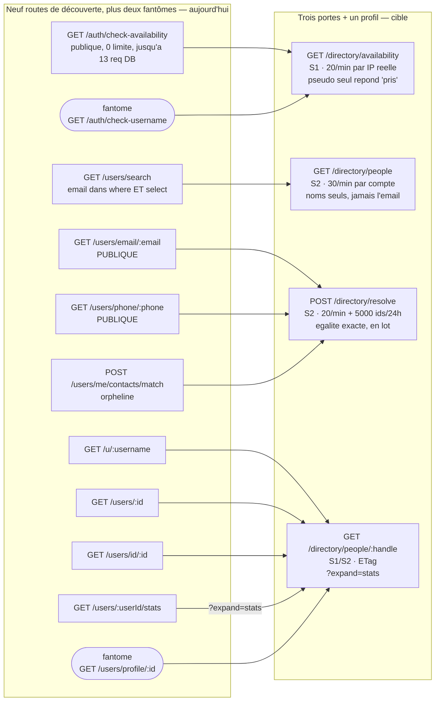

## Directory — trouver une personne

### Ce que la surface est aujourd'hui

Vingt-sept routes servent un seul besoin : **trouver quelqu'un, puis décider de la relation qu'on a avec lui**. Elles sont écrites dans neuf fichiers (`routes/auth/register.ts`, `routes/users/profile.ts`, `routes/users/preferences.ts`, `routes/users/devices.ts`, `routes/users/blocking.ts`, `routes/users/presence.ts`, `routes/users/contacts-directory.ts`, `routes/users/contacts-match.ts`, `routes/friends.ts`) et montées sur le même préfixe `/api/v1`, sans qu'aucun fichier ne connaisse les autres. Le résultat mesurable : **cinq routes lisent le même profil public sous trois formes de réponse différentes**, **deux familles complètes de demandes d'amitié coexistent** avec des gardes divergentes, et la porte que le porteur veut « à débit strict » (`/auth/check-availability`) n'a **aucun schéma de réponse, aucun `select`, et aucun limiteur de route** (à confirmer : est-elle la SEULE route publique du dépôt dans ce cas — le balayage n'a pas été fait sur l'ensemble des routes) — pendant qu'elle lance jusqu'à treize requêtes Prisma par appel (1 pseudo + jusqu'à 10 suggestions + 1 e-mail + 1 téléphone).

Fait structurant qui conditionne toute la cible : **le gateway tourne sans `trustProxy` derrière Traefik**, donc `request.ip` vaut l'IP du conteneur proxy pour tout le monde (`middleware/rate-limiter.ts:81`, `middleware/rate-limit.ts:118`). Le seau global `global:${request.ip}` 300/min est **un seau unique partagé par la plateforme entière** : il ne freine personne individuellement. Aucun débit « par IP » n'existe réellement dans ce module aujourd'hui, quoi qu'en disent les commentaires.

| Route | Niveau | Auth | Débit | Poids | Consommée par | Verdict |
|---|---|---|---|---|---|---|
| `GET /auth/check-availability` | S1 (voulu) | aucune | **aucun** (seau plateforme) | léger, **jusqu'à 13 requêtes DB** | iOS (3 appels/écran) + web (7 sites) | fusionner vers `GET /directory/availability` |
| `GET /users/search` | S2 | JWT | aucun (100 lignes × 300/min) | moyen, COLLSCAN | iOS (12 sites : 9 via `UserService.searchUsers` + 3 appels directs `APIClient`) + web (3 sites) | fusionner vers `GET /directory/people` |
| `GET /users/email/:email` | **S0** | publique | aucun | moyen (`additionalProperties: true`) | **PERSONNE** (méthode SDK morte) | supprimer → `POST /directory/resolve` |
| `GET /users/phone/:phone` | **S0** | publique | aucun | moyen | iOS seul (`KeypadViewModel`) | supprimer → `POST /directory/resolve` |
| `GET /users/id/:id` | S0 | publique | aucun | moyen | iOS seul (`CallView`) | fusionner vers `GET /directory/people/:handle` |
| `GET /users/:id` | S0 | publique | aucun | moyen | iOS (2 hôtes : `StoryViewModel`, `UserProfileViewModel`) + web (2 sites) | fusionner vers `GET /directory/people/:handle` |
| `GET /u/:username` | S0 | publique | aucun | léger | **PERSONNE** (méthode SDK morte) | fusionner vers `GET /directory/people/:handle` |
| `GET /users/:userId/stats` | S2 | JWT | aucun | **lourd** (9 agrégations) | iOS (3 hôtes) + web | fusionner vers `?expand=stats` |
| `POST /users/me/contacts/match` | S2 | JWT | aucun (2 000 fiches) | lourd | **PERSONNE** (chemin iOS mort) | fusionner vers `POST /directory/resolve` |
| `POST /users/me/contacts/sync` | S3 | JWT | aucun (2 000 fiches) | lourd | iOS seul | garder → `PUT\|PATCH /directory/contacts` |
| `GET /users/me/contacts` | S3 | JWT | aucun | moyen, `limit` non plafonné **par la route** mais borné à 200 par `ContactDirectoryService.list` (`MAX_PAGE_SIZE`) | iOS + web | garder → `GET /directory/contacts` |
| `DELETE /users/me/contacts` | S3 | JWT | aucun | léger | iOS seul | garder → `DELETE /directory/contacts` |
| `GET /friend-requests/received` | S3 | JWT | aucun | léger | iOS + web | fusionner vers `GET /directory/friend-requests` |
| `GET /friend-requests/sent` | S3 | JWT | aucun | léger | iOS + web | fusionner (idem) |
| `GET /users/friend-requests` | S3 | JWT | aucun | moyen | iOS + web | fusionner (idem) |
| `POST /friend-requests` | S2 | JWT | aucun | léger, **`findUnique` sans `select`** | iOS (SDK + outbox) + web (5 sites dans 4 fichiers) | fusionner vers `POST /directory/friend-requests` |
| `POST /users/friend-requests` | S2 | JWT | aucun | léger | **PERSONNE** | supprimer (garde à récupérer) |
| `PATCH /friend-requests/:id` | S3 | JWT | aucun | moyen (≤ 8 requêtes) | iOS (7 sites : 6 appels `FriendService.respond` + le rejeu outbox) + web | fusionner vers `PATCH /directory/friend-requests/:id` |
| `PATCH /users/friend-requests/:id` | S3 | JWT | aucun | moyen | **PERSONNE** | supprimer (garde à récupérer) |
| `DELETE /friend-requests/:id` | S3 | JWT | aucun | léger | iOS (4 sites) + web | fusionner (`action=dismiss\|cancel`) |
| `POST /users/:userId/block` | S3 | JWT | aucun | léger | iOS (3 chemins) + web | remplacer par `PUT /directory/blocks/:userId` |
| `DELETE /users/:userId/block` | S3 | JWT | aucun | léger | iOS + web | garder → `DELETE /directory/blocks/:userId` |
| `GET /users/me/blocked-users` | S3 | JWT | aucun | léger, **non paginé** | iOS (2 chemins) + web | garder → `GET /directory/blocks` |
| `GET /users/presence` | S2 | JWT | 200 ids/req | moyen | web seul | garder → `GET /directory/presence` (trou fail-open à fermer) |
| `GET /users` | **S0** | **aucune** | aucun | **stub** : le handler (`devices.ts:693`) rend `{ message: 'Get all users - to be implemented' }` — aucune donnée ne sort ; seule la description Swagger promet « a paginated list of all users » | web (repli de `use-group-modal.ts:34`, qui reçoit donc une charge inutilisable) | **supprimer** |
| `PUT /users/:id` | **aucun** | **aucune** | aucun | stub | PERSONNE | **supprimer** |
| `DELETE /users/:id` | **aucun** | **aucune** | aucun | stub | PERSONNE | **supprimer** |

Trois **fantômes** appelés par le web s'ajoutent, qui rendent 404 en silence : `GET /auth/check-username` (`apps/web/components/settings/ProfileSettings.tsx:184`), `GET /users/profile/:id` (`apps/web/app/u/[id]/layout.tsx:33`) et `GET /friend-requests` sans suffixe (`apps/web/hooks/use-contacts-data.ts:96` **et** `apps/web/app/search/SearchPageContent.tsx:105` — deux appelants, pas un —, dont le `if (response.ok)` avale le 404 : la page contacts historique affiche une liste vide définitive).

### Ce qui ne va pas

**Doublons.**
- Cinq routes, **une seule lecture**. `services/gateway/src/routes/users/profile.ts:1097`, `:1146` et `:1201` sont le **même handler à la clause `where` près** : même `publicUserSelect` (`:1062`), même `buildPublicProfile` (`:1084`), même `gateProfilePresence`. `:878` (`/users/:id`) recopie le `select` **à la main** au lieu d'utiliser `publicUserSelect`, et `:782` (`/u/:username`) en sert une projection plus courte. Trois formes de réponse pour une ligne de base.
- **Deux familles de demandes d'amitié** montées sur le même préfixe (`route-registration.ts:266` pour `routes/users`, `:324` pour `routes/friends`), et le partage du trafic est inversé : les clients appellent en production les handlers **les plus faibles**. `POST /api/v1/friend-requests` (`routes/friends.ts:31`) n'a **ni garde d'auto-envoi, ni contrôle de blocage, ni contrôle de désactivation** ; son jumeau `POST /api/v1/users/friend-requests` (`routes/users/devices.ts:257`) a au moins la garde d'auto-envoi — et **personne ne l'appelle**.
- Huit sites clients pour une question. `/auth/check-availability` est appelé depuis six sites répartis dans quatre hooks web (`use-registration-validation` ×3, `use-field-validation`, `use-link-validation`, `use-phone-validation`) plus `user-settings.tsx:560` — sept appels réels —, et un huitième site (`ProfileSettings.tsx:184`) vise une URL qui n'existe pas. Côté iOS, l'endpoint accepte les trois critères en une requête et `RegistrationViewModel` en fait **trois** (`RegistrationViewModel.swift:368`, `:391`, `:416` → `AuthService.swift:192`).

**Sécurité.**
- `GET /users/search` (`routes/users/preferences.ts:516`) met **`email: true` dans le `select`** (`:648`), le déclare au schéma (`:545`) et le met **aussi dans le `OR` du `where`** (`:615`). Tout compte authentifié peut chercher `gmail.com` et moissonner 100 adresses par page, 300 pages par minute. C'est une fuite de PII **et** un oracle d'énumération d'adresses.
- `GET /users/email/:email` et `GET /users/phone/:phone` sont **publiques** : elles confirment sans compte qu'une adresse ou un numéro appartient à un utilisateur Meeshy, et rendent son profil. Elles font ce que `POST /users/me/contacts/match` fait **avec** authentification, filtrage du blocage et gate de présence — les deux jumelles publiques n'ont **aucune** de ces protections.
- `GET /auth/check-availability` (`routes/auth/register.ts:242`) est un oracle sur les **trois** identifiants, sans limiteur, alors que `/forgot-password` et `/magic-link/request` répondent délibérément « succès » dans tous les cas pour ne rien révéler. La même plateforme applique deux doctrines opposées à la même question.
- `additionalProperties: true` (`profile.ts:1115`, `:1164`, `:1219`) **désarme le sérialiseur** : `isActive`, `deactivatedAt`, `updatedAt` et les **trois langues du Prisme** partent à un appelant anonyme sans qu'aucune déclaration ne les autorise.
- `GET /users/:userId/stats` sert à **tout compte authentifié** les compteurs privés de n'importe qui — `friendRequestsReceived`, `totalMessages`, `totalConversations` — sans filtre d'amitié ni préférence de confidentialité.
- `GET /users` (`routes/users/devices.ts:693`), `PUT /users/:id` (`:719`), `DELETE /users/:id` (`:752`) : trois routes **sans aucune garde**, dont deux dont la description dit « Admin-only ». **Les trois sont des stubs** : chaque handler rend `{ message: '… - to be implemented' }` et ne lit ni n'écrit rien — aucune fuite aujourd'hui. Elles occupent les verbes et **le contrat annonce une restriction que le code n'applique pas**, prête à devenir une vraie fuite le jour où quelqu'un les implémente.
- `GET /users/presence` (`routes/users/presence.ts:21`) a une branche **fail-open** : un id absent de la carte de visibilité retombe sur la présence runtime brute au lieu d'être masqué. `presenceFor` / `presenceMissingEntryPolicy` ne sont pas importés dans ce fichier.
- **Aucun champ de découvrabilité n'existe** sur `User` (vérifié, `packages/shared/prisma/schema.prisma`). « Être joignable par e-mail » n'est pas un droit qu'on accorde : c'est un effet de bord du schéma.

**Bande passante.**
- Zéro `?fields=`, zéro `?expand=`, **zéro ETag** dans tout le module. Un profil public — la charge la plus cacheable du dépôt — repart entière à chaque ouverture.
- Un écran profil coûte **deux allers-retours systématiques** (`/users/:id` puis `/users/:userId/stats`), et jusqu'à trois selon l'hôte iOS.
- `GET /users/me/contacts` ne plafonne pas `limit` **dans la route** — c'est `ContactDirectoryService.list` (`:305`) qui le borne à 200 (`MAX_PAGE_SIZE`) —, et `listAll` (iOS) pagine par 200 jusqu'à 250 pages (`DirectoryPaging.maxPages`) : le répertoire **entier** est retéléchargé à chaque revalidation, sans delta ni ETag. Une synchronisation est de plus **toujours** suivie d'une relecture complète.
- `GET /users/me/blocked-users` n'est pas paginé du tout.
- Le repli de `use-group-modal.ts:34` sur `GET /users` n'affiche **jamais personne** : la route est un stub qui rend `data = { message: 'Get all users - to be implemented' }`, un objet et non un tableau, si bien que le `.filter(...)` du hook lève et tombe dans le `catch` (« Error loading users »). Ce n'est pas un problème de bande passante mais une modale cassée dès que le champ de recherche fait moins de deux caractères.
- La pagination du module est en `offset`, qui repaie un `count()` à chaque page (`preferences.ts:661`), et `/users/search` déclare `returned` (jamais produit) sans déclarer `hasMore` (produit) : **le client ne peut pas savoir s'il reste une page**.

**Index — le défaut le plus coûteux, et le moins visible.**
- `User` ne porte **aucun index** sur `firstName`, `lastName`, `displayName` ni `phoneNumber` (seuls `username` et `email` sont `@unique`). `/users/search` fait un `contains` **non ancré, insensible à la casse, sur cinq colonnes** : c'est un **balayage complet de la collection à chaque frappe**. La route publique `/users/phone/:phone` balaie elle aussi la collection entière — sans authentification.
- `FriendRequest` ne porte **aucun index du tout** — ni `senderId`, ni `receiverId`, ni `status`. Les trois routes de listing des demandes d'amitié (`/friend-requests/received`, `/friend-requests/sent`, `/users/friend-requests`), appelées à chaque ouverture d'écran contacts sur les deux clients, sont des balayages complets.

**Contrat.**
- `PATCH /friend-requests/:id` greffe `conversation` à la main sur l'objet rendu (`routes/friends.ts`), mais la clé n'est pas déclarée dans `friendRequestSchema` : **`fast-json-stringify` la supprime**. Le client accepte une demande, ne reçoit jamais la conversation créée, et doit refetcher.
- `PATCH /users/me/username` calcule `nextChangeAllowedAt`, le déclare au schéma 429 et **ne l'envoie jamais** : l'utilisateur ne peut pas savoir quand il pourra réessayer.
- Le web lit `data.data.accountInfo` (`use-registration-validation.ts:94`) — un champ que **le gateway n'émet nulle part** (`grep` vide). L'aperçu de compte masqué est une branche morte depuis toujours.

### La surface cible

Module `directory`, cinq groupes de routes : `directory/…` (les trois portes de racine — `availability`, `resolve`, `presence`), `directory/people` (profils), `directory/contacts`, `directory/friend-requests` et `directory/blocks`.

| Route cible | Remplace | Niveau | Débit (seuil + clé) | Paramètres | Gain |
|---|---|---|---|---|---|
| `GET /directory/availability` | `check-availability`, fantôme `check-username` | **S1** | `dir:avail:ip:{ipRéelle}` **20/min** · `dir:avail:sess:{regSession}` **60/session** · `dir:avail:all` **1 200/min** (coupe-circuit) | `username`, `email`, `phoneNumber`, `country` | 3 appels → 1 ; **13 requêtes DB → 2** ; l'oracle e-mail/téléphone disparaît |
| `GET /directory/people` | `users/search`, repli `GET /users` | **S2** | `dir:people:u:{userId}` **30/min** + budget `dir:people:rows:u:{userId}` **2 000 lignes/24 h** | `q`, `fields`, `expand`, `cursor`, `limit` | l'e-mail sort du `where` **et** du `select` ; index anticipé au lieu du COLLSCAN |
| `POST /directory/resolve` | `users/email/:email`, `users/phone/:phone`, `contacts/match` | **S2** | `dir:resolve:u:{userId}` **20/min** + budget `dir:resolve:ids:u:{userId}` **5 000 identifiants/24 h** | corps : `identifiers[]`, `defaultCountry`, `fields` | deux oracles publics fermés ; N appels → 1 ; blocage filtré **dans** la requête |
| `GET /directory/people/:handle` | `/u/:username`, `/users/:id`, `/users/id/:id`, `/users/:userId/stats`, fantôme `/users/profile/:id` | **S1** anonyme / **S2** connecté | `dir:profile:ip:{ipRéelle}` **60/min** (anonyme) · `dir:profile:u:{userId}` **240/min** | `fields`, `expand=stats,presence,relation`, `If-None-Match` | 5 routes → 1 ; 2 allers-retours → 1 ; **ETag ⇒ 304** |
| `GET /directory/contacts` | `GET /users/me/contacts` | S3 | `dir:contacts:u:{userId}` **60/min** | `filter`, `q`, `cursor`, `limit≤100`, `updatedSince`, `If-None-Match` | delta au lieu du répertoire entier |
| `PUT\|PATCH /directory/contacts` | `POST /users/me/contacts/sync` | S3 | `dir:contacts:write:u:{userId}` **10/min** | corps : `contacts[]≤2000`, `defaultCountry`, `syncStartedAt`, `isFinalBatch` | `PUT` = remplacer, `PATCH` = fusionner : le mode devient le **verbe** |
| `DELETE /directory/contacts` | idem | S3 | `dir:contacts:write:u:{userId}` | — | inchangé (+ `clientMutationId`) |
| `GET /directory/friend-requests` | `/friend-requests/received`, `/sent`, `/users/friend-requests`, fantôme `GET /friend-requests` | S3 | `dir:fr:u:{userId}` **60/min** | `direction=received\|sent\|any`, `status`, `q`, `cursor`, `limit≤100`, `If-None-Match` | 3 routes + 1 fantôme → 1 ; `?q=` supprime la boucle de pagination du web |
| `POST /directory/friend-requests` | les **deux** `POST` | S2 | `dir:fr:send:u:{userId}` **20/min** + budget **100/24 h** | corps : `receiverId`, `message`, `clientMutationId` | union des gardes + **contrôle de blocage** (absent des deux) ; anti-spam d'e-mails |
| `PATCH /directory/friend-requests/:id` | les deux `PATCH` + le `DELETE` | S3 | `dir:fr:act:u:{userId}` **60/min** | corps : `action=accept\|reject\|cancel\|dismiss`, `clientMutationId` | un geste, un verbe ; `conversation` enfin **déclarée** donc servie |
| `GET /directory/blocks` | `GET /users/me/blocked-users` | S3 | `dir:blocks:u:{userId}` **60/min** | `cursor`, `limit≤100`, `If-None-Match` | liste bornée + 304 |
| `PUT /directory/blocks/:userId` | `POST /users/:userId/block` | S3 | `dir:blocks:write:u:{userId}` **30/min** | `clientMutationId` | idempotent par nature (appartenance à un ensemble) |
| `DELETE /directory/blocks/:userId` | `DELETE /users/:userId/block` | S3 | idem | `clientMutationId` | inchangé |
| `GET /directory/presence` | `GET /users/presence` | S2 | `dir:presence:u:{userId}` **120/min**, 200 ids | `ids` | branche **fail-open fermée** (`presenceFor` + `presenceMissingEntryPolicy`) |

Supprimées sans remplacement : `GET /users`, `PUT /users/:id`, `DELETE /users/:id`.

**Vingt-sept routes deviennent quatorze.**

#### La clé des limiteurs, avant les seuils

Aucun seuil « par IP » n'a de sens tant que la clé est `request.ip`. Toutes les clés `…:ip:{ipRéelle}` ci-dessus s'appuient sur **`extractIpFromRequest(request)`** (`services/gateway/src/services/GeoIPService.ts:64`), qui lit déjà `cf-connecting-ip` → `x-real-ip` → premier saut de `x-forwarded-for` → `request.ip`. Un helper unique `clientRateKey(request)` doit être extrait à côté de `createRateLimitConfig`, et **tout limiteur du module l'utilise** ; les clés authentifiées restent sur `authContext.userId`, qui est déjà le bon identifiant. Sans cette étape, le reste de la section est décoratif.

#### `GET /directory/availability` — S1

```
GET /api/v1/directory/availability?username=jcharles&email=a@b.c&phoneNumber=0612345678&country=FR
X-Registration-Session: <opaque, émis au premier chargement du formulaire>
```

```json
{ "success": true,
  "data": {
    "username":    { "status": "taken", "suggestions": ["jcharles12", "jcharles7", "jcharles2026"] },
    "email":       { "status": "valid" },
    "phoneNumber": { "status": "valid", "e164": "+33612345678" }
  } }
```

Trois décisions, dans l'ordre d'importance.

1. **Seul le pseudo répond à la question de l'existence.** Un pseudo est une clé publique : il s'affiche sur chaque profil, il est déjà énumérable par `/u/:username`. `status ∈ available | taken`.
2. **L'e-mail et le téléphone ne répondent QUE sur la forme** — `valid | invalid`, jamais `taken`. L'existence d'un compte derrière une adresse cesse d'être une question à laquelle l'API répond, exactement comme `/forgot-password` et `/magic-link/request` le font déjà. Le coût est nommé : le formulaire d'inscription ne peut plus dire « vous avez déjà un compte » avant la soumission — c'est la soumission qui le dit, avec la même réponse générique. **Coût réel nul côté web** : la branche `accountInfo` qui affichait cet avertissement lit un champ que le gateway n'a jamais émis.
3. **Une requête, pas treize.** L'existence se teste par `findFirst({ where, select: { id: true } })` — aujourd'hui les quatre `findFirst` de la route sont **sans `select`** et chargent la ligne `User` entière en mémoire, hash de mot de passe (`password`) et secrets 2FA (`twoFactorSecret`, `twoFactorBackupCodes`) compris. Les suggestions passent d'une boucle de dix requêtes aléatoires à **un** `findMany({ where: { username: { in: sixCandidatsDéterministes } }, select: { username: true } })`.

Un schéma de réponse est déclaré (il n'y en a aucun aujourd'hui), sans `additionalProperties`.

#### `GET /directory/people` — S2 (recherche floue, **sur les noms seulement**)

```
GET /api/v1/directory/people?q=jean&limit=20&cursor=…&fields=id,username,displayName,avatar&expand=relation
```

```json
{ "success": true,
  "data": [ { "id": "…", "username": "jeanc", "displayName": "Jean C.", "avatar": "https://…",
              "relation": { "friendship": "pending_sent", "blocked": false } } ],
  "pagination": { "cursor": "…", "hasMore": true } }
```

- Le `OR` porte sur `username`, `displayName`, `firstName`, `lastName`. **`email` sort du `where` et du `select`** : c'est l'unique correctif qui ferme la moisson de PII, et il ne coûte aucun usage réel (le modèle iOS `UserSearchResult` ne décode pas `email`, le web ne l'affiche nulle part).
- Projection par défaut de **quatre champs**. `isOnline` / `lastActiveAt` ne partent que sur `?expand=presence`, et toujours via `resolveForTargets` + `applyPresenceVisibilityAsOffline` — la loi de présence du 2026-08-25 est **conservée telle quelle**, y compris `mayOrderByRawPresence` et `servedOnlineFirst`, mais l'ordre stable s'applique désormais **avant** la découpe de page, pas après.
- Curseur, plus d'`offset` : le `count()` disparaît, et `hasMore` est **déclaré** au schéma (il ne l'est pas aujourd'hui, donc il est supprimé à la sérialisation).
- Le budget de lignes (`2 000/24 h`) est ce qui distingue une recherche d'une moisson. Un usage nominal — une centaine de recherches par jour à 20 résultats — passe largement dessous.

#### `POST /directory/resolve` — S2 (résolution exacte, en lot)

```json
{ "identifiers": [ { "kind": "email",    "value": "a@b.c" },
                   { "kind": "phone",    "value": "0612345678" },
                   { "kind": "username", "value": "jeanc" } ],
  "defaultCountry": "FR",
  "fields": "id,username,displayName,avatar" }
```

```json
{ "success": true,
  "data": { "matches": [ { "kind": "email", "value": "a@b.c",
                           "user": { "id": "…", "username": "jeanc", "displayName": "Jean C.", "avatar": "https://…" } } ],
            "submitted": 3, "processed": 3, "truncated": false } }
```

- **Égalité exacte sur valeur normalisée, jamais `contains`.** C'est la différence entre « joindre quelqu'un dont je connais l'adresse » et « moissonner un domaine ».
- La réponse ne renvoie **que les correspondances**. Elle n'échoue jamais explicitement sur un identifiant : le client déduit l'absence, et n'apprend rien qu'il ne savait pas — il a fourni la valeur.
- **Un droit de découvrabilité, à créer.** `User.discoverableBy String[] @default(["username","phone"])`. `resolve` n'apparie sur `email` que si la cible l'a autorisé. Aujourd'hui ce champ n'existe pas et « être joignable par e-mail » est subi. C'est la seule addition de schéma que la cible exige, et c'est une **décision produit** (valeur par défaut) à trancher par le porteur.
- Le blocage est filtré **dans** la requête (`NOT: { blockedUserIds: { has: viewerId } }` + la liste de l'appelant), pas après — les deux jumelles publiques actuelles ne le filtrent pas du tout.
- Plafond de 2 000 identifiants par appel, avec la tolérance déjà écrite dans `contacts-directory.ts` : un lot tronqué ne peut jamais être final.

#### `GET /directory/people/:handle` — S1 anonyme / S2 connecté

`handle` = ObjectId **ou** pseudo, détecté par `isValidObjectId` — c'est déjà le comportement de `/users/:id`, donc les cinq routes convergent sans nouvelle sémantique.

```
GET /api/v1/directory/people/jeanc?expand=stats,relation
If-None-Match: "u-3f2a…"
```

Projection par défaut (anonyme) = celle, plus courte, de `/u/:username` : `id, username, firstName, lastName, displayName, avatar, banner, bio, role, createdAt, voicePublic, voiceSample*`. **Ce qui disparaît de la surface publique** : `systemLanguage`, `regionalLanguage`, `customDestinationLanguage` (les trois langues du Prisme), `isActive`, `deactivatedAt`, `updatedAt` — servis aujourd'hui à un anonyme par `additionalProperties: true` sur les trois routes dédiées (`/users/email/:email`, `/users/id/:id`, `/users/phone/:phone`) et, sur `/users/:id`, par un schéma qui les DÉCLARE explicitement (`profile.ts:914-921`). `autoTranslateEnabled: true` en dur disparaît aussi : un champ de contrat qui ne dit rien de vrai.

`?expand=stats` remplace le second aller-retour, **et resserre la garde** : les compteurs publics (`postsCount`, `reelsCount`, `storiesCount`, `memberDays`, `achievements`) partent à tous ; les compteurs privés (`totalMessages`, `totalConversations`, `totalTranslations`, `friendRequestsReceived`) **seulement à soi et à S5**. Aujourd'hui tout compte authentifié lit les quatre sur n'importe qui.

ETag calculé sur `updatedAt` + le vecteur `fields/expand`, `Cache-Control: public, max-age=60, stale-while-revalidate=600` pour l'anonyme, `private` pour le connecté. C'est la charge la plus relue de l'application : le 304 y vaut plus que partout ailleurs.

**Ce qui n'est JAMAIS servi par ce module**, quelle que soit la route et quel que soit `?fields=` :
l'**e-mail en clair** de quelqu'un d'autre que soi · le **numéro de téléphone** de quelqu'un d'autre que soi · la **présence hors amitié acceptée** (soi, ami accepté, ADMIN/BIGBOSS — inchangé) · les **langues du Prisme** à un anonyme · `isActive` / `deactivatedAt` / `updatedAt` · les **compteurs privés** de statistiques · le fait qu'une adresse e-mail ou un numéro corresponde à un compte, à un appelant non authentifié.

#### Stratégie d'index Mongo

Trois ajouts, dans l'ordre du gain.

1. **`User.searchTokens String[]`, multikey, `@@index([isActive, searchTokens])`.** Champ dérivé, recalculé à chaque écriture de `username` / `displayName` / `firstName` / `lastName` : les jetons repliés (minuscules, sans diacritiques). La recherche devient une **regex ancrée** `^jean` sur un tableau multikey — que Mongo sert par parcours d'index — au lieu du `contains` non ancré sur cinq colonnes, que rien ne peut servir autrement qu'en balayant la collection. L'égalité sur `isActive` en tête du composé permet d'éliminer les comptes inactifs sans lecture de document.
   Compromis assumé : on perd la sous-chaîne au milieu d'un mot (`ean` ne trouve plus `jean`). C'est le prix d'un index, et c'est le comportement de toutes les recherches d'annuaire du marché. Si la sous-chaîne est jugée indispensable, l'alternative est **Atlas Search** (index `autocomplete`), qui est le vrai horizon de cette route — mais elle change d'infrastructure, pas seulement de schéma.
2. **`@@index([phoneNumber])`.** Absent aujourd'hui. La route publique `/users/phone/:phone` balaie donc la collection entière **sans authentification** : c'est un index manquant qui est aussi une surface de déni de service. Requis par `POST /directory/resolve`.
3. **`FriendRequest` : `@@index([receiverId, status, createdAt])`, `@@index([senderId, status, createdAt])`.** Le modèle ne porte **aucun index**. Les trois listings de demandes d'amitié — appelés à chaque ouverture de l'écran contacts sur iOS **et** sur le web — sont des balayages complets. Les deux composés servent le `direction=` du listing fusionné, le tri et le curseur.

Deux ajouts de confort : `@@index([ownerId, updatedAt])` sur `UserContact` (pour `updatedSince`), et rien sur `email` — la cible n'y fait plus que de l'égalité, que `@unique` sert déjà.

### Diagramme



### Migration

**Ce qui casse pour iOS.** Neuf sites appellent `UserService.searchUsers`, **plus trois qui frappent `/users/search` en direct via `APIClient`** (`NewConversationViewModel.swift:137`, `AddParticipantSheet.swift:311`, `ConversationPreferencesTab.swift:497`) — douze au total : le chemin change, la projection perd `email` (jamais décodé par `UserSearchResult` — aucune régression) et la pagination passe au curseur, ce qui touche `api.offsetPaginatedRequest`. `KeypadViewModel.lookupByPhone` (`KeypadViewModel.swift:127` → `UserService.swift:157`) doit passer de `GET /users/phone/{digits}` à `POST /directory/resolve` — c'est le seul consommateur réel des deux lookups publics, et le changement est local. `CallView.swift:509` passe de `getProfileById` à `getProfile(handle:)`, ce qui **règle au passage** l'absence de cache signalée à ce site ; deux tests de source (`FloatingCallPillViewTests:370` et `:673`) épinglent littéralement la chaîne `UserService.shared.getProfileById` et doivent être mis à jour. `RegistrationViewModel` passe de trois appels à un. Les sept sites `PATCH /friend-requests/:id` et quatre sites `DELETE /friend-requests/:id` convergent sur `PATCH … {action}` — y compris `OutboxDispatcher.swift:185/:204`, dont le rejeu hors ligne doit basculer dans le **même** lot que le chemin en ligne. (Il n'existe **qu'une** implémentation de `BlockService` — `packages/MeeshySDK/Sources/MeeshySDK/Services/BlockService.swift` ; la dualité réelle à tenir alignée est celle du chemin en ligne `BlockService` et de son rejeu hors ligne `OutboxDispatcher.swift:138/:166`.) **Se suppriment sans remplacement** : `getPublicProfile`, `getProfileByEmail`, `search(query:)` (le jumeau cassé qui jette son `query`) et tout `ContactMatchService` — aucun appelant de production, seulement des mocks et des tests qui passent au vert en ne testant rien.

**Ce qui casse pour le web.** Les sept sites `check-availability` (six dans quatre hooks + `user-settings.tsx:560`) convergent sur `use-field-validation` (déjà la version générique, déjà la seule à traiter le 429) ; `ProfileSettings.tsx:184` et `app/u/[id]/layout.tsx:33` cessent d'appeler des routes inexistantes — deux pannes silencieuses réparées par la migration elle-même. `use-contacts-data.ts:96` idem. Les trois familles de demandes d'amitié (`use-contacts-actions`, `hooks/v2/use-friend-requests-v2`, `SearchPageContent`, `UserProfileContent` ×2 — **cinq** appels `POST` répartis dans **quatre** fichiers) convergent, et la boucle de pagination de `use-friend-requests-v2.ts:126` (elle tourne jusqu'à `hasMore === false`, bornée par `ACCEPTED_FETCH_CAP`) disparaît grâce au `?q=` serveur. Le repli `GET /users` de `use-group-modal.ts:34` est **supprimé sans remplacement** : la route est un stub, ce repli n'a jamais rien affiché. `groups.service.ts:136` et `lib/server-cache.ts` sont morts et partent avec.

**Ce qui casse pour Android.** Les fragments de cet audit ne couvrent pas Android. Avant l'étape 3, la surface `search / friend-requests / contacts / block` d'`apps/android` doit être inventoriée avec la même méthode — le cycle 118 a déjà montré qu'Android manquait des champs que les deux autres clients avaient. **Ne pas retirer un alias avant cet inventaire.**

**Ordre des étapes.**

1. **Correctifs sans changement de contrat** (livrables seuls, tout de suite, aucun client à toucher) : extraire `clientRateKey(request)` sur `extractIpFromRequest` ; poser le limiteur S1 sur `check-availability` et remplacer sa boucle de dix requêtes par une seule ; ajouter `select: { id: true }` aux quatre `findFirst` de `check-availability` qui chargent la ligne `User` entière ; **retirer `email` du `select` et du `where` de `/users/search`** ; remplacer les trois `additionalProperties: true` par des schémas déclarés ; fermer la branche fail-open de `/users/presence` ; **supprimer `GET /users`, `PUT /users/:id`, `DELETE /users/:id`**.
2. **Index** (invisible, mesurable) : `phoneNumber`, les deux composés de `FriendRequest`, puis `searchTokens` avec son remplissage rétroactif. À faire **avant** d'ouvrir les nouvelles routes, pour que la mesure d'après compare des routes indexées.
3. **Double montage** : les quatorze routes `/directory/*` sont montées à côté des vingt-sept anciennes, qui gagnent un `Deprecation` et un `Sunset` (RFC 8594) plus un `Link: rel="successor-version"`. Aucune ancienne route ne change de comportement à cette étape, sauf celles corrigées à l'étape 1.
4. **Bascule des clients**, dans cet ordre : web (le plus de doublons, le plus de fantômes, le moins de délai de diffusion) → iOS → Android. Chaque client bascule *toutes* ses routes du module en un lot ; une bascule partielle laisserait deux familles de demandes d'amitié vivantes chez le même client, ce qui est exactement l'état qu'on quitte.
5. **Retrait**, seulement quand la télémétrie de chaque ancienne route est à zéro pendant une fenêtre couvrant la queue de version iOS installée.

**Ce qui doit rester en alias, et pour combien de temps.**

| Ancienne route | Alias | Durée | Raison |
|---|---|---|---|
| `GET /users/:id`, `GET /users/id/:id`, `GET /u/:username` | redirection interne vers `/directory/people/:handle` | jusqu'à extinction des versions iOS installées | trois consommateurs de production, dont un profil ouvert depuis des liens partagés |
| `GET /users/search` | proxy vers `/directory/people`, **sans `email`** | idem | douze sites iOS (9 via `UserService.searchUsers`, 3 en direct) |
| `GET /friend-requests/received`, `/sent`, `GET /users/friend-requests` | proxy vers `/directory/friend-requests?direction=&status=` | idem | quatre consommateurs, dont le drain complet de `FriendshipCache` |
| `POST` / `PATCH` / `DELETE /friend-requests*` | proxy vers les deux routes cibles | idem | l'outbox iOS rejoue des mutations **enregistrées avant la mise à jour** : l'alias doit survivre à la file, pas seulement à l'app |
| `GET /users/phone/:phone` | **aucun** | — | retirée dès l'étape 1 côté public ; un seul appelant, migré dans le même lot |
| `GET /users/email/:email`, `POST /contacts/match` | **aucun** | — | zéro appelant de production |
| `GET /auth/check-availability` | proxy vers `/directory/availability`, réponse **rétro-compatible** (`usernameAvailable`, `suggestions`) mais `emailAvailable` / `phoneNumberAvailable` **remplacés par `phoneNumberValid`-like** | fenêtre courte, annoncée | c'est la seule bascule qui change une **réponse** et pas seulement une adresse : elle doit être annoncée au porteur comme un changement de produit, pas comme une migration technique |
