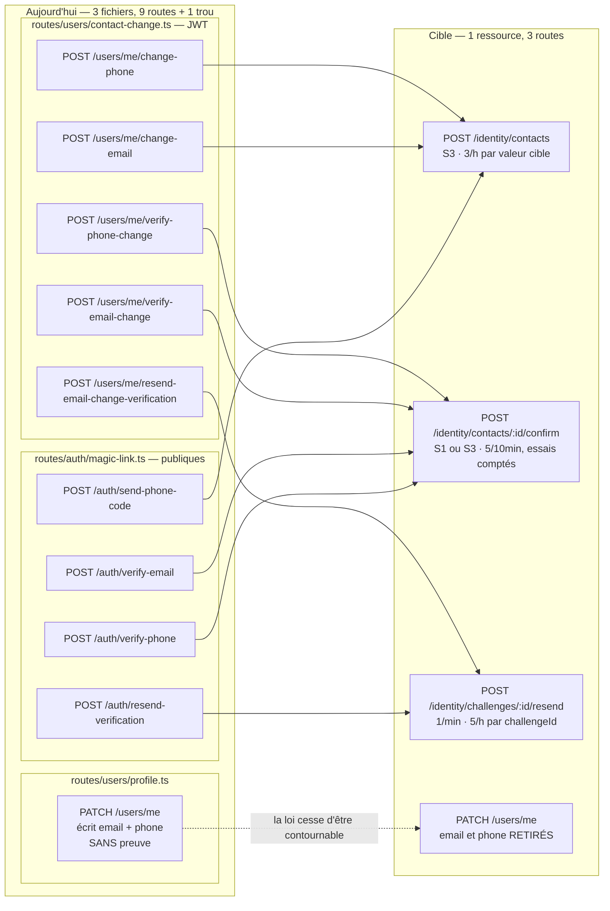

# Identity — connexion, sessions, second facteur, mot de passe, téléphone

## Ce que la surface est aujourd'hui

Quarante-huit routes portent l'identité, réparties sur sept fichiers qui ne se connaissent pas :
`routes/auth/*` (connexion, inscription, sessions, transfert de numéro), `routes/two-factor.ts`,
`routes/magic-link.ts`, `routes/password-reset.ts`, `routes/users/profile.ts` (mot de passe, pseudo),
`routes/users/contact-change.ts` (changement d'e-mail et de numéro) et `routes/me/index.ts`. Le
découpage ne suit pas les
ressources mais l'histoire du produit : **prouver qu'un contact m'appartient** s'écrit dans trois
fichiers différents et par neuf routes, **ouvrir une session** par quatre, **revendiquer un numéro déjà
détenu** par six. Aucune route du module ne porte d'ETag, aucune n'accepte `?fields=`, et sur les
quarante-huit, **une seule limitation de débit est réellement active** — celle du renvoi d'e-mail de
`contact-change.ts`, parce qu'elle est applicative (Redis) et non fondée sur `request.ip`.

Le fait qui gouverne tout le reste : `services/gateway/src/server.ts:196` et `:215` construisent
Fastify **sans `trustProxy`**. Derrière Traefik, `request.ip` vaut donc une adresse `172.16–31.x` pour
tout le monde, et `RateLimiter.middleware()` (`utils/rate-limiter.ts:223`) commence par
`if (isLocalIp(request.ip)) return;`. **Les douze limiteurs déclarés par le module (vingt et une poses
de garde) sont inertes en production.**

| Route | Niveau réel | Auth | Débit | Poids | Consommée par | Verdict |
|---|---|---|---|---|---|---|
| `POST /auth/login` | S1 | aucune | 5/15min + 20/min — **inertes** | medium (31 champs de `userSchema`) | iOS + web | fusionner → `POST /identity/sessions` |
| `POST /auth/login/2fa` | S1 | jeton temporaire | **aucune** | medium | iOS | fusionner → `POST /identity/sessions` |
| `POST /auth/magic-link/validate` | S1 | jeton | **aucune** | medium | iOS + web | fusionner → `POST /identity/sessions` |
| `GET /auth/magic-link/validate` | S1 | jeton **en query** | **aucune** | medium | PERSONNE | supprimer (jumelle appauvrie) |
| `POST /auth/magic-link/request` | S1 | aucune | **aucune** | light | iOS + web | garder → `POST /identity/challenges` (magic link) |
| `POST /auth/logout` | S3 | JWT | aucune | light | iOS + web | fusionner → `DELETE /identity/sessions/current` |
| `GET /auth/sessions` | S3 | JWT | aucune | medium (non bornée) | iOS | garder → `GET /identity/sessions` |
| `DELETE /auth/sessions/:id` | S3 | JWT + appartenance | aucune | light | iOS | fusionner → `DELETE /identity/sessions/:target` |
| `DELETE /auth/sessions` | S3 | JWT | aucune | light | iOS | fusionner → `DELETE /identity/sessions/others` |
| `GET /auth/auth/revoke-all-sessions` | S1 | JWT signé en query | 5/min, seau **plateforme** | light (HTML) | PERSONNE (**404**) | corriger le chemin → `GET /identity/sessions/revoke-link` |
| `POST /auth/validate-session` | S1 | jeton de session | **aucune** | light | PERSONNE | **supprimer** (oracle pur) |
| `POST /auth/refresh` | S1 | JWT même **expiré** | **aucune** | medium | iOS + web | garder, durcir → `POST /identity/tokens/refresh` |
| `GET /auth/me` | S2 | JWT | aucune | light (**sous-fetch**) | iOS + web | fusionner → `GET /identity/me` |
| `GET /me/me` | S2 | JWT | aucune | light (6 champs) | PERSONNE | supprimer |
| `POST /auth/register` | S1 | aucune | 3/5min — inerte | medium | iOS + web | garder → `POST /identity/accounts` |
| `GET /auth/check-availability` | **S0** | aucune | **aucune** | light | iOS + web | fusionner → `GET /identity/availability` |
| `GET /auth/check-username` | — | — | — | — | web (**fantôme, 404**) | supprimer l'appelant |
| `GET /auth/2fa/status` | S3 | JWT | aucune | light | iOS + web | renommer → `GET /identity/mfa` |
| `POST /auth/2fa/setup` | S3 | JWT, **sans mot de passe** | **aucune** | medium (QR base64) | iOS + web | fusionner → `POST /identity/mfa/enrollment` |
| `POST /auth/2fa/enable` | S3 | JWT, sans mot de passe | **aucune** | light | iOS + web | renommer → `PUT /identity/mfa` |
| `POST /auth/2fa/disable` | S3 | JWT + mot de passe | **aucune** | light | iOS + web | renommer → `DELETE /identity/mfa` |
| `POST /auth/2fa/cancel` | S3 | JWT | aucune | light | web | renommer → `DELETE /identity/mfa/enrollment` |
| `POST /auth/2fa/verify` | S3 | JWT | **aucune** | light | iOS + web | renommer → `POST /identity/mfa/assertions` |
| `POST /auth/2fa/backup-codes` | S3 | JWT + code | **aucune** | light | iOS + web | garder → `POST /identity/mfa/backup-codes` |
| `PATCH /users/me/password` | S3 | JWT + mot de passe | **aucune** | light | iOS + web | fusionner → `PATCH /identity/password` |
| `POST /auth/reset-password` | S1 | jeton e-mail | **aucune** | light | iOS + web | fusionner → `PATCH /identity/password` |
| `POST /auth/forgot-password` | S1 | aucune | 3×— inertes | light (**servie vide**) | iOS + web | fusionner → `POST /identity/recovery` |
| `GET /auth/reset-password/verify-token` | S1 | jeton | **aucune** | **servie `{}`** | web | fusionner → `GET /identity/recovery/:id` |
| `POST /auth/forgot-password/phone/lookup` | S1 | aucune | 3/h — inerte | **servie vide** | iOS + web | fusionner → `POST /identity/recovery` |
| `POST /auth/forgot-password/phone/verify-identity` | S1 | tokenId | 3/15min — inerte | **servie vide** | iOS + web | garder → `POST /identity/recovery/:id/identity` |
| `POST /auth/forgot-password/phone/verify-code` | S1 | tokenId + code | 5/10min — inerte | **servie vide** | iOS + web | garder → `POST /identity/recovery/:id/code` |
| `POST /auth/forgot-password/phone/resend` | S1 | tokenId | 1/min — inerte | light | web | fusionner → `POST /identity/challenges/:id/resend` |
| `POST /auth/verify-email` | S1 | jeton ou code | **aucune** | light | iOS + web | fusionner → `POST /identity/contacts/:id/confirm` |
| `POST /auth/resend-verification` | S1 | aucune | **aucune** | light | iOS + web | fusionner → `POST /identity/challenges/:id/resend` |
| `POST /auth/send-phone-code` | S1 | aucune | **aucune** | light | web | fusionner → `POST /identity/contacts` |
| `POST /auth/verify-phone` | S1 | code SMS | **aucune** | light | web | fusionner → `POST /identity/contacts/:id/confirm` |
| `POST /users/me/change-email` | S3 | JWT | **aucune** | light | iOS + web | fusionner → `POST /identity/contacts` |
| `POST /users/me/verify-email-change` | S3 | JWT + jeton | **aucune** | light | iOS + web | fusionner → `POST /identity/contacts/:id/confirm` |
| `POST /users/me/resend-email-change-verification` | S3 | JWT | **60 s (seule active)** | light | iOS + web | fusionner → `POST /identity/challenges/:id/resend` |
| `POST /users/me/change-phone` | S3 | JWT | **aucune** | light | iOS + web | fusionner → `POST /identity/contacts` |
| `POST /users/me/verify-phone-change` | S3 | JWT + code | **aucune** | light | iOS + web | fusionner → `POST /identity/contacts/:id/confirm` |
| `PATCH /users/me/username` | S3 | JWT + mot de passe | 1 / 30 j (métier) | light | web | garder → `PATCH /identity/username` |
| `POST /auth/phone-transfer/check` | S1 | aucune | 3/h — inerte | light | iOS | fusionner → `GET /identity/availability` |
| `POST /auth/phone-transfer/initiate` | **S0** | **aucune** (`newUserId` du corps) | 3/h — inerte | light | web | fusionner → `POST /identity/phone-claims` |
| `POST /auth/phone-transfer/initiate-registration` | S1 | aucune | 3/h — inerte | light | web | fusionner → `POST /identity/phone-claims` |
| `POST /auth/phone-transfer/verify` | S1 | transferId + code | 5/10min — inerte | light | web | fusionner → `POST /identity/phone-claims/:id/confirm` |
| `POST /auth/phone-transfer/verify-registration` | S1 | transferId + code | 5/10min — inerte | light | web | fusionner → `POST /identity/phone-claims/:id/confirm` |
| `POST /auth/phone-transfer/resend` | S1 | transferId | 1/min — inerte | light | web | fusionner → `POST /identity/challenges/:id/resend` |
| `POST /auth/phone-transfer/cancel` | **S0** | **aucune, aucun limiteur** | aucune | light | web | fusionner → `DELETE /identity/phone-claims/:id` |

La colonne « Consommée par » inventorie iOS et le web. **Android en consomme seize** : son
`AuthApi.kt` (`apps/android/core/network/.../api/AuthApi.kt:107`–`:164`) déclare `login`, `register`,
`refresh`, `me`, `check-availability`, `forgot-password`, `magic-link/request`,
`magic-link/validate`, `sessions` (liste, `:id`, toutes), et cinq `2fa/*` (`status`, `setup`,
`enable`, `disable`, `backup-codes`). Aucune des quatre routes marquées PERSONNE n'y figure.

Cinq routes d'administration (`POST /admin/users/:userId/reset-password`, `enable-2fa`, `disable-2fa`,
`verify-email`, `verify-phone`) forcent la même loi depuis l'extérieur ; elles relèvent de la section
Administration, mais **elles doivent appeler les mêmes services que les routes ci-dessus**, ce qui
n'est aujourd'hui vrai pour **aucune** d'entre elles : les cinq passent par
`services/admin/user-management.service.ts`, qui réécrit la loi en direct sur Prisma —
`resetPassword` (`:330`) y hache à un coût bcrypt de 10 quand `PATCH /users/me/password` hache à 12,
et ne révoque aucune session.

## Ce qui ne va pas

### Sécurité

1. **Toutes les limitations de débit du module sont inertes.** `server.ts:196`/`:215` n'active pas
   `trustProxy` ; `utils/rate-limiter.ts:223` sort immédiatement sur `isLocalIp(request.ip)`, et
   `isLocalIp` (`:28`) couvre `172.16/12`, l'espace d'adressage des réseaux Docker. Le mot de passe de
   `POST /auth/login` n'est donc borné que par le seau global `global:${request.ip}` — **un seau unique
   de 300 requêtes/minute partagé par toute la plateforme**. C'est le défaut le plus grave du module :
   il annule douze protections écrites, testées et exactes par ailleurs.

2. **`PATCH /users/me` écrit `email` et `phoneNumber` en clair, sans aucune preuve.**
   `routes/users/profile.ts:143` et `:144` posent les deux champs directement, et `emailVerifiedAt` /
   `phoneVerifiedAt` **ne sont pas remis à zéro**. Toute la cérémonie de `contact-change.ts` — cinq
   routes, jetons SHA-256, codes SMS, expirations — est contournable par un seul PATCH, et le compte
   ressort avec un numéro arbitraire **marqué vérifié**. Or `phoneVerifiedAt != null` est précisément
   le critère par lequel `PhoneTransferService.initiateTransfer` (`services/PhoneTransferService.ts:201`)
   identifie « le titulaire actuel » d'un numéro. Un geste écrit deux fois, dont la moitié pauvre
   n'applique pas la loi.

3. **`POST /auth/phone-transfer/initiate` prend `newUserId` dans le corps** (`phone-transfer.ts:145`),
   sans JWT ni preuve de possession : n'importe qui déclenche un SMS vers le titulaire d'un numéro
   arbitraire, au profit d'un identifiant qu'il choisit. Et
   `POST /auth/phone-transfer/cancel` (`phone-transfer.ts:293`) est **la seule route du fichier sans
   aucun `preHandler`** : connaître un `transferId` suffit à annuler la récupération de compte d'un
   tiers — et son `catch` répond `success: true`, donc l'abus est invisible côté client.

4. **La révocation d'urgence est en 404.** `routes/auth/revoke-all-sessions.ts:17` déclare
   `'/auth/revoke-all-sessions'` sur une instance déjà préfixée `/api/v1/auth`
   (`route-registration.ts:190`) : le chemin monté est `/api/v1/auth/**auth**/revoke-all-sessions`.
   L'e-mail d'alerte de connexion suspecte pointe, lui, vers
   `${apiBase}/api/v1/auth/revoke-all-sessions` (`services/notifications/NotificationService.ts:4931`).
   Le lien « ce n'était pas moi » ne mène nulle part — et c'est **le seul site du module qui appelle
   `disconnectRevokedSessions`** (avec `POST /auth/reset-password`, `password-reset.ts:306`).
   Corollaire : `POST /auth/logout`, `DELETE /auth/sessions/:id` et `DELETE /auth/sessions` invalident
   des lignes en base et **laissent les sockets ouverts**. « Déconnecter cet appareil » ne déconnecte
   rien.

5. **`POST /auth/refresh` échange un JWT expiré contre un JWT frais, indéfiniment.** Aucune liste de
   révocation, aucun `sessionToken` exigé : ni le logout, ni la révocation de session, ni le
   changement de mot de passe n'empêchent le rejeu. Un JWT volé vaut à vie tant que le compte est actif.

6. **Une colonne pour deux protocoles.** `AuthService.ts:225` range le hash du `twoFactorToken` de
   connexion dans `User.phoneVerificationCode` — la colonne où `AuthService.ts:1026` écrit le code SMS
   de vérification de numéro. Pire, `completeAuthWith2FA` (`AuthService.ts:321`) cherche l'utilisateur
   par `phoneVerificationCode: tokenHash` **sans aucune contrainte d'identité** : la recherche est
   globale. Un code SMS à six chiffres écrit par un chemin devient un `twoFactorToken` valide pour
   l'autre, sur n'importe quel compte.

7. **Aucun compteur de tentatives sur les codes courts.** `POST /auth/login/2fa`, `POST /auth/2fa/verify`,
   `POST /auth/verify-phone`, `POST /users/me/verify-phone-change` et `POST /auth/verify-email`
   n'ont ni limiteur dédié, ni compteur. `POST /auth/2fa/verify` **consomme** un code de secours à
   chaque succès (`TwoFactorService.ts:352`) : on peut donc les épuiser. Seuls `PhoneTransferService`
   et `PhonePasswordResetService` comptent les essais sur un code court ; `PasswordResetService`
   compte des demandes et non des essais (verrou de compte à 10 demandes/24 h), et `AuthService`
   comme `TwoFactorService` ne comptent rien.

8. **Asymétrie du second facteur.** `POST /auth/2fa/disable` exige le mot de passe
   (`two-factor.ts:225`) ; `setup` et `enable` ne l'exigent pas. Un JWT volé permet donc d'**armer** un
   second facteur — c'est-à-dire de verrouiller le propriétaire hors de son compte — sans jamais
   connaître le mot de passe, alors que le retirer l'exige.

9. **`GET /auth/check-availability` est un oracle d'énumération sur trois identifiants**
   (`register.ts:242`), sans authentification, **sans schéma de réponse et sans aucun limiteur**. Il
   fait `findFirst` **sans `select`** — la ligne `User` entière (mot de passe, `twoFactorSecret`,
   codes de secours) est chargée en mémoire pour tester une présence — et sa boucle de suggestions
   lance **jusqu'à dix requêtes séquentielles supplémentaires** par appel. Une requête HTTP coûte donc
   jusqu'à onze requêtes base pour le seul `username` — treize si les trois critères sont testés
   ensemble.

### Contrat — quatre routes servent une réponse vide, mesurée

`sendSuccess` (`utils/response.ts:28`) place toujours la charge sous `data`. Quatre schémas de
`password-reset.ts` la déclarent **à la racine** ; `fast-json-stringify` supprime donc tout :

| Route | Ce qu'elle calcule | Ce qu'elle sert |
|---|---|---|
| `POST /auth/forgot-password/phone/lookup` (schéma 200 en `:483`) | `tokenId`, identité masquée | `{"success":true}` |
| `POST /auth/forgot-password/phone/verify-identity` (`:572`) | `attemptsRemaining` | `{"success":true}` |
| `POST /auth/forgot-password/phone/verify-code` (`:646`) | **`resetToken`** | `{"success":true}` |
| `GET /auth/reset-password/verify-token` (`:350`) | `valid`, `requires2FA` | `{}` (le schéma ne déclare même pas `success`) |

**Le parcours « mot de passe oublié par SMS » est cassé de bout en bout** : l'étape 1 ne rend pas son
`tokenId`, donc l'étape 2 est inatteignable ; et l'étape 3 consomme un SMS pour produire un
`resetToken` qui n'atteint jamais l'appelant. **Les deux clients l'appellent pourtant** : le web par
`services/phone-password-reset.service.ts:89`–`:180`, et iOS par
`packages/MeeshySDK/Sources/MeeshyUI/Auth/MeeshyForgotPasswordView.swift:333`, `:356`, `:373`.

Autres divergences de contrat : `sessionMinimalSchema` supprime `isTrusted` de `POST /auth/login`
alors que `sessionSchema` le sert sur `POST /auth/magic-link/validate` — le même drapeau sort par une
porte et pas par l'autre. `PATCH /users/me/password` déclare `required: ['currentPassword','newPassword']`
en AJV mais exige `confirmPassword` en zod : **un client conforme au contrat publié reçoit un 400.**
`PATCH /users/me/username` calcule `nextChangeAllowedAt` et ne l'envoie jamais.

### Doublons

- **Quatre portes pour ouvrir une session**, qui finissent toutes par le même
  `{user, token, sessionToken, session, expiresIn}` : `/auth/login`, `/auth/login/2fa`,
  `GET` et `POST /auth/magic-link/validate`. Les deux dernières **divergent** : la variante GET
  (`magic-link.ts:123`) n'applique ni `rememberDevice` ni `markSessionTrusted` et fige `expiresIn` à
  86 400, là où la POST (`:289`–`:311`) fait les trois. Deux verbes, deux comportements, un seul nom —
  et la GET fait voyager le jeton de connexion **en query string**.
- **Neuf routes pour prouver qu'un contact est à moi** (§ tableau), réparties entre
  `routes/auth/magic-link.ts` (quatre, publiques) et `contact-change.ts` (cinq, authentifiées), plus
  l'écriture nue par `PATCH /users/me`.
- **Six routes pour revendiquer un numéro détenu**, dont deux paires jumelles vérifiées ligne à ligne :
  `initiate` / `initiate-registration` (`PhoneTransferService.ts:191` et `:471`) ne diffèrent que par
  ce qu'elles enregistrent comme demandeur — même recherche de titulaire, même code, **même clé Redis
  `phone-transfer:${id}`**, même SMS ; `verify` / `verify-registration` (`:282` et `:562`) diffèrent
  par l'effet final, mais **le type est déjà discernable dans l'enregistrement Redis** — l'un y pose
  `toUserId` (`:230`), l'autre `pendingUsername` / `pendingEmail` (`:512`) : le serveur sait
  seul lequel appliquer, le client n'a rien à choisir.
- **`GET /me/me`** (`routes/me/index.ts:31`) est un `/auth/me` à six champs que personne n'appelle.
- **`/auth/check-availability` puis `/auth/phone-transfer/check`** : quand un numéro est pris, l'écran
  d'inscription iOS enchaîne les deux séquentiellement (`AuthService.swift:191` puis `:213`) alors que
  la seconde sait déjà tout dire.

### Ce que les clients font de cette surface

- **iOS a cinq fantômes** — `POST /auth/password-reset/reset`, `/auth/phone/send-code`,
  `/auth/phone/verify`, `/auth/email/verify`, `/auth/email/resend-verification`
  (`AuthService.swift:122`, `:135`, `:145`, `:250`, `:259`). Aucun n'existe côté serveur, aucun n'a
  d'appelant — ce sont cinq méthodes publiques mortes du SDK, pas cinq trous fonctionnels : le
  parcours de réinitialisation par SMS est bel et bien câblé ailleurs, dans
  `MeeshyForgotPasswordView.swift` (`:333`, `:356`, `:373`, puis `POST /auth/reset-password` en
  `:393`), écran monté par `LoginView.swift:163`.
- **Le web a six fantômes** — `GET /auth/check-username` (`components/settings/ProfileSettings.tsx:184`),
  `POST /auth/me/email/request` (`:111`), `POST /auth/me/email/verify` (`:144`),
  `PATCH /auth/me` (`:228`), `POST /auth/change-password` (`:307`), `DELETE /auth/me` (`:364`).
  **Tout l'écran `ProfileSettings.tsx` tape des routes qui n'existent pas** — les deux `/auth/me`
  visant un chemin qui n'est routé que pour `GET` —, pendant que
  `user-settings.tsx` fait les mêmes gestes correctement.
- **`GET /auth/me` renvoie un utilisateur plus pauvre que `POST /auth/login`** sur le même
  `userSchema` : le `select` du middleware d'auth (`middleware/auth.ts:265`–`:287`) ne charge ni
  `twoFactorEnabledAt`, ni `phoneVerifiedAt` (il charge bien `emailVerifiedAt`), alors que le `select`
  de connexion (`AuthService.ts:181`, `:188`, `:189`) charge les trois. **Un client qui revalide son
  profil perd son statut 2FA et la vérification de son numéro** — d'où l'existence de
  `GET /auth/2fa/status`, qui n'aurait pas lieu d'être.
- **Trois requêtes pour une inscription** : iOS et le web appellent `check-availability` une fois par
  champ (`RegistrationViewModel:368/:391/:416`, `use-registration-validation.ts:63/:87/:120`) alors
  que la route accepte les trois critères en un appel.
- **Trois routes sont orphelines** : `POST /auth/validate-session`, `GET /auth/magic-link/validate`
  et `GET /me/me` — aucun appelant iOS, web ni Android.

## La surface cible

Un module, six sous-modules : `identity/sessions`, `identity/accounts`, `identity/mfa`,
`identity/password`, `identity/contacts`, `identity/phone-claims`, plus une ressource transverse
`identity/challenges` (le code ou le lien envoyé, sa péremption, ses tentatives, son verrou de renvoi).

**Vingt-sept routes remplacent quarante-huit.**

| Route cible | Remplace | Niveau | Débit (seuil + clé) | Paramètres | Gain |
|---|---|---|---|---|---|
| `POST /identity/sessions` | `/auth/login`, `/auth/login/2fa`, `GET`+`POST /auth/magic-link/validate` | S1 | 5 / 15 min par `identifier`, **et** 20 / 15 min par `ip` réelle | corps : `credential` discriminé | une seule fabrique de session ; `rememberDevice` et `markSessionTrusted` appliqués sur les trois voies |
| `GET /identity/sessions` | `GET /auth/sessions` | S3 | 60 / min par `user` | `?limit=`, `?fields=` | liste bornée + ETag (aujourd'hui `findMany` sans `select` ni `take`) |
| `DELETE /identity/sessions/:target` | `DELETE /auth/sessions/:id`, `DELETE /auth/sessions`, `POST /auth/logout` | S3 | 30 / min par `user` | `:target` = id \| `current` \| `others` \| `all` | **un seul site appelle `disconnectRevokedSessions`** ; « déconnecter » déconnecte enfin |
| `GET /identity/sessions/revoke-link` | `GET /auth/auth/revoke-all-sessions` | S1 | 5 / min par `userId` **du jeton** | `?token=` signé | le lien de l'e-mail d'alerte cesse d'être en 404 |
| `POST /identity/tokens/refresh` | `POST /auth/refresh` | S1 | 10 / min par `userId` du JWT | corps : `token`, `sessionToken` **obligatoire** | ferme le rejeu perpétuel d'un JWT expiré |
| `GET /identity/me` | `GET /auth/me`, `GET /me/me` | S2 | 120 / min par `user` | `?fields=`, `If-None-Match` | charge complète (fin du sous-fetch) + 304 sur un cache Redis déjà chaud |
| `POST /identity/accounts` | `POST /auth/register` | S1 | 3 / 5 min par `ip` réelle + 10 / jour par `/24` | corps inchangé | — |
| `GET /identity/availability` | `GET /auth/check-availability`, `GET /auth/check-username` (fantôme), `POST /auth/phone-transfer/check` | **S1** | **5 / min et 60 / h par `ip` réelle**, 20 / h par valeur testée | `?username=&email=&phone=` (cumulables) | 3 appels → 1 ; l'oracle passe sous débit strict ; `select: { id: true }` ; suggestions **précalculées, sans boucle** |
| `GET /identity/mfa` | `GET /auth/2fa/status` | S3 | 60 / min par `user` | — | disparaît de l'écran de réglages : `GET /identity/me` porte déjà `twoFactorEnabledAt` |
| `POST /identity/mfa/enrollment` | `POST /auth/2fa/setup` | S3 + **re-auth** | 5 / h par `user` | corps : `password` | corrige l'asymétrie : armer coûte autant que retirer |
| `PUT /identity/mfa` | `POST /auth/2fa/enable` | S3 | 10 / 10 min par `user`, verrou après 5 échecs | corps : `code` | compteur de tentatives |
| `DELETE /identity/mfa` | `POST /auth/2fa/disable` | S3 + re-auth | 5 / 10 min par `user` | corps : `password`, `code` | `code` devient **obligatoire** |
| `DELETE /identity/mfa/enrollment` | `POST /auth/2fa/cancel` | S3 | 10 / h par `user` | — | — |
| `POST /identity/mfa/assertions` | `POST /auth/2fa/verify` | S3 | 10 / 10 min par `user` | corps : `code` | **ne fusionne pas** avec `POST /identity/sessions` : audience différente (déjà connecté vs pas encore) et effet différent (consomme un code de secours) |
| `POST /identity/mfa/backup-codes` | `POST /auth/2fa/backup-codes` | S3 + re-auth | 3 / h par `user` | corps : `password`, `code` | — |
| `PATCH /identity/password` | `PATCH /users/me/password`, `POST /auth/reset-password` | S3 **ou** S1 selon la preuve | 5 / 15 min par `user` \| par `recoveryId` | corps : `proof` discriminé (`current-password` \| `recovery-token`), `newPassword` | **les deux voies révoquent les sessions et coupent les sockets** (aujourd'hui la voie authentifiée ne fait ni l'un ni l'autre) ; une seule règle de longueur |
| `PATCH /identity/username` | `PATCH /users/me/username` | S3 + re-auth | 1 / 30 j (métier) | corps : `newUsername`, `password` | sert enfin `nextChangeAllowedAt` |
| `POST /identity/recovery` | `POST /auth/forgot-password`, `POST /auth/forgot-password/phone/lookup` | S1 | 3 / 30 min et 5 / jour par **cible** (e-mail ou numéro), 20 / h par `ip` | corps : `channel`, `value` | rend **toujours** un `recoveryId` opaque, compte existant ou non : la fuite d'existence du parcours SMS disparaît |
| `GET /identity/recovery/:id` | `GET /auth/reset-password/verify-token` | S1 | 10 / h par `recoveryId` | — | **sert enfin sa réponse** ; ne dit plus `requires2FA` avant la preuve d'identité |
| `POST /identity/recovery/:id/identity` | `POST /auth/forgot-password/phone/verify-identity` | S1 | 3 / 15 min par `recoveryId` | corps : `fullUsername`, `fullEmail` | sert `attemptsRemaining` |
| `POST /identity/recovery/:id/code` | `POST /auth/forgot-password/phone/verify-code` | S1 | 5 / 10 min par `recoveryId`, verrou définitif | corps : `code` | **sert enfin le `resetToken`** |
| `POST /identity/contacts` | `POST /users/me/change-email`, `POST /users/me/change-phone`, `POST /auth/send-phone-code`, `POST /auth/resend-verification` | S3 | **3 / h et 10 / jour par valeur cible**, 5 / h par `user` | corps : `channel`, `value` | une seule porte pour « je revendique ce contact » ; borne le SMS-pumping et le mail-bombing |
| `POST /identity/contacts/:id/confirm` | `POST /auth/verify-email`, `POST /auth/verify-phone`, `POST /users/me/verify-email-change`, `POST /users/me/verify-phone-change` | S1 (jeton) ou S3 | 5 / 10 min par `claimId`, verrou après 5 essais | corps : `token` \| `code` | comparaison à temps constant, tentatives comptées, cache `auth:user:{id}` invalidé, notification de sécurité à l'ANCIEN contact |
| `POST /identity/challenges/:id/resend` | `POST /auth/forgot-password/phone/resend`, `POST /auth/phone-transfer/resend`, `POST /auth/resend-verification`, `POST /users/me/resend-email-change-verification` | S1 ou S3 selon le porteur | **1 / min et 5 / h par `challengeId`** | — | un seul mécanisme de renvoi ; le verrou de 60 s aujourd'hui unique devient la règle, et **fail-closed** |
| `POST /identity/phone-claims` | `POST /auth/phone-transfer/initiate`, `POST /auth/phone-transfer/initiate-registration` | S1 (inscription) / S3 (compte) | 3 / h par **numéro cible**, 3 / h par `ip` | corps : `phone`, `claimant` discriminé | **le demandeur vient du JWT, plus du corps** : la porte ouverte de `initiate` se ferme |
| `POST /identity/phone-claims/:id/confirm` | `POST /auth/phone-transfer/verify`, `POST /auth/phone-transfer/verify-registration` | S1 | 5 / 10 min par `claimId` | corps : `code` | la forme de la réponse est décidée par le **type enregistré à l'ouverture**, que le serveur connaît déjà |
| `DELETE /identity/phone-claims/:id` | `POST /auth/phone-transfer/cancel` | S1 **avec preuve** | 10 / h par `claimId` | en-tête : `claimSecret` rendu à l'ouverture | ferme le déni de service sur la récupération de compte d'autrui ; **répond l'échec au lieu de le maquiller en succès** |

Supprimées sans remplacement : `POST /auth/validate-session` (oracle public, aucun appelant),
`GET /auth/magic-link/validate` (jumelle appauvrie, jeton en URL, aucun appelant), `GET /me/me`.

### Ce qui reste séparé, et pourquoi

- `POST /identity/mfa/assertions` **ne fusionne pas** avec `POST /identity/sessions`. Les deux
  vérifient le même code par le même service, mais l'une s'adresse à un porteur de JWT valide et
  l'autre à quelqu'un qui n'a encore aucune session ; leurs niveaux (S3 vs S1) et leurs clés de débit
  diffèrent. Fusionner ferait apparaître une route S1 capable de consommer un code de secours.
- Les trois `confirm` (contact, recovery, phone-claim) **ne fusionnent pas**. Le mécanisme est
  identique — un code court, des essais comptés, une péremption — mais les effets ne le sont pas :
  l'un valide un contact, l'autre délivre un jeton de réinitialisation, le troisième **retire un
  numéro à son titulaire**. Seul le mécanisme est mutualisé, par la ressource `challenges` et son
  unique route de renvoi.
- `POST /identity/recovery` et `POST /identity/contacts` restent deux routes : la première s'adresse à
  quelqu'un qui a perdu l'accès (S1, anti-énumération), la seconde à quelqu'un de connecté (S3). Même
  forme, audiences opposées.

### Schémas des routes non triviales

`POST /identity/sessions` — une session naît d'un justificatif, quel qu'il soit :

```jsonc
// requête
{ "credential": { "kind": "password",   "identifier": "alice", "secret": "…" } }
{ "credential": { "kind": "mfa",        "challengeToken": "…",  "code": "123456" } }
{ "credential": { "kind": "magic-link", "token": "…" } }
{ "rememberDevice": true, "deviceFingerprint": "…" }

// réponse 200 — session ouverte
{ "success": true, "data": {
  "user": { /* userSchema, champs choisis par ?fields= */ },
  "token": "…", "sessionToken": "…",
  "session": { "id": "…", "isTrusted": true, /* … */ },
  "expiresIn": 31536000 } }

// réponse 200 — défi requis (jamais 401 : la connexion n'a pas échoué)
{ "success": true, "data": {
  "challenge": { "kind": "mfa", "challengeToken": "…", "expiresAt": "…" },
  "user": { "id": "…", "displayName": "…", "avatar": "…" } } }
```

Le `challengeToken` vit dans **sa propre colonne**, jamais dans `User.phoneVerificationCode`, et sa
recherche est scopée à l'utilisateur qui l'a demandé.

`POST /identity/contacts` — la seule porte d'écriture d'un e-mail ou d'un numéro :

```jsonc
// requête
{ "channel": "phone", "value": "+33612345678" }

// réponse 202
{ "success": true, "data": {
  "claimId": "…", "challengeId": "…",
  "expiresAt": "…", "resendAfter": "…",
  "pending": { "channel": "phone", "masked": "+336••••••78" } } }

// 409 quand le contact appartient à un compte vérifié
{ "success": false, "error": { "code": "CONTACT_HELD",
  "claimable": true, "maskedOwner": { "displayName": "A••• D•••" } } }
```

`PATCH /users/me` **perd `email` et `phoneNumber`** : c'est la contrepartie indispensable de cette
route, sans quoi la loi reste contournable.

`GET /identity/availability` — une porte de vérification, trois critères, un débit strict :

```jsonc
// GET /identity/availability?username=alice&email=a@b.c&phone=%2B33612345678
{ "success": true, "data": {
  "username": { "available": false, "suggestions": ["alice42", "alice77"] },
  "email":    { "available": true },
  "phone":    { "available": false, "valid": true,
                "claimable": true, "maskedOwner": { "displayName": "A••• D•••" } } } }
```

`claimable` et `maskedOwner` ne sont servis **que** lorsque le nom et le prénom déclarés concordent —
c'est la règle déjà appliquée par `phone-transfer/check`, préservée telle quelle.

## Diagramme

La fusion la plus structurante du module : neuf routes de vérification de contact, réparties sur deux
fichiers, plus la porte dérobée de `PATCH /users/me` dans un troisième, deviennent trois routes et une
loi unique.



## Migration

### Ce qui casse

**iOS** — rien ne casse par surprise : les cinq appels fantômes (`AuthService.swift:122`, `:135`,
`:145`, `:250`, `:259`) sont déjà morts et se suppriment sans transition. Les appels vivants
(`login`, `login/2fa`, `register`, `magic-link/*`, `forgot-password`, `check-availability`,
`phone-transfer/check`, `refresh`, `me`, `logout`, `sessions/*`, `2fa/*`, `users/me/password`,
`users/me/change-*`) passent par `AuthService`, `SessionService`, `TwoFactorService` et `UserService`
— **quatre fichiers du SDK, une méthode par route**, plus `MeeshyUI/Auth/MeeshyForgotPasswordView.swift`,
qui appelle le gateway en direct pour tout le parcours mot de passe oublié par SMS. Un travail non
trivial : fusionner les trois appels de disponibilité en un seul à la soumission du formulaire. Le
parcours mot de passe oublié, lui, n'est pas à câbler mais à **réparer** — il est complet côté iOS et
reçoit aujourd'hui `{"success":true}` à chacune de ses trois premières étapes.

**Web** — l'écran `components/settings/ProfileSettings.tsx` est à refaire : ses six appels
(`:111`, `:144`, `:184`, `:228`, `:307`, `:364`) ne mènent nulle part aujourd'hui, et
`user-settings.tsx` fait déjà les mêmes gestes correctement. Le parcours SMS de réinitialisation
(`services/phone-password-reset.service.ts`) change de forme **et se met à fonctionner** : ses quatre
étapes reçoivent aujourd'hui `{"success":true}` et rien d'autre. `services/phone-transfer.service.ts`
perd `newUserId` de son corps au profit du JWT.

**Android** — l'application a bien une surface d'identité : `AuthApi.kt`
(`apps/android/core/network/src/main/kotlin/me/meeshy/sdk/net/api/AuthApi.kt:107`–`:164`) déclare
seize routes du tableau (connexion, inscription, refresh, `me`, disponibilité, mot de passe oublié,
lien magique, sessions, cinq `2fa/*`). Elle casse donc comme les deux autres, dans un fichier
unique. Ce qui lui manque — contacts, transfert de numéro, réinitialisation par SMS — peut naître
directement sur la surface cible. À confirmer avant la bascule : l'étendue réelle de l'usage de ces
déclarations Retrofit dans les écrans Android.

### Ordre des étapes

1. **`trustProxy` d'abord, avant toute autre chose** (`server.ts:196` et `:215`), et
   `keyGenerator` par cible plutôt que par IP là où la cible est la bonne clé (numéro, e-mail,
   `challengeId`). Sans cette étape, aucun seuil du tableau cible n'existe réellement. C'est un
   correctif d'une ligne qui rend leur effet à douze protections déjà écrites.
2. **Les six correctifs qui ne changent aucun chemin** et peuvent partir immédiatement, avant tout
   renommage : le chemin de `revoke-all-sessions` (double `/auth/`), les quatre schémas de réponse de
   `password-reset.ts`, l'appel à `disconnectRevokedSessions` sur les trois routes de révocation,
   le retrait de `email`/`phoneNumber` de `PATCH /users/me`, l'authentification du demandeur sur
   `phone-transfer/initiate` et `cancel`, et le `select` de `check-availability`. **Quatre de ces six
   ne demandent aucun mouvement client** — ils réparent des routes que les clients appellent déjà.
   Les deux autres en exigent un, et il faut le dire : l'authentification du demandeur oblige
   `services/phone-transfer.service.ts` (web) à abandonner `newUserId`, et le retrait de
   `email`/`phoneNumber` touche tout client qui les envoie aujourd'hui dans `PATCH /users/me`.
3. **Montage double** des routes cibles sous `/api/v1/identity/*`, les anciennes restant montées et
   répondant `Deprecation: true` + `Sunset: <date>` + `Link: <route cible>; rel="successor-version"`.
   Une seule implémentation derrière : les anciennes deviennent des adaptateurs de trois lignes.
4. **Bascule des clients**, web d'abord (il porte le plus de fantômes, donc le plus de gain
   immédiat), iOS ensuite via une version du SDK.
5. **Retrait des alias**, six mois après le montage double, après vérification qu'aucun compteur
   d'accès n'a bougé sur les anciens chemins pendant trente jours.

### Ce qui doit rester en alias, et pour combien de temps

| Ancien chemin | Alias | Raison |
|---|---|---|
| `POST /auth/login`, `/auth/register`, `/auth/refresh`, `/auth/logout` | **permanent** | des binaires iOS installés continueront de les appeler des années ; ce sont les quatre routes qu'un client ancien ne peut pas contourner |
| `POST /auth/magic-link/validate` | **permanent** | des binaires iOS installés et le web l'appellent au bout d'un lien de connexion déjà parti (le lien pointe sur `FRONTEND_URL/auth/magic-link`, `MagicLinkService.ts:430`, qui POSTe ici) |
| `GET /api/v1/auth/revoke-all-sessions` **et** `/api/v1/auth/auth/revoke-all-sessions` | **permanent** | **le seul chemin du module qu'un e-mail adresse directement** (`NotificationService.ts:4931`), et le second est celui réellement monté aujourd'hui |
| `POST /auth/verify-email`, `/auth/reset-password` | **permanent** | derniers maillons de parcours ouverts par un lien d'e-mail déjà parti — le lien vise `FRONTEND_URL/auth/verify-email` (`AuthService.ts:625`, `:947`) et `FRONTEND_URL/reset-password` (`PasswordResetService.ts:217`), pages qui appellent ces deux routes |
| tout le reste | 6 mois | consommé uniquement depuis l'application |

Deux points d'attention pendant la transition. **Le retrait de `email`/`phoneNumber` de
`PATCH /users/me` doit précéder** l'ouverture de `POST /identity/contacts`, faute de quoi les deux
lois coexistent et la plus permissive gagne. Et **`POST /identity/tokens/refresh` exigera un
`sessionToken`** : cette exigence casse les clients qui n'en envoient pas — elle doit donc être
tolérante (avertissement journalisé) pendant la fenêtre de bascule, puis stricte à la date de
`Sunset`, jamais l'inverse.
