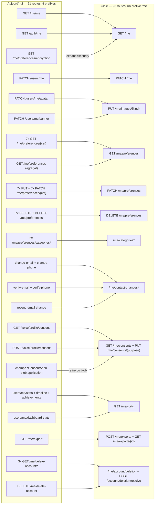

## Module `me` — le compte vu par son propriétaire

Périmètre : tout ce qu'un utilisateur lit et écrit **sur lui-même** — son identité, son profil, ses
identifiants de connexion (mot de passe, pseudo, e-mail, téléphone), ses préférences, ses catégories de
conversation, ses consentements, ses statistiques, l'export de ses données et la suppression de son
compte. Hors périmètre, et renvoyés à d'autres sections : la découverte d'autrui (`/users/search`,
`/u/:username`, `/users/email|phone|id/:x`) → module `people` ; amis, blocages, carnet d'adresses,
présence → module `social` ; les préférences **par conversation** et **par communauté**
(`/user-preferences/conversations|communities/*`) → modules `conversations` et `communities`.

### Ce que la surface est aujourd'hui

Le compte de l'appelant est servi par **61 routes réparties sur quatre préfixes différents** —
`/me/*`, `/users/me/*`, `/auth/me`, `/voice/profile/consent` — écrites par au moins cinq mains. La même
personne se lit par deux routes (`GET /me/me` et `GET /auth/me`), se modifie par trois
(`PATCH /users/me`, `/avatar`, `/banner`), change ses coordonnées par deux familles concurrentes dont
l'une **contourne la vérification de possession de l'autre**, et pose ses consentements par deux écritures
dont **la moins fiable gagne**. Vingt-huit des soixante-et-une routes sont la même route générée sept
fois par `createPreferenceRouter` (4 verbes × 7 catégories) : la catégorie est un paramètre déguisé en
chemin. Aucune route du module ne porte d'ETag, aucune n'accepte `?fields=`, une seule pose un
`Cache-Control`. Le seul limiteur qui s'applique est le limiteur global (`server.ts:507`,
300 req/min, clé `global:${request.ip}`) — et comme le gateway tourne **sans `trustProxy`** derrière
Traefik, cette clé vaut l'IP du conteneur proxy : **un seul seau pour toute la plateforme**. Autant dire
aucun débit.

| Route | Niveau | Auth | Débit | Poids | Consommée par | Verdict |
|---|---|---|---|---|---|---|
| `GET /me/me` (`me/index.ts:32`) | S2 | JWT | global | light | **PERSONNE** | à fusionner vers `GET /me` |
| `GET /auth/me` (`auth/magic-link.ts:33`) | S2 | JWT ou session | global | light | iOS + web (6 sites web) + Android | à fusionner vers `GET /me` |
| `GET /users/me/test` (`users/profile.ts:41`) | S2 | JWT | global | light | **PERSONNE** | à supprimer |
| `PATCH /users/me` (`users/profile.ts:92`) | S3 | JWT | global | medium | iOS (3 sites + outbox) + web (4) + Android | à fusionner vers `PATCH /me` |
| `PATCH /users/me/avatar` (`:305`) | S3 | JWT | global | medium | iOS + web + Android | à fusionner vers `PUT /me/images/{kind}` |
| `PATCH /users/me/banner` (`:403`) | S3 | JWT | global | medium | iOS + Android | à fusionner vers `PUT /me/images/{kind}` |
| `PATCH /users/me/password` (`:494`) | S3 | JWT + mot de passe | **aucun** | light | iOS + web (2) + Android | à garder → `PUT /me/password` + débit |
| `PATCH /users/me/username` (`:606`) | S3 | JWT + mot de passe | métier 1/30 j | light | web | à garder → `PUT /me/username` |
| `POST /users/me/change-email` (`contact-change.ts:74`) | S3 | JWT | **aucun** | light | iOS + web + Android | à fusionner vers `POST /me/contact-changes` |
| `POST /users/me/verify-email-change` (`:204`) | S3 | JWT | **aucun** | light | web + Android (iOS a le code, **aucun appelant**) | à fusionner vers `.../{channel}/verify` |
| `POST /users/me/resend-email-change-verification` (`:332`) | S3 | JWT | 60 s (cache, **fail-open**) | light | iOS + web + Android | à fusionner vers `.../{channel}/resend` |
| `POST /users/me/change-phone` (`:462`) | S3 | JWT | **aucun** | light | iOS + web + Android | à fusionner vers `POST /me/contact-changes` |
| `POST /users/me/verify-phone-change` (`:583`) | S3 | JWT | **aucun** | light | iOS + web + Android | à fusionner vers `.../{channel}/verify` |
| `GET /me/preferences` (`me/preferences/index.ts:61`) | S3 | JWT | global | medium | iOS seul | à fusionner vers `GET /me/preferences?categories=` |
| `DELETE /me/preferences` (`unified-routes.ts:401`) | S3 | JWT | global | light | **PERSONNE** | ✅ **fusionnée** — sert `?categories=` depuis #4181 |
| `GET /me/preferences/encryption` (`:228`) | S3 | JWT | global | light | web (`stores/user-preferences-store.ts:358`, `encryption-settings.tsx`) | à fusionner vers `GET /me?expand=security` |
| `GET /me/preferences/{7 catégories}` (`factory:112`) | S3 | JWT | global | light | web (5 sites) | à fusionner vers `GET /me/preferences` |
| `PUT /me/preferences/{7 catégories}` (`factory:150`) | S3 | JWT | **aucun** | light | web (3 sites) | à fusionner vers `PATCH …?mode=replace` |
| `PATCH /me/preferences/{7 catégories}` (`factory:266`) | S3 | JWT | **aucun** | light | iOS (outbox + repli) + web + Android | à fusionner vers `PATCH /me/preferences` |
| `DELETE /me/preferences/{7 catégories}` (`factory:383`) | S3 | JWT | global | light | iOS | à fusionner vers `DELETE /me/preferences` |
| `GET /me/preferences/categories` (`categories.ts:178`) | S3 | JWT | global | light | iOS (3 hôtes) + web + Android | à fusionner vers `GET /me/categories` |
| `GET /me/preferences/categories/:id` (`:237`) | S3 | JWT | global | light | web | à supprimer (doctrine 4) |
| `POST /me/preferences/categories` (`:298`) | S3 | JWT | **aucun** | light | iOS (3) + web + Android | à fusionner vers `POST /me/categories` |
| `PATCH /me/preferences/categories/:id` (`:374`) | S3 | JWT | global | light | iOS (2 chemins) + web | à fusionner vers `PATCH /me/categories/{id}` |
| `DELETE /me/preferences/categories/:id` (`:455`) | S3 | JWT | global | light | iOS + web | à fusionner vers `DELETE /me/categories/{id}` |
| `POST /me/preferences/categories/reorder` (`:535`) | S3 | JWT | **aucun** | light | iOS + web | à fusionner vers `PATCH /me/categories` (lot) |
| `GET /voice/profile/consent` (`voice-profile.ts:139`) | S3 | JWT | global | light | iOS | à fusionner vers `GET /me/consents` |
| `POST /voice/profile/consent` (`voice-profile.ts:51`) | S3 | JWT | global | light | iOS (3 sites) | à fusionner vers `PUT /me/consents/{purpose}` |
| `GET /users/me/stats` (`user-stats.ts:147`) | S3 | JWT | global | **heavy** (9 agrégats) | iOS | à fusionner vers `GET /me/stats` |
| `GET /users/me/stats/timeline` (`:188`) | S3 | JWT | global | **heavy** | iOS + Android | à fusionner vers `GET /me/stats?include=timeline` |
| `GET /users/me/stats/achievements` (`:261`) | S3 | JWT | global | **heavy** | iOS | à fusionner vers `GET /me/stats?include=achievements` |
| `GET /users/me/dashboard-stats` (`users/preferences.ts:25`) | S3 | JWT | global | **heavy** (9 requêtes) | web (2) | à fusionner vers `GET /me/stats` |
| `GET /me/export` (`me/export.ts:52`) | S3 | JWT | **aucun** | **heavy** (10 000 messages) | iOS + web + Android | à fusionner vers `POST /me/exports` |
| `DELETE /me/delete-account` (`delete-account.ts:35`) | S3 | JWT | **aucun** | light | iOS + Android (le web est en 404) | à fusionner vers `POST /me/account/deletion` |
| `GET /me/delete-account/confirm` (`:154`) | **S1** | token en query | **aucun** | light | lien e-mail | à fusionner vers `POST /account/deletion/resolve` |
| `GET /me/delete-account/cancel` (`:210`) | **S1** | token en query | **aucun** | light | lien e-mail | à fusionner vers `POST /account/deletion/resolve` |
| `GET /me/delete-account/delete-now` (`:271`) | **S1** | token en query | **aucun** | light | lien e-mail | à fusionner vers `POST /account/deletion/resolve` |

Neuf appels clients de ce module **ne rencontrent aucune route** (404 silencieux, vérifié par `grep`
dans `services/gateway/src/routes/` : seul `GET /me` existe sous le préfixe `/auth`, et aucune route
`/user-preferences` racine n'est montée) :

| Appel fantôme | Site client | Ce qu'il croit faire |
|---|---|---|
| `PATCH /auth/me` | `apps/web/components/settings/ProfileSettings.tsx:228` | enregistrer le profil |
| `DELETE /auth/me` | `ProfileSettings.tsx:364` | **supprimer le compte** |
| `POST /auth/me/email/request` | `ProfileSettings.tsx:111` | changer d'e-mail |
| `POST /auth/me/email/verify` | `ProfileSettings.tsx:144` | valider le nouvel e-mail |
| `GET /auth/check-username` | `ProfileSettings.tsx:184` | vérifier un pseudo (la vraie route est `/auth/check-availability`) |
| `GET` / `PUT /user-preferences/messages` | `apps/web/components/settings/MessageSettings.tsx:68` / `:98` | préférences de message |
| `GET /user-preferences/{clé}` / `POST /user-preferences` | `apps/web/hooks/use-font-preference.ts:42` / `:137` | préférence de police |

**Tout l'écran `ProfileSettings` du web parle à une API qui n'existe pas** — y compris son bouton de
suppression de compte. Le module a donc, en plus de ses doublons, une jumelle web entièrement morte,
pendant que `user-settings.tsx` fait correctement le même travail sur `/users/me/*`.

### Ce qui ne va pas

**Doublons.**
1. `GET /me/me` (`me/index.ts:32`) est **strictement dominé** par `GET /auth/me`
   (`auth/magic-link.ts:33`) : ouverts côte à côte, le premier refait un `findUnique` pour rendre
   6 champs, le second rend le profil complet **sans requête supplémentaire** (le contexte d'auth porte
   déjà l'utilisateur, cache 60 s — `AUTH_USER_CACHE_TTL`, `middleware/auth.ts:18`) et sert en plus les porteurs de session anonyme. De surcroît l'URL réelle
   est `/api/v1/me/me` : le plugin est monté sous `${API_PREFIX}/me` (`route-registration.ts:269`) et la
   route déclare encore `/me`. **Il n'existe aucun `GET /api/v1/me`.**
2. Vingt-huit routes de préférences pour une seule loi : `createPreferenceRouter` engendre GET/PUT/PATCH/
   DELETE pour sept catégories (`preference-router-factory.ts:112/150/266/383`). La catégorie est un
   paramètre. En prime, `GET /me/preferences` (`index.ts:61`) **réimplémente** la complétion par défauts
   au lieu de réutiliser `resolveComplete` de la factory — deux chemins pour une même règle.
3. Trois écritures de profil (`PATCH /users/me`, `/avatar` `:305`, `/banner` `:403`) : mêmes gardes,
   même bloc `permissions` copié-collé trois fois, et une divergence non voulue — l'avatar refuse les
   `data:` URI par une garde dédiée, la bannière non.
4. Statistiques : `computeUserStats` (`user-stats.ts`) et le calcul en ligne de
   `users/preferences.ts:345` sont deux implémentations du **même** jeu de métriques, avec deux
   comptages de traductions écrits différemment et deux tables de badges dupliquées ; le commentaire de
   `users/preferences.ts:454` réclame « parité stricte » avec `computeUserStats` et rien ne la garde. `GET /users/me/stats/achievements`
   (`:261`) appelle les **neuf** agrégats pour n'en garder qu'un sixième du résultat, alors que
   `GET /users/me/stats` renvoie déjà les badges : l'écran de profil iOS paie 18 requêtes pour 9 utiles.
5. Côté client, le même doublon se rejoue : `PATCH /users/me` a **trois** implémentations iOS
   (`UserService.swift:51`, `OutboxDispatcher.swift:249`, plus le choix en ligne/hors ligne de
   `ProfileView`), `GET /me/preferences/categories` n'a qu'un seul site HTTP
   (`PreferenceService.swift:79`, sans cache) mais **trois hôtes qui décident chacun quand l'appeler**
   (`UserCategoryStore.swift:324`, qui tient la liste en mémoire, et `CategoryPickerView:103`, qui
   recharge à chaque `.task`) : trois GET de la même liste peuvent partir dans un seul parcours.

**Sécurité.**
6. **La vérification de possession est contournable par la route voisine, dans le même fichier.**
   `PATCH /users/me` écrit `email` (`users/profile.ts:143`) et `phoneNumber` (`:144`) **directement en
   base**, sans jeton ni code, et ne remet **ni `emailVerifiedAt` ni `phoneVerifiedAt` à null** — alors
   que `POST /users/me/change-email` / `change-phone` existent exactement pour cela. Un compte conserve
   donc son statut « vérifié » sur une adresse qu'il ne possède pas.
7. **Trois routes publiques, mutantes, déclenchées par un `GET`** : `/me/delete-account/confirm`
   (`:154`), `/cancel` (`:210`) et `/delete-now` (`:271`). Le seul secret est un jeton en query string —
   donc dans les journaux d'accès, l'historique et le `Referer` — sans TTL vérifié. Tout pré-chargeur de
   lien (antivirus de messagerie, Safe Links, prefetch du navigateur) **exécute l'effet en visitant
   l'URL** : le premier e-mail porte `confirm` ET `cancel`, si bien qu'un scanner qui suit ses liens
   décide de l'état de la demande à la place de l'utilisateur ; `delete-now`, envoyé plus tard et
   n'agissant que sur une demande `GRACE_PERIOD_EXPIRED`, supprime alors le compte de la même façon.
8. **Le consentement est écrit par deux mains, et la moins fiable gagne.**
   `POST /voice/profile/consent` (`voice-profile.ts:51`) horodate côté **serveur** les colonnes
   `User.dataProcessingConsentAt / voiceDataConsentAt / voiceProfileConsentAt / voiceCloningEnabledAt`
   (`VoiceProfileService.updateConsent`, avec la chaîne de dépendances). Mais
   `PATCH /me/preferences/application` accepte ces mêmes noms **comme champs libres** du blob JSON
   (`dataProcessingConsentAt`, `voiceDataConsentAt`, `voiceProfileConsentAt`, `voiceCloningConsentAt`,
   `voiceCloningEnabledAt`), et `ConsentValidationService.getConsentStatus` donne **priorité au blob** :
   `applicationPrefs.dataProcessingConsentAt || user.dataProcessingConsentAt`. Le client se délivre donc
   lui-même, à la date de son choix, le consentement que la garde `CONSENT_REQUIRED`
   (`preference-router-factory.ts:203/329`) est censée exiger. Le même service renvoie **tous les
   consentements à `true` quand `NODE_ENV === 'development'`.**
9. **Aucune ré-authentification sur les gestes irréversibles** : `DELETE /me/delete-account` (`:35`),
   `GET /me/export` (`export.ts:52`) et `POST /users/me/change-email` (`:74`) se contentent d'un JWT. Un
   jeton volé exfiltre en un `GET` le profil, l'e-mail, le téléphone et les 10 000 derniers messages en
   clair (`export.ts:183`), ou ouvre la suppression du compte. Le mot de passe n'est exigé que par
   `PATCH /users/me/username` et `PATCH /users/me/password` — jamais par l'export, la suppression ni le
   changement de coordonnées.
10. **Aucun compteur d'essais** sur `verify-phone-change` (`:583`) : un code à 6 chiffres, aucune
    consommation en cas d'échec, aucun débit dédié. Et `change-phone` (`:462`) envoie un SMS vers un
    numéro choisi par l'appelant, sans limite — primitive d'épuisement de budget SMS.
11. `GET /users/:userId/stats` (`users/preferences.ts:345`) sert à **tout compte authentifié** les
    statistiques complètes de **n'importe qui** (volume de messages, conversations actives, demandes
    d'ami reçues, langues, ancienneté, posts/reels/stories), sans filtre d'amitié ni préférence de
    confidentialité.
12. `PUT /users/:id` et `DELETE /users/:id` (`users/devices.ts:719` / `:752`) sont documentées
    « Admin-only » et **ne portent aucune garde**. Elles ne font rien aujourd'hui : pièges armés.

**Bande passante.**
13. **Zéro ETag sur les 61 routes.** La seule en-tête de cache du module est le
    `Cache-Control: private, max-age=300` de `users/preferences.ts:345` — posé sur la route qui fuit les
    statistiques d'autrui, absent de sa jumelle `GET /users/me/stats`.
14. **Zéro `?fields=`, zéro `?expand=`.** `PATCH /users/me/avatar` renvoie le **profil entier** plus les
    neuf booléens de `permissions` pour un changement d'URL ; `GET /me/preferences` renvoie les **sept**
    catégories (≈130 clés) alors que chaque écran n'en lit qu'une.
15. `user.update` et `user.findFirst` sans `select` (`users/profile.ts:163/180/199/357/448`) chargent la
    ligne `User` **entière** en mémoire du process — hash de mot de passe et jetons `pending*` compris ;
    seul le sérialiseur empêche la fuite. (`me/index.ts`, lui, restreint bien son `findUnique` à six champs.)
16. `GET /users/me/dashboard-stats` paie **neuf requêtes, dont deux `findMany` à relations imbriquées**, pour servir des
    listes qui **n'arrivent jamais** : le handler envoie `members`, le schéma déclare `participants`, et
    `fast-json-stringify` supprime les deux listes. La preuve que personne ne les lit est que personne ne
    s'en est plaint.
17. `GET /users/me/stats/timeline` (`:188`) ramène **une ligne par message** de la fenêtre demandée
    (`days` : 30 par défaut, 90 au maximum) pour produire autant d'entiers, en agrégeant en JavaScript.
18. `GET /me/export` sans borne : `types` vaut par défaut les trois familles, la liste de participants
    imbriquée n'a **aucun `take`**, et `format=csv` renvoie **le JSON complet ET sa transcription CSV**
    dans la même réponse.
19. `POST /me/preferences/categories/reorder` (`categories.ts:535`) : le tableau `updates` n'a **aucun
    `maxItems`** et chaque entrée devient un `updateMany` lancé en `Promise.all` — 100 000 entrées
    ouvrent 100 000 requêtes Prisma concurrentes.
20. Tout le sous-arbre `categories` construit le contexte d'auth **deux fois** par requête
    (`createUnifiedAuthMiddleware` enregistré par le plugin parent **et** par `categoriesRoutes`).

**Contrat.**
21. `PATCH /users/me` : le schéma AJV et le validateur Zod divergent **dans les deux sens** — AJV déclare
    `avatar` et `timezone` que Zod rejette (400), et ne déclare pas `email`, que Zod accepte et que le
    handler écrit. `PATCH /users/me/password` exige un `confirmPassword` que **son propre schéma AJV ne
    déclare pas** : un client conforme au contrat publié reçoit un 400.
22. *(Vérifié : pas de divergence GET / écriture.)* Le `PATCH` d'une catégorie renvoie `merged`
    (`preference-router-factory.ts:317` — `resolveComplete` puis le corps) et le `PUT` renvoie le document
    validé par Zod, défauts inclus : la réponse d'écriture a donc **la même forme** que le GET. Ce qui
    reste vrai est le point 23 ci-dessous.
23. `PUT` sur une catégorie **écrase les clés absentes par les `default()` du schéma Zod** : ce n'est ni
    un remplacement fidèle ni un PATCH — c'est une réinitialisation partielle silencieuse.
24. `GET /users/:id` (`users/profile.ts:878`) sert un `autoTranslateEnabled: true` **écrit en dur** (avec
    un `TODO` en commentaire) : un champ de contrat qui ne dit rien de vrai. `dashboard-stats` nomme
    `totalMessages` un compteur qui vaut `messagesThisWeek`, et `translationsToday` des messages envoyés.
25. `PATCH /users/me/username` calcule `nextChangeAllowedAt`, le déclare au schéma 429 et **ne l'envoie
    jamais** (variable morte) : le client ne peut pas afficher la date de déblocage.
26. `DELETE /me/delete-account` **réactive** un compte déjà désactivé avant d'ouvrir la demande, et rend
    « un e-mail a été envoyé » même à un compte **sans e-mail** — dont la demande reste alors bloquée en
    `PENDING` pour toujours (le 409 interdit d'en rouvrir une). Et la « suppression définitive » de
    `/delete-now` est un `isActive:false` + `deletedAt` : rien n'est purgé, contrairement à ce
    qu'affirme la page rendue.
27. `POST /users/me/verify-email-change` **n'a aucun appelant iOS** (`UserService.swift:172`, mocks
    seulement) alors que le pendant téléphone est complet : sur iOS, un changement d'e-mail ne peut pas
    se terminer dans l'application.

### La surface cible

**Un préfixe unique : `/api/v1/me`.** Tout ce qui concerne l'appelant y vit, et rien d'autre. Les quatre
préfixes actuels disparaissent. La seule exception est la résolution des liens e-mail de suppression, qui
par nature n'est pas authentifiée et sort donc de `/me` : `/api/v1/account/deletion/resolve`.

| Route cible | Remplace | Niveau | Débit (seuil + clé) | Paramètres | Gain |
|---|---|---|---|---|---|
| `GET /me` | `GET /me/me`, `GET /auth/me` | S2 (JWT **ou** session anonyme) | 600/min par **compte** | `?fields=`, `?expand=security,preferences,stats` | 2 routes → 1 ; une requête Prisma supprimée ; ETag/304 ; l'anonyme reste servi sans chemin frère |
| `PATCH /me` | `PATCH /users/me` | S3 | 60/min par **compte** | `?fields=` sur la réponse ; en-tête `x-client-mutation-id` | `email`/`phoneNumber` **refusés ici** (409 → `/me/contact-changes`) : la vérification cesse d'être contournable |
| `PUT /me/images/{kind}` | `PATCH /users/me/avatar`, `/banner` (+ l'upload préalable) | S3 | 10/min par **compte** | `kind` ∈ `avatar|banner`, corps multipart | 2 routes → 1, **un aller-retour de moins** par image, une seule garde `data:`/URL |
| `PUT /me/password` | `PATCH /users/me/password` | S3 + mot de passe courant | **5 / 15 min par compte**, puis 15 min de gel | — | bornage du bruteforce ; révocation des sessions émises avant le changement |
| `PUT /me/username` | `PATCH /users/me/username` | S3 + mot de passe | métier 1/30 j **par compte** + 10/h HTTP | — | `nextChangeAllowedAt` enfin **servi** |
| `GET /me/contact-changes` | *(nouveau)* | S3 | 60/min par compte | — | l'app sait qu'un changement est en attente sans lire le profil |
| `POST /me/contact-changes` | `change-email`, `change-phone` | S3 + mot de passe | **3/h par compte**, **5/j par valeur cible**, 20/j par IP | `{ channel, value }` | 2 → 1 ; ferme le vecteur SMS-pumping et l'envoi d'e-mail non borné |
| `POST /me/contact-changes/{channel}/verify` | `verify-email-change`, `verify-phone-change` | S3 | **5 essais par demande** puis invalidation ; 10/h par compte | `{ token }` ou `{ code }` | 2 → 1 ; comparaison à temps constant ; **rend le profil à jour** (supprime le `checkExistingSession` iOS) |
| `POST /me/contact-changes/{channel}/resend` | `resend-email-change-verification` | S3 | 1/60 s **fail-closed**, 5/h par compte | — | le pendant SMS, absent aujourd'hui, existe |
| `GET /me/preferences` | `GET /me/preferences` + **7** GET par catégorie | S3 | 300/min par compte | `?categories=a,b`, `?fields=`, `If-None-Match` | 8 → 1 ; le client ne paie plus 130 clés pour en lire 14 ; 304 sur écran rouvert |
| `PATCH /me/preferences` | **7** PUT + **7** PATCH | S3 | 120/min par compte | `?mode=merge` (défaut) `|replace`, corps multi-catégories | 14 → 1 ; `PUT` cesse d'être une réinitialisation déguisée ; **une seule écriture** pour un écran qui touche deux catégories |
| `DELETE /me/preferences` | `DELETE /me/preferences` + **7** DELETE | S3 | 20/min par compte | `?categories=` (absent = tout) | 8 → 1 ; le « tout réinitialiser » couvre enfin les catégories nommées |
| `GET /me/categories` | `GET /me/preferences/categories` (+ `/:id`) | S3 | 300/min par compte | `?cursor=`, `?updatedSince=`, `If-None-Match` | le chemin cesse de mentir (c'est une table, pas une préférence) ; plus de `count()` par page ; le détail ne se re-demande plus |
| `POST /me/categories` | `POST /me/preferences/categories` | S3 | 30/min par compte | `x-client-mutation-id` | 201 + corps ; idempotent (aujourd'hui un rejeu d'outbox crée un doublon) |
| `PATCH /me/categories` | `POST …/categories/reorder` | S3 | 30/min par compte | lot `items[{id, order}]`, **max 200** | l'amplification 1 requête → N `updateMany` est bornée |
| `PATCH /me/categories/{id}` | `PATCH …/categories/:id` | S3 | 60/min par compte | — | `select: { id }` au lieu de la ligne entière |
| `DELETE /me/categories/{id}` | `DELETE …/categories/:id` | S3 | 30/min par compte | — | inchangé fonctionnellement |
| `GET /me/consents` | `GET /voice/profile/consent`, champs `*ConsentAt` de `application` | S3 | 120/min par compte | — | **une seule source** de consentement, horodatée serveur |
| `PUT /me/consents/{purpose}` | `POST /voice/profile/consent` | S3 | 20/h par compte | `purpose` ∈ `data-processing|voice-data|voice-profile|voice-cloning|analytics`, `{ granted, policyVersion }` | le client **ne peut plus se délivrer un consentement daté** ; la garde `CONSENT_REQUIRED` interroge enfin une valeur qu'il n'écrit pas |
| `GET /me/stats` | `users/me/stats`, `/timeline`, `/achievements`, `dashboard-stats` | S3 | 60/min par compte | `?include=counters,timeline,achievements`, `?days=`, `If-None-Match`, `Cache-Control: private, max-age=300` | 4 → 1 ; les 9 agrégats ne partent **que** si demandés (aujourd'hui les badges en paient 9 pour 6 valeurs) ; 18 requêtes → 9 sur l'écran profil iOS |
| `POST /me/exports` | `GET /me/export` | S3 + mot de passe | **1 / 24 h par compte** | `{ types[], format }` | l'export cesse d'être une primitive de DoS et d'exfiltration en un `GET` |
| `GET /me/exports/{id}` | *(nouveau)* | S3 | 60/min par compte | — | l'archive est produite hors requête, complète (pièces jointes, traductions) et servie par URL signée à TTL |
| `POST /me/account/deletion` | `DELETE /me/delete-account` | S3 + mot de passe | **3 / 24 h par compte** | `{ confirmationPhrase }` | plus d'amplification e-mail ; 409 explicite si le compte n'a pas d'adresse |
| `GET /me/account/deletion` | *(nouveau)* | S3 | 60/min par compte | — | l'app affiche enfin le statut et la date de purge (iOS jette le message aujourd'hui) |
| `POST /account/deletion/resolve` | `GET …/confirm`, `/cancel`, `/delete-now` | **S1** (porteur de jeton) | **10/h par IP** + **5 essais par jeton**, jeton à TTL 72 h | `{ token, action: confirm|cancel|purge }` | 3 → 1 ; **plus aucun effet de bord déclenchable par un pré-chargeur de lien** ; le jeton quitte la query string |

**Total : 61 routes → 25.** Les cinq appels fantômes émis par `ProfileSettings.tsx` disparaissent avec l'écran qui les émet.

#### `GET /me` — la seule lecture de soi

```
GET /api/v1/me?fields=id,username,displayName,avatar,role&expand=security
If-None-Match: "u-<userId>-<updatedAt>-<prefsVersion>"

200 { success, data: { user: {
        id, username, email, emailVerifiedAt, phoneNumber, phoneVerifiedAt,
        firstName, lastName, displayName, avatar, banner, bio, role,
        systemLanguage, regionalLanguage, customDestinationLanguage,
        isActive, createdAt, updatedAt, permissions,
        security?: { hasSignalKeys, signalRegistrationId, lastKeyRotation },
        preferences?: { … }, stats?: { … } } } }
304 (corps vide) si l'ETag correspond
```

`expand=security` absorbe `GET /me/preferences/encryption`, aujourd'hui lu par le web
(`stores/user-preferences-store.ts:358` → `encryption-settings.tsx`). La forme **anonyme** (porteur de `X-Session-Token`) reste servie par la même route,
avec `role: 'ANONYMOUS'` : c'est le porteur qui varie, pas le chemin.

#### `PATCH /me/preferences` — une écriture pour sept catégories

```
PATCH /api/v1/me/preferences?mode=merge
x-client-mutation-id: <uuid>
{ "application": { "theme": "dark" }, "notification": { "sound": false } }

200 { success, data: { application: {…complété par les défauts},
                       notification: {…complété par les défauts} } }
```

Deux règles que la surface actuelle enfreint : la réponse d'écriture est **la même forme** que celle du
GET (complétée par les défauts), et `mode=replace` remplace **la catégorie entière par le corps**, sans
réintroduire les `default()` Zod des clés absentes. Les cinq champs `*ConsentAt` sont **retirés** du
schéma `application` : les écrire renvoie 400 avec un renvoi vers `/me/consents`.

#### `GET /me/consents` et `PUT /me/consents/{purpose}`

```
GET /api/v1/me/consents
200 { success, data: { consents: [
      { purpose: "data-processing", granted: true,  grantedAt, policyVersion: "2026-06-01", source: "app-ios" },
      { purpose: "voice-cloning",   granted: false, revokedAt,  policyVersion: "2026-06-01" } ],
      derived: { canTranscribeAudio, canTranslateAudio, canUseVoiceCloning } } }

PUT /api/v1/me/consents/voice-cloning
{ "granted": true, "policyVersion": "2026-06-01" }
200 { success, data: { purpose, granted, grantedAt, policyVersion, dependenciesGranted: ["data-processing","voice-data","voice-profile"] } }
```

L'horodatage est **posé par le serveur**, jamais reçu du client. La chaîne de dépendances de
`VoiceProfileService.updateConsent` devient la loi unique, lue par `ConsentValidationService` sur les
colonnes `User` seules. `derived` est ce que la garde `CONSENT_REQUIRED` évalue — il devient lisible par
le client, qui peut donc expliquer un refus au lieu de le subir.

#### `POST /account/deletion/resolve` — le lien e-mail cesse d'être un `GET` mutant

```
POST /api/v1/account/deletion/resolve
{ "token": "<64 hex>", "action": "confirm" }        // ou "cancel" | "purge"

200 { success, data: { status: "CONFIRMED", gracePeriodEndsAt, canCancelUntil } }
410 { success:false, error:{ code:"TOKEN_EXPIRED" } }   // TTL 72 h désormais vérifié
```

Le lien de l'e-mail pointe vers une **page** (`https://meeshy.me/account/deletion?token=…&action=confirm`)
qui affiche la conséquence et fait le POST sur clic. Un antivirus de messagerie qui suit le lien affiche
la page ; il ne supprime plus le compte. Le jeton ne voyage plus en query string vers l'API, donc ni
dans les journaux d'accès ni dans le `Referer`.

#### `POST /me/exports` — l'export devient un travail, pas une requête

```
POST /api/v1/me/exports
{ "types": ["profile","messages","attachments","translations"], "format": "json", "currentPassword": "…" }
202 { success, data: { id, status: "PENDING", requestedTypes, createdAt } }

GET /api/v1/me/exports/{id}
200 { success, data: { id, status: "READY", sizeBytes, downloadUrl, expiresAt } }
```

Le `take: 10000` implicite disparaît : l'archive est complète (art. 20) et produite par lot hors du
cycle requête/réponse. `format=csv` produit **un fichier CSV**, pas un JSON accompagné de sa
transcription.

### Diagramme



### Migration

**Ce qui casse — iOS** (majoritairement `packages/MeeshySDK/Sources/MeeshySDK/Services/` ; `AuthService`
est sous `.../MeeshySDK/Auth/`, `UserCategoryStore` sous `.../MeeshySDK/Store/`, `CategoryPickerView` sous
`.../MeeshyUI/Primitives/` et `OutboxDispatcher` sous `apps/ios/Meeshy/Features/Main/Services/`) :
`AuthService.me()` (`:270`) → `GET /me` ; `UserService.updateProfile/updateAvatar/updateBanner`
(`:51/:57/:65`) et **les deux jumeaux de l'outbox** (`OutboxDispatcher.swift:226/:249`) ;
`AuthService.changePassword` (`:237`, à rapatrier dans `UserService`) ;
`UserService.changeEmail/verifyEmailChange/resend/changePhone/verifyPhoneChange` (`:165`→`:194`) ;
`PreferenceService.getAllPreferences/patchPreferences/resetPreferences` (`:121/:126/:132`) et le chemin
outbox `OutboxDispatcher.swift:437` ; les trois hôtes de catégories (`PreferenceService:79/113/145`,
`UserCategoryStore:326/341`, `CategoryPickerView:103/113`) ; `StatsService` (3 appels) ;
`AccountService.deleteAccount` (`:13`) ; `DataExportService` (`:77`) ; `VoiceProfileService`
(`:26/:39/:45/:114`). **Le corps de l'outbox change** : `PATCH /me/preferences/{cat}` devient
`PATCH /me/preferences` avec la catégorie **dans le corps** — les mutations déjà en file au moment de la
mise à jour doivent être traduites par le dispatcher, pas rejetées (un `kind` versionné suffit).

**Ce qui casse — web** : `apps/web/services/users.service.ts` (`:84/:112/:137/:166`),
`components/settings/user-settings.tsx` (8 appels), `password-settings.tsx:81`,
`language-settings.tsx:58`, `hooks/use-preferences.ts` (`:117/:170/:239`), `app/settings/page.tsx:268`,
`components/settings/ApplicationSettings.tsx` (`:133/:166`), `app/notifications/preferences/page.tsx`
(`:79/:114`), `services/notification.service.ts` (`:334/:344`), `services/user-preferences.service.ts`
(`:329/:356/:382/:411/:437/:468`), `services/dashboard.service.ts:67`,
`components/settings/privacy-settings.tsx:105`, `app/settings/verify-email-change/page.tsx:47`.
**`ProfileSettings.tsx` et `MessageSettings.tsx` ne cassent pas : ils sont déjà en 404.** Ils sont à
récrire sur la surface cible ou à supprimer au profit de `user-settings.tsx`, qui fait déjà le travail —
c'est la première étape, et elle ne demande aucun changement de gateway.

**Ce qui casse — Android** : l'inventaire client fourni ne couvrait qu'iOS et le web, mais le relevé
`grep` a été fait — **Android est un consommateur de premier plan de ce module**. `UserApi.kt` appelle
`users/me`, `users/me/avatar`, `users/me/banner`, `users/me/password`, `users/me/change-email`,
`users/me/verify-email-change`, `users/me/resend-email-change-verification`, `users/me/change-phone`,
`users/me/verify-phone-change`, `me/delete-account`, `users/{userId}/stats` et
`users/me/stats/timeline` ; `AuthApi.kt` appelle `auth/me` et `auth/check-availability` ;
`PreferencesApi.kt` appelle `me/preferences/categories` (GET + POST), `me/preferences/notification` et
`me/preferences/privacy` ; `DataExportApi.kt` appelle `me/export`. La période d'alias vaut donc deux
versions publiées du client Android, pas deux du gateway.

**Ordre des étapes.**
1. **Correctifs qui ne changent aucun chemin** (aucune migration client) : refuser `email`/`phoneNumber`
   dans `PATCH /users/me` (`profile.ts:143`) ; retirer les cinq `*ConsentAt` du schéma `application` ;
   borner `updates` de `reorder` ; ajouter les compteurs d'essais sur les deux `verify` ; supprimer
   `GET /users/me/test`, `PUT /users/:id`, `DELETE /users/:id`, `GET /me/me` (aucun consommateur) ;
   retirer le hook d'auth redondant du sous-arbre `categories`.
2. **Poser le débit d'abord, et sa clé** : `trustProxy` + `X-Forwarded-For` sur le gateway — sans lui,
   toute limite « par IP » du tableau ci-dessus est fiction (`server.ts:507`, clé
   `global:${request.ip}` = un seul seau pour la plateforme). Puis les seaux par **compte** sur export,
   suppression, changement de coordonnées, mot de passe.
3. **Suppression de compte** : monter `POST /account/deletion/resolve`, faire pointer les e-mails vers la
   page web, garder les trois `GET` comme **redirections 302 vers la page** (et non plus comme effets)
   pendant 90 jours — la durée d'une période de grâce, pour qu'aucun lien déjà envoyé ne meure.
4. **Lecture de soi** : monter `GET /me`, faire de `GET /auth/me` un alias qui répond avec
   `Deprecation: true` + `Sunset: <date>` ; les clients migrent au rythme de leurs versions.
5. **Préférences et catégories** : monter les trois routes cibles + `/me/categories`, garder les 34
   anciennes en **double montage** (même handler, en-tête `Deprecation`) jusqu'à ce que les compteurs
   d'accès par route tombent à zéro sur deux versions de chaque client.
6. **Profil, identifiants, coordonnées, consentements, stats, export** : mêmes alias, même règle de
   sortie — **le retrait se prouve par un compteur d'accès à zéro**, jamais par une revue de code
   client.

**Ce qui reste en alias, et jusqu'à quand.**

| Alias conservé | Cible | Sortie |
|---|---|---|
| `GET /auth/me` | `GET /me` | 2 versions publiées de chaque client (iOS, web, Android) |
| `GET`/`PUT`/`PATCH`/`DELETE /me/preferences/{cat}` (28) | `/me/preferences` | idem, compteur d'accès à zéro |
| `/me/preferences/categories*` (6) | `/me/categories` | idem |
| `PATCH /users/me`, `/avatar`, `/banner` | `PATCH /me`, `PUT /me/images/{kind}` | idem |
| `/users/me/change-*`, `/verify-*`, `/resend-*` | `/me/contact-changes*` | idem |
| `/users/me/stats*`, `dashboard-stats` | `GET /me/stats` | idem |
| `GET /me/export` | `POST /me/exports` | conservé en mode synchrone **borné** (`types` obligatoire, 1 000 messages) jusqu'à migration |
| `GET /me/delete-account/{confirm,cancel,delete-now}` | page web + `POST /account/deletion/resolve` | **302 seulement**, 90 jours |
| `GET /voice/profile/consent`, `POST` | `/me/consents` | 2 versions iOS (seul consommateur) |

**Ce qui ne prend pas d'alias, parce que personne ne l'appelle** : `GET /me/me`,
`GET /users/me/test`, `PUT /users/:id`, `DELETE /users/:id`. **Quatre** routes
retirables **dès la première étape**, sans transition — `GET /me/preferences/encryption`, lui, a un
lecteur web (`encryption-settings.tsx`) et ne peut donc pas être retiré sans migrer cet écran.

> **`DELETE /me/preferences` a quitté cette liste (#4366).** Elle y figurait comme « retirable » ;
> #4181 l'a REMPLACÉE par la forme `?categories=` au lieu de la retirer, et c'est le bon cadre — une
> remise à zéro par catégories est ce que l'écran veut, la remise à zéro GLOBALE est ce que personne
> ne demandait. La route est donc **vivante**, avec un sens neuf, et un témoin exige désormais sa
> PRÉSENCE (`identity-twins-retired.test.ts` : « sert la remise à zéro par CATÉGORIES »).
>
> Deux issues demandaient donc l'inverse l'une de l'autre. Ce n'était pas une contradiction à
> arbitrer mais un **inventaire périmé** : #4186 énumérait des retraits, #4181 en a converti un en
> remplacement onze heures avant, et l'énumération n'a pas suivi. **Un inventaire qui liste des
> décisions vieillit à chaque décision prise ailleurs.**
