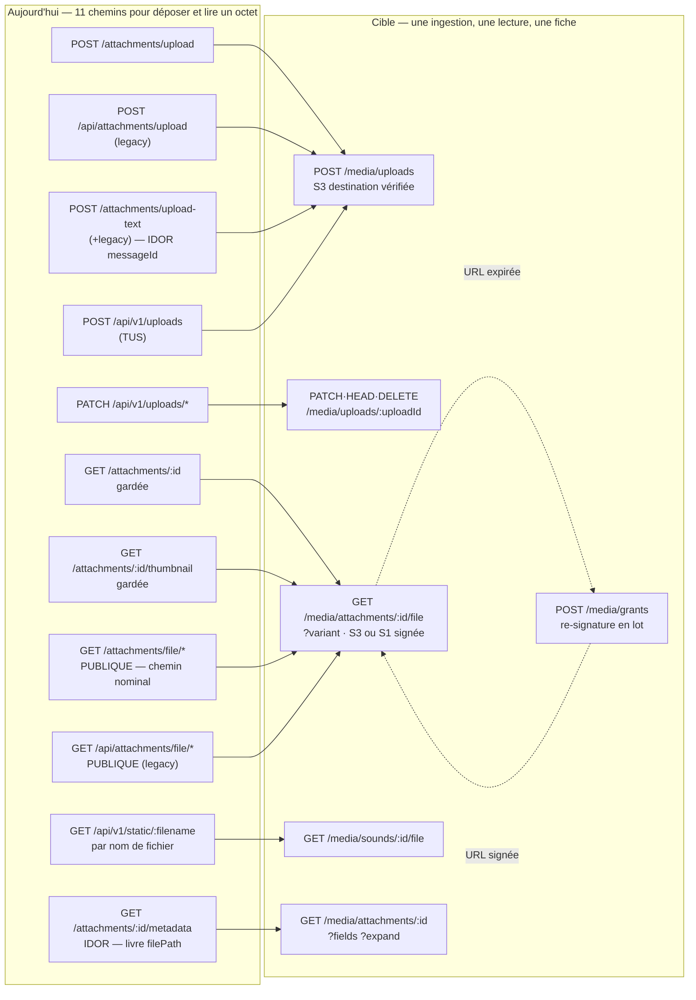

## Media — pièces jointes, téléversement TUS, voix, transcription

### Ce que la surface est aujourd'hui

Le module compte **54 couples (méthode, chemin)** répartis sur quatre familles qui ne se connaissent pas : les pièces jointes (`routes/attachments/`, montées **deux fois** — `/api/v1` et `/api` legacy, `route-registration.ts:307` et `:311`), le téléversement resumable TUS (`routes/uploads/tus-handler.ts`, chemin **codé en dur** hors `API_PREFIX`), la voix (`routes/voice/*`, enregistrées **conditionnellement** si le client ZMQ existe au démarrage, `route-registration.ts:341`) et l'analyse vocale (`routes/voice-analysis.ts`, montée **sans aucun préfixe** — cinq routes à la racine du serveur, `route-registration.ts:336`). Deux routes de statut de consommation vivent à part, dans `routes/messages.ts`, et le flux audio des stories dans `routes/posts/audio.ts`.

Le fait le plus lourd n'est pas la dispersion : c'est que **32 de ces 54 routes n'ont aucun appelant, ni iOS, ni web, ni Android**. Toute la tranche `voice/*` (13 routes) est morte ; les cinq routes d'analyse vocale sont mortes *parce qu'elles sont montées à la racine* et que le web les appelle sous `/api/v1` — le 404 n'est pas silencieux pour autant : `apiService.request` **lève** sur toute réponse non-2xx, et les appelants affichent une erreur (`toast.error`, `setError`) ; neuf des dix jumelles legacy sont mortes alors que le commentaire qui les justifie (`route-registration.ts:309-310`) ne motive **que** la route de lecture `file/*`. Pendant ce temps, la seule route par laquelle passent réellement les octets — `GET /attachments/file/*` — n'a **aucune garde du tout**.

| Route | Niveau | Auth | Débit | Poids | Consommée par | Verdict |
|---|---|---|---|---|---|---|
| `POST /api/v1/attachments/upload` | S2 | garde dans le handler | global 300/min/IP proxy | lourd | iOS + web + Android | fusionner → T1 |
| `POST /api/v1/attachments/upload-text` | S2 | idem | global | moyen | web | fusionner → T1 |
| `GET /api/v1/attachments/:id` | S3 | `authenticate` + verdict de participation | global | lourd | web | fusionner → T3 |
| `GET /api/v1/attachments/:id/thumbnail` | S3 | idem | global | moyen | web | fusionner → T3 |
| `GET /api/v1/attachments/file/*` | **S0** | **aucune** | global | lourd | iOS + web + Android (chemin nominal) | fusionner → T3 (signature) |
| `GET /api/v1/attachments/:id/metadata` | S2 | authentifié, **aucune appartenance** | global | moyen | **PERSONNE** | fusionner → T6 |
| `DELETE /api/v1/attachments/:id` | S3 | déposant, ou ADMIN/BIGBOSS **en dur** | global | léger | iOS + web | fusionner → T7 |
| `GET /api/v1/conversations/:id/attachments` | S3 | participation + plancher + masquage | global | lourd | web | garder (T8, curseur) |
| `POST /api/v1/attachments/:id/translate` | S3 | `verifyUserAccess` dans le service | **aucun** (ML) | lourd | iOS + web | fusionner → T12 |
| `POST /api/v1/attachments/:id/transcribe` | S2 | **aucune appartenance** | **aucun** (ML) | moyen | iOS + web | fusionner → T11 |
| 10 jumelles `/api/attachments/*` (legacy) | idem | idem | seau partagé | idem | seul `file/*` (web) | supprimer 9, aliaser 1 |
| `POST /api/v1/uploads` (TUS création) | S2 | hook tus `onUploadCreate` | global, **par tronçon** | lourd | iOS + web + Android | fusionner → T1 |
| `PATCH /api/v1/uploads/*` (+ HEAD) | S3 | hook tus, propriétaire figé | global, par tronçon | lourd | iOS + web + Android | fusionner → T2 |
| `GET /api/v1/uploads/*` | S3 | hook tus | global | lourd | **PERSONNE** | supprimer |
| `DELETE /api/v1/uploads/*` | S3 | hook tus (fail-open latent) | global | léger | web (`tusUploadService.pauseAll`/`abort` appellent `upload.abort(true)`, qui termine la session par un `DELETE` — `tus-js-client/lib/upload.js:125`) | fusionner → T2 |
| `GET`/`PATCH`/`DELETE /api/v1/uploads` (collection) | **S0** | aucune | global | léger | **PERSONNE** | supprimer |
| `GET /api/v1/attachments/:id/status-details` | S3 | participation | aucun | moyen | iOS | fusionner → T9 |
| `POST /api/v1/attachments/:id/status` | S3 | participation | **aucun** (diffusion socket) | léger | iOS + web | fusionner → T10 |
| `GET /api/v1/static/:filename` | S2 | authentifié, **aucune propriété** | 240/min/compte | lourd | iOS (indirect) | garder → T5 |
| `POST /api/v1/voice/translate` | S2 | **IDOR** sur `attachmentId` | aucun (ML) | lourd | **PERSONNE** | fusionner → T12 |
| `POST /api/v1/voice/translate/async` | S2 | idem + SSRF `webhookUrl` | aucun (ML) | moyen | **PERSONNE** | fusionner → T12 (`async`) |
| `POST /api/v1/voice/transcribe` | S2 | **IDOR** sur `attachmentId` | aucun (ML) | lourd | **PERSONNE** | fusionner → T11 / T14 |
| `GET /api/v1/voice/job/:jobId` | S2 | déléguée au worker Python | aucun | moyen | **PERSONNE** | garder → T17 |
| `DELETE /api/v1/voice/job/:jobId` | S2 | déléguée au worker | aucun | léger | **PERSONNE** | garder → T18 |
| `POST /api/v1/voice/analyze` | S2 | sur son propre audio | aucun (GPU) | lourd | **PERSONNE** | fusionner → T15 |
| `POST /api/v1/voice/compare` | S2 | oracle de locuteur | aucun (GPU) | lourd | **PERSONNE** | garder → T16 (débit strict) |
| `POST /api/v1/voice/feedback` | S2 | `translationId` non vérifié | aucun | léger | **PERSONNE** | fusionner → T19 |
| `GET /api/v1/voice/history` | S3 | déléguée au worker | aucun | moyen | **PERSONNE** | fusionner → T20 (contrat cassé) |
| `GET /api/v1/voice/stats` | S3 | déléguée au worker | aucun | léger | **PERSONNE** | supprimer (→ `/me/stats`) |
| `GET /api/v1/voice/admin/metrics` | S5 visé | **garde morte** (403 pour tous) | aucun | moyen | **PERSONNE** | recâbler → T22 |
| `GET /api/v1/voice/health` | S0 | aucune | global | léger | **PERSONNE** (sondes infra) | supprimer (→ `/health`) |
| `GET /api/v1/voice/languages` | S0 | aucune | global | léger | **PERSONNE** | fusionner → T21 |
| `POST /api/v1/voice/profile/consent` | S3 | soi | aucun | léger | iOS | fusionner → T26 |
| `GET /api/v1/voice/profile/consent` | S3 | soi | aucun | léger | iOS | fusionner → T23 |
| `POST /api/v1/voice/profile/register` | S3 | soi | **aucun** (50 Mo base64) | lourd | iOS + web | fusionner → T24 |
| `PUT /api/v1/voice/profile/:profileId` | S3 | soi (**`profileId` ignoré**) | aucun | lourd | iOS | fusionner → T24 |
| `GET /api/v1/voice/profile` | S3 | soi | aucun | lourd | iOS + web | garder → T23 |
| `DELETE /api/v1/voice/profile` | S3 | soi | aucun | léger | iOS + web | garder → T25 |
| `POST /attachments/:id/analysis` (racine) | S2 | **IDOR lecture + écriture** | aucun (GPU) | lourd | **PERSONNE** | fusionner → T15 |
| `POST /attachments/batch/analysis` (racine) | S2 | **IDOR ×50** | aucun (GPU) | lourd | **PERSONNE** | fusionner → T15 |
| `GET /attachments/:id/analysis` (racine) | S2 | **IDOR lecture** | aucun | moyen | **PERSONNE** | fusionner → T6 |
| `POST /voice/analysis` (racine) | S3 | soi, mais `audioPath` client | aucun (GPU) | lourd | **PERSONNE** | fusionner → T15 |
| `GET /voice/analysis` (racine) | S3 | soi | aucun | moyen | **PERSONNE** | fusionner → T23 |

*(Le montage TUS enregistre les six méthodes `GET`/`HEAD`/`POST`/`PATCH`/`DELETE`/`OPTIONS` sur chacune des deux URL — `tus-handler.ts:520-536` —, soit douze couples ; cinq d'entre eux ne figurent pas dans le décompte ci-dessus : `HEAD`/`OPTIONS` sur les deux URL et `POST /api/v1/uploads/*`. `HEAD /api/v1/uploads/*` est la méthode nominale de reprise du protocole et est bien consommée par les trois clients.)*

### Ce qui ne va pas

**Doublons.**

1. **Dix routes montées deux fois** (`route-registration.ts:307` et `:311`). Le commentaire qui justifie le second montage ne parle que des `fileUrl` déjà en base, c'est-à-dire de la seule route de **lecture** `file/*`. Les neuf autres — dont un `POST` d'écriture et un `DELETE` destructeur — sont dupliquées sans raison énoncée, et toute règle de proxy/WAF écrite pour `/api/v1/attachments/*` rate silencieusement `/api/attachments/*`.
2. **Deux transcriptions pour un même geste.** `routes/attachments/translation.ts:226` et la branche `attachmentId` de `routes/voice/translation.ts:531` appellent exactement les mêmes services (`getAttachmentWithTranscription` puis `transcribeAttachment`) et rendent la même forme — vérifié ligne à ligne. Elles diffèrent sur deux points **qui comptent** : la première vérifie le type MIME et le consentement et honore `force`, la seconde ne fait ni l'un ni l'autre. Fusion possible, à condition de retenir l'implémentation gardée.
3. **Trois traductions pour un même geste.** `attachments/translation.ts:39` (via `AttachmentTranslateService.translate`, qui **vérifie l'appartenance**), `voice/translation.ts:46` (via `translationService.translateAttachment`, qui ne vérifie **rien**) et `voice/translation.ts:221` (variante « async »). Or la première porte **déjà** `async`, `webhookUrl` et `priority` dans son corps : la troisième route est un paramètre déguisé en chemin. La seconde apporte un court-circuit utile (« déjà traduit ⇒ resservir ») que la fusion doit conserver.
4. **Deux analyses vocales.** `voice/analysis.ts:53` et `voice-analysis.ts:400` appellent le même `AudioTranslateService.analyzeVoice` (vérifié : `VoiceAnalysisService.ts:216`) ; seule la persistance dans `UserVoiceModel` diffère, ce qui est un **paramètre** (`persist`, déjà présent dans la seconde), pas un chemin.
5. **Deux lectures du consentement vocal.** `voice-profile.ts:139` sert trois horodatages que `GET /voice/profile` sert déjà dans son bloc `consentStatus` (`voice-profile.ts:682` et `:751`).
6. **Deux écritures pour un même dépôt** : `routes/attachments/upload.ts:58` (multipart, une passe) et `routes/uploads/tus-handler.ts:522` (resumable). Elles partagent à dessein leur décision d'autorisation anonyme (`classifyAnonymousAttachment`) — c'est la preuve qu'il s'agit d'un seul geste écrit deux fois.
7. Côté clients, le même défaut se répète : trois méthodes iOS pour une route (`VoiceProfileService.swift:39/45/114`), deux sites XHR pour un même `POST` web (`attachmentService.ts:202` et `tusUploadService.ts:481`), quatre composants web pour un même `fetch` de texte (`MarkdownViewer.tsx:81`, `MarkdownLightbox.tsx:47`, `TextViewer.tsx:58`, `TextLightbox.tsx:74`).

**Sécurité.**

8. **Le magasin d'octets est public.** `download.ts:311` n'a ni `onRequest`, ni `preHandler`, ni garde dans le handler : elle sert tout fichier sous `UPLOAD_PATH` — médias de messages, vignettes, avatars, médias de posts. Et c'est le chemin **nominal** : `UploadProcessor.getAttachmentPath` (`:370`, doublé par `getAttachmentUrl` `:363` pour la forme absolue) et `tus-handler.ts:289/:314` écrivent `fileUrl = /api/v1/attachments/file/<chemin>` en base. La garde de `download.ts:128` (participation + `carrierMessageStillServesBytes`) est donc **décorative** : un message éphémère, à vue unique, rappelé ou expiré reste téléchargeable par son URL. Le seul rempart est l'entropie du nom de fichier.
9. **L'IDOR de métadonnées se compose avec le point 8.** `metadata.ts:38` ne consulte ni conversation, ni participation, ni `uploadedBy` : tout compte authentifié obtient, pour un `attachmentId` quelconque, la transcription intégrale, toutes les traductions **et `filePath`** — précisément la clé de la route publique.
10. **IDOR en écriture au dépôt de texte** : `upload.ts:202` transmet `messageId` jusqu'à `prisma.messageAttachment.create` (`UploadProcessor.uploadFile:477-485`) sans vérifier que le message existe, appartient à l'appelant ou vit dans une conversation où il est participant.
11. **IDOR de transcription** : `attachments/translation.ts:226` sélectionne `uploadedBy` et ne le lit **jamais** ; la route voisine du même fichier, elle, appelle `verifyUserAccess`. Le consentement vérifié est celui de l'**appelant**, jamais celui du propriétaire de la voix : un utilisateur ayant refusé la transcription voit sa voix transcrite par un tiers.
12. **IDOR d'analyse, en lecture et en écriture** : `voice-analysis.ts:94` et `:206` — `persist` vaut `true` par défaut et **réécrit le blob `transcription` d'autrui** ; la variante batch accepte 50 couples `{attachmentId, messageId}` **entièrement fournis par le client, sans le moindre `findUnique`**. Les deux acceptent `audioPath`, un chemin de fichier **serveur** relayé sans validation au worker : lecture de fichier arbitraire sur le conteneur translator.
13. **Garde morte** : `voice/analysis.ts:481` appelle `isAdmin(request)` (`routes/voice/types.ts:330-333`), qui teste `request.user?.role === 'admin'`, or le middleware unifié n'écrit jamais `role` sur `request.user` (`middleware/auth.ts:528-533`) et les rôles Meeshy sont en majuscules. Elle échoue **fermé** (403 pour BIGBOSS compris) — le sens de la garde sauve la mise ; la même construction dans un sens accordant serait une escalade.
14. **Fail-open latent TUS** : `if (!ownerUserId) return;` dans `onIncomingRequest` — un téléversement dont les métadonnées ne portent pas d'identité serait inspectable, poursuivable et **terminable** sans authentification. La branche est inatteignable *parce qu'un autre fichier pose toujours `userId`* : la garde dépend d'un invariant que rien ne verrouille.
15. **SSRF** : `webhookUrl` accepté au format `uri`, sans liste blanche d'hôtes ni blocage des IP privées, et le worker y POSTe le **résultat de traduction** (`voice/translation.ts:221`, `attachments/translation.ts:39`).
16. **`Cache-Control: public, immutable` sur des réponses authentifiées** (`download.ts:128` et `:229`) : tout cache partagé (CDN, proxy) peut stocker et resservir l'octet à un tiers.
17. **Aucun quota sur le travail ML.** `force: true` relance un passage Whisper complet à chaque appel ; `targetLanguages` déclare `minItems: 1` sans `maxItems` ; la route batch d'analyse permet 300 × 50 = **15 000 analyses/min par IP**. Et le seul limiteur, global (`server.ts:507`), est clé sur `request.ip` alors que Fastify tourne **sans `trustProxy`** derrière Traefik : c'est un seau unique partagé par toute la plateforme, `skipOnError: true` (fail-open si Redis tombe).

**Bande passante.**

18. **ETag dégénéré** : `metadata.ts` calcule `"<id>-<updatedAt>"` alors qu'`updatedAt` n'est **pas dans le `select`** — l'expression vaut toujours `0`. L'ETag ne change donc jamais, et avec `max-age=3600` un client reçoit `304` sur une transcription périmée pendant une heure.
19. **La galerie LIT le Prisme entier — sans jamais le servir** : `getConversationAttachments` (`AttachmentService.ts:425-460`) sélectionne `transcription` (segments mot à mot), `translations` (toutes les langues) et les compteurs de consommation pour jusqu'à 100 pièces, alors que le schéma de réponse `messageAttachmentMinimalSchema` ne déclare que sept champs (`id`, `fileName`, `mimeType`, `fileSize`, `fileUrl`, `thumbnailUrl`, `duration`) — fast-json-stringify tronque donc tout le reste avant l'envoi. Le gaspillage est réel mais il se paie entre le gateway et MongoDB, pas sur le fil client. Pagination `offset` sans total : impossible de savoir s'il reste des éléments, et l'ordre `createdAt desc` rend le parcours instable dès qu'un envoi arrive.
20. **Sur-lecture systématique** : `getAttachment` fait un `findUnique` **sans `select`** puis un second pour la seule colonne `filePath`, puis relit le message et un participant — quatre requêtes là où deux ciblées suffiraient. `GET /voice/profile` charge les colonnes binaires `embedding` et `chatterboxConditionals` (l'empreinte biométrique brute) pour n'en rien servir.
21. **`GET /api/v1/static/:filename`** charge le fichier **entier en mémoire** (`fs.readFile`), sans flux, sans `Range`, sans ETag : un scrub audio retélécharge tout, et un fichier immuable est retransmis en entier à h+1.
22. **Audio en base64 dans un corps JSON de 50 Mo** (`voice-profile.ts:214`, `voice/analysis.ts:53`) : +37 % d'octets sur le fil, aucune progression, aucune reprise — alors que TUS existe dans le même dépôt.
23. Côté clients : iOS boucle **séquentiellement** un appel `status-details` par pièce jointe (`MessageViewsDetailView.swift:968`) sur un écran qui combat déjà le N+1 côté serveur, et jette `pagination` — le panneau « qui a vu » tronque à 20 personnes **en silence**. Le wizard de profil vocal fait **7 allers-retours pour 3 échantillons** (`VoiceProfileService.swift:81`) là où 4 suffisent.

**Contrat.**

24. **Quatre réponses vidées par leur sérialiseur**, qui ne déclare pas les clés que le service produit — trois sont servies littéralement `{}` : `DELETE /voice/job/:id` (`translation.ts:458` — le service rend `{ success, message }`, le schéma déclare `jobId`/`status`), `GET /voice/languages` (`analysis.ts:576`, tableau nu contre objet attendu), `DELETE /voice/profile` (`voice-profile.ts:774` — le service rend `{ deleted: true }`, le schéma déclare `message`/`deletedProfileId`). La quatrième, `GET /voice/history` (`analysis.ts:325`), déclare `items` quand le service rend `history` : elle sert donc `{ total }` seul, la LISTE entière étant jetée.
25. **Paramètre mensonger** : `PUT /voice/profile/:profileId` déclare `profileId` requis et ne le lit **jamais** (`voice-profile.ts:586-593`) — passer l'identifiant d'autrui rend 200 après avoir modifié son propre profil.
26. **Cinq chemins fantômes appelés par le web**, tous soldés par un 404 : `/voice/consent` et `/voice/voice-cloning-consent` (`use-voice-profile-management.ts:83/111/126`) — **le consentement de clonage vocal n'est donc jamais persisté, ni sa révocation** —, `/user-features/configuration` (`use-voice-settings.ts:42/76`), et les trois appels d'analyse préfixés `/api/v1` par `buildApiUrl` alors que les routes vivent à la racine (`use-voice-analysis.ts:36/62/87`). L'échec n'est pas silencieux : `apiService.request` lève sur toute réponse non-2xx et chaque appelant rend un `toast.error` (« Failed to enable/disable voice cloning », « Failed to grant consent », « Failed to load voice settings ») ou pose un `error` d'état — le geste échoue visiblement, il ne ment pas sur son succès.
27. **Enveloppe d'erreur maison** : `attachments/translation.ts` rend `reply.status().send({ success:false, error, message })` au lieu de `sendError`. **Deux formes de 404** dans le même répertoire (code machine dans `metadata.ts`, phrase humaine dans `download.ts`). **Deux formats** dans la colonne `voiceCharacteristics` selon l'écrivain (`VoiceAnalysisService:387` contre `VoiceProfileService:547/730`).
28. **Deux défauts pour une même valeur** : `GET /voice/history` déclare `limit=50` dans son schéma et le service pose `20` en l'absence de valeur.

### La surface cible

Un module `media`, trois sous-modules : `media/uploads` (ingestion), `media/attachments` + `media/sounds` (octets et fiches), `media/jobs` + `media/analysis` (travail ML). Le profil vocal, qui est une donnée d'**identité** et non un média, rejoint `/me`.

| Route cible | Remplace | Niveau | Débit (seuil + clé) | Paramètres | Gain |
|---|---|---|---|---|---|
| **T1** `POST /api/v1/media/uploads` | `POST /attachments/upload` (×2), `upload-text` (×2), `POST /uploads`, + `GET`/`PATCH`/`DELETE` sur la collection TUS | S3 (destination) | 30 créations/min **par compte** + 2 Go/h glissant | `Tus-Resumable` ⇒ création resumable, sinon multipart ou texte ; `destination={message,post,story,status,comment,avatar}` + `conversationId`/`postId` | une ingestion, une garde ; ferme l'IDOR `messageId` ; supprime 7 routes |
| **T2** `PATCH \| HEAD \| DELETE /api/v1/media/uploads/:uploadId` | `PATCH`/`GET`/`DELETE /uploads/*` | S3 (propriétaire) | compté en **octets**, pas en requêtes | en-têtes TUS | supprime le fail-open ; un gros fichier ne vide plus le seau de la plateforme |
| **T3** `GET /api/v1/media/attachments/:attachmentId/file` | `GET /attachments/:id`, `/:id/thumbnail`, `/attachments/file/*` + 3 jumelles legacy | S3 avec identité · **S1 avec signature** | 600/min/compte ; 120/min **par signature** | `?variant=original\|thumbnail\|track&lang=` ; `Range` ; ETag | **le magasin cesse d'être public** ; le cycle de vie s'applique enfin ; 6 routes → 1 |
| **T4** `POST /api/v1/media/grants` | (nouvelle) | S3 | 60/min/compte, ≤ 50 ids | `{ attachmentIds[], ttl }` | re-signe en **lot** les URL expirées pour ``/`AVPlayer`/`WKWebView` |
| **T5** `GET /api/v1/media/sounds/:soundId/file` | `GET /api/v1/static/:filename` | S2 + verrou `mutedAt` | 240/min/compte (conservé) | `Range`, ETag | adressage par **identifiant**, pas par nom de fichier ; streaming au lieu du `readFile` intégral |
| **T6** `GET /api/v1/media/attachments/:attachmentId` | `GET /attachments/:id/metadata` (×2), `GET /attachments/:id/analysis` | S3 | 300/min/compte | `?fields=` · `?expand=transcription,translations,analysis` | ferme l'IDOR ; **`filePath` ne sort plus** ; ETag réel sur `updatedAt` |
| **T7** `DELETE /api/v1/media/attachments/:attachmentId` | `DELETE /attachments/:id` (×2) ; absorbe `DELETE /posts/media/:mediaId` (arbitrage avec la section posts) | S3 déposant · S4 modération | 60/min/compte | `?scope=pending` | une loi de rôle (`canModerateContent`), plus de liste en dur |
| **T8** `GET /api/v1/conversations/:conversationId/attachments` | la paire actuelle (×2) | S3 | 120/min/compte | `?cursor=` · `?updatedSince=` · `?fields=` · `?type=` | fin de l'`offset` ; la galerie ne rapatrie plus les transcriptions |
| **T9** `GET /api/v1/media/consumption` | `GET /attachments/:id/status-details` | S3 | 120/min/compte | `?attachmentIds=` (≤ 50) **ou** `?messageId=` · `?filter=` · `?cursor=` | **supprime le N+1 iOS** et la troncature muette à 20 |
| **T10** `POST /api/v1/media/consumption` | `POST /attachments/:id/status` | S3 | 60/min/compte | `{ attachmentId, action, playPositionMs, … }` | même ressource, un verbe par sens |
| **T11** `POST /api/v1/media/attachments/:attachmentId/transcription` | `POST /attachments/:id/transcribe` (×2), branche `attachmentId` de `POST /voice/transcribe` | S3 + consentement du **propriétaire de la voix** | 10/min/compte + quota ML | `{ force, async }` | ferme l'IDOR ; le consentement cesse d'être celui de l'appelant |
| **T12** `POST /api/v1/media/attachments/:attachmentId/translations` | `POST /attachments/:id/translate` (×2), `POST /voice/translate`, `POST /voice/translate/async` | S3 + consentements | 10/min/compte + quota ML | `{ targetLanguages ≤ 5, generateVoiceClone, async, priority, webhookUrl }` (liste blanche d'hôtes) | 4 routes → 1 ; conserve le court-circuit « déjà traduit » ; ferme la SSRF |
| **T13** `POST /api/v1/media/samples` | branches `audioBase64`/multipart de `/voice/transcribe`, `/voice/analyze`, `/voice/analysis` | S2 | 20/h/compte, ≤ 25 Mo | multipart **uniquement** (plus de base64) | l'échantillon éphémère devient une ressource ; −37 % d'octets |
| **T14** `POST /api/v1/media/samples/:sampleId/transcription` | branche inline de `POST /voice/transcribe` | S3 (propriétaire) | 10/min/compte | `{ language }` | garde la compatibilité OpenAI sans toucher aux pièces jointes |
| **T15** `POST /api/v1/media/analysis` | `POST /voice/analyze`, `POST /voice/analysis`, `POST /attachments/:id/analysis`, `POST /attachments/batch/analysis` | S3 **par référence** | 10/min/compte, ≤ 20 refs | `{ refs:[{attachmentId}\|{sampleId}], types, persistTo=attachment\|profile\|none }` | 4 routes → 1 ; **`audioPath` disparaît** ; le lot filtre l'autorisation *dans* la requête |
| **T16** `POST /api/v1/media/analysis/comparison` | `POST /voice/compare` | S2 | **5/h par compte** | `{ sampleIds:[a,b] }` | non fusionnée : c'est un **oracle de vérification de locuteur**, il mérite son propre seuil |
| **T17** `GET /api/v1/media/jobs/:jobId` | `GET /voice/job/:jobId` | S3 (propriété **vérifiée au gateway**) | 240/min/compte | `?fields=status` | le poll cesse de retélécharger le résultat complet |
| **T18** `DELETE /api/v1/media/jobs/:jobId` | `DELETE /voice/job/:jobId` | S3 | 30/min/compte | — | contrat réparé (ne rend plus `{}`) |
| **T19** `POST /api/v1/media/jobs/:jobId/feedback` | `POST /voice/feedback` | S3 | 30/min/compte | `{ rating, feedbackType, comment }` | le job est vérifié avant d'accepter la note |
| **T20** `GET /api/v1/media/jobs` | `GET /voice/history` | S3 | 60/min/compte | `?cursor=` · `?updatedSince=` · `?from=`/`?to=` · `?fields=` | contrat réparé ; curseur au lieu d'`offset` |
| **T21** `GET /api/v1/media/capabilities` | `GET /voice/languages` (+ `supportedLanguages` de `GET /info`) | S0 | 60/min/IP | — | `Cache-Control: public, max-age=3600` + ETag : plus d'aller-retour ZMQ par appel |
| **T22** `GET /api/v1/admin/media/metrics` | `GET /voice/admin/metrics` | S5 (`canAccessAdmin` + `canViewAnalytics` — il n'existe pas de `canViewSystemMetrics` aujourd'hui) | 60/min/compte | `?period=` | garde recâblée sur `admin-permissions.middleware.ts` — la route redevient accessible |
| **T23** `GET /api/v1/me/voice-profile` | `GET /voice/profile`, `GET /voice/profile/consent`, `GET /voice/analysis` | S3 (soi) | 60/min/compte | `?fields=consent,quality,characteristics` | 3 routes → 1 ; les colonnes binaires ne traversent plus Prisma |
| **T24** `PUT \| PATCH /api/v1/me/voice-profile` | `POST /voice/profile/register`, `PUT /voice/profile/:profileId` | S3 (soi) | 10/h/compte | `{ uploadId, transcriptionHint? }` | supprime le paramètre mensonger ; l'audio passe par T1, plus par un JSON de 50 Mo |
| **T25** `DELETE /api/v1/me/voice-profile` | `DELETE /voice/profile` | S3 (soi) | 10/h/compte | — | transactionnel et idempotent (RGPD) |
| **T26** `PUT /api/v1/me/voice-consent` | `POST /voice/profile/consent` + les 2 chemins fantômes du web | S3 (soi) | 20/h/compte | `{ recording, cloning, birthDate }` | **une** loi de consentement ; les deux chemins fantômes cessent d'échouer en 404 |

**Supprimées sans remplacement** : `GET /voice/health` (repliée sur la sonde `/health` de la racine, déjà exemptée du limiteur), `GET /voice/stats` (repliée sur `GET /me/stats`, section identity), `GET /uploads/*`, et les trois verbes parasites de la collection TUS. **26 routes cibles pour 54 aujourd'hui.**

#### Schémas des routes non triviales

**T1 — `POST /api/v1/media/uploads`.** Une ressource, trois formes d'entrée distinguées par les en-têtes ; une **destination déclarée et vérifiée à la création**, ce qui est le correctif de l'IDOR n° 10 et de l'abus de stockage.

```
Requête (création resumable)              Requête (une passe)
  Tus-Resumable: 1.0.0                      Content-Type: multipart/form-data
  Upload-Length: <octets>                   files: <N ≤ 10 parties>
  Upload-Metadata:                          metadata_<i>: <JSON>
    filename, filetype, thumbhash,          destination: message|post|story|
    destination, conversationId                          status|comment|avatar
                                            conversationId | postId

Réponse 201
  Location: /api/v1/media/uploads/<uploadId>      (forme resumable)
  { success, data: { attachments: [{ id, fileName, mimeType, fileSize,
      fileUrl, thumbnailUrl, thumbHash, width, height, duration,
      createdAt }] } }                             (forme une passe)

403 DESTINATION_FORBIDDEN — l'appelant n'écrit pas dans cette destination
413 UPLOAD_TOO_LARGE     — plafond par type, vérifié AVANT bufferisation
```

**T3 — `GET /api/v1/media/attachments/:attachmentId/file`.** Deux régimes d'accès pour un seul chemin. Avec une identité (en-tête `Authorization` ou `X-Session-Token`), la garde est la participation à la conversation **plus** `carrierMessageStillServesBytes` — la garde qui existe déjà et que la route publique contourne aujourd'hui. Sans identité, la requête doit porter une **signature courte** (`?exp=&sig=`) **frappée au moment où la ligne est sérialisée** dans la charge du message : aucun aller-retour supplémentaire n'est ajouté au chemin nominal, et T4 ne sert qu'à re-signer un lot d'URL expirées pendant une session longue.

```
GET /api/v1/media/attachments/<id>/file?variant=track&lang=es&exp=…&sig=…
  Range: bytes=0-1048575                     (première image de vidéo, seeking audio)

200 | 206  <octets>
  ETag: W/"<taille>-<mtime>"                 If-None-Match ⇒ 304
  Cache-Control: private, max-age=…          (jamais `public` sur une réponse gardée)
  Content-Disposition: inline                (attachment + CSP sandbox pour image/svg+xml)
403 signature invalide ou expirée · 404 message rappelé, expiré, vue unique brûlée
```

**T9/T10 — `/api/v1/media/consumption`.** Une ressource « consommation », lue en lot et écrite à l'unité. La forme en lot est ce qui supprime la boucle séquentielle d'iOS.

```
GET  /api/v1/media/consumption?messageId=<id>&filter=listened&cursor=&limit=50
  → { success, data: [{ attachmentId, userId, action, playPositionMs,
                        language, at }], pagination: { nextCursor, hasMore } }

POST /api/v1/media/consumption
  { attachmentId, action: viewed|listened|watched|downloaded,
    playPositionMs?, durationMs?, complete?, language? }
  → 202 { success }
```

**T15 — `POST /api/v1/media/analysis`.** Le lot remplace quatre routes et **filtre l'autorisation dans la requête** : les références demandées sont d'abord restreintes, par une seule requête, à celles dont l'appelant est participant ou propriétaire ; les autres ne produisent ni analyse, ni erreur distinguable (pas d'oracle d'existence).

```
POST /api/v1/media/analysis
  { refs: [{ attachmentId }] | [{ sampleId }],        // ≤ 20, homogènes
    types: [pitch|timbre|mfcc|spectral|classification],
    persistTo: attachment | profile | none }          // défaut: none

→ { success, data: { results: [{ ref, analysis, persisted }],
                     rejected: [{ ref, reason }] } }
```

### Diagramme



### Migration

**Ce qui casse — iOS.** Les octets arrivent aujourd'hui par `fileUrl` brut, résolu par `MeeshyConfig.resolveMediaURL` puis servi par `DiskCacheStore.networkData` (qui pose déjà `Authorization`/`X-Session-Token` en même origine) : ce chemin **survit tel quel** si le gateway continue à servir `fileUrl`, seule sa valeur change (chemin signé). Cassent en revanche : les sites en `URLSession` **nue** ou en `AVPlayerItem` distant, qui ne posent aucun en-tête et ne sauront pas non plus porter une signature s'ils fabriquent l'URL eux-mêmes — `DocumentViewerView.swift:264` et `:343`, `MeeshyVideoPlayer+Renderers.swift:33` et `:214`, `:1015`. Ils doivent repasser par le funnel **avant** la bascule, ce qui est de toute façon la règle écrite du module (`SharedAVPlayerManager.swift:155`). Cassent aussi : `AttachmentService.requestTranscription`/`translate` (chemins renommés), `getStatusDetails` (remplacé par la forme en lot), `VoiceProfileService` (trois méthodes de consentement fusionnées en une, `uploadSample` qui doit passer par T1 au lieu du base64). L'avatar (`AttachmentUploader.swift:58`, `UserService.swift:95`) doit déclarer `destination=avatar`.

**Ce qui casse — web.** `attachmentService.ts` (quatre méthodes), `tusUploadService.ts` (chemin de création), `utils/attachment-url.ts:79` — qui construit **littéralement** `/api/attachments/file/…`, c'est-à-dire le seul montage legacy réellement consommé. Les cinq appels fantômes (`/voice/consent`, `/voice/voice-cloning-consent` ×2, `/user-features/configuration` ×2) et les trois appels d'analyse mal préfixés ne « cassent » pas : ils sont déjà cassés, et la bascule est l'occasion de les brancher sur T26, T23 et T15. Les quatre `fetch` nus de texte (`MarkdownViewer`, `MarkdownLightbox`, `TextViewer`, `TextLightbox`) cesseront de fonctionner dès que le magasin ne sera plus public : ils doivent passer par un helper unique `fetchAttachmentText(attachment)` sur `apiService.getBlob`. **C'est le point de bascule le plus risqué du module et il concerne le web seul.**

**Ce qui casse — Android.** Surface minuscule et donc facile : `MediaApi.kt:17` (`POST attachments/upload`) et `TusApi.kt:31` (`POST uploads`, plus la boucle `PATCH`). La lecture se fait par URL servie (`FeedMediaUrl.kt`), donc elle suit `fileUrl` sans changement de code — à condition que la signature voyage **dans** l'URL et non dans un en-tête. Aucune route voix n'est consommée par Android : rien à migrer de ce côté.

**Ordre des étapes.**

1. **Corriger sans renommer.** Fermer les IDOR (n° 9, 10, 11, 12), retirer `filePath` de la charge, réparer l'ETag de `metadata`, poser un `maxItems` sur `targetLanguages`, une liste blanche sur `webhookUrl`, un limiteur ML par compte, recâbler la garde admin morte. Aucun client ne bouge, aucun alias n'est nécessaire — et l'essentiel du risque est éteint avant le premier renommage.
2. **Supprimer ce que personne n'appelle** : les neuf jumelles legacy autres que `file/*`, les trois verbes parasites de la collection TUS, `GET /uploads/*`, `/voice/health`, `/voice/stats`. 32 routes sans appelant rendent cette étape presque gratuite ; elle se vérifie par les journaux d'accès sur 30 jours avant retrait. (`DELETE /api/v1/uploads/*` n'en fait pas partie : le web le déclenche à chaque `abort`/`pauseAll`.)
3. **Monter la cible en double** sous `/api/v1/media/*`, les anciennes routes devenant des alias qui répondent `Deprecation: true` + `Sunset: <date>` + `Link: <cible>; rel="successor-version"`.
4. **Basculer les clients** dans l'ordre inverse de leur risque : Android (2 sites), puis iOS (funnel unique déjà en place), puis le web (les `fetch` nus d'abord).
5. **Signer les URL** : le gateway frappe la signature à la sérialisation, la route publique `file/*` accepte encore les requêtes **non signées** pendant une fenêtre de transition — la période est mesurée par un compteur de requêtes non signées, pas par une date choisie d'avance.
6. **Fermer le magasin** quand ce compteur atteint zéro, puis retirer les alias au `Sunset`.

**Ce qui doit rester en alias, et pour combien de temps.** `GET /api/attachments/file/*` et `GET /api/v1/attachments/file/*` sont les seuls dont la durée de vie n'est **pas** décidée par les clients : des `fileUrl` de cette forme sont **persistées en base** depuis des années et voyagent dans des notifications déjà livrées. Elles doivent survivre jusqu'à ce qu'une migration de données ait réécrit la colonne — `MediaService.ts:11` et `services/storage/MediaStorage.ts:71` savent déjà faire la conversion inverse, la migration est donc écrite à moitié. Tant qu'elle n'a pas tourné, ces deux chemins restent montés en **redirection 308** vers T3, jamais en second service d'octets : c'est la redirection, et non le double montage, qui garantit qu'une seule garde s'applique.
