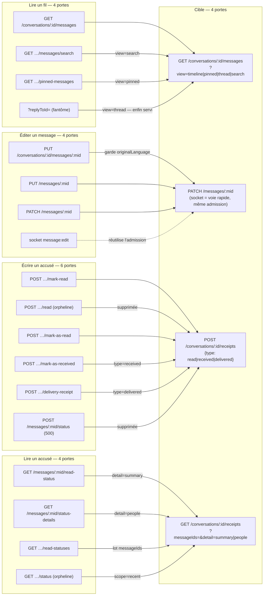

## Messagerie (`messaging`)

Sous-modules proposés : `messaging.messages` (le message et ses actes) · `messaging.threads` (la collection d'une conversation : chronologie, épinglés, fil de réponses, recherche) · `messaging.reactions` · `messaging.receipts` (accusés de réception et de lecture, consommations de médias) · `messaging.mentions`.

### Ce que la surface est aujourd'hui

Trente-sept routes REST portent la messagerie, réparties sur six fichiers (`routes/conversations/messages.ts`, `messages-advanced.ts`, `routes/messages.ts`, `routes/message-read-status.ts`, `routes/reactions.ts`, `routes/mentions.ts`), plus une douzaine d'événements Socket.IO qui doublent ou projettent ces routes. La surface n'a pas été conçue : elle a sédimenté par plateforme. **Éditer un message a quatre portes** (trois REST + un événement socket), **marquer une conversation comme lue en a trois**, **réagir à un message en a trois**, **lire les accusés en a quatre** — et à chaque fois les portes convergent sur la même écriture, la même loi d'admission et le même broadcast. Le partage est géographique, pas fonctionnel : iOS édite par `PUT /messages/:id`, Android par `PATCH /messages/:id`, le web par `PUT /conversations/:id/messages/:mid`, et le web édite aussi par socket. Sept routes n'ont aucun appelant sur aucun des trois clients.

Le second trait de la surface est que **la loi d'accès n'est pas une** : le plancher d'historique (`loadReaderHistoryFloor` / `applyHistoryFloor`, qui borne ce qu'un membre arrivé tardivement a le droit de voir) est appliqué par la liste, la recherche, les épinglés, `POST /conversations/:id/mark-read`, les mentions d'un message, `GET /conversations/:id/reactions` et `GET /conversations/:id/status` — et **ignoré** par `GET /messages/:messageId/translations`, `GET /mentions/me`, `GET /reactions/:messageId`, `POST /messages/:messageId/status`, `GET /messages/:messageId/status-details` et les deux routes de statut de pièce jointe. Cinq formes différentes du test d'appartenance cohabitent (`canAccessConversation`, `resolveCallerParticipant`, un `where` de relation dans le `select`, un `some()` en mémoire, une garde vivant dans le service).

| Route | Niveau | Auth | Débit | Poids | Consommée par | Verdict |
|---|---|---|---|---|---|---|
| `GET /conversations/:id/messages` | S3 | jwt-or-session | aucun | lourd | iOS, web, Android | à garder — devient la collection unique |
| `GET /conversations/:id/messages/search` | S3 | jwt-or-session | aucun | moyen | iOS, web, Android | à fusionner vers la collection (`?view=search`) |
| `GET /conversations/:id/pinned-messages` | S3 (jwt seul) | jwt | aucun | lourd | web | à fusionner vers la collection (`?view=pinned`) |
| `GET /conversations/:id/messages?replyToId=` | — | — | — | — | iOS (`ThreadRepliesLoader.swift:38`) | **fantôme** : paramètre non déclaré, ignoré |
| `POST /conversations/:id/messages` | S3 | jwt-or-session | aucun | moyen | iOS, web, Android | à garder — débit à poser |
| `GET /messages/:messageId` | S3 | jwt | aucun | lourd | iOS (NSE) | à garder — `fields`/`expand` |
| `PUT /conversations/:id/messages/:messageId` | S3 | jwt | aucun | moyen | web | à fusionner vers `PATCH /messages/:messageId` |
| `PUT /messages/:messageId` | S3 | jwt | aucun | moyen | iOS | à fusionner vers `PATCH /messages/:messageId` |
| `PATCH /messages/:messageId` | S3 | jwt | aucun | moyen | Android | à garder — devient la porte unique |
| `DELETE /conversations/:id/messages/:messageId` | S3 | jwt | aucun | léger | iOS, web | à fusionner vers `DELETE /messages/:messageId` |
| `DELETE /messages/:messageId` | S3 | jwt | aucun | léger | Android | à garder — devient la porte unique |
| `PUT /conversations/:id/messages/:messageId/pin` | S3 | jwt | aucun | léger | iOS, Android | à fusionner vers `PUT /messages/:messageId/pin` |
| `DELETE /conversations/:id/messages/:messageId/pin` | S3 | jwt | aucun | léger | iOS, Android | à fusionner vers `DELETE /messages/:messageId/pin` |
| `POST /conversations/:id/messages/:messageId/consume` | S3 | jwt | aucun | léger | iOS | à fusionner vers `POST /messages/:messageId/views` |
| `GET /messages/:messageId/translations` | S3 | jwt | aucun | moyen | iOS, web | à fusionner vers `GET /messages/:messageId?expand=translations` |
| `POST /reactions` | S3 | jwt-or-session | aucun | léger | iOS, Android | à fusionner vers `POST /messages/:messageId/reactions` |
| `DELETE /reactions/:messageId/:emoji` | S3 | jwt-or-session | aucun | léger | iOS, Android | à fusionner vers `DELETE /messages/:messageId/reactions?emoji=` |
| `GET /reactions/:messageId` | S3 | jwt-or-session | aucun | moyen | iOS, Android | à fusionner vers `GET /conversations/:id/reactions?messageIds=` |
| `POST /conversations/:id/messages/:messageId/reactions` | S3 | jwt | aucun | léger | **PERSONNE** | à supprimer |
| `DELETE /conversations/:id/messages/:messageId/reactions` | S3 | jwt | aucun | léger | **PERSONNE** | à supprimer |
| `GET /conversations/:id/reactions` | S3 | jwt | aucun | lourd | **PERSONNE** | à fusionner (borné) vers la lecture en lot |
| `GET /reactions/user/:userId` | S3 (auto) | jwt | aucun | moyen | **PERSONNE** | à déplacer vers `GET /me/reactions` (module `me`) |
| `POST /conversations/:id/mark-read` | S3 | jwt-or-session | **aucun** | léger | iOS, web | à fusionner vers `POST /conversations/:id/receipts` |
| `POST /conversations/:id/read` | S3 | jwt-or-session | aucun | léger | **PERSONNE** | à supprimer (alias auto-déclaré) |
| `POST /conversations/:conversationId/mark-as-read` | S3 | jwt-or-session | 30/min/user | léger | web, iOS, Android (`ConversationApi.kt:88`) | à fusionner vers `POST /conversations/:id/receipts` |
| `POST /conversations/:conversationId/mark-as-received` | S3 | jwt-or-session | 30/min/user | léger | iOS, web | à fusionner vers `POST /conversations/:id/receipts` |
| `POST /conversations/:cid/messages/:mid/delivery-receipt` | S3 | jwt-or-session | 30/min/user | léger | iOS (NSE) | à fusionner vers `POST /conversations/:id/receipts` |
| `POST /messages/:messageId/status` | S3 | jwt | aucun | léger | **PERSONNE** | à supprimer (branche `delivered` = 500) |
| `POST /conversations/:id/mark-unread` | S3 | jwt-or-session | aucun | léger | iOS, Android | à garder — renommée, broadcast à ajouter |
| `GET /messages/:messageId/read-status` | S3 | jwt-or-session | aucun | léger | iOS | à fusionner vers `GET /conversations/:id/receipts` |
| `GET /messages/:messageId/status-details` | S3 | jwt | aucun | moyen | web | à fusionner vers `GET /conversations/:id/receipts?detail=people` |
| `GET /conversations/:conversationId/read-statuses` | S3 | jwt-or-session | aucun | moyen | web | à fusionner vers `GET /conversations/:id/receipts` |
| `GET /conversations/:id/status` | S3 | jwt | aucun | lourd | **PERSONNE** | à fusionner vers `GET /conversations/:id/receipts?detail=people` |
| `GET /attachments/:attachmentId/status-details` | S3 | jwt | aucun | moyen | iOS | à garder — renommée `receipts`, plancher à poser |
| `POST /attachments/:attachmentId/status` | S3 | jwt | **aucun** | léger | iOS, web | à garder — renommée `views`, débit à poser |
| `GET /mentions/suggestions` | S3 | jwt | aucun | léger | iOS, web | à garder — débit à poser, paramètre legacy à retirer |
| `GET /mentions/messages/:messageId` | S3 | jwt | aucun | léger | web | à garder — renommée `GET /messages/:messageId/mentions` |
| `GET /mentions/me` | S2 (auto) | jwt | aucun | moyen | web | à garder — plancher + curseur à poser |

### Ce qui ne va pas

#### Doublons

1. **Quatre portes pour éditer un message.** `PUT /conversations/:id/messages/:messageId` (`messages-advanced.ts:231`), `PUT /messages/:messageId` (`messages.ts:479`), `PATCH /messages/:messageId` (`messages-advanced.ts:857`) et l'événement `message:edit` (`socketio/handlers/MessageHandler.ts`). Vérifié en ouvrant les quatre : elles appellent toutes `admitMessageEdit` + `admitEditedContent` et se terminent sur un `message:edited` — les trois portes REST en passant par `broadcastMessageMutation`, l'événement socket en émettant `SERVER_EVENTS.MESSAGE_EDITED` directement (`MessageHandler.ts:1036`, il n'appelle pas `broadcastMessageMutation`). Le doc-comment du `PATCH` s'annonce lui-même comme « alternative to `PUT /conversations/:id/…` ». **Une seule différence compte** : la forme longue est la seule à réécrire `originalLanguage` (canonicalisé par `normalizeLanguageCode`) et à servir `meta.conversationStats`. La fusion doit donc préserver `originalLanguage` comme champ de corps, pas supprimer la route qui le porte.
2. **Trois portes pour marquer lu.** `POST /conversations/:id/mark-read` (`messages.ts:1531`), `POST /conversations/:conversationId/mark-as-read` (`message-read-status.ts:195`) — mêmes `MarkReadBodySchema`, `markMessagesAsRead` et `broadcastReadStatus`, vérifié — et `POST /conversations/:id/read` (`messages.ts:1932`), dont le schéma Fastify dit en toutes lettres *« alias for mark-read endpoint »* et dont le corps n'est jamais lu. Aucun client n'appelle la troisième.
3. **Trois portes pour réagir**, dont une morte. `POST /reactions` (`reactions.ts:77`), `POST /conversations/:id/messages/:messageId/reactions` (`messages-advanced.ts:1292`) et `reaction:add`. Vérifié par `grep` sur les trois clients : **la forme imbriquée n'a aucun appelant** (iOS `ReactionService.swift:26`, Android `ReactionApi.kt:20` passent par la forme plate ; le web passe par le socket, `websocket.service.ts:421` / `use-reactions-query.ts:388`, donc `reaction:add` est bien vivant). Sa jumelle imbriquée `DELETE /conversations/:id/messages/:messageId/reactions` est morte elle aussi — deux routes REST à supprimer, pas deux portes de la triade ci-dessus. Les deux formes divergent pourtant : la plate admet les invités anonymes et traduit un fil clos en 410, l'imbriquée refuse les anonymes et retombe sur un 500. Supprimer l'imbriquée fait donc gagner la meilleure des deux politiques.
4. **Quatre lectures d'accusés** pour une même donnée à quatre granularités : `GET /messages/:id/read-status` (agrégat d'un message), `GET /messages/:id/status-details` (nominatif paginé d'un message), `GET /conversations/:id/read-statuses` (agrégat en lot), `GET /conversations/:id/status` (nominatif des 50 derniers). Une seule route paramétrée les couvre — et c'est l'occasion d'unifier leurs gardes, qui divergent (voir ci-dessous).
5. **Deux conventions pour retirer une réaction** : corps de requête sur `DELETE /conversations/:id/messages/:messageId/reactions`, segment d'URL percent-encodé sur `DELETE /reactions/:messageId/:emoji`. Les deux sont mauvaises — un corps sur `DELETE` est mal supporté, un emoji composé (ZWJ, modificateurs de teinte) produit un segment de chemin long et fragile.
6. **Le fil de réponses est un fantôme.** `ThreadRepliesLoader.swift:38` envoie `?replyToId=<parentId>` en expliquant dans son doc-comment que « the gateway filters server-side ». Le paramètre n'existe ni dans le schéma de la route (`messages.ts:361`) ni dans `MessagesQuery` (`routes/conversations/types.ts:63`) : il est silencieusement ignoré. **Ouvrir un fil de réponses sur iOS charge les 50 derniers messages de la conversation entière**, filtrés par personne.

#### Sécurité

7. **`GET /messages/:messageId/translations` (`messages.ts:1052`) sert `originalContent` — le texte intégral du message — sans plancher d'historique.** C'est le chemin le plus court pour lire l'historique interdit dès qu'on connaît un id de message, alors que `GET /messages/:messageId` rend 404 sous le plancher pour exactement le même contenu.
8. **`GET /mentions/me` (`mentions.ts:193`) sert le contenu intégral des messages sans plancher d'historique.** L'appartenance, elle, EST re-vérifiée — pas dans le handler mais dans le service : `MentionService.getRecentMentionsForUser` (`services/MentionService.ts:993`) filtre `message.conversation.participants.some({ userId, isActive: true })`, donc un utilisateur parti ou banni cesse bien de lire ces messages. Ce qui manque est le plancher : un membre arrivé tardivement lit par cette route le contenu intégral des messages d'avant son arrivée où il était mentionné.
9. **`GET /reactions/:messageId` (`reactions.ts:445`) teste l'appartenance sans `isActive`** : `include: { participants: true }` charge toutes les lignes `Participant` (dont `sessionTokenHash`) et un `some()` en mémoire accepte une ligne laissée derrière par un départ ou un bannissement. Toutes les autres portes du module filtrent `isActive: true`. Aucun plancher non plus, alors que sa jumelle `GET /conversations/:id/reactions` l'applique *en disant explicitement qu'une réaction révèle l'existence d'un message et l'identité de qui était là*.
10. **Le limiteur d'accusés est neutralisé en production.** `readReceiptWriteLimiter` (30/min, clé `user:<id>`) est *by-passé si `isLocalIp(request.ip)`* — or derrière Traefik en réseau Docker privé et sans `trustProxy`, `request.ip` est un `172.x`. Le seul débit du module ne s'applique donc à personne, et il ne protège de toute façon que trois des six portes d'écriture d'accusés.
11. **La limite de 20 messages/minute annoncée dans le `services/gateway/CLAUDE.md` (§ « Messages: 20/min per user ») et dans `services/gateway/decisions.md` n'existe pas.** `registerMessageRateLimiter` (`middleware/rate-limiter.ts:19`) n'est appelé nulle part en production (`grep` : seulement dans les tests). `POST /conversations/:id/messages` n'a aucun plafond par utilisateur.
12. **Le compte des épinglés fuit la cardinalité** : `GET /conversations/:id/pinned-messages` (`messages.ts:2397`) applique `applyPersonalHistoryHiding` au `total` mais **pas** `applyHistoryFloor` — un arrivant tardif voit un total qui inclut les épingles d'avant son plancher, et la pagination lui promet des pages vides.
13. **`POST /messages/:messageId/status` (`messages.ts:931`) n'a aucun plancher** et permet de faire avancer son curseur de lecture sur un message antérieur à son arrivée.
14. **`GET /conversations/:conversationId/read-statuses` (`message-read-status.ts:140`) n'a aucune borne de cardinalité** : `messageIds` est une chaîne CSV validée id par id, sans plafond. Un appel peut en demander des milliers.
15. **Oracle d'horodatage sur les curseurs** : `messages.ts:361` et `messages.ts:2764` résolvent `?before=` / `?cursor=` par `message.findFirst({ where: { id } })` **sans scope de conversation**. Un id volé à un autre fil sert de curseur et révèle donc son `createdAt`. Le mode `around`, lui, est correctement scopé.
16. **Épingler n'a aucune règle de rang** : tout participant actif peut épingler n'importe quel message et **dépingler l'épingle posée par un autre** (`messages.ts:2172` / `:2290`).
17. **`POST /…/consume` ne filtre pas `deletedAt`** (`messages.ts:2617`) : un message supprimé pour tous reste consommable et déclenche un `MESSAGE_CONSUMED`.

#### Bande passante

18. **Aucun `?fields=`, aucun `?expand=` nulle part.** Le client subit le `select` du serveur. Conséquences mesurées : `refreshPreview` (iOS, `ConversationListViewModel.swift:2246`) demande 5 messages complets — ~47 champs, `include_translations=true`, toutes langues — pour alimenter un survol de conversation (à confirmer : la vignette rend des `ThemedMessageBubble` entières, donc elle lit bien plus que l'aperçu textuel — attachments, réactions, compteurs de livraison, effets — et le gain d'un `?fields=` y est à mesurer, pas à supposer) ; `MessageService.edit` **rend** son `APIMessage`, mais ses deux appelants le jettent (`_ = try await`, `ConversationViewModel.swift:3720` et `OutboxDispatcher.swift:1116`), la vérité arrivant par le socket ; `MessageService.pin`, `unpin`, `delete` et les deux écritures de réaction ignorent 100 % de leur réponse.
19. **Le travail mort de la route la plus chaude.** Sur `GET /conversations/:id/messages` (`messages.ts:361`) : `currentUserConsumption` (une requête `attachmentStatusEntry.findMany` par page) et `currentUserReactions` (une requête `reaction.findMany` par page) sont calculés puis **supprimés à la sérialisation** — `messageSchema` ne les déclare pas. Et `?include_reactions=true` charge 20 réactions par message pour un champ `reactions` que le schéma ne déclare pas non plus : **le paramètre est inerte**. On paie trois requêtes par page pour rien.
20. **Une route sans aucune borne, deux bornées sans curseur.** `GET /conversations/:id/reactions` (`messages-advanced.ts:1161`) fait un `reaction.findMany` sur **toute** la conversation, sans `take` ni pagination, avec une jointure participant par ligne — sa jumelle `GET /conversations/:id/status` a dû être plafonnée à 50 messages (`CONVERSATION_STATUS_PAGE_SIZE`) pour exactement ce motif. `GET /reactions/user/:userId` (`reactions.ts:572`) est plafonnée — `ReactionService.getUserReactions` pose `take: 100` — mais sans curseur : au-delà de 100, le reste est inatteignable. `GET /mentions/me` n'a qu'un `limit` (plafonné à 100), sans curseur non plus.
21. **Le test d'appartenance coûte une conversation entière**, six fois : `messages.ts:931`, `:1117`, `:1183`, `:1247`, `messages-advanced.ts:857` et `reactions.ts:445` chargent `conversation → participants` (parfois via un triple `include` depuis l'attachment) pour lire une ligne. `mentions.ts:117` et `messages.ts:2617` chargent le document `Message` entier — contenu, traductions, blob chiffré — pour en lire deux colonnes.
22. **La recherche par traduction charge 200 messages pour en rendre 20** : `messages.ts:2764` prend `take: 200` avec le blob `translations` complet puis filtre en JavaScript. Coût constant quel que soit le nombre de résultats.
23. **Pagination par offset là où la liste se rafraîchit** : épinglés et `attachments/:id/status-details` repaient un `count()` en base à chaque page. `GET /messages/:id/status-details` est pire : il ne compte pas, il **construit la liste entière des participants puis la découpe en mémoire** (`results.slice(offset, offset + limit)`, `MessageReadStatusService.ts:2100`). `GET /mentions/me`, lui, n'a pas de pagination du tout — ni offset, ni `count()`, juste un `take`.
24. **Le débit d'accusés est sous-dimensionné, et le client le dit.** Le doc-comment de `ConversationSyncEngine._markAsReceivedTasks` (iOS, `ConversationSyncEngine.swift:184`, la table qui porte la fenêtre ouverte par `scheduleMarkAsReceived`) explique que la coalescence à 1 s existe parce que `mark-as-received` et `mark-as-read` **partagent un quota de 30/min qu'une conversation animée épuise seule, faisant rejeter des accusés de LECTURE que rien ne rejoue**. Trois autres émetteurs iOS ne passent pas par cette fenêtre.

#### Contrat

25. **Quinze routes du module n'ont aucun schéma de réponse déclaré** (`messages.ts:479`, `:780`, `:931`, `:1052`, `:1117`, `:1183`, `:1247`, `message-read-status.ts:87`, `:140`, `:195`, `:302`, `:386`, `mentions.ts:49`, `:117`, `:193`) — soit la totalité de `message-read-status.ts` et de `mentions.ts`, et sept des huit routes de `messages.ts` : la charge part entière, sans garde de sérialisation. `PUT /messages/:messageId` relit le message avec `findUniqueOrThrow` et sert **toutes** ses colonnes, `encryptedContent` et `metadata` compris.
26. **Défaut de forme inverse sur `POST /conversations/:id/read`** : le handler envoie `{ markedCount }`, le schéma 200 ne déclare que `success`, `fast-json-stringify` supprime `data`. Le client ne l'apprend jamais.
27. **Un 500 déterministe sur un appel valide** : `POST /messages/:messageId/status` accepte `status: 'delivered'` dans `MessageStatusBodySchema` mais **aucune branche ne le traite** — le handler sort sans `reply`, ce que Fastify 5 transforme en erreur. `timestamp` est déclaré au corps et jamais lu ; `isEdited` de `PUT /messages/:messageId` de même.
28. **`senderId` a deux significations.** `GET /conversations/:id/messages` le résout en `User.id` ; `GET /conversations/:id/messages/search` sert le `Participant.id` brut. Deux endpoints du même fichier, deux contrats.
29. **`mentionedAt` est fabriqué** : `mentions.ts:117` pose `new Date()` au lieu de lire la vraie date. Champ mensonger.
30. **Trois routes rendent des formes divergentes pour le même geste** : les clients iOS ont dû introduire `DiscardedReactionResponse` — un décodeur qui **ignore le corps par construction** (`init(from decoder:) throws {}`, `ReactionService.swift:48`) — parce qu'un décodeur strict levait un `DecodingError` sur une réponse 2xx pourtant valide et faisait compter un envoi réussi comme un échec. `SimpleAPIResponse` (`APIClient.swift:94`) est l'autre symptôme, plus doux : une enveloppe qui ne décode que `success`/`message`/`error` et laisse tomber `data`, quelle qu'en soit la forme.
31. **Côté client, `searchWithCursor` ne transmet pas `limit`** (`MessageService.swift:169`) : la page 2 d'une recherche n'a pas la taille de la page 1. Et `ConversationSyncEngine.fetchOlderMessages` (`:895`) est du **code réseau mort** — jumelle jamais appelée de `ConversationViewModel.loadOlderMessages`.

### La surface cible

Deux lois de géographie, qui suffisent à ranger tout le module :

- **Le conteneur porte les COLLECTIONS** — tout ce qui se pagine vit sous `/conversations/:conversationId/…`.
- **L'identifiant du message porte les ACTES** — tout ce qui mute ou lit UN message vit sous `/messages/:messageId/…`. Le `:conversationId` des formes longues actuelles est redondant : les gardes le dérivent déjà du message.

| Route cible | Remplace | Niveau | Débit (seuil + clé) | Paramètres | Gain |
|---|---|---|---|---|---|
| `GET /conversations/:conversationId/messages` | `GET …/messages`, `…/messages/search`, `…/pinned-messages`, le fantôme `?replyToId=` | S3 | 240/min · `user:<id>` ; **`view=search` : 30/min · `user:<id>`** | `view`, `q`, `parentId`, `cursor`, `direction`, `anchor`, `limit`, `updatedSince`, `fields`, `expand`, `languages`, `If-None-Match` | 4 lectures → 1 loi de plancher ; le fil de réponses existe enfin ; `total` supprimé (plus de `count()`) ; `fields`/`expand` remplacent 3 requêtes mortes par page |
| `POST /conversations/:conversationId/messages` | inchangé | S3 | **60/min · `user:<id>:conv:<cid>`** | corps inchangé | la limite annoncée devient réelle |
| `GET /messages/:messageId` | `GET /messages/:id`, `GET /messages/:id/translations` | S3 | 240/min · `user:<id>` | `fields`, `expand=translations\|attachments\|receipts`, `If-None-Match` | ferme la fuite d'historique n° 7 ; l'extension de notification ne paie plus `attachmentFullSelect` |
| `PATCH /messages/:messageId` (`methods: ['PATCH','PUT']`) | `PUT /conversations/:id/messages/:mid`, `PUT /messages/:id`, `PATCH /messages/:id` | S3 | 60/min · `user:<id>` | corps `{ content, originalLanguage? }` | 3 portes → 1 ; `originalLanguage` et `meta.conversationStats` préservés ; schéma de réponse enfin déclaré |
| `DELETE /messages/:messageId` | `DELETE /conversations/:id/messages/:mid`, `DELETE /messages/:id` | S3 | 60/min · `user:<id>` | — | 2 portes → 1 |
| `PUT /messages/:messageId/pin` | `PUT /conversations/:id/messages/:mid/pin` | S3 | 30/min · `user:<id>` | — | chemin cohérent avec les autres actes |
| `DELETE /messages/:messageId/pin` | `DELETE /conversations/:id/messages/:mid/pin` | **S3 + rang** | 30/min · `user:<id>` | — | dépingler l'épingle d'un autre demande le rang dans la conversation |
| `POST /messages/:messageId/views` | `POST /conversations/:id/messages/:mid/consume` | S3 | 60/min · `user:<id>` | — | `deletedAt` enfin filtré ; les invités de lien admis (ils reçoivent des vues uniques) |
| `POST /messages/:messageId/reactions` | `POST /reactions`, `POST /conversations/:id/messages/:mid/reactions` (morte) | S3 | 60/min · `user:<id>` | corps `{ emoji }` | garde la meilleure des deux politiques (anonymes admis, 410 sur fil clos) |
| `DELETE /messages/:messageId/reactions?emoji=` | `DELETE /reactions/:mid/:emoji`, `DELETE /conversations/:id/messages/:mid/reactions` (morte) | S3 | 60/min · `user:<id>` | `emoji` | ni corps sur `DELETE`, ni emoji composé dans un segment de chemin ; idempotence conservée pour l'outbox iOS |
| `GET /conversations/:conversationId/reactions` | `GET /reactions/:messageId`, `GET /conversations/:id/reactions` | S3 | 120/min · `user:<id>` | `messageIds` (≤100), `expand=people`, `cursor`, `limit`, `If-None-Match` | **lot** : N allers-retours → 1 ; borne posée sur un `findMany` aujourd'hui illimité ; `isActive` et plancher rétablis |
| `POST /conversations/:conversationId/receipts` | `mark-read`, `read`, `mark-as-read`, `mark-as-received`, `delivery-receipt`, `POST /messages/:id/status` | S3 | **120/min · `user:<id>`**, sans bypass `isLocalIp`, `trustProxy` activé | corps `{ type, messageIds?, caughtUpToMessageId?, language?, messageLanguages? }` | **6 écritures → 1** ; le 500 déterministe disparaît ; l'anti-spoof du `delivery-receipt` devient la loi commune ; le quota cesse d'étrangler les accusés de lecture |
| `GET /conversations/:conversationId/receipts` | `GET /messages/:id/read-status`, `…/status-details`, `…/read-statuses`, `GET /conversations/:id/status` | S3 | 120/min · `user:<id>` | `messageIds` (≤100), `detail=summary\|people`, `filter`, `cursor`, `limit`, `If-None-Match` | **4 lectures → 1** ; plancher + `filterReadReceiptVisible` appliqués partout (aujourd'hui : une route sur quatre) ; cardinalité bornée |
| `POST /conversations/:conversationId/unread` | `POST /conversations/:id/mark-unread` | S3 | 30/min · `user:<id>` | — | + `read-status:updated` diffusé (les autres appareils du lecteur ignorent aujourd'hui un `mark-unread`) |
| `GET /messages/:messageId/mentions` | `GET /mentions/messages/:messageId` | S3 | 120/min · `user:<id>` | `If-None-Match` | `mentionedAt` cesse d'être fabriqué ; `select` ciblé au lieu du document entier |
| `GET /mentions/suggestions` | inchangé, moins le paramètre legacy | S3 | **60/min · `user:<id>`** | `contextType`, `contextId`, `q`, `limit` | l'autocomplete `@` cesse d'être une porte sans débit ; `conversationId` retiré |
| `GET /me/mentions` | `GET /mentions/me` | S2 (auto-scope) + S3 par message | 60/min · `user:<id>` | `cursor`, `limit`, `updatedSince`, `fields` | ferme la fuite n° 8 (plancher appliqué ; l'appartenance l'est déjà, dans le service) ; curseur au lieu de `limit` seul |
| `POST /attachments/:attachmentId/views` | `POST /attachments/:attachmentId/status` | S3 | **240/min · `user:<id>`** (report de progression audio) | corps inchangé | débit posé ; plancher appliqué |
| `GET /attachments/:attachmentId/receipts` | `GET /attachments/:attachmentId/status-details` | S3 | 120/min · `user:<id>` | `detail`, `filter`, `cursor`, `limit` | curseur au lieu d'offset ; `filter` enfin validé ; plancher appliqué |

Hors module : `GET /reactions/user/:userId` (aucun appelant, auto-scopée) part vers `GET /me/reactions?cursor=` dans le module `me`.

**37 routes → 19.**

#### Schémas des routes non triviales

**`GET /conversations/:conversationId/messages`** — la collection unique.

```
?view       = timeline | pinned | thread | search       (défaut: timeline)
?q          = string                                     (view=search, requis)
?parentId   = messageId                                  (view=thread, requis)
?cursor     = curseur opaque signé sur (createdAt, id) ET SCOPÉ à :conversationId
?direction  = backward | forward | around                (défaut: backward)
?anchor     = messageId                                  (direction=around)
?limit      = 1..100                                     (défaut: 30)
?updatedSince = ISO8601 avec millisecondes               (ne rend que créés OU mutés depuis)
?fields     = liste blanche de champs de premier niveau
?expand     = replyTo | reactions | attachments | translations | receipts   (CSV, rien par défaut)
?languages  = CSV Prisme (filtre traductions texte ET audio)
If-None-Match: "<etag>"  →  304
```

```jsonc
{
  "success": true,
  "data": [ /* Message[] — champs restreints par ?fields, relations par ?expand */ ],
  "page": { "limit": 30, "hasMore": true, "nextCursor": "…", "prevCursor": "…" },
  "meta": { "userLanguage": "fr", "mentionedUsers": [ /* … */ ] }
}
```

`total` disparaît de toutes les vues : c'est un `count()` complet par page, et aucun client de production ne l'affiche. Le curseur opaque supprime l'oracle d'horodatage (défaut n° 15) parce qu'il **porte** la conversation au lieu de la déduire d'un id fourni. `?expand=reactions` remplace `?include_reactions=` — et, contrairement à lui, il est déclaré au schéma de réponse, donc il n'est plus inerte.

**`POST /conversations/:conversationId/receipts`** — l'écriture unique d'accusé.

```jsonc
// requête
{
  "type": "read" | "received" | "delivered",
  "messageIds": ["…"],                  // ≤ 200, optionnel
  "caughtUpToMessageId": "…",           // optionnel
  "language": "fr",                     // langue sous laquelle le lecteur a lu
  "messageLanguages": { "<messageId>": "fr" }   // ≤ 200
}
// réponse
{ "success": true, "data": { "type": "read", "markedCount": 12, "unreadCount": 0 } }
```

Gardes communes, aujourd'hui éparpillées : chaque `messageId` doit appartenir à `:conversationId` et ne pas être de l'appelant (généralisation de l'anti-spoof du seul `delivery-receipt`, la porte la mieux gardée du lot) ; le plancher d'historique s'applique ; `markedCount` a **une** définition (le nombre réellement figé), là où `mark-as-received` rend aujourd'hui le nombre de non-lus **avant** marquage.

**`GET /conversations/:conversationId/receipts`** — la lecture unique d'accusé.

```
?messageIds = CSV (1..100, requis sauf si ?scope=recent)
?scope      = recent            (les 50 derniers messages, comportement actuel de /status)
?detail     = summary | people  (défaut: summary)
?filter     = read | delivered  (detail=people)
?cursor= &limit=                (detail=people)
```

```jsonc
// detail=summary
{ "success": true, "data": { "<messageId>": { "recipientCount": 8, "deliveredCount": 6,
    "readCount": 3, "deliveredToAllAt": null, "readByAllAt": null } } }

// detail=people
{ "success": true,
  "data": [ { "messageId": "…", "participantId": "…", "userId": "…", "displayName": "…",
              "avatar": "…", "deliveredAt": "…", "readAt": "…" } ],
  "page": { "limit": 50, "hasMore": false, "nextCursor": null } }
```

`detail=people` passe systématiquement par `filterReadReceiptVisible` et par le plancher d'historique — les accusés nominatifs **sont** de l'historique, ce que seule `GET /conversations/:id/status` reconnaît aujourd'hui.

### Diagramme



### Migration

#### Ce qui casse

**iOS** — six sites. `MessageService.edit` (`PUT /messages/:id` → `PATCH /messages/:messageId`) ; `MessageService.delete` (forme longue → `DELETE /messages/:messageId`) ; `pin`/`unpin` (formes longues → `/messages/:messageId/pin`) ; `consumeViewOnce` (→ `/messages/:messageId/views`) ; `ReactionService.add`/`remove` (→ `/messages/:messageId/reactions`, l'emoji quittant le chemin pour un paramètre de requête — **gain net**, le percent-encodage `.urlPathAllowed` d'un emoji composé disparaît) ; `ConversationService.markRead` / `markAsReceived` et `PendingStatusQueue` / `PushDeliveryReceiptService` / `NSEDataSync.postDeliveryReceipt` (→ `POST /conversations/:id/receipts` avec un `type`). Les décodeurs `SimpleAPIResponse` et `DiscardedReactionResponse` peuvent redevenir typés une fois les schémas de réponse déclarés. `ThreadRepliesLoader` ne change pas d'URL mais **commence à fonctionner** (`?view=thread&parentId=`). À supprimer en même temps : `ConversationSyncEngine.fetchOlderMessages` (code réseau mort) et la surcharge dépréciée `MentionService.suggestions(conversationId:)`.

**Web** — cinq sites. `message.service.ts:36/:74` (édition et suppression par forme longue → formes courtes) ; `messages.service.ts:171/:188/:195/:261` (les quatre appels d'accusés → une porte) ; `messages.service.ts:202/:229` (les deux lectures d'accusés → une porte) ; `PinnedMessageBanner.tsx:92` (→ `?view=pinned&limit=1`) ; `MessageSearch.tsx:72` (→ `?view=search&q=`). Le web édite par socket sur le chemin nominal : `message:edit` ne change pas de nom et continue de réutiliser `admitMessageEdit`, donc **le chemin le plus chaud du web ne bouge pas**.

**Android** — quatre sites, les moins touchés parce qu'Android est déjà sur les formes courtes. `MessageApi.pin`/`unpin` (`MessageApi.kt:51`/`:57`, formes longues → courtes) ; `ConversationApi` `mark-unread` (`ConversationApi.kt:95` → `/unread`) ; `ConversationApi` `mark-as-read` (`ConversationApi.kt:88` → `POST /conversations/:id/receipts`, oublié de la première lecture qui n'attribuait cette porte qu'à iOS et au web) ; `ReactionApi.remove` (`ReactionApi.kt:23`, emoji du chemin vers la requête — supprime le `@Path("emoji", encoded = false)`, notoirement fragile en Retrofit). `MessageApi.edit` (`PATCH /messages/:id`) et `delete` **ne changent pas** : Android est déjà sur la porte cible.

**Personne ne casse sur** les sept routes orphelines (`POST /conversations/:id/read`, `GET /conversations/:id/status`, `GET /conversations/:id/reactions`, `GET /reactions/user/:userId`, `POST /messages/:messageId/status`, `POST`/`DELETE /conversations/:id/messages/:mid/reactions`) : elles se suppriment sans période de transition.

#### Ordre des étapes

1. **Supprimer les sept orphelines** et le paramètre legacy `conversationId` de `/mentions/suggestions`. Aucun alias, aucun risque — le fait est vérifié par `grep` sur les trois clients. Cela retire au passage le seul 500 déterministe du module.
2. **Poser les gardes manquantes sur les routes existantes, sans changer un seul chemin** : plancher d'historique sur `/messages/:id/translations`, `/mentions/me`, `/reactions/:messageId`, `/messages/:id/status-details` et les deux routes d'attachment ; `isActive` sur `reactions.ts:445` ; `deletedAt` sur `consume` ; `applyHistoryFloor` sur le `total` des épinglés ; bornes de cardinalité sur `read-statuses` ; `trustProxy` activé et bypass `isLocalIp` retiré du limiteur. **Étape sans coordination client** — elle ferme les six fuites avant que quiconque ne migre, et c'est la raison de la faire en premier.
3. **Déclarer les schémas de réponse manquants** (quinze routes) et corriger le défaut de forme de `POST /conversations/:id/read` avant sa suppression, pour que l'étape 4 parte d'un contrat gouverné.
4. **Monter les routes cibles en parallèle des anciennes** (double montage), avec `Deprecation` + `Sunset` sur les anciennes et un compteur par route dépréciée. Les anciennes deviennent des **alias** qui délèguent au nouveau handler — jamais des copies : la duplication de handler est exactement ce qui a produit quatre lois d'édition.
5. **Migrer les clients dans cet ordre : Android, puis iOS, puis web.** Android d'abord parce qu'il a quatre sites et qu'il est déjà sur deux des portes cibles ; le web en dernier parce que ses chemins chauds (envoi, édition, réaction) sont sur le socket et ne dépendent pas du calendrier REST.
6. **Retirer les alias** quand le compteur d'une route dépréciée est nul depuis deux versions publiées sur les trois plateformes — la version minimale supportée de l'app iOS étant le facteur limitant.
7. **Ajouter `?fields=` / `?expand=` en dernier**, une fois les chemins stabilisés : ce sont des ajouts purs (l'absence du paramètre garde le comportement actuel), donc ils ne doivent pas retarder les six étapes qui ferment des défauts.

#### Ce qui doit rester en alias

- `POST /conversations/:id/mark-read` et `POST /conversations/:conversationId/mark-as-read` : ce sont les deux écritures les plus fréquentes du produit et elles partent depuis **cinq chemins indépendants** côté iOS (store, widget, deux actions de notification, outbox) plus une file GRDB persistante. Un enregistrement d'outbox écrit par une version antérieure de l'app rejouera son ancienne URL après la mise à jour : l'alias doit survivre au moins une version majeure de plus que les autres.
- `POST /conversations/:cid/messages/:mid/delivery-receipt` : appelée par l'**extension de notification**, dont le cycle de mise à jour est celui de l'app mais dont les appels partent d'un processus qui ne partage pas la logique de repli du conteneur. Alias long, retrait en dernier.
- `GET /conversations/:id/messages/search` et `GET /conversations/:id/pinned-messages` : alias courts (une version), traduits en `?view=`. Ce sont des lectures — un alias raté y coûte un écran vide, pas une donnée perdue.
- `PUT /messages/:messageId` : déclaré sur la route cible via `methods: ['PATCH','PUT']` plutôt que par un alias séparé — c'est la forme déjà admise par la doctrine, et elle ne crée pas de second handler.
