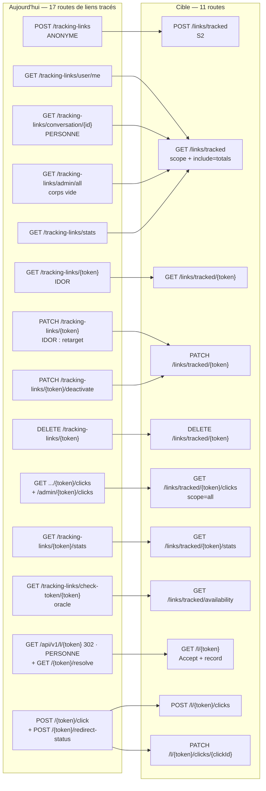

## Plateforme — santé, version cliente, maintenance, affiliation, liens tracés

### Ce que la surface est aujourd'hui

Trente-cinq routes, quatre familles qui n'ont en commun que d'être **la plomberie du produit** : ce qui dit si le service est vivant (`/health`, `/info`), ce qui dit si le binaire du client est encore admis (`/app/min-version`), ce qui permet à un exploitant d'observer et de réparer (`/api/v1/stats`, `/cleanup`, `/user-status`, `/status-metrics*`), et les deux moteurs de croissance qui fabriquent des liens publics (affiliation, liens tracés). C'est la tranche la plus exposée de l'API : **douze routes sur trente-cinq répondent sans authentification** (sept sans aucun middleware d'auth, cinq montées en `authOptional`, qui laisse passer l'appelant anonyme), dont **cinq qui écrivent en base** et une qui redirige un navigateur vers une URL arbitraire. C'est aussi la tranche où le plus de code tourne pour rien — **sept routes rendent structurellement des zéros, un corps vide ou un `200` mensonger**, vérifié handler par handler ci-dessous.

Le croisement avec les clients est net : la moitié observabilité/maintenance n'est appelée par **personne** (ni iOS ni web) sauf trois chemins `/health/*` que la page `app/admin/monitoring` du web appelle et **qui n'existent nulle part dans le gateway** (`grep '/health' services/gateway/src` ⇒ un seul montage, `route-registration.ts:114`). Les liens tracés sont le sous-module le plus consommé (iOS SDK `TrackingLinkService` + `TrackedLinkService`, web `services/tracking-links.ts` + `app/l/[token]` + `app/admin/tracking-links`). L'affiliation est consommée aux deux bouts par des écrans qui demandent chacun la route de l'autre. Android porte les modèles (`core/model/.../Affiliate.kt`) et n'appelle encore rien.

| Route | Niveau | Auth | Débit | Poids | Consommée par | Verdict |
|---|---|---|---|---|---|---|
| `GET /health` (racine) | S0 | aucune | **exemptée** du limiteur (`rate-limiter.ts:87`) | light (DB : `user.count()` complet) | sondes Docker/Traefik — aucun client | à fusionner vers `GET /health` (sans `count()`) |
| `GET /info` (racine) | S0 | aucune | global 300/min · seau planétaire | light | **PERSONNE** | à fusionner vers `GET /health?probe=identity` |
| `GET /health/ready` | — | — | — | — | web `monitoring.service.ts:16` | **fantôme** — n'existe pas → `GET /health` |
| `GET /health/metrics` | — | — | — | — | web `monitoring.service.ts:25` | **fantôme** → `GET /platform/metrics` |
| `GET /health/circuit-breakers` | — | — | — | — | web `monitoring.service.ts:34` | **fantôme** → `GET /platform/metrics` |
| `GET /api/v1/app/min-version` | S0 | aucune (délibéré) | global 300/min | light | **iOS seul** (`UpgradeGateController.swift:28`) | à fusionner vers `GET /app/gate` |
| `GET /api/v1/stats` | S5 | `authenticate` + `requireAdmin` | global | light (4 `count()`) | **PERSONNE** | à fusionner vers `GET /platform/metrics` |
| `POST /api/v1/cleanup` | S5 | idem | **aucun** | light | **PERSONNE** | à garder — renommée, auditée, avec comptes |
| `POST /api/v1/user-status` | S5 | idem | **aucun** | light | **PERSONNE** | à déplacer vers `PATCH /admin/users/{id}/presence` |
| `GET /api/v1/status-metrics` | S5 | idem | global | light | **PERSONNE** | à fusionner vers `GET /platform/metrics` |
| `POST /api/v1/status-metrics/reset` | S5 | idem | **aucun** | light | **PERSONNE** | à fusionner vers `DELETE /platform/metrics` |
| `POST /api/v1/affiliate/tokens` | S2 | `authenticate` + garde applicative | **aucun quota** | light | iOS (`AffiliateCreateView`) + web (`share-affiliate-modal:109`) | à garder + quota |
| `GET /api/v1/affiliate/tokens` | S3 (`createdBy`) | idem | global | light | iOS (`AffiliateView:333`, `WidgetPreviewView`) + web (`share-affiliate-modal:82`) | à garder — curseur + `include=totals` |
| `DELETE /api/v1/affiliate/tokens/:id` | S3 (borné dans le `where`) | idem | global | light | iOS (`AffiliateView:347`) | à garder |
| `GET /api/v1/affiliate/stats` | S3 | idem | global | **heavy**, `additionalProperties:true` | iOS (`AffiliatesViewModel:75`) + web (`use-contacts-data:114`) | à fusionner vers `GET /affiliate/referrals` |
| `GET /api/v1/affiliate/validate/:token` | **S0** | aucune | global · seau planétaire | light | web ×3 (`signup/affiliate/[token]`, `share-utils:129`, `api/metadata`) | à fusionner vers `GET /affiliate/link` |
| `GET /api/v1/users/:userId/affiliate-token` | S2 (tout compte, sur **n'importe qui**) | `authenticate` seul | global | light | web (`users.service.ts:300`) | à fusionner vers `GET /affiliate/link?userId=` |
| `POST /api/v1/affiliate/track-visit` | **S0**, écriture | aucune | global | light | **PERSONNE** | à fusionner vers `POST /affiliate/attributions` |
| `POST /api/v1/affiliate/click/:token` | **S0**, écriture | aucune | global | light | **PERSONNE** | à fusionner vers `POST /affiliate/attributions` |
| `POST /api/v1/affiliate/register` | S2 (référé = appelant) | `authenticate` | global | light | web (`use-registration-submit:114`) | à fusionner vers `PATCH /affiliate/attributions/{key}` |
| `POST /api/v1/invitations/email` | S2 | `authenticate` | 10/h **mais clé planétaire** | light | iOS SDK (`FriendService.swift:108`) + Android (`FriendApi.kt:42` → `FriendRepository.sendEmailInvitation`) | à garder — clé corrigée, oracle fermé |
| `POST /api/v1/tracking-links` | **S0** | `authOptional` | global | light | iOS (`CreateTrackingLinkView:173`) + web (`tracking-links.ts:113` via `create-tracking-link-modal:132`, `admin/tracking-links:178`) ; `link-parser.ts:201` déclare un 3e site, atteignable seulement par `replaceLinksWithTracking`, **qui n'a aucun appelant** | à fusionner vers `POST /links/tracked` (**S2**) |
| `GET /api/v1/tracking-links/:token` | S3 **conditionnel** | `authOptional` + `if (createdBy && …)` | global | light | **PERSONNE** | à fusionner vers `GET /links/tracked/{token}` |
| `GET /api/v1/tracking-links/:token/resolve` | S0 | `authOptional` (l'anonyme passe) | global | light | iOS (`TrackedLinkService:42`) + web (`app/l/[token]:308`) | à fusionner vers `GET /l/{token}` |
| `GET /api/v1/tracking-links/user/me` | S3 | `authenticate` | global | medium | iOS (`TrackingLinkService:19`) + web (`app/links/page:200`) | à fusionner vers `GET /links/tracked` |
| `GET /api/v1/tracking-links/conversation/:conversationId` | S3 participant | `authenticate` + participation | global | medium, **sans pagination** | **PERSONNE** (la constante `apps/web/lib/config.ts:236` la déclare mais n'est référencée nulle part) | à fusionner vers `GET /links/tracked?conversationId=` |
| `GET /api/v1/tracking-links/check-token/:token` | S2 (**oracle**) | `authenticate` | global | light | web ×2 (`admin/tracking-links:148`, `edit-tracking-link-modal:69`) | à fusionner vers `GET /links/tracked/availability` |
| `PATCH /api/v1/tracking-links/:token` | S3 **conditionnel** | `if (createdBy && …)` ; corps validé par le schéma JSON Fastify puis relu par simple cast (pas de Zod) | global | light | web (`edit-tracking-link-modal:141`) ; iOS déclaré, **aucun appelant** | à fusionner vers `PATCH /links/tracked/{token}` |
| `PATCH /api/v1/tracking-links/:token/deactivate` | S3 **conditionnel** | idem | global | light | web (`app/links/page:427` via `services/tracking-links.ts:175`) | à fusionner vers `PATCH /links/tracked/{token}` |
| `DELETE /api/v1/tracking-links/:token` | S3 **conditionnel** | idem | global | light | iOS (`TrackingLinkDetailView:396`) + web | à garder — garde mise dans le `where` |
| `GET /api/v1/tracking-links/stats` | S3 | `authenticate` | global | light | iOS (`TrackingLinkService:27`, 3 appels dans 2 hôtes : `TrackingLinksView:241,249`, `WidgetPreviewView:95`) | à supprimer → `GET /links/tracked?include=totals` |
| `GET /api/v1/tracking-links/:token/stats` | S3 **conditionnel** | idem | global | **heavy**, `additionalProperties:true` | web (`app/links/tracked/[token]:82` et `tracking-link-details-modal:51`) | à garder — bornée, déclarée |
| `GET /api/v1/tracking-links/:token/clicks` | S3 (**seule bornée dans le `where`**) | `authenticate` | global | **heavy, PII brute** | iOS (`TrackingDetailViewModel:422`) | à fusionner vers `GET /links/tracked/{token}/clicks` |
| `GET /api/v1/tracking-links/admin/all` | **S5 abaissé à ANALYST** | `requireAnalyticsPermission` | global | heavy | web (`admin/tracking-links:114`) — **répond `{"success":true}`** | à fusionner vers `GET /links/tracked?scope=all` |
| `GET /api/v1/tracking-links/admin/:token/clicks` | **S5 abaissé à ANALYST** | idem | global | heavy | web (`admin/tracking-links:209`) — **répond `{"success":true}`** | à fusionner vers `.../clicks?scope=all` |
| `GET /api/v1/l/:token` | S0, **302 vers URL arbitraire** | `authOptional` (l'anonyme passe) | global | light | **PERSONNE** (le lien publié est `${FRONTEND_URL}/l/<token>`) | à fusionner vers `GET /l/{token}` |
| `POST /api/v1/tracking-links/:token/click` | **S0**, écriture | `authOptional` | global | medium | iOS (`TrackedLinkService:51`) + web ×3 | à fusionner vers `POST /l/{token}/clicks` |
| `POST /api/v1/tracking-links/:token/redirect-status` | **S0**, écriture, **aucun middleware** | aucune | global | light | web (`app/l/[token]:237,249`) | à fusionner vers `PATCH /l/{token}/clicks/{clickId}` |

### Ce qui ne va pas

#### Sécurité

**1. Un raccourcisseur d'URL ouvert, adossé à cinq gardes conditionnées.** `POST /api/v1/tracking-links` (`routes/tracking-links/creation.ts:44`) est monté en `authOptional` : un appelant sans compte crée un lien de redirection hébergé sous le domaine Meeshy. Le lien ainsi créé porte `createdBy = undefined` (`creation.ts:152-157` : `createdBy` n'est posé que si `isRegisteredUser`). Or les cinq routes de gestion gardent par `if (trackingLink.createdBy && …)` — `creation.ts:283` (forme imbriquée), `:607`, `:686`, `:811`, `tracking.ts:536` — c'est-à-dire **une garde conditionnée à la présence de ce qu'elle garde**. Un lien sans créateur est donc lisible, modifiable, désactivable et supprimable par **n'importe quel compte**. Le plus grave est `PATCH /tracking-links/:token` (`creation.ts:704`) : changer `originalUrl` **redirige un lien déjà diffusé dans des messages** vers une cible choisie par un tiers. Une seule route de la famille fait ce qu'il faut — `GET /:token/clicks` (`tracking.ts:630`) borne par `findFirst({ where: { token, createdBy: userId } })` : la bonne forme existe déjà dans le fichier, appliquée à un sixième des routes.

**2. La déduplication rend le lien d'autrui.** `creation.ts:182-192` : `findExistingTrackingLink(originalUrl, conversationId)` (`services/TrackingLinkService.ts:226-241`) ne filtre **jamais sur le créateur** : son `where` ne porte que `originalUrl` + `isActive: true`, plus `conversationId` quand il est fourni. Un appelant **anonyme** qui poste `{"originalUrl":"https://exemple.com/x"}` reçoit, avec `existed:true`, le lien complet d'un tiers : jeton, campagne, UTM, compteurs. Puis, si ce lien est lui aussi anonyme, il peut le détourner (défaut 1). Découverte et prise de contrôle par la même requête.

**3. Deux oracles d'énumération sans frein par appelant.** `GET /tracking-links/check-token/:token` (`creation.ts:861`) teste l'existence de n'importe quel jeton de 2 à 50 caractères (les jetons émis en font 6) ; `GET /affiliate/validate/:token` (`affiliate.ts:466`) est **public et nominatif** — qui devine un jeton `aff_` + 8 caractères obtient `id, username, firstName, lastName, displayName, avatar` du parrain. Aucune des deux n'a de configuration de débit ; le seul frein est le limiteur global.

**4. Le limiteur global est une fiction sur toute cette tranche.** `registerGlobalRateLimiter` (`middleware/rate-limiter.ts`) génère la clé `global:${request.ip}`. Fastify tourne **sans `trustProxy`** derrière Traefik sur un réseau Docker : `request.ip` est l'IP du conteneur proxy, **identique pour tout le monde**. Les 300 req/min sont donc un seau **planétaire** partagé par l'API entière, et `skipOnError:true` le rend fail-open si Redis tombe. Conséquence directe ici : les douze routes du module joignables sans authentification n'ont, en pratique, **aucune limite par appelant**. Cas d'école, `POST /invitations/email` (`routes/invitations.ts:12`) est la seule route de la tranche à déclarer `{ max: 10, timeWindow: '1 hour' }` — sans `keyGenerator`, donc elle hérite la clé planétaire : **dix invitations par heure pour toute la plateforme**. La bonne intention, annulée par la clé.

**5. Trois écritures publiques falsifient les données d'autrui.** `POST /tracking-links/:token/click` (`tracking.ts:153`) accepte **trente champs de télémétrie dans le corps**, dont `ipAddress`, `country`, `deviceFingerprint`, stockés tels quels : les statistiques d'un tiers sont empoisonnables avec des IP inventées. La même route **rend le `trackingLink` entier** (`trackingLink: trackingLinkSchema` déclaré `tracking.ts:~220`, servi `tracking.ts:302`) à un appelant anonyme — exactement l'objet que `GET /tracking-links/:token` réserve à son créateur. `POST /affiliate/track-visit` (`affiliate.ts:600`) prend de même `visitorData` du corps sans jamais lire un en-tête, et `POST /affiliate/click/:token` (`affiliate.ts:774`) incrémente le compteur de n'importe quel jeton, sans identité ni déduplication.

**6. Les adresses e-mail des filleuls partent au parrain.** `AffiliateTrackingService.getAffiliateStats` (`services/AffiliateTrackingService.ts:266-292`) fait un `findMany` **sans `take`** sur `affiliateRelation` avec `include: { referredUser: { select: { …, email: true, … } } }`, et la route déclare `data: { type:'object', additionalProperties: true }` (`affiliate.ts:382`) : **rien n'est filtré**. Le périmètre est correct (`affiliateUserId: userId`, `:245` — le filtre `tokenId` du query ne peut pas en sortir, vérifié), mais la charge ne l'est pas. Trois listes non bornées (filleuls, ventilation, jetons) dans une seule réponse, dont une PII qu'aucun écran ne demande.

**7. Deux escalades de seuil.** `GET /tracking-links/admin/all` et `/admin/:token/clicks` sont gardées par `requireAnalyticsPermission` (`canViewAnalytics`) ⇒ **BIGBOSS, ADMIN, AUDIT, ANALYST**. Or la matrice que ce middleware interroge — celle du gateway, `services/admin/permissions.service.ts:118-119` — pose `ANALYST.canAccessAdmin = false` (celle de `packages/shared/types/index.ts:399-400` dit l'inverse : les deux divergent, et c'est celle du gateway qui décide) : un rôle sans accès au panneau d'administration lit ici les liens et les clics de toute la plateforme — IP, empreinte d'appareil, fuseau. Et **aucune des cinq routes d'exploitation n'écrit de journal d'audit**, alors que le `CLAUDE.md` du gateway pose « Admin audit trail required for all admin actions » : `POST /cleanup` détruit, `POST /user-status` fabrique une présence, `POST /status-metrics/reset` détruit de l'observabilité — sans trace de qui ni de quand.

**8. Une porte d'écriture sur une donnée gouvernée.** `POST /api/v1/user-status` (`routes/maintenance.ts:111`) écrit `isOnline`/`lastActiveAt` sur un `userId` arbitraire du corps. La présence est régie par `PresenceVisibilityService` (directive 2026-08-25) et cette route permet d'en **fabriquer** une, que les amis acceptés du sujet verront comme authentique.

#### Contrat — ce qui ment sur le fait

**`/info` ment sur trois points.** `route-registration.ts:151` publie `architecture.database: 'PostgreSQL + Prisma'` — le dépôt est sur **MongoDB 8** et le `CLAUDE.md` racine le dit explicitement ; c'est le document périmé recopié dans une réponse HTTP publique. Il publie `endpoints.translate: '/translate'` (aucune route `/translate` à la racine) et omet le préfixe `/api/v1` qui gouverne l'API entière. `version:'1.0.0'` est une constante en dur **dupliquée** dans `/health`.

**`POST /cleanup` répond toujours 200.** `MaintenanceService.cleanupExpiredData` enveloppe tout son corps dans un `try/catch` qui journalise et rend `void` (`:686-688`) : une panne Mongo au milieu de la première `deleteMany` produit quand même `200 « Nettoyage des données expirées terminé »`. Le 500 déclaré au schéma est **inatteignable**. La route ne rend **aucun compte** (`expiredAnonymousSessions.count` est journalisé, jamais servi) : l'appelant ne peut pas distinguer « rien à nettoyer » de « tout a échoué ». Et la description OpenAPI promet « stale attachments » alors que `cleanupOrphanedAttachments()` est privée et réservée au cycle journalier.

**`POST /user-status` répond 200 sur un utilisateur inexistant** (même motif d'erreur avalée, `MaintenanceService.ts:317-319`) et **recrache le `userId` fourni** dans son message, confirmant une identité qu'il n'a pas vérifiée. Le 404 déclaré est inatteignable.

**Trois racines, six routes qui rendent structurellement des zéros ou du vide.** (a) `GET /status-metrics` et son `reset` agissent sur `new StatusService(prisma)` construit **par le fichier de routes** (`maintenance.ts:28`) — une **troisième** instance, distincte de celle du serveur (`server.ts:246`, créditée à chaque requête authentifiée) et de celle du gestionnaire Socket.IO (`MeeshySocketIOManager.ts:308`). Les compteurs de la route ne sont jamais incrémentés : elle répond `{totalRequests:0, …}` à vie, et le garde-fou `totalRequests > 0 ? … : '0.00'` masque la division par zéro. Le `reset` est un no-op observable. (b) `maintenanceActive` de `GET /stats` lit `this.maintenanceInterval` sur l'instance construite au même endroit (`maintenance.ts:27`), tandis que seul le gestionnaire Socket.IO appelle `startMaintenanceTasks()` : le champ **ne peut pas** valoir `true`. Même racine pour `POST /user-status`, dont la diffusion `user:status` est morte deux fois : la route appelle `updateUserOnlineStatus(userId, isOnline)` **sans son troisième argument `broadcast`, qui vaut `false` par défaut** (`MaintenanceService.ts:297`), et de toute façon `setStatusBroadcastCallback` n'est câblé que sur l'instance du manager (`MeeshySocketIOManager.ts:347`). (c) `GET /tracking-links/admin/all` et `/admin/:token/clicks` déclarent `{success, trackingLinks, total}` **à la racine** alors que le handler envoie `sendSuccess(reply, {…})` ⇒ `{success, data:{…}}` : fast-json-stringify supprime `data`, la réponse réelle est **`{"success":true}`**. La page `app/admin/tracking-links` du web est câblée sur ces deux routes.

**Des compteurs calculés puis jetés.** `GET /stats` produit `onlineAnonymous` (`MaintenanceService.ts:861`) non déclaré au schéma : un `count()` Mongo sur `Participant` (`where: { isOnline, isActive, type:'anonymous' }`) payé à chaque appel pour une valeur supprimée à la sérialisation — c'est la quatrième des quatre requêtes de la route. `GET /status-metrics` fait de même avec `activityUpdates` et `connectionUpdates`, également absents du schéma ; ceux-là sont des compteurs en mémoire, donc gratuits — c'est le contrat qui ment, pas la base qui paie.

**La porte de version a deux moitiés qui ne se parlent pas.** `GET /app/min-version` (`routes/app.ts:12`) rend `{ minVersion }` **seul**, alors que le refus 426 posé sur la création de story (`routes/posts/core.ts:99-106`) rend `{ minVersion, storeUrl }`, `storeUrl` résolu par plateforme via `getAppStoreUrl` (`utils/appVersion.ts:5`). **Le serveur sait déjà résoudre l'URL du store et ne la sert pas au client qui doit monter l'écran bloquant** — iOS doit donc la connaître lui-même. Par ailleurs `MIN_APP_VERSION` absent ⇒ `minVersion: ''` traverse comme une valeur légitime : le client ne peut pas distinguer « pas de plancher » de « plancher mal configuré ».

**`GET /api/v1/l/:token` est un chemin mort.** `TrackingLinkService.buildTrackingUrl` (`:75-77`) publie `${FRONTEND_URL}/l/<token>` — une page Next (`apps/web/app/l/[token]/page.tsx`), pas cette route. Le lien annoncé aux utilisateurs ne passe jamais par la redirection du gateway, qui reste une redirection ouverte non consommée.

#### Bande passante

Aucun ETag utile, aucun `?fields=`, aucun `?expand=`, aucun curseur sur les onze listes du module. `/health` et `/info` reçoivent bien l'ETag du hook global `conditionalGetOnSend` (`utils/etag.ts:124`), mais `/health` porte `timestamp` et `uptime` : **l'ETag ne peut jamais matcher**, le 304 y est structurellement mort. `/app/min-version` est servi en `private, no-cache` alors que c'est une constante d'environnement lue **sur le chemin critique du démarrage à froid** de chaque client. Six `findMany`/`findFirst` chargent la ligne entière pour n'en lire qu'un champ ou n'en tester que l'existence (`creation.ts:517`, `:601`, `:680`, `:805` ; `affiliate.ts:818`, `:892`). `GET /tracking-links/conversation/:id` et les trois listes de `/affiliate/stats` n'ont **aucune borne**. Et côté sonde, `/health` exécute un `prisma.user.count()` **sans `where`** à chaque appel : une base lente — pas tombée, lente — fait échouer la sonde et redémarrer le conteneur. **La sonde de santé fabrique la panne qu'elle mesure.**

#### Ce que la surface impose aux clients

iOS appelle `GET /tracking-links/user/me` **et** `GET /tracking-links/stats` dans le même geste (`TrackingLinksView.swift:240-241`), alors que les quatre chiffres de la seconde sont des sommes de la première. Le détail d'un lien (`TrackingDetailViewModel:422`) redemande `link` que la liste vient de lui passer, et jette `total` — donc n'a jamais de pagination et calcule ses classements « top pays / top appareils » sur **les 50 premiers clics seulement, sans le dire**. Côté affiliation, l'inversion est complète : l'onglet Affiliés appelle `/affiliate/stats` pour n'en lire que `referrals` (1 champ sur 7), pendant que le tableau de bord appelle `/affiliate/tokens` pour recalculer à la main `totalTokens` et `totalReferrals` que `/affiliate/stats` sert déjà. **Les deux écrans veulent des moitiés opposées de la même réponse et appellent chacun la route de l'autre.**

### La surface cible

| Route cible | Remplace | Niveau | Débit (seuil + clé) | Paramètres | Gain |
|---|---|---|---|---|---|
| `GET /health` (racine) | `GET /health`, `GET /info`, fantôme `/health/ready` | S0 | exemptée (liveness) ; `probe=readiness` : 60/min · `health:ready:ip:{ip}` | `probe=liveness\|readiness\|identity` (défaut `liveness`) | supprime le `count()` du chemin de sonde ; l'identité de build devient cachable (ETag + `max-age=60`) ; `/info` cesse de mentir |
| `GET /app/gate` | `GET /app/min-version` | S0 | 120/min · `app:gate:ip:{ip}` | en-têtes `X-App-Version`, `X-App-Platform` ; `If-None-Match` | rend `storeUrl` que le serveur résout déjà pour le 426 ; `floor:null` explicite au lieu de `''` ; `max-age=300` retire un aller-retour du démarrage à froid |
| `GET /platform/metrics` | `GET /api/v1/stats`, `GET /api/v1/status-metrics`, fantômes `/health/metrics`, `/health/circuit-breakers` | **S5** `canAccessAdmin` | global | `scope=population,status,runtime,breakers` (défaut : tout), `instance` | 4 appels → 1 pour l'écran `admin/monitoring` ; branchée sur **l'instance vivante** ; chaque bloc porte `instanceId` |
| `DELETE /platform/metrics` | `POST /api/v1/status-metrics/reset` | **S5** + audit | 10/h · `platform:metrics-reset:account:{userId}` | `scope=` | un geste = un verbe ; le reset agit enfin sur les compteurs observés |
| `POST /platform/maintenance/cleanup` | `POST /api/v1/cleanup` | **S5** + audit | 5/h · `platform:cleanup:account:{userId}` | `targets=anonymousSessions,shareLinks,attachments`, `dryRun` | rend les **comptes** supprimés par cible ; l'échec redevient un 500 ; `dryRun` avant la purge |
| `PATCH /admin/users/{userId}/presence` | `POST /api/v1/user-status` | **S5** + audit (**sort du module**) | 30/min · `admin:presence-override:account:{userId}` | `{ isOnline }` | l'adresse dit enfin le privilège ; 404 réel ; diffusion `user:status` câblée sur l'instance vivante |
| `POST /links/tracked` | `POST /api/v1/tracking-links` | **S2** (fin de l'anonyme) | 30/h · `links:mint:account:{userId}` | corps `MintTrackedLink` | **ferme le raccourcisseur ouvert** ; `createdBy` toujours posé ⇒ les gardes conditionnées disparaissent ; déduplication bornée au créateur |
| `GET /links/tracked` | `GET /tracking-links/user/me`, `/conversation/:id`, `/admin/all`, `/tracking-links/stats` | S3 ; **S5** si `scope=all` | global | `scope=mine\|conversation\|all`, `conversationId`, `q`, `state`, `cursor`, `limit`, `updatedSince`, `include=totals`, `fields`, `If-None-Match` | 4 listes → 1 ; curseur au lieu de 4 `count()` ; `include=totals` supprime l'appel jumeau qu'iOS lance en parallèle |
| `GET /links/tracked/{token}` | `GET /tracking-links/:token` | S3 **dans le `where`** | global | `fields`, `expand=stats`, `If-None-Match` | ferme l'IDOR ; `expand=stats` évite le second appel du détail |
| `PATCH /links/tracked/{token}` | `PATCH /tracking-links/:token`, `PATCH /:token/deactivate` | S3 dans le `where` | 20/min · `links:edit:account:{userId}` ; **`originalUrl` : 3/j · `links:retarget:link:{token}`** | corps partiel validé par Zod | `isActive` redevient un champ, pas une route ; le **retarget** d'un lien déjà diffusé devient un geste rare, tracé et notifié |
| `DELETE /links/tracked/{token}` | idem | S3 dans le `where` | global | `?purge=true` réservé S5 | devient un **soft-delete** : les messages qui citent `m+<token>` cessent de pointer dans le vide |
| `GET /links/tracked/{token}/clicks` | `GET /:token/clicks`, `GET /admin/:token/clicks` | S3 ; **S5** si `scope=all` | global | `cursor`, `limit`, `from`, `to`, `fields` | **projection déclarée** : plus de ligne brute avec IP + empreinte ; curseur ; une seule loi pour les deux publics |
| `GET /links/tracked/{token}/stats` | idem | S3 dans le `where` | 60/min · `links:stats:account:{userId}` | `from`, `to` (fenêtre max 1 an), `If-None-Match` | schéma **déclaré** (fin de `additionalProperties:true`) ; agrégat cachable 60 s |
| `GET /links/tracked/availability` | `GET /tracking-links/check-token/:token` | S2 | **20/min · `links:availability:account:{userId}`** + 60/min · `…:ip:{ip}` | `token` | ferme l'oracle d'énumération ; une seule regex (celle du schéma) |
| `GET /l/{token}` | `GET /api/v1/l/:token`, `GET /tracking-links/:token/resolve` | **S1** | 600/min · `links:resolve:ip:{ip}` **et** 120/min · `links:resolve:token:{token}` | `Accept: text/html` ⇒ 302 · `application/json` ⇒ cible typée ; `?record=false` | un seul résolveur pour les deux formes de lien court (tracé **et** partage de conversation) ; le 302 du gateway et la page web cessent de diverger |
| `POST /l/{token}/clicks` | `POST /tracking-links/:token/click` | S1 | 60/min · `links:click:ip:{ip}:token:{token}` | corps **restreint** à ce que le client sait de lui-même | **`ipAddress`, `country`, `city` cessent d'être acceptés du corps** (dérivés de la requête) ; la réponse ne rend plus que `{ clickId, originalUrl }` |
| `PATCH /l/{token}/clicks/{clickId}` | `POST /:token/redirect-status` | S1 | 60/min · même clé | `{ status }` | le statut d'un clic devient un champ du clic ; un échec base cesse de se déguiser en 404 |
| `POST /affiliate/tokens` | idem | S2 | **10/j · `affiliate:mint:account:{userId}`** | corps `MintAffiliateToken` | borne l'émission ; `isActive` sert **une seule** définition (la colonne, plus le calcul local) |
| `GET /affiliate/tokens` | idem | S3 dans le `where` | global | `cursor`, `limit`, `state`, `include=totals`, `fields` | curseur ; `include=totals` sert le tableau de bord sans recalcul client |
| `DELETE /affiliate/tokens/{id}` | idem | S3 dans le `where` | global | — | inchangé (déjà la bonne forme) — devient soft-delete |
| `GET /affiliate/referrals` | `GET /affiliate/stats` | S3 | global | `tokenId`, `status`, `cursor`, `limit`, `include=totals`, `fields`, `If-None-Match` | **retire `email` des filleuls** ; schéma déclaré ; borne les trois listes ; sert les deux écrans qui appelaient chacun la route de l'autre |
| `GET /affiliate/link` | `GET /affiliate/validate/:token`, `GET /users/:userId/affiliate-token` | **S1** par `token` · **S2** par `userId` | 30/min · `affiliate:link:ip:{ip}` **et** 10/min · `affiliate:link:token:{token}` | `token=` **ou** `userId=` (exclusifs) | une relation lue dans les deux sens, un seul chemin ; le parrain n'est plus servi nominativement (`displayName` + `avatar`, jamais `firstName`/`lastName`/`username`) |
| `POST /affiliate/attributions` | `POST /affiliate/track-visit`, `POST /affiliate/click/:token` | **S1** | 30/min · `affiliate:visit:ip:{ip}:token:{token}` | `{ token }` — la télémétrie vient de la **requête** | une visite = un geste ; plus d'`ipAddress` fourni par l'appelant ; le clic sur un jeton inactif est compté et rendu `usable:false` |
| `PATCH /affiliate/attributions/{sessionKey}` | `POST /affiliate/register` | S2 (référé = appelant) | 5/j · `affiliate:convert:account:{userId}` | `{ token }` — **`referredUserId` disparaît** | le contrat cesse d'exiger un champ qu'il ignore ; la conversion est l'écriture d'un état sur une attribution existante |
| `POST /invitations/email` | idem | S2 | **10/h · `invite:email:account:{userId}`** + 3/h · `…:target:{sha256(email)}` | `{ email }` | la clé cesse d'être planétaire ; **202 systématique** ⇒ ferme l'oracle d'existence de compte ; l'envoi est persisté (aujourd'hui : 201 sans rien envoyer si `emailService` manque) |

**25 routes cibles pour 35 aujourd'hui**, aucune capacité perdue, trois chemins fantômes du web enfin servis, et une route (`PATCH /admin/users/{id}/presence`) déplacée vers le module d'administration parce que son adresse doit dire son privilège.

**Prérequis transverse, sans lequel la moitié de ce tableau est décorative** : activer `trustProxy` sur l'instance Fastify et faire porter les clés `:ip:` sur l'IP réelle du client. Tant qu'il manque, **toute clé `{ip}` proposée ci-dessus reste un seau unique planétaire** — c'est aujourd'hui ce qui annule le `10/h` de `/invitations/email`, et ce qui laisserait les six nouveaux limiteurs S1 sans effet.

#### `GET /health` — une sonde qui ne peut plus fabriquer la panne

```http
GET /health                    # liveness  — aucune I/O, aucun débit, aucune dépendance
GET /health?probe=readiness    # readiness — ping base (findFirst borné), translator, socket
GET /health?probe=identity     # identity  — build + capacités, ETag stable entre deux déploiements
```

```jsonc
// probe=readiness
{ "status": "ready",                       // ready | degraded | unavailable
  "checks": { "database":  { "status": "up", "latencyMs": 4 },
              "translator":{ "status": "down", "latencyMs": null },
              "websocket": { "status": "up", "connections": 812 } },
  "uptimeSeconds": 91234 }

// probe=identity — cachable : ni timestamp ni uptime
{ "service": "meeshy-gateway",
  "version": "1.4.2",                      // depuis package.json, plus de '1.0.0' en dur
  "build": { "commitShort": "979fd8e", "builtAt": "2026-08-28T09:11:02Z" },
  "apiPrefix": "/api/v1",
  "capabilities": { "websocket": "/socket.io/", "translation": true } }
```

Trois décisions portées par ce découpage. **La liveness ne touche plus la base** : `user.count()` disparaît du chemin de sonde, et le redémarrage de conteneur cesse d'être déclenché par une base *lente*. **`degraded` existe** : un translator absent n'est plus un `503` déguisé en `translation.status:'down'` sous un `status:'healthy'` — l'asymétrie actuelle est assumée nulle part. **Le compte d'utilisateurs sort de la réponse publique** ; il vit désormais dans `GET /platform/metrics?scope=population`, derrière S5, où il était déjà servi en double.

#### `GET /app/gate` — la porte qui se referme elle-même

```http
GET /api/v1/app/gate
X-App-Version: 1.2.0
X-App-Platform: ios
```

```jsonc
{ "success": true,
  "data": { "floor": "1.3.0",              // null si la porte est désarmée — plus de "" ambigu
            "blocked": true,                // le serveur tranche, le client n'implémente pas la comparaison
            "storeUrl": "https://apps.apple.com/app/meeshy",
            "reason": "below_floor" } }     // below_floor | none
```

`blocked` et `storeUrl` sont exactement ce que le refus `426` de `routes/posts/core.ts:99-106` compose déjà : **la même décision, servie au bootstrap au lieu d'être réinventée dans le client**. `compareAppVersions` cesse d'exister en deux exemplaires (serveur + Swift). Le `Cache-Control: public, max-age=300` + ETag rend le démarrage à froid gratuit sur les lancements rapprochés, sans jamais retarder de plus de cinq minutes une porte qu'on referme.

#### `GET /links/tracked` — la liste unique

```http
GET /api/v1/links/tracked?scope=mine&include=totals&cursor=eyJjIjoi…&limit=30
                         &fields=token,name,originalUrl,totalClicks,uniqueClicks,lastClickedAt
If-None-Match: "tl-9c21…"
```

| `scope` | Sélection | Niveau |
|---|---|---|
| `mine` *(défaut)* | `createdBy = moi` — remplace `GET /tracking-links/user/me` | S3 |
| `conversation` | `conversationId = …`, appelant participant — remplace `GET /tracking-links/conversation/:id` | S3 participant |
| `all` | toute la plateforme, `q` sur token/nom/URL — remplace `GET /tracking-links/admin/all` | **S5** `canAccessAdmin` |

```jsonc
{ "success": true,
  "data": [ { "token": "a7Kd2p", "name": "Lancement", "originalUrl": "https://…",
              "shortUrl": "https://meeshy.me/l/a7Kd2p", "isActive": true,
              "totalClicks": 412, "uniqueClicks": 301, "lastClickedAt": "…", "updatedAt": "…" } ],
  "meta": { "totals": { "totalLinks": 12, "activeLinks": 9,
                        "totalClicks": 3120, "uniqueClicks": 2044 } },
  "pagination": { "nextCursor": "eyJjIjoi…", "hasMore": true } }
```

`meta.totals` **supprime `GET /tracking-links/stats`**, que le SDK iOS lance systématiquement en parallèle de la liste (`TrackingLinksView.swift:240-241`) pour quatre chiffres qui sont des sommes de la page. Le `scope=all` remplace une route qui, aujourd'hui, répond `{"success":true}` à la page d'administration du web.

#### `GET /l/{token}` — un résolveur pour tout le namespace court

```http
GET /l/a7Kd2p
Accept: application/json          # ⇒ 200, cible typée (iOS DeepLinkRouter, page web /l/[token])
Accept: text/html                 # ⇒ 302 Location: <originalUrl>, Cache-Control: no-store
```

```jsonc
{ "success": true,
  "data": { "kind": "tracking",            // tracking | conversation
            "targetType": "external",
            "targetId": null,
            "originalUrl": "https://…",
            "usable": true,                 // isActive && !expiré — le client décide quoi en faire
            "clickId": "66f…" } }           // présent si le clic a été enregistré (record ≠ false)
```

Les deux routes fusionnées **ne faisaient pas la même chose**, et la fusion préserve la différence par paramètre : `GET /api/v1/l/:token` enregistrait un clic et redirigeait, sans jamais résoudre un lien de partage de conversation ; `GET /tracking-links/:token/resolve` résolvait les deux tables (`TrackingLinkService.resolveTarget`, repli `TrackingLink` → `ConversationShareLink`) **sans** enregistrer de clic. La cible fait les deux : elle résout les deux tables, et enregistre le clic sauf `?record=false`. iOS y gagne un aller-retour — `TrackedLinkService` lance aujourd'hui `resolve` puis `recordClick` en tâche détachée — et `sharerId` reste hors du schéma, comme aujourd'hui.

#### `GET /affiliate/referrals` — la route qui sert enfin les deux écrans

```http
GET /api/v1/affiliate/referrals?include=totals&status=completed&cursor=…&limit=30
```

```jsonc
{ "success": true,
  "data": [ { "id": "66f…", "status": "completed", "createdAt": "…",
              "referredUser": { "id": "66f…", "displayName": "Awa N.", "avatar": null },
              "token": { "token": "aff_x8k2…", "name": "Été 2026" } } ],
  "meta": { "totals": { "totalTokens": 4, "totalReferrals": 37, "totalVisits": 610,
                        "completedReferrals": 21, "pendingReferrals": 16,
                        "conversionRate": 0.061 } },
  "pagination": { "nextCursor": "…", "hasMore": true } }
```

`email`, `username`, `firstName` et `lastName` des filleuls **sortent de la charge** : le schéma est déclaré, `additionalProperties` passe à `false`. Le `meta.totals` est exactement ce que `WidgetPreviewView` recalcule aujourd'hui à la main depuis `/affiliate/tokens`, et le tableau `data` exactement ce que `AffiliatesViewModel` et `use-contacts-data` extraient aujourd'hui de `/affiliate/stats` en jetant six agrégats sur sept.

### Diagramme



### Migration

**Ce qui casse — iOS.** Dix symboles du SDK changent de chemin : `TrackingLinkService.listLinks/fetchStats/createLink/fetchClicks/deleteLink` (`packages/MeeshySDK/.../TrackingLinkService.swift:19,27,35,44,61`), `TrackedLinkService.resolve/recordClick` (`:42,51`), `AffiliateService.listTokens/fetchStats` (`:19,40`), `AppVersionFloorService.minVersion` (`UpgradeGateController.swift:28`). Trois d'entre eux **disparaissent** : `fetchStats` des liens tracés (remplacé par `include=totals`), `setActive` (aucun appelant de production, déjà mort) et la moitié agrégée de `AffiliateService.fetchStats`. Deux écarts de forme sont à corriger dans le même geste : la query embarquée dans le chemin (`listLinks`, `fetchClicks`) doit passer en `queryItems`, et le `{token}` interpolé sans percent-encoding doit être encodé. Gain immédiat pour l'app : la liste des liens tracés perd un aller-retour, le détail en perd un autre (`expand=stats`), et `GET /app/gate` supprime l'URL de store codée en dur côté client.

**Ce qui casse — web.** `services/tracking-links.ts` (6 méthodes HTTP : `getUserTrackingLinks`, `getTrackingLinkStats`, `createTrackingLink`, `recordTrackingLinkClick`, `deactivateTrackingLink`, `deleteTrackingLink`), `app/links/page.tsx` (3 appels : `user/me:201`, `deactivate:427`, `delete:445`), `app/l/[token]/page.tsx` (3 routes, 4 sites d'appel), `app/admin/tracking-links/page.tsx` (4 appels — **dont deux qui ne rendent rien aujourd'hui : cet écran se répare en migrant**), `components/links/edit-tracking-link-modal.tsx` (2), `components/links/tracking-link-details-modal.tsx` (1), `lib/utils/link-parser.ts` (2), `lib/share-utils.ts` (1), `hooks/use-contacts-data.ts` (1), `hooks/use-registration-submit.ts` (1), `components/affiliate/share-affiliate-modal.tsx` (2), `services/users.service.ts:300`, et `services/monitoring.service.ts` (3 appels **aujourd'hui en 404** ⇒ un seul `GET /platform/metrics`). Trois changements de comportement à assumer côté web : `POST /links/tracked` **exige une session** — les deux chemins de création vivants du web (`create-tracking-link-modal` → `services/tracking-links.ts:113`, et `admin/tracking-links:178`) tournent derrière une session ; le troisième site, `link-parser.ts:201`, envoie déjà un JWT ou un `x-session-token` et n'est de toute façon atteignable que par `replaceLinksWithTracking`, sans appelant ; la page `/l/[token]`, seul écran réellement anonyme, ne crée aucun lien ; `POST /l/{token}/clicks` **refuse `ipAddress`/`country`/`city`** du corps ; et `use-registration-submit.ts:114` cesse d'envoyer `referredUserId`, champ mort sur le fil depuis le correctif de la faille d'attribution.

**Ce qui casse — Android.** Rien. Aucun appel HTTP vers l'affiliation, les liens tracés ni la porte de version (`grep -E 'affiliate/|tracking-links|min-version' apps/android --include='*.kt'` ⇒ vide) ; la seule route du module qu'Android appelle est `POST /invitations/email` (`core/network/.../FriendApi.kt:42` → `FriendRepository.sendEmailInvitation`), dont l'adresse ne change pas dans la cible. Mais `core/model/.../Affiliate.kt` porte déjà la forme actuelle (`_count.affiliations`, `clickCount`, `isActive` calculé côté serveur) : **c'est le seul client dont le modèle peut être aligné avant tout appel**, donc le bon moment pour figer la forme cible est avant que la surface Android ne soit câblée.

**Ordre des étapes.**

1. **`trustProxy` d'abord.** Sans lui, aucun limiteur `{ip}` de ce document n'existe. Étape indépendante, sans rupture de contrat, à livrer seule et à mesurer (`request.ip` doit devenir distinct entre deux clients).
2. **Les correctifs sans changement d'adresse** — ils ferment les défauts durs et ne cassent aucun client : borner les cinq gardes `if (createdBy && …)` **dans le `where`** ; borner `findExistingTrackingLink` au créateur ; retirer `email` de `getAffiliateStats` et déclarer son schéma ; corriger les deux schémas `admin/*` qui suppriment `data` ; brancher `MaintenanceService`/`StatusService` des routes sur les instances vivantes ; faire remonter les erreurs de `cleanupExpiredData` et de `updateUserOnlineStatus`.
3. **Les nouvelles adresses en double montage**, sans alias inverse : `/links/tracked/*`, `/l/*`, `/affiliate/*`, `/platform/*`, `/app/gate`, `/health?probe=`. Les anciennes routes restent servies et gagnent `Deprecation: true` + `Sunset: <date>` + `Link: <…>; rel="successor-version"`.
4. **Migration des clients**, dans cet ordre : web `admin/monitoring` et `admin/tracking-links` (ils sont déjà cassés, ils ne peuvent que s'améliorer) ; puis iOS SDK ; puis les écrans web restants ; puis Android au moment du câblage.
5. **Fermeture** — trois catégories distinctes, à ne pas confondre. **Suppression immédiate** (aucun consommateur, aucun alias) : `GET /info`, `GET /api/v1/l/:token`, `GET /tracking-links/conversation/:id`, `POST /affiliate/track-visit`, `POST /affiliate/click/:token`, `GET /tracking-links/:token` — six routes que ni iOS ni le web n'appellent. **Alias longs (2 versions d'app, ~6 mois)** : `GET /app/min-version` et `POST /tracking-links` — les binaires iOS déjà distribués les appellent au démarrage et à la création, et un binaire installé ne se met pas à jour sur commande. **Alias courts (1 version)** : tout le reste.

**Ce qui doit rester en alias au-delà du reste.** `GET /app/min-version` : c'est la seule route que lit un client *périmé* ; la supprimer aveuglerait exactement la population qu'elle sert. Elle doit continuer à rendre `{ minVersion }` — la forme pauvre — tant qu'un binaire en circulation la lit, `GET /app/gate` servant la forme riche aux binaires neufs.

**Deux points à trancher par le porteur avant l'étape 3.** (a) **Fermer le raccourcisseur anonyme** est un changement de produit, pas seulement de sécurité : si un parcours non authentifié doit pouvoir raccourcir une URL, il faut lui donner un jeton de session plutôt qu'un `authOptional` — la porte anonyme ne peut pas rester ouverte telle quelle. (b) **`GET /affiliate/link?token=` reste un oracle par construction** : la page d'inscription par parrainage a besoin de dire « ce lien vient de X ». La cible réduit ce qui sort (`displayName` + `avatar`, jamais le nom civil ni le pseudo) et pose un débit par jeton ; le supprimer entièrement demanderait de repenser la page d'inscription, ce qui dépasse ce module.
