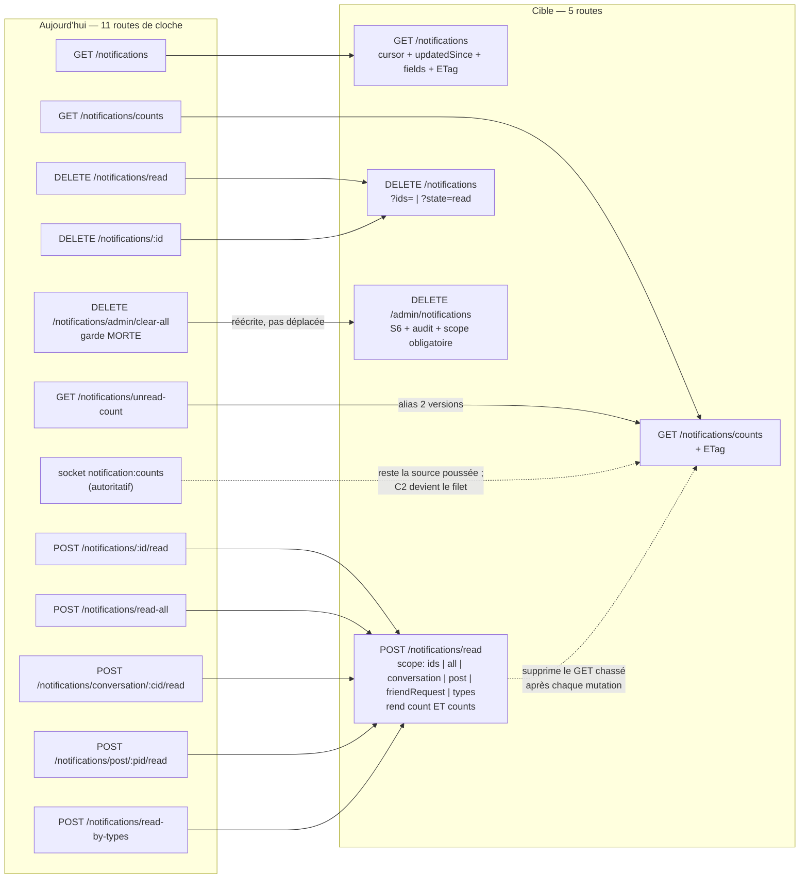

# Signals — notifications, push, appels, présence

## Ce que la surface est aujourd'hui

Le module *signals* est ce qui **atteint l'utilisateur quand il ne regarde pas** : la cloche, la bannière
APNs/FCM, la sonnerie d'un appel, la pastille verte d'un contact. Il pèse **38 couples (méthode, chemin)**
répartis sur sept fichiers de routes (`notifications.ts`, `push-tokens.ts`, `calls.ts`, `users/presence.ts`,
`friends.ts`, `users/devices.ts`, `maintenance.ts`) plus la fabrique de préférences, et il est doublé par **un canal
Socket.IO qui, pour les appels, est devenu la seule vérité** : `call:initiate`, `call:join`, `call:end`
sont émis par les trois clients, pendant que leurs jumelles REST (`POST /calls`, `POST /calls/:id/participants`,
`DELETE /calls/:id`) n'ont **aucun appelant** — trois routes d'écriture vivantes au sens du code, mortes
au sens du produit, et qui dérivent en silence.

Trois traits gouvernent la lecture du tableau. Premièrement, **la lecture d'un compteur unique passe par
trois portes** (`unreadCount` dans l'enveloppe de `GET /notifications`, `GET /notifications/counts`,
`GET /notifications/unread-count`) plus un quatrième canal socket (`notification:counts`) que le code
qualifie lui-même d'« autoritatif ». Deuxièmement, **« marquer lu » s'écrit par cinq verbes** alors que le
service ne contient qu'**une** implémentation paramétrée (`markContextNotificationsAsRead(userId, clé, valeur)`,
`NotificationService.ts:5434`). Troisièmement, **dix routes sur trente-huit n'ont aucun appelant sur
aucun des trois clients**, et **quatre appels écrits côté client visent une route que le gateway n'expose
pas** — dont l'enregistrement du jeton push d'Android.

| Route | Niveau | Auth | Débit | Poids | Consommée par | Verdict |
|---|---|---|---|---|---|---|
| `GET /notifications` (`notifications.ts:47`) | S3 | JWT, `where` ancré sur `visibleNotificationsWhere({userId})` | global 300/min **par IP-proxy** | medium — `findMany` **sans `select`**, ligne entière | iOS, web, Android | à garder (curseur + `fields` + ETag) |
| `GET /notifications/counts` (`:190`) | S3 | JWT | idem | light | web seul | à garder — **absorbe `/unread-count`** |
| `GET /notifications/unread-count` (`:261`) | S3 | JWT | idem | light, enveloppe **non standard** (`count` à la racine) | iOS, web, Android | à fusionner vers `GET /notifications/counts` |
| `POST /notifications/:id/read` (`:302`) | S3 | JWT + comparaison `userId` **dans le handler** | idem | light | iOS, web, Android | à fusionner vers `POST /notifications/read` |
| `POST /notifications/read-all` (`:363`) | S3 | JWT | idem | light | iOS, web, Android | à fusionner vers `POST /notifications/read` |
| `POST /notifications/conversation/:conversationId/read` (`:410`) | S3 | JWT | idem | light | iOS, web | à fusionner vers `POST /notifications/read` |
| `POST /notifications/post/:postId/read` (`:474`) | S3 | JWT | idem | light | iOS, web | à fusionner vers `POST /notifications/read` |
| `POST /notifications/read-by-types` (`:531`) | S3 | JWT | idem | light | iOS seul | à fusionner vers `POST /notifications/read` |
| `DELETE /notifications/read` (`:588`) | S3 | JWT | idem | light | web seul | à fusionner vers `DELETE /notifications` |
| `DELETE /notifications/:id` (`:632`) | S3 | JWT + comparaison dans le handler | idem | light | iOS, web, Android | à fusionner vers `DELETE /notifications` |
| `DELETE /notifications/admin/clear-all` (`:696`) | prétend S5 | **garde morte** : lit `request.user.role`, champ jamais peuplé | idem | destruction non bornée (`deleteMany({})`) | **PERSONNE** | à supprimer, ou à refaire en S6 + audit |
| `POST /users/register-device-token` (`push-tokens.ts:72`) | S3 | JWT + re-vérification `registeredUser` | idem | light | iOS seul (SDK + `VoIPPushManager`) | à fusionner vers `POST /me/devices` |
| `DELETE /users/register-device-token` (`:264`) | S3 | JWT | idem | light | **PERSONNE** (code mort iOS) | à fusionner vers `DELETE /me/devices` |
| `GET /users/me/devices` (`:355`) | S3 | JWT | idem | light, **liste non bornée** | **PERSONNE** | à garder → `GET /me/devices` (l'écran reste à faire) |
| `DELETE /users/me/devices/:deviceId` (`:427`) | S3 | anti-IDOR **dans la requête** (`deleteMany {id, userId}`) | idem | light | **PERSONNE** | à fusionner vers `DELETE /me/devices` |
| `GET /me/preferences/notification` (`preference-router-factory.ts:112`) | S3 | middleware hérité + re-test fail-closed | idem | 33 clés, aucun ETag | web seul — iOS n'appelle pas le GET par catégorie, il lit l'agrégat `GET /me/preferences` (`PreferenceService.swift:121`) | à garder (ETag) |
| `PUT /me/preferences/notification` (`:150`) | S3 | idem + consentement | **300 écritures/min sur un document** | light | web (`notifications/preferences/page.tsx:114`) | à garder (plafond d'écriture) |
| `PATCH /me/preferences/notification` (`:266`) | S3 | idem | idem | light | iOS, web | à garder |
| `DELETE /me/preferences/notification` (`:383`) | S3 | idem | idem | light | iOS | à garder |
| `POST /calls` (`calls.ts:108`) | S3 | `requiredAuth` **local** en `preValidation` | 5/min — **clé retombée sur l'IP-proxy** | medium | **PERSONNE** (le cycle de vie est socket) | à supprimer |
| `GET /calls/:callId` (`:241`) | S3 (participant **ou** membre de la conversation) | idem | 20/min, même défaut de clé | medium | iOS (`CallManager.checkVoIPCallFreshness`, `CallManager.swift:1578`, anti-appel-fantôme VoIP) | à garder + `?fields=status` |
| `GET /calls/:callId/transcript` (`:331`) | S3 **strict** (participant effectif) | idem | 10/min, même défaut | **heavy — aucun `take`, aucun curseur** | iOS | à garder (curseur + ETag) |
| `DELETE /calls/:callId` (`:453`) | S3 | idem | 10/min, même défaut | medium | **PERSONNE** | à supprimer |
| `POST /calls/:callId/participants` (`:610`) | S3 | **la route ne vérifie rien**, tout tient dans `joinCall` | 20/min, même défaut | medium | **PERSONNE** | à supprimer |
| `DELETE /calls/:callId/participants/:participantId` (`:736`) | S3 + plancher MODERATOR pour autrui | garde inconditionnelle + hiérarchie | 10/min, même défaut | medium | web (`calls.service.ts:37`) — **exclusion seule** | à garder |
| `GET /conversations/:conversationId/active-call` (`:974`) | S3 | garde d'appartenance explicite | 10/min, même défaut | medium | iOS (`ActiveCallService`, à chaque ouverture), web (`calls.service.ts:18`), Android (`ActiveCallApi.kt:20`) | à fusionner vers `GET /calls?state=active` |
| `GET /calls/active` (`:1073`) | S3 | `requiredAuth` seul | 10/min, même défaut | medium, **projection amputée** | **Android seul** (`ActiveCallApi.kt:25`) | à fusionner vers `GET /calls?state=active` |
| `GET /calls/history` (`:1160`) | S3 | idem + présence par `viewerFromRequest` | 10/min, même défaut | medium — **sert `peer.phoneNumber`** | iOS, Android | à fusionner vers `GET /calls` |
| `GET /users/presence` (`users/presence.ts:21`) | S2→S3 par la loi | `viewerFromAuthContext` + `PresenceVisibilityService` | 300/min IP-proxy, **plafond 200 ids** | medium | web seul | à garder → `GET /presence` |
| `POST /user-status` (`maintenance.ts:111`) | S5 déclaré | `requireAdmin` = `requireRole(['BIGBOSS','ADMIN'])` | aucun plafond propre — seul le global 300/min IP-proxy | light | **PERSONNE** | à supprimer |
| `POST /friend-requests` (`friends.ts:31`) | S2 | JWT ; **aucune garde d'auto-ajout, ni de blocage** | aucun plafond d'écriture propre — seul le global 300/min IP-proxy | light — `findUnique` **sans `select`** sur `User` | iOS, web (4 sites), Android | à fusionner (union des gardes) |
| `GET /friend-requests/received` (`:186`) | S3 | JWT | idem | light | iOS, web, Android | à fusionner vers `GET /friend-requests` |
| `GET /friend-requests/sent` (`:284`) | S3 | JWT | idem | light | iOS, web, Android | à fusionner vers `GET /friend-requests` |
| `PATCH /friend-requests/:id` (`:382`) | S3 | anti-IDOR dans la requête | idem | medium (jusqu'à 8 requêtes) | iOS, web, Android | à garder (`action=`) |
| `DELETE /friend-requests/:id` (`:637`) | S3 | anti-IDOR dans la requête | idem | light | iOS, web, Android (`FriendApi.kt:39` → `ContactsViewModel.kt:115`) | à fusionner vers `PATCH … action=cancel` |
| `GET /users/friend-requests` (`users/devices.ts:79`) | S3 | JWT + `gateFriendRequestPresence` | idem | medium — `include`, présence chargée pour tous | iOS, web (`?status=accepted`) | à fusionner vers `GET /friend-requests` |
| `POST /users/friend-requests` (`:202`) | S2 | JWT + **garde d'auto-ajout** + e-mail | idem | light | **PERSONNE** | à fusionner (c'est **elle** qui porte les bonnes gardes) |
| `PATCH /users/friend-requests/:id` (`:371`) | S3 | garde par ACTION (sender/receiver) | idem | medium | **PERSONNE** | à fusionner vers `PATCH /friend-requests/:id` |

**Quatre appels écrits côté client visent une route que le gateway n'expose pas** (fantômes vérifiés,
`grep` vide côté gateway) — l'un d'eux tombe sur une route voisine plutôt qu'en 404, un autre n'est
aujourd'hui appelé par personne :

| Appel client | Site | Ce qu'il rencontre |
|---|---|---|
| `POST /notifications/device-token` | `apps/android/.../PushTokenHandler.kt:25` → `NotificationApi.kt:42` | **404 — aucun appareil Android n'est enregistré pour le push** |
| `DELETE /notifications/device-token` | `NotificationApi.kt:45` | tombe sur `DELETE /notifications/:id` avec `id='device-token'` (`notifications.ts:632`, aucun `pattern` ObjectId au schéma) |
| `GET /friend-requests` | `use-contacts-data.ts:96`, `SearchPageContent.tsx:105`, `UserProfileContent.tsx:164` | **404** — seules `/received` et `/sent` existent (`friends.ts:186/284`) |
| `GET /users/:userId/notifications` | `apps/web/lib/server-cache.ts:203` (`getUserNotifications`) | route inexistante — mais la fonction n'a **aucun appelant** (vérifié : seule sa définition et une mention dans `PERFORMANCE_OPTIMIZATIONS.md`), donc aucune requête ne part aujourd'hui |

---

## Ce qui ne va pas

### Doublons

**1. Cinq verbes pour un geste, alors que le service n'en a qu'un.** `markAllAsRead`, `markConversationNotificationsAsRead`,
`markPostNotificationsAsRead`, `markNotificationsByTypesAsRead` sont tous, en base, le **même** update en masse
`{ userId, isRead:false, <prédicat> }` — `markConversationNotificationsAsRead` (`:5489`) et
`markPostNotificationsAsRead` (`:5501`) passent littéralement par
`markContextNotificationsAsRead(userId, contextKey, contextValue)` (`NotificationService.ts:5434-5478`,
vérifié : `$runCommandRaw` avec `q: { userId, isRead:false, ['context.'+clé]: valeur }`), pendant que
`markAllAsRead` (`:5394`) et `markNotificationsByTypesAsRead` (`:5616`) écrivent le même geste en
`prisma.notification.updateMany`. Le service porte même une **troisième** clé de contexte,
`friendRequestId` (`markFriendRequestNotificationsAsRead`, `:5517`), qui n'a **aucune route dédiée** : elle
n'est atteignable qu'en effet de bord de `PATCH /friend-requests/:id` (`routes/friends.ts:505`), jamais
comme geste explicite d'un client. La prolifération est côté HTTP, pas côté métier.

**2. Trois portes plus un socket pour un entier.** `GET /notifications` sert déjà `unreadCount` dans son
enveloppe (`notifications.ts:47`) ; `GET /notifications/counts` (`:190`) rend `{total, unread, byType}` qui
**contient** `GET /notifications/unread-count` (`:261`) ; et `notification:counts` (`emitCountsUpdate`,
`NotificationService.ts:5022`) pousse la même valeur, décrite ailleurs dans le dépôt comme « la seule
autorité sur les compteurs » (`packages/shared/decisions.md:169`, `NotificationListView.swift:471`).
Conséquence mesurée côté iOS : `unreadCount`
de l'enveloppe est **décodé et jamais lu** (`NotificationModels.swift:896`), et **quatre des sept sites de
mutation du `NotificationToastManager` chassent leur POST/DELETE d'un `GET /unread-count`**
(`:302`, `:412`, `:425`, `:497` ; l'appel réseau est en `NotificationToastManager.swift:188`) alors que la réponse du
POST porte déjà `count` — lui aussi jeté. Un geste « j'ouvre la conversation » coûte donc *POST read* +
*GET unread-count* + un `notification:counts` poussé : trois écritures du même compteur.

**3. Deux familles complètes de demandes d'ami, montées sur le même préfixe, aux gardes DIFFÉRENTES.**
Vérifié handler par handler : `routes/users/devices.ts:256` refuse l'auto-ajout (`senderId === receiverId → 400`)
et envoie l'e-mail en respectant `emailEnabled`/`contactRequestEnabled` (`:332-352`) ; `routes/friends.ts:31`
**ne fait ni l'un ni l'autre** (`grep` e-mail vide sur le fichier, aucune comparaison sender/receiver). Or
**c'est la version pauvre que les trois clients appellent**, et la version riche n'a **aucun appelant**
(`POST /users/friend-requests` orpheline). Résultat produit : on peut s'envoyer une demande à soi-même, et
**l'e-mail de demande d'ami n'est envoyé à personne en production**. Ce n'est pas un doublon cosmétique :
les deux moitiés du comportement voulu vivent dans deux routes dont une seule est branchée.

**4. Deux portes pour supprimer un jeton push.** `DELETE /users/register-device-token` (`push-tokens.ts:304-330`)
et `DELETE /users/me/devices/:deviceId` (`:468-475`) sont, vérification faite, **le même `pushToken.deleteMany
({ where: { userId, <sélecteur> } })`** ; seul le sélecteur change (`token` / `deviceId` / `id` / aucun = tout).
Aucune des deux n'a d'appelant.

**5. Le cycle de vie d'un appel est écrit deux fois.** `POST /calls`, `POST /calls/:id/participants`,
`DELETE /calls/:id` reproduisent `call:initiate`, `call:join`, `call:end` (`CallEventsHandler.ts`). Les
clients n'utilisent que le socket ; la moitié REST est du code mort **avec effets de bord** (invalidation
de cache Signal, `finalizeCallSummary`, diffusions), donc un candidat de premier ordre à la divergence
silencieuse. Seule exception vérifiée : `DELETE /calls/:callId/participants/:participantId`, employée par
le web **uniquement pour exclure quelqu'un** (`calls.service.ts:37`) — un geste qui, lui, n'a **pas**
d'équivalent socket.

### Sécurité

**6. La garde admin de `DELETE /notifications/admin/clear-all` est morte** (`notifications.ts:696`) : elle
teste `request.user.role`, or `createUnifiedAuthMiddleware` n'écrit que `{ userId, username, isAnonymous }`
— le champ n'existe que dans la déclaration de type. La route répond donc 403 **à tout le monde, BIGBOSS
compris**. Elle échoue fermé aujourd'hui, mais elle garde un `deleteMany({})` **sans aucun `where`** derrière
une condition qui deviendra vraie le jour où quelqu'un peuplera `request.user.role` — et aucun témoin ne
tombera. Aucun journal d'audit non plus.

**7. Les limiteurs de `calls.ts` sont inertes** — neuf routes les portent, via trois configs
(`initiate`, `join`, `operations`). `createRateLimitConfig` (`middleware/rate-limit.ts:132`)
calcule sa clé depuis `authContext.userId` — mais le hook de `@fastify/rate-limit` s'exécute en `onRequest`
alors que `requiredAuth` est posé en **`preValidation`** (`calls.ts:111`, `:244`, `:334`…). `authContext`
n'existe pas encore : la clé retombe **toujours** sur `ip:${request.ip}`, et le gateway tourne **sans
`trustProxy`** derrière Traefik (dit à voix haute par le doc-comment du fichier, `:113-119`). « 5 initiations
d'appel par minute » est donc un seau **unique pour toute la plateforme**. C'est exactement le défaut que le
commentaire affirme avoir corrigé.

**8. `GET /users/presence` a une branche fail-open écrite à la main** (`users/presence.ts:132`) : un id qui
n'est ni un `User` ni un `Participant` anonyme retourne `presenceMap.get(id) ?? false` **sans passer par le
gate**. Vérification faite, la fuite est aujourd'hui **inerte** — `connectedUsers` est clé par `userId`
(registered) ou par l'identifiant de session (anonyme), donc un id non résolu n'y figure pas et la branche
rend `false`. Mais c'est un **piège armé** au sens du dépôt : ce handler n'importe ni `presenceFor` ni
`presenceMissingEntryPolicy`, il réécrit la règle « entrée absente ⇒ masquée » à la main, et le premier
élargissement de la clé de présence l'ouvre.

**9. `POST /user-status` fabrique une présence, sans audit et sans effet.** Quatre défauts empilés
(`maintenance.ts:111`, `MaintenanceService.ts:297-319`) : aucune diffusion n'a lieu — la route appelle
`updateUserOnlineStatus(userId, isOnline)` **sans son troisième argument `broadcast`, dont le défaut est
`false`**, et l'instance `MaintenanceService` construite dans le fichier de routes ne porte de toute façon
aucun `statusBroadcastCallback` ; le service avale son erreur Prisma
donc un `userId` inexistant rend **200 « mis à jour »**, aucun journal d'audit n'est écrit sur une donnée
**gouvernée** par la directive présence, et `presenceChecker` (`server.ts:762`) écrase le flip base dès la
lecture suivante. Une route qui ment, sur une donnée de confidentialité, sans trace.

**10. `POST /users/register-device-token` désactive les jetons homonymes d'autrui** (`push-tokens.ts:72`,
`updateMany({ token, userId: { not: userId } })`) sans exiger la moindre preuve de possession de l'appareil :
présenter un jeton APNs valide d'un tiers **coupe ses push**. C'est la contrepartie assumée du cas « appareil
réattribué », mais elle mérite un plafond par jeton, pas seulement par compte.

**11. La désinscription du jeton au logout est annoncée et non appliquée.** `PushNotificationManager.unregisterDeviceToken()`
(`packages/MeeshySDK/.../PushNotificationManager.swift:185`) **n'a aucun appelant** ; `AuthManager.logout()`
(`Auth/AuthManager.swift:502`) appelle `resetSession()`, qui efface le Keychain **localement** — et dont le
doc-comment affirme pourtant que « le binding user↔token côté gateway est désinscrit ». Les deux moitiés de
la phrase sont fausses. Conséquence : après un logout, la passerelle continue de pousser les notifications
de l'**ancien** compte sur un appareil désormais connecté à un autre.

### Bande passante

**12. Aucun ETag sur tout le module** (`cacheability: aucun` sur les 38 routes). Trois cibles évidentes sont
perdues : `GET /notifications/counts` (interrogé après *chaque* mutation), `GET /me/preferences/notification`
(33 clés qui ne changent jamais), et surtout **`GET /calls/:callId/transcript`**, dont le journal d'un appel
**terminé est immuable** et qui part aujourd'hui **sans `take` ni curseur** : tous les segments, chacun avec
**toutes** ses traductions. C'est la charge la plus lourde du module et la seule non bornée.

**13. Aucun `?fields=` ni `?expand=` nulle part.** `GET /notifications` fait un `findMany` **sans `select`**
et le formateur jette ensuite une partie des colonnes — le client paie le transport de ce que le serveur
vient de décider d'ignorer. Symétriquement, `GET /calls/:callId` est appelé par iOS pour lire **un seul
champ** (`envelope.data?.status`, `CallManager.swift:1607`) et reçoit un `callSessionSchema` complet avec
participants imbriqués à trois niveaux. Et `GET /calls/active` sert la **même forme amputée** (ni `initiator`
ni `conversation` chargés) : la projection dépend aujourd'hui de la route, pas d'une demande du client.

**14. La pagination existe et n'est pas utilisée.** `GET /notifications` propose un curseur keyset ; iOS
refait de l'offset local et **incrémente `offset` de `limit` en dur** (`NotificationListView.swift:534`),
ce qui dérive sur une page partielle. `GET /calls/history` sert `nextCursor`/`hasMore` que le client
**construit puis jette** (`CallHistoryService.swift:59-63`, `CallsViewModel.loadCalls` appelant toujours `cursor: nil`). `/friend-requests/*` est en offset pur — donc un
`count()` complet à chaque page. Aucune route n'accepte `updatedSince`.

**15. Le filtre `missed` du journal d'appels repaie une page entière** (`CallsViewModel.loadCalls`) alors que
`.missed` est un sous-ensemble strict de `.all` déjà détenu, et que `APICallRecord` porte le statut.

**16. Trois chemins pour un même message entrant.** Sur un push, l'app émet `POST /conversations/:cid/mark-as-received`
(`PushDeliveryReceiptService.swift:80`) **pendant que la NSE émet `POST /conversations/:cid/messages/:mid/delivery-receipt`**
(`NSEDataSync.postDeliveryReceipt`, `NSEDataSync.swift:458`) : deux routes différentes pour le même fait, depuis deux processus. Et le drain
de la file de reçus est **séquentiel** (`flushPending`, plafond 200) : jusqu'à 200 allers-retours à la queue
leu leu au moment précis où l'app doit peindre son premier écran. *(La route de reçu appartient au module
messaging ; la contradiction se règle avec lui.)*

**17. La NSE retélécharge ce que l'app détient déjà.** Avatar de l'expéditeur et média du message sont
téléchargés à **chaque** notification (`NotificationService.swift:752`) ; le média du message est écrit dans le
`temporaryDirectory` de l'extension — donc invisible pour l'app — et l'avatar ne survit qu'en mémoire (il
alimente `INPerson.image`, jamais un `UNNotificationAttachment`). À confirmer sur trace : l'un comme l'autre
sont donc **retéléchargés** à l'ouverture de la conversation.
L'App Group est déjà utilisé par `nse_pending_*` : y écrire ces octets les rendrait réutilisables pour zéro
requête.

### Contrat

**18. Enveloppes non standard.** Six routes de notifications rendent `count` **à la racine**, hors de `data`,
contre la règle `sendSuccess` du dépôt (`:261`, `:363`, `:410`, `:474`, `:531`, `:588`) — chaque client paie
un décodeur spécial pour ces six-là.

**19. `POST /users/register-device-token` a deux validations qui se contredisent** (`push-tokens.ts:72`).
Le schéma Fastify déclare `required: ['token','platform']` alors que le Zod accepte `token` **ou** `apnsToken` :
la compatibilité `apnsToken` seule est **morte** (AJV rejette en 400 avant Zod, et `apnsToken` n'est même pas
dans `properties`). Pire, `type` porte `default: 'fcm'` et Fastify tourne avec `useDefaults` : **AJV écrit la
valeur dans le corps** avant le handler, l'inférence `body.type || (platform === 'ios' ? 'apns' : 'fcm')`
est un no-op, et **un client iOS qui omet `type` voit son jeton APNs enregistré en `fcm`**.

**20. `PATCH /friend-requests/:id` produit une conversation que le schéma supprime** (`friends.ts:382`) :
`(updatedRequest as any).conversation = conversation` n'est pas déclaré dans `friendRequestSchema`, donc
`fast-json-stringify` l'efface. Le client accepte une demande, ne reçoit jamais la conversation créée, et
doit la re-demander.

**21. `:conversationId` et `:postId` des routes de lecture ne sont pas validés en ObjectId** (`:410`, `:474`),
contrairement à toutes les routes `calls` du même lot — une chaîne arbitraire part dans le `where`.

**22. Asymétrie de contrat entre jumelles.** `/friend-requests/received` filtre `status:'pending'` **en dur** ;
`/friend-requests/sent` ne filtre rien (les refusées remontent) ; `/users/friend-requests` expose un `?status=`.
Trois réponses différentes à la même question selon la porte choisie.

---

## La surface cible

**Module** `signals`, quatre sous-modules : `signals.inbox` (la cloche), `signals.devices` (les cibles push),
`signals.presence`, `signals.calls`. Les préférences de notification restent gouvernées par
`identity.me.preferences` (fabrique générée, 4 verbes × 7 catégories) : je ne les fusionne pas, je leur
demande deux corrections. Les demandes d'ami restent `social.friends.requests` : elles ne sont pas un signal,
elles en **produisent** un — mais leur double famille se solde ici parce que c'est ici que le matériau la
documente.

**Vingt couples cibles pour trente-huit aujourd'hui.**

| Route cible | Remplace | Niveau | Débit (seuil + clé) | Paramètres | Gain |
|---|---|---|---|---|---|
| `GET /notifications` | `GET /notifications` | S3 | 120/min · `signals:inbox:{userId}` | `cursor`, `limit`, `types`, `unreadOnly`, `updatedSince`, `fields`, `expand=actor` + `If-None-Match` | 304 sur cloche inchangée ; `select` piloté par le client ; offset supprimé (plus de `count()`) |
| `GET /notifications/counts` | `/counts` + `/unread-count` + le champ `unreadCount` de l'enveloppe | S3 | 240/min · `signals:counts:{userId}` | `If-None-Match` | une porte au lieu de trois ; ETag sur la lecture la plus fréquente du produit |
| `POST /notifications/read` | `/:id/read`, `/read-all`, `/conversation/:id/read`, `/post/:id/read`, `/read-by-types` | S3 | 60/min · `signals:read:{userId}` | corps `{ scope }` (voir schéma) | 5 → 1 ; expose comme geste explicite la portée `friendRequestId`, aujourd'hui écrite mais atteignable seulement en effet de bord de `PATCH /friend-requests/:id` ; **plus d'oracle 404-vs-403** (le `userId` entre dans le `where`) ; rend `counts` ⇒ le `GET` chassé disparaît |
| `DELETE /notifications` | `DELETE /notifications/read`, `DELETE /notifications/:id` | S3 | 30/min · `signals:purge:{userId}` | `?ids=` (≤100) **ou** `?state=read` | 2 → 1 ; suppression en lot ; propriété filtrée **dans** la requête |
| `DELETE /admin/notifications` | `DELETE /notifications/admin/clear-all` | **S6** | 2/min · `admin:purge:{userId}` | `?userId=` obligatoire **ou** `?scope=platform` explicite | garde **vivante** (`requireAdminAccess`, qui lit `authContext.registeredUser.role`) + journal d'audit + `deleteMany({})` interdit sans `scope=platform` |
| `POST /me/devices` | `POST /users/register-device-token` | S3 | 10/min · `signals:device:{userId}` **et** 20/h · `signals:device:token:{sha256(token)}` | corps unifié (voir schéma) | ferme le déni de service par jeton d'autrui ; adresse honnête (un appareil appartient à `me`) |
| `GET /me/devices` | `GET /users/me/devices` | S3 | 30/min · `signals:device:{userId}` | `cursor`, `limit` (défaut 20) | liste bornée ; l'écran « mes appareils » devient possible |
| `DELETE /me/devices` | `DELETE /users/register-device-token`, `DELETE /users/me/devices/:deviceId` | S3 | 20/min · `signals:device:{userId}` | `?id=` **ou** `?token=` **ou** `?deviceId=` **ou** `?all=true` (obligatoire, pas de défaut destructeur) | 2 → 1 ; **c'est la route que le logout doit appeler** |
| `GET/PUT/PATCH/DELETE /me/preferences/notification` | inchangé (4 couples) | S3 | lecture 60/min · écriture **20/min** · `prefs:{userId}:notification` | + `If-None-Match` sur le `GET` | 300 écritures/min sur un document ⇒ 20 ; 304 sur 33 clés stables |
| `GET /calls` | `GET /calls/history`, `GET /calls/active`, `GET /conversations/:cid/active-call` | S3 | 60/min · `signals:calls:{userId}` | `state=active\|ended\|missed`, `conversationId`, `cursor`, `limit`, `expand=peer,participants,conversation`, `fields` | 3 → 1 ; la projection devient une **demande du client**, plus un accident de route ; `peer.phoneNumber` passe derrière `expand=peer` et une décision produit |
| `GET /calls/:callId` | inchangé | S3 (participant **ou** membre — écart assumé, voir ci-dessous) | 30/min · `signals:calls:{userId}` | `fields` | le contrôle anti-appel-fantôme iOS descend de ~2 Ko à ~40 octets (`?fields=status`) |
| `GET /calls/:callId/transcript` | inchangé | **S3 strict** (participant effectif seul) | 10/min · `signals:calls:{userId}` | `cursor`, `limit` (défaut 200), `fields`, `If-None-Match` | charge **bornée** ; 304 sur un appel terminé (journal immuable) |
| `DELETE /calls/:callId/participants/:participantId` | inchangé | S3 + plancher MODERATOR pour autrui | 10/min · `signals:calls:{userId}` | — | seule écriture REST vivante du domaine appel ; **nommer l'acteur de l'exclusion** — `CallParticipantLeftEvent` (`packages/shared/types/video-call.ts:493`) ne porte que `callId`/`participantId`/`userId`/`mode`, c'est-à-dire QUI part et jamais QUI l'a exclu |
| `GET /presence` | `GET /users/presence` | S2 (la loi filtre par lecteur) | 60 req/min **et** 3 000 ids/min · `signals:presence:{userId}` | `ids` (≤200), `If-None-Match` | applique `presenceFor` / `presenceMissingEntryPolicy` ⇒ **la branche fail-open disparaît** ; le coût réel (les ids) est limité |
| — *(supprimée)* | `POST /user-status` | — | — | — | une porte d'écriture non tracée sur une donnée gouvernée, sans appelant, sans effet |
| — *(supprimées)* | `POST /calls`, `DELETE /calls/:callId`, `POST /calls/:callId/participants` | — | — | — | trois routes mortes aux effets de bord vivants ⇒ fin de la divergence REST/socket |
| `POST /friend-requests` | `POST /friend-requests` + `POST /users/friend-requests` | S2 | **5/min et 20/jour** · `social:friendreq:{userId}` | corps `{ receiverId, message? }` | union des gardes : auto-ajout refusé, blocage bidirectionnel vérifié, compte désactivé refusé, **e-mail rebranché** ; premier plafond anti-spam du module |
| `GET /friend-requests` | `/received`, `/sent`, `GET /users/friend-requests` | S3 | 60/min · `social:friendreq:{userId}` | `direction=received\|sent\|any`, `status=`, `cursor`, `limit`, `expand=profile`, `If-None-Match` | 3 → 1 ; **rend réel le chemin que le web appelle déjà en 404** ; un seul contrat de statut au lieu de trois |
| `PATCH /friend-requests/:id` | `PATCH /friend-requests/:id`, `DELETE /friend-requests/:id`, `PATCH /users/friend-requests/:id` | S3 | 30/min · `social:friendreq:{userId}` | corps `{ action: accept\|reject\|cancel }` | 3 → 1 ; **rend la conversation créée** (déclarée au schéma) ; garde par action ; 404 indistinguable au lieu du 403 révélateur |

**Correction transverse, préalable à tous les débits ci-dessus :** poser l'authentification en **`onRequest`**
(le décorateur partagé `fastify.authenticate`), jamais en `preValidation`, sur `calls.ts` comme ailleurs.
Sans cela, aucune clé « par compte » ne se calcule et tous les seuils du tableau retombent sur l'IP du
conteneur Traefik — c'est-à-dire sur un seau unique pour la plateforme.

### Schémas des routes non triviales

**`POST /notifications/read`** — le prédicat devient une donnée, la loi reste au serveur.

```jsonc
// requête
{ "scope": { "kind": "ids",            "ids": ["6f3…", "6f4…"] } }   // ≤ 100
{ "scope": { "kind": "all" } }
{ "scope": { "kind": "conversation",   "id": "<ObjectId>" } }
{ "scope": { "kind": "post",           "id": "<ObjectId>" } }
{ "scope": { "kind": "friendRequest",  "id": "<ObjectId>" } }        // portée déjà écrite, jamais exposée en route
{ "scope": { "kind": "types",          "types": ["friend_request", "…"] } }  // 1..30

// réponse — le compteur revient AVEC l'écriture : plus aucun GET chassé
{ "success": true,
  "data": { "count": 7,
            "counts": { "total": 142, "unread": 3, "byType": { "post_like": 2, "mention": 1 } } } }
```

Le `where` est composé côté serveur à partir de `kind` **et** de `request.user.userId` : la propriété entre
dans la requête au lieu d'être vérifiée après lecture — l'oracle 404-vs-403 de `POST /notifications/:id/read`
disparaît, et le `findUnique` sans `select` qui chargeait la ligne entière pour lire un seul champ aussi.

**`POST /me/devices`** — un seul schéma, plus de contradiction AJV/Zod, plus de `default` qui écrit.

```jsonc
// requête — `token` requis, `type` DÉDUIT de `platform` par le serveur (aucun `default` au schéma)
{ "token": "…", "platform": "ios" | "android" | "web",
  "deviceId": "…", "deviceName": "…", "appVersion": "…", "bundleId": "…",
  "apnsEnvironment": "sandbox" | "production" }   // ignoré hors iOS

// réponse
{ "success": true, "data": { "id": "…", "platform": "ios", "type": "apns",
                             "deviceName": "…", "state": "created" | "refreshed" } }
```

`state` remplace `isNew`, aujourd'hui déduit de `createdAt === updatedAt` — fragile sur un upsert Mongo, et
de toute façon jeté par le client.

**`GET /calls`** — une ressource, trois états, une projection demandée.

```
GET /calls?state=active                                  → l'appel en cours du lecteur (reprise sur crash)
GET /calls?state=active&conversationId=<id>              → l'appel en cours de CETTE conversation
GET /calls?state=ended&expand=peer&cursor=…&limit=30     → le journal d'appels
GET /calls?state=missed                                  → filtre serveur, ou filtre local sur la page ci-dessus
```

```jsonc
// réponse
{ "success": true,
  "data": [ { "callId": "…", "conversationId": "…", "mode": "audio", "status": "ended",
              "direction": "outgoing", "startedAt": "…", "endedAt": "…", "durationSec": 92,
              "peer": { "userId": "…", "displayName": "…", "avatar": "…", "isOnline": false } } ],
  "pagination": { "limit": 30, "hasMore": true, "nextCursor": "…" } }
```

`peer.isOnline` continue de passer par `viewerFromRequest` → `PresenceVisibilityService` (aucun assouplissement).
`peer.phoneNumber` sort du corps par défaut : il ne revient que sous `expand=peer.contact`, et seulement si
une décision produit le justifie. Il n'est pas mort pour autant — iOS l'affiche dans la fiche d'appel
(`CallDetailSheet.swift:148`) — donc cet écran devra demander l'expansion explicitement, sans quoi le
numéro disparaît.

**`GET /presence`** — la loi partagée, pas une branche locale.

```
GET /presence?ids=a,b,c        (≤ 200)
→ { "success": true, "data": { "users": [ { "userId": "a", "isOnline": true, "lastActiveAt": "…" } ] } }
```

Toute entrée est résolue par `presenceFor(visibilityMap, id, viewer)` : **une entrée absente de la carte vaut
masquée**, sauf ADMIN/BIGBOSS — la règle du dépôt, importée, jamais réécrite. La branche `presenceMap.get(id) ?? false`
de `users/presence.ts:132` est supprimée.

### Ce que je ne fusionne PAS, et pourquoi

- **`GET /calls/:callId` et `GET /calls/:callId/transcript` gardent des gardes différentes.** La première
  autorise tout membre actif de la conversation (décision CVE-003 assumée : on doit pouvoir vérifier un appel
  qu'on n'a pas rejoint) ; la seconde exige d'avoir **effectivement participé**. C'est le bon arbitrage sur
  la donnée la plus sensible du module ; les fondre sous un `?expand=transcript` élargirait la garde du
  transcript à toute la conversation. Elles restent deux chemins.
- **`DELETE /calls/:callId/participants/:participantId` ne devient pas un événement socket.** Elle est
  vivante et elle est la seule écriture REST du domaine appel ; elle porte une **hiérarchie** (plancher
  MODERATOR, comparaison de rang) qu'aucun événement socket n'implémente. La supprimer avant d'avoir écrit
  son équivalent socket ferait perdre l'exclusion.
- **Les préférences de notification restent dans la fabrique `identity.me.preferences`.** Les fondre dans
  `signals` casserait la génération 4 verbes × 7 catégories pour ranger une catégorie ailleurs que ses six
  sœurs — un gain d'esthétique contre un coût de structure.
- **`POST /notifications/read` ne devient pas un événement socket**, malgré la tentation (le serveur pousse
  déjà `notification:read` sans qu'aucun événement client ne le déclenche). L'écriture doit survivre à une
  socket fermée et à une file hors-ligne rejouée ; c'est une écriture REST idempotente, pas un signal.

---

## Diagramme



---

## Migration

### Ce qui casse

**iOS** — huit méthodes du SDK deviennent quatre.
- `NotificationService.swift:23` (`unreadCount()`) → `counts()`. Le champ `count` racine disparaît au profit
  de `data.unread` : c'est un décodeur en moins, pas en plus.
- `NotificationService.swift:28/35/48/62/77` → une seule `markRead(scope:)`. Les sept appels de
  `NotificationToastManager` (`:298`, `:389`, `:405`, `:419`, `:493`, `:516`, `:661`) se rebranchent dessus, et **les quatre
  `await refreshUnreadCount()` qui en chassent quatre d'entre eux (`:302`, `:412`, `:425`, `:497`) disparaissent** — la réponse porte désormais `counts`.
- `NotificationService.swift:86` (`delete`) → `DELETE /notifications?ids=`. Gain immédiat : la suppression
  multiple devient un appel.
- `PushNotificationManager.swift:321/185` → `POST|DELETE /me/devices`, et **`logout()` doit appeler la
  seconde** (`AuthManager.swift:502`) : c'est la correction du trou de confidentialité, pas un renommage.
- `CallHistoryService.swift:54` et `ActiveCallService.swift:24` → `GET /calls?state=`. Le filtre `.missed`
  se fait alors localement sur la page `.ended` déjà détenue.
- `CallTranscriptRemoteService.swift:59` doit **paginer** (nouveau `nextCursor`) — c'est le seul changement
  qui demande du travail de vue, et c'est aussi le seul qui borne une charge aujourd'hui illimitée.
- `NotificationListView.swift:511/529` doit passer au **curseur** : l'offset incrémenté en dur disparaît, et
  avec lui la dérive sur page partielle.

**Web** — un 404 vivant se referme, un appel mort disparaît, et quatre sites de duplication se rangent.
- `use-contacts-data.ts:96`, `SearchPageContent.tsx:105`, `UserProfileContent.tsx:164` appellent déjà
  `GET /friend-requests` : **la route cible existe enfin**. Rien à changer côté appelant, sinon lire une
  réponse au lieu d'un `response.ok === false` silencieux.
- `lib/server-cache.ts:203` (`getUserNotifications`, `GET /users/:userId/notifications`) doit être **supprimé** : la route n'a jamais
  existé, et la fonction elle-même n'a aucun appelant — c'est du code mort des deux côtés.
- `notification.service.ts:217` (`unread-count`) et `:313` (`counts`) fusionnent en un appel ; `:227/248/259/273`
  fusionnent en `markRead(scope:)` ; `:283/292` en un `DELETE`.
- `hooks/v2/use-friend-requests-v2.ts:87/104/131` : **trois requêtes pour peupler un écran** deviennent une
  (`?direction=any&status=`). Les hooks legacy (`use-contacts-actions.ts`) sont retirés dans le même lot.
- `app/notifications/preferences/page.tsx:78/112` cesse de doubler `hooks/use-preferences.ts`.
- `calls.service.ts:37` est **inchangée** (l'exclusion reste).

**Android** — c'est lui qui casse le plus, parce que c'est lui qui est déjà cassé.
- `NotificationApi.kt:42/45` visent `notifications/device-token`, qui **n'existe pas** : le push Android
  n'est enregistré nulle part (`PushTokenHandler.kt:25`). Le passage à `POST|DELETE /me/devices` n'est pas une
  migration, c'est **la mise en service de la fonctionnalité**. À traiter en premier, indépendamment du reste.
- `NotificationApi.kt:29` (`unread-count`) → `counts` ; `:32/:36` → `POST /notifications/read` ; `:39` →
  `DELETE /notifications?ids=`.
- `FriendApi.kt:21/27` → `GET /friend-requests?direction=` ; `:39` (`DELETE`) → `PATCH … action=cancel`.
- `ActiveCallApi.kt:20/25` et `CallHistoryApi.kt:23` → `GET /calls?state=`. **Android est le seul consommateur
  de `GET /calls/active`** : la fusion ne peut pas être décidée sans lui (`/active-call`, lui, est lu par les trois).

### Ordre des étapes

1. **Fermer le push Android** (`POST|DELETE /me/devices` montés, `NotificationApi` recâblée). Aucun autre
   changement n'en dépend, et c'est une fonctionnalité absente, pas une dette.
2. **Corriger les gardes avant de bouger les chemins** — un chemin qui bouge cache un défaut qui reste :
   authentification en `onRequest` sur `calls.ts` (sinon tous les nouveaux seuils sont fictifs) ;
   `presenceFor` importé dans `users/presence.ts` ; `requireAdminAccess` + audit sur la purge ;
   suppression de `POST /user-status`.
3. **Monter les routes cibles en double** des actuelles, sans rien retirer. Chaque ancienne route répond
   `Deprecation: true` + `Sunset: <date>` + `Link: <cible>; rel="successor-version"`.
4. **Basculer les clients dans l'ordre de leur inertie** : web (déploiement continu) → Android → iOS
   (revue App Store). Les trois lisent la même cible avant qu'aucun alias ne tombe.
5. **Supprimer la surface d'écriture morte des appels** (`POST /calls`, `DELETE /calls/:callId`,
   `POST /calls/:callId/participants`) — vérifier une dernière fois par les journaux d'accès qu'elles sont
   à zéro requête sur 30 jours, puis les retirer avec leurs effets de bord.
6. **Retirer les alias**, un sous-module à la fois, en commençant par la cloche.

### Ce qui doit rester en alias

| Alias à conserver | Durée | Raison |
|---|---|---|
| `GET /notifications/unread-count` | 2 versions clientes | lu par les **trois** clients ; enveloppe non standard à ne pas reproduire dans la cible |
| `POST /notifications/:id/read`, `/read-all` | 2 versions | les trois clients ; une file hors-ligne rejouée peut porter l'ancien chemin **des semaines** après la mise à jour |
| `POST /notifications/conversation/:cid/read`, `/post/:pid/read` | 2 versions | iOS + web ; même argument de file hors-ligne (`OutboxDispatcher`) |
| `DELETE /notifications/:id` | 2 versions | les trois clients |
| `POST /users/register-device-token` | **3 versions** | seule porte d'enregistrement push iOS aujourd'hui : la couper avant qu'un binaire ancien ne soit éteint **supprime les notifications** de ses porteurs |
| `GET /calls/history` | 2 versions | iOS + Android |
| `GET /calls/active`, `GET /conversations/:cid/active-call` | 2 versions | Android seul pour la première ; iOS, web **et** Android pour la seconde — trois calendriers de déploiement |
| `GET /friend-requests/received`, `/sent`, `GET /users/friend-requests` | 2 versions | les trois clients ; `?status=accepted` sert la **liste d'amis**, une régression y serait très visible |
| `DELETE /friend-requests/:id` | 2 versions | iOS, web **et** Android ; rejouée depuis l'outbox iOS |
| `GET /users/presence` | 1 version | web seul, déploiement continu |

**Sans alias, retirées directement** (aucun appelant vérifié sur les trois clients) : `POST /calls`,
`DELETE /calls/:callId`, `POST /calls/:callId/participants`, `DELETE /users/register-device-token`,
`POST /users/friend-requests`, `PATCH /users/friend-requests/:id`, `POST /user-status`,
`DELETE /notifications/admin/clear-all`. Pour cette dernière, le retrait est **la** correction : elle
répond 403 à tout le monde aujourd'hui et garde un `deleteMany({})` sans `where` derrière une condition
qui deviendra vraie sans que personne ne s'en aperçoive.

### Le point qui doit être tranché par le porteur

`POST /friend-requests` devra **envoyer un e-mail** (comportement de la jumelle orpheline) et **refuser
l'auto-ajout**. Aujourd'hui, aucun client n'appelant la version riche, l'e-mail de demande d'ami n'est
envoyé à personne. Rebrancher le comportement voulu changera un volume d'e-mails sortants qui est
actuellement **nul** — c'est une décision produit, pas une correction technique, et elle appelle son
plafond (5/min et 20/jour par compte) dans le même lot.
