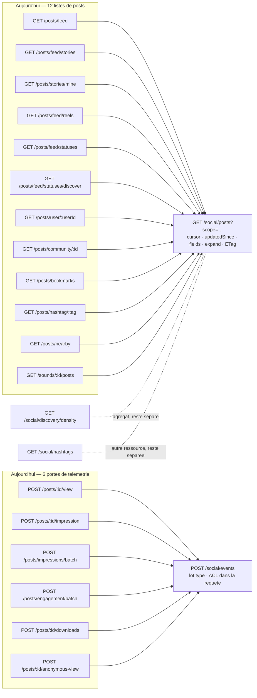

## Social — posts, commentaires, stories, statuts, sons, interactions

### Ce que la surface est aujourd'hui

Cinquante-trois routes REST, dont quarante-six servent **un seul objet** : la ligne `Post` (les sept
autres servent `Sound` et `Hashtag` — `/sounds/mine`, `GET`/`PATCH /sounds/:id`, les deux
`/stories/audio`, `/static/:filename`, `/hashtags/trending`). Une story, un réel, un
statut et un post sont le même document, distingué par sa colonne `type` — mais l'API les a
séparés en chemins. D'où la forme actuelle : **neuf routes de liste** dont six ne diffèrent que par
le nom de la méthode de service appelée (les trois autres — `feed/stories`, `stories/mine`,
`feed/reels` — ajoutent delta-sync, projection, tombstones ou `seed`), **six portes de
télémétrie de lecture** qui écrivent toutes « ce contenu a été vu », **trois portes de création**
(`POST /posts`, `POST /posts/from-attachment`, `POST /posts/:id/repost`), et **six routes de
commentaire dont le `:postId` du chemin n'est lu par personne** (vérifié : `comments.ts` ne lit
`request.params.postId` qu'aux lignes 65 et 157 ; les six autres handlers ne lisent que
`commentId`).

Aucune des cinquante-trois routes ne porte d'`ETag`. Aucune n'accepte `?fields=` ni `?expand=`.
Une seule projection allégée existe dans tout le module (`?projection=tray`, `feed.ts:64`) ; toutes
les autres listes servent `postInclude` en entier — auteur, médias avec transcriptions et cartes de
traduction, **les trois premiers commentaires avec LEURS médias**, et le `repostOf` complet avec ses
propres médias — soit, pour une page de vingt posts, jusqu'à soixante commentaires imbriqués que
personne n'affiche.

| Route | Niveau | Auth | Débit | Poids | Consommée par | Verdict |
|---|---|---|---|---|---|---|
| `POST /posts` | S2 | jwt | 10/min/compte | lourd | iOS + web | à fusionner vers `POST /social/posts` |
| `POST /posts/from-attachment` | S3 | jwt | 10/min/compte | lourd | iOS + web | à fusionner vers `POST /social/posts` (`source.attachmentId`) |
| `POST /posts/:postId/repost` | S3 | jwt | **aucun** | lourd | iOS + web | à fusionner vers `POST /social/posts` (`repostOf`) |
| `PUT /posts/:postId` | S3 | jwt | **aucun** | lourd | iOS + web | à garder → `PUT\|PATCH /social/posts/:postId` |
| `DELETE /posts/:postId` | S3 + S4 | jwt | **aucun** | léger | iOS + web | à garder |
| `GET /posts/:postId` | S2→S3 | jwt | global seul | lourd | iOS + web | à garder + ETag + `fields`/`expand` |
| `POST /posts/:postId/translate` | S3 | jwt | **aucun** (enfile un job ZMQ) | léger | iOS + web | à garder → `/translations` |
| `DELETE /posts/media/:mediaId` | S3 | jwt | **aucun** | léger | web | à garder → `/social/media/:mediaId` |
| `GET /posts/feed` | S2 | jwt | **aucun** | lourd | iOS + web | à fusionner vers `GET /social/posts?scope=home` |
| `GET /posts/feed/stories` | S2 | jwt | **aucun** | lourd | iOS + web | à fusionner (`scope=stories`) |
| `GET /posts/stories/mine` | S3 | jwt | **aucun** | lourd | iOS | à fusionner (`scope=stories.mine`) |
| `GET /posts/feed/reels` | S2 | jwt | **aucun** | lourd | iOS + web | à fusionner (`scope=reels`) |
| `GET /posts/feed/statuses` | S2 | jwt | **aucun** | moyen | iOS + web | à fusionner (`scope=statuses`) |
| `GET /posts/feed/statuses/discover` | S2 | jwt | **aucun** | moyen | iOS + web¹ | à fusionner (`scope=statuses&audience=public`) |
| `GET /posts/user/:userId` | S1 | **optionnel, échoue OUVERT** | **aucun** | lourd | iOS + web | à fusionner (`scope=author`) |
| `GET /posts/community/:communityId` | S1 | **optionnel, échoue OUVERT** | **aucun** | lourd | iOS (mort) + web | à fusionner (`scope=community`) |
| `GET /posts/bookmarks` | S3 | jwt | **aucun** | lourd | iOS + web | à fusionner (`scope=bookmarks`) |
| `GET /posts/hashtag/:tag` | S2 | jwt | **aucun** | lourd | iOS + web | à fusionner (`scope=hashtag`) |
| `GET /posts/nearby` | S2 | jwt | **aucun** ($geoNear par appel) | lourd | iOS | à fusionner (`scope=nearby`) |
| `GET /sounds/:id/posts` | S2 | jwt | 120/min | léger | iOS | à fusionner (`scope=sound`) — prérequis modèle² |
| `GET /posts/:postId/comments` | S3 | jwt | **aucun** | moyen | iOS + web | à fusionner vers `GET /social/comments?postId=` |
| `GET /posts/:postId/comments/:commentId/replies` | S3 | jwt | **aucun** | moyen | iOS + web | à fusionner vers `GET /social/comments?parentId=` |
| `POST /posts/:postId/comments` | S3 | jwt | 20/min/compte | moyen | iOS + web | à garder |
| `PATCH /posts/:postId/comments/:commentId` | S3 | jwt | **aucun** | léger | iOS | à fusionner vers `PATCH /social/comments/:commentId` |
| `DELETE /posts/:postId/comments/:commentId` | S3 | jwt | **aucun** | léger | iOS + web | à fusionner vers `DELETE /social/comments/:commentId` |
| `POST /posts/:postId/comments/:commentId/translate` | S3 | jwt | **aucun** | léger | iOS | à fusionner vers `/social/comments/:commentId/translations` |
| `POST /posts/:postId/comments/:commentId/like` | S3 | jwt | **aucun** | léger | iOS + web | à fusionner vers `POST /social/comments/:commentId/reactions` |
| `DELETE /posts/:postId/comments/:commentId/like` | S3 | jwt | **aucun** | léger | iOS + web | idem, verbe DELETE |
| `POST /posts/:postId/like` | S3 | jwt | 30/min/compte | léger | iOS + web | à fusionner vers `POST /social/posts/:postId/reactions` |
| `DELETE /posts/:postId/like` | S3 | jwt | **aucun** (asymétrie) | léger | iOS + web | idem, verbe DELETE |
| `POST /posts/:postId/bookmark` | **S2 — devrait être S3** | jwt | **aucun** | léger | iOS + web | à garder, **ACL à poser** |
| `DELETE /posts/:postId/bookmark` | S3 | jwt | **aucun** | léger | iOS + web | à garder |
| `POST /posts/:postId/pin` | S3 | jwt | **aucun** | léger | iOS + web | à garder |
| `DELETE /posts/:postId/pin` | S3 | jwt | **aucun** | léger | iOS + web | à garder |
| `POST /posts/:postId/view` | S3 | jwt | 60/min/compte | léger | iOS + web | à fusionner vers `POST /social/events` |
| `POST /posts/:postId/impression` | **S2 — aucune ACL** | jwt | **aucun** | léger | iOS + web | à fusionner vers `POST /social/events` |
| `POST /posts/impressions/batch` | **S2 — aucune ACL, ×50** | jwt | 30/min/compte | léger | iOS + web | à fusionner vers `POST /social/events` |
| `POST /posts/engagement/batch` | S2 | jwt | 20/min/compte | lourd (requête) | iOS | à fusionner vers `POST /social/events` |
| `POST /posts/:postId/downloads` | S3 | jwt | **aucun** | léger | web | à fusionner vers `POST /social/events` |
| `POST /posts/:postId/anonymous-view` | S1 | **publique** | 60/min mais **clé = IP du proxy** | léger | web | à fusionner vers `POST /social/events` (variante anonyme) |
| `POST /posts/:postId/share` | **S2 — aucune ACL** | jwt | **aucun** | léger | iOS + web | à garder → `/shares`, **ACL à poser** |
| `GET /posts/:postId/share` | S3 | jwt | **aucun** | léger | **PERSONNE** | **orpheline — à supprimer** |
| `GET /posts/:postId/views` | S3 (auteur) | jwt | **aucun** | moyen | iOS (mort) + web | à fusionner vers `GET /social/posts/:postId/viewers` |
| `GET /posts/:postId/interactions` | S3 (auteur) | jwt | **aucun** | moyen | iOS | idem (surensemble strict, vérifié) |
| `POST /posts/:postId/republish` | S3 (auteur) | jwt | **aucun** — et l'appel DÉTRUIT | lourd | iOS | à garder, **débit à poser** |
| `POST /stories/audio` | S2 | jwt | 20/min/compte | moyen | **PERSONNE** | **orpheline — à supprimer** |
| `GET /stories/audio` | S2 | jwt | 60/min/compte | moyen | iOS | à fusionner vers `GET /social/sounds?scope=public` |
| `GET /sounds/mine` | S3 | jwt | 60/min/compte | moyen | iOS | à fusionner vers `GET /social/sounds?scope=mine` |
| `GET /sounds/:id` | S2→S3 | jwt | 120/min/compte | léger | **PERSONNE** | à garder (la garde `isPublic` y vit) |
| `PATCH /sounds/:id` | S3 | jwt | 30/min/compte | léger | iOS | à garder |
| `GET /static/:filename` | **S2 — garde `isPublic` contournée** | jwt | 240/min/compte | lourd | clients (URL média)³ | à fusionner vers `GET /social/sounds/:soundId/stream` |
| `GET /posts/nearby/density` | S2 | jwt | **aucun** (pipeline le plus cher) | léger | iOS | à garder + ETag |
| `GET /hashtags/trending` | S2 | jwt | **aucun** | léger | iOS (mort) + web | à garder + ETag public |

¹ Le croisement automatique classe `statuses/discover` « web seulement » ; c'est un faux négatif —
`StatusService.list(mode: .discover)` la sert côté iOS, les deux chemins tenant dans un seul champ
du relevé. ² `SoundUsage.postId` est une chaîne nue sans relation Prisma vers `Post` : la fusion
suppose de créer la relation, sinon le curseur continue de paginer la mauvaise collection.
³ Faux orphelin du croisement : `DiskCacheStore.networkData` la sert comme URL média absolue.

**Frontière de module.** `ios-ios-social.json` embarque aussi les demandes d'amitié
(`/friend-requests`, `/users/friend-requests`, `/invitations/email`) et `POST /admin/reports`. Les
premières appartiennent au graphe social des identités, pas aux publications. La seconde est une
route d'**utilisateur ordinaire montée sous le préfixe ADMIN** (`routes/admin/reports.ts:52`, aucune
garde de rôle) : son adresse ment sur son niveau de privilège et elle sert sept types d'entités
(`message`, `user`, `conversation`, `community`, `post`, `story`, `sound`). Elle
doit sortir de `/admin/` — proposition : `POST /social/reports` pour les entités sociales, sous une
loi de signalement unique partagée avec les messages et les comptes.

### Ce qui ne va pas

**Doublons.**

- Neuf routes de liste, **six fois le même handler**. `feed.ts:21`, `:188`, `:212`, `:236`, `:261`,
  `:286` : même lecture d'`authContext`, même `FeedQuerySchema`, même
  `sendSuccess(items, { pagination })`. Seul le nom de la méthode de `PostFeedService` change. Les
  trois autres (`:47` stories, `:120` stories/mine, `:155` reels) parsent leur query à la main
  (`validatePagination`, `ReelFeedQuerySchema`) et portent en plus delta-sync, projection,
  tombstones ou `seed`. `/posts/feed/statuses` et `/posts/feed/statuses/discover` sont mot pour mot
  identiques à `getStatuses` / `getDiscoverStatuses` près.
- **Six routes de commentaire adressent leur cible par `commentId` seul.** Le `:postId` du chemin
  est décoratif — et le commentaire de `comments.ts:117` le dit : *« cette route n'adresse la cible
  que par `commentId`, donc le `:postId` du chemin peut nommer n'importe quel post public tout en
  visant le fil d'un post privé »*. La garde est correcte ; c'est l'adresse qui est un piège.
- **Trois portes de création.** `POST /posts` (`core.ts:440`), `POST /posts/from-attachment`
  (`core.ts:228`, ~200 lignes recopiées : traduction Prisme, `resolvePostMentions`,
  `finalReferences`, les trois branches de diffusion story/statut/post) et
  `POST /posts/:postId/repost` (`interactions.ts:1030`). `POST /posts` accepte de surcroît
  `repostOfId` : **le repost a deux portes**, dont l'une est plafonnée à 10/min et l'autre à rien.
- `GET /posts/:postId/interactions` est un **surensemble strict** de `GET /posts/:postId/views` —
  vérifié handler contre handler (`PostService.ts:2188` et `:2210`) : même `postView.findMany`, même
  `authorSelect`, même contrôle d'auteur, même `count`, plus une jointure `PostReaction`. Elles ne
  sont pourtant pas interchangeables côté client, parce que leurs items diffèrent (`avatar` contre
  `avatarUrl`, ligne brute contre ligne projetée). Deux routes auteur-seul pour une seule liste.
- **Six portes disent « ce contenu a été vu »** : `view`, `impression`, `impressions/batch`,
  `engagement/batch`, `anonymous-view`, `downloads` — trois sémantiques, quatre schémas de corps,
  quatre qualités de service. Côté iOS, ouvrir un détail émet `viewPost` **puis** `recordImpression`
  sur le même `postId`, coup sur coup (`PostDetailView:872`, `:873`).
- `pinPost` / `unpinPost` sont copiés-collés à un booléen près (`interactions.ts:821`, `:847`).
- **Deux canaux de sortie pour une intention — déjà refermé pour le ❤️ des posts.** Pour le ❤️ sur
  un POST/Réel, la porte socket émet l'événement canonique `post:liked` / `post:unliked` et NE
  ré-émet PAS `post:reaction-added` / `-removed` (`PostReactionHandler.broadcastReactionChange:106`,
  qui documente ce choix). La divergence subsiste pour les **autres emojis** et pour les
  **stories/statuts** : le socket y diffuse `post:reaction-added` / `-removed` vers la seule post
  room, là où la porte REST diffuse `post:liked` (ou `story:reacted` / `status:reacted`) vers les
  feed rooms ET la post room. Sur les **commentaires**, aucune unification : REST diffuse
  `comment:liked` (`comments.ts:587`), le socket `comment:reaction-added`
  (`CommentReactionHandler:198`). Un client abonné à un seul jeu rate alors la moitié des likes
  **selon le transport choisi par l'auteur du geste**.
- Et les deux portes du like n'écrivent pas la même chose : `PostService.likePost:1502` réécrit en
  plus la colonne dénormalisée **legacy** `post.reactions` (tableau JSON), que le chemin socket
  (`PostReactionService.updatePostReactionSummary:326`) ne touche jamais. Les deux maintiennent bien
  la source de vérité `PostReaction`, mais la colonne legacy diverge selon le transport.

**Sécurité.**

- **IDOR sur le favori.** `POST /posts/:postId/bookmark` (`interactions.ts:323`) ne filtre que
  `deletedAt` : tout compte authentifié met en favori n'importe quel post par son id — story
  `FRIENDS`, post `ONLY` dont il est exclu — et l'incrément de `bookmarkCount` le confirme à
  l'auteur. La route ignore de plus le `null` du service et répond `{ bookmarked: true }` sur un
  post inexistant : **elle affirme un effet qui n'a pas eu lieu**.
- **Aucune ACL sur l'impression**, unitaire (`interactions.ts:480`) comme en lot
  (`:543`, cinquante ids par appel). Le lot est le meilleur vecteur : `updateMany` ne lève pas sur
  un id inconnu, là où la route unitaire sort en 500 (P2025) — ce qui en fait au passage un
  **oracle d'existence** de post.
- **Aucune ACL sur le partage** (`interactions.ts:703`) : on peut frapper un `TrackingLink`
  `meeshy.me/l/<token>` — attribuable, persistant — vers le détail d'un post qu'on n'a pas le droit
  de lire.
- **La garde `isPublic` des sons est contournable.** `GET /sounds/:id` (`sounds.ts:113`) refuse un
  son privé d'autrui en 403 ; `GET /static/:filename` (`audio.ts:194`) sert le **fichier** sans
  rejouer cette garde. La confidentialité tient à l'imprévisibilité d'un UUID, pas à une loi.
- **Le middleware optionnel échoue OUVERT** sur `/posts/user/:userId` et
  `/posts/community/:communityId` (`feed.ts:236`, `:261`) : un JWT expiré est rattrapé et devient un
  contexte anonyme au lieu d'un 401. Aucune fuite (l'ACL retombe sur `PUBLIC`), mais le 401 devient
  inatteignable et une session morte reste invisible côté client.
- **Le débit de la vue anonyme ne garde rien.** `posts:view:ip:${request.ip}` avec Fastify sans
  `trustProxy` derrière Traefik : `request.ip` est l'IP du conteneur proxy. **Un seul seau de 60/min
  pour tous les visiteurs anonymes de la plateforme** — inefficace comme garde, et déni de service
  mutuel entre visiteurs légitimes.
- **Le plafond de création se contourne par le repost** : `POST /posts` est à 10/min,
  `POST /posts/:postId/repost` — qui crée pourtant un `Post` — n'a aucune configuration de route.
- **`POST /posts/:postId/republish` détruit sans plafond** (`interactions.ts:943`) : il supprime
  `postView`, `postReaction`, `postImpression`, remet sept compteurs à zéro, puis refanne la story
  dans tous les trays. Aucun débit de route.
- **La traduction à la demande n'a aucun plafond**, ni pour les posts (`core.ts:898`) ni pour les
  commentaires (`comments.ts:508`), alors que chaque appel enfile un job ZMQ vers le translator.
- `PATCH /posts/:postId/comments/:commentId` (`comments.ts:411`) et
  `DELETE /posts/:postId/comments/:commentId` (`:715`) sont les deux routes de commentaire
  **sans garde d'audience du post** : elles s'en remettent au seul contrôle d'auteur du service
  (`PostCommentService.updateComment:217`, `deleteComment:488`), là où leurs six voisines en portent
  une (quatre via `loadCommentPostAcl`, deux via `resolveConsumptionTarget` /
  `resolveInteractionTarget`). L'auteur d'un commentaire peut donc l'éditer ou le supprimer après
  avoir perdu l'accès au post. Écart probablement voulu, jamais écrit.
- `GET /hashtags/trending` agrège `usageCount` **toutes audiences confondues** : un hashtag employé
  exclusivement dans des posts privés peut apparaître en tendance.

**Bande passante.**

- **Zéro `ETag` dans les cinquante-trois routes.** Les trois charges les plus mutualisables du
  module — `hashtags/trending` (identique pour toute la plateforme), `statuses/discover` (contenu
  public) et `nearby/density` (agrégat par fenêtre) — n'ont ni validateur ni, pour les deux
  premières, la moindre directive `Cache-Control` (`feed.ts:188`, `:212`).
- **Zéro `?fields=`, zéro `?expand=`.** Une seule projection dans tout le module
  (`?projection=tray`), en liste blanche stricte : **toute autre valeur retombe sur le plein corps
  sans le dire**.
- Le sur-fetch se paie aussi **côté serveur, pour rendre un booléen** : `pinPost` charge le
  document `Post` entier puis refait un `update({ include: postInclude })` — auteur, médias, trois
  commentaires, `repostOf` — et jette tout pour répondre `{ pinned: true }` (`PostService.ts`,
  routes `interactions.ts:821`/`:847`). Même motif sur `sharePost`, `bookmarkPost` et `getPostViews`
  (`findFirst` sans `select` pour lire un seul `authorId`).
- **Pagination par offset** sur `views`, `interactions`, `nearby` et `hashtag`, alors que tout le
  reste du domaine est en curseur keyset — et `views` / `interactions` y repaient en plus un
  `count()` à chaque page (`nearby` et `hashtag` n'en font aucun, mais leur `nextCursor` n'est
  qu'un offset déguisé : `String(cursor + limit)`).
- Le gâchis mesuré côté iOS, qui dit exactement ce qui manque à l'API :

  | site client | ce qu'il télécharge | ce qu'il en lit |
  |---|---|---|
  | `FeedView:200` / `RootViewComponents:222` (copier-coller) | 50 posts complets | les `id`, pour un `Set` de signets |
  | `StoryViewerView+Content:2609` | 50 commentaires complets | **un entier** (le total) |
  | `ConversationListViewModel` (prefetch stories) | une page de stories complètes | 2 URLs média par groupe |
  | `UserProfileSheet+PostsTab` | posts complets | `content` tronqué à 4 lignes |
  | `StoryViewModel.fetchDeclaredReferences` | un post entier | `.mentions` |
  | `StoryViewModel.introMoodFeedLoader` | 50 statuts complets | emoji + message |
  | `SoundLibraryPickerModel.reload` | la même page `/sounds/mine`, à **chaque frappe** | la même page, refiltrée en mémoire |

  Six de ces sept sites disparaissent avec `?fields=` ; le septième (`/sounds/mine`) disparaît en
  servant `q=` côté serveur, comme le fait déjà sa jumelle `/stories/audio`.
- Amplification à l'ouverture d'un post : `preloadReplyPreviews`
  (`PostDetailViewModel:415`, `prefix(5)`) déclenche jusqu'à **cinq** `GET .../replies`
  supplémentaires — cache-first, donc seuls les fils absents du cache partent sur le réseau ; à
  confirmer : la part de cette charge réellement affichée. Dans le pire cas, un détail coûte
  1 `getPost` + 1 `getComments` + 5 `replies` + 1 `view` + 1 `impression` = **neuf requêtes**.

**Contrat.**

- **Sur les listes de `feed.ts`, une query invalide ne rend jamais 400.**
  `query.success ? query.data : { cursor: undefined, limit: 20 }` (`feed.ts:30` et ses six sœurs)
  avale l'erreur et sert la première page. Sur les réels, un `?seed=` malformé bascule
  silencieusement de « à partir de ce réel » à « Pour toi ». Le reste du module valide pourtant bien
  (`/posts/hashtag/:tag`, `/posts/nearby`, `/sounds/*`, `/stories/audio` rendent 400) : c'est donc
  une divergence interne, pas une convention.
- **`hasMore` ne décrit pas la population servie.** Sur `/posts/hashtag/:tag`, il est calculé sur
  les liens `PostHashtag` **avant** filtrage d'audience : trois posts rendus, `hasMore: true`, et un
  curseur qui saute les dix-sept filtrés. Sur `/sounds/:id/posts`, le curseur suit les **usages**
  quand `hasMore` compte les **posts** — le client compense par un compteur de pages stériles.
- **Deux contrats pour un même geste** : `POST /posts/:postId/translate` valide par Zod ;
  `POST .../comments/:commentId/translate` valide à la main (`typeof body.targetLanguage ===
  'string'`) et accepte un `force` non typé.
- `duration` (`interactions.ts:380`) et `platform` (`:703`) sont lus en `(request.body as any) ?? {}`
  — aucun schéma, aucune borne.
- **Nommage** : le même domaine s'appelle `/stories/audio`, `/sounds/*` et `/static/:filename`, et
  cette dernière adresse un son **par nom de fichier**, ce qui est précisément ce qui lui fait rater
  la garde de propriété.
- `GET /posts/:postId/share` et `POST /posts/:postId/share` sont le seul couple homonyme du module,
  et le GET n'a **aucun appelant** (vérifié : seuls des tests le nomment).

### La surface cible

Trente et une routes (vingt-neuf lignes de tableau, deux d'entre elles portant un couple
POST/DELETE) remplacent cinquante-trois. Le module s'appelle `social` ; ses sous-modules sont
`posts`, `comments`, `sounds`, `events`, `discovery`.

| Route cible | Remplace | Niveau | Débit (seuil + clé) | Paramètres | Gain |
|---|---|---|---|---|---|
| `GET /social/posts` | les 9 listes de `feed.ts` + `hashtag/:tag` + `nearby` + `sounds/:id/posts` | S2 (S1 sur `scope=author\|community` sans jeton) | 120/min · `social:list:{userId}` — repli `{ip}` avec `trustProxy` activé | `scope`, `cursor`, `limit`, `updatedSince`, `view`, `fields`, `expand`, + params de scope (`authorId`, `communityId`, `tag`, `seed`, `soundId`, `lat`/`lng`/`radiusKm`) | 12 → 1 ; delta-sync et projection généralisés à **toutes** les listes ; ETag |
| `GET /social/posts/:postId` | `GET /posts/:postId` | S3 | 300/min · `social:read:{userId}` | `fields`, `expand` | ETag + 304 ; le détail ouvert depuis une liste ne re-télécharge plus rien |
| `POST /social/posts` | `POST /posts`, `POST /posts/from-attachment`, `POST /posts/:id/repost`, `POST /posts {repostOfId}` | S2, S3 si `source`/`repostOf` | 10/min · `social:write:{userId}` | corps unique (voir schéma) | 4 portes → 1 ; **ferme le contournement du plafond de création par le repost** |
| `PUT\|PATCH /social/posts/:postId` | `PUT /posts/:postId` | S3 (auteur) | 30/min · `social:write:{userId}` | corps d'édition partiel | une seule route, deux méthodes déclarées |
| `DELETE /social/posts/:postId` | idem | S3 auteur **ou** S4 modération | 30/min · `social:write:{userId}` | `reason` (S4) | inchangé |
| `POST /social/posts/:postId/republish` | idem | S3 (auteur, STORY) | **10/min · `social:write:{userId}`** | — | plafonne enfin une opération **destructrice** |
| `POST /social/posts/:postId/translations` | `POST /posts/:postId/translate` | S3 (lecture) | **20/min · `social:translate:{userId}`** | `targetLanguage`, `force` | plafonne l'enfilage de jobs ZMQ |
| `POST /social/posts/:postId/reactions` | `POST /posts/:postId/like` + socket `post:reaction-add` | S3 (interaction) | 60/min · `social:react:{userId}` | `emoji` **requis** | un seul écrivain ; plus de cœur implicite ; plus de colonne legacy divergente |
| `DELETE /social/posts/:postId/reactions` | `DELETE /posts/:postId/like` + socket `post:reaction-remove` | S3 | 60/min · même seau | `?emoji=` optionnel (absent = la plus récente) | **plafonne enfin le retrait**, aujourd'hui libre |
| `POST` / `DELETE /social/posts/:postId/bookmark` | idem | **S3 (audience)** | 60/min · `social:write:{userId}` | — | **ferme l'IDOR** ; 404 quand le post n'existe pas |
| `POST` / `DELETE /social/posts/:postId/pin` | idem | S3 (auteur) | 30/min · `social:write:{userId}` | — | une seule fonction `setPinned` ; `select` minimal |
| `POST /social/posts/:postId/shares` | `POST /posts/:postId/share` | **S3 (audience)** | 20/min · `social:share:{userId}` | `platform`, `generateLink` | **ferme la frappe d'un lien tracé vers un post illisible** |
| `GET /social/posts/:postId/viewers` | `GET /posts/:id/views` + `GET /posts/:id/interactions` | S3 (auteur) | 60/min · `social:read:{userId}` | `cursor`, `limit`, `expand=reaction` | 2 → 1, une seule forme d'item, curseur au lieu d'offset + `count()` |
| `GET /social/comments` | `GET /posts/:id/comments` + `.../replies` | S3 (héritée de la cible) | 120/min · `social:read:{userId}` | `postId` **xor** `parentId`, `cursor`, `limit`, `fields` | 2 → 1 ; l'ACL suit le sélecteur, pas le chemin |
| `POST /social/posts/:postId/comments` | idem | S3 (interaction) | 20/min · `social:comment:{userId}` | `content`, `parentId`, `attachmentIds`, `mentions`, `location` | inchangé — ici le `:postId` **porte** l'ACL |
| `PATCH /social/comments/:commentId` | `PATCH /posts/:postId/comments/:commentId` | S3 (auteur) | 30/min · `social:comment:{userId}` | `content`, `effectFlags` | l'adresse cesse de mentir |
| `DELETE /social/comments/:commentId` | idem | S3 (auteur) | 30/min · même seau | — | idem |
| `POST /social/comments/:commentId/reactions` | `POST .../like` + socket `comment:reaction-add` | S3 | 60/min · `social:react:{userId}` | `emoji` | un seul écrivain, un seul canal de sortie |
| `DELETE /social/comments/:commentId/reactions` | `DELETE .../like` + socket | S3 | 60/min · même seau | `?emoji=` | idem |
| `POST /social/comments/:commentId/translations` | `POST .../translate` | S3 | 20/min · `social:translate:{userId}` | `targetLanguage`, `force` | **même schéma Zod** que les posts |
| `POST /social/events` | `view`, `impression`, `impressions/batch`, `engagement/batch`, `downloads`, `anonymous-view` | S2 · **S1 pour la variante anonyme** | 30/min · `social:events:{userId}` — anonyme : **10/min · `social:events:{sessionToken}:{postId}`**, repli `{ip}` avec `trustProxy` | lot typé (voir schéma) | 6 → 1 ; **l'autorisation filtre DANS la requête du lot** ; télémétrie durable pour tous les types |
| `DELETE /social/media/:mediaId` | `DELETE /posts/media/:mediaId` | S3 | 30/min · `social:write:{userId}` | — | adresse alignée sur le module |
| `GET /social/sounds` | `GET /stories/audio` + `GET /sounds/mine` | S2 (`scope=public`) / S3 (`scope=mine`) | 60/min · `social:sounds:{userId}` | `scope`, `q`, `cursor`, `limit` | 2 → 1 ; **curseur réel** (le 51ᵉ son devient atteignable) ; `q=` servi côté serveur dans les deux scopes |
| `GET /social/sounds/:soundId` | idem | S2 → S3 | 120/min · `social:sounds:{userId}` | `fields` | inchangé (l'ordre autorisation-puis-état y est déjà juste) |
| `PATCH /social/sounds/:soundId` | idem | S3 (propriétaire) | 30/min · `social:sounds:{userId}` | `title`, `isPublic` | inchangé |
| `GET /social/sounds/:soundId/stream` | `GET /static/:filename` | **S3 (`isPublic` ∨ propriétaire)** | 240/min · `social:sounds:stream:{userId}` | `Range` | **rejoue la garde du son** ; `Range` + `ETag` + `immutable` ; fin du fichier entier en mémoire |
| `GET /social/hashtags` | `GET /hashtags/trending` | S2 | 60/min · `social:discovery:{userId}` | `limit` | `Cache-Control: public` + ETag ; agrégat borné aux contenus **visibles** |
| `GET /social/discovery/density` | `GET /posts/nearby/density` | S2 | **30/min · `social:discovery:{userId}`** | `lat`, `lng`, `radiusKm`, `cellSizeKm` | plafonne le pipeline le plus cher ; ETag ; nombre de cellules borné |
| `POST /social/reports` | `POST /admin/reports` (part sociale) | S2 | 10/min · `social:report:{userId}` | `target: {kind, id}`, `reason`, `details` | l'adresse cesse d'annoncer un privilège admin ; une enum au lieu de cinq jumelles côté iOS |
| — | `GET /posts/:postId/share` · `POST /stories/audio` | — | — | — | **supprimées** (orphelines ; la seconde tamponne 100 Mo en mémoire) |

#### `GET /social/posts` — requête et réponse

```
GET /social/posts
  ?scope = home | stories | stories.mine | reels | statuses | author | community
         | bookmarks | hashtag | nearby | sound
  &cursor=<opaque>      # keyset ; ABSENT sur scope=nearby (tri par distance, offset assumé)
  &limit=<1..50>
  &updatedSince=<ISO8601>   # delta-sync — TOUS les scopes, plus seulement les stories
  &view = tray | grid | card | full        # projections nommées
  &fields=id,type,content,media.thumbnailUrl,author.username   # projection exacte
  &expand=comments,repostOf,translations,mentions              # RIEN n'est joint sans demande
  # params de scope, validés par union discriminée (une valeur hors scope ⇒ 400) :
  &authorId= | &communityId= | &tag= | &seed= | &soundId= | &lat=&lng=&radiusKm=
  &audience=public          # scope=statuses : remplace .../statuses/discover
```

```jsonc
// 200 — et 304 sur If-None-Match
{
  "success": true,
  "data": [ /* posts projetés selon view/fields/expand */ ],
  "pagination": { "limit": 20, "hasMore": true, "nextCursor": "…", "form": "keyset" },
  "meta": {
    "deletedIds": ["…"],            // tombstones — généralisés à tous les scopes
    "deletedIdsTruncated": false    // le plafond ne se lit jamais comme une couverture
  }
}
```

Trois règles portées par cette route et absentes aujourd'hui : **`hasMore` décrit la population
SERVIE** (donc calculé après filtrage d'audience, jamais sur les liens ni sur les usages) ; **une
query invalide rend 400**, jamais une première page silencieuse ; **`pagination.form` dit au client
quelle mécanique il tient**, parce que `scope=nearby` reste en offset (un tri par distance n'a pas
de frontière keyset naturelle) et que c'est une propriété du scope, pas une exception cachée.

#### `POST /social/posts` — une porte de création

```jsonc
{
  "type": "POST | REEL | STORY | STATUS",
  "visibility": "PUBLIC | FRIENDS | COMMUNITY | ONLY | EXCEPT",
  "visibilityUserIds": ["…"],
  "content": "…",
  "source":   { "attachmentId": "…" },   // remplace POST /posts/from-attachment
  "repostOf": { "postId": "…", "isQuote": false },  // remplace les DEUX portes de repost
  "mediaIds": ["…"], "mediaAlt": {}, "mediaCaption": {},
  "communityId": "…", "storyEffects": {}, "moodEmoji": "…",
  "mentions": [], "location": {}, "discoverabilityPrecision": "…",
  "allowSoundExtraction": true, "originalLanguage": "fr"
}
```

`source` et `repostOf` sont **mutuellement exclusifs** et chacun porte sa propre loi, appliquée là
où elle vit : `source` exige l'appartenance à la conversation (`canAccessConversation`) et dupliqué
le fichier ; `repostOf` passe par `isRepostVisibilityAllowed` — la loi d'audience qui existe déjà
aux deux portes actuelles — et **déclenche les effets propres au repost** (`post:reposted`,
notification à l'auteur original) parce qu'ils suivent désormais le CHAMP, plus le chemin.
L'idempotence complète (`withMutationOutcome`, aujourd'hui présente sur `/repost` et `/republish`
mais pas sur `POST /posts`) devient la règle de la porte unique.

#### `POST /social/events` — un point d'ingestion pour la télémétrie de lecture

```jsonc
{
  "events": [                                   // ≤ 200 par appel
    { "type": "view",       "postId": "…", "durationMs": 4200, "surface": "detail" },
    { "type": "impression", "postId": "…", "source": "feed|story|reel|detail" },
    { "type": "download",   "postId": "…", "mediaIds": ["…"], "surface": "…" },
    { "type": "dwell",      "postId": "…", "sessionId": "…", "startedAt": "…",
      "dwellMs": 0, "watchMs": 0, "completed": false, "actions": [], "watchSamples": [] }
  ]
}
// 200 → { "recorded": 187, "rejected": 13 }   // rejected = hors audience ou disparu
```

Trois propriétés que la surface actuelle n'a pas. **L'autorisation filtre dans la requête** : les
`postId` du lot sont réduits en une passe par `buildVisibilityFilter`, et ce qui n'y survit pas est
compté dans `rejected` — ni 500, ni oracle d'existence, ni écriture sur un post hors audience.
**Les effets de bord restent attachés à leur type** : un `view` marque toujours les notifications du
post comme lues à la première occurrence et diffuse `story:viewed` à l'auteur. **La variante
anonyme est la même route** sans jeton porteur, en S1, avec un seau par couple
`(jeton de session, postId)` — et non le seau unique par IP de proxy d'aujourd'hui.

#### `GET /social/posts/:postId/viewers`

```jsonc
// GET /social/posts/:id/viewers?cursor=&limit=&expand=reaction
{ "success": true,
  "data": [ { "id": "…", "username": "…", "displayName": "…", "avatarUrl": "…",
              "viewedAt": "…", "reaction": "❤️" } ],   // reaction seulement si expand=reaction
  "pagination": { "limit": 50, "hasMore": true, "nextCursor": "…", "form": "keyset" } }
```

Une seule forme d'item — c'est la divergence `avatar`/`avatarUrl` entre les deux routes actuelles
qui les rendait non interchangeables, pas leur logique.

### Diagramme



### Migration

**Ce qui casse — iOS.** Le chemin le plus exposé : `PostService`, `StoryService`, `StatusService`
et `SoundLibraryService` posent aujourd'hui **trois symboles pour `DELETE /posts/:id`**
(`PostService.delete`, `StatusService.delete`, `StoryService.delete`), **quatre pour le like**
— `PostService.like`/`unlike` (aucun emoji sur le fil), `StoryService.react` (**morte**, avec
emoji), `StatusService.react` (vivante, avec emoji) et `StoryInteractionService.react` côté app —
auxquels s'ajoutent **trois vues qui réécrivent l'appel à la main** (`FeedView:352`,
`PostDetailView:232`, `RootViewComponents:213`), **trois émetteurs pour `/view`**
(dont un qui réécrit l'appel à la main dans `OutboxDispatcher:275`) et **cinq sites qui construisent
le corps de `POST /posts`** (`PostService.create`, `PostService.createCanvasPost`,
`StatusService.create`, `OutboxDispatcher:538`, `FeedViewModel.createBorrowedSoundPost:699`), pour
deux types de corps distincts (`CreatePostRequest`, `CreateStoryRequest`). La migration ne peut pas
être un simple renommage d'URL : elle doit d'abord **réunir ces symboles** — sinon chaque route
cible héritera d'appelants divergents. `FeedViewModel.fetchFeedFromNetwork:197` contourne de plus
`PostService.getFeed` en réécrivant `paginatedRequest("/posts/feed")` (`:203`) : c'est le premier
site à couper. Enfin, `PostService.share(postId:)` (la surcharge sans `platform`, seuls des tests
l'appellent) et `StoryService.repost/comment/markViewed` sont morts et se
suppriment avant la bascule, pas après.

**Ce qui casse — web.** `apps/web/services/posts.service.ts` est le point d'entrée unique de
presque tous les appels ; la bascule y est une réécriture de constantes de chemin, à une exception
près : `GET /posts/${postId}/views` doit adopter la forme d'item de `/interactions`
(`avatar` → `avatarUrl`) et la pagination par curseur. Le web est aussi le seul consommateur de
`anonymous-view` et de `downloads` : il porte donc à lui seul la bascule vers `POST /social/events`.

**Ce qui casse — Android.** Aucun fragment d'inventaire ne le couvre : **avant toute suppression
d'alias, un relevé Android est un prérequis**, parce que la règle du Prisme a déjà montré qu'un
client peut manquer d'une liste qui se croit exhaustive (cycle 118). Le port Kotlin décode de plus
plus strictement que le fil : tout renommage de champ (`avatar` → `avatarUrl`, `views` → `viewers`)
y fait disparaître l'objet entier, pas le champ.

**Ordre des étapes.**

1. **Ce qui ne casse personne, tout de suite** — c'est aussi ce qui est urgent : poser l'ACL
   d'audience sur `bookmark`, `impression`, `impressions/batch` et `share` ; poser un débit sur
   `republish`, `repost`, les deux `translate` et le retrait de réaction ; activer `trustProxy` pour
   que la clé IP désigne le client ; faire rejouer à `/static/:filename` la garde de `GET /sounds/:id`.
   Aucun changement de chemin, aucun client touché.
2. **Supprimer les deux orphelines** (`GET /posts/:id/share`, `POST /stories/audio`) et les symboles
   iOS morts. Une orpheline retirée est une surface d'attaque en moins et zéro régression.
3. **Monter les routes cibles en parallèle**, les anciennes devenant des alias qui délèguent au même
   handler et répondent `Deprecation: true` + `Sunset: <date>` + `Link: <route cible>; rel="successor-version"`.
   Le double montage est l'affaire d'une table de correspondance, pas d'une seconde implémentation :
   **une fusion qui recopie un handler recrée le doublon qu'elle prétend fermer.**
4. **Introduire `fields`/`expand`/`ETag` en OPT-IN.** Tant qu'un client ne demande rien, il reçoit
   la charge d'aujourd'hui. Les gains les plus gros s'obtiennent alors sans casser quoi que ce soit :
   les deux hydrateurs de signets passent à `?fields=id`, le compteur de commentaires de
   `StoryViewerView` disparaît au profit du `commentCount` déjà porté par le post.
5. **Basculer les clients**, iOS et web en parallèle, un scope de liste à la fois — `home` en
   premier (le plus mesurable), `nearby` en dernier (le seul à garder l'offset).
6. **Renverser le défaut de projection** : après la fenêtre de dépréciation, l'absence de `view`
   vaut `card` et non plus `full`. C'est l'étape qui rapporte le plus de bande passante, et la
   seule qui casse un client qui n'aurait pas migré — donc la dernière, et jamais dans le même
   déploiement que la 5.
7. **Retirer les alias** après deux versions d'app publiées et un relevé montrant zéro trafic
   résiduel sur chaque ancienne route. Le relevé, pas le calendrier, décide.

**Ce qui doit rester en alias au-delà de la fenêtre.** `GET /api/v1/static/:filename` : ce chemin
est **écrit en base** dans `Sound.fileUrl` de toutes les stories déjà publiées. Il ne peut pas être
supprimé, seulement **redirigé** (308) vers `/social/sounds/:soundId/stream` après résolution du nom
de fichier — et c'est la redirection, pas l'ancien handler, qui doit porter la garde de propriété.
Même raisonnement pour tout `fileUrl` de `PostMedia` déjà servi : **une URL persistée n'est pas un
appel client, on ne la déprécie pas, on la fait pointer ailleurs.**

**Le socket bascule avec le REST, pas après.** Les deux portes du like doivent écrire par le même
service et diffuser le **même** événement : tant que `post:liked` et `post:reaction-added`
coexistent — ce qui reste le cas pour les emojis autres que le ❤️, pour les stories/statuts et pour
tous les commentaires —, un client abonné à un seul jeu rate la moitié des mutations selon le
transport choisi par l'autre. **Le choix de l'événement canonique reste à trancher, et l'argument
d'agrégation ne le tranche pas** : les deux portent déjà un état absolu (`post:liked` porte
`likeCount` + `reactionSummary`, `post:reaction-added` son `aggregation`). Ce qui les sépare est
l'AUDIENCE — `post:liked` atteint les feed rooms **et** la post room, `post:reaction-added` la seule
post room : retenir ce dernier RÉTRÉCIRAIT la diffusion. Quel que soit le retenu, l'autre jeu reste
émis en double pendant la fenêtre de dépréciation, puis s'éteint.
