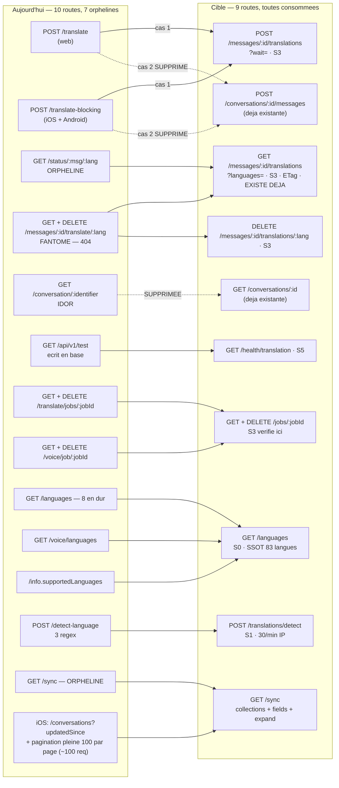

# Traduction & synchronisation delta

## Ce que la surface est aujourd'hui

Dix routes réparties sur quatre fichiers (`translation.ts`, `translation-non-blocking.ts`,
`translation-jobs.ts`, `sync.ts`), sans préfixe de module commun : elles occupent la racine
`/api/v1/` avec des noms génériques (`/translate`, `/status`, `/languages`, `/test`,
`/conversation/:identifier`, `/sync`) qui ne disent ni le module ni la ressource. Deux jumelles
POST font le même geste à l'attente près ; deux couples de routes de job interrogent la même
méthode de service par deux chemins ; trois catalogues de langues coexistent sans constante
partagée. Et surtout — c'est le fait le plus lourd de la tranche — **sept routes sur dix n'ont
aucun appelant** : le croisement avec les fragments clients (web `apps/web/services/`,
`apps/web/lib/`, SDK Swift `packages/MeeshySDK/Sources/`, Android `apps/android/`) ne trouve
d'appel réel que pour `POST /translate` (web), `POST /translate-blocking` (iOS **et Android**,
quatre sites de dépôt Kotlin — dont aucun ne peut aboutir aujourd'hui, voir le tableau) et `GET /languages` (web, deux sites — mais ces deux fonctions
sont exportées sans qu'aucun composant ni aucune page de production ne les importe : le chemin
n'est atteint, aujourd'hui, que par les tests). `GET /api/v1/sync`, la route la mieux construite du dépôt
— curseur keyset composite, ETag/304, RLS fail-closed, budget de 512 Ko par page — n'est
appelée par **aucun** des trois clients.

| Route | Niveau | Auth | Débit | Poids | Consommée par | Verdict |
|---|---|---|---|---|---|---|
| `POST /api/v1/translate` <br>`translation-non-blocking.ts:305` | S3 (cas 1) / **S2 de fait** (cas 2) | JWT, `allowAnonymous:false` + `callerParticipatesIn` sur le cas 1 seulement | global 300/min/IP | light | **web** (`services/message-translation.service.ts:78`) | à fusionner vers `POST /messages/:messageId/translations` (cas 1) ; cas 2 **à supprimer** |
| `GET /api/v1/status/:messageId/:language` <br>`translation-non-blocking.ts:455` | S3 | JWT + `callerParticipatesIn` (fail-closed) | global 300/min/IP | light | **PERSONNE** — le web définit une sonde vers une URL fantôme, jamais appelée en production (voir ci-dessous) | à fusionner vers `GET /messages/:messageId/translations` — **route qui EXISTE déjà** (`routes/messages.ts:1054`, garde de participation, consommée par iOS `MessageLanguageDetailView.swift:490`) : il s'agit de l'étendre, pas de la créer |
| `GET /api/v1/conversation/:identifier` <br>`translation-non-blocking.ts:512` | annoncé S2, **devrait être S3** | JWT seul, **aucune garde métier** | global 300/min/IP | light | **PERSONNE** | **à supprimer** (IDOR ouvert, fonction déjà servie par `GET /conversations/:id`) |
| `POST /api/v1/translate-blocking` <br>`translation.ts:278` | S3 (cas 1) / **S2 de fait** (cas 2) | JWT + `.some(m => m.userId === userId)` sur le cas 1 seulement | global 300/min/IP, **10 s de connexion retenue** | medium | **iOS** (`MeeshySDK/Services/TranslationService.swift:30`, appelée par `MessageLanguageDetailView.swift:373` **et** `ConversationViewModel.swift:4518`) **et Android** (`core/network/.../TranslationApi.kt:26`, appelée par `TranslationRepository.kt:22`, `MessageRepository.kt:384`, `PostRepository.kt:509`, `StoryRepository.kt:279`) — mais son corps ne porte NI `message_id` NI `conversation_id` (`TranslateRequest`, `TranslationApi.kt:11-15`), donc il tombe dans le cas 2 et se fait renvoyer un 400 `conversation_id is required` : les quatre appels sont câblés et ne peuvent pas aboutir (à confirmer sur un appel réel) | à fusionner vers `POST /messages/:messageId/translations?wait=` ; cas 2 **à supprimer** |
| `GET /api/v1/languages` <br>`translation.ts:538` | S0 | aucune — recensée sans identité dans l'inventaire `PUBLIC_ROUTES` de la garde de test `route-auth-coverage` (c'est un inventaire, pas un mécanisme de routage) | global 300/min/IP | light | **web, sur le papier** (`lib/server-cache.ts:221` `getAvailableLanguages`, `services/translation.service.ts:174` `getSupportedLanguages`) — les deux sont exportées et **importées par aucun composant ni aucune page de production** (seuls les tests les appellent) | à garder, mais alimentée par la SSOT et fusionnée avec `/voice/languages` |
| `POST /api/v1/detect-language` <br>`translation.ts:568` | S0 | aucune | global 300/min/IP, `text` **non borné** | light (mais écho intégral) | **PERSONNE** | à garder sous S1 et à **réimplémenter** (voir ci-dessous) |
| `GET /api/v1/test` <br>`translation.ts:624` | S2 | JWT | global 300/min/IP, 2 s de sommeil serveur par appel | light | **PERSONNE** | **à supprimer** de la surface produit → `GET /health/translation` (S5) |
| `GET /api/v1/translate/jobs/:jobId` <br>`translation-jobs.ts:180` | S3 **délégué au worker Python** | JWT ; propriété non vérifiée par la passerelle | global 300/min/IP, timeout ZMQ 10 s | medium | **PERSONNE** | à fusionner vers `GET /jobs/:jobId` (doublon vérifié de `/voice/job/:jobId`) |
| `DELETE /api/v1/translate/jobs/:jobId` <br>`translation-jobs.ts:245` | S3 **délégué au worker Python** | idem, sur un verbe destructif | global 300/min/IP | light | **PERSONNE** | à fusionner vers `DELETE /jobs/:jobId` |
| `GET /api/v1/sync` <br>`sync.ts:457` | S2/S3 (RLS par appartenance) | JWT **ou** session anonyme, RLS fail-closed | global 300/min/**IP** | heavy (plafond 512 Ko / 1000 lignes) | **PERSONNE** | **à garder et à généraliser** — c'est la cible du module |

## Ce qui ne va pas

### Doublons

- **Deux jumelles pour un geste.** `POST /translate` (`translation-non-blocking.ts:305`) et
  `POST /translate-blocking` (`translation.ts:278`) partagent le même schéma Zod, les mêmes
  deux cas et le même service (`translationService.handleNewMessage`). La seule différence est
  l'attente. Ce sont deux chemins pour un verbe — la forme correcte est un paramètre.
- **Deux couples de routes pour un même job, vérifié handler par handler.**
  `translation-jobs.ts:180` appelle `AttachmentTranslateService.getTranslationStatus`, qui à la
  ligne `services/AttachmentTranslateService.ts:188` fait `audioTranslateService.getJobStatus(userId, jobId)` ;
  `routes/voice/translation.ts:395` appelle **directement** `audioTranslateService.getJobStatus(userId, jobId)`.
  Même méthode, mêmes arguments. Idem pour `DELETE` → `cancelJob` (`AttachmentTranslateService.ts:214`
  vs `voice/translation.ts:458`). Fusion sûre : la seule divergence est le schéma de réponse,
  et c'est celui de `translation-jobs.ts` qui est cassé (voir « contrat »).
- **Le cas 2 des deux `/translate` est une seconde porte d'écriture de message.** Il finit sur
  `messagingService.handleMessage(...)` / `_saveMessageToDatabase` — exactement ce que fait
  `POST /conversations/:id/messages` (`routes/conversations/messages.ts:1672`, ligne 1890 :
  `messagingService.handleMessage(messageRequest, participantId)`), mais sans les gardes de
  celle-ci. Un geste écrit deux fois diverge toujours du côté pauvre.
- **Trois catalogues de langues, aucune constante partagée.** `translation.ts:538` code en dur
  8 entrées ; `route-registration.ts:167` recopie les 8 mêmes codes dans `GET /info` ;
  `routes/voice/analysis.ts:576` en sert une troisième version depuis le worker
  (`audioTranslateService.getSupportedLanguages()`). Or
  `packages/shared/utils/languages.ts:88` déclare **83 langues** avec leur matrice
  `supportsTTS` / `supportsSTT` — et c'est cette SSOT que le web importe *directement*
  (`components/translation/language-settings.tsx:11`, `utils/language-utils.ts:20`,
  `lib/constants/languages.ts:48`) pendant qu'il porte *aussi* deux fonctions vers la route à
  8 entrées. La contradiction 8 vs 83 est donc aujourd'hui LATENTE côté web (ces deux fonctions
  n'ont pas d'appelant de production) et ACTIVE côté serveur, où `GET /languages` et
  `GET /info` servent 8 codes pendant que le pipeline en supporte 83.

### Sécurité

- **IDOR confirmé, sans garde du tout.** `GET /api/v1/conversation/:identifier`
  (`translation-non-blocking.ts:512`) sert titre, type, dates, `_count.messages` et
  `_count.participants` de **n'importe quelle** conversation à **tout** compte authentifié. Le
  helper `callerParticipatesIn` existe dans le même fichier, deux cent quarante lignes plus
  haut (`:267`), et son doc-comment (`:261`) dit littéralement vouloir empêcher « une route
  l'avait, sa voisine non ». Cette route est la voisine.
- **Injection de message.** `translate-blocking` cas 2 (`translation.ts:455-463`) résout un
  participant puis retombe sur `senderId: senderParticipant?.id || senderId` — donc **écrit
  quand même** quand l'appelant n'est pas participant. La jumelle non bloquante refuse ce cas
  (`translation-non-blocking.ts:423` : `if (!senderParticipantId) { … return; }`). Les deux jumelles
  divergent sur exactement le point qui compte.
- **Oracle d'existence.** `translate` cas 2 résout la conversation (404 si inconnue) *avant*
  de détacher le traitement, puis répond 200 `status: 'processing'` même quand le traitement
  de fond va abandonner. 300 sondages/min/IP suffisent à cartographier les identifiants.
- **Autorisation transportée, jamais vérifiée.** Les deux routes de job passent `userId` au
  worker Python par ZMQ et servent le résultat tel quel. La passerelle ne lit aucune ligne de
  job. `AttachmentTranslateService` porte pourtant un `verifyUserAccess` (`:240`) — appelé sur
  la soumission, **pas** sur `getTranslationStatus` ni sur `cancelTranslation`. Un `DELETE`
  destructif dont la garde vit au bout d'un canal que ce dépôt ne compile pas.
- **Le débit est global, par IP, et fail-open.** `middleware/rate-limiter.ts` +
  `server.ts:507` : 300/min sur `global:${request.ip}`, `skipOnError: true` (Redis KO ⇒ passe).
  Il n'existe aucun quota par compte ni par coût ML, alors que trois de ces routes déclenchent
  un job NLLB et que deux sont des routes de **polling**. `/translate-blocking` retient la
  connexion 10 s ; `/test` dort 2 s ; chaque appel de job ouvre un ZMQ à 10 s de timeout.
- **Le cas anonyme est du code mort.** La branche `authContext.participantId` de
  `callerParticipatesIn` (`:273`) et les tests `authContext.isAnonymous` du handler sont
  inatteignables : `allowAnonymous: false` renvoie 403 `REGISTERED_USER_REQUIRED` avant le
  handler. Un invité de lien de partage ne peut pas relire la traduction d'un message de **sa**
  conversation, alors que le code se croit ouvert à lui.

### Bande passante

- **Sur-fetch de requête, pur gaspillage.** Les deux `/translate` font
  `message.findUnique({ include: { conversation: { include: { participants: true } } } })`
  (`translation-non-blocking.ts:340`, `translation.ts` cas 1) : la conversation entière plus
  N lignes `Participant` avec **toutes** leurs colonnes. Dans la version non bloquante, ces
  participants ne sont même plus lus — la garde a été refaite en `findFirst` ciblé sans que
  l'`include` soit retiré, et trois champs y suffiraient (`conversationId`, `content`,
  `originalLanguage`). La version bloquante, elle, lit encore ces participants pour sa garde
  (`.some(m => m.userId === userId)`) et a besoin d'`encryptionMode` : elle ne pourra passer à
  une projection étroite qu'en adoptant la même garde par `findFirst`.
- **Aucun des trois leviers n'est offert.** Zéro `?fields=`, zéro `?expand=` sur toute la
  tranche. L'ETag n'existe que par le hook global `conditionalGetOnSend` (`server.ts:326`) —
  qui saute d'ailleurs `/languages`, seule route de la tranche à poser un `max-age` sans
  `no-cache` (`shouldApplyConditionalGet`) : elle n'a donc aucun ETag du tout —
  sauf sur `/sync` qui pose le sien (`computeETag({ userId, checkpointSeq, collections, hasGap })`,
  excluant volontairement le `checkpoint` wall-clock pour qu'un 304 puisse tomber — c'est le
  seul endroit du dépôt où le cache conditionnel est *pensé*).
- **Le sur-fetch de `/sync` est structurel et assumé** : le `select` (18 champs, `translations`,
  `metadata`, `reactionSummary`, pièces jointes avec leur transcription et leurs traductions,
  bloc expéditeur imbriqué) rend un message *rendable*, faute de quoi un client écrirait des
  lignes qu'il ne peut pas afficher. Le garde-fou est le **budget** (512 Ko) et non la
  projection. C'est défendable — mais le client ne peut pas demander moins, jamais.
- **Et pendant ce temps, iOS resynchronise à la main.** `ConversationSyncEngine` ignore `/sync`
  et rejoue le delta avec ce qu'il a : `GET /conversations?limit=100&offset=0&updatedSince=…`
  (`ConversationSyncEngine.swift:712`) pour le delta, `GET /conversations?offset={n*stride}&limit=100`
  (`:321`) pour le plein — page 1, fan-out parallèle borné à 4, re-fetch des pages tombées,
  file séquentielle de queue plafonnée à 50 itérations. Sur un compte à 10 000 conversations,
  la seule liste fait ≈ 100 requêtes (`pageSize = 100`), enchaînées après *chaque* delta
  laissant du reste **et** une fois par 24 h (`isFullReconcileDue`). Les messages, eux, ne sont
  PAS tirés par conversation dans cette boucle : `ensureMessages` (`:866`) n'est appelée que
  par le traitement d'un push (`AppDelegate.swift:271`, `:628`) et par le préchargement de fond
  borné aux 10 conversations non lues (`BackgroundTaskManager.swift:234`) ; `fetchOlderMessages`
  (`:895`) est une pagination déclenchée par l'utilisateur. C'est
  le poste réseau le plus lourd du client, et il existe une route serveur qui le remplace par
  une page de 512 Ko avec un 304 quand rien n'a bougé.
- La détection de trou existe pourtant sur les **trois** clients (`SyncSeqState.swift`,
  `apps/web/lib/sync/sync-seq-state.ts`, `apps/android/sdk-core/.../SyncSeqState.kt`) — mais
  elle n'est branchée que sur `notification:new` (`MessageSocketManager.swift:3892`) et sa
  récupération refait `/notifications`, pas `/sync`. Le mécanisme de rattrapage est construit
  des deux côtés et les deux moitiés ne se parlent pas.

### Contrat

- **Deux routes fantômes vérifiées.** `apps/web/services/message-translation.service.ts:100`
  sonde `GET /messages/:messageId/translate/:lang/status` et `:127` appelle
  `DELETE /messages/:messageId/translate/:lang`. Aucune des deux n'existe dans le gateway
  (`grep` sur `routes/` : seules `translation-jobs.ts` et `voice/translation.ts` portent un
  `/translate/` suivi d'un segment). Nuance qui change la gravité : ces deux méthodes
  (`getTranslationStatus`, `cancelTranslation`) **ne sont appelées par aucun composant ni
  aucune page** — seul `requestTranslation` l'est (`messages-display.tsx:184`). Le suivi de
  traduction du web n'est donc pas « 404 en production » : il est **mort avant d'être émis**,
  et le `catch` qui transformerait la 404 en `status: 'failed'` silencieux n'attend qu'un
  premier appelant. C'est la route bien gardée `GET /status/:messageId/:language` — ou la
  route déjà existante `GET /messages/:messageId/translations` (`routes/messages.ts:1054`) —
  qui aurait dû être appelée : elles sont orphelines parce que personne ne connaît leur adresse.
- **Le web déclare terminé ce qui commence.** `message-translation.service.ts:84` :
  `status: response.data.success ? 'completed' : 'failed'` — alors que la route rend
  `status: 'processing'`. Il lit aussi `response.data.translationId` et `estimatedTime`, deux
  champs qu'aucun producteur n'émet.
- **Trois schémas de réponse effacent ce que le handler envoie** (forme 2 du § « Un schéma de
  réponse sans `properties` EFFACE ») :
  - `translate-blocking` envoie `model`, le schéma déclare `model_used` ⇒ `model` est supprimé
    de **chaque** réponse. `from_cache` et `cache_key` sont déclarés et n'ont aucun producteur.
    Conséquence directe côté client : `TranslateResponse` (`MeeshySDK/Services/ServiceModels.swift:485`)
    ne décode que `translated_text` et `source_language` — **iOS ne peut pas distinguer une
    vraie traduction du repli fabriqué `[FR] Hello world`** posé après 10 s de timeout
    (`translation.ts:424-430` pour le cas 1, `:486-495` pour le cas 2, `modelType: 'fallback'`).
    Android décode exactement les mêmes deux champs (`TranslationApi.kt:19-22`) et hérite donc
    du même aveuglement.
  - `GET /translate/jobs/:jobId` passe `{ status, progress, result }` à un schéma qui déclare
    dix clés dont **pas** `result` ⇒ le contenu du job (transcription, traduction) — la seule
    chose que le client vienne chercher — est supprimé à la sérialisation.
  - `DELETE /translate/jobs/:jobId` envoie `{ cancelled }`, mot déclaré nulle part ⇒
    `data: {}`. La réponse d'annulation est **vide**.
- **`POST /detect-language` porte le nom d'une capacité ML et rend une devinette.** Trois
  regex testées dans l'ordre `fr → es → de`, dont la classe française contient déjà
  `á é í ó ú ü ñ` : **aucun** texte espagnol n'atteint jamais la branche `es`. La confiance
  est une constante (0.5 ou 0.7). Le vrai détecteur du translator n'est jamais appelé.
- **`GET /api/v1/test` écrit.** Le handler appelle `handleNewMessage({ conversationId: 'test-conversation' })`
  sans `id` ⇒ `_saveMessageToDatabase` sur une clé qui n'est pas un ObjectId. Un GET à effet
  de bord, sur la surface produit, sans rôle minimum — et le hook ETag global le traite comme
  une lecture idempotente et lui calcule un ETag, preuve que le hook ne distingue pas un GET
  idempotent d'un GET qui écrit. (Le 304 ne peut pas tomber en pratique : `message_id` change
  à chaque appel, donc l'ETag aussi.)
- **`scope` de `/sync` n'est pas validé comme ObjectId** (`z.string().optional()`) : une valeur
  malformée remonte une erreur moteur Prisma au lieu d'un 400.

## La surface cible

Deux sous-modules, tous deux nommés par la ressource : `translation` (les jobs, le catalogue,
la détection) et `sync` (le delta). Le chemin dit le module, puis la ressource, puis l'action.

| Route cible | Remplace | Niveau | Débit (seuil + clé) | Paramètres | Gain |
|---|---|---|---|---|---|
| `POST /api/v1/messages/:messageId/translations` | cas 1 de `POST /translate` **et** de `POST /translate-blocking` | **S3** participant actif | 20/min · clé `translate:user:{userId}` (+ 60/min · `translate:conv:{conversationId}`) | `?wait=0..10000` (ms, défaut 0) ; corps `{ targetLanguage, sourceLanguage?, modelType? }` | un geste, un verbe ; la garde d'appartenance devient inconditionnelle ; le quota suit le **coût ML**, pas l'IP |
| `GET /api/v1/messages/:messageId/translations` <br>**existe déjà** (`routes/messages.ts:1054`) — à ÉTENDRE, pas à créer | `GET /status/:messageId/:language` **et** les deux fantômes du web | **S3** participant actif (garde déjà en place) | 120/min · clé `translate:poll:user:{userId}` | `?languages=fr,en,es` (lot) · `?fields=` · `If-None-Match` | N langues en 1 aller-retour au lieu de N ; 304 sur un sondage qui n'a rien à dire |
| `DELETE /api/v1/messages/:messageId/translations/:language` | le fantôme `DELETE /messages/:id/translate/:lang` | **S3** | 20/min · `translate:user:{userId}` | — | le geste que le web croit déjà appeler existe enfin |
| `GET /api/v1/jobs/:jobId` | `GET /translate/jobs/:jobId` **+** `GET /voice/job/:jobId` | **S3** propriétaire, **vérifié par la passerelle** | 120/min · `jobs:user:{userId}` | `?fields=` · `If-None-Match` | doublon vérifié supprimé ; `result` cesse d'être effacé par le schéma ; la propriété cesse d'être une preuve transportée |
| `DELETE /api/v1/jobs/:jobId` | `DELETE /translate/jobs/:jobId` **+** `DELETE /voice/job/:jobId` | **S3** propriétaire, vérifié avant le ZMQ | 20/min · `jobs:user:{userId}` | — | un verbe destructif dont la garde vit dans ce dépôt ; réponse non vide |
| `GET /api/v1/languages` | `GET /languages` **+** `GET /voice/languages` **+** `supportedLanguages` de `GET /info` | **S0** | 600/min · `catalog:ip:{ip}` | `?capability=translate\|tts\|stt` · `?fields=` | une seule source : `packages/shared/utils/languages.ts` (83 langues) ; fin de la contradiction 8 vs 83 |
| `POST /api/v1/translations/detect` | `POST /detect-language` | **S1** (oracle nul, mais coût ML) | 30/min · `detect:ip:{ip}` **et** 120/min · `detect:user:{userId}` quand authentifié | corps `{ text }` **`maxLength: 1000`** | vrai détecteur (fasttext du translator) ; plus d'écho du corps ; plus de corps non borné |
| `GET /api/v1/sync` | `GET /sync` (élargie) **+** le moteur client `/conversations?updatedSince=` **+** ses ≈ 100 pages `/conversations?offset=` du démarrage à froid | **S2** compte / **S3** de fait (RLS par appartenance, inchangée) | 60/min · clé **`sync:user:{userId}`** ou `sync:participant:{participantId}` — jamais l'IP | `since`, `seq`, `cursor`, `limit`, `scope`, `collections=conversations,messages,reactions,participants`, **`fields=`**, **`expand=`**, `If-None-Match` | ≈ 100 requêtes de démarrage à froid iOS → 1 à N pages de 512 Ko ; 304 quand rien n'a bougé |
| `GET /health/translation` | `GET /api/v1/test` | **S5** `canAccessAdmin` | 6/min · `diag:user:{userId}` | — | une sonde de diagnostic quitte la surface produit et cesse d'écrire en base |
| — *(supprimée)* | `GET /api/v1/conversation/:identifier` | — | — | — | IDOR fermé ; `GET /conversations/:id` sert déjà ces métadonnées avec ses gardes, et `resolveConversationId` fait la résolution en interne |
| — *(supprimée)* | cas 2 de `POST /translate` et de `POST /translate-blocking` | — | — | — | l'injection de message disparaît ; `POST /conversations/:id/messages` (`conversations/messages.ts:1672`) est le seul verbe d'écriture, et il déclenche déjà le pipeline |

**Une seule loi d'autorisation.** `callerParticipatesIn` sort de `translation-non-blocking.ts`
et devient `requireConversationParticipant(conversationId)` dans `middleware/`, monté en
`preHandler` sur les trois routes `messages/:id/translations` (POST, GET, DELETE) — plus jamais une garde qu'une
route appelle et sa voisine non. La branche anonyme cesse d'être morte : `allowAnonymous: true`
sur ces routes, l'identité devenant l'union discriminée déjà utilisée par `/sync`
(`SyncIdentity`), pour qu'un invité de lien de partage puisse relire la traduction d'un
message de **sa** conversation.

### `POST /api/v1/messages/:messageId/translations`

```jsonc
// requête — ?wait=0 (défaut, rend 202) ou ?wait=8000 (attend, rend 200 ou 202)
{ "targetLanguage": "fr", "sourceLanguage": "en", "modelType": "basic" }
```
```jsonc
// 202 — le job est accepté, rien n'est prêt
{ "success": true, "data": {
    "messageId": "…", "targetLanguage": "fr",
    "jobId": "…", "status": "processing" } }
// 200 — la traduction est là (cache, ou ?wait= satisfait)
{ "success": true, "data": {
    "messageId": "…", "targetLanguage": "fr", "sourceLanguage": "en",
    "status": "completed",
    "translatedText": "…",
    "model": "nllb-200-distilled-600M",   // JAMAIS supprimé par le schéma
    "isFallback": false,                  // le repli fabriqué se DÉCLARE
    "confidence": 0.94, "processingTimeMs": 812 } }
```
Le `202` distingue enfin « accepté » de « livré » — ce que `status: 'processing'` sous un 200
ne disait pas. `isFallback` est le champ qui manquait à iOS pour ne pas afficher
`[FR] Hello world` comme une traduction (et à Android, qui décode le même couple de champs).
Le schéma de réponse est **dérivé** du type de retour du handler, pas écrit à côté de lui.

### `GET /api/v1/messages/:messageId/translations?languages=fr,en`

Cette route **existe déjà** (`routes/messages.ts:1054`) : authentifiée, gardée par
appartenance, elle rend `{ messageId, originalContent, originalLanguage, translations[] }` et
iOS l'appelle (`MessageLanguageDetailView.swift:490`). Le lot n'en crée donc pas une nouvelle —
il lui ajoute `?languages=`, le `status` par langue, `isFallback` et l'ETag ci-dessous, et
c'est cette route qui absorbe `GET /status/:messageId/:language` et les deux fantômes du web.

```jsonc
{ "success": true, "data": { "messageId": "…", "originalLanguage": "en",
  "translations": [
    { "language": "fr", "status": "completed", "text": "…", "model": "…", "isFallback": false },
    { "language": "es", "status": "processing" }
  ] } }
```
ETag posé par la route sur `(messageId, jeu de langues, plus récent `updatedAt`)` — un sondage
qui n'a rien appris coûte un 304 sans corps. Aucun champ d'infrastructure du
`TranslationResult` (`services/zmq-translation/types.ts:19` : `workerName`, `poolType`,
`memoryUsage`, `queueTime`…) n'est projeté ; aujourd'hui leur non-fuite est une **omission de
schéma**, demain c'est un type de sortie explicite.

### `GET /api/v1/sync` élargie

```
GET /api/v1/sync?collections=conversations,messages&since=…&cursor=…&limit=200
                &fields=messages(id,content,updatedAt,senderId)&expand=messages.attachments
If-None-Match: W/"…"
```
```jsonc
{ "success": true, "data": {
  "checkpoint": "2026-08-28T10:04:11.000Z", "checkpointSeq": 91422,
  "collections": {
    "conversations": { "added": [], "modified": [], "deleted": [], "truncated": false, "nextCursor": null },
    "messages":      { "added": [], "modified": [], "deleted": [], "truncated": false, "nextCursor": "v1.…" }
  },
  "hasMore": false, "nextCursor": null, "hasGap": false, "gapAction": null } }
```
Trois ajouts seulement, le reste est déjà juste : (a) `SUPPORTED_COLLECTIONS` passe de
`['messages']` à `['conversations','messages','reactions','participants']`, ce que le pilote
prévoyait explicitement ; (b) `fields=` par collection, pour que le client qui n'affiche
qu'une ligne de liste cesse de payer les pièces jointes et leurs traductions ; (c) `expand=`,
pour que ces mêmes pièces jointes ne partent que sur demande — le budget de 512 Ko devient
alors un plafond, pas un régime. `scope` se valide en ObjectId. La clé de débit passe de l'IP
au **compte** : c'est le canal de rattrapage au réveil, et tous les appareils d'un même NAT y
arrivent ensemble.

## Diagramme



## Migration

### Ce qui casse

**iOS** — un seul site d'appel SDK : `MeeshySDK/Services/TranslationService.swift:30`
(`/translate-blocking`), consommé par deux appelants applicatifs
(`MessageLanguageDetailView.swift:373` et `ConversationViewModel.swift:4518`). La bascule est
un changement de chemin plus l'ajout de `?wait=8000`, et `TranslateResponse`
(`ServiceModels.swift:485`) gagne `status`, `model` et `isFallback` — trois champs qu'il ne
pouvait pas décoder parce que le serveur ne les envoyait pas. Rien d'autre ne casse : les neuf
autres routes de la tranche n'ont aucun appelant iOS. Le gros du travail iOS n'est pas une rupture mais une
**adoption** : `ConversationSyncEngine` (`:321` le plein, `:712` le delta) délègue son delta à
`/sync`, en gardant `/conversations` en repli tant que `collections=conversations` n'est pas
en production.

**Web** — trois sites. `services/message-translation.service.ts:78` change de chemin (seul
site réellement appelé, via `messages-display.tsx:184`) ; `:100` et `:127` cessent de pointer
sur des URL inexistantes et visent `GET`/`DELETE /messages/:id/translations` — pour le web, la
migration **répare deux méthodes mortes** avant qu'un appelant ne les découvre en 404. Le
`status: 'completed'` fabriqué à `:84` devient la lecture du `202`/`200` réel.
`lib/server-cache.ts:221` et `services/translation.service.ts:174` gardent leur chemin
`/languages` : seul le **contenu** change (83 entrées au lieu de 8), ce qui aligne enfin la
route sur la SSOT que le reste du web importe déjà — étant entendu qu'aucune des deux
fonctions n'est aujourd'hui importée par une page ou un composant.

**Android** — un appel, et il est central : `TranslationApi.kt:26` (`POST translate-blocking`)
sert quatre dépôts de production (`TranslationRepository.kt:22`, `MessageRepository.kt:384`,
`PostRepository.kt:509`, `StoryRepository.kt:279`). Deux conséquences, et la seconde change
l'ordre du lot : (a) la plateforme casse comme iOS — changement de chemin, `?wait=`, et
`TranslateResponse` (`TranslationApi.kt:19-22`) à étendre de `status` / `model` /
`isFallback` ; (b) son `TranslateRequest` (`TranslationApi.kt:11-15`) ne porte ni `message_id`
ni `conversation_id`, donc ces quatre appels partent aujourd'hui dans le cas 2 et reçoivent un
400 `conversation_id is required` — ils sont câblés sans pouvoir aboutir (à confirmer sur un
appel réel). Migrer Android, c'est donc RÉPARER, pas seulement déplacer. Les neuf autres routes
de la tranche n'ont aucun appelant Android.

### Ordre des étapes

1. **Fermer les trous d'abord, sans changer d'adresse.** Poser la garde d'appartenance sur
   `GET /conversation/:identifier` (ou la retirer du routeur — préféré), supprimer le cas 2
   des deux `/translate`, poser `verifyUserAccess` avant les deux ZMQ de job, borner `text`
   sur `/detect-language`, sortir `/api/v1/test` de `/api/v1`. Aucun client ne consomme
   UTILEMENT ces six correctifs — la seule nuance est le cas 2, où Android atterrit
   aujourd'hui mais en 400 : sa suppression ne retire donc aucun comportement qui fonctionne.
   Ils partent seuls, sans coordination.
2. **Réparer les schémas** (`model`/`model_used`, `result` effacé, `cancelled` effacé). Un
   correctif de sérialisation qui ne change aucune adresse — et qui rend visible, avant toute
   migration, ce que les routes servaient vraiment.
3. **Monter la surface cible en double**, les anciennes routes conservées et servant en
   interne le nouveau handler. Les nouvelles adresses sont vides d'appelants : rien ne peut
   régresser à cette étape.
4. **Migrer web puis iOS et Android**, dans cet ordre : le web est déployé en continu, iOS et
   Android attendent leurs revues de store. Les deux anciennes routes portent `Deprecation` et
   `Sunset` (RFC 8594) plus un `Warning` nommant la cible.
5. **Élargir `/sync`** (`collections`, `fields`, `expand`, clé de débit par compte), puis
   brancher `SyncSeqTracker.gapDetected` sur une resync `/sync` — le hook existe déjà sur les
   trois clients et ne sert aujourd'hui qu'aux notifications
   (`MessageSocketManager.swift:3892`, `apps/web/services/notification-socketio.singleton.ts:248`).
6. **Retirer les alias** quand la télémétrie du gateway ne compte plus d'appel sur les anciens
   chemins **et** que les planchers de version installée, iOS ET Android, dépassent la version de
   bascule.

### Ce qui reste en alias

- `POST /api/v1/translate-blocking` → `POST /messages/:id/translations?wait=8000` : **deux
  versions iOS ET deux versions Android** au minimum — c'est le seul appel de la tranche que
  les stores figent, et il est figé deux fois.
- `POST /api/v1/translate` → `POST /messages/:id/translations` : un cycle de déploiement web.
- `GET /api/v1/languages` : **pas un alias, une route conservée** — un fetch SSR l'attend
  (`server-cache.ts:221`, `getAvailableLanguages`, aujourd'hui importée par personne) et son
  contrat de forme ne change pas. Seul le nombre d'entrées change, et le web décode déjà
  83 langues par ailleurs.
- `GET /api/v1/voice/job/:jobId` : conservé le temps de vérifier qu'aucun webhook du translator
  ne s'y adresse (le dépôt n'en montre pas, mais le worker Python n'est pas compilé ici — la
  prudence est le corollaire de la garde transportée signalée plus haut).
- **Aucun alias** pour `GET /conversation/:identifier`, `GET /api/v1/test`,
  `GET|DELETE /translate/jobs/:jobId` et `POST /detect-language` : aucun appelant sur les trois
  clients, et les deux premières sont des défauts de sécurité — un alias les prolongerait.
