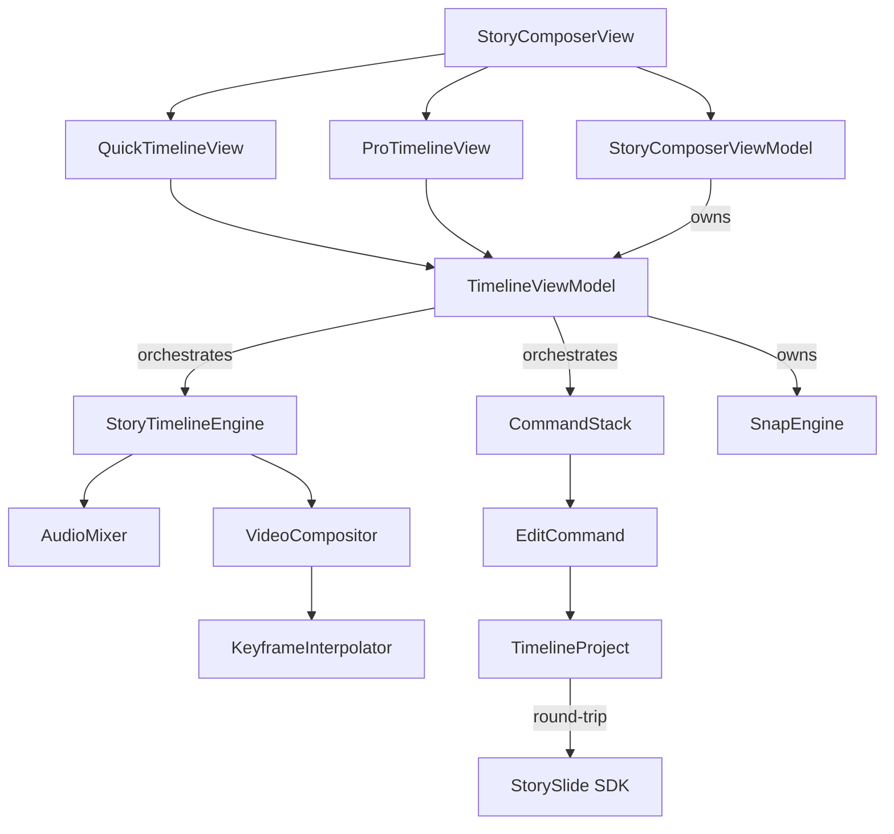
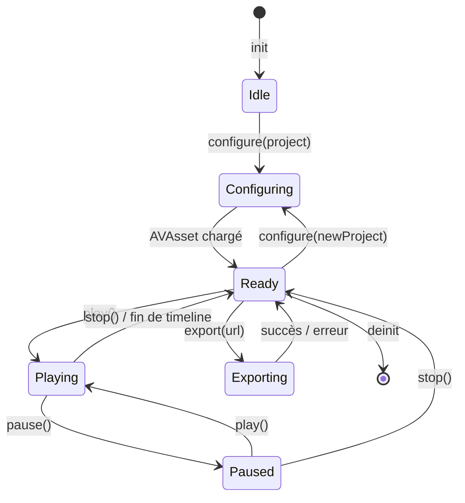
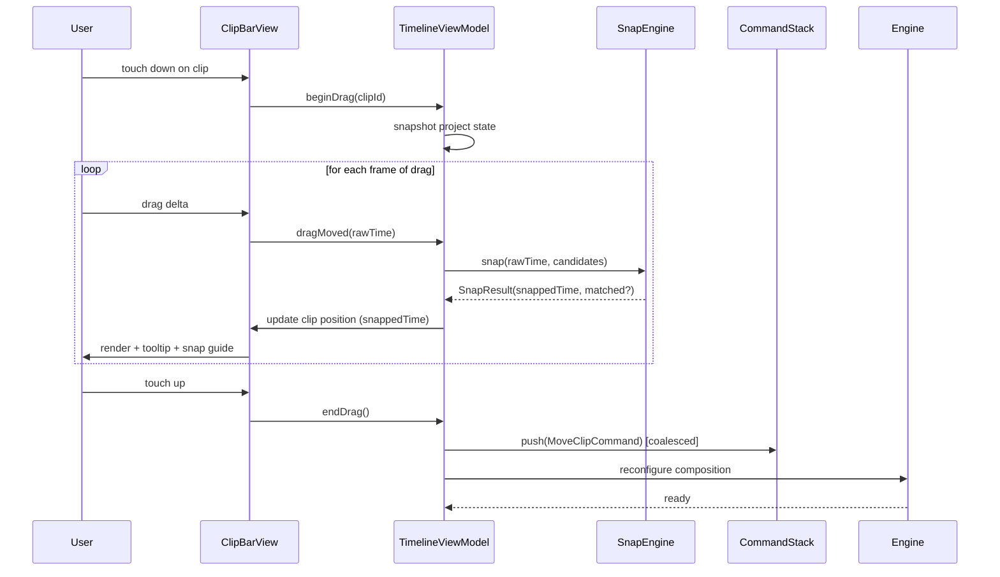

# Story Timeline Editor — Refonte Complète

**Date:** 2026-05-05
**Status:** Draft (en attente de validation finale)
**Scope:** iOS app — `packages/MeeshySDK/Sources/MeeshyUI/Story/Timeline/` (nouveau module) + extensions `packages/MeeshySDK/Sources/MeeshySDK/Models/StoryModels.swift`
**Out of scope:** modifications wire/backend (gateway, translator), export MP4 local (architecture le prépare mais API stub), web composer

---

## Executive Summary

Refonte complète de l'éditeur timeline du story composer iOS. L'objectif est de lever les limitations majeures de l'implémentation actuelle (engine mono-track, pas de transitions inter-clips, pas de keyframes, pas d'undo, pas de snap, monolithes 1800+ lignes) en construisant un sous-système isolé, testable et bâti sur les API natives AVFoundation pour préparer un export MP4 local sans réécriture future.

L'architecture retenue est **modulaire à 5 couches** (Engine, Logic, Model, ViewModel, Views), chacune testable indépendamment, avec deux skins UI partagent le même backend : **Quick Mode** (portrait, 2-3 pistes visibles) pour l'édition mobile rapide, et **Pro Mode** (paysage, multi-track CapCut-style) pour l'édition fine. Toutes les manipulations passent par un **CommandStack** persistable assurant un undo/redo cohérent y compris après fermeture du composer.

Migration **incrémentale** par phases avec feature flag `RemoteConfig` pour rollback instantané. Aucun changement de wire backend, rétro-compatibilité complète des drafts et stories existantes.

**Effort estimé** : 20-29 jours-développeur senior Swift+AVFoundation, parallélisable à 12-18 jours avec 2 devs. ~4-5 cycles 6-day calendaires incluant rollout.

---

## Contexte & Motivation

### État actuel (audit)

Le composer story (`packages/MeeshySDK/Sources/MeeshyUI/Story/`) repose aujourd'hui sur :

| Fichier | Lignes | Rôle | Limitation |
|---------|-------|------|------------|
| `StoryComposerView.swift` | 1821 | UI composer monolithique | Trop gros, ingérable |
| `StoryComposerViewModel.swift` | 934 | ViewModel `@Observable @MainActor` | Mutations non-trackées (pas de Command pattern) |
| `TimelinePanel.swift` | 861 | Vue timeline avancée | Monolithe, double-affichage (sheet + inline) |
| `SimpleTimelineView.swift` | 453 | Vue timeline alternative | **Mort-vivant** (jamais référencée) |
| `TimelineTrackView.swift` | 393 | Track + bar | OK mais couplé au panel |
| `TrackDetailPopover.swift` | 238 | Popover détail clip | OK mais à intégrer dans inspector unifié |
| `TimelinePlaybackEngine.swift` | 215 | Engine playback | **Mono-track**, AVPlayer + AVAudioPlayer simples |

Les modèles SDK (`StoryEffects`, `StoryMediaObject`, `StoryAudioPlayerObject`, `StoryTextObject`) sont déjà bien dimensionnés : ils possèdent `startTime`, `duration`/`displayDuration`, `fadeIn`, `fadeOut`, `loop`, `volume`, `isBackground`, `zIndex`, `sourceLanguage`. Le seul manque côté modèle est l'absence de transitions inter-clips et de keyframes.

### Limitations bloquantes identifiées

1. **Engine mono-track** : `activeMediaId` unique + `stopAllMedia()` au moindre switch. Impossible de jouer en preview une musique de fond ET un voiceover en parallèle, ni le son d'une vidéo + une musique. C'est la limite #1 à lever.
2. **Pas de transitions entre clips d'un même slide** : seul `opening`/`closing` au niveau slide existent. Les passages clip→clip sont secs (ou `fadeOut`+`fadeIn` artisanal).
3. **Pas de magnétisme/snapping** sur grille, autres clips ou playhead → impossible d'aligner précisément au doigt.
4. **Pas d'undo/redo** dédié à la timeline ni au composer en général.
5. **Pas de keyframes** : tous les éléments restent statiques en position/scale/opacity sur leur durée d'affichage.
6. **Pas de mute/solo/lock par piste** côté UI.
7. **Duplication `TimelinePanel` / `SimpleTimelineView`** (code mort à supprimer).
8. **Présentation incohérente** : `TimelinePanel` est exposé à la fois en `.sheet(isPresented: isTimelineVisible)` et inline via `activeTool == .timeline` → deux entrées, deux comportements.
9. **Monolithes** : composer 1821 L, panel 861 L → ne respectent pas la règle CLAUDE.md "smaller, well-bounded units".

### Pourquoi maintenant

Les stories sont au cœur du produit Meeshy. Avec l'arrivée du composer timeline-based comme entrée par défaut (vs Status simple), le besoin d'un éditeur réellement professionnel se fait sentir. Les utilisateurs habitués à TikTok/CapCut/Instagram trouvent la version actuelle frustrante (snap manquant, transitions inexistantes, pas d'undo).

---

## Goals & Non-Goals

### Goals

- **Engine multi-track** AVFoundation natif (multi-audio + multi-vidéo overlay)
- **Préparation export MP4** sans réécriture (API publique stub mais architecture prête)
- **Transitions inter-clips** first-class (crossfade + dissolve au lancement, extensible)
- **Keyframes** pour position + scale + opacity
- **Snapping multi-cible** avec désactivation au geste 2-doigts
- **Undo/Redo** global du composer, persisté dans le draft
- **Quick Mode** (mobile-first portrait) + **Pro Mode** (paysage, CapCut-style)
- **Modules ≤ 400 lignes** par fichier, frontières strictes Engine/Logic/Model/ViewModel/Views
- **250+ tests** Swift + 80 snapshots + 12 tests manuels QA
- **Migration incrémentale** sans breaking change wire ni perte de drafts existants
- **iOS 17+, Swift 6 strict**

### Non-Goals (out of scope explicite, candidats cycles ultérieurs)

- ❌ Export MP4 local opérationnel (l'API `export()` retourne `throw .notImplemented`)
- ❌ Transitions push/wipe/swipe/zoom (seulement crossfade et dissolve au launch)
- ❌ Easing custom Bézier (seulement linear/easeIn/easeOut/easeInOut)
- ❌ Keyframes pour rotation/color/blur (seulement position/scale/opacity)
- ❌ Magic motion / object tracking
- ❌ Audio waveform haute résolution (~80 samples actuels conservés)
- ❌ Multi-slide global timeline (resté local par-slide)
- ❌ Modifications wire/backend (passthrough JSON pour les nouveaux champs)
- ❌ Composer web (iOS uniquement)

---

## Decision Summary

Récapitulatif des 7 décisions structurantes prises lors du brainstorming :

| # | Décision | Choix | Rationale |
|---|----------|-------|-----------|
| 1 | Portée temporelle | **Une timeline = un slide** | Zéro migration, modèle `StorySlide[]` conservé |
| 2 | Multi-track playback | **Multi-audio + multi-vidéo overlay** sur AVFoundation natif | Couvre 95% usages (musique + voiceover + son vidéo) ; export MP4 trivial plus tard |
| 3 | Transitions inter-clips | **Type `StoryClipTransition` first-class** (crossfade + dissolve au lancement) | Extensible par enum, render natif `AVMutableVideoCompositionInstruction` |
| 4 | Keyframes | **Position + scale + opacity**, interpolation linéaire | Couvre Ken Burns, zoom dramatique, sticker glissant ; modèle minimal |
| 5 | Snapping | **Multi-cible** (playhead, clip-edges, grille adaptative, keyframes, bornes) avec désactivation 2-doigts | Standard absolu (FCP, Premiere, CapCut, iMovie) |
| 6 | Undo/Redo | **Pattern Command global**, persisté dans le draft (50 commandes) | UX cohérente, encourage modularisation, encourage testabilité |
| 7 | Style visuel | **Quick Mode (portrait, 2-3 pistes) + Pro Mode (paysage, CapCut-style)** | Mobile-first + power users, même engine, deux skins |

Décisions implicites héritées :
- AVFoundation natif partout (`AVMutableComposition` + `AVAudioEngine` + `AVMutableVideoComposition`)
- Modèles SDK existants conservés (extensions optionnelles seulement)
- iOS 17+, Swift 6 strict, `@MainActor` + `Sendable` partout
- iPad supporté via Quick Mode auto-élargi

---

## 1. Architecture des Modules

### Arborescence cible

```
packages/MeeshySDK/Sources/MeeshyUI/Story/Timeline/
├── Engine/
│   ├── StoryTimelineEngine.swift       # Wrapper AVMutableComposition (preview + futur export)
│   ├── AudioMixer.swift                # AVAudioEngine multi-piste (interactivité runtime)
│   ├── VideoCompositor.swift           # Génération AVMutableVideoComposition + transitions
│   └── TimelineMediaSource.swift       # Abstraction image / video / audio
├── Logic/                              # PURE Swift, zéro UIKit/SwiftUI
│   ├── SnapEngine.swift                # Snap multi-cible
│   ├── CommandStack.swift              # Undo/Redo + persistance Codable
│   ├── EditCommand.swift               # Protocol + 12 commandes concrètes (enum AnyEditCommand)
│   └── KeyframeInterpolator.swift      # Lerp Float/CGFloat/CGPoint avec easing
├── Model/
│   ├── TimelineTrack.swift             # Struct runtime (vue dérivée du modèle)
│   ├── TimelineProject.swift           # Snapshot Codable (pour Command)
│   ├── StoryClipTransition+SDK.swift   # Extension SDK (nouveau type)
│   └── StoryKeyframe+SDK.swift         # Extension SDK (nouveau type)
├── ViewModel/
│   ├── TimelineViewModel.swift         # @Observable @MainActor, orchestre Engine + Stack
│   └── ClipSelectionState.swift        # Selection + active drag (struct value)
└── Views/
    ├── Container/
    │   ├── QuickTimelineView.swift     # Mode Quick (2-3 pistes)
    │   └── ProTimelineView.swift       # Mode Pro (paysage, multi-track)
    ├── Track/
    │   ├── TrackBarView.swift          # Container piste
    │   ├── VideoClipBar.swift          # + frame strip
    │   ├── AudioClipBar.swift          # + waveform
    │   ├── TextClipBar.swift
    │   └── TransitionBadge.swift       # Losange entre 2 clips
    ├── Overlay/
    │   ├── PlayheadView.swift
    │   ├── SnapGuideView.swift         # Ligne magenta + label
    │   ├── RulerView.swift             # Ruler adaptatif (ms→min)
    │   └── DurationHandle.swift
    ├── Inspector/
    │   ├── ClipInspector.swift
    │   ├── KeyframeInspector.swift
    │   └── TransitionInspector.swift
    └── Controls/
        ├── TransportBar.swift          # Play/pause/seek/zoom/mode-switch
        └── TimelineToolbar.swift       # Add track, undo/redo, snap toggle
```

### Règles d'architecture

1. **Aucun fichier > 400 lignes**. Si on dépasse, on splitte.
2. `Engine/` et `Logic/` n'importent **jamais** SwiftUI ou UIKit (sauf `UIImage` dans `Engine/` pour les frames extraites).
3. `Views/` n'instancie **jamais** un `AVPlayer` directement — passe toujours par `TimelineViewModel`.
4. `TimelineViewModel` est l'unique pont entre `StoryComposerViewModel` (existant) et le sous-système timeline (nouveau). Pas de couplage transversal.
5. **Suppressions** lors de la phase 6 : `SimpleTimelineView.swift`, `TimelinePanel.swift`, `TrackDetailPopover.swift`, `TimelineTrackView.swift`, `TimelinePlaybackEngine.swift`.

### Diagramme de dépendances



---

## 2. Modèles de données

Tout passe par **extensions optionnelles** sur les modèles SDK existants — zéro breaking change wire.

### 2.1 Nouveaux types (dans `packages/MeeshySDK/Sources/MeeshySDK/Models/StoryModels.swift`)

```swift
// MARK: - Story Clip Transition (entre 2 clips d'un même slide)

public struct StoryClipTransition: Codable, Identifiable, Sendable {
    public let id: String
    public let fromClipId: String        // ID d'un mediaObject ou audioPlayerObject
    public let toClipId: String
    public let kind: StoryTransitionKind  // crossfade | dissolve (lancement)
    public let duration: Float            // 0.1 → 2.0 secondes
    public let easing: StoryEasing?       // nil = .linear

    public init(id: String = UUID().uuidString,
                fromClipId: String, toClipId: String,
                kind: StoryTransitionKind, duration: Float,
                easing: StoryEasing? = nil)
}

public enum StoryTransitionKind: String, Codable, Sendable {
    case crossfade
    case dissolve
    // Futur : push, wipe, swipeLeft, swipeRight, zoomIn, zoomOut
}

public enum StoryEasing: String, Codable, Sendable {
    case linear, easeIn, easeOut, easeInOut

    public func apply(_ t: Float) -> Float {
        switch self {
        case .linear:    return t
        case .easeIn:    return t * t
        case .easeOut:   return 1 - (1 - t) * (1 - t)
        case .easeInOut: return t < 0.5 ? 2 * t * t : 1 - pow(-2 * t + 2, 2) / 2
        }
    }
}

// MARK: - Story Keyframe (animation position/scale/opacity)

public struct StoryKeyframe: Codable, Identifiable, Sendable {
    public let id: String
    public let time: Float          // offset relatif au startTime de l'objet (0..duration)
    // Tous optionnels — seuls les non-nil sont interpolés
    public var x: CGFloat?
    public var y: CGFloat?
    public var scale: CGFloat?
    public var opacity: CGFloat?    // 0..1
    public var easing: StoryEasing? // easing depuis ce keyframe vers le suivant ; nil = .linear

    public init(id: String = UUID().uuidString, time: Float,
                x: CGFloat? = nil, y: CGFloat? = nil,
                scale: CGFloat? = nil, opacity: CGFloat? = nil,
                easing: StoryEasing? = nil)
}
```

### 2.2 Extensions sur types existants

```swift
extension StoryEffects {
    public var clipTransitions: [StoryClipTransition]?   // ajouté
}

extension StoryTextObject {
    public var keyframes: [StoryKeyframe]?               // ajouté
}

extension StoryMediaObject {
    public var keyframes: [StoryKeyframe]?               // ajouté
}
```

Tous les `CodingKeys` sont mis à jour pour inclure les nouveaux champs avec `decodeIfPresent` / `encodeIfPresent` afin de préserver la rétro-compatibilité JSON.

### 2.3 `TimelineProject` (snapshot Codable, pour Command/Undo)

```swift
public struct TimelineProject: Codable, Sendable {
    public var slideId: String
    public var slideDuration: Float
    public var mediaObjects: [StoryMediaObject]
    public var audioPlayerObjects: [StoryAudioPlayerObject]
    public var textObjects: [StoryTextObject]
    public var clipTransitions: [StoryClipTransition]

    public init(from slide: StorySlide)
    public func apply(to slide: inout StorySlide)
}
```

Round-trip garanti : `TimelineProject(from: slide).apply(to: &slide)` = no-op.

### 2.4 `EditCommand` (Pattern Command)

```swift
public protocol EditCommand: Codable, Sendable {
    var id: String { get }
    var timestamp: Date { get }
    func apply(to project: inout TimelineProject) throws
    func revert(from project: inout TimelineProject) throws
}

// Type erasure pour Codable synthesis
public enum AnyEditCommand: Codable, Sendable {
    case addClip(AddClipCommand)
    case deleteClip(DeleteClipCommand)
    case moveClip(MoveClipCommand)
    case trimClip(TrimClipCommand)
    case splitClip(SplitClipCommand)
    case addTransition(AddTransitionCommand)
    case removeTransition(RemoveTransitionCommand)
    case changeTransition(ChangeTransitionCommand)
    case addKeyframe(AddKeyframeCommand)
    case moveKeyframe(MoveKeyframeCommand)
    case deleteKeyframe(DeleteKeyframeCommand)
    case setClipProperty(SetClipPropertyCommand)

    public var underlying: any EditCommand { /* unwraps */ }
}
```

Chaque command concrète est un struct Codable Sendable d'environ 30-50 lignes contenant le state-delta nécessaire à l'application et au revert.

### 2.5 Rétro-compatibilité

- Tous les nouveaux champs sont `Optional` → JSON existant decode tel quel
- `decodeIfPresent` systématique
- Stories anciennes sans `clipTransitions` ni `keyframes` → rendus à l'identique (statique, pas de transition intra-slide)
- Wire backend (gateway/translator) ignore les nouveaux champs s'ils sont présents → compatible immédiatement

### 2.6 Tests modèle (`StoryModelsExtensionsTests`)

| Cas | Vérifie |
|-----|---------|
| `StoryClipTransition_codableRoundTrip` | Encode → decode → equal |
| `StoryKeyframe_codableRoundTrip` | Idem |
| `StoryEffects_decodeOldJSON_withoutNewFields` | JSON pré-refonte décode sans erreur, champs nouveaux à `nil` |
| `TimelineProject_fromSlide_thenApply_isIdempotent` | Round-trip exact |
| `AnyEditCommand_codableRoundTrip` | Chaque case de l'enum encode/decode (12 cases) |
| `StoryEasing_apply_boundaryValues` | t=0 → 0, t=1 → 1, monotone croissant |

---

## 3. Engine de Playback (`StoryTimelineEngine`)

Wrapper léger autour d'AVFoundation natif. La preview est une lecture native AVPlayer ; l'export futur sera un appel `AVAssetExportSession.exportAsynchronously()` sur la même `AVMutableComposition`.

### 3.1 API publique

```swift
@MainActor
public final class StoryTimelineEngine {

    // Sortie observable
    public private(set) var currentTime: Float = 0
    public private(set) var isPlaying: Bool = false
    public var onTimeUpdate: ((Float) -> Void)?
    public var onPlaybackEnd: (() -> Void)?
    public var onElementBecameActive: ((String) -> Void)?

    // Configuration
    public func configure(project: TimelineProject,
                          mediaURLs: [String: URL],
                          images: [String: UIImage]) async

    // Transport
    public func play()
    public func pause()
    public func seek(to time: Float, precise: Bool = true)
    public func stop()
    public func toggle()

    // Mute/volume globaux
    public var isMuted: Bool
    public var masterVolume: Float  // 0..1

    // Export futur (stub présent dès le lancement)
    public func export(to url: URL,
                       preset: ExportPreset = .hd1080) async throws

    public enum ExportPreset {
        case hd720, hd1080, hd4k
    }

    public enum ExportError: Error {
        case notImplemented   // returned at launch
        case sessionFailed(String)
    }
}
```

### 3.2 Construction interne

À chaque `configure(...)`, l'engine bâtit :

1. **`AVMutableComposition`** (la timeline native)
   - Une `AVCompositionTrack(mediaType: .video)` par `mediaObject` vidéo (insertion à `startTime`, durée = `duration`)
   - Une `AVCompositionTrack(mediaType: .audio)` par `audioPlayerObject` ET par audio extrait des vidéos
   - Les images sont gérées par overlay CALayer dans le `AVMutableVideoComposition` (pas de track AVFoundation pour les images statiques)

2. **`AVMutableVideoComposition`** (compositor GPU)
   - `instructions[]` — une `AVMutableVideoCompositionInstruction` par segment temporel
   - Pour chaque instruction, une `AVMutableVideoCompositionLayerInstruction` par track avec `setOpacityRamp` aux bords (fade) ou pour les transitions inter-clips (crossfade/dissolve)
   - Overlays statiques (textes, images, stickers) injectés via `CALayer` (`animationTool` avec `additionalLayer:asTrackID:`) — la même `CALayer` que celle utilisée par le canvas, donc WYSIWYG total

3. **`AVPlayerItem(asset: composition)`** + `AVPlayer` → preview UI
4. **`AVPlayer.addPeriodicTimeObserver`** → `onTimeUpdate` à 60 fps (`CMTime(value: 1, timescale: 60)`)

### 3.3 `AudioMixer` (interne — `AVAudioEngine` pour les contrôles temps-réel)

`AVMutableComposition` ne suffit pas pour modifier volume/fade en temps-réel pendant le drag. On double avec `AVAudioEngine` pour la phase d'édition :

```swift
@MainActor
final class AudioMixer {
    private let engine = AVAudioEngine()
    private var nodes: [String: AVAudioPlayerNode] = [:]

    func configure(audios: [StoryAudioPlayerObject], urls: [String: URL]) throws
    func seek(to time: Float)
    func play() throws
    func pause()
    func setVolume(_ vol: Float, for audioId: String)
    func setMute(_ muted: Bool)

    // Cap pour limiter mémoire
    private var maxActiveNodes: Int = 6
}
```

Pendant l'export (futur), on bypass le mixer et on s'appuie sur `AVMutableComposition` pure.

### 3.4 `VideoCompositor` (génération `AVMutableVideoComposition`)

Pure logique : prend un `TimelineProject`, retourne un `AVMutableVideoComposition` complet. Testable sans simulateur (mock `CGSize` render size).

```swift
struct VideoCompositor {
    static func makeComposition(
        project: TimelineProject,
        composition: AVMutableComposition,
        renderSize: CGSize,        // 1080×1920 par défaut (9:16 story)
        keyframeInterpolator: KeyframeInterpolator
    ) -> AVMutableVideoComposition
}
```

Conversion `StoryClipTransition.kind` :
- `.crossfade` → `setOpacityRamp(fromStartOpacity: 1, toEndOpacity: 0, timeRange:)` sur le clip sortant + `setOpacityRamp(fromStartOpacity: 0, toEndOpacity: 1, timeRange:)` sur le clip entrant
- `.dissolve` → custom `AVVideoCompositionInstructionProtocol` avec `AVAsynchronousCIImageFilteringRequest` appliquant un mask organique (`CIDissolveTransition`)

### 3.5 Performance & ressources

- **Lazy load** : vidéos chargées comme `AVURLAsset(loadingValuesAsync: [.tracks, .duration])`, jamais sync
- **Cache `CMSampleBufferDisplayLayer`** pour preview ultra-réactive au seek
- **Frame extraction throttle** : `VideoFrameExtractor` (déjà existant) appelé hors `MainActor` via `Task.detached`, max 8 frames par clip pour le timeline strip
- **Audio decoding** : `AVAudioFile.read(into:frameCount:)` chunked à 4096 samples
- **Mémoire** : `evictNonVisibleSlideMedia()` (existant `StoryComposerViewModel`) reste actif ; le mixer cap à 6 nodes audio simultanés actifs
- **`CADisplayLink`** remplacé par `AVPlayer.addPeriodicTimeObserver` (synchro native avec le rendu vidéo)

### 3.6 Cycle de vie

- L'engine est `@MainActor` → toutes ses méthodes publiques sur main thread
- `deinit` → `stop()` synchrone (`pause` + `removeTimeObserver` + `engine.stop`)
- `configure(...)` est `async` car les `AVURLAsset` chargent leurs métadonnées de façon asynchrone

---

## 4. Logic Core (Snap, Command, Keyframe)

Trois composants 100 % Swift pur (`@frozen struct` ou `final class` sans dépendance UIKit/SwiftUI). Tous testables sans simulateur.

### 4.1 `SnapEngine`

```swift
public struct SnapCandidate: Equatable, Sendable {
    public enum Kind: Sendable {
        case playhead, clipStart, clipEnd, gridMajor, gridMinor, keyframe, slideStart, slideEnd
    }
    public let kind: Kind
    public let time: Float
    public let label: String?      // pour feedback UI ("clip A end", "1.5s", etc.)
}

public struct SnapResult: Equatable, Sendable {
    public let snappedTime: Float
    public let matched: SnapCandidate?
}

public struct SnapEngine: Sendable {
    public init(toleranceSeconds: Float)

    public func snap(
        rawTime: Float,
        candidates: [SnapCandidate],
        disabled: Bool = false
    ) -> SnapResult
}
```

**Règles** :
- Priorité d'accroche : `playhead` > `clipStart`/`clipEnd` > `keyframe` > `gridMajor` > `gridMinor` > `slideStart`/`slideEnd`
- À égalité de distance, priorité gagne
- `toleranceSeconds` calculé par l'UI = `6 px / pixelsPerSecond` → tolérance qui s'adapte automatiquement au zoom
- `disabled = true` (geste 2 doigts) → retourne `SnapResult(snappedTime: rawTime, matched: nil)`

### 4.2 `CommandStack`

```swift
public final class CommandStack: Sendable {
    public init(maxSize: Int = 50, coalesceWindow: TimeInterval = 0.5)

    public func push(_ command: AnyEditCommand)
    public func undo() -> AnyEditCommand?
    public func redo() -> AnyEditCommand?
    public var canUndo: Bool { get }
    public var canRedo: Bool { get }

    // Persistance
    public func snapshot() -> CommandStackSnapshot
    public func restore(_ snapshot: CommandStackSnapshot)

    public var didChange: ((CommandStack) -> Void)?
}

public struct CommandStackSnapshot: Codable, Sendable {
    let commands: [AnyEditCommand]
    let cursor: Int
}
```

**Détails clés** :
- **Coalescing** : si la dernière command est du même type que la nouvelle ET qu'elles concernent le même `clipId` ET qu'elles sont espacées de moins de `coalesceWindow` → mergées (la nouvelle remplace la précédente)
- **Type erasure** via `AnyEditCommand` enum pour `Codable` synthesis
- **Cap** : au-delà de 50 commandes, drop FIFO
- **Cursor** : à chaque `push` après un `undo` → on tronque la suite (branche perdue)

### 4.3 `KeyframeInterpolator`

```swift
public protocol Lerpable {
    static func lerp(from: Self, to: Self, t: Float) -> Self
}

extension Float: Lerpable { ... }
extension CGFloat: Lerpable { ... }
extension CGPoint: Lerpable { ... }
extension CGSize: Lerpable { ... }

public struct KeyframeInterpolator: Sendable {
    public static func interpolate<T: Lerpable>(
        keyframes: [(time: Float, value: T, easing: StoryEasing)],
        at time: Float
    ) -> T?
}
```

**Comportement** :
- 0 keyframe → retourne `nil` (l'appelant utilise la valeur statique de l'objet)
- 1 keyframe → retourne sa valeur (constante après ce point, valeur statique avant)
- N keyframes → trouve le segment englobant `time`, applique l'easing du keyframe d'origine, lerp entre origine et destination
- Au-delà du dernier keyframe → valeur du dernier (clamp)

### 4.4 Tests unitaires Logic

Couverture cible 100 % :

| Suite | Cas | Description |
|-------|-----|-------------|
| `SnapEngineTests` | 24 | Priorité, tolérance variable, disabled, edge cases (playhead exact, candidats équidistants) |
| `CommandStackTests` | 18 | push/undo/redo, coalescing, cap FIFO, snapshot/restore round-trip, branch truncation |
| `KeyframeInterpolatorTests` | 16 | 0/1/N keyframes, easings, clamp avant/après, types Lerpable |

---

## 5. Quick Mode UI (portrait, défaut)

### 5.1 Layout

Référence visuelle : voir mockup `quick-mode-layout.html` dans `.superpowers/brainstorm/`.

```
┌─────────────────────────────┐
│ × •···       Suivant        │  Top Nav (32 pt)
├─────────────────────────────┤
│                             │
│      PREVIEW CANVAS         │  ~60% hauteur (flex 2.4)
│      (WYSIWYG, 9:16)        │
│                             │
├─────────────────────────────┤
│ ▶ 0:04.250/0:10  ⊖⊕🔇 PRO↗ │  Transport bar
├─────────────────────────────┤
│ ─────ruler 12pt────────     │
│ VIDEO ▓▓▓▓▓▓◆▒▒▒│           │  Track 1 (sélectionné)
│ AUDIO ░░░░░░░░░░░░░│        │  Track 2 (avec keyframes)
│ ⌄ + TEXTE • +1 PISTE        │  Trigger déploiement
├─────────────────────────────┤
│ Média Texte Audio Time Filt │  Bottom Toolbar
└─────────────────────────────┘
```

### 5.2 Règles de visibilité par défaut (état compact)

1. Toujours afficher la piste contenant le clip actuellement **sélectionné**
2. Sinon, afficher en priorité : **VIDEO 1** (background) puis **AUDIO 1**
3. Max 3 pistes en compact. Au-delà → trigger "+N PISTES" devient visible
4. Aucun élément d'un type → la piste ne compte pas (pas de slot vide affiché)

### 5.3 État déployé (après tap sur ⌄ ou swipe up)

- Preview compressée à ~30 %
- **Toutes les pistes** scrollables verticalement
- Bottom toolbar atténuée (opacity 0.4)
- Trigger "⌃ REPLIER" en haut

### 5.4 Symboles & légendes

| Symbole | Signification |
|---------|---------------|
| Losange jaune (gros) entre 2 clips | Transition (`StoryClipTransition`) |
| Losange jaune (petit) sur clip | Keyframe |
| Losange indigo en bout de timeline | Duration handle du slide |
| Trait blanc + triangle | Playhead |
| Poignées blanches gauche/droite | Trim handles (start / duration) |
| Halo indigo sur clip | Sélection active |
| Gradient noir aux bords du clip | Fade in / Fade out visualisé |

### 5.5 Composants Swift correspondants

- `QuickTimelineView` (container)
- `TransportBar` (transport)
- `RulerView` (ruler adaptatif)
- `TrackBarView` (une piste)
- `VideoClipBar` / `AudioClipBar` / `TextClipBar` (clips)
- `TransitionBadge` (losange jaune)
- `PlayheadView` (overlay)
- `DurationHandle` (overlay)
- `ClipInspector` (présenté en `.sheet(presentationDetents: [.medium])` en Quick Mode — voir 6.4 pour la version Pro)

---

## 6. Pro Mode UI (paysage, multi-track)

### 6.1 Layout

Référence visuelle : voir mockup `pro-mode-layout.html` dans `.superpowers/brainstorm/`.

```
┌──────────────┬─────────────────────────────────────┐
│ × slide 1/3 ⤢│ ‹ slide1 slide2 slide3 + QUICK↗ Sui│
│              ├─────────────────────────────────────┤
│              │ ↶ ↷ │SNAP●│   100%   RULER:0.5s     │
│   PREVIEW    ├─────────────────────────────────────┤
│   (9:16)     │ ────ruler 14pt──────────────────    │
│              │ ▦ CONTENU ──────                    │
│              │ VIDEO 1   ▓▓▓▓▓▓◆▒▒▒│              │
│              │ VIDEO 2🔒 ▒▒▒│                     │
│              │ ♪ AUDIO ─────                       │
│              │ AUDIO 1   ░░░░░░░░░░░░░░│           │
│              │ AUDIO 2   ▒▒▒▒▒▒│                  │
│              │ T EFFETS ──────                     │
│              │ TEXTE 1   ▒▒▒▒▒▒│ │PLAYHEAD 4.25s│  │
│              │ TEXTE 2   ▒▒▒▒▒▒│                  │
│ ▶ 0:04/0:10 🔇│                                    │
├──────────────┘                                     │
│ ◆ intro.mp4 — sélectionné                          │ Inspector
│ Start    0:00.500    Duration  5.000s              │ flottant
│ Volume   ████░ 85%   Fade in  0.4s                 │ bottom-left
│ Loop ⚪  Background ●                              │
│ ◆Keyframe                              🗑 Suppr     │
└────────────────────────────────────────────────────┘
```

### 6.2 Différences vs Quick Mode

- Layout **paysage** : canvas 9:16 à gauche (~30 % largeur) + timeline étendue à droite
- **Tabs slides** en haut au lieu de bullets, avec bouton "+" pour ajouter
- **Undo / Redo + toggle SNAP** visibles en permanence dans la transport bar
- **Toutes les pistes visibles** avec headers de groupes CONTENU / AUDIO / EFFETS
- **Inspector flottant** en bas-gauche dès qu'un clip est sélectionné
- **Pistes verrouillables** (icône 🔒 → ne reçoit pas de drag/drop)
- **Snap guide rose** + label ("PLAYHEAD 4.250s", "CLIP A end") pendant les drags
- Bouton "QUICK ↗" pour revenir en portrait sans rotation physique

### 6.3 Activation

- **Auto** au passage portrait → paysage (`UIInterfaceOrientation`), animé en spring
- **Manuel** via bouton "PRO ↗" en Quick Mode (force le paysage si possible, sinon affiche en portrait élargi sur iPhone Mini ; fonctionne nativement sur iPad)
- État global persisté dans `StoryComposerViewModel.timelineMode: .quick / .pro`

### 6.4 Composants Swift correspondants

- `ProTimelineView` (container)
- Tous les composants Track/Overlay/Controls partagés avec Quick Mode
- `ClipInspector` (même composant qu'en Quick Mode mais présenté en popover flottant ancré bottom-leading via `.popover(arrowEdge: .top)` ; le contenu est identique, seule l'`InspectorPresentation` enum bascule)
- `KeyframeInspector` (sheet contextuel sur tap d'un keyframe)
- `TransitionInspector` (sheet contextuel sur tap d'un transition badge)

---

## 7. Gestes & Interactions

### 7.1 Sur un clip

| Geste | Action | Feedback |
|-------|--------|----------|
| Single tap | Sélection | Scale +5 % + glow indigo + haptic light |
| Double tap | Split au playhead | Animation séparation + haptic medium + `SplitClipCommand` |
| Long press (≥ 0.4 s) | Context menu : Duplicate / Delete / Isolate / Lock track / Bring to front | Sheet contextuel + haptic light |
| Drag centre | Déplace dans le temps | Tooltip "0:04.250" suit le doigt, snap actif |
| Drag poignée gauche | Trim start | Tooltip "start: 0:01.200, dur: 3.800s" |
| Drag poignée droite | Trim end | Idem côté droit |
| Pinch sur clip | Zoom horizontal de la timeline | Effet de loupe centré sur le clip |

### 7.2 Sur transition badge

| Geste | Action |
|-------|--------|
| Single tap | Ouvre `TransitionInspector` (kind, duration 0.1-2s, easing) |
| Drag horizontal | Ajuste duration de la transition (étend/réduit overlap visible) |
| Long press | Menu : Change type / Delete |

### 7.3 Sur keyframe

| Geste | Action |
|-------|--------|
| Single tap | Seek le playhead à cet instant + sélectionne le keyframe |
| Long press | Context menu : Delete / Edit values |
| Drag horizontal | Déplace dans le temps (snap actif sur autres keyframes du même objet) |

### 7.4 Sur playhead

| Geste | Action |
|-------|--------|
| Drag | Scrub (preview audio + vidéo en sync) |
| Tap zone élargie autour | Seek précis |

### 7.5 Sur ruler

| Geste | Action |
|-------|--------|
| Tap | Seek le playhead à cette position |
| Pinch | Zoom horizontal global |

### 7.6 Sur duration handle (losange indigo)

| Geste | Action |
|-------|--------|
| Drag horizontal | Change la durée totale du slide (clamp 2 s ↔ 600 s) |

### 7.7 Sur zone vide de track

| Geste | Action |
|-------|--------|
| Tap | Désélectionne |
| Long press | Menu "Add clip here" (image / video / audio / texte au point temporel exact) |
| Pinch | Zoom global timeline |

### 7.8 Sur la timeline globale

| Geste | Action |
|-------|--------|
| Pinch | Zoom horizontal (anchor = centre du pinch) |
| Double tap | Reset zoom à 100 % |
| **Two-finger drag** | **Free drag SANS snap** (override pendant le geste) |
| Swipe up depuis bottom *(Quick Mode uniquement)* | Déploie toutes les pistes |
| Swipe down depuis top des tracks *(Quick Mode déployé)* | Replie |

### 7.9 Raccourcis clavier (iPad + clavier, Mac Catalyst)

| Raccourci | Action |
|-----------|--------|
| `⌘Z` / `⇧⌘Z` | Undo / Redo |
| `Space` | Play / Pause |
| `←` / `→` | Seek par 1 frame (1/60 s) |
| `⇧←` / `⇧→` | Seek par 1 s |
| `Home` / `End` | Début / Fin |
| `Delete` / `⌫` | Supprimer la sélection |
| `⌘D` | Duplicate la sélection |
| `⌘B` | Split au playhead |
| `⌘L` | Lock/Unlock la piste sélectionnée |
| `K` | Add keyframe au playhead sur l'objet sélectionné |

### 7.10 Haptic feedback (utilise `HapticFeedback` existant)

| Type | Quand |
|------|-------|
| `.light` | Sélection, snap accroche, déploiement panel |
| `.medium` | Delete, duplicate, split, transition créée |
| `.success` | Keyframe créé, snap pile sur playhead, undo réussi |
| `.error` | Action impossible (limite atteinte, clip verrouillé) |

### 7.11 Animations

- **Sélection clip** : `spring(response: 0.25, dampingFraction: 0.8)` sur scale + glow
- **Snap accroche** : pulse rose 100 ms sur la guide-line + haptic
- **Drag actif** : shadow renforcée, opacity 0.95
- **Trim live** : tooltip qui suit le doigt avec valeurs à jour à 60 fps
- **Transition créée** : badge spawn avec scale 0 → 1 + rotation

### 7.12 Conflits gérés

- **Drag clip vs scroll vertical** : drag clip prioritaire. Pour scroller vertical pendant l'édition, swipe sur la zone des labels (gauche)
- **Pinch sur clip vs pinch global** : pinch démarrant sur un clip = zoom global avec anchor sur ce clip ; sinon zoom global au centre
- **Long press sur clip vs drag** : `minimumDuration: 0.4`, `maximumDistance: 8` → drag annule le long press

---

## 8. Stratégie de Tests

Pyramide 70/20/10 (unitaires / intégration / E2E).

### 8.1 Unitaires — Logic pure (`Tests/MeeshyUITests/Timeline/Logic/`)

| Suite | Cas |
|-------|-----|
| `SnapEngineTests` | 24 |
| `CommandStackTests` | 18 |
| `KeyframeInterpolatorTests` | 16 |
| `EditCommandTests` (×12) | 60+ |
| `VideoCompositorTests` | 12 |
| `AudioMixerTests` | 10 |

Conventions :
- Factory `makeSUT()` (jamais de shared state)
- Naming `test_{method}_{condition}_{expectedResult}`
- `@MainActor` sur les classes touchant ViewModel/Engine
- Pas d'`async sleep` — uniquement `XCTestExpectation`

### 8.2 ViewModel — `TimelineViewModelTests`

| Cas | Vérifie |
|-----|---------|
| `loadProject_emptySlide_initEngineEmpty` | Engine configuré sans crash sur slide vide |
| `selectClip_pushesSelection` | `selectedClipId` set, inspector activé |
| `dragClip_pushesMoveCommand_coalesced` | Une seule `MoveClipCommand` après 50 frames de drag |
| `undo_revertsLastCommand_emitsUpdate` | State revient à l'état précédent, `didChange` émis |
| `splitAtPlayhead_createsTwoClips` | Clip d'origine remplacé par 2 clips contigus, durée totale préservée |
| `addTransition_overlapsClips` | `clipTransitions[]` reçoit la transition, AVMutableVideoComposition mis à jour |
| `addKeyframe_atPlayhead_capturesCurrentValues` | Keyframe créé avec x/y/scale/opacity courants |
| `switchToProMode_preservesSelection` | `selectedClipId` non perdu après bascule Quick→Pro |
| `restoreDraft_reapplysCommandHistory` | Stack persisté restauré, état final identique |

### 8.3 SDK Models — `StoryModelsExtensionsTests`

Voir section 2.6.

### 8.4 Snapshot UI — `swift-snapshot-testing`

| View | Variantes |
|------|-----------|
| `QuickTimelineView` | empty / 1 clip / déployé / dragging / selected |
| `ProTimelineView` | landscape / portrait fallback / inspector ouvert/fermé |
| `VideoClipBar` | trimmed / fade in / fade out / selected / verrouillé |
| `AudioClipBar` | with/without waveform / muted |
| `TransitionBadge` | crossfade / dissolve / hover / active drag |
| `RulerView` | zoom 0.3x / 1x / 5x / 15x |
| `ClipInspector` | video / audio / text / no selection |

Snapshots en light + dark theme. Total ~80 snapshots.

### 8.5 Intégration

| Scenario | Étapes |
|----------|--------|
| `composeAndPublish_fullFlow` | Add 2 photos + 1 video + 1 audio → trim → add transition → preview play → publish (mock backend) |
| `undoPersistAndRestore` | 5 actions → close → reopen via draft → 5 undos disponibles → undo all → état initial |
| `multiAudioParallelPlayback` | Add music + voice → play → assert mixer joue les 2 nodes simultanément |
| `quickProSwitch_preservesAll` | Compose Quick → bascule Pro → modifie clip → bascule Quick → vérifie modif visible |
| `transitionDragCreate_overlapClips` | Add 2 clips contigus → drag fin clip A vers droite → assert transition créée auto avec duration = overlap |

### 8.6 Performance — `XCTMetric`

| Métrique | Cible | Test |
|----------|-------|------|
| Time-to-interactive après `configure(project:)` | < 200 ms (10 clips + 5 audios) | `XCTClockMetric` |
| Memory peak en édition 5 min | < 250 MB sur iPhone SE 3 | `XCTMemoryMetric` |
| Scrubbing frame rate | ≥ 55 fps (5 clips actifs) | `XCTOSSignpostMetric` |
| Coalescing efficiency | < 5 commands pour 100 frames de drag | Assertion stack size |

### 8.7 Tests manuels obligatoires (checklist QA)

À cocher avant chaque release qui touche la timeline :
- [ ] Crossfade visuel entre 2 vidéos rendu correct
- [ ] Dissolve avec masque organique rendu correct
- [ ] Keyframes : mouvement fluide entre 2 positions sur device réel
- [ ] Snap : ressenti accroche sur device tactile (pas seulement sim)
- [ ] Rotation portrait → paysage → portrait avec sélection préservée
- [ ] VoiceOver : navigation entre clips, lecture des labels, action via rotor
- [ ] Mode Mac Catalyst : raccourcis clavier opérationnels
- [ ] Memory pressure : warning iOS → eviction sans crash

### 8.8 Couverture cible

- **Logic + Model** : 95 %+ (faisable, code pur)
- **Engine** : 80 %+ (helpers AVFoundation testables, certains paths AVPlayer non testables sans device)
- **ViewModel** : 85 %+
- **Views** : couvert par snapshot, pas de % visé

Total : **~250 tests Swift + 80 snapshots + 12 manuels**.

---

## 9. Plan de Migration

Migration **incrémentale** sans breaking change wire, avec **feature flag** pour rollback rapide.

### 9.1 Vue d'ensemble

Le module timeline est isolé : tout passe par `TimelineViewModel` (unique pont avec `StoryComposerViewModel`). Swap d'implémentation derrière feature flag sans toucher au reste du composer.

### 9.2 Phases

| # | Phase | Livrables | Effort | Risque | User-visible |
|---|-------|-----------|--------|--------|--------------|
| 0 | **SDK Models** | Nouveaux types + extensions optionnelles + Codable round-trip tests | 1-2j | 🟢 | Non |
| 1 | **Logic core** | `SnapEngine`, `CommandStack`, `KeyframeInterpolator` + 58 unit tests | 3-4j | 🟢 | Non |
| 2 | **Engine playback** | `StoryTimelineEngine`, `AudioMixer`, `VideoCompositor` en parallèle de l'ancien | 5-7j | 🟡 | Non |
| 3 | **Views Quick + Pro** | `QuickTimelineView`, `ProTimelineView`, inspecteurs, gestes complets, derrière feature flag | 8-12j | 🟡 | Si flag ON |
| 4 | **Beta interne + dogfood** | Activation comptes internes, monitoring crashes/memory/perf | 2-3j | 🟡 | Beta interne |
| 5 | **Rollout progressif** | 10 % → 50 % → 100 % sur 2 semaines | 5j calendaires | 🟠 | Oui |
| 6 | **Cleanup** | Suppression de l'ancien code + feature flag + docs | 1j | 🟢 | Non |

**Total effort développeur** : 20-29 jours-dev senior Swift+AVFoundation, parallélisable à 12-18 jours avec 2 devs.
**Total calendrier** : ~4-5 cycles 6-day.

### 9.3 Feature flag à 3 niveaux

```swift
struct StoryTimelineFeatureFlag {
    static var isV2Enabled: Bool {
        if let local = UserDefaults.standard.object(forKey: "story_timeline_v2") as? Bool {
            return local  // Override dev/QA
        }
        return RemoteConfig.shared.bool(forKey: "story_timeline_v2_rollout")
    }
}
```

- `UserDefaults` (override local pour QA / dev)
- `RemoteConfig` (Firebase, rollout par % ou kill switch instantané)
- Per-user (forcing pour comptes beta internes)

### 9.4 Compatibilité drafts bidirectionnelle

- Draft V1 lisible en V2 (`clipTransitions`/`keyframes` simplement absents)
- Draft V2 lisible en V1 (nouveaux champs ignorés car non-définis sur les anciens types)
- `commandHistory` V2 stocké séparément dans `.commands.json` à côté du draft, ignoré par V1
- Pas de bouton "convertir" : transparent

### 9.5 Wire/backend

- Aucun changement requis côté gateway/translator initialement
- Nouveaux champs (`clipTransitions`, `keyframes`) traversent en JSON, stockés MongoDB sans validation stricte (passthrough Prisma `@map` ou champ `Json?`)
- Phase ultérieure : ajouter validation Zod côté gateway si renforcement souhaité

### 9.6 `StoryCanvasReaderView` compatible immédiatement

- Phase 0 : extension du reader pour interpréter `clipTransitions` et `keyframes` (lecture seule)
- Une story V2 publiée est lue correctement par n'importe quel viewer
- Viewer non mis à jour (utilisateur app v1 ouvre story v2) : transitions inter-clips non rendues mais story reste visible

### 9.7 Kill switch & seuils d'arrêt

Si pendant le rollout (phases 4-5) on observe :
- Crash rate timeline > **0.5 %** des sessions composer
- OOM > **2 %** sur iPhone SE 3
- Latence d'ouverture composer > **500 ms** (P95)

→ kill switch RemoteConfig immédiat, retour V1 transparent.

### 9.8 Décisions runtime à prendre pendant l'implémentation

- Validation par PR (pas de gros merge en bloc)
- Détails visuels (gradients, animations) capturés dans snapshot tests
- Test sur device réel pour ressenti tactile (snap, drag)
- Accord sur seuil de rollout (10 % → 50 % → 100 %)

---

## Annexes

### A. Diagramme d'état Engine



### B. Flow de drag d'un clip



### C. Persistance du Command Stack

```
{draftFile}.json                    ← StoryComposerDraft (V1 + V2 compatibles)
{draftFile}.commands.json           ← CommandStackSnapshot (V2 only, ignoré par V1)
```

`StoryComposerView` charge les deux fichiers, mais V1 n'ouvre jamais le `.commands.json`. Les drafts sont automatiquement compatibles entre versions.

### D. Naming conventions

Conformes au [Swift API Design Guidelines](https://www.swift.org/documentation/api-design-guidelines/) et au CLAUDE.md `apps/ios/`.

| Type | Convention | Exemple |
|------|-----------|---------|
| Views | `{Screen}View` | `QuickTimelineView`, `PlayheadView` |
| ViewModels | `{Feature}ViewModel` | `TimelineViewModel` |
| Engines | `{Domain}Engine` | `SnapEngine`, `StoryTimelineEngine` |
| Protocols (capability) | `-able`/`-ing` | `Lerpable` |
| Commands | `{Verb}{Noun}Command` | `MoveClipCommand`, `AddKeyframeCommand` |
| Boolean | `is`/`has`/`can` | `isPlaying`, `canUndo`, `hasKeyframes` |

### E. Limites & contraintes runtime

| Resource | Limite | Justification |
|----------|--------|---------------|
| Slides par story | 10 (existant) | Conservé |
| Médias par slide | 10 (existant) | Conservé |
| Audios foreground par slide | 5 (existant) | Conservé |
| Textes par slide | 5 (existant) | Conservé |
| Keyframes par objet | 30 | Limite mémoire raisonnable |
| Transitions par slide | nombre de clips - 1 | Naturellement borné |
| CommandStack max | 50 | Cap FIFO |
| Slide duration | 2 s ↔ 600 s | Stories longues supportées |
| Audio nodes simultanés actifs | 6 | AudioMixer perf |

### F. Références

- [Swift API Design Guidelines](https://www.swift.org/documentation/api-design-guidelines/)
- [WWDC23: Demystify SwiftUI Performance](https://developer.apple.com/videos/play/wwdc2023/10160/)
- [AVFoundation: Composition Programming Guide](https://developer.apple.com/documentation/avfoundation/media_assets_playback_and_editing/working_with_assets)
- [Architecture Bible interne](./2026-03-17-architecture-bible-design.md) — pour Cache-First, Stale-While-Revalidate
- [Background Story Publishing](./2026-03-23-background-story-publish-design.md) — précédent design relatif aux stories

---

## Changelog

- **2026-05-05** — Initial draft (jcharlesnm)
