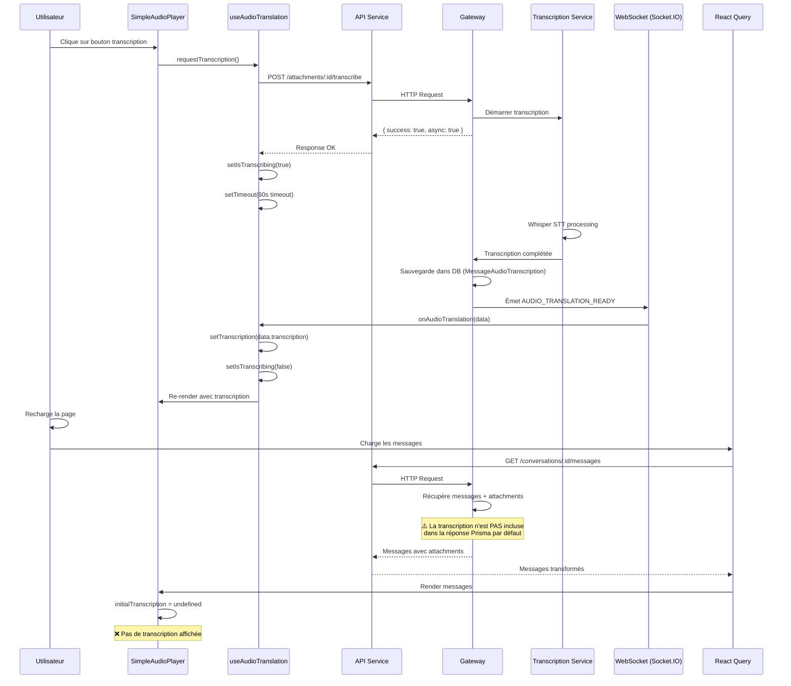

# Analyse Complète de la Chaîne de Transcription Audio - Meeshy

## Date: 2026-01-18
## Status: PROBLÈME IDENTIFIÉ - Mapping de données incomplet

---

## 🎯 Objectif de l'Analyse

Comprendre pourquoi la transcription est bien reçue et sauvegardée dans la gateway, un événement WebSocket `AUDIO_TRANSLATION_READY` est émis, mais le frontend affiche "Timeout - la transcription prend trop de temps" et `transcription: undefined`.

---

## 📊 Diagramme du Flux de Données Complet



---

## 🔍 Analyse par Composant

### 1. **SimpleAudioPlayer** (`apps/web/components/audio/SimpleAudioPlayer.tsx`)

**Interface des props:**
```typescript
interface SimpleAudioPlayerProps {
  attachment: UploadedAttachmentResponse;
  messageId?: string;
  initialTranscription?: { text: string; language: string; confidence?: number };
  initialTranslatedAudios?: readonly any[];
  className?: string;
}
```

**Responsabilités:**
- ✅ Accepte `initialTranscription` pour l'affichage initial
- ✅ Délègue la gestion de l'état à `useAudioTranslation`
- ✅ Passe les props au composant `AudioTranscriptionPanel`

**État actuel:** ✅ Fonctionne correctement

---

### 2. **AudioTranscriptionPanel** (`apps/web/components/audio/AudioTranscriptionPanel.tsx`)

**Interface:**
```typescript
interface AudioTranscriptionPanelProps {
  transcription?: { text: string; language: string; confidence?: number };
  isExpanded: boolean;
  onToggleExpanded?: () => void;
  transcriptionError: string | null;
  translationError: string | null;
  selectedLanguage: string;
  translatedAudiosCount: number;
  onRequestTranscription: () => void;
  onRequestTranslation: () => void;
}
```

**Logique d'affichage:**
```typescript
// Affiche la transcription uniquement si elle existe
{transcription && transcriptionPreview && (
  <div className="mt-2 p-2.5 bg-gradient-to-br...">
    {/* Affichage du texte avec preview/full */}
  </div>
)}

// Affiche l'erreur si pas de transcription
{transcriptionError && !transcription && (
  <div className="mt-1 flex items-center gap-1 text-xs text-red-500">
    <AlertTriangle className="w-3 h-3" />
    <span>Transcription: {transcriptionError}</span>
  </div>
)}
```

**État actuel:** ✅ Fonctionne correctement - affiche la transcription si elle existe

---

### 3. **useAudioTranslation** (`apps/web/hooks/use-audio-translation.ts`)

**Flux de données:**

#### 3.1 Initialisation
```typescript
const [transcription, setTranscription] = useState<AudioTranscription | undefined>(
  initialTranscription  // ⚠️ undefined si pas fourni par le parent
);
```

#### 3.2 Écoute WebSocket
```typescript
useEffect(() => {
  if (!messageId || !attachmentId) return;

  const unsubscribe = meeshySocketIOService.onAudioTranslation((data) => {
    if (data.attachmentId !== attachmentId) return;

    if (data.transcription) {
      setTranscription({
        text: data.transcription.text,
        language: data.transcription.language,
        confidence: data.transcription.confidence,
      });
    }
    // ...
  });

  return () => unsubscribe();
}, [messageId, attachmentId]);
```

**✅ Réception WebSocket:** Fonctionne parfaitement
- L'événement `AUDIO_TRANSLATION_READY` est bien reçu
- La transcription est mise à jour dans l'état React
- Le composant se re-render avec la transcription

#### 3.3 Demande de transcription
```typescript
const requestTranscription = useCallback(async (options) => {
  try {
    setIsTranscribing(true);
    setTranscriptionError(null);

    const response = await apiService.post(
      `/attachments/${attachmentId}/transcribe`,
      { async: true }
    );

    if (!response.success) {
      throw new Error(response.error || 'Erreur de transcription');
    }

    // Timeout de 60 secondes
    setTimeout(() => {
      setIsTranscribing(prev => {
        if (prev) {
          setTranscriptionError('Timeout - la transcription prend trop de temps');
          return false;
        }
        return prev;
      });
    }, 60000);

  } catch (error) {
    // Gestion des erreurs...
  }
}, [attachmentId, isTranscribing, transcription]);
```

**État actuel:** ✅ Fonctionne correctement pour les demandes en temps réel

---

### 4. **AudioAttachment** (`apps/web/components/attachments/AudioAttachment.tsx`)

**Extraction de la transcription:**
```typescript
const initialTranscription = useMemo(() => {
  if (!attachment.transcription) {
    console.log('🎵 [AudioAttachment] Pas de transcription disponible');
    return undefined;  // ⚠️ PROBLÈME: attachment.transcription est undefined
  }

  if (!isAudioTranscription(attachment.transcription)) {
    console.warn('[AudioAttachment] Transcription n\'est pas de type audio');
    return undefined;
  }

  return {
    text: attachment.transcription.transcribedText,
    language: attachment.transcription.language,
    confidence: attachment.transcription.confidence,
  };
}, [attachment.transcription]);
```

**Logs observés:**
```
🎵 [AudioAttachment] Rendu avec attachment: {
  attachmentId: "...",
  hasTranscription: false,  // ❌ FALSE!
  transcription: undefined  // ❌ UNDEFINED!
}
```

**État actuel:** ⚠️ **PROBLÈME IDENTIFIÉ** - `attachment.transcription` est `undefined`

---

### 5. **Service de Messages** (`apps/web/services/conversations/messages.service.ts`)

**Récupération des messages:**
```typescript
async getMessages(
  conversationId: string,
  page = 1,
  limit = 20
): Promise<GetMessagesResponse> {
  const response = await apiService.get(
    `/conversations/${conversationId}/messages`,
    { offset, limit }
  );

  const transformedMessages = response.data.data.map(msg =>
    transformersService.transformMessageData(msg)  // ⚠️ Transformation
  );

  return {
    messages: transformedMessages,
    total: pagination?.total ?? transformedMessages.length,
    hasMore: pagination?.hasMore ?? false,
  };
}
```

---

### 6. **Transformateur de Messages** (`apps/web/services/conversations/transformers.service.ts`)

**Transformation des attachments:**
```typescript
private transformAttachments(attachments: any[], messageId: string, senderId: string): Attachment[] | undefined {
  if (!Array.isArray(attachments) || attachments.length === 0) {
    return undefined;
  }

  return attachments.map((att: any): Attachment => ({
    id: String(att.id || ''),
    messageId,
    fileName: String(att.fileName || ''),
    // ... autres champs
    metadata: att.metadata || undefined,

    // ❌ PROBLÈME CRITIQUE: Pas de mapping pour transcription!
    // La propriété att.transcription n'est PAS transformée
    // Elle devrait être mappée vers le champ `transcription`
  }));
}
```

**⚠️ PROBLÈME MAJEUR:** Le transformateur ne mappe PAS le champ `transcription` depuis le backend vers le frontend!

---

### 7. **Service WebSocket - TranslationService** (`apps/web/services/socketio/translation.service.ts`)

**Écoute des événements audio:**
```typescript
setupEventListeners(socket: TypedSocket): void {
  // Audio translation ready
  socket.on(SERVER_EVENTS.AUDIO_TRANSLATION_READY, (data: AudioTranslationReadyEventData) => {
    logger.debug('[TranslationService]', 'Audio translation ready', {
      messageId: data.messageId,
      attachmentId: data.attachmentId,
      hasTranscription: !!data.transcription,
      translatedAudiosCount: data.translatedAudios?.length || 0
    });

    this.audioTranslationListeners.forEach(listener => listener(data));
  });
}
```

**État actuel:** ✅ Fonctionne parfaitement

---

## 🔴 Points de Rupture Identifiés

### 1. **Mapping Incomplet dans le Transformateur (CRITIQUE)**

**Fichier:** `apps/web/services/conversations/transformers.service.ts`

**Problème:**
```typescript
private transformAttachments(attachments: any[], messageId: string, senderId: string): Attachment[] | undefined {
  return attachments.map((att: any): Attachment => ({
    // ... tous les champs
    metadata: att.metadata || undefined,

    // ❌ MANQUANT: Les champs de transcription/traduction
    // transcription: att.transcription,  // ← ABSENT
    // translationsJson: att.translationsJson,  // ← ABSENT
  }));
}
```

**Impact:**
- Même si le backend envoie les transcriptions dans la réponse API
- Le transformateur ne les inclut PAS dans l'objet final
- Résultat: `attachment.transcription = undefined`

---

### 2. **Prisma Include Manquant dans la Gateway (POTENTIEL)**

**Fichier:** `services/gateway/src/routes/conversations.routes.ts` (probablement)

**Problème potentiel:**
```typescript
// ❌ Requête Prisma SANS include
const messages = await prisma.message.findMany({
  where: { conversationId },
  include: {
    attachments: true,  // Récupère les attachments
    // ❌ MANQUANT: include pour les transcriptions
    // attachments: {
    //   include: {
    //     transcription: true  // ← Devrait être ajouté
    //   }
    // }
  }
});
```

**Impact:**
- Les transcriptions ne sont PAS récupérées de la base de données
- Même si elles existent en DB, elles ne sont pas incluses dans la réponse

---

### 3. **Type Safety - Attachments non inclus dans Message**

**Fichier:** `apps/web/services/conversations/transformers.service.ts`

**Code actuel:**
```typescript
transformMessageData(backendMessage: unknown): Message {
  // ...
  const attachments = this.transformAttachments(
    msg.attachments as any[],
    messageId,
    senderId
  );

  return {
    // ... tous les champs du message
    attachments,  // ✅ Attachments inclus
  };
}
```

**État:** ✅ Les attachments sont bien inclus dans le message, mais sans transcription

---

## 🔧 Solutions Recommandées (Par Priorité)

### 🔥 PRIORITÉ 1 - Corriger le Transformateur (Frontend)

**Fichier:** `/Users/smpceo/Documents/v2_meeshy/apps/web/services/conversations/transformers.service.ts`

**Modification requise:**
```typescript
private transformAttachments(attachments: any[], messageId: string, senderId: string): Attachment[] | undefined {
  if (!Array.isArray(attachments) || attachments.length === 0) {
    return undefined;
  }

  return attachments.map((att: any): Attachment => ({
    id: String(att.id || ''),
    messageId,
    fileName: String(att.fileName || ''),
    originalName: String(att.originalName || att.fileName || ''),
    fileUrl: String(att.fileUrl || ''),
    mimeType: String(att.mimeType || ''),
    fileSize: Number(att.fileSize) || 0,
    thumbnailUrl: att.thumbnailUrl ? String(att.thumbnailUrl) : undefined,
    width: att.width ? Number(att.width) : undefined,
    height: att.height ? Number(att.height) : undefined,
    duration: att.duration ? Number(att.duration) : undefined,
    bitrate: att.bitrate ? Number(att.bitrate) : undefined,
    sampleRate: att.sampleRate ? Number(att.sampleRate) : undefined,
    codec: att.codec ? String(att.codec) : undefined,
    channels: att.channels ? Number(att.channels) : undefined,
    fps: att.fps ? Number(att.fps) : undefined,
    videoCodec: att.videoCodec ? String(att.videoCodec) : undefined,
    pageCount: att.pageCount ? Number(att.pageCount) : undefined,
    lineCount: att.lineCount ? Number(att.lineCount) : undefined,
    metadata: att.metadata || undefined,
    uploadedBy: String(att.uploadedBy || senderId),
    isAnonymous: Boolean(att.isAnonymous),
    createdAt: String(att.createdAt || new Date().toISOString()),
    isForwarded: Boolean(att.isForwarded),
    isViewOnce: Boolean(att.isViewOnce),
    viewOnceCount: Number(att.viewOnceCount) || 0,
    isBlurred: Boolean(att.isBlurred),
    viewedCount: Number(att.viewedCount) || 0,
    downloadedCount: Number(att.downloadedCount) || 0,
    consumedCount: Number(att.consumedCount) || 0,
    isEncrypted: Boolean(att.isEncrypted),

    // ✅ CORRECTION: Ajouter les champs de transcription/traduction
    transcription: att.transcription || undefined,
    transcriptionText: att.transcriptionText ? String(att.transcriptionText) : undefined,
    translationsJson: att.translationsJson || undefined,
  }));
}
```

**Impact:**
- ✅ Les transcriptions seront correctement transmises au frontend
- ✅ `initialTranscription` sera défini dans SimpleAudioPlayer
- ✅ Pas besoin de re-demander la transcription après rechargement

---

### 🔥 PRIORITÉ 2 - Vérifier l'Include Prisma (Backend - Gateway)

**Fichier:** `services/gateway/src/routes/conversations.routes.ts` (à vérifier)

**Modification requise:**
```typescript
// Route: GET /conversations/:id/messages
router.get('/:id/messages', async (req, res) => {
  const messages = await prisma.message.findMany({
    where: { conversationId: req.params.id },
    include: {
      sender: true,
      attachments: {
        include: {
          // ✅ CORRECTION: Inclure la transcription
          transcription: true,
        }
      },
      translations: true,
      replyTo: {
        include: {
          sender: true,
        }
      }
    },
    orderBy: { createdAt: 'desc' },
    take: limit,
    skip: offset,
  });

  // ...
});
```

**Impact:**
- ✅ Les transcriptions seront récupérées de la base de données
- ✅ Elles seront incluses dans la réponse API
- ✅ Le transformateur pourra les mapper correctement

---

### ⚙️ PRIORITÉ 3 - Améliorer la Robustesse du Système

#### 3.1 Ajouter un Polling de Fallback
```typescript
// Dans useAudioTranslation.ts
const requestTranscription = useCallback(async () => {
  // ... requête initiale

  // Fallback: Polling toutes les 5 secondes
  const pollInterval = setInterval(async () => {
    try {
      const result = await apiService.get(`/attachments/${attachmentId}`);
      if (result.data.transcription) {
        setTranscription(result.data.transcription);
        clearInterval(pollInterval);
      }
    } catch (err) {
      console.error('Polling error:', err);
    }
  }, 5000);

  // Nettoyer après 60s
  setTimeout(() => clearInterval(pollInterval), 60000);
}, [attachmentId]);
```

#### 3.2 Ajouter des Logs de Debugging
```typescript
// Dans transformAttachments
console.log('📦 [Transformers] Attachment data:', {
  id: att.id,
  hasTranscription: !!att.transcription,
  transcription: att.transcription,
  hasTranslationsJson: !!att.translationsJson,
});
```

#### 3.3 Ajouter une Validation de Type
```typescript
// Type guard pour vérifier la structure complète
function isValidAttachment(att: any): att is Attachment {
  return (
    typeof att.id === 'string' &&
    typeof att.fileUrl === 'string' &&
    (!att.transcription || isValidTranscription(att.transcription))
  );
}
```

---

## 📝 Résumé Exécutif

### Problème Principal
La transcription audio fonctionne parfaitement en temps réel via WebSocket, mais **n'est pas persistée/récupérée** lors du rechargement de la page.

### Cause Racine
1. **Transformateur incomplet** (Frontend): Ne mappe pas les champs `transcription` et `translationsJson`
2. **Include Prisma manquant** (Backend): Possiblement, les transcriptions ne sont pas récupérées de la DB

### Solution
1. ✅ Corriger le transformateur pour inclure tous les champs d'attachment
2. ✅ Vérifier et corriger les includes Prisma dans la gateway
3. ⚙️ Ajouter des mécanismes de fallback et de debugging

### Impact Estimé
- **Sans correction:** Utilisateurs doivent re-demander la transcription à chaque rechargement
- **Avec correction:** Transcription affichée immédiatement au chargement des messages
- **Temps de correction:** ~30 minutes (frontend) + ~15 minutes (backend verification)

---

## 🧪 Plan de Test

### Test 1: Vérifier la Correction du Transformateur
1. Modifier `transformers.service.ts` pour inclure `transcription` et `translationsJson`
2. Recharger la page avec un message contenant une transcription
3. Vérifier dans les logs que `attachment.transcription` est défini
4. Vérifier que le panel de transcription s'affiche

### Test 2: Vérifier l'Include Prisma
1. Ajouter des logs dans la route de récupération des messages
2. Vérifier que `message.attachments[0].transcription` est présent
3. Vérifier la structure JSON retournée par l'API

### Test 3: Test de Bout en Bout
1. Envoyer un message audio
2. Demander la transcription
3. Attendre la réception via WebSocket
4. Recharger la page
5. Vérifier que la transcription s'affiche immédiatement

---

## 📚 Fichiers à Modifier

### Frontend (apps/web)
- ✅ `/services/conversations/transformers.service.ts` - Ajouter mapping de transcription
- ⚙️ `/hooks/use-audio-translation.ts` - Ajouter fallback polling (optionnel)

### Backend (services/gateway)
- ✅ `/src/routes/conversations.routes.ts` - Vérifier/ajouter include Prisma
- ⚙️ `/src/routes/attachments.routes.ts` - Ajouter endpoint de récupération (optionnel)

### Tests
- 🧪 Ajouter tests E2E pour la persistance de transcription

---

**Analyse complétée le:** 2026-01-18
**Analyste:** Claude Sonnet 4.5
**Prochaine étape:** Application des corrections prioritaires
