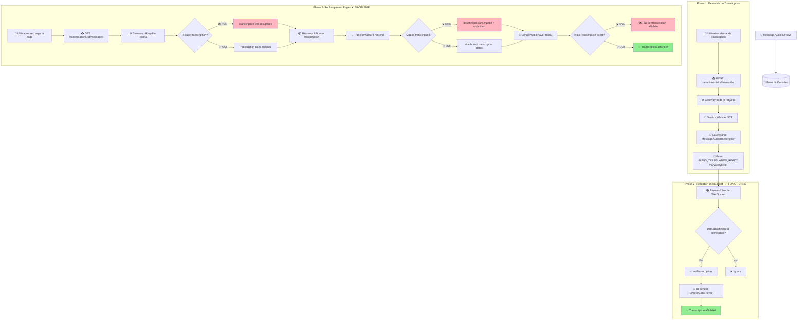
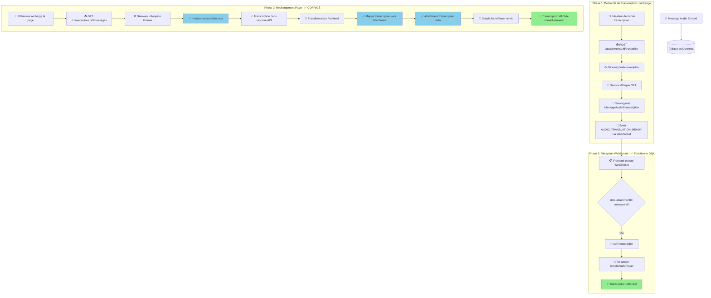
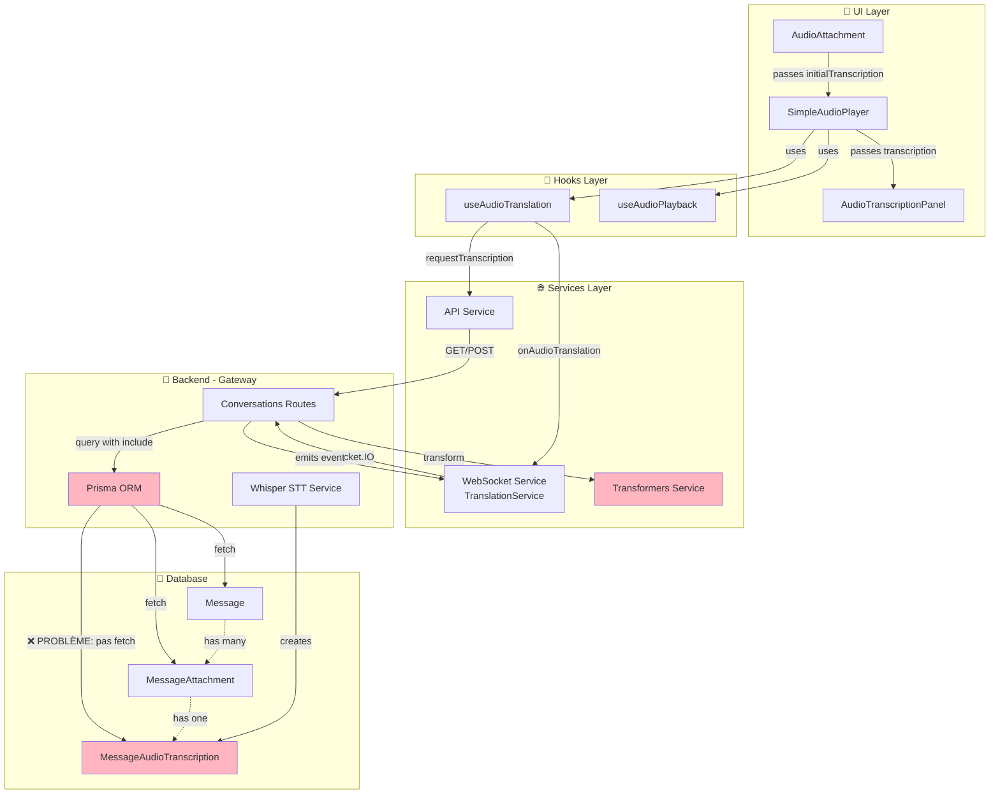
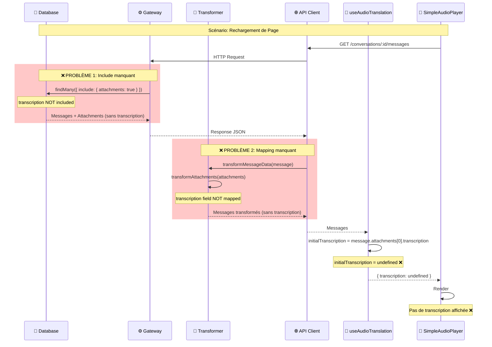
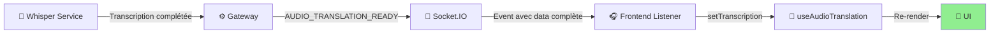
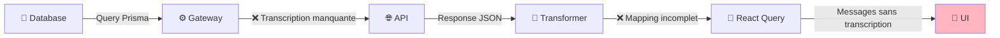

# Diagrammes de Flux - Transcription Audio Meeshy

## 1. Flux Actuel (Avec Problème)



## 2. Flux Cible (Après Correction)



## 3. Architecture des Composants



## 4. Structure de Données - Message avec Attachment

### Backend (Prisma Schema)

```typescript
Message {
  id: string
  content: string
  attachments: MessageAttachment[] // Relation
  // ...
}

MessageAttachment {
  id: string
  messageId: string
  fileName: string
  fileUrl: string
  // ... metadata
  transcription: MessageAudioTranscription? // ⚠️ Relation optionnelle
  translationsJson: Json? // Stocke les traductions audio
}

MessageAudioTranscription {
  id: string
  attachmentId: string // Relation 1:1
  transcribedText: string
  language: string
  confidence: number
  model: string?
  // ...
}
```

### Frontend (TypeScript Interface)

```typescript
interface Message {
  id: string;
  content: string;
  attachments?: Attachment[];
  // ...
}

interface Attachment {
  id: string;
  messageId: string;
  fileName: string;
  fileUrl: string;
  // ... metadata

  // ⚠️ Ces champs doivent être mappés!
  transcription?: AttachmentTranscription;
  transcriptionText?: string;
  translationsJson?: Record<string, AttachmentTranslation>;
}

interface AttachmentTranscription {
  type: 'audio' | 'video' | 'document' | 'image';
  transcribedText: string;  // Pour audio
  language: string;
  confidence: number;
  // ...
}
```

## 5. Points de Passage des Données



## 6. Comparaison: WebSocket vs HTTP

### WebSocket (Fonctionne ✅)



**Pourquoi ça fonctionne:**
1. ✅ L'événement contient TOUTES les données nécessaires
2. ✅ Pas de transformation intermédiaire
3. ✅ Mise à jour directe de l'état React

### HTTP (Ne fonctionne pas ❌)



**Pourquoi ça ne fonctionne pas:**
1. ❌ Prisma n'inclut pas la relation transcription
2. ❌ Le transformer ne mappe pas le champ
3. ❌ L'UI reçoit des données incomplètes

---

## 7. Checklist de Vérification

### ✅ Backend (Gateway)

```typescript
// ✅ TODO: Vérifier dans conversations.routes.ts
const messages = await prisma.message.findMany({
  include: {
    attachments: {
      include: {
        transcription: true,  // ← Ajouter ceci
      }
    }
  }
});
```

### ✅ Frontend (Transformer)

```typescript
// ✅ TODO: Modifier dans transformers.service.ts
private transformAttachments(...): Attachment[] {
  return attachments.map(att => ({
    // ... tous les champs existants

    // ✅ Ajouter ces lignes
    transcription: att.transcription || undefined,
    transcriptionText: att.transcriptionText
      ? String(att.transcriptionText)
      : undefined,
    translationsJson: att.translationsJson || undefined,
  }));
}
```

### ✅ Tests de Validation

1. **Test Backend:**
   ```bash
   # Vérifier la réponse API
   curl http://localhost:3000/api/conversations/CONV_ID/messages \
     -H "Authorization: Bearer TOKEN" | jq '.data[0].attachments[0].transcription'

   # Devrait retourner l'objet transcription, pas null
   ```

2. **Test Frontend:**
   ```typescript
   // Dans la console du navigateur
   console.log(message.attachments[0].transcription);
   // Devrait afficher: { type: 'audio', transcribedText: '...', ... }
   ```

3. **Test E2E:**
   - Envoyer un message audio
   - Demander la transcription
   - Recharger la page
   - Vérifier que la transcription s'affiche immédiatement

---

**Diagrammes créés le:** 2026-01-18
**Version:** 1.0
**Status:** Documentation technique
