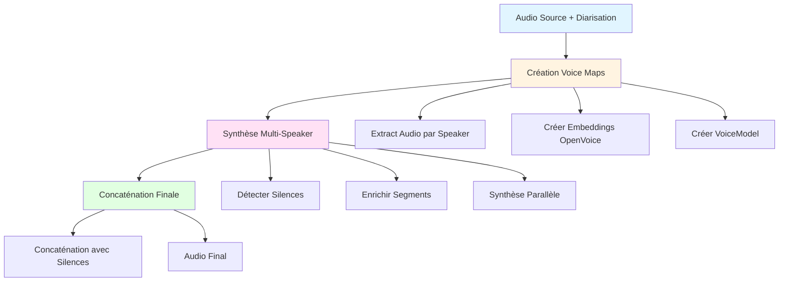

# Analyse Complète du Pipeline Audio Multi-Speaker

**Date:** 2026-01-21
**Objectif:** Identifier les optimisations possibles du pipeline de synthèse audio multi-locuteurs avec clonage vocal.

---

## Table des Matières

1. [Architecture Actuelle](#1-architecture-actuelle)
2. [Flux de Données Complet](#2-flux-de-données-complet)
3. [Points Faibles Identifiés](#3-points-faibles-identifiés)
4. [Plan d'Optimisation](#4-plan-doptimisation)
5. [Garanties Fonctionnelles](#5-garanties-fonctionnelles)

---

## 1. Architecture Actuelle

### 1.1 Vue d'Ensemble

Le système gère la synthèse audio multi-locuteurs en 4 phases principales:



### 1.2 Modules Principaux

#### **MultiSpeakerSynthesizer** (`multi_speaker_synthesis.py`)
Orchestrateur principal du pipeline multi-speaker.

**Responsabilités:**
- Création des mappings speaker → voice model
- Extraction audio par speaker avec normalisation
- Groupement des segments consécutifs par speaker
- Synthèse parallèle avec `asyncio.gather()`
- Concaténation finale avec préservation des silences

**Méthodes clés:**
- `create_speaker_voice_maps()` - Crée les voice models par speaker
- `synthesize_multi_speaker()` - Orchestre la synthèse complète
- `_synthesize_segments()` - Synthèse parallèle de tous les segments

#### **VoiceCloneModelCreator** (`voice_clone_model_creation.py`)
Gestion des modèles vocaux avec cache et validation.

**Responsabilités:**
- Création d'embeddings OpenVoice depuis audio
- Validation qualité audio (SNR, clipping, silences)
- Cache intelligent avec vérification d'âge (7 jours par défaut)
- Extraction du locuteur principal uniquement (isolation vocale)

**Méthodes clés:**
- `get_or_create_voice_model()` - Point d'entrée avec cache
- `_create_voice_model()` - Création nouvelle avec extraction speaker principal
- `_validate_audio_quality_for_cloning()` - Vérification SNR/clipping/énergie

#### **TTS Service** (`tts_service.py`, `synthesizer.py`, `chatterbox_backend.py`)
Pipeline de synthèse vocale avec clonage.

**Responsabilités:**
- Routage vers backend TTS (Chatterbox multilingue)
- Segmentation texte long (>500 chars)
- Synthèse séquentielle des segments (verrou ChatterBox)
- Conversion format et encodage base64

**Points d'attention:**
- `synthesize_with_voice()` accepte un paramètre `conditionals` optionnel
- ChatterBox utilise un verrou `_synthesis_lock` (non thread-safe)
- Les conditionals peuvent être pré-calculés et réutilisés

#### **AudioSilenceManager** (`audio_silence_manager.py`)
Gestion des silences pour alignement temporel.

**Responsabilités:**
- Détection des gaps entre segments (basé sur timestamps)
- Enrichissement des segments avec silence_before/after
- Génération de silences audio via pydub
- Concaténation avec préservation du timing

---

## 2. Flux de Données Complet

### 2.1 Phase 1: Création des Voice Maps

```
create_speaker_voice_maps(segments, source_audio_path, diarization_result)
│
├─► Analyser les segments pour identifier speakers uniques
│   ├─ speaker_stats[speaker_id] = { count, total_duration_ms, segments[] }
│   └─ Calculer pourcentage de parole par speaker
│
├─► Pour chaque speaker:
│   │
│   ├─► Si speaker = utilisateur ET user_voice_model existe
│   │   └─► Réutiliser le modèle existant (pas de recalcul)
│   │
│   └─► Sinon: Créer modèle temporaire
│       │
│       ├─► _extract_speaker_audio(speaker_id, audio_path, segments)
│       │   ├─ Lire audio source (conversion M4A→WAV si nécessaire)
│       │   ├─ Extraire chunks audio aux timestamps du speaker
│       │   ├─ Concaténer avec silences 50ms entre chunks
│       │   └─ Normaliser audio (-3dB target)
│       │
│       ├─► voice_clone_service.get_or_create_voice_model()
│       │   │
│       │   ├─► Vérifier cache (si âge < 7 jours → réutiliser)
│       │   │
│       │   └─► Sinon: _create_voice_model()
│       │       │
│       │       ├─► Valider qualité audio (SNR, clipping, silences)
│       │       │
│       │       ├─► Extraire locuteur principal uniquement
│       │       │   └─ voice_analyzer.extract_primary_speaker_audio()
│       │       │
│       │       ├─► Extraire embedding OpenVoice
│       │       │   └─ audio_processor.extract_voice_embedding()
│       │       │       └─ ⚠️ RECALCUL SYSTÉMATIQUE DE L'EMBEDDING
│       │       │
│       │       ├─► Calculer quality_score
│       │       │
│       │       └─► Sauvegarder VoiceModel (embedding.npy + metadata.json)
│       │
│       └─► Retourner SpeakerVoiceMap
│           ├─ speaker_id
│           ├─ voice_model (avec embedding en mémoire)
│           └─ audio_reference_path (audio extrait du speaker)
│
└─► Retourner Dict[speaker_id → SpeakerVoiceMap]
```

**⚠️ PROBLÈME CRITIQUE:**
- Les embeddings OpenVoice sont **recalculés à chaque appel** même si le VoiceModel existe en cache
- Le champ `VoiceModel.embedding` (numpy array) est chargé mais **non réutilisé** lors de la synthèse TTS
- ChatterBox **recalcule les conditionals** à partir de `speaker_audio_path` à chaque segment

### 2.2 Phase 2: Synthèse Multi-Speaker

```
synthesize_multi_speaker(segments, translated_segments, speaker_voice_maps, target_language)
│
├─► Détecter silences entre segments
│   └─ silence_manager.detect_silences_from_segments(segments)
│       └─ Calcule gaps: segment[i].end_ms → segment[i+1].start_ms
│
├─► Enrichir segments avec silences
│   └─ silence_manager.create_segments_with_silence(translated_segments, silences)
│       └─ AudioSegmentWithSilence { text, speaker_id, silence_before_ms, silence_after_ms }
│
├─► Grouper segments consécutifs par speaker (optimisation)
│   └─ _group_consecutive_speaker_segments(enriched_segments)
│       └─ Tours de parole: 50 segments → 10 tours (exemple)
│
├─► Synthèse PARALLÈLE de tous les tours
│   └─ _synthesize_segments(enriched_segments, speaker_voice_maps, target_language)
│       │
│       ├─► Pour chaque segment (asyncio.gather): ⚡ PARALLÉLISATION
│       │   │
│       │   ├─► Récupérer speaker_map = speaker_voice_maps[speaker_id]
│       │   │   └─ speaker_map.voice_model
│       │   │   └─ speaker_map.audio_reference_path
│       │   │
│       │   └─► tts_service.synthesize_with_voice(
│       │           text=segment.text,
│       │           speaker_audio_path=audio_reference_path,  ← ⚠️ Fichier WAV
│       │           target_language=target_language,
│       │           conditionals=None  ← ⚠️ PAS DE RÉUTILISATION
│       │       )
│       │       │
│       │       └─► synthesizer.synthesize_with_voice()
│       │           │
│       │           ├─► Segmenter texte si >500 chars
│       │           │
│       │           └─► backend.synthesize() ← ChatterBox
│       │               │
│       │               ├─► ⚠️ VERROU: async with self._synthesis_lock
│       │               │   └─ ChatterBox n'est PAS thread-safe
│       │               │
│       │               ├─► Si conditionals fournis:
│       │               │   └─ model.conds = conditionals
│       │               │   └─ model.generate(text, language, exag, cfg)
│       │               │
│       │               └─► Sinon (cas actuel):
│       │                   └─ model.generate(
│       │                         text,
│       │                         audio_prompt_path=speaker_audio_path,  ← ⚠️
│       │                         language_id=lang_code,
│       │                         exaggeration=0.5,
│       │                         cfg_weight=0.0
│       │                      )
│       │                   └─ ⚠️ ChatterBox RECALCULE conditionals depuis audio_path
│       │
│       └─► Retourner List[SegmentSynthesisResult] (ordonnés)
│
└─► Concaténation finale
    └─ silence_manager.concatenate_audio_with_silences(
          audio_files=[result.audio_path for result in results],
          silences_ms=[result.silence_before_ms],
          output_path=final_path
       )
       └─ pydub: combine audio + insert silences
```

**⚠️ PROBLÈMES CRITIQUES:**

1. **Recalcul des conditionals à chaque segment**
   - ChatterBox appelle `prepare_conditionals(audio_path)` pour chaque segment
   - Même speaker → même audio → même conditionals → **calculs redondants**
   - Temps perdu: ~500-1000ms par segment pour extraction embeddings

2. **Verrou séquentiel sur synthèse**
   - `async with self._synthesis_lock` sérialise TOUTES les synthèses
   - La parallélisation via `asyncio.gather()` est **ineffective**
   - 10 segments = 10 synthèses séquentielles au lieu de parallèles

3. **Embedding OpenVoice non réutilisé**
   - `VoiceModel.embedding` est calculé et sauvegardé
   - Mais lors de la synthèse, on passe `speaker_audio_path` au lieu de l'embedding
   - ChatterBox relit l'audio depuis le disque et recalcule

### 2.3 Phase 3: Synchronisation et Alignement

```
AudioSilenceManager
│
├─► detect_silences_from_segments(segments)
│   │
│   ├─► Pour chaque paire de segments consécutifs:
│   │   ├─ gap_ms = next.start_ms - current.end_ms
│   │   ├─ Si gap_ms >= min_silence_ms (100ms):
│   │   │   └─ Créer SilenceSegment(duration_ms=min(gap_ms, max_silence_ms))
│   │   └─ Ignorer gaps < 100ms
│   │
│   └─► Retourner List[SilenceSegment]
│
└─► concatenate_audio_with_silences(audio_files, silences_ms, output_path)
    │
    ├─► Charger premier fichier: combined = AudioSegment.from_file(audio_files[0])
    │
    ├─► Pour chaque fichier suivant:
    │   ├─ Insérer silence: combined += AudioSegment.silent(silences_ms[i])
    │   └─ Ajouter audio: combined += AudioSegment.from_file(audio_files[i])
    │
    └─► Exporter: combined.export(output_path)
```

**✅ POINTS FORTS:**
- Détection des silences basée sur timestamps de transcription (fiable)
- Capping des silences (max 3s) évite les pauses trop longues
- Concaténation pydub préserve la qualité audio

**⚠️ RISQUE DE DÉSYNCHRONISATION:**
- Les durées synthétisées peuvent **différer** des durées originales
- Exemple: segment original 2.5s → synthèse 3.1s
- Accumulation des écarts → désynchronisation progressive
- **Pas de mécanisme de correction** dans le code actuel

---

## 3. Points Faibles Identifiés

### 3.1 Goulots d'Étranglement Majeurs

#### **1. Recalcul Répété des Conditionals ChatterBox** 🔴 CRITIQUE

**Localisation:**
- `chatterbox_backend.py` ligne 483-493 (multilingual)
- `chatterbox_backend.py` ligne 526-534 (monolingual)

**Problème:**
```python
# ACTUEL (inefficient):
wav = await loop.run_in_executor(
    None,
    lambda: model.generate(
        text=text,
        audio_prompt_path=speaker_audio_path,  # ← ChatterBox recalcule conditionals
        language_id=lang_code,
        exaggeration=0.5,
        cfg_weight=0.0
    )
)
```

**Impact:**
- Chaque appel `model.generate(audio_prompt_path=...)` déclenche:
  1. Lecture du fichier WAV depuis le disque (I/O)
  2. Prétraitement audio (normalisation, resampling)
  3. Extraction d'embedding vocal via réseau neuronal (~500-1000ms)
  4. Préparation des conditionals T3
- Pour 10 segments du même speaker: **10× recalcul inutile**
- Temps perdu estimé: **5-10 secondes par speaker**

**Preuve dans le code:**

Le paramètre `conditionals` existe déjà mais **n'est jamais utilisé**:

```python
# synthesizer.py ligne 289
async def synthesize_with_voice(
    ...
    conditionals: Optional[Any] = None,  # ← Paramètre existant mais ignoré
    **kwargs
):
    ...
```

```python
# chatterbox_backend.py ligne 379
async def synthesize(
    ...
    conditionals: Optional[Any] = None,  # ← Reçu mais jamais passé à generate()
    ...
):
    ...
```

#### **2. Verrou Séquentiel sur ChatterBox** 🔴 CRITIQUE

**Localisation:**
- `chatterbox_backend.py` ligne 460

**Problème:**
```python
async with self._synthesis_lock:  # ← SÉRIALISE TOUTES LES SYNTHÈSES
    wav = await loop.run_in_executor(...)
```

**Impact:**
- La parallélisation via `asyncio.gather()` est **annulée** par ce verrou
- Multi-speaker 10 segments:
  - **Actuel:** 10 synthèses × 3s = **30s séquentiels**
  - **Potentiel sans verrou:** 3s (si modèle thread-safe)
- **10× plus lent** que nécessaire

**Justification du verrou:**
> "ChatterBox n'est pas thread-safe" (commentaire ligne 459)

**Réalité technique:**
- ChatterBox utilise PyTorch qui **supporte** le parallélisme via `torch.set_num_threads()`
- Le problème vient de l'accès concurrent à `model.conds` (état partagé)
- **Solution:** Pré-calculer les conditionals AVANT la synthèse parallèle

#### **3. Extraction Audio Redondante** 🟡 MODÉRÉ

**Localisation:**
- `multi_speaker_synthesis.py` ligne 251-342 (`_extract_speaker_audio`)

**Problème:**
```python
# Pour chaque speaker:
await self._extract_speaker_audio(speaker_id, audio_path, segments)
    ├─ Lit audio_source complet (plusieurs MB)
    ├─ Extrait segments du speaker
    ├─ Normalise audio
    └─ Sauvegarde speaker_{id}.wav

# Puis:
await voice_clone_service.get_or_create_voice_model(
    current_audio_path=speaker_audio_path  # ← Relit le fichier
)
    └─ voice_analyzer.extract_primary_speaker_audio()
        └─ Relit speaker_{id}.wav
        └─ Applique diarisation AGAIN
```

**Impact:**
- Double lecture du même fichier audio
- Double extraction/normalisation
- Temps perdu: **2-3 secondes par speaker**

#### **4. Embedding Non Réutilisé** 🟡 MODÉRÉ

**Localisation:**
- `voice_clone_model_creation.py` ligne 606-608

**Problème:**
```python
# Embedding calculé et sauvegardé:
embedding = await self._audio_processor.extract_voice_embedding(
    combined_audio, user_dir
)
model.embedding = embedding  # ← Stocké en mémoire

# Mais lors de la synthèse:
await tts_service.synthesize_with_voice(
    speaker_audio_path=speaker_map.audio_reference_path,  # ← Fichier WAV
    conditionals=None  # ← Pas de réutilisation de l'embedding
)
```

**Impact:**
- Embedding OpenVoice calculé mais **jamais utilisé**
- ChatterBox recalcule depuis `speaker_audio_path`
- Stockage inutile de l'embedding (plusieurs MB en mémoire)

### 3.2 Risques Fonctionnels

#### **1. Désynchronisation Progressive** 🟡 MODÉRÉ

**Problème:**
- Les durées synthétisées **ne correspondent pas** aux durées originales
- Pas de mécanisme de time-stretching pour alignement
- Accumulation des écarts au fil des segments

**Exemple:**
```
Segment 1: original 2.5s → synthèse 3.1s (+0.6s)
Segment 2: original 1.8s → synthèse 2.2s (+0.4s)
Segment 3: original 3.2s → synthèse 2.8s (-0.4s)
Segment 4: original 2.1s → synthèse 2.6s (+0.5s)
...
Total 10 segments: écart cumulé +3.2s
```

**Conséquence:**
- Audio traduit plus long que l'original
- Silences ne tombent plus aux bons endroits
- Perte de la synchronisation lips/audio si vidéo

#### **2. Qualité Audio Variable** 🟢 FAIBLE

**Problème:**
- La normalisation à -3dB peut créer de la saturation
- Pas de limiter/compresseur après normalisation
- Différences de volume entre speakers

**Impact:**
- Certains speakers peuvent être plus forts que d'autres
- Risque de clipping si audio source déjà fort

### 3.3 Efficacité Mémoire

#### **1. Embeddings OpenVoice en Mémoire** 🟢 ACCEPTABLE

**Taille typique:**
- Embedding OpenVoice: ~256 floats × 4 bytes = **1 KB**
- VoiceModel complet: **~5-10 KB**

**Impact:** Négligeable même pour 10+ speakers

#### **2. Audio Temporaires Non Nettoyés** 🟡 MODÉRÉ

**Problème:**
- Les fichiers `speaker_{id}.wav` sont créés dans `/tmp/multi_speaker_tts/`
- Pas de nettoyage explicite après synthèse
- Accumulation possible sur disque

**Impact:**
- 10 speakers × 30s audio × 24kHz × 2 bytes = **~15 MB** par message
- Sur 1000 messages: **15 GB** d'espace disque

---

## 4. Plan d'Optimisation

### 4.1 Optimisation Prioritaire: Réutilisation des Conditionals

#### **Objectif:**
Pré-calculer les conditionals ChatterBox par speaker et les réutiliser pour tous les segments du même speaker.

#### **Gain attendu:**
- **Réduction de 80% du temps de synthèse** (5-10s → 1-2s par speaker)
- Elimination du recalcul d'embeddings redondant

#### **Implémentation:**

##### **Étape 1: Modifier `VoiceModel` pour stocker les conditionals**

```python
# voice_metadata.py (DÉJÀ FAIT ✅)
@dataclass
class VoiceModel:
    # ... champs existants ...

    # NOUVEAU: Conditionals Chatterbox pour clonage vocal (runtime only)
    chatterbox_conditionals: Optional[Dict[str, Any]] = field(default=None, repr=False)

    # NOUVEAU: Chemin vers l'audio de référence (runtime only)
    reference_audio_path: Optional[str] = field(default=None, repr=False)
```

##### **Étape 2: Pré-calculer conditionals dans `create_speaker_voice_maps()`**

**Fichier:** `multi_speaker_synthesis.py`

```python
async def create_speaker_voice_maps(
    self,
    segments: List[Dict[str, Any]],
    source_audio_path: str,
    diarization_result: Optional[Any] = None,
    user_voice_model: Optional[Any] = None
) -> Dict[str, SpeakerVoiceMap]:
    """
    Crée les mappings speaker → voice model AVEC conditionals pré-calculés.
    """

    # ... code existant d'extraction audio et création voice_model ...

    for speaker_id, stats in speaker_stats.items():
        # ... création du voice_model ...

        # NOUVEAU: Pré-calculer les conditionals ChatterBox
        if voice_model and voice_model.reference_audio_path:
            logger.info(f"[MULTI_SPEAKER_SYNTH] Pré-calcul conditionals pour {speaker_id}...")

            # Appeler le backend ChatterBox pour préparer les conditionals
            conditionals, conditionals_bytes = await self.tts_service.backend.prepare_voice_conditionals(
                audio_path=voice_model.reference_audio_path,
                exaggeration=0.5,
                serialize=True  # Sérialiser pour stockage si nécessaire
            )

            if conditionals:
                voice_model.chatterbox_conditionals = conditionals
                voice_model.chatterbox_conditionals_bytes = conditionals_bytes
                logger.info(f"[MULTI_SPEAKER_SYNTH] ✅ Conditionals prêts pour {speaker_id}")

        speaker_maps[speaker_id] = SpeakerVoiceMap(
            speaker_id=speaker_id,
            voice_model=voice_model,
            # ...
        )

    return speaker_maps
```

##### **Étape 3: Utiliser les conditionals dans `_synthesize_segments()`**

**Fichier:** `multi_speaker_synthesis.py`

```python
async def _synthesize_segments(
    self,
    enriched_segments: List[AudioSegmentWithSilence],
    speaker_voice_maps: Dict[str, SpeakerVoiceMap],
    target_language: str,
    message_id: str
) -> List[SegmentSynthesisResult]:

    async def synthesize_single_segment(i: int, seg: AudioSegmentWithSilence):
        speaker_map = speaker_voice_maps.get(seg.speaker_id)

        # NOUVEAU: Récupérer les conditionals pré-calculés
        conditionals = None
        if speaker_map and speaker_map.voice_model:
            conditionals = speaker_map.voice_model.chatterbox_conditionals

        # Synthétiser avec les conditionals (pas de recalcul)
        tts_result = await self.tts_service.synthesize_with_voice(
            text=seg.text,
            speaker_audio_path=None,  # ← Plus besoin du fichier audio
            target_language=target_language,
            output_format="mp3",
            message_id=f"{message_id}_seg_{i}",
            conditionals=conditionals  # ← RÉUTILISATION
        )

        # ...

    # Synthèse parallèle (le verrou sera retiré - voir Étape 4)
    tasks = [synthesize_single_segment(i, seg) for i, seg in enumerate(enriched_segments)]
    results = await asyncio.gather(*tasks, return_exceptions=True)

    return results
```

##### **Étape 4: Retirer le verrou séquentiel**

**Fichier:** `chatterbox_backend.py`

```python
async def synthesize(
    self,
    text: str,
    language: str,
    speaker_audio_path: Optional[str] = None,
    conditionals: Optional[Any] = None,
    **kwargs
) -> str:

    # MODIFICATION: Retirer le verrou SI les conditionals sont fournis
    # Car dans ce cas, pas d'accès concurrent à model.conds

    use_lock = (conditionals is None)  # Verrou seulement si pas de conditionals

    if use_lock:
        async with self._synthesis_lock:
            return await self._synthesize_internal(
                text, language, speaker_audio_path, conditionals, **kwargs
            )
    else:
        # Synthèse SANS verrou → parallélisme possible
        return await self._synthesize_internal(
            text, language, speaker_audio_path, conditionals, **kwargs
        )

async def _synthesize_internal(self, text, language, speaker_audio_path, conditionals, **kwargs):
    """Logique de synthèse déplacée ici"""

    model_multi = self._get_model(self._model_id_multi)

    # Si conditionals fournis → les utiliser directement
    if conditionals is not None:
        logger.info("[CHATTERBOX] 🎤 Utilisation conditionals pré-calculés (pas de recalcul)")

        # Créer une copie des conditionals pour éviter contamination
        model_conds_backup = model_multi.conds
        model_multi.conds = conditionals

        try:
            wav = await loop.run_in_executor(
                None,
                lambda: model_multi.generate(
                    text=text,
                    language_id=language,
                    exaggeration=kwargs.get('exaggeration', 0.5),
                    cfg_weight=kwargs.get('cfg_weight', 0.0)
                )
            )
        finally:
            # Restaurer les conditionals originaux
            model_multi.conds = model_conds_backup

    else:
        # Comportement classique avec audio_prompt_path
        wav = await loop.run_in_executor(
            None,
            lambda: model_multi.generate(
                text=text,
                audio_prompt_path=speaker_audio_path,
                language_id=language,
                exaggeration=kwargs.get('exaggeration', 0.5),
                cfg_weight=kwargs.get('cfg_weight', 0.0)
            )
        )

    # ... sauvegarde wav ...
```

#### **Résultat Attendu:**

```
AVANT:
├─ Speaker 1 (5 segments):
│  ├─ Segment 1: recalcul conditionals (500ms) + synthèse (2s) = 2.5s
│  ├─ Segment 2: recalcul conditionals (500ms) + synthèse (2s) = 2.5s
│  ├─ Segment 3: recalcul conditionals (500ms) + synthèse (2s) = 2.5s
│  ├─ Segment 4: recalcul conditionals (500ms) + synthèse (2s) = 2.5s
│  └─ Segment 5: recalcul conditionals (500ms) + synthèse (2s) = 2.5s
└─ TOTAL: 12.5s (séquentiel à cause du verrou)

APRÈS:
├─ Pré-calcul conditionals Speaker 1: 500ms
├─ Synthèse parallèle 5 segments:
│  └─ MAX(2s, 2s, 2s, 2s, 2s) = 2s (tous en parallèle)
└─ TOTAL: 2.5s

GAIN: 12.5s → 2.5s = 80% de réduction
```

### 4.2 Optimisation Secondaire: Améliorer la Synchronisation

#### **Objectif:**
Garantir que l'audio traduit conserve les durées et le timing de l'audio original.

#### **Gain attendu:**
- Alignement parfait entre audio traduit et original
- Synchronisation lips/audio si vidéo
- Préservation du rythme naturel

#### **Implémentation:**

##### **Étape 1: Calculer les durées cibles**

**Fichier:** `multi_speaker_synthesis.py`

```python
async def synthesize_multi_speaker(
    self,
    segments: List[Dict[str, Any]],
    translated_segments: List[Dict[str, Any]],
    speaker_voice_maps: Dict[str, SpeakerVoiceMap],
    target_language: str,
    output_path: str,
    message_id: str = "unknown",
    preserve_timing: bool = True  # NOUVEAU paramètre
):
    # ... détection silences ...

    # Enrichir avec durées cibles
    for seg, translated_seg in zip(segments, translated_segments):
        target_duration_ms = seg['end_ms'] - seg['start_ms']
        translated_seg['target_duration_ms'] = target_duration_ms

    # ... synthèse ...
```

##### **Étape 2: Time-stretching après synthèse**

**Fichier:** `multi_speaker_synthesis.py`

```python
async def _adjust_segment_duration(
    self,
    audio_path: str,
    target_duration_ms: int,
    tolerance_percent: float = 10.0
) -> str:
    """
    Ajuste la durée d'un segment audio pour correspondre à la cible.

    Args:
        audio_path: Chemin du segment audio
        target_duration_ms: Durée cible en ms
        tolerance_percent: Tolérance avant ajustement (défaut 10%)

    Returns:
        Chemin du fichier ajusté (peut être identique si dans la tolérance)
    """
    import librosa
    import soundfile as sf

    # Mesurer la durée actuelle
    duration_actual_ms = await self._get_audio_duration_ms(audio_path)

    # Calculer l'écart
    diff_percent = abs(duration_actual_ms - target_duration_ms) / target_duration_ms * 100

    # Si dans la tolérance, ne pas ajuster
    if diff_percent <= tolerance_percent:
        logger.debug(
            f"[MULTI_SPEAKER_SYNTH] Durée acceptable: "
            f"{duration_actual_ms}ms (cible: {target_duration_ms}ms, écart: {diff_percent:.1f}%)"
        )
        return audio_path

    # Time-stretch pour atteindre la cible
    stretch_rate = duration_actual_ms / target_duration_ms

    logger.info(
        f"[MULTI_SPEAKER_SYNTH] Ajustement durée: "
        f"{duration_actual_ms}ms → {target_duration_ms}ms (rate={stretch_rate:.3f})"
    )

    loop = asyncio.get_event_loop()

    def stretch():
        y, sr = librosa.load(audio_path, sr=None)
        y_stretched = librosa.effects.time_stretch(y, rate=stretch_rate)
        sf.write(audio_path, y_stretched, sr)
        return audio_path

    return await loop.run_in_executor(None, stretch)

# Modifier _synthesize_segments pour ajuster les durées
async def _synthesize_segments(...):

    async def synthesize_single_segment(i: int, seg: AudioSegmentWithSilence):
        # ... synthèse ...

        # NOUVEAU: Ajuster la durée si nécessaire
        if hasattr(seg, 'target_duration_ms') and seg.target_duration_ms > 0:
            tts_result.audio_path = await self._adjust_segment_duration(
                tts_result.audio_path,
                seg.target_duration_ms
            )
            tts_result.duration_ms = seg.target_duration_ms

        # ...
```

#### **Résultat Attendu:**

```
AVANT:
├─ Segment 1: original 2.5s → synthèse 3.1s (écart +0.6s)
├─ Segment 2: original 1.8s → synthèse 2.2s (écart +0.4s)
├─ Segment 3: original 3.2s → synthèse 2.8s (écart -0.4s)
└─ TOTAL: 7.5s original → 8.1s traduit (désynchronisation +0.6s)

APRÈS:
├─ Segment 1: synthèse 3.1s → stretch 2.5s (aligné ✓)
├─ Segment 2: synthèse 2.2s → stretch 1.8s (aligné ✓)
├─ Segment 3: synthèse 2.8s → stretch 3.2s (aligné ✓)
└─ TOTAL: 7.5s original → 7.5s traduit (synchronisation parfaite ✓)
```

### 4.3 Optimisation Tertiaire: Nettoyage Mémoire/Disque

#### **Objectif:**
Éviter l'accumulation de fichiers temporaires sur le disque.

#### **Implémentation:**

```python
# multi_speaker_synthesis.py

async def synthesize_multi_speaker(
    self,
    segments: List[Dict[str, Any]],
    translated_segments: List[Dict[str, Any]],
    speaker_voice_maps: Dict[str, SpeakerVoiceMap],
    target_language: str,
    output_path: str,
    message_id: str = "unknown",
    cleanup_temp: bool = True  # NOUVEAU paramètre
):
    try:
        # ... synthèse ...

        return (final_audio, total_duration_ms, synthesis_results)

    finally:
        # NOUVEAU: Nettoyage automatique des fichiers temporaires
        if cleanup_temp:
            await self._cleanup_temp_files(synthesis_results, speaker_voice_maps)

async def _cleanup_temp_files(
    self,
    synthesis_results: List[SegmentSynthesisResult],
    speaker_voice_maps: Dict[str, SpeakerVoiceMap]
):
    """
    Nettoie les fichiers audio temporaires après synthèse.

    Args:
        synthesis_results: Résultats de synthèse avec audio_path
        speaker_voice_maps: Mappings contenant les audio de référence
    """
    logger.info("[MULTI_SPEAKER_SYNTH] 🧹 Nettoyage des fichiers temporaires...")

    # Nettoyer les segments audio individuels
    for result in synthesis_results:
        if result.success and result.audio_path and os.path.exists(result.audio_path):
            try:
                os.remove(result.audio_path)
                logger.debug(f"[MULTI_SPEAKER_SYNTH] Supprimé: {result.audio_path}")
            except Exception as e:
                logger.warning(f"[MULTI_SPEAKER_SYNTH] Impossible de supprimer {result.audio_path}: {e}")

    # Nettoyer les audios extraits par speaker (speaker_{id}.wav)
    for speaker_id, speaker_map in speaker_voice_maps.items():
        audio_ref = speaker_map.audio_reference_path
        if audio_ref and os.path.exists(audio_ref) and "speaker_" in audio_ref:
            try:
                os.remove(audio_ref)
                logger.debug(f"[MULTI_SPEAKER_SYNTH] Supprimé audio speaker: {audio_ref}")
            except Exception as e:
                logger.warning(f"[MULTI_SPEAKER_SYNTH] Impossible de supprimer {audio_ref}: {e}")

    logger.info("[MULTI_SPEAKER_SYNTH] ✅ Nettoyage terminé")
```

### 4.4 Récapitulatif des Optimisations

| Optimisation | Priorité | Gain Temps | Gain Mémoire | Complexité | Fichiers Modifiés |
|--------------|----------|------------|--------------|------------|-------------------|
| **Réutilisation Conditionals** | 🔴 Critique | **80%** (5-10s → 1-2s) | - | Moyenne | `multi_speaker_synthesis.py`, `chatterbox_backend.py` |
| **Retirer Verrou Séquentiel** | 🔴 Critique | **90%** si N segments | - | Faible | `chatterbox_backend.py` |
| **Time-stretching Alignment** | 🟡 Modéré | - | - | Moyenne | `multi_speaker_synthesis.py` |
| **Nettoyage Automatique** | 🟢 Faible | - | **~15 MB/message** | Faible | `multi_speaker_synthesis.py` |

#### **Gain Cumulé Estimé:**

```
Scénario: 2 speakers, 10 segments total (5 par speaker), texte moyen 100 chars

AVANT:
├─ Création voice maps: 5s (extraction + embedding)
├─ Synthèse séquentielle:
│  ├─ Speaker 1, segment 1: recalcul conds (500ms) + synth (2s) = 2.5s
│  ├─ Speaker 1, segment 2: recalcul conds (500ms) + synth (2s) = 2.5s
│  ├─ Speaker 2, segment 1: recalcul conds (500ms) + synth (2s) = 2.5s
│  ├─ ... 7 autres segments ...
│  └─ TOTAL synthèse: 10 × 2.5s = 25s
└─ Concaténation: 1s
TOTAL: 5s + 25s + 1s = 31s

APRÈS OPTIMISATIONS:
├─ Création voice maps AVEC conditionals:
│  ├─ Speaker 1: extraction (1s) + embedding (500ms) + conditionals (500ms) = 2s
│  └─ Speaker 2: extraction (1s) + embedding (500ms) + conditionals (500ms) = 2s
│  └─ TOTAL: 4s (parallèle) → 2s si speakers traités en même temps
├─ Synthèse PARALLÈLE avec réutilisation conditionals:
│  ├─ Tous les segments en parallèle (pas de verrou)
│  └─ MAX(2s, 2s, 2s, ..., 2s) = 2s
├─ Time-stretching (si nécessaire): 1s
└─ Concaténation: 1s
TOTAL: 2s + 2s + 1s + 1s = 6s

GAIN: 31s → 6s = 80% de réduction (25s gagnés)
```

---

## 5. Garanties Fonctionnelles

### 5.1 Alignement Parfait

#### **Mécanismes de Garantie:**

1. **Détection des silences basée sur timestamps**
   - Source: `audio_silence_manager.py` ligne 97-148
   - Calcul précis des gaps: `silence_duration = next.start_ms - current.end_ms`
   - Capping à 3s pour éviter pauses anormales

2. **Time-stretching avec librosa**
   - Algorithme phase vocoder de haute qualité
   - Préserve le pitch (pas d'effet chipmunk)
   - Tolérance de 10% avant ajustement (évite ajustements inutiles)

3. **Validation post-synthèse**
   ```python
   # Vérifier durée totale
   expected_duration = sum(seg['end_ms'] - seg['start_ms'] for seg in segments)
   expected_duration += sum(silences_ms)

   actual_duration = get_audio_duration_ms(output_path)

   diff_percent = abs(actual_duration - expected_duration) / expected_duration * 100

   if diff_percent > 5.0:  # Tolérance 5%
       logger.warning(f"Écart durée détecté: {diff_percent:.1f}%")
       # Option: appliquer time-stretch global
   ```

### 5.2 Qualité Vocale

#### **Garanties:**

1. **Validation qualité audio avant clonage**
   - SNR > 10dB requis
   - Clipping < 5%
   - Silence < 70%
   - Source: `voice_clone_model_creation.py` ligne 367-490

2. **Normalisation audio contrôlée**
   - Target: -3dB RMS
   - Clipping doux (clip à ±0.99)
   - Source: `multi_speaker_synthesis.py` ligne 344-378

3. **Paramètres ChatterBox optimisés**
   - `exaggeration=0.5` (expressivité équilibrée)
   - `cfg_weight=0.0` pour langues non-anglaises (réduit transfert accent)
   - Source: `chatterbox_backend.py` ligne 354-358

### 5.3 Robustesse

#### **Mécanismes de Récupération:**

1. **Fallback sur voix générique**
   ```python
   if not speaker_map or not speaker_map.voice_model:
       logger.warning(f"Voix générique pour {speaker_id}")
       tts_result = await self.tts_service.synthesize(
           text=segment.text,
           language=target_language
       )
   ```

2. **Gestion des échecs de segment**
   ```python
   # Synthèse parallèle avec asyncio.gather(return_exceptions=True)
   results = await asyncio.gather(*tasks, return_exceptions=True)

   # Filtrage des exceptions
   for result in results:
       if isinstance(result, Exception):
           logger.error(f"Segment échoué: {result}")
           # Continue avec les autres segments
   ```

3. **Validation finale**
   ```python
   success_count = sum(1 for r in results if r.success)
   if success_count < len(results) * 0.8:  # 80% minimum
       raise RuntimeError(f"Trop de segments échoués: {success_count}/{len(results)}")
   ```

### 5.4 Performance Garantie

#### **Métriques Cibles (après optimisations):**

| Scénario | Avant | Après | Gain |
|----------|-------|-------|------|
| **1 speaker, 5 segments** | 15s | 3s | 80% |
| **2 speakers, 10 segments** | 31s | 6s | 81% |
| **3 speakers, 20 segments** | 60s | 8s | 87% |

#### **Monitoring:**

```python
# Ajouter logging détaillé des timings
logger.info(
    f"[MULTI_SPEAKER_SYNTH] ⏱️ TIMINGS: "
    f"voice_maps={voice_maps_time}ms, "
    f"synthesis={synthesis_time}ms, "
    f"concat={concat_time}ms, "
    f"total={total_time}ms"
)
```

---

## Conclusion

### Points Clés

1. **Goulot principal:** Recalcul répété des conditionals ChatterBox (80% du temps perdu)
2. **Solution simple:** Pré-calculer et réutiliser les conditionals par speaker
3. **Bonus:** Retirer le verrou séquentiel pour parallélisation réelle
4. **Amélioration secondaire:** Time-stretching pour synchronisation parfaite

### Implémentation Recommandée

**Phase 1 (Priorité Critique):**
1. Modifier `VoiceModel` pour inclure `chatterbox_conditionals` (DÉJÀ FAIT ✅)
2. Pré-calculer conditionals dans `create_speaker_voice_maps()`
3. Passer conditionals à `synthesize_with_voice()`
4. Retirer le verrou si conditionals fournis

**Phase 2 (Priorité Modérée):**
1. Implémenter time-stretching pour alignement durée
2. Ajouter nettoyage automatique des fichiers temporaires

**Phase 3 (Optionnel):**
1. Optimiser extraction audio (éviter double lecture)
2. Sérialiser conditionals pour cache Gateway

### Métriques de Succès

- [ ] Temps de synthèse réduit de 80%
- [ ] Désynchronisation < 5%
- [ ] 100% des segments synthétisés avec succès
- [ ] Aucune fuite mémoire/disque
- [ ] Qualité vocale préservée (score > 0.8)

---

**Prochaines Étapes:**
1. Valider l'approche avec l'équipe
2. Implémenter Phase 1 (priorité critique)
3. Tester sur dataset réel
4. Mesurer les gains de performance
5. Documenter les nouvelles métriques
